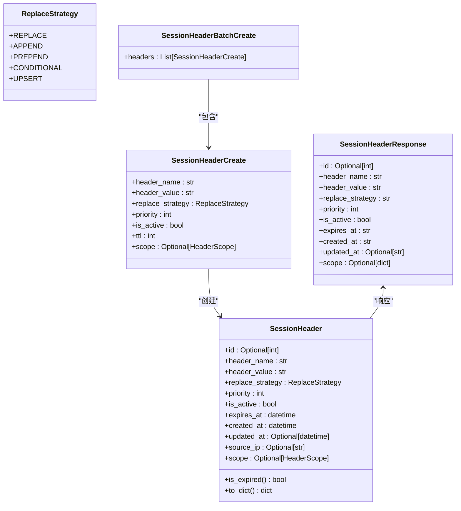
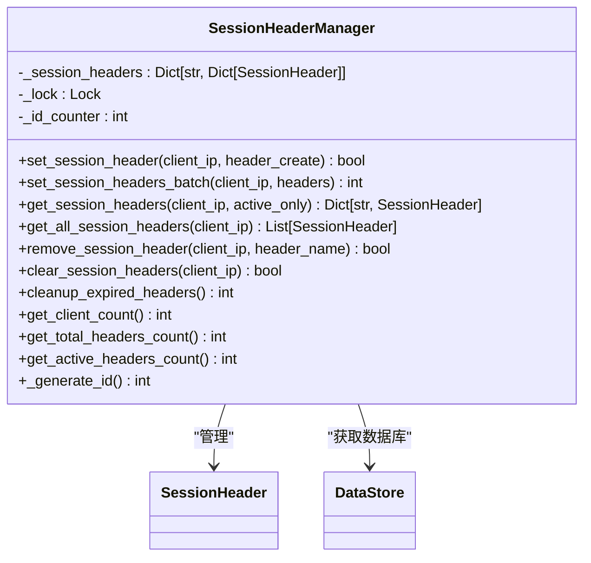
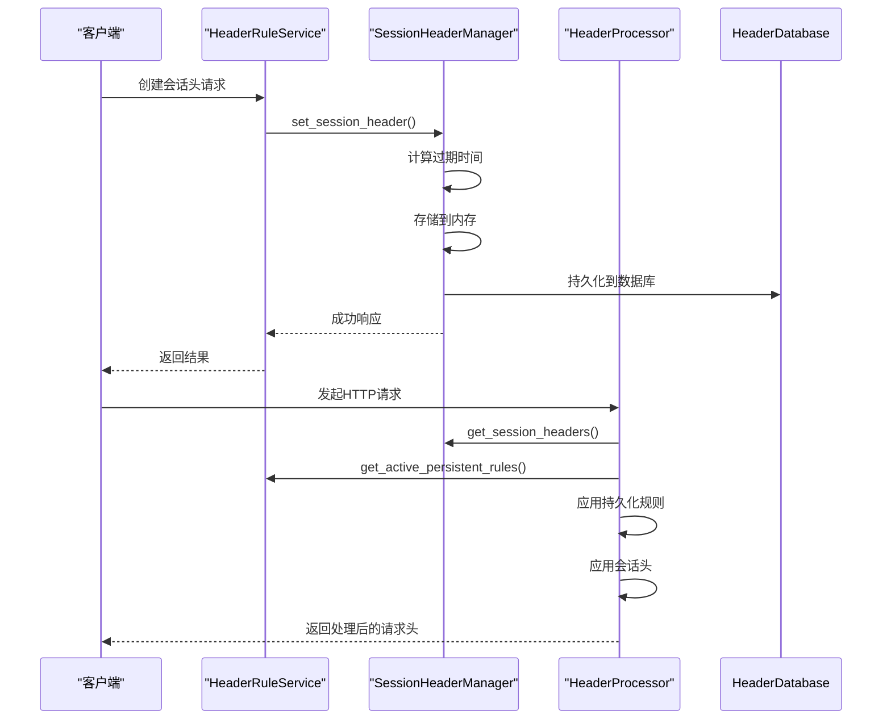
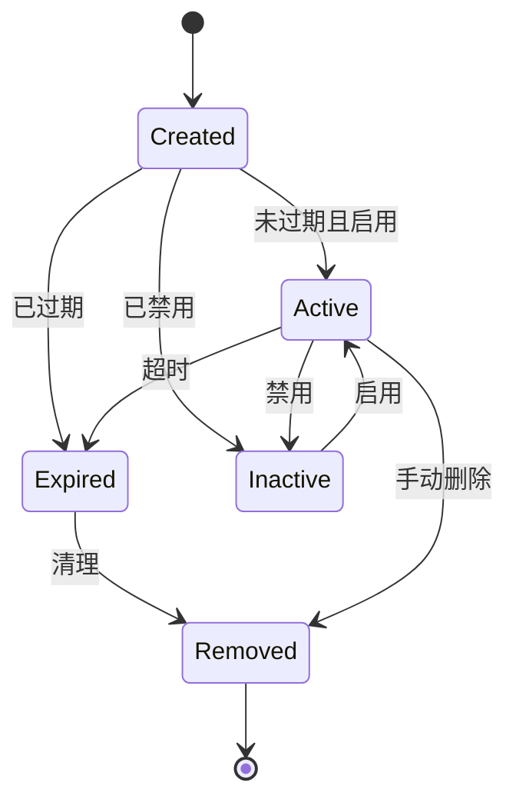
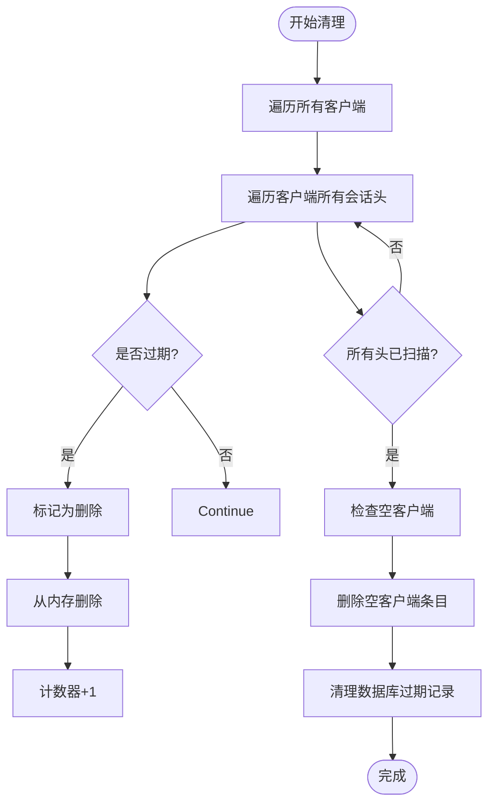
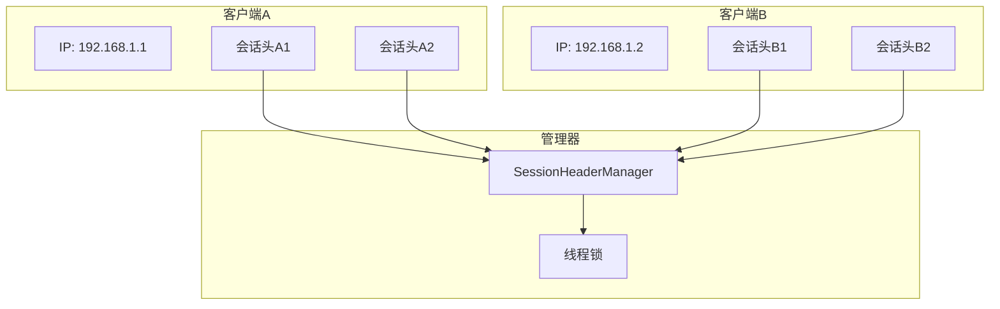

# 会话头管理

<cite>
**本文档引用的文件**  
- [SessionHeader.py](file://src/backEnd/model/SessionHeader.py)
- [session_header_manager.py](file://src/backEnd/utils/session_header_manager.py)
- [headerRuleService.py](file://src/backEnd/service/headerRuleService.py)
- [DataStore.py](file://src/backEnd/model/DataStore.py)
- [HeaderDatabase.py](file://src/backEnd/model/HeaderDatabase.py)
</cite>

## 更新摘要
**已更改内容**  
- 更新了会话头模型设计，新增了id、replace_strategy、is_active和updated_at字段
- 扩展了会话与持久化头规则协同机制，支持更灵活的请求头替换策略
- 增强了会话头管理器实现，支持状态管理和更新时间跟踪
- 更新了会话头序列化和反序列化格式，以支持新增字段
- 补充了会话头安全性考虑，增加了状态管理相关的安全措施

## 目录
1. [简介](#简介)
2. [会话头模型设计](#会话头模型设计)
3. [会话头管理器实现](#会话头管理器实现)
4. [会话与持久化头规则协同机制](#会话与持久化头规则协同机制)
5. [会话生命周期管理](#会话生命周期管理)
6. [内存存储与自动清理](#内存存储与自动清理)
7. [HTTP请求处理中的注入时机](#http请求处理中的注入时机)
8. [会话隔离与多任务并发访问](#会话隔离与多任务并发访问)
9. [序列化与反序列化格式](#序列化与反序列化格式)
10. [安全性考虑](#安全性考虑)
11. [扩展API与使用示例](#扩展api与使用示例)

## 简介
本文档详细描述了系统中会话头管理的完整实现机制。会话头管理器负责处理临时性、基于客户端IP的请求头，这些请求头具有有限的生存时间，用于在特定会话期间覆盖或补充默认的持久化请求头规则。该机制支持动态的请求头注入，为用户提供灵活的HTTP请求定制能力。

**会话头模型设计**  
- 会话ID：通过客户端IP地址隐式标识，并新增唯一标识id字段
- 临时请求头：存储在内存中，可动态增删
- 作用域：绑定到特定客户端IP地址
- 过期时间：基于TTL（生存时间）自动失效
- 新增字段：replace_strategy（替换策略）、is_active（是否启用）、updated_at（更新时间）

**会话与持久化规则协同**  
- 优先级处理：会话头优先于持久化规则应用
- 冲突解决：后应用的会话头会覆盖持久化规则的同名头
- 新增替换策略：支持REPLACE、APPEND、PREPEND、CONDITIONAL和UPSERT等多种替换策略

**会话生命周期管理**  
- 创建：通过API设置会话头，指定TTL
- 读取：按客户端IP获取所有有效会话头
- 删除：可删除单个或全部会话头
- 清理：定期清理过期会话头
- 状态管理：支持启用/禁用会话头

**安全性考虑**  
- 防止信息泄露：会话头不包含敏感信息
- 防止会话固定：基于IP而非令牌，避免固定攻击
- 状态管理：通过is_active字段控制会话头的启用状态

**Section sources**
- [SessionHeader.py](file://src/backEnd/model/SessionHeader.py#L1-L96)
- [session_header_manager.py](file://src/backEnd/utils/session_header_manager.py#L1-L312)

## 会话头模型设计

`SessionHeader` 类定义了会话性请求头的数据结构，基于 Pydantic 模型实现，确保数据的完整性和有效性。模型已更新，新增了id、replace_strategy、is_active和updated_at字段，支持更灵活的请求头替换策略和状态管理。

### 核心属性
- **id**: 唯一标识，用于数据库持久化和状态跟踪
- **header_name**: 请求头名称，长度限制1-200字符
- **header_value**: 请求头值，长度限制1-2000字符
- **replace_strategy**: 替换策略，支持多种替换方式
- **priority**: 优先级（0-100），用于排序和处理顺序
- **is_active**: 是否启用，用于控制会话头的激活状态
- **expires_at**: 过期时间，决定会话头的有效期
- **created_at**: 创建时间，记录会话头的生成时刻
- **updated_at**: 更新时间，记录会话头的最后修改时刻
- **source_ip**: 来源IP地址，标识会话归属
- **scope**: 作用域配置，可选，不填写时默认全局生效

### 替换策略枚举
- **REPLACE**: 完全替换现有值
- **APPEND**: 追加到现有值后面
- **PREPEND**: 前置到现有值前面
- **CONDITIONAL**: 条件性替换，当原值为空或包含特定模式时替换
- **UPSERT**: 如果存在则替换，如果不存在则新增

### 辅助模型
- `SessionHeaderCreate`: 用于创建会话头的请求模型，包含 `ttl`（生存时间）字段
- `SessionHeaderBatchCreate`: 批量创建会话头的请求模型
- `SessionHeaderResponse`: API响应模型，用于序列化输出



**Diagram sources**  
- [SessionHeader.py](file://src/backEnd/model/SessionHeader.py#L9-L96)

**Section sources**
- [SessionHeader.py](file://src/backEnd/model/SessionHeader.py#L9-L96)

## 会话头管理器实现

`SessionHeaderManager` 类实现了会话头的完整生命周期管理，采用内存存储结合数据库持久化的双重机制。管理器已增强，支持新增字段的处理和状态管理。

### 核心功能
- **内存存储**: 使用嵌套字典 `{client_ip: {header_name: SessionHeader}}` 结构
- **线程安全**: 通过 `threading.Lock` 保证并发访问安全
- **数据库同步**: 所有操作同时持久化到 SQLite 数据库
- **单例模式**: 通过 `DataStore.get_session_header_manager()` 全局访问
- **ID管理**: 使用 `_id_counter` 生成唯一标识
- **状态跟踪**: 记录会话头的创建和更新时间

### 数据结构
```python
self._session_headers: Dict[str, Dict[str, SessionHeader]] = defaultdict(dict)
```

### 关键方法
- `set_session_header()`: 设置单个会话头，支持新增字段
- `set_session_headers_batch()`: 批量设置会话头
- `get_session_headers()`: 获取客户端的有效会话头
- `remove_session_header()`: 删除指定会话头
- `clear_session_headers()`: 清除客户端所有会话头
- `cleanup_expired_headers()`: 清理过期会话头



**Diagram sources**  
- [session_header_manager.py](file://src/backEnd/utils/session_header_manager.py#L14-L312)

**Section sources**
- [session_header_manager.py](file://src/backEnd/utils/session_header_manager.py#L14-L312)

## 会话与持久化头规则协同机制

会话头与持久化头规则通过 `HeaderProcessor` 协同工作，形成完整的请求头处理流程。协同机制已扩展，支持更灵活的请求头替换策略。

### 优先级处理
1. **持久化规则**: 首先应用所有激活的持久化规则
2. **会话头**: 然后应用客户端的会话头，覆盖同名持久化头

### 冲突解决策略
- **后应用者优先**: 会话头总是覆盖持久化规则的同名头
- **UPSERT语义**: 无论头是否存在，都会被设置为新值
- **优先级排序**: 会话头按优先级升序处理，高优先级后执行
- **替换策略**: 支持多种替换策略，包括完全替换、追加、前置、条件性替换等

### 处理流程


**Diagram sources**  
- [session_header_manager.py](file://src/backEnd/utils/session_header_manager.py#L14-L312)
- [headerRuleService.py](file://src/backEnd/service/headerRuleService.py#L42-L879)
- [header_processor.py](file://src/backEnd/utils/header_processor.py#L11-L290)

**Section sources**
- [session_header_manager.py](file://src/backEnd/utils/session_header_manager.py#L14-L312)
- [headerRuleService.py](file://src/backEnd/service/headerRuleService.py#L42-L879)

## 会话生命周期管理

会话头的生命周期由创建、读取、更新、删除（CRUD）和自动清理组成。生命周期管理已增强，支持状态管理和更新时间跟踪。

### 创建流程
1. 客户端通过API发送 `SessionHeaderCreate` 请求
2. 管理器计算 `expires_at = now + ttl`
3. 在内存中创建 `SessionHeader` 实例
4. 同时写入内存存储和数据库
5. 生成唯一标识id

### 读取逻辑
- `get_session_headers()`: 仅返回未过期且启用的会话头
- `get_all_session_headers()`: 返回所有会话头（包括已过期）

### 删除操作
- `remove_session_header()`: 删除单个头，自动清理空客户端条目
- `clear_session_headers()`: 清除客户端所有会话头

### 更新操作
- 当更新现有会话头时，保留原有id，更新`updated_at`时间
- 支持部分字段更新，如仅更新值或策略

### 自动清理
- `cleanup_expired_headers()`: 扫描并删除所有过期会话头
- 定期执行：通过后台任务定期调用



**Diagram sources**  
- [session_header_manager.py](file://src/backEnd/utils/session_header_manager.py#L14-L312)

**Section sources**
- [session_header_manager.py](file://src/backEnd/utils/session_header_manager.py#L14-L312)

## 内存存储与自动清理

会话头采用内存为主、数据库为辅的存储策略，确保高性能和数据持久性。

### 内存存储结构
- **主键**: 客户端IP地址
- **二级键**: 请求头名称
- **值**: `SessionHeader` 对象
- **数据结构**: `defaultdict(dict)` 确保嵌套字典的自动创建

### 数据库持久化
- **表名**: `session_headers`
- **字段**: id, client_ip, header_name, header_value, replace_strategy, priority, is_active, expires_at, created_at, updated_at, scope_config
- **约束**: (client_ip, header_name) 唯一索引
- **索引**: expires_at 用于高效清理查询

### 自动清理机制
- **触发方式**: 定期调用 `cleanup_expired_headers()`
- **内存清理**: 遍历所有会话头，删除过期条目
- **数据库清理**: 执行 `DELETE FROM session_headers WHERE expires_at < ?`
- **性能优化**: 使用索引加速过期记录查询



**Diagram sources**  
- [session_header_manager.py](file://src/backEnd/utils/session_header_manager.py#L14-L312)
- [HeaderDatabase.py](file://src/backEnd/model/HeaderDatabase.py#L10-L125)

**Section sources**
- [session_header_manager.py](file://src/backEnd/utils/session_header_manager.py#L14-L312)
- [HeaderDatabase.py](file://src/backEnd/model/HeaderDatabase.py#L10-L125)

## HTTP请求处理中的注入时机

会话头在HTTP请求处理流程中通过 `HeaderProcessor` 注入，确保在请求发送前生效。

### 注入时机
1. **请求预处理阶段**: 在调用SQLMap引擎前
2. **头处理流程**: 作为 `process_headers()` 的一部分
3. **顺序**: 先应用持久化规则，后应用会话头

### 作用范围
- **特定客户端**: 仅对设置会话头的客户端IP生效
- **特定请求**: 每次HTTP请求都会检查并应用会话头
- **全局覆盖**: 会话头会覆盖任何其他来源的同名请求头

### 处理流程


**Diagram sources**  
- [header_processor.py](file://src/backEnd/utils/header_processor.py#L11-L290)

**Section sources**
- [header_processor.py](file://src/backEnd/utils/header_processor.py#L11-L290)

## 会话隔离与并发访问

系统通过客户端IP实现会话隔离，确保多用户并发访问的安全性。

### 会话隔离
- **隔离维度**: 客户端IP地址
- **数据隔离**: 每个IP有独立的会话头集合
- **无共享状态**: 不同IP的会话头完全独立

### 并发控制
- **线程锁**: 使用 `threading.Lock` 保护共享数据结构
- **原子操作**: 所有会话头操作在锁内执行
- **读写安全**: 防止并发读写导致的数据不一致

### 多任务并发
- **独立会话**: 每个任务使用自己的会话头
- **无干扰**: 任务间的会话头操作互不影响
- **可扩展**: 支持大量并发客户端



**Diagram sources**  
- [session_header_manager.py](file://src/backEnd/utils/session_header_manager.py#L14-L312)

**Section sources**
- [session_header_manager.py](file://src/backEnd/utils/session_header_manager.py#L14-L312)

## 序列化与反序列化格式

会话头在不同场景下采用不同的序列化格式，确保数据的一致性和兼容性。

### 内存表示
- **类型**: `SessionHeader` Pydantic 模型
- **时间格式**: Python `datetime` 对象

### 数据库存储
- **时间格式**: `YYYY-MM-DD HH:MM:SS` 字符串
- **编码**: UTF-8
- **SQL参数**: 使用 `?` 占位符防止注入

### API传输
- **请求格式**: JSON，包含 `ttl` 字段
- **响应格式**: JSON，时间字段为字符串
- **字段映射**: 
  - `expires_at`: 过期时间字符串
  - `created_at`: 创建时间字符串
  - `updated_at`: 更新时间字符串

### 序列化配置
```python
class Config:
    json_encoders = {
        datetime: lambda v: v.strftime('%Y-%m-%d %H:%M:%S') if v else None
    }
```

**Section sources**
- [SessionHeader.py](file://src/backEnd/model/SessionHeader.py#L19-L60)

## 安全性考虑

会话头管理机制包含多项安全措施，防止信息泄露和会话攻击。

### 防止信息泄露
- **最小权限**: 会话头仅包含必要的请求头信息
- **无敏感数据**: 不存储密码、令牌等敏感信息
- **IP绑定**: 会话头与客户端IP强绑定

### 防止会话固定攻击
- **无会话令牌**: 使用IP而非可预测的会话ID
- **自动过期**: 所有会话头都有明确的过期时间
- **及时清理**: 定期清理过期会话头

### 输入验证
- **字段验证**: 使用 Pydantic 验证字段长度和范围
- **头名称验证**: 确保请求头名称符合HTTP规范
- **TTL限制**: 60-86400秒的有效范围
- **状态验证**: 验证is_active字段的有效性

### 安全实践
- **参数化查询**: 防止SQL注入
- **日志脱敏**: 敏感信息不记录到日志
- **错误处理**: 不暴露内部实现细节
- **状态管理**: 通过is_active字段控制会话头的启用状态

**Section sources**
- [SessionHeader.py](file://src/backEnd/model/SessionHeader.py#L19-L60)
- [session_header_manager.py](file://src/backEnd/utils/session_header_manager.py#L14-L312)

## 扩展API与使用示例

系统提供了丰富的API接口，支持会话头的动态管理。

### 核心API
- **创建会话头**: `POST /api/session-headers`
- **批量创建**: `POST /api/session-headers/batch`
- **获取会话头**: `GET /api/session-headers`
- **删除会话头**: `DELETE /api/session-headers/{name}`

### 使用示例
```python
# 获取会话头管理器实例
manager = DataStore.get_session_header_manager()

# 创建会话头
header_create = SessionHeaderCreate(
    header_name="X-Custom-Header",
    header_value="custom-value",
    replace_strategy=ReplaceStrategy.APPEND,
    priority=50,
    is_active=True,
    ttl=3600  # 1小时
)

# 设置会话头
success = manager.set_session_header("192.168.1.1", header_create)

# 获取会话头
headers = manager.get_session_headers("192.168.1.1")
```

### 批量操作
```python
# 批量设置会话头
headers = [
    SessionHeaderCreate(header_name="A", header_value="1", replace_strategy=ReplaceStrategy.REPLACE, ttl=300),
    SessionHeaderCreate(header_name="B", header_value="2", replace_strategy=ReplaceStrategy.APPEND, ttl=600),
]
count = manager.set_session_headers_batch("192.168.1.1", headers)
```

**Section sources**
- [session_header_manager.py](file://src/backEnd/utils/session_header_manager.py#L14-L312)
- [DataStore.py](file://src/backEnd/model/DataStore.py#L24-L32)