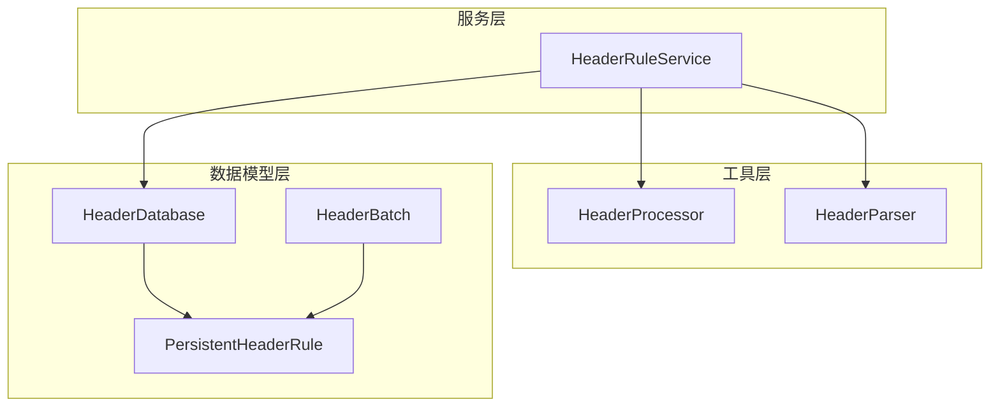
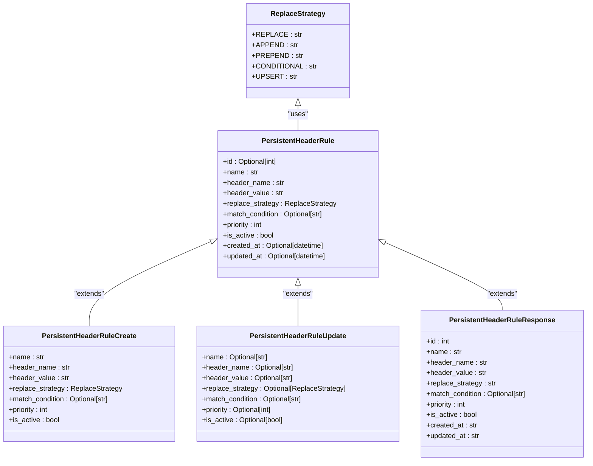
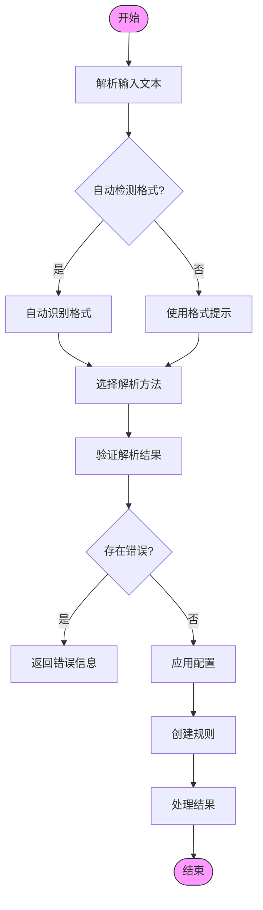
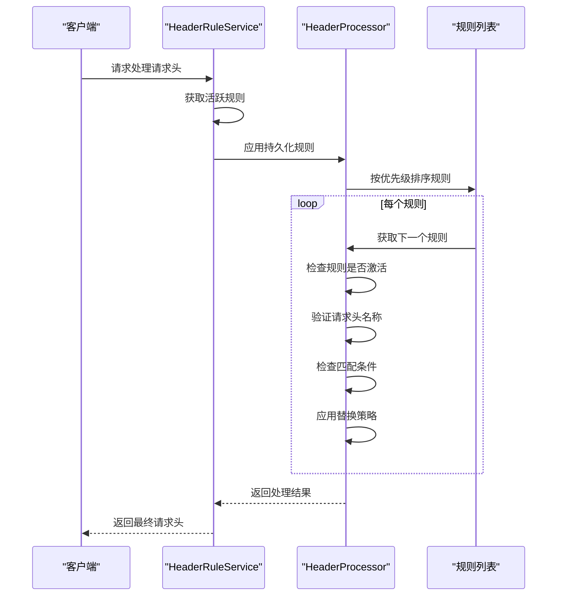
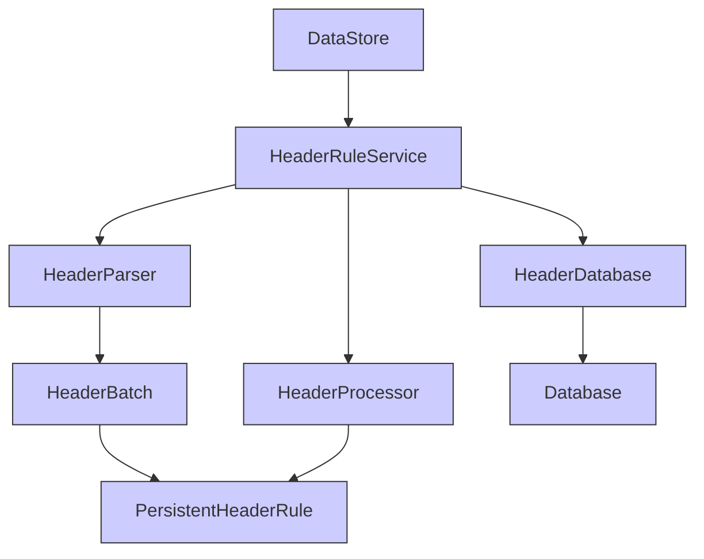

# 持久化头规则

<cite>
**Referenced Files in This Document**   
- [PersistentHeaderRule.py](file://src/backEnd/model/PersistentHeaderRule.py)
- [HeaderDatabase.py](file://src/backEnd/model/HeaderDatabase.py)
- [HeaderBatch.py](file://src/backEnd/model/HeaderBatch.py)
- [headerRuleService.py](file://src/backEnd/service/headerRuleService.py)
- [header_processor.py](file://src/backEnd/utils/header_processor.py)
- [header_parser.py](file://src/backEnd/utils/header_parser.py)
- [Database.py](file://src/backEnd/model/Database.py)
- [DataStore.py](file://src/backEnd/model/DataStore.py)
</cite>

## 目录
1. [介绍](#介绍)
2. [核心组件](#核心组件)
3. [架构概述](#架构概述)
4. [详细组件分析](#详细组件分析)
5. [依赖分析](#依赖分析)
6. [性能考虑](#性能考虑)
7. [故障排除指南](#故障排除指南)
8. [结论](#结论)

## 介绍
本文档详细阐述了持久化头规则系统的实现，该系统用于管理和应用HTTP请求头规则。系统通过`PersistentHeaderRule`类定义规则结构，利用`HeaderDatabase`类进行数据存储和管理，并通过`HeaderBatch`类实现批量操作功能。规则匹配算法基于优先级处理逻辑，确保高优先级规则优先应用。系统还提供了完整的数据库表结构设计和索引策略，支持规则版本控制和数据迁移方案。此外，文档还描述了规则冲突检测和解决机制，以及为开发者提供的自定义规则匹配逻辑的扩展接口。

## 核心组件
持久化头规则系统由三个核心组件构成：`PersistentHeaderRule`类负责定义规则的数据结构，`HeaderDatabase`类管理规则的存储和查询，`HeaderBatch`类实现批量操作机制。这些组件协同工作，提供完整的规则管理功能，包括创建、读取、更新、删除（CRUD）操作，以及批量导入、导出和更新规则的功能。

**Section sources**
- [PersistentHeaderRule.py](file://src/backEnd/model/PersistentHeaderRule.py#L15-L32)
- [HeaderDatabase.py](file://src/backEnd/model/HeaderDatabase.py#L10-L64)
- [HeaderBatch.py](file://src/backEnd/model/HeaderBatch.py#L0-L85)

## 架构概述
系统采用分层架构设计，包括数据模型层、服务层和工具层。数据模型层包含`PersistentHeaderRule`、`HeaderDatabase`和`HeaderBatch`等类，定义了核心数据结构。服务层由`HeaderRuleService`类组成，处理业务逻辑和API请求。工具层包括`HeaderProcessor`和`HeaderParser`等工具类，负责具体的处理和解析任务。各层之间通过清晰的接口进行通信，确保系统的可维护性和可扩展性。



**Diagram sources **
- [PersistentHeaderRule.py](file://src/backEnd/model/PersistentHeaderRule.py#L15-L32)
- [HeaderDatabase.py](file://src/backEnd/model/HeaderDatabase.py#L10-L64)
- [HeaderBatch.py](file://src/backEnd/model/HeaderBatch.py#L0-L85)
- [headerRuleService.py](file://src/backEnd/service/headerRuleService.py#L32-L718)
- [header_processor.py](file://src/backEnd/utils/header_processor.py#L10-L241)
- [header_parser.py](file://src/backEnd/utils/header_parser.py#L10-L342)

## 详细组件分析

### PersistentHeaderRule 类分析
`PersistentHeaderRule`类定义了持久化请求头规则的数据模型，包含规则ID、名称、匹配模式、请求头键值对、启用状态等属性。该类使用Pydantic模型进行数据验证，确保所有字段符合预定义的约束条件。

#### 类图


**Diagram sources **
- [PersistentHeaderRule.py](file://src/backEnd/model/PersistentHeaderRule.py#L6-L12)
- [PersistentHeaderRule.py](file://src/backEnd/model/PersistentHeaderRule.py#L15-L32)

### HeaderDatabase 类分析
`HeaderDatabase`类负责管理持久化头规则的存储、查询和索引优化。该类继承自`Database`基类，实现了数据库连接管理和SQL执行功能。通过创建适当的索引，系统能够高效地查询活跃规则和按优先级排序的规则。

#### 数据库表结构
```mermaid
erDiagram
PERSISTENT_HEADER_RULES {
int id PK
string name UK
string header_name
string header_value
string replace_strategy
string match_condition
int priority
int is_active
string created_at
string updated_at
}
SESSION_HEADERS {
int id PK
string client_ip
string header_name
string header_value
int priority
string expires_at
string created_at
string UNIQUE(client_ip, header_name)
}
PERSISTENT_HEADER_RULES ||--o{ SESSION_HEADERS : "manages"
```

**Diagram sources **
- [HeaderDatabase.py](file://src/backEnd/model/HeaderDatabase.py#L10-L64)
- [Database.py](file://src/backEnd/model/Database.py#L0-L98)

### HeaderBatch 类分析
`HeaderBatch`类实现了批量操作机制，支持批量导入、导出和更新规则的功能。该类定义了多种数据模型，用于处理不同格式的输入数据，包括HTTP报文格式、键值对格式、JSON格式和cURL命令格式。

#### 批量操作流程


**Diagram sources **
- [HeaderBatch.py](file://src/backEnd/model/HeaderBatch.py#L0-L85)
- [header_parser.py](file://src/backEnd/utils/header_parser.py#L10-L342)

### 规则匹配算法分析
规则匹配算法基于优先级处理逻辑，确保高优先级规则优先应用。系统首先按优先级降序排序所有活跃规则，然后依次应用每个规则到请求头。对于每个规则，系统检查匹配条件，如果条件满足，则根据替换策略更新请求头值。

#### 规则匹配流程


**Diagram sources **
- [headerRuleService.py](file://src/backEnd/service/headerRuleService.py#L32-L718)
- [header_processor.py](file://src/backEnd/utils/header_processor.py#L10-L241)

## 依赖分析
系统各组件之间存在明确的依赖关系。`HeaderRuleService`依赖于`HeaderDatabase`进行数据存储，依赖于`HeaderProcessor`和`HeaderParser`进行具体处理。`HeaderBatch`依赖于`PersistentHeaderRule`定义规则结构。`DataStore`作为全局数据存储，被多个组件引用以获取数据库连接和会话管理器。



**Diagram sources **
- [DataStore.py](file://src/backEnd/model/DataStore.py#L8-L32)
- [headerRuleService.py](file://src/backEnd/service/headerRuleService.py#L32-L718)
- [HeaderDatabase.py](file://src/backEnd/model/HeaderDatabase.py#L10-L64)
- [header_processor.py](file://src/backEnd/utils/header_processor.py#L10-L241)
- [header_parser.py](file://src/backEnd/utils/header_parser.py#L10-L342)
- [HeaderBatch.py](file://src/backEnd/model/HeaderBatch.py#L0-L85)
- [PersistentHeaderRule.py](file://src/backEnd/model/PersistentHeaderRule.py#L15-L32)
- [Database.py](file://src/backEnd/model/Database.py#L0-L98)

**Section sources**
- [DataStore.py](file://src/backEnd/model/DataStore.py#L0-L33)
- [headerRuleService.py](file://src/backEnd/service/headerRuleService.py#L32-L718)
- [HeaderDatabase.py](file://src/backEnd/model/HeaderDatabase.py#L0-L64)
- [header_processor.py](file://src/backEnd/utils/header_processor.py#L10-L241)
- [header_parser.py](file://src/backEnd/utils/header_parser.py#L10-L342)
- [HeaderBatch.py](file://src/backEnd/model/HeaderBatch.py#L0-L85)
- [PersistentHeaderRule.py](file://src/backEnd/model/PersistentHeaderRule.py#L0-L68)
- [Database.py](file://src/backEnd/model/Database.py#L0-L98)

## 性能考虑
系统通过多种方式优化性能。首先，在数据库层面创建了多个索引，包括`idx_header_rules_active`、`idx_header_rules_priority`和`idx_header_rules_name`，以加速常见查询操作。其次，规则处理过程中采用字典数据结构存储请求头，避免重复的字符串操作。此外，系统使用线程锁确保数据库连接的安全访问，防止并发问题。批量操作功能减少了数据库交互次数，提高了大规模规则处理的效率。

## 故障排除指南
当遇到规则不生效的问题时，应首先检查规则的启用状态和优先级设置。确保规则名称在数据库中唯一，且请求头名称符合HTTP规范。对于批量导入失败的情况，验证输入文本格式是否正确，并检查是否有重复的请求头名称。如果数据库连接出现问题，确认`headers.db`文件路径是否正确，并检查文件权限。在调试规则匹配逻辑时，可以使用预览功能查看处理结果，帮助识别问题所在。

**Section sources**
- [headerRuleService.py](file://src/backEnd/service/headerRuleService.py#L32-L718)
- [header_processor.py](file://src/backEnd/utils/header_processor.py#L10-L241)
- [header_parser.py](file://src/backEnd/utils/header_parser.py#L10-L342)

## 结论
持久化头规则系统提供了一套完整的解决方案，用于管理和应用HTTP请求头规则。通过精心设计的数据模型、高效的存储机制和灵活的批量操作功能，系统能够满足各种复杂的规则管理需求。规则匹配算法基于优先级处理逻辑，确保了规则应用的一致性和可预测性。系统的模块化设计和清晰的依赖关系使其易于维护和扩展，为开发者提供了强大的自定义能力。