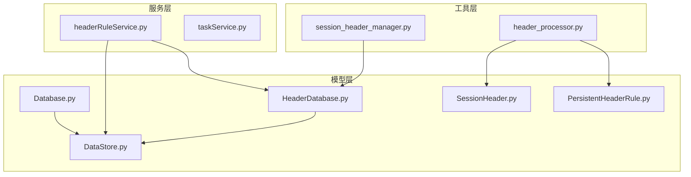
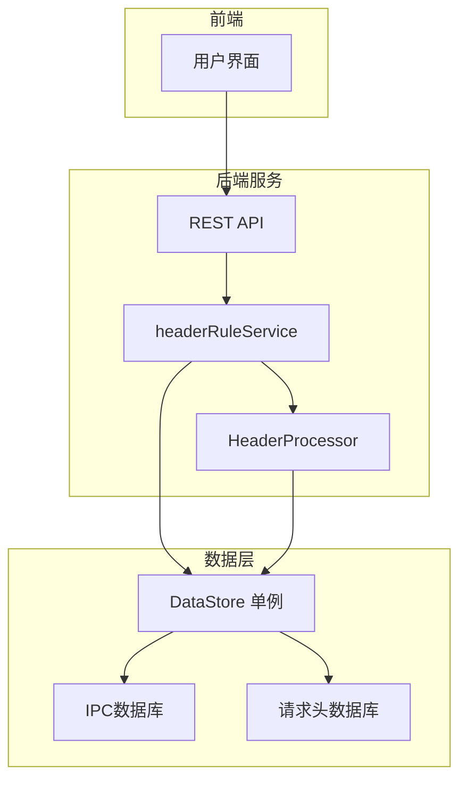
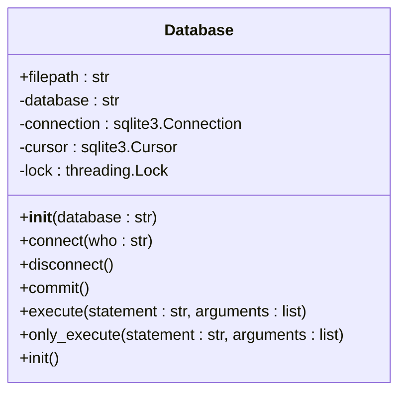
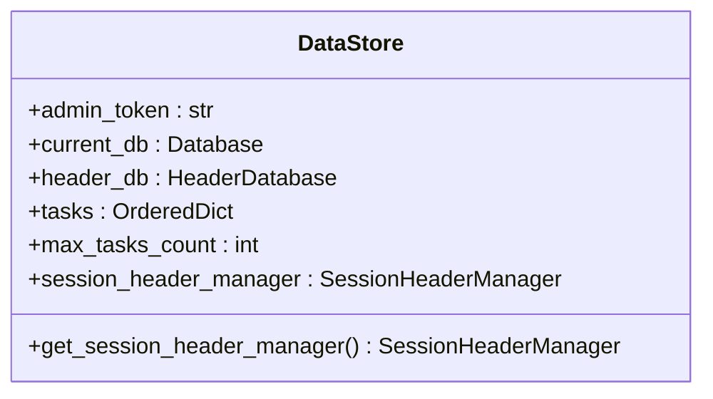
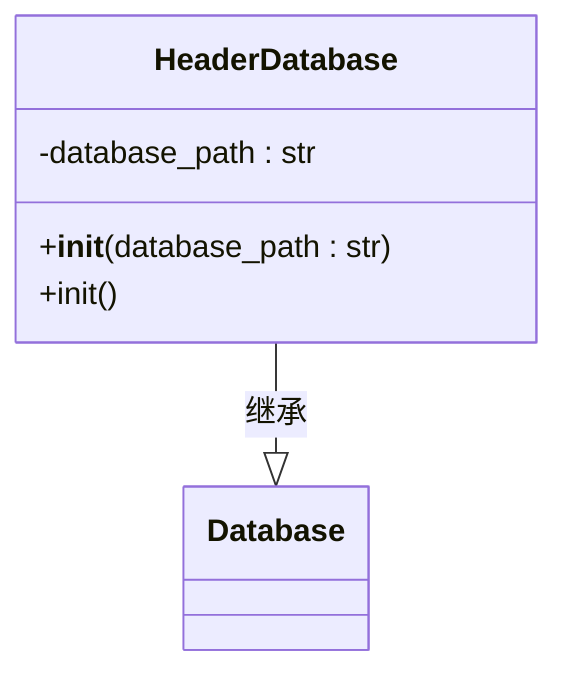
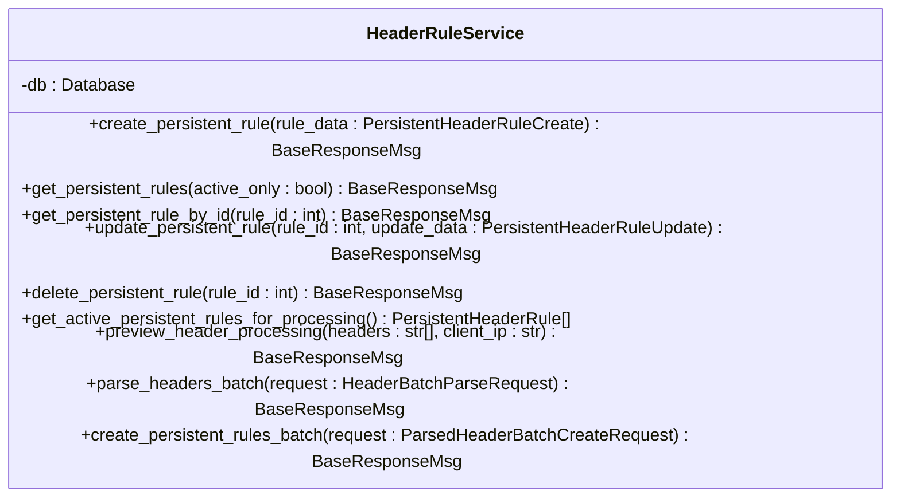
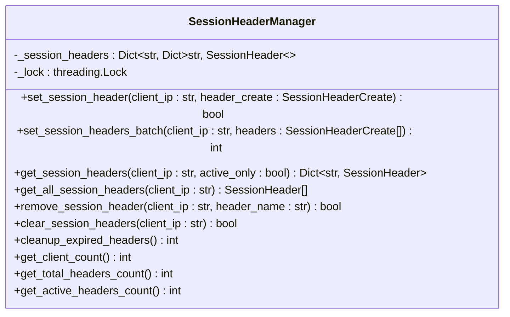
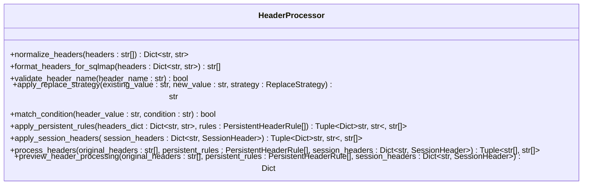
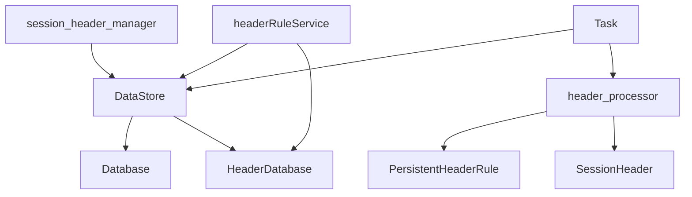

# 数据库操作

<cite>
**本文档引用的文件**   
- [Database.py](file://src/backEnd/model/Database.py)
- [DataStore.py](file://src/backEnd/model/DataStore.py)
- [HeaderDatabase.py](file://src/backEnd/model/HeaderDatabase.py)
- [PersistentHeaderRule.py](file://src/backEnd/model/PersistentHeaderRule.py)
- [SessionHeader.py](file://src/backEnd/model/SessionHeader.py)
- [headerRuleService.py](file://src/backEnd/service/headerRuleService.py)
- [session_header_manager.py](file://src/backEnd/utils/session_header_manager.py)
- [header_processor.py](file://src/backEnd/utils/header_processor.py)
</cite>

## 目录
1. [引言](#引言)
2. [项目结构](#项目结构)
3. [核心组件](#核心组件)
4. [架构概述](#架构概述)
5. [详细组件分析](#详细组件分析)
6. [依赖分析](#依赖分析)
7. [性能考虑](#性能考虑)
8. [故障排除指南](#故障排除指南)
9. [结论](#结论)

## 引言
本文档全面阐述了SQLMap WebUI系统的数据库操作机制，重点分析了Database类的IPC数据库管理、DataStore单例类的全局数据访问协调、数据库表结构设计、初始化与迁移方案、并发控制、备份恢复策略以及扩展接口。系统采用SQLite作为IPC通信数据库，通过连接池配置和事务管理确保多进程环境下的数据一致性。持久化请求头规则和会话性请求头分别存储在独立的数据库中，实现了配置的持久化和临时状态的管理。

## 项目结构
系统数据库相关模块主要位于`src/backEnd/model`和`src/backEnd/service`目录下，采用分层架构设计。`model`目录包含数据模型和数据库访问类，`service`目录包含业务逻辑服务，`utils`目录包含辅助工具类。

**图表来源**
- [Database.py](file://src/backEnd/model/Database.py)
- [DataStore.py](file://src/backEnd/model/DataStore.py)
- [HeaderDatabase.py](file://src/backEnd/model/HeaderDatabase.py)
- [headerRuleService.py](file://src/backEnd/service/headerRuleService.py)
- [session_header_manager.py](file://src/backEnd/utils/session_header_manager.py)
- [header_processor.py](file://src/backEnd/utils/header_processor.py)

**章节来源**
- [Database.py](file://src/backEnd/model/Database.py)
- [DataStore.py](file://src/backEnd/model/DataStore.py)
- [HeaderDatabase.py](file://src/backEnd/model/HeaderDatabase.py)

## 核心组件
系统数据库操作的核心组件包括`Database`类用于IPC通信，`HeaderDatabase`类用于管理请求头规则，`DataStore`类作为全局数据存储单例，以及`headerRuleService`提供持久化规则的CRUD操作。`SessionHeaderManager`实现会话性请求头的内存管理与持久化，`HeaderProcessor`负责应用请求头规则。

**章节来源**
- [Database.py](file://src/backEnd/model/Database.py)
- [DataStore.py](file://src/backEnd/model/DataStore.py)
- [HeaderDatabase.py](file://src/backEnd/model/HeaderDatabase.py)
- [headerRuleService.py](file://src/backEnd/service/headerRuleService.py)
- [session_header_manager.py](file://src/backEnd/utils/session_header_manager.py)

## 架构概述
系统采用双数据库架构，一个用于SQLMap引擎的IPC通信，另一个用于持久化存储请求头规则和会话状态。`DataStore`作为全局单例协调所有数据访问，`headerRuleService`封装业务逻辑，`HeaderProcessor`处理规则应用，形成清晰的分层架构。

**图表来源**
- [DataStore.py](file://src/backEnd/model/DataStore.py)
- [headerRuleService.py](file://src/backEnd/service/headerRuleService.py)
- [header_processor.py](file://src/backEnd/utils/header_processor.py)

## 详细组件分析

### Database类分析
`Database`类负责管理与SQLite数据库的连接，实现连接池和事务控制。通过`connect`方法建立连接，`execute`方法执行SQL语句并处理"database is locked"异常，`init`方法初始化数据库表结构。

**图表来源**
- [Database.py](file://src/backEnd/model/Database.py#L9-L98)

### DataStore单例分析
`DataStore`类作为全局数据存储中心，采用单例模式管理`current_db`和`header_db`两个数据库连接，以及任务列表和会话头管理器。`get_session_header_manager`方法确保会话头管理器的单例性。

**图表来源**
- [DataStore.py](file://src/backEnd/model/DataStore.py#L8-L32)

### HeaderDatabase类分析
`HeaderDatabase`类继承自`Database`，专门用于管理请求头相关的数据。`__init__`方法设置数据库路径，`init`方法创建持久化规则表和会话头表，并建立索引以提高查询性能。

**图表来源**
- [HeaderDatabase.py](file://src/backEnd/model/HeaderDatabase.py#L10-L64)

### headerRuleService服务分析
`headerRuleService`提供持久化请求头规则的完整CRUD操作。`create_persistent_rule`创建新规则，`get_persistent_rules`获取规则列表，`update_persistent_rule`更新规则，`delete_persistent_rule`删除规则，并包含批量操作和预览功能。

**图表来源**
- [headerRuleService.py](file://src/backEnd/service/headerRuleService.py#L13-L799)

### SessionHeaderManager分析
`SessionHeaderManager`在内存中管理会话性请求头，使用`_session_headers`字典存储，`_lock`确保线程安全。`set_session_header`设置会话头，`get_session_headers`获取会话头，`cleanup_expired_headers`清理过期头。

**图表来源**
- [session_header_manager.py](file://src/backEnd/utils/session_header_manager.py#L13-L259)

### HeaderProcessor分析
`HeaderProcessor`负责应用持久化规则和会话头到原始请求头。`process_headers`是主处理方法，`apply_persistent_rules`应用持久化规则，`apply_session_headers`应用会话头，`preview_header_processing`提供预览功能。

**图表来源**
- [header_processor.py](file://src/backEnd/utils/header_processor.py#L10-L241)

## 依赖分析
系统组件间存在清晰的依赖关系。`DataStore`依赖`Database`和`HeaderDatabase`，`headerRuleService`依赖`DataStore`和`HeaderDatabase`，`SessionHeaderManager`依赖`DataStore`，`HeaderProcessor`依赖`PersistentHeaderRule`和`SessionHeader`。

**图表来源**
- [DataStore.py](file://src/backEnd/model/DataStore.py)
- [Database.py](file://src/backEnd/model/Database.py)
- [HeaderDatabase.py](file://src/backEnd/model/HeaderDatabase.py)
- [headerRuleService.py](file://src/backEnd/service/headerRuleService.py)
- [session_header_manager.py](file://src/backEnd/utils/session_header_manager.py)
- [header_processor.py](file://src/backEnd/utils/header_processor.py)
- [Task.py](file://src/backEnd/model/Task.py)

## 性能考虑
系统通过多种机制优化数据库性能。在`Database`类中，`execute`方法使用`threading.Lock`和重试机制处理并发访问。`HeaderDatabase`的`init`方法创建了多个索引以提高查询效率。`SessionHeaderManager`在内存中缓存会话头，减少数据库访问。`HeaderProcessor`按优先级排序规则，确保高效处理。

## 故障排除指南
常见数据库问题包括连接失败、表不存在和并发冲突。确保`Database.filepath`正确设置，调用`init`方法初始化表结构，使用`execute`方法的重试机制处理"database is locked"异常。对于会话头管理，定期调用`cleanup_expired_headers`清理过期数据。

**章节来源**
- [Database.py](file://src/backEnd/model/Database.py#L45-L67)
- [session_header_manager.py](file://src/backEnd/utils/session_header_manager.py#L150-L180)

## 结论
本文档详细分析了SQLMap WebUI系统的数据库操作机制，涵盖了从连接管理、表结构设计到并发控制和性能优化的各个方面。系统采用清晰的分层架构和单例模式，确保了数据访问的一致性和高效性。开发者可以基于此文档理解和扩展系统的数据访问功能。