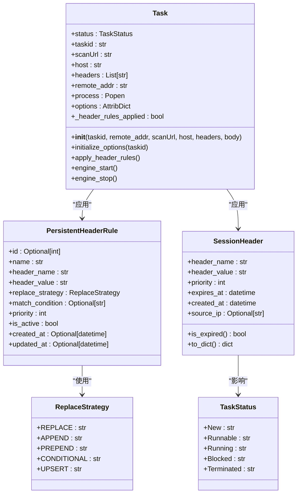
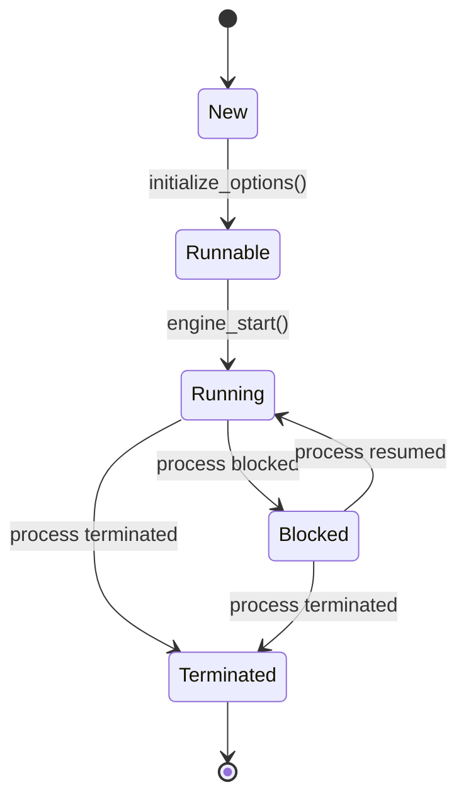
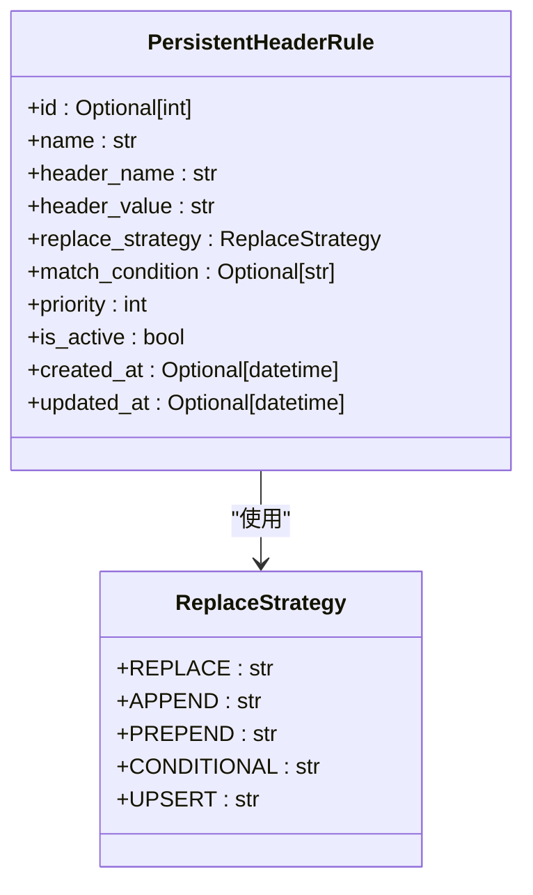
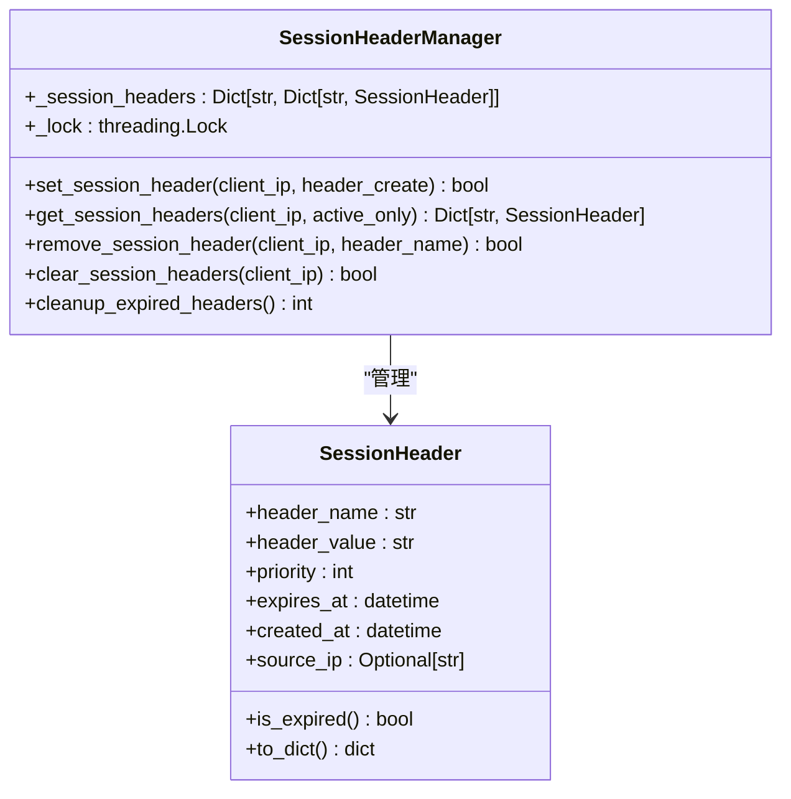
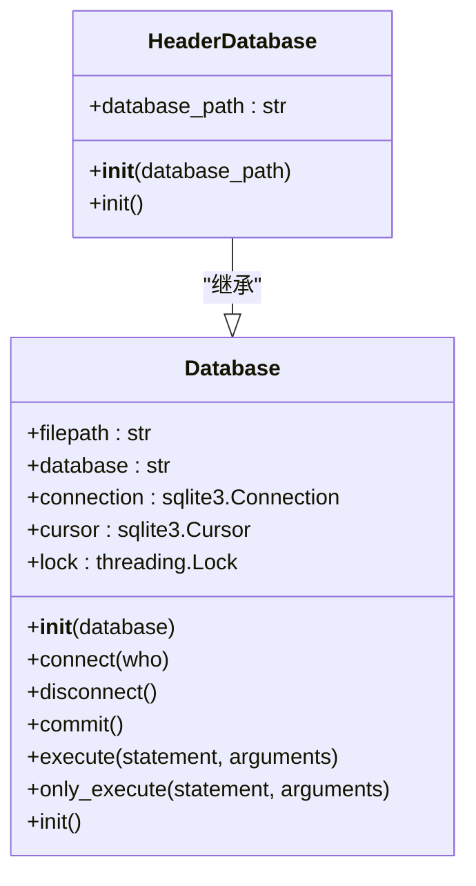
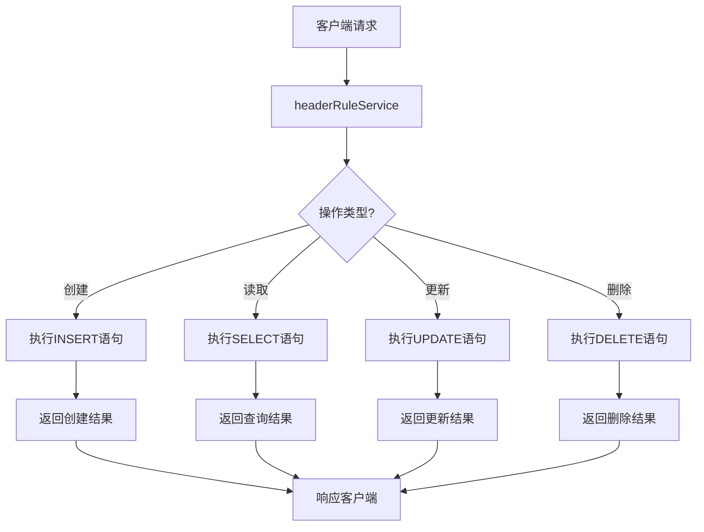
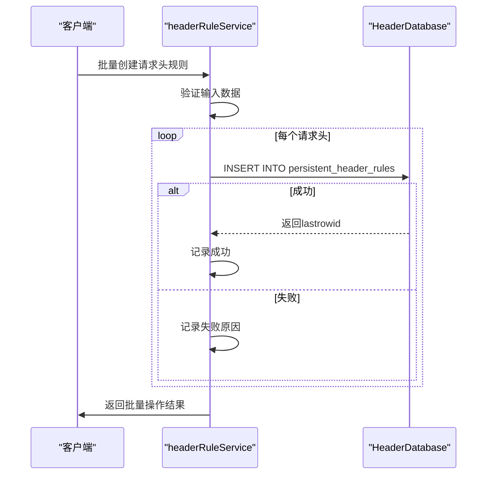

# 数据模型与数据库

<cite>
**Referenced Files in This Document**   
- [Task.py](file://src/backEnd/model/Task.py)
- [PersistentHeaderRule.py](file://src/backEnd/model/PersistentHeaderRule.py)
- [SessionHeader.py](file://src/backEnd/model/SessionHeader.py)
- [Database.py](file://src/backEnd/model/Database.py)
- [HeaderDatabase.py](file://src/backEnd/model/HeaderDatabase.py)
- [headerRuleService.py](file://src/backEnd/service/headerRuleService.py)
- [header_processor.py](file://src/backEnd/utils/header_processor.py)
- [session_header_manager.py](file://src/backEnd/utils/session_header_manager.py)
- [DataStore.py](file://src/backEnd/model/DataStore.py)
- [HeaderBatch.py](file://src/backEnd/model/HeaderBatch.py)
- [TaskStatus.py](file://src/backEnd/model/TaskStatus.py)
</cite>

## 目录
1. [引言](#引言)
2. [核心数据模型](#核心数据模型)
3. [实体关系图(ERD)](#实体关系图erd)
4. [Task实体详细说明](#task实体详细说明)
5. [PersistentHeaderRule模型](#persistentheaderrule模型)
6. [SessionHeader模型](#sessionheader模型)
7. [数据库管理机制](#数据库管理机制)
8. [数据访问模式与查询优化](#数据访问模式与查询优化)
9. [事务管理与故障恢复](#事务管理与故障恢复)
10. [数据模型扩展指导](#数据模型扩展指导)

## 引言

本文档详细阐述了sqlmapWebUI项目的数据模型与数据库架构。系统采用SQLite作为持久化存储方案，通过两个独立的数据库文件分别管理任务执行数据和请求头规则数据。核心数据模型围绕`Task`（任务）、`PersistentHeaderRule`（持久化请求头规则）和`SessionHeader`（会话性请求头）三个实体构建，实现了灵活的请求头处理机制。数据访问通过`Database`和`HeaderDatabase`类进行封装，提供了线程安全的连接管理和SQL执行功能。整个数据架构设计注重性能、可靠性和可扩展性，支持高并发场景下的稳定运行。

**Section sources**
- [Task.py](file://src/backEnd/model/Task.py#L1-L206)
- [PersistentHeaderRule.py](file://src/backEnd/model/PersistentHeaderRule.py#L1-L68)
- [SessionHeader.py](file://src/backEnd/model/SessionHeader.py#L1-L61)
- [Database.py](file://src/backEnd/model/Database.py#L1-L98)
- [HeaderDatabase.py](file://src/backEnd/model/HeaderDatabase.py#L1-L64)

## 核心数据模型

系统的核心数据模型由三个主要实体构成：`Task`、`PersistentHeaderRule`和`SessionHeader`。`Task`实体代表一个sqlmap扫描任务，包含任务ID、扫描URL、请求头等信息，其生命周期由`TaskStatus`枚举管理。`PersistentHeaderRule`实体用于存储持久化的请求头规则，这些规则在数据库中持久化，重启后依然有效。`SessionHeader`实体则管理会话性的请求头，存储在内存中并可选择性地持久化到数据库，具有过期时间特性。这三个实体通过`HeaderProcessor`处理器协同工作，在任务执行前动态应用请求头规则，实现了灵活的请求头管理策略。



**Diagram sources **
- [Task.py](file://src/backEnd/model/Task.py#L18-L205)
- [PersistentHeaderRule.py](file://src/backEnd/model/PersistentHeaderRule.py#L15-L32)
- [SessionHeader.py](file://src/backEnd/model/SessionHeader.py#L5-L32)
- [TaskStatus.py](file://src/backEnd/model/TaskStatus.py#L3-L8)

**Section sources**
- [Task.py](file://src/backEnd/model/Task.py#L1-L206)
- [PersistentHeaderRule.py](file://src/backEnd/model/PersistentHeaderRule.py#L1-L68)
- [SessionHeader.py](file://src/backEnd/model/SessionHeader.py#L1-L61)

## 实体关系图(ERD)

以下实体关系图展示了系统中主要数据实体之间的关系。`persistent_header_rules`表存储持久化的请求头规则，`session_headers`表存储会话性的请求头。两个表都通过`client_ip`字段与客户端关联，但`session_headers`表还包含`expires_at`字段来管理会话的生命周期。`persistent_header_rules`表的`is_active`字段用于启用/禁用规则，`priority`字段用于确定规则的执行顺序。这种设计支持了灵活的请求头管理策略，允许用户同时使用持久化和临时的请求头规则。

```mermaid
erDiagram
persistent_header_rules {
int id PK
string name UK
string header_name
string header_value
string replace_strategy
string match_condition
int priority
int is_active
string created_at
string updated_at
}
session_headers {
int id PK
string client_ip
string header_name
string header_value
int priority
string expires_at
string created_at
string UNIQUE(client_ip, header_name)
}
persistent_header_rules ||--o{ session_headers : "无直接关联"
```

**Diagram sources **
- [HeaderDatabase.py](file://src/backEnd/model/HeaderDatabase.py#L1-L64)
- [PersistentHeaderRule.py](file://src/backEnd/model/PersistentHeaderRule.py#L15-L32)
- [SessionHeader.py](file://src/backEnd/model/SessionHeader.py#L5-L32)

**Section sources**
- [HeaderDatabase.py](file://src/backEnd/model/HeaderDatabase.py#L1-L64)

## Task实体详细说明

`Task`实体是系统的核心，代表一个sqlmap扫描任务。它在初始化时接收任务ID、远程地址、扫描URL、主机、请求头和请求体等参数。任务的状态由`TaskStatus`枚举管理，包括`New`、`Runnable`、`Running`、`Blocked`和`Terminated`五种状态。`Task`类的关键方法包括`initialize_options`用于初始化sqlmap的配置选项，`apply_header_rules`用于在任务启动前应用请求头规则，以及`engine_start`、`engine_stop`等方法用于控制任务的生命周期。`Task`实体通过`options`属性与sqlmap引擎进行交互，将配置选项持久化到临时配置文件中。



**Diagram sources **
- [Task.py](file://src/backEnd/model/Task.py#L18-L205)
- [TaskStatus.py](file://src/backEnd/model/TaskStatus.py#L3-L8)

**Section sources**
- [Task.py](file://src/backEnd/model/Task.py#L1-L206)
- [TaskStatus.py](file://src/backEnd/model/TaskStatus.py#L1-L8)

## PersistentHeaderRule模型

`PersistentHeaderRule`模型用于实现持久化请求头规则的存储和检索。该模型定义了规则的名称、请求头名称、请求头值、替换策略、匹配条件、优先级、启用状态以及创建和更新时间戳。替换策略由`ReplaceStrategy`枚举定义，包括`REPLACE`（完全替换）、`APPEND`（追加）、`PREPEND`（前置）、`CONDITIONAL`（条件性替换）和`UPSERT`（存在则替换，不存在则新增）五种。规则通过`headerRuleService`服务进行CRUD操作，并在`HeaderDatabase`中持久化存储。`PersistentHeaderRule`的`is_active`字段允许用户动态启用或禁用规则，而`priority`字段决定了多个规则的执行顺序。



**Diagram sources **
- [PersistentHeaderRule.py](file://src/backEnd/model/PersistentHeaderRule.py#L15-L32)
- [PersistentHeaderRule.py](file://src/backEnd/model/PersistentHeaderRule.py#L1-L68)

**Section sources**
- [PersistentHeaderRule.py](file://src/backEnd/model/PersistentHeaderRule.py#L1-L68)
- [headerRuleService.py](file://src/backEnd/service/headerRuleService.py#L1-L799)

## SessionHeader模型

`SessionHeader`模型在会话级别请求头处理中扮演关键角色。与持久化规则不同，会话性请求头是临时的，通常与特定的客户端IP地址关联，并具有过期时间。该模型定义了请求头名称、值、优先级、过期时间、创建时间和来源IP等字段。`SessionHeaderManager`负责管理这些会话头，提供线程安全的增删改查操作。会话头在内存中存储，但也可以选择性地持久化到`session_headers`表中，以支持服务重启后的数据恢复。`SessionHeader`的`is_expired`方法用于检查请求头是否已过期，`to_dict`方法用于将其转换为字典格式以便序列化。



**Diagram sources **
- [SessionHeader.py](file://src/backEnd/model/SessionHeader.py#L5-L32)
- [session_header_manager.py](file://src/backEnd/utils/session_header_manager.py#L13-L259)

**Section sources**
- [SessionHeader.py](file://src/backEnd/model/SessionHeader.py#L1-L61)
- [session_header_manager.py](file://src/backEnd/utils/session_header_manager.py#L1-L259)

## 数据库管理机制

`Database`和`HeaderDatabase`类共同实现了系统的IPC数据库管理机制。`Database`类负责管理sqlmap任务的执行数据，而`HeaderDatabase`类则专门管理请求头规则数据。两者都继承自同一个基类，实现了线程安全的连接管理。`connect`方法使用`sqlite3.connect`创建数据库连接，并设置`check_same_thread=False`以支持多线程访问。`execute`方法通过`threading.Lock`确保SQL语句的串行执行，避免了SQLite的"database is locked"错误。`init`方法负责创建数据库表和索引，为系统初始化提供支持。这种双数据库设计实现了关注点分离，提高了系统的可维护性和性能。



**Diagram sources **
- [Database.py](file://src/backEnd/model/Database.py#L9-L98)
- [HeaderDatabase.py](file://src/backEnd/model/HeaderDatabase.py#L1-L64)

**Section sources**
- [Database.py](file://src/backEnd/model/Database.py#L1-L98)
- [HeaderDatabase.py](file://src/backEnd/model/HeaderDatabase.py#L1-L64)

## 数据访问模式与查询优化

系统的数据访问模式遵循典型的CRUD（创建、读取、更新、删除）原则。`headerRuleService`服务层封装了对`PersistentHeaderRule`和`SessionHeader`的所有数据访问操作，提供了清晰的业务接口。查询优化主要通过索引实现：`persistent_header_rules`表在`is_active`、`priority`和`header_name`字段上创建了索引，以加速活跃规则的查询和按优先级排序的操作。`session_headers`表在`client_ip`和`expires_at`字段上创建了索引，优化了按客户端查询和过期清理的性能。`HeaderProcessor`类采用批处理模式，一次性应用所有匹配的规则，减少了数据库访问次数，提高了处理效率。



**Diagram sources **
- [headerRuleService.py](file://src/backEnd/service/headerRuleService.py#L1-L799)
- [header_processor.py](file://src/backEnd/utils/header_processor.py#L1-L241)

**Section sources**
- [headerRuleService.py](file://src/backEnd/service/headerRuleService.py#L1-L799)
- [header_processor.py](file://src/backEnd/utils/header_processor.py#L1-L241)

## 事务管理与故障恢复

系统通过SQLite的自动提交模式和Python的异常处理机制实现了基本的事务管理。`execute`方法在执行SQL语句时使用`try-except`块捕获`sqlite3.OperationalError`异常，特别是"database is locked"错误，并通过`time.sleep(1)`进行重试，实现了简单的故障恢复。对于需要保证原子性的操作，如批量创建请求头规则，`headerRuleService`会在一个循环中逐个处理每个规则，并记录成功和失败的数量，确保部分成功的结果也能被正确报告。`SessionHeaderManager`的`cleanup_expired_headers`方法定期清理过期的会话头，既释放了内存资源，也减少了数据库的存储负担，提高了系统的长期稳定性。



**Diagram sources **
- [headerRuleService.py](file://src/backEnd/service/headerRuleService.py#L1-L799)
- [HeaderDatabase.py](file://src/backEnd/model/HeaderDatabase.py#L1-L64)

**Section sources**
- [headerRuleService.py](file://src/backEnd/service/headerRuleService.py#L1-L799)
- [HeaderDatabase.py](file://src/backEnd/model/HeaderDatabase.py#L1-L64)

## 数据模型扩展指导

在扩展数据模型时，应遵循以下指导原则以确保兼容性。首先，任何新字段都应使用`Optional`类型并提供合理的默认值，以保证向后兼容。其次，数据库表的修改应通过`init`方法中的`CREATE TABLE IF NOT EXISTS`和`ALTER TABLE`语句实现，避免因表结构变化导致服务启动失败。对于新的枚举类型，应继承`str, Enum`并定义清晰的值，以便于序列化和反序列化。最后，任何对`DataStore`全局状态的修改都应使用`threading.Lock`进行同步，防止多线程环境下的数据竞争。这些原则确保了系统在演进过程中能够平稳过渡，最小化对现有功能的影响。

**Section sources**
- [PersistentHeaderRule.py](file://src/backEnd/model/PersistentHeaderRule.py#L1-L68)
- [SessionHeader.py](file://src/backEnd/model/SessionHeader.py#L1-L61)
- [DataStore.py](file://src/backEnd/model/DataStore.py#L1-L33)