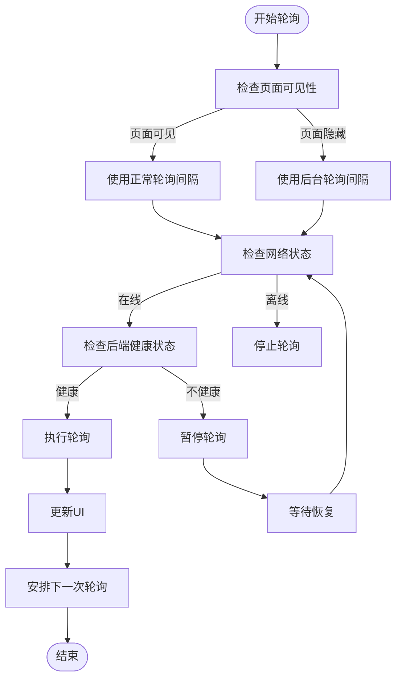
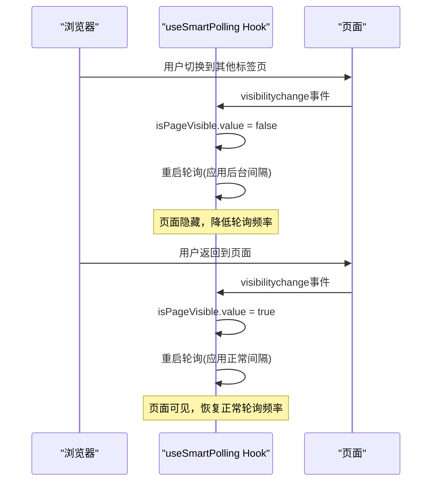
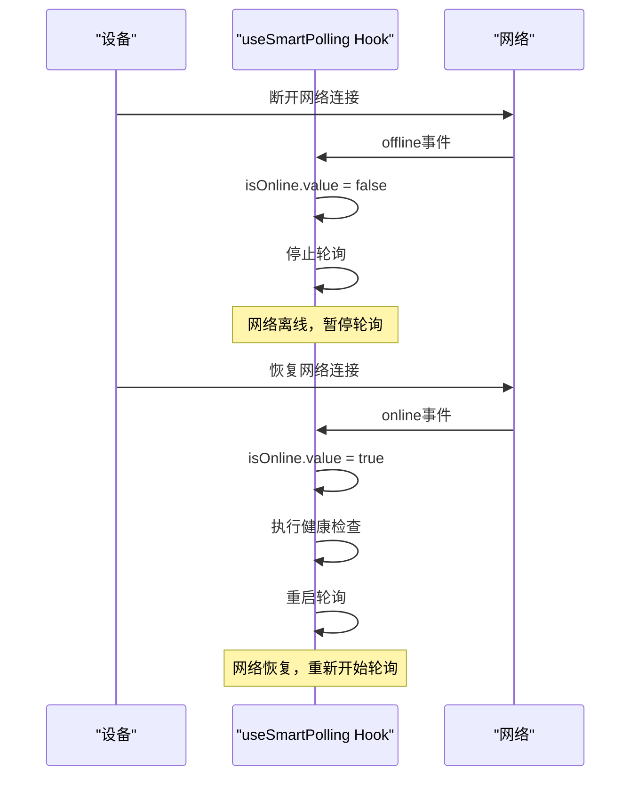
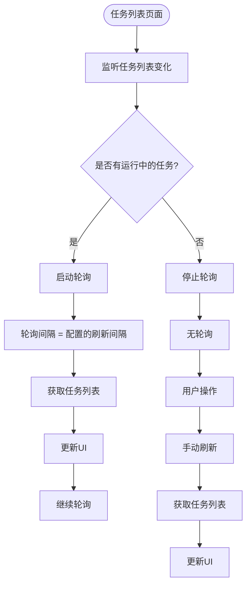
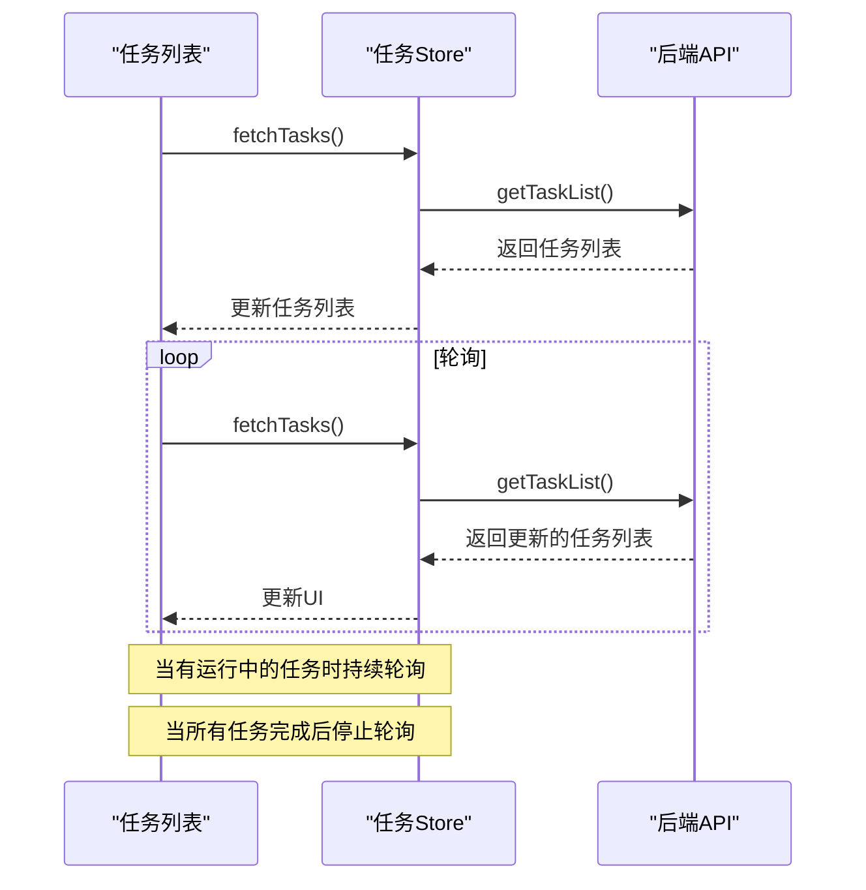
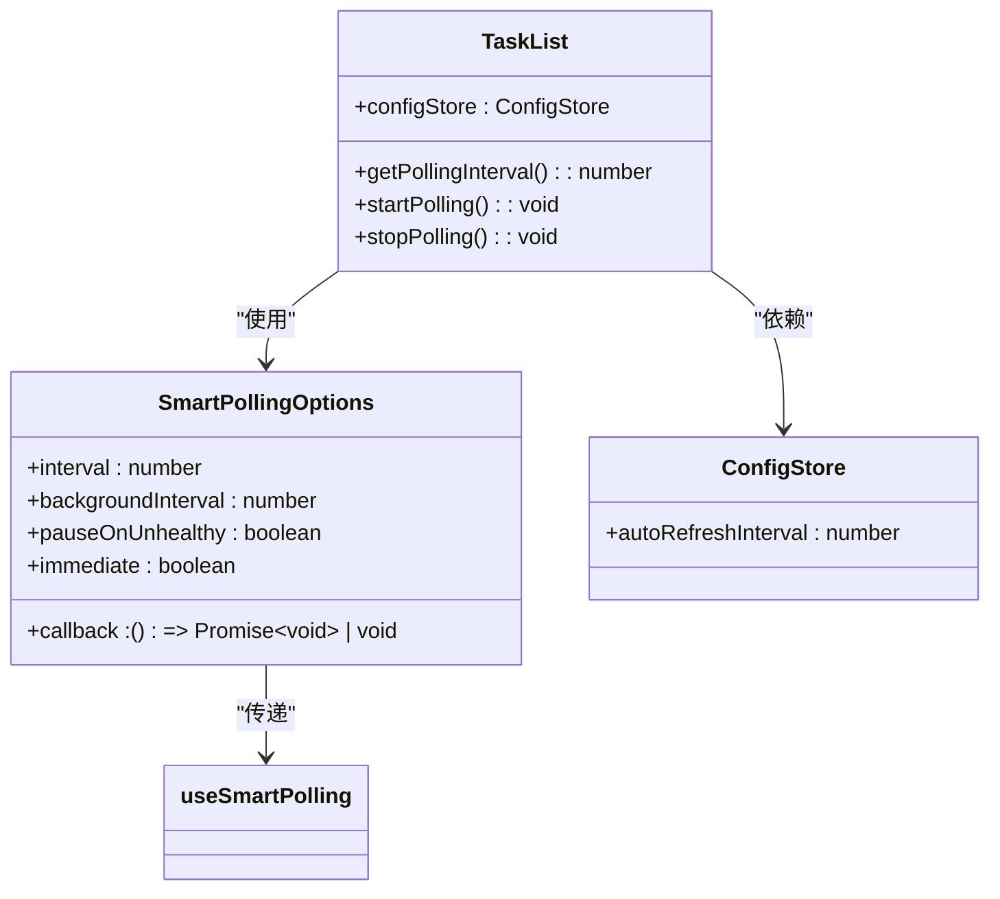
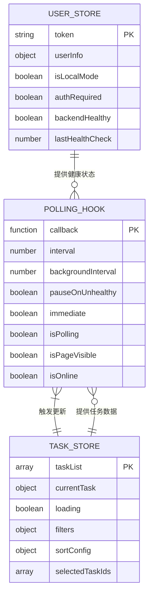
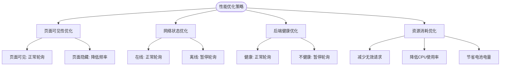
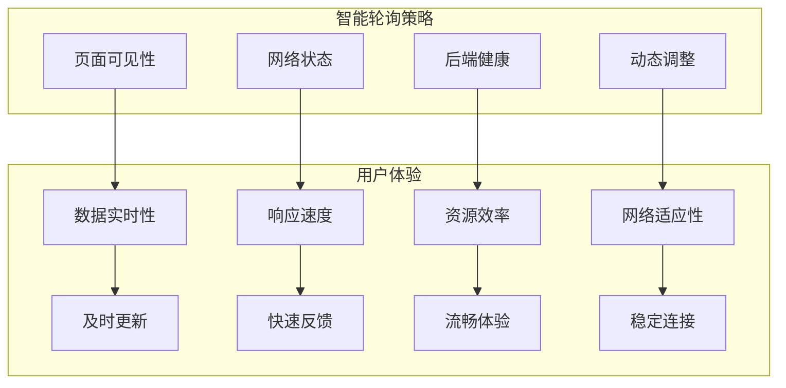

# 智能轮询策略

<cite>
**Referenced Files in This Document**   
- [useSmartPolling.ts](file://src/frontEnd/src/utils/useSmartPolling.ts)
- [TaskList.vue](file://src/frontEnd/src/views/TaskList/index.vue)
- [task.ts](file://src/frontEnd/src/stores/task.ts)
- [auth.ts](file://src/frontEnd/src/stores/auth.ts)
</cite>

## 目录
1. [引言](#引言)
2. [智能轮询策略实现原理](#智能轮询策略实现原理)
3. [核心功能分析](#核心功能分析)
4. [在任务列表中的应用](#在任务列表中的应用)
5. [配置选项详解](#配置选项详解)
6. [状态管理与依赖关系](#状态管理与依赖关系)
7. [性能优化与用户体验](#性能优化与用户体验)
8. [结论](#结论)

## 引言

智能轮询策略是一种动态调整数据刷新频率的机制，旨在优化用户体验和系统资源利用。本文档详细说明了`useSmartPolling` Hook的实现原理，该Hook根据页面可见性、网络状态和后端健康检查来动态调整轮询频率。文档还描述了其在任务列表等页面中的应用方式和配置选项，为开发者提供全面的使用指南。

## 智能轮询策略实现原理

智能轮询策略的核心是`useSmartPolling` Hook，它通过综合考虑多种因素来动态调整轮询频率。该策略实现了自适应的轮询机制，能够在不同场景下自动优化轮询间隔，从而在保证数据实时性的同时，最大限度地减少不必要的网络请求和系统资源消耗。



**Diagram sources**
- [useSmartPolling.ts](file://src/frontEnd/src/utils/useSmartPolling.ts#L20-L201)

**Section sources**
- [useSmartPolling.ts](file://src/frontEnd/src/utils/useSmartPolling.ts#L1-L202)

## 核心功能分析

`useSmartPolling` Hook实现了多个核心功能，包括页面可见性监听、网络状态监听和后端健康检查。这些功能共同构成了智能轮询策略的基础，使其能够根据环境变化自动调整行为。

### 页面可见性监听

页面可见性监听功能通过`document.hidden`属性检测页面是否处于可见状态。当用户切换到其他标签页或最小化浏览器时，页面变为不可见，此时轮询策略会自动降低轮询频率，以节省系统资源。



**Diagram sources**
- [useSmartPolling.ts](file://src/frontEnd/src/utils/useSmartPolling.ts#L130-L154)

**Section sources**
- [useSmartPolling.ts](file://src/frontEnd/src/utils/useSmartPolling.ts#L130-L154)

### 网络状态监听

网络状态监听功能通过`navigator.onLine`属性检测设备的网络连接状态。当设备离线时，轮询会自动暂停，避免不必要的请求失败；当网络恢复时，会自动重启轮询并执行健康检查。



**Diagram sources**
- [useSmartPolling.ts](file://src/frontEnd/src/utils/useSmartPolling.ts#L156-L180)

**Section sources**
- [useSmartPolling.ts](file://src/frontEnd/src/utils/useSmartPolling.ts#L156-L180)

### 后端健康检查

后端健康检查功能通过`authStore.backendHealthy`状态判断后端服务是否健康。当后端服务不健康时，根据配置决定是否暂停轮询，避免在服务异常期间产生大量无效请求。

```mermaid
classDiagram
class useSmartPolling {
+callback : () => Promise~void~ | void
+interval : number
+backgroundInterval : number
+pauseOnUnhealthy : boolean
+immediate : boolean
+isPolling : Ref~boolean~
+isPageVisible : Ref~boolean~
+isOnline : Ref~boolean~
+getCurrentInterval() : number
+shouldPoll() : boolean
+executePoll() : Promise~void~
+startPolling() : void
+stopPolling() : void
+restartPolling() : void
+handleVisibilityChange() : void
+handleOnlineStatusChange() : void
}
class AuthStore {
+backendHealthy : Ref~boolean~
+checkBackendHealth() : Promise~boolean~
+resetHealthCheck() : void
}
useSmartPolling --> AuthStore : "依赖"
useSmartPolling --> "Vue Composition API" : "使用"
```

**Diagram sources**
- [useSmartPolling.ts](file://src/frontEnd/src/utils/useSmartPolling.ts#L20-L201)
- [auth.ts](file://src/frontEnd/src/stores/auth.ts#L1-L174)

**Section sources**
- [useSmartPolling.ts](file://src/frontEnd/src/utils/useSmartPolling.ts#L20-L201)
- [auth.ts](file://src/frontEnd/src/stores/auth.ts#L1-L174)

## 在任务列表中的应用

智能轮询策略在任务列表页面中得到了实际应用，通过动态调整轮询频率来优化用户体验和系统性能。

### 任务列表轮询机制

任务列表页面使用智能轮询策略来定期获取最新的任务状态，确保用户能够及时了解任务的最新进展。该机制根据任务状态和用户行为动态调整轮询频率。



**Diagram sources**
- [TaskList.vue](file://src/frontEnd/src/views/TaskList/index.vue#L118-L162)

**Section sources**
- [TaskList.vue](file://src/frontEnd/src/views/TaskList/index.vue#L118-L162)

### 任务状态监控

任务列表页面通过智能轮询策略监控任务状态的变化，特别是运行中任务的状态更新。当有任务正在运行时，页面会持续轮询以获取最新状态；当所有任务都已完成时，轮询会自动停止。



**Diagram sources**
- [TaskList.vue](file://src/frontEnd/src/views/TaskList/index.vue#L118-L162)
- [task.ts](file://src/frontEnd/src/stores/task.ts#L28-L40)

**Section sources**
- [TaskList.vue](file://src/frontEnd/src/views/TaskList/index.vue#L118-L162)
- [task.ts](file://src/frontEnd/src/stores/task.ts#L28-L40)

## 配置选项详解

`useSmartPolling` Hook提供了多个配置选项，允许开发者根据具体需求定制轮询行为。

### 配置选项说明

| 配置项 | 类型 | 默认值 | 描述 |
|--------|------|--------|------|
| callback | 函数 | 无 | 轮询时执行的回调函数 |
| interval | 数字 | 5000 | 正常轮询间隔（毫秒） |
| backgroundInterval | 数字 | 30000 | 页面隐藏时的轮询间隔（毫秒） |
| pauseOnUnhealthy | 布尔值 | true | 是否在后端不健康时暂停轮询 |
| immediate | 布尔值 | true | 是否立即执行一次 |

**Section sources**
- [useSmartPolling.ts](file://src/frontEnd/src/utils/useSmartPolling.ts#L10-L20)

### 配置选项应用

配置选项的应用使得智能轮询策略具有很高的灵活性，可以根据不同场景进行定制。例如，在任务列表页面中，可以根据用户配置的自动刷新间隔来设置轮询频率。



**Diagram sources**
- [TaskList.vue](file://src/frontEnd/src/views/TaskList/index.vue#L118-L162)
- [useSmartPolling.ts](file://src/frontEnd/src/utils/useSmartPolling.ts#L10-L20)

**Section sources**
- [TaskList.vue](file://src/frontEnd/src/views/TaskList/index.vue#L118-L162)
- [useSmartPolling.ts](file://src/frontEnd/src/utils/useSmartPolling.ts#L10-L20)

## 状态管理与依赖关系

智能轮询策略与应用的状态管理紧密集成，通过依赖注入的方式获取必要的状态信息。

### 状态管理集成

智能轮询策略依赖于`authStore`来获取后端健康状态，这种设计实现了关注点分离，使得轮询逻辑与认证和健康检查逻辑解耦。



**Diagram sources**
- [useSmartPolling.ts](file://src/frontEnd/src/utils/useSmartPolling.ts#L20-L201)
- [auth.ts](file://src/frontEnd/src/stores/auth.ts#L1-L174)
- [task.ts](file://src/frontEnd/src/stores/task.ts#L1-L366)

**Section sources**
- [useSmartPolling.ts](file://src/frontEnd/src/utils/useSmartPolling.ts#L20-L201)
- [auth.ts](file://src/frontEnd/src/stores/auth.ts#L1-L174)
- [task.ts](file://src/frontEnd/src/stores/task.ts#L1-L366)

## 性能优化与用户体验

智能轮询策略在性能优化和用户体验方面做出了重要贡献，通过智能调整轮询频率来平衡数据实时性和系统资源消耗。

### 性能优化策略

智能轮询策略通过多种方式优化性能，包括根据页面可见性调整轮询频率、在网络离线时暂停轮询、在后端不健康时暂停轮询等。



**Section sources**
- [useSmartPolling.ts](file://src/frontEnd/src/utils/useSmartPolling.ts#L20-L201)

### 用户体验提升

智能轮询策略显著提升了用户体验，通过确保数据的实时性、减少不必要的等待和提供流畅的交互体验。



**Section sources**
- [useSmartPolling.ts](file://src/frontEnd/src/utils/useSmartPolling.ts#L20-L201)

## 结论

智能轮询策略通过`useSmartPolling` Hook实现了高度自适应的轮询机制，能够根据页面可见性、网络状态和后端健康检查来动态调整轮询频率。该策略在任务列表等页面中得到了成功应用，有效平衡了数据实时性和系统资源消耗。通过灵活的配置选项，开发者可以根据具体需求定制轮询行为，为用户提供流畅的交互体验。这种智能轮询机制不仅提升了应用性能，也显著改善了用户体验，是现代Web应用中不可或缺的重要组件。