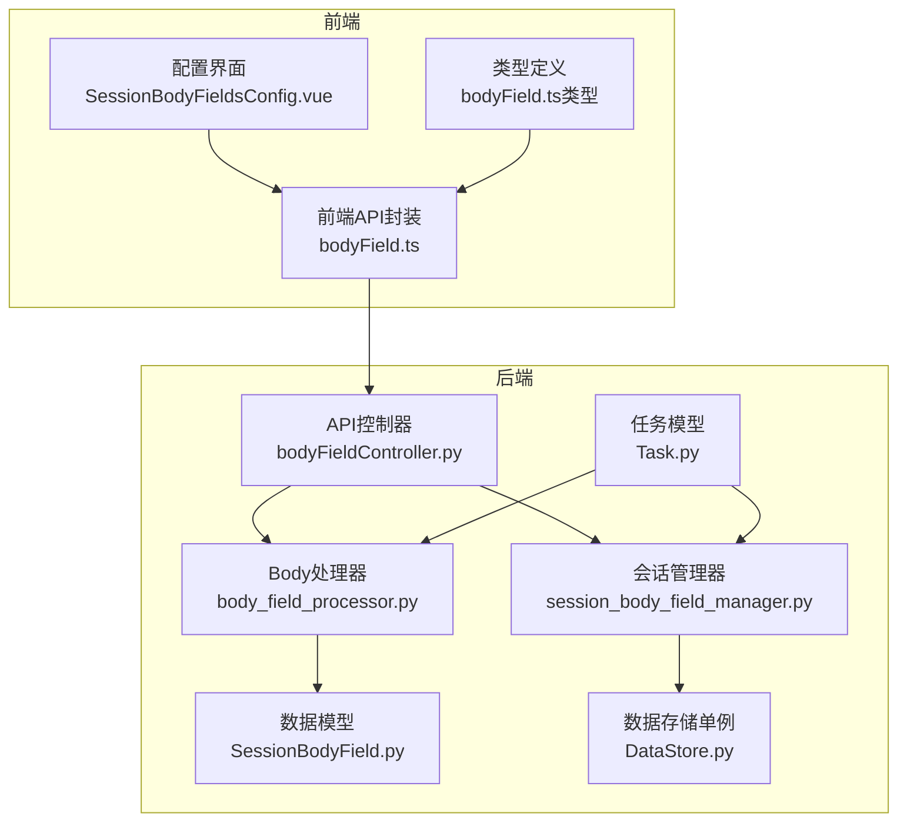
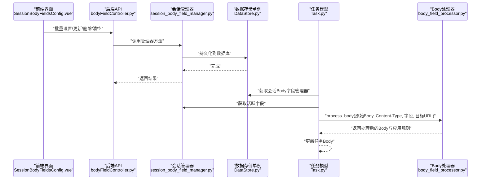
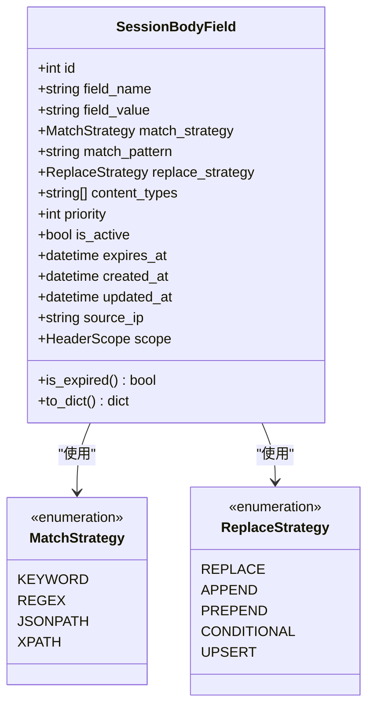
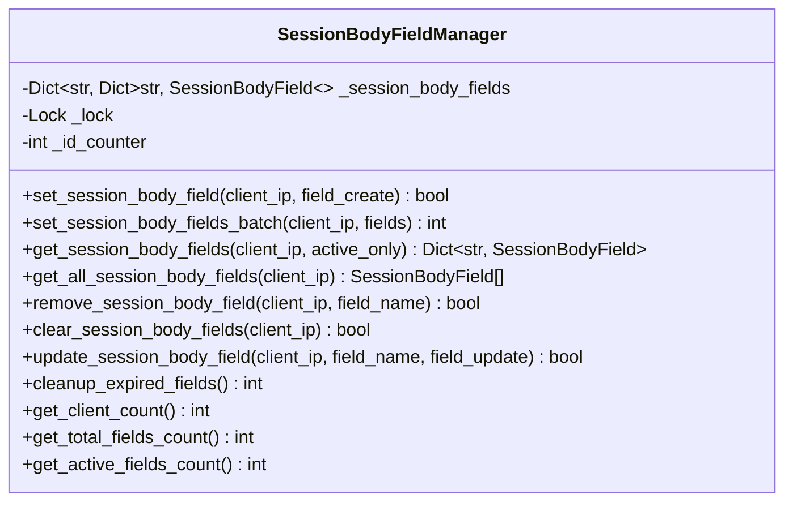
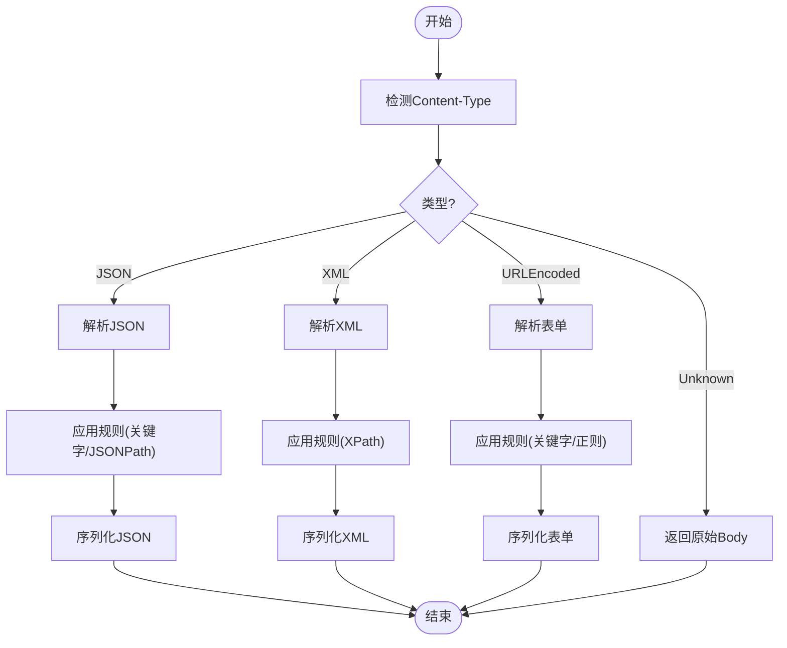
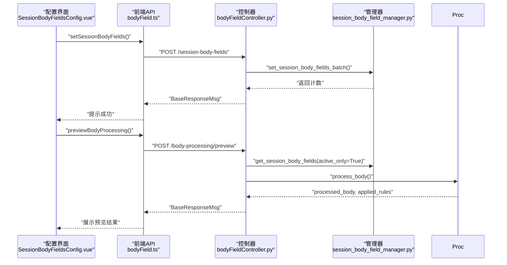
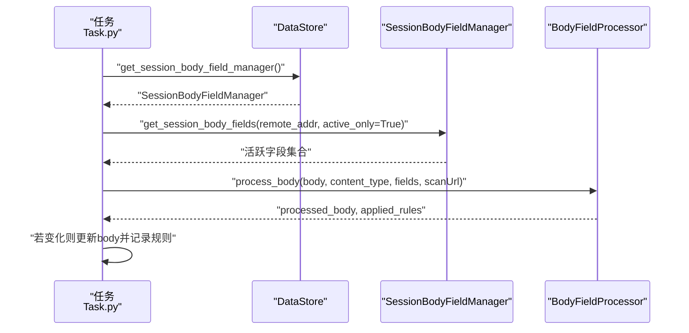
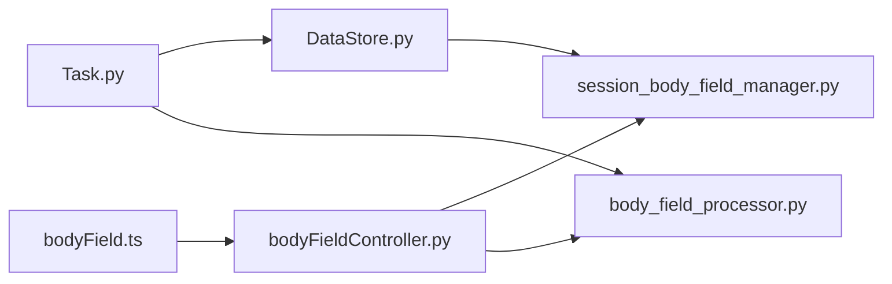

# Body字段动态替换功能

<cite>
**本文引用的文件**
- [body_field_processor.py](file://src/backEnd/utils/body_field_processor.py)
- [session_body_field_manager.py](file://src/backEnd/utils/session_body_field_manager.py)
- [SessionBodyField.py](file://src/backEnd/model/SessionBodyField.py)
- [bodyFieldController.py](file://src/backEnd/api/commonApi/bodyFieldController.py)
- [bodyField.ts](file://src/frontEnd/src/api/bodyField.ts)
- [bodyField.ts（类型定义）](file://src/frontEnd/src/types/bodyField.ts)
- [SessionBodyFieldsConfig.vue](file://src/frontEnd/src/views/Config/components/SessionBodyFieldsConfig.vue)
- [Task.py](file://src/backEnd/model/Task.py)
- [DataStore.py](file://src/backEnd/model/DataStore.py)
- [test_body_field_processor.py](file://src/backEnd/tests/test_body_field_processor.py)
- [test_integration_body_field.py](file://src/backEnd/tests/test_integration_body_field.py)
</cite>

## 目录
1. [简介](#简介)
2. [项目结构](#项目结构)
3. [核心组件](#核心组件)
4. [架构总览](#架构总览)
5. [详细组件分析](#详细组件分析)
6. [依赖关系分析](#依赖关系分析)
7. [性能与可靠性](#性能与可靠性)
8. [故障排查指南](#故障排查指南)
9. [结论](#结论)
10. [附录](#附录)

## 简介
本功能允许用户为当前会话动态配置HTTP请求Body中的字段，并在任务执行前自动应用这些规则，实现对Body内容的按需替换。系统支持多种匹配策略（关键字、正则、JSONPath、XPath）、多种替换策略（替换、追加、前置、条件替换、插入/更新），并支持按Content-Type和目标URL进行作用域控制。前端提供可视化配置界面与预览能力，后端提供API与持久化管理，并在任务执行阶段自动注入生效。

## 项目结构
围绕“Body字段动态替换”的关键文件分布如下：
- 后端工具层
  - 解析与处理：utils/body_field_processor.py
  - 会话管理：utils/session_body_field_manager.py
  - 数据模型：model/SessionBodyField.py
  - API控制器：api/commonApi/bodyFieldController.py
  - 全局数据存储：model/DataStore.py
  - 任务集成点：model/Task.py
- 前端API与类型
  - API封装：frontEnd/src/api/bodyField.ts
  - 类型定义：frontEnd/src/types/bodyField.ts
  - 配置界面：frontEnd/src/views/Config/components/SessionBodyFieldsConfig.vue
- 测试
  - 单元测试：tests/test_body_field_processor.py
  - 集成测试：tests/test_integration_body_field.py

图表来源
- [bodyFieldController.py](file://src/backEnd/api/commonApi/bodyFieldController.py#L1-L307)
- [body_field_processor.py](file://src/backEnd/utils/body_field_processor.py#L1-L410)
- [session_body_field_manager.py](file://src/backEnd/utils/session_body_field_manager.py#L1-L362)
- [SessionBodyField.py](file://src/backEnd/model/SessionBodyField.py#L1-L138)
- [DataStore.py](file://src/backEnd/model/DataStore.py#L1-L52)
- [Task.py](file://src/backEnd/model/Task.py#L181-L237)
- [bodyField.ts](file://src/frontEnd/src/api/bodyField.ts#L1-L220)
- [bodyField.ts（类型）](file://src/frontEnd/src/types/bodyField.ts#L1-L144)
- [SessionBodyFieldsConfig.vue](file://src/frontEnd/src/views/Config/components/SessionBodyFieldsConfig.vue#L217-L838)

章节来源
- [bodyFieldController.py](file://src/backEnd/api/commonApi/bodyFieldController.py#L1-L307)
- [body_field_processor.py](file://src/backEnd/utils/body_field_processor.py#L1-L410)
- [session_body_field_manager.py](file://src/backEnd/utils/session_body_field_manager.py#L1-L362)
- [SessionBodyField.py](file://src/backEnd/model/SessionBodyField.py#L1-L138)
- [DataStore.py](file://src/backEnd/model/DataStore.py#L1-L52)
- [Task.py](file://src/backEnd/model/Task.py#L181-L237)
- [bodyField.ts](file://src/frontEnd/src/api/bodyField.ts#L1-L220)
- [bodyField.ts（类型）](file://src/frontEnd/src/types/bodyField.ts#L1-L144)
- [SessionBodyFieldsConfig.vue](file://src/frontEnd/src/views/Config/components/SessionBodyFieldsConfig.vue#L217-L838)

## 核心组件
- 会话Body字段模型与策略
  - 字段模型：包含字段名、值、匹配策略、替换策略、适用Content-Type、优先级、启用状态、过期时间、来源IP、作用域等。
  - 匹配策略：关键字、正则、JSONPath、XPath。
  - 替换策略：替换、追加、前置、条件替换、插入/更新。
- 会话Body字段管理器
  - 支持设置、批量设置、查询、更新、删除、清空、过期清理。
  - 基于线程锁保证并发安全；同时持久化到数据库。
- Body字段处理器
  - 自动识别Content-Type（JSON/XML/URLEncoded/未知）。
  - 针对不同格式应用匹配与替换规则，支持作用域过滤与优先级排序。
- API控制器
  - 提供批量设置、查询、更新、删除、清空、Body处理预览等接口。
- 任务集成
  - 在任务执行前从会话管理器获取活跃字段，结合Content-Type与目标URL处理Body，并回写任务体。
- 前端
  - API封装与类型定义；配置界面支持增删改查、批量删除、清空、预览；提供匹配/替换策略选项与校验。

章节来源
- [SessionBodyField.py](file://src/backEnd/model/SessionBodyField.py#L1-L138)
- [session_body_field_manager.py](file://src/backEnd/utils/session_body_field_manager.py#L1-L362)
- [body_field_processor.py](file://src/backEnd/utils/body_field_processor.py#L1-L410)
- [bodyFieldController.py](file://src/backEnd/api/commonApi/bodyFieldController.py#L1-L307)
- [Task.py](file://src/backEnd/model/Task.py#L181-L237)
- [bodyField.ts](file://src/frontEnd/src/api/bodyField.ts#L1-L220)
- [bodyField.ts（类型）](file://src/frontEnd/src/types/bodyField.ts#L1-L144)
- [SessionBodyFieldsConfig.vue](file://src/frontEnd/src/views/Config/components/SessionBodyFieldsConfig.vue#L217-L838)

## 架构总览
整体流程：前端配置会话Body字段 → 后端API接收并持久化 → 任务执行前从会话管理器读取活跃字段 → 根据Content-Type与作用域应用规则 → 更新任务Body。

图表来源
- [SessionBodyFieldsConfig.vue](file://src/frontEnd/src/views/Config/components/SessionBodyFieldsConfig.vue#L217-L838)
- [bodyFieldController.py](file://src/backEnd/api/commonApi/bodyFieldController.py#L1-L307)
- [session_body_field_manager.py](file://src/backEnd/utils/session_body_field_manager.py#L1-L362)
- [DataStore.py](file://src/backEnd/model/DataStore.py#L1-L52)
- [Task.py](file://src/backEnd/model/Task.py#L181-L237)
- [body_field_processor.py](file://src/backEnd/utils/body_field_processor.py#L1-L410)

## 详细组件分析

### 会话Body字段模型与策略
- 字段模型
  - 字段名、值、匹配策略、匹配模式、替换策略、适用Content-Type、优先级、启用状态、过期时间、来源IP、作用域。
  - 提供过期判断与字典序列化。
- 匹配策略
  - 关键字：直接按键名定位。
  - 正则：对原始Body字符串进行匹配与替换。
  - JSONPath：对JSON对象进行路径定位（依赖jsonpath-ng）。
  - XPath：对XML树进行节点定位（依赖lxml）。
- 替换策略
  - 替换、追加、前置、条件替换（仅当值为空时才替换）、插入/更新（存在则替换，不存在则新增）。

图表来源
- [SessionBodyField.py](file://src/backEnd/model/SessionBodyField.py#L1-L138)

章节来源
- [SessionBodyField.py](file://src/backEnd/model/SessionBodyField.py#L1-L138)

### 会话Body字段管理器
- 并发安全：使用线程锁保护内存字典。
- 生命周期管理：设置/更新（含TTL过期）、批量设置、查询（活跃/全部）、删除、清空、过期清理。
- 持久化：通过DataStore获取数据库句柄，支持UPDATE/INSERT与DELETE。
- 统计：客户端数量、字段总数、活跃字段数。

图表来源
- [session_body_field_manager.py](file://src/backEnd/utils/session_body_field_manager.py#L1-L362)

章节来源
- [session_body_field_manager.py](file://src/backEnd/utils/session_body_field_manager.py#L1-L362)

### Body字段处理器
- Content-Type检测：JSON/XML/URLEncoded/未知。
- 解析与序列化：JSON/XML/URLEncoded三类格式的双向转换。
- 规则应用：
  - 过滤：按Content-Type与启用状态筛选。
  - 排序：按优先级降序。
  - 作用域：基于目标URL与作用域配置匹配。
  - 匹配与替换：关键字、正则、JSONPath、XPath；替换策略按策略执行。
- 错误处理：解析失败、库缺失、异常捕获，返回原始Body并记录日志。

图表来源
- [body_field_processor.py](file://src/backEnd/utils/body_field_processor.py#L1-L410)

章节来源
- [body_field_processor.py](file://src/backEnd/utils/body_field_processor.py#L1-L410)

### API控制器与前端交互
- 控制器
  - 批量设置会话Body字段：接收批量创建请求，调用管理器并返回结果。
  - 查询会话Body字段：返回当前客户端的所有字段（含过期）。
  - 更新/删除/清空：对单个字段或全部字段进行维护。
  - Body处理预览：获取活跃字段，调用处理器，返回原始Body、处理后Body、应用规则列表与变更数量。
- 前端
  - API封装：提供获取列表、批量设置、更新、删除、清空、预览等方法。
  - 类型定义：匹配策略、替换策略、请求/响应类型、选项与校验。
  - 配置界面：支持搜索、过滤、启用/禁用切换、批量删除、清空、预览对话框。

图表来源
- [bodyFieldController.py](file://src/backEnd/api/commonApi/bodyFieldController.py#L1-L307)
- [bodyField.ts](file://src/frontEnd/src/api/bodyField.ts#L1-L220)
- [SessionBodyFieldsConfig.vue](file://src/frontEnd/src/views/Config/components/SessionBodyFieldsConfig.vue#L217-L838)

章节来源
- [bodyFieldController.py](file://src/backEnd/api/commonApi/bodyFieldController.py#L1-L307)
- [bodyField.ts](file://src/frontEnd/src/api/bodyField.ts#L1-L220)
- [bodyField.ts（类型）](file://src/frontEnd/src/types/bodyField.ts#L1-L144)
- [SessionBodyFieldsConfig.vue](file://src/frontEnd/src/views/Config/components/SessionBodyFieldsConfig.vue#L217-L838)

### 任务执行中的动态替换
- 任务模型在执行前尝试导入处理器与管理器，获取当前客户端的活跃字段。
- 从请求头中提取Content-Type，调用处理器对Body进行处理。
- 若处理后Body发生变化，则更新任务的Body，并记录应用的规则列表。

图表来源
- [Task.py](file://src/backEnd/model/Task.py#L181-L237)
- [DataStore.py](file://src/backEnd/model/DataStore.py#L1-L52)
- [session_body_field_manager.py](file://src/backEnd/utils/session_body_field_manager.py#L1-L362)
- [body_field_processor.py](file://src/backEnd/utils/body_field_processor.py#L1-L410)

章节来源
- [Task.py](file://src/backEnd/model/Task.py#L181-L237)
- [DataStore.py](file://src/backEnd/model/DataStore.py#L1-L52)

## 依赖关系分析
- 组件耦合
  - Task依赖DataStore获取管理器，再依赖管理器与处理器。
  - 控制器依赖管理器与处理器。
  - 前端API封装依赖控制器。
- 外部依赖
  - jsonpath-ng（JSONPath）
  - lxml（XPath/XML）
  - FastAPI（API框架）
  - Pydantic（模型校验）
- 潜在循环依赖
  - 通过延迟导入避免Task与处理器之间的循环导入。

图表来源
- [Task.py](file://src/backEnd/model/Task.py#L181-L237)
- [DataStore.py](file://src/backEnd/model/DataStore.py#L1-L52)
- [session_body_field_manager.py](file://src/backEnd/utils/session_body_field_manager.py#L1-L362)
- [body_field_processor.py](file://src/backEnd/utils/body_field_processor.py#L1-L410)
- [bodyFieldController.py](file://src/backEnd/api/commonApi/bodyFieldController.py#L1-L307)
- [bodyField.ts](file://src/frontEnd/src/api/bodyField.ts#L1-L220)

章节来源
- [Task.py](file://src/backEnd/model/Task.py#L181-L237)
- [DataStore.py](file://src/backEnd/model/DataStore.py#L1-L52)
- [session_body_field_manager.py](file://src/backEnd/utils/session_body_field_manager.py#L1-L362)
- [body_field_processor.py](file://src/backEnd/utils/body_field_processor.py#L1-L410)
- [bodyFieldController.py](file://src/backEnd/api/commonApi/bodyFieldController.py#L1-L307)
- [bodyField.ts](file://src/frontEnd/src/api/bodyField.ts#L1-L220)

## 性能与可靠性
- 性能特性
  - 内存存储：字段以字典形式存储，查询与更新均为O(1)平均复杂度。
  - 过滤与排序：按Content-Type与优先级处理，复杂度与字段数量线性相关。
  - 序列化成本：JSON/XML/URLEncoded序列化开销与Body大小线性相关。
- 可靠性保障
  - 异常捕获：解析失败、库缺失、作用域不匹配均记录日志并返回原始Body。
  - 并发安全：管理器使用线程锁，避免竞态。
  - 过期清理：定期清理过期字段，减少内存占用。
  - 任务回退：处理失败不影响任务继续执行，保持健壮性。

[本节为通用性能讨论，无需特定文件来源]

## 故障排查指南
- 常见问题
  - 无法解析JSON/XML：检查Content-Type与Body格式；确保安装所需库（jsonpath-ng/lxml）。
  - 规则未生效：确认字段处于启用状态、未过期；检查匹配策略与模式是否正确；核对Content-Type是否匹配。
  - 预览无变化：确认预览时的Content-Type与实际任务一致；检查目标URL作用域是否匹配。
  - 数据库持久化失败：检查数据库连接与SQL执行权限。
- 定位方法
  - 查看后端日志：处理器与管理器均有详细日志输出。
  - 使用预览接口：对比原始Body与处理后Body，确认应用规则列表。
  - 单元测试参考：通过测试用例验证各策略与流程。

章节来源
- [body_field_processor.py](file://src/backEnd/utils/body_field_processor.py#L1-L410)
- [session_body_field_manager.py](file://src/backEnd/utils/session_body_field_manager.py#L1-L362)
- [test_body_field_processor.py](file://src/backEnd/tests/test_body_field_processor.py#L1-L244)
- [test_integration_body_field.py](file://src/backEnd/tests/test_integration_body_field.py#L1-L152)

## 结论
Body字段动态替换功能通过“模型-管理器-处理器-API-任务”的完整链路，实现了灵活、可控、可预览的会话级Body字段替换。前端提供直观配置与预览，后端具备完善的生命周期管理与错误容错，适合在渗透测试、自动化扫描等场景中按需注入会话参数，提升任务的灵活性与成功率。

[本节为总结性内容，无需特定文件来源]

## 附录

### API定义（后端）
- 批量设置会话Body字段
  - 方法：POST
  - 路径：/commonApi/body-field/session-body-fields
  - 请求体：SessionBodyFieldBatchCreate
  - 响应：BaseResponseMsg
- 获取会话Body字段列表
  - 方法：GET
  - 路径：/commonApi/body-field/session-body-fields
  - 查询参数：active_only（可选）
  - 响应：BaseResponseMsg（包含SessionBodyFieldListResponse）
- 更新单个会话Body字段
  - 方法：PUT
  - 路径：/commonApi/body-field/session-body-fields/{field_name}
  - 请求体：SessionBodyFieldUpdate
  - 响应：BaseResponseMsg
- 删除单个会话Body字段
  - 方法：DELETE
  - 路径：/commonApi/body-field/session-body-fields/{field_name}
  - 响应：BaseResponseMsg
- 清除所有会话Body字段
  - 方法：DELETE
  - 路径：/commonApi/body-field/session-body-fields
  - 响应：BaseResponseMsg
- Body处理预览
  - 方法：POST
  - 路径：/commonApi/body-field/body-processing/preview
  - 请求体：BodyPreviewRequest（包含body、content_type、target_url）
  - 响应：BaseResponseMsg（包含original_body、processed_body、applied_rules、changes_count）

章节来源
- [bodyFieldController.py](file://src/backEnd/api/commonApi/bodyFieldController.py#L1-L307)
- [bodyField.ts](file://src/frontEnd/src/api/bodyField.ts#L1-L220)
- [bodyField.ts（类型）](file://src/frontEnd/src/types/bodyField.ts#L1-L144)

### 前端类型与校验
- 匹配策略与替换策略枚举、请求/响应类型、选项与校验规则均在类型文件中定义。
- 前端提供默认字段构造、校验函数、标签映射与过期时间格式化工具。

章节来源
- [bodyField.ts（类型）](file://src/frontEnd/src/types/bodyField.ts#L1-L144)
- [bodyField.ts](file://src/frontEnd/src/api/bodyField.ts#L1-L220)
- [SessionBodyFieldsConfig.vue](file://src/frontEnd/src/views/Config/components/SessionBodyFieldsConfig.vue#L217-L838)