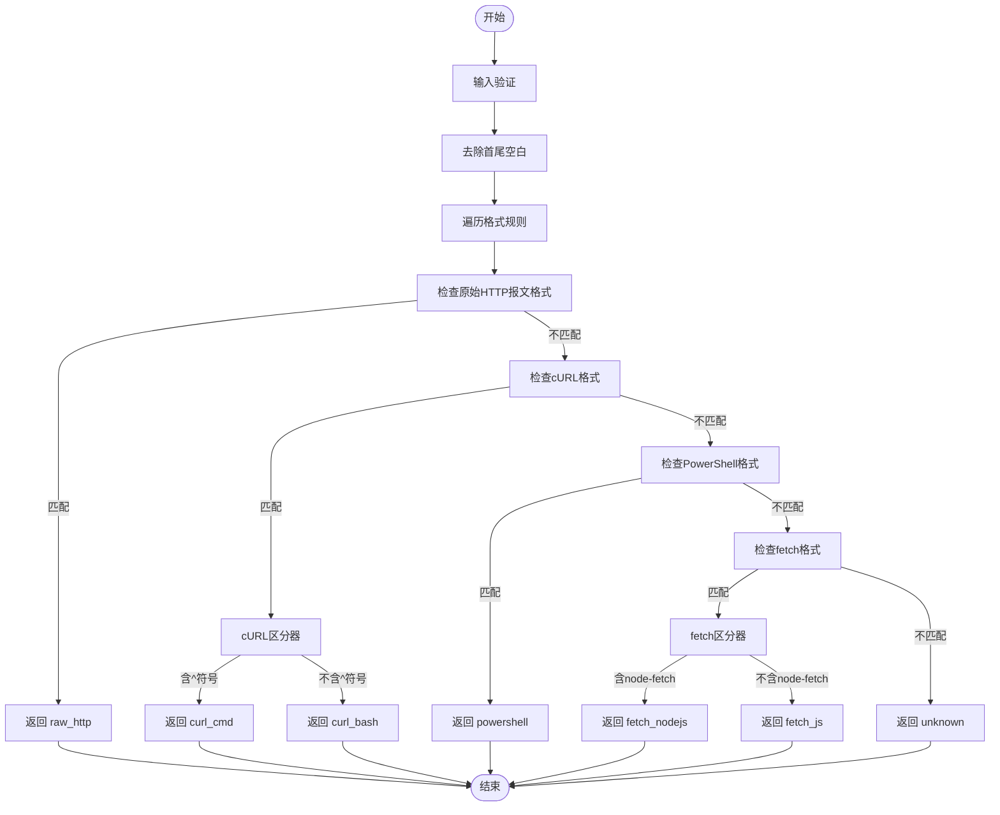
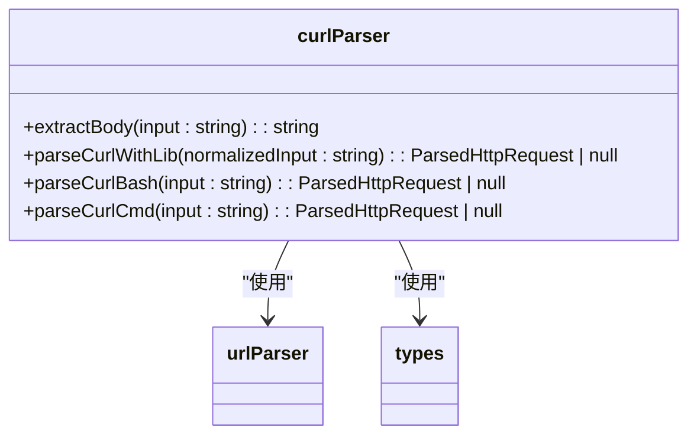
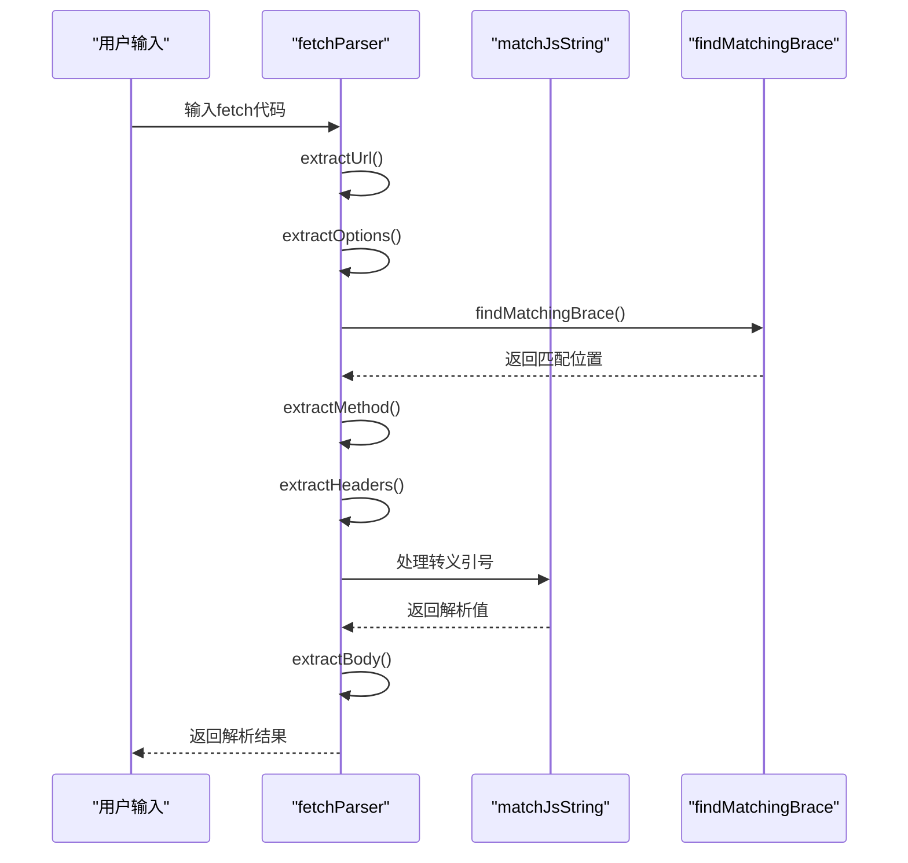
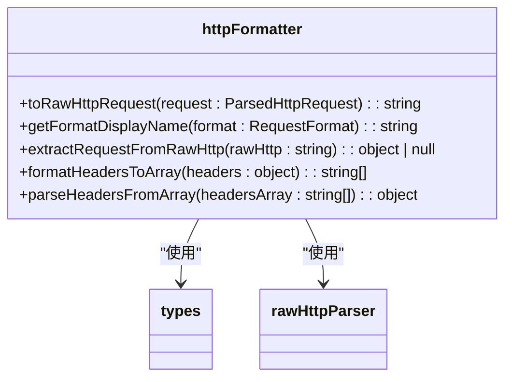
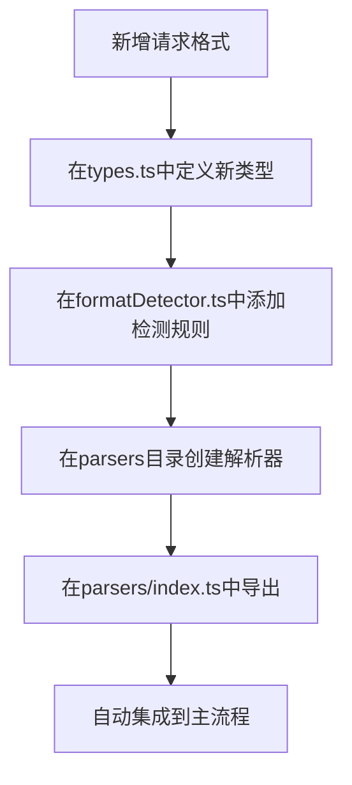

# HTTP请求解析

<cite>
**本文档引用的文件**   
- [types.ts](file://src/frontEnd/src/utils/httpRequestParser/types.ts)
- [formatDetector.ts](file://src/frontEnd/src/utils/httpRequestParser/formatDetector.ts)
- [curlParser.ts](file://src/frontEnd/src/utils/httpRequestParser/parsers/curlParser.ts)
- [fetchParser.ts](file://src/frontEnd/src/utils/httpRequestParser/parsers/fetchParser.ts)
- [powershellParser.ts](file://src/frontEnd/src/utils/httpRequestParser/parsers/powershellParser.ts)
- [rawHttpParser.ts](file://src/frontEnd/src/utils/httpRequestParser/parsers/rawHttpParser.ts)
- [httpFormatter.ts](file://src/frontEnd/src/utils/httpRequestParser/formatters/httpFormatter.ts)
- [urlParser.ts](file://src/frontEnd/src/utils/httpRequestParser/urlParser.ts)
- [index.ts](file://src/frontEnd/src/utils/httpRequestParser/index.ts)
</cite>

## 目录
1. [简介](#简介)
2. [核心组件](#核心组件)
3. [格式检测机制](#格式检测机制)
4. [解析器实现原理](#解析器实现原理)
5. [统一输出格式](#统一输出格式)
6. [特殊字符与编码处理](#特殊字符与编码处理)
7. [解析示例](#解析示例)
8. [常见问题与解决方案](#常见问题与解决方案)
9. [扩展性设计](#扩展性设计)

## 简介
本系统实现了对多种HTTP请求格式的智能解析功能，支持cURL、PowerShell、fetch API和原始HTTP报文等多种格式的自动识别与解析。系统通过格式检测器自动判断输入格式，调用相应的解析器提取URL、方法、头部和请求体等关键信息，并统一转换为标准HTTP报文格式。该功能主要用于从浏览器开发者工具复制的请求进行自动化处理，为后续的安全测试提供标准化输入。

## 核心组件

**Section sources**
- [types.ts](file://src/frontEnd/src/utils/httpRequestParser/types.ts#L1-L72)
- [index.ts](file://src/frontEnd/src/utils/httpRequestParser/index.ts#L1-L168)

## 格式检测机制



**Diagram sources**
- [formatDetector.ts](file://src/frontEnd/src/utils/httpRequestParser/formatDetector.ts#L1-L133)

**Section sources**
- [formatDetector.ts](file://src/frontEnd/src/utils/httpRequestParser/formatDetector.ts#L1-L133)

## 解析器实现原理

### cURL解析器
cURL解析器支持两种格式：Bash格式和Windows CMD格式。系统使用`@scrape-do/curl-parser`库进行基础解析，同时针对库的缺陷（如引号处理问题）进行了修复。对于Windows CMD格式，需要特殊处理`^"`表示的转义引号和`^`续行符。



**Diagram sources**
- [curlParser.ts](file://src/frontEnd/src/utils/httpRequestParser/parsers/curlParser.ts#L1-L180)

**Section sources**
- [curlParser.ts](file://src/frontEnd/src/utils/httpRequestParser/parsers/curlParser.ts#L1-L180)

### fetch解析器
fetch解析器能够正确处理JavaScript字符串中的转义引号（\"）和嵌套JSON对象。通过自定义的`matchJsString`函数处理转义字符，`findMatchingBrace`函数查找匹配的大括号位置，从而准确提取options对象中的method、headers和body。



**Diagram sources**
- [fetchParser.ts](file://src/frontEnd/src/utils/httpRequestParser/parsers/fetchParser.ts#L1-L343)

**Section sources**
- [fetchParser.ts](file://src/frontEnd/src/utils/httpRequestParser/parsers/fetchParser.ts#L1-L343)

### PowerShell解析器
PowerShell解析器处理PowerShell特有的转义字符（反引号`）和哈希表语法（@{}）。能够识别`Invoke-WebRequest`、`Invoke-RestMethod`等命令，提取URL、方法、ContentType、Headers和Body等信息，并正确处理`"表示的转义双引号。

**Section sources**
- [powershellParser.ts](file://src/frontEnd/src/utils/httpRequestParser/parsers/powershellParser.ts#L1-L210)

### 原始HTTP报文解析器
原始HTTP报文解析器按照HTTP/1.1协议规范解析请求。首先解析请求行获取方法和路径，然后逐行解析头部信息，遇到空行后开始解析请求体。从Host头部提取主机名，构建完整的URL。

**Section sources**
- [rawHttpParser.ts](file://src/frontEnd/src/utils/httpRequestParser/parsers/rawHttpParser.ts#L1-L170)

## 统一输出格式



**Diagram sources**
- [httpFormatter.ts](file://src/frontEnd/src/utils/httpRequestParser/formatters/httpFormatter.ts#L1-L128)

**Section sources**
- [httpFormatter.ts](file://src/frontEnd/src/utils/httpRequestParser/formatters/httpFormatter.ts#L1-L128)

## 特殊字符与编码处理
系统针对不同格式的特殊字符进行了专门处理：
- **cURL (Bash)**：处理`\"`表示的转义双引号和`\\\\`表示的转义反斜杠
- **cURL (CMD)**：处理`^"`表示的转义双引号、`^`续行符和`^^`表示的转义脱字符
- **PowerShell**：处理`"`表示的转义双引号、`` `n``表示的换行符和`` `r``表示的回车符
- **fetch**：处理JavaScript字符串中的`\"`转义引号和`\n`、`\r`等转义序列

所有解析器都实现了对复杂结构的处理能力，包括多行格式、嵌套JSON和特殊字符编码，确保能够准确提取请求的关键信息。

**Section sources**
- [curlParser.ts](file://src/frontEnd/src/utils/httpRequestParser/parsers/curlParser.ts#L15-L46)
- [fetchParser.ts](file://src/frontEnd/src/utils/httpRequestParser/parsers/fetchParser.ts#L28-L73)
- [powershellParser.ts](file://src/frontEnd/src/utils/httpRequestParser/parsers/powershellParser.ts#L27-L34)

## 解析示例
系统能够处理以下格式的请求：

**原始HTTP报文格式：**
```
GET /api/products/detail?id=2 HTTP/1.1
Host: 127.0.0.1:9527
sec-ch-ua-platform: "Windows"
Content-Type: application/json
User-Agent: Mozilla/5.0 (Windows NT 10.0; Win64; x64) AppleWebKit/537.36
Accept: */*
```

**cURL格式：**
```bash
curl -X POST 'https://api.example.com/users' \
  -H 'Content-Type: application/json' \
  -d '{"name":"test"}'
```

**PowerShell格式：**
```powershell
Invoke-WebRequest -Uri "https://api.example.com" `
  -Method "POST" `
  -Headers @{"Content-Type"="application/json"} `
  -Body "{`"name`":`"test`"}"
```

**fetch格式：**
```javascript
fetch("https://api.example.com/users", {
  "headers": {
    "content-type": "application/json",
    "sec-ch-ua": "\"Chromium\";v=\"138\""
  },
  "body": "{\"name\":\"test\"}",
  "method": "POST"
})
```

**Section sources**
- [request_20251221_134115_341519.txt](file://src/backEnd/temp/http_requests/request_20251221_134115_341519.txt)
- [curlParser.ts](file://src/frontEnd/src/utils/httpRequestParser/parsers/curlParser.ts#L100-L103)
- [powershellParser.ts](file://src/frontEnd/src/utils/httpRequestParser/parsers/powershellParser.ts#L158-L161)
- [fetchParser.ts](file://src/frontEnd/src/utils/httpRequestParser/parsers/fetchParser.ts#L284-L291)

## 常见问题与解决方案
1. **cURL解析失败**：当cURL命令包含复杂引号嵌套时，建议使用双引号包围整个命令，或确保引号正确转义
2. **PowerShell转义问题**：在PowerShell中，JSON字符串内的双引号需要用`"`转义，而不是标准的`\"`
3. **fetch解析错误**：确保fetch调用的options对象语法正确，大括号匹配完整
4. **自动检测失败**：当格式检测器无法识别格式时，可尝试手动指定格式或检查输入是否符合标准格式

**Section sources**
- [formatDetector.ts](file://src/frontEnd/src/utils/httpRequestParser/formatDetector.ts#L140-L148)
- [curlParser.ts](file://src/frontEnd/src/utils/httpRequestParser/parsers/curlParser.ts#L106-L107)
- [powershellParser.ts](file://src/frontEnd/src/utils/httpRequestParser/parsers/powershellParser.ts#L166-L167)
- [fetchParser.ts](file://src/frontEnd/src/utils/httpRequestParser/parsers/fetchParser.ts#L259-L272)

## 扩展性设计
系统采用模块化设计，支持轻松扩展新的请求格式。通过在`types.ts`中定义新的格式类型，在`formatDetector.ts`中添加检测规则，并在`parsers`目录下创建新的解析器模块，即可实现对新格式的支持。主入口`index.ts`会自动导出新解析器，`parseHttpRequest`函数会根据检测结果调用相应的解析器。



**Diagram sources**
- [types.ts](file://src/frontEnd/src/utils/httpRequestParser/types.ts#L46-L53)
- [formatDetector.ts](file://src/frontEnd/src/utils/httpRequestParser/formatDetector.ts#L23-L68)
- [index.ts](file://src/frontEnd/src/utils/httpRequestParser/index.ts#L53-L61)

**Section sources**
- [types.ts](file://src/frontEnd/src/utils/httpRequestParser/types.ts#L46-L53)
- [formatDetector.ts](file://src/frontEnd/src/utils/httpRequestParser/formatDetector.ts#L23-L68)
- [index.ts](file://src/frontEnd/src/utils/httpRequestParser/index.ts#L53-L61)