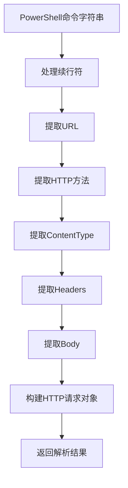
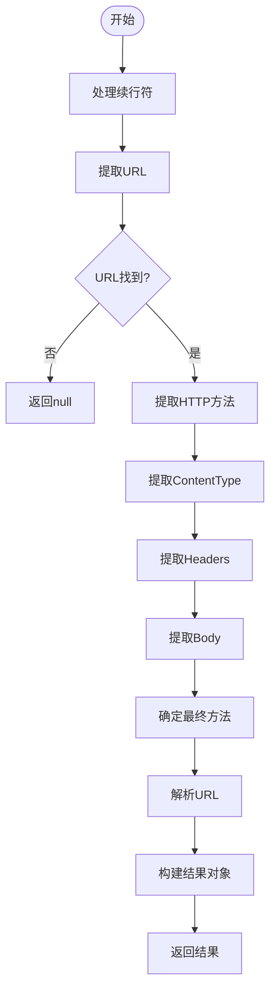

# PowerShell解析

<cite>
**本文档引用文件**  
- [powershellParser.ts](file://src/frontEnd/src/utils/httpRequestParser/parsers/powershellParser.ts)
- [index.ts](file://src/frontEnd/src/utils/httpRequestParser/index.ts)
- [formatDetector.ts](file://src/frontEnd/src/utils/httpRequestParser/formatDetector.ts)
- [urlParser.ts](file://src/frontEnd/src/utils/httpRequestParser/urlParser.ts)
- [types.ts](file://src/frontEnd/src/utils/httpRequestParser/types.ts)
</cite>

## 目录
1. [简介](#简介)
2. [PowerShell解析器架构](#powershell解析器架构)
3. [核心解析逻辑](#核心解析逻辑)
4. [PowerShell语法结构处理](#powershell语法结构处理)
5. [典型请求解析示例](#典型请求解析示例)
6. [复杂脚本解析注意事项](#复杂脚本解析注意事项)
7. [错误处理与限制](#错误处理与限制)

## 简介

PowerShell请求解析功能是SQLMap Web UI中的关键组件，用于将PowerShell脚本中的HTTP请求转换为标准的HTTP报文格式。该功能主要支持`Invoke-WebRequest`和`Invoke-RestMethod`这两个PowerShell cmdlet的解析，能够提取URL、HTTP方法、头部、请求体、认证信息等关键参数。

该解析器位于前端代码库的`src/frontEnd/src/utils/httpRequestParser/`目录下，作为多格式HTTP请求解析器的一部分，与cURL、fetch等其他格式的解析器共同工作。解析器采用TypeScript编写，具有良好的类型安全性和可维护性。

**本文档引用文件**  
- [index.ts](file://src/frontEnd/src/utils/httpRequestParser/index.ts#L1-L168)
- [formatDetector.ts](file://src/frontEnd/src/utils/httpRequestParser/formatDetector.ts#L1-L133)

## PowerShell解析器架构

PowerShell解析器采用模块化设计，由多个独立的解析函数组成，每个函数负责提取特定的请求参数。主解析函数`parsePowerShell`按照预定义的步骤顺序调用这些提取函数，最终构建出完整的HTTP请求对象。

解析器的输入是PowerShell命令字符串，输出是符合`ParsedHttpRequest`接口的JavaScript对象，包含方法、URL、主机、路径、头部、请求体和协议等属性。如果解析失败，则返回`null`。



**图表来源**  
- [powershellParser.ts](file://src/frontEnd/src/utils/httpRequestParser/parsers/powershellParser.ts#L163-L209)

**本节来源**  
- [powershellParser.ts](file://src/frontEnd/src/utils/httpRequestParser/parsers/powershellParser.ts#L1-L209)
- [types.ts](file://src/frontEnd/src/utils/httpRequestParser/types.ts#L7-L25)

## 核心解析逻辑

PowerShell解析器的核心逻辑遵循六个主要步骤，每个步骤都针对PowerShell语法的特定方面进行处理。

### 续行符处理

PowerShell使用反引号（`）作为续行符，允许将长命令拆分为多行。解析器首先需要处理这种语法，将多行命令合并为单行，以便后续的正则表达式匹配。

```typescript
const normalized = input.replace(/`\s*\r?\n\s*/g, ' ').trim()
```

该正则表达式匹配反引号后跟任意空白字符和换行符的模式，并将其替换为空格，从而实现续行符的处理。

### URL提取

URL提取是解析过程的第一步，也是最关键的一步。解析器使用多个正则表达式模式来匹配不同格式的URL，包括：

- `-Uri "url"` 格式（各种参数顺序）
- `-Uri 'url'` 格式
- 直接跟在命令后的URL



**图表来源**  
- [powershellParser.ts](file://src/frontEnd/src/utils/httpRequestParser/parsers/powershellParser.ts#L165-L204)

**本节来源**  
- [powershellParser.ts](file://src/frontEnd/src/utils/httpRequestParser/parsers/powershellParser.ts#L39-L58)
- [powershellParser.ts](file://src/frontEnd/src/utils/httpRequestParser/parsers/powershellParser.ts#L165-L166)

### HTTP方法提取

HTTP方法通过`-Method`参数指定，解析器使用正则表达式匹配该参数及其值。如果未显式指定方法，则默认为GET。如果请求包含请求体但未指定方法，则默认为POST。

```typescript
const methodMatch = normalized.match(/-Method\s+['"]?(GET|POST|PUT|DELETE|PATCH|HEAD|OPTIONS)['"]?/i)
```

### Headers提取

PowerShell使用哈希表语法`@{}`来定义Headers，解析器需要处理这种特殊的语法结构。解析过程包括：

1. 匹配`-Headers @{}`之间的内容
2. 解析双引号格式的键值对：`"Name"="Value"`
3. 解析单引号格式的键值对：'Name'='Value'
4. 处理转义字符

### Body提取

请求体通过`-Body`参数指定，支持三种格式：

- 双引号包围的字符串：`-Body "content"`
- 单引号包围的字符串：`-Body 'content'`
- Here-String格式：`-Body @"content"@`

解析器使用不同的正则表达式模式来匹配这些格式，并处理其中的转义字符。

**本节来源**  
- [powershellParser.ts](file://src/frontEnd/src/utils/httpRequestParser/parsers/powershellParser.ts#L63-L77)
- [powershellParser.ts](file://src/frontEnd/src/utils/httpRequestParser/parsers/powershellParser.ts#L83-L86)
- [powershellParser.ts](file://src/frontEnd/src/utils/httpRequestParser/parsers/powershellParser.ts#L93-L126)
- [powershellParser.ts](file://src/frontEnd/src/utils/httpRequestParser/parsers/powershellParser.ts#L131-L147)

## PowerShell语法结构处理

PowerShell具有独特的语法结构，解析器需要特殊处理这些结构以确保正确解析。

### 哈希表语法处理

PowerShell使用`@{}`语法定义哈希表，常用于Headers参数。解析器通过以下步骤处理哈希表：

1. 使用正则表达式`/-Headers\s+@\{([\s\S]*?)\}(?=\s+-|\s*$)/i`匹配`@{}`之间的内容
2. 在匹配的内容中查找键值对
3. 支持双引号和单引号格式的键值对
4. 处理转义字符

对于双引号格式的值，需要特别处理`"`转义，将其转换为普通双引号。

### 变量引用处理

虽然当前解析器不直接处理变量引用，但在实际使用中，PowerShell脚本可能包含变量引用如`$url`或`$headers`。在这种情况下，用户需要先在PowerShell中执行脚本以解析变量，然后复制实际的命令到解析器中。

### 管道操作处理

PowerShell的管道操作（`|`）用于将一个命令的输出作为另一个命令的输入。当前解析器不支持直接解析管道操作中的HTTP请求，因为这需要执行PowerShell脚本来确定实际的请求参数。

### SSL/TLS参数处理

PowerShell的`Invoke-WebRequest`和`Invoke-RestMethod`命令支持SSL/TLS相关参数，如`-SkipCertificateCheck`。当前解析器不直接处理这些参数，而是依赖于URL的协议部分（https）来确定是否使用SSL/TLS。

如果需要强制使用SSL/TLS，可以在前端配置中设置相关选项，但这超出了PowerShell解析器的范围。

**本节来源**  
- [powershellParser.ts](file://src/frontEnd/src/utils/httpRequestParser/parsers/powershellParser.ts#L93-L126)
- [powershellParser.ts](file://src/frontEnd/src/utils/httpRequestParser/parsers/powershellParser.ts#L14-L21)

## 典型请求解析示例

### 基本GET请求

```powershell
Invoke-WebRequest -Uri "https://api.example.com/users"
```

解析结果：
- 方法：GET
- URL：https://api.example.com/users
- Headers：{}
- Body：空

### 带认证的POST请求

```powershell
Invoke-WebRequest -Uri "https://api.example.com/login" `
  -Method "POST" `
  -Headers @{"Content-Type"="application/json"; "Authorization"="Bearer token123"} `
  -Body "{`"username`":`"admin`",`"password`":`"secret`"}"
```

解析结果：
- 方法：POST
- URL：https://api.example.com/login
- Headers：{"Content-Type": "application/json", "Authorization": "Bearer token123"}
- Body：{"username":"admin","password":"secret"}

### 文件上传请求

```powershell
Invoke-WebRequest -Uri "https://api.example.com/upload" `
  -Method "POST" `
  -Headers @{"Content-Type"="multipart/form-data"} `
  -Body (Get-Content "C:\path\to\file.txt" -Raw)
```

解析结果：
- 方法：POST
- URL：https://api.example.com/upload
- Headers：{"Content-Type": "multipart/form-data"}
- Body：文件内容（在解析时为占位符）

**本节来源**  
- [powershellParser.ts](file://src/frontEnd/src/utils/httpRequestParser/parsers/powershellParser.ts#L157-L162)
- [index.ts](file://src/frontEnd/src/utils/httpRequestParser/index.ts#L95-L97)

## 复杂脚本解析注意事项

### 多命令脚本

当PowerShell脚本包含多个`Invoke-WebRequest`或`Invoke-RestMethod`命令时，解析器只会解析第一个匹配的命令。如果需要解析多个请求，需要分别复制每个命令进行解析。

### 动态参数

如果请求参数是通过变量或表达式动态生成的，如`-Uri $url`或`-Body (ConvertTo-Json $data)`，解析器无法直接解析这些动态内容。用户需要先在PowerShell中执行脚本以获取实际的参数值，然后复制完整的命令进行解析。

### 编码问题

PowerShell支持多种字符编码，解析器假设输入的命令字符串使用UTF-8编码。如果脚本使用其他编码，可能会导致解析错误或乱码。

### 长命令处理

对于非常长的PowerShell命令，特别是包含大量转义字符的JSON数据，解析器的正则表达式可能无法正确匹配。在这种情况下，建议简化命令或使用Here-String格式来提高可读性和可解析性。

**本节来源**  
- [powershellParser.ts](file://src/frontEnd/src/utils/httpRequestParser/parsers/powershellParser.ts#L163-L209)
- [formatDetector.ts](file://src/frontEnd/src/utils/httpRequestParser/formatDetector.ts#L42-L51)

## 错误处理与限制

### 错误处理机制

解析器采用try-catch机制来捕获和处理解析过程中的异常。如果解析过程中发生任何错误，解析器会记录错误信息并返回`null`，表示解析失败。

```typescript
try {
  // 解析逻辑
  return {
    method: finalMethod,
    url,
    host,
    path,
    headers,
    body,
    protocol
  }
} catch (e) {
  console.error('Parse PowerShell error:', e)
  return null
}
```

### 主要限制

1. **不支持变量解析**：无法解析PowerShell变量，需要用户提供已解析的命令。
2. **不支持管道操作**：无法解析通过管道传递的HTTP请求。
3. **有限的哈希表支持**：仅支持简单的键值对，不支持嵌套哈希表或复杂表达式。
4. **不执行脚本**：解析器仅进行静态分析，不执行PowerShell脚本。
5. **单命令解析**：每次只解析第一个匹配的`Invoke-WebRequest`或`Invoke-RestMethod`命令。

### 性能考虑

解析器的性能主要受正则表达式匹配的影响。对于复杂的PowerShell命令，特别是包含大量转义字符的JSON数据，解析时间可能会增加。建议优化正则表达式模式以提高匹配效率。

**本节来源**  
- [powershellParser.ts](file://src/frontEnd/src/utils/httpRequestParser/parsers/powershellParser.ts#L205-L208)
- [powershellParser.ts](file://src/frontEnd/src/utils/httpRequestParser/parsers/powershellParser.ts#L170-L172)