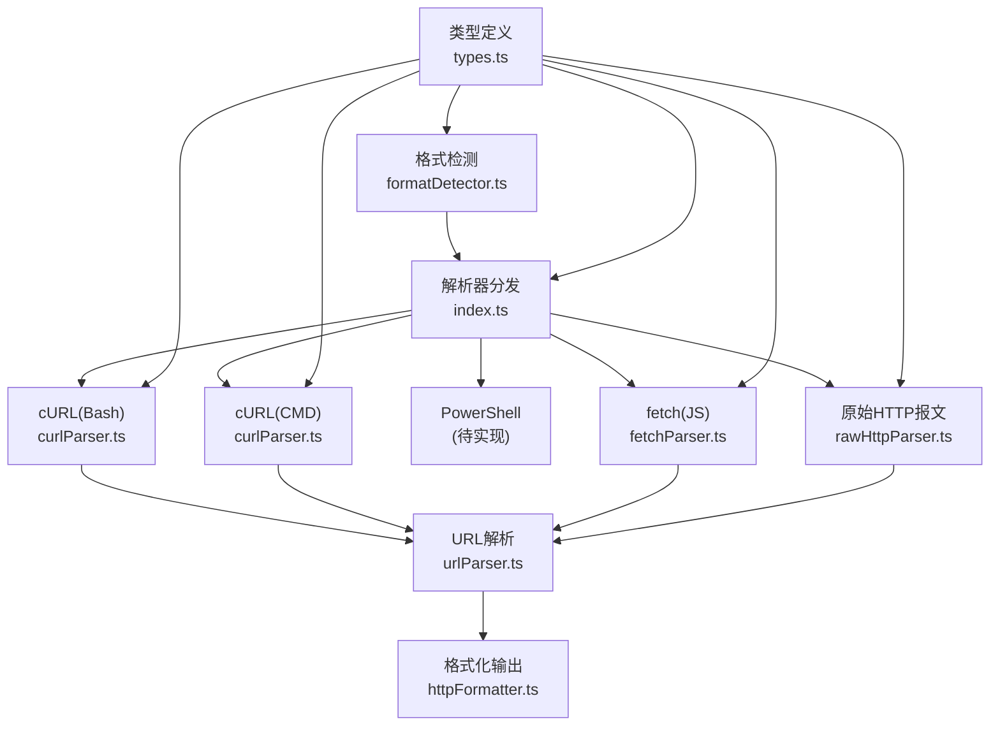
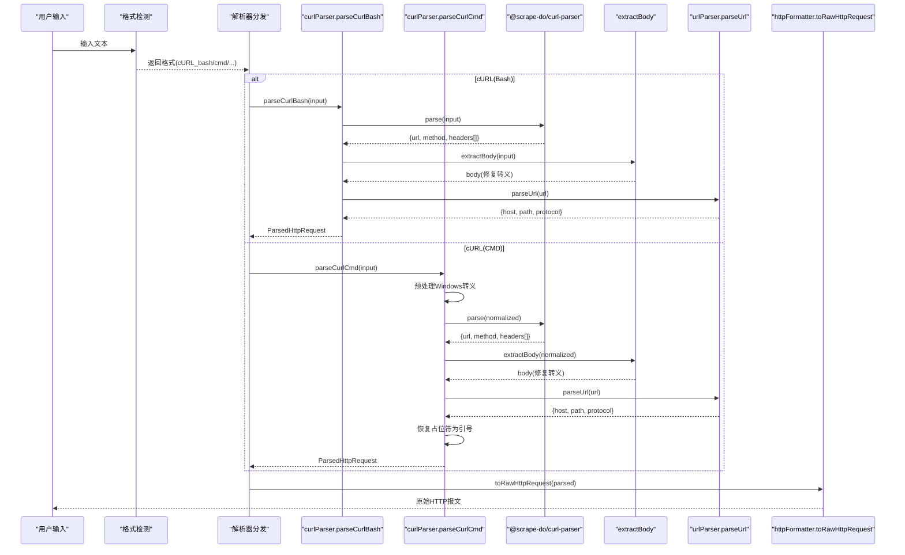
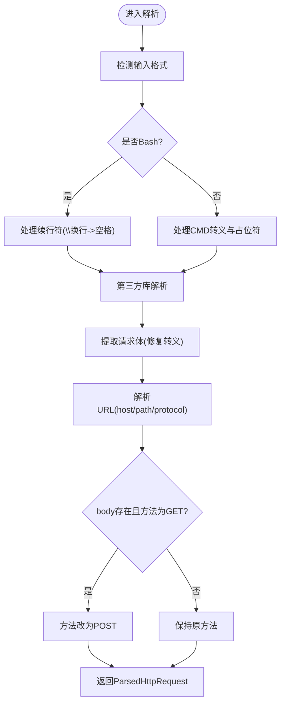
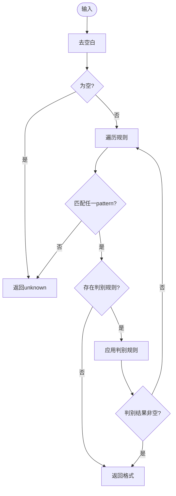
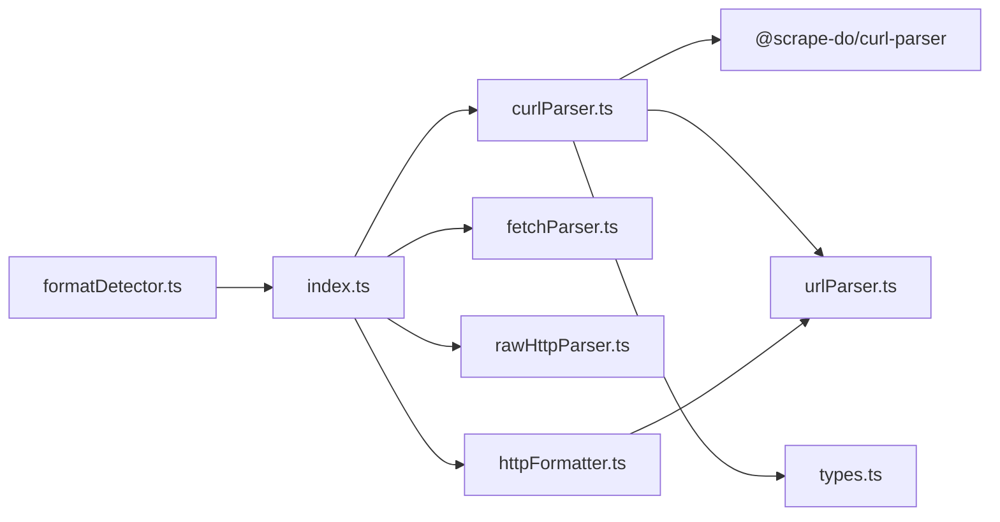

# cURL解析

<cite>
**本文引用的文件**
- [curlParser.ts](file://src/frontEnd/src/utils/httpRequestParser/parsers/curlParser.ts)
- [formatDetector.ts](file://src/frontEnd/src/utils/httpRequestParser/formatDetector.ts)
- [urlParser.ts](file://src/frontEnd/src/utils/httpRequestParser/urlParser.ts)
- [types.ts](file://src/frontEnd/src/utils/httpRequestParser/types.ts)
- [index.ts](file://src/frontEnd/src/utils/httpRequestParser/index.ts)
- [httpFormatter.ts](file://src/frontEnd/src/utils/httpRequestParser/formatters/httpFormatter.ts)
- [rawHttpParser.ts](file://src/frontEnd/src/utils/httpRequestParser/parsers/rawHttpParser.ts)
- [fetchParser.ts](file://src/frontEnd/src/utils/httpRequestParser/parsers/fetchParser.ts)
</cite>

## 目录
1. [简介](#简介)
2. [项目结构](#项目结构)
3. [核心组件](#核心组件)
4. [架构总览](#架构总览)
5. [详细组件分析](#详细组件分析)
6. [依赖关系分析](#依赖关系分析)
7. [性能考量](#性能考量)
8. [故障排查指南](#故障排查指南)
9. [结论](#结论)
10. [附录](#附录)

## 简介
本文件系统性阐述前端HTTP请求解析器中的cURL解析功能，重点围绕curlParser的实现原理与解析规则，覆盖以下方面：
- 如何解析cURL命令中的URL、HTTP方法、请求头、请求体、Cookie、认证信息等参数
- 对各种cURL选项（如-H、-d、-X、--cookie等）的处理逻辑
- 如何处理转义字符、引号包裹的内容和多行命令
- 典型cURL命令解析示例与常见问题解决方案（如特殊字符编码、复杂请求体解析）
- 解析器的容错机制与对非标准cURL语法的处理能力

## 项目结构
该解析器位于前端工具模块中，采用“格式检测 + 解析器分发 + 结构化输出”的分层设计：
- 格式检测：根据输入特征自动识别cURL（bash/cmd）、PowerShell、fetch、原始HTTP报文等格式
- 解析器：针对不同格式提供专用解析器；cURL解析由curlParser负责
- 工具：URL解析、格式化输出、类型定义等辅助模块
- 入口：统一的主解析函数，按格式分派到对应解析器，并可生成原始HTTP报文



图表来源
- [formatDetector.ts](file://src/frontEnd/src/utils/httpRequestParser/formatDetector.ts#L1-L133)
- [index.ts](file://src/frontEnd/src/utils/httpRequestParser/index.ts#L49-L139)
- [curlParser.ts](file://src/frontEnd/src/utils/httpRequestParser/parsers/curlParser.ts#L1-L180)
- [urlParser.ts](file://src/frontEnd/src/utils/httpRequestParser/urlParser.ts#L1-L95)
- [httpFormatter.ts](file://src/frontEnd/src/utils/httpRequestParser/formatters/httpFormatter.ts#L1-L52)
- [rawHttpParser.ts](file://src/frontEnd/src/utils/httpRequestParser/parsers/rawHttpParser.ts#L1-L170)
- [fetchParser.ts](file://src/frontEnd/src/utils/httpRequestParser/parsers/fetchParser.ts#L1-L343)
- [types.ts](file://src/frontEnd/src/utils/httpRequestParser/types.ts#L1-L72)

章节来源
- [formatDetector.ts](file://src/frontEnd/src/utils/httpRequestParser/formatDetector.ts#L1-L133)
- [index.ts](file://src/frontEnd/src/utils/httpRequestParser/index.ts#L49-L139)

## 核心组件
- curlParser：提供parseCurlBash与parseCurlCmd两个入口，分别处理Bash与Windows CMD风格的cURL命令；内部通过第三方库解析基础字段，再用自定义逻辑提取请求体与修复引号转义问题
- formatDetector：基于正则与判别规则自动识别输入格式，优先匹配原始HTTP报文，其次cURL（bash/cmd），再PowerShell与fetch
- urlParser：封装URL解析与构建，兼容原生URL API与手动解析回退
- httpFormatter：将解析结果格式化为原始HTTP报文，保证Host头存在
- types：定义ParsedHttpRequest、ParseResult、RequestFormat等类型与显示名映射

章节来源
- [curlParser.ts](file://src/frontEnd/src/utils/httpRequestParser/parsers/curlParser.ts#L1-L180)
- [formatDetector.ts](file://src/frontEnd/src/utils/httpRequestParser/formatDetector.ts#L1-L133)
- [urlParser.ts](file://src/frontEnd/src/utils/httpRequestParser/urlParser.ts#L1-L95)
- [httpFormatter.ts](file://src/frontEnd/src/utils/httpRequestParser/formatters/httpFormatter.ts#L1-L52)
- [types.ts](file://src/frontEnd/src/utils/httpRequestParser/types.ts#L1-L72)

## 架构总览
cURL解析流程分为两步：
1) 基础解析：使用第三方库解析cURL命令，得到URL、方法、头部数组等
2) 二次提取：由于库在含引号请求体上存在缺陷，curlParser单独提取请求体并修复转义字符；同时对Windows CMD的特殊转义进行预处理与后恢复



图表来源
- [curlParser.ts](file://src/frontEnd/src/utils/httpRequestParser/parsers/curlParser.ts#L1-L180)
- [formatDetector.ts](file://src/frontEnd/src/utils/httpRequestParser/formatDetector.ts#L1-L133)
- [urlParser.ts](file://src/frontEnd/src/utils/httpRequestParser/urlParser.ts#L1-L95)
- [httpFormatter.ts](file://src/frontEnd/src/utils/httpRequestParser/formatters/httpFormatter.ts#L1-L52)
- [index.ts](file://src/frontEnd/src/utils/httpRequestParser/index.ts#L49-L139)

## 详细组件分析

### curlParser组件分析
curlParser的核心职责是：
- 解析cURL命令的基础字段（URL、方法、头部）
- 从命令行中提取请求体（支持多种data参数形式）
- 处理多行续行符与平台差异（Bash与Windows CMD）
- 修复第三方库在引号与转义上的缺陷
- 对GET且带body的场景自动提升为POST

关键实现要点：
- Bash续行符处理：将“反斜杠+换行”替换为空格，消除跨行拼接影响
- CMD特殊转义处理：逐阶段处理续行符、嵌套引号占位符、普通引号、其他转义字符，最后恢复占位符
- 请求体提取：优先匹配含引号的data参数，再回退到宽松匹配；对转义字符进行修复
- 方法修正：若检测到body且方法为GET，则强制改为POST



图表来源
- [curlParser.ts](file://src/frontEnd/src/utils/httpRequestParser/parsers/curlParser.ts#L1-L180)

章节来源
- [curlParser.ts](file://src/frontEnd/src/utils/httpRequestParser/parsers/curlParser.ts#L1-L180)

### formatDetector组件分析
formatDetector通过规则优先级识别输入格式：
- 原始HTTP报文：以标准方法行开头
- cURL：以curl开头，进一步通过判别规则区分bash与cmd
- PowerShell：以Invoke-WebRequest/Invoke-RestMethod/iwr等关键字开头
- fetch：以fetch(开头，进一步区分JS与Node.js



图表来源
- [formatDetector.ts](file://src/frontEnd/src/utils/httpRequestParser/formatDetector.ts#L1-L133)

章节来源
- [formatDetector.ts](file://src/frontEnd/src/utils/httpRequestParser/formatDetector.ts#L1-L133)

### urlParser组件分析
urlParser提供健壮的URL解析与构建：
- 优先使用原生URL API，失败时回退到手动解析
- 提供协议、主机、路径提取与校验
- 提供构建完整URL的工具函数

章节来源
- [urlParser.ts](file://src/frontEnd/src/utils/httpRequestParser/urlParser.ts#L1-L95)

### httpFormatter组件分析
httpFormatter将解析结果格式化为原始HTTP报文：
- 输出请求行（方法+路径+HTTP/1.1）
- 确保存在Host头（若缺失则从解析结果补上）
- 输出各Header键值对
- 空行分隔后输出请求体

章节来源
- [httpFormatter.ts](file://src/frontEnd/src/utils/httpRequestParser/formatters/httpFormatter.ts#L1-L52)

### rawHttpParser与fetchParser补充
- rawHttpParser：解析标准HTTP/1.1请求报文，提取方法、路径、Host、Headers与Body
- fetchParser：解析浏览器/Node.js fetch调用，正确处理字符串转义、嵌套对象与JSON.stringify

章节来源
- [rawHttpParser.ts](file://src/frontEnd/src/utils/httpRequestParser/parsers/rawHttpParser.ts#L1-L170)
- [fetchParser.ts](file://src/frontEnd/src/utils/httpRequestParser/parsers/fetchParser.ts#L1-L343)

## 依赖关系分析
- curlParser依赖：
  - 第三方库：@scrape-do/curl-parser（基础字段解析）
  - urlParser：URL分解与协议/主机/路径提取
  - types：ParsedHttpRequest等类型
- formatDetector被index.ts调用，决定解析器分发
- httpFormatter被index.ts调用，生成原始HTTP报文



图表来源
- [curlParser.ts](file://src/frontEnd/src/utils/httpRequestParser/parsers/curlParser.ts#L1-L180)
- [urlParser.ts](file://src/frontEnd/src/utils/httpRequestParser/urlParser.ts#L1-L95)
- [types.ts](file://src/frontEnd/src/utils/httpRequestParser/types.ts#L1-L72)
- [formatDetector.ts](file://src/frontEnd/src/utils/httpRequestParser/formatDetector.ts#L1-L133)
- [index.ts](file://src/frontEnd/src/utils/httpRequestParser/index.ts#L49-L139)
- [httpFormatter.ts](file://src/frontEnd/src/utils/httpRequestParser/formatters/httpFormatter.ts#L1-L52)
- [fetchParser.ts](file://src/frontEnd/src/utils/httpRequestParser/parsers/fetchParser.ts#L1-L343)
- [rawHttpParser.ts](file://src/frontEnd/src/utils/httpRequestParser/parsers/rawHttpParser.ts#L1-L170)

章节来源
- [index.ts](file://src/frontEnd/src/utils/httpRequestParser/index.ts#L49-L139)

## 性能考量
- 第三方库解析：curlParser依赖第三方库进行快速基础解析，避免重复造轮子
- 正则匹配：extractBody使用有限数量的正则，匹配顺序优先，命中即返回，整体复杂度较低
- CMD转义处理：分步骤处理，避免一次性复杂正则导致回溯开销
- URL解析：优先原生URL API，失败才走手动解析，兼顾性能与健壮性

[本节为通用性能建议，不直接分析具体文件]

## 故障排查指南
常见问题与解决思路：
- 特殊字符编码问题
  - Bash：注意引号内转义（如\"），解析器已修复
  - CMD：使用占位符保护嵌套引号，解析后再恢复
- 复杂请求体解析
  - 当data参数值包含引号或转义时，优先使用含引号的匹配模式；若失败，使用宽松模式继续提取
- 多行命令
  - Bash：自动合并“反斜杠+换行”
  - CMD：自动合并“^+换行”，并处理^"、^{、^}等转义
- 非标准cURL语法
  - 若第三方库解析失败，curlParser会返回null；可在上层捕获并提示用户检查格式
- GET带body
  - 自动修正为POST，避免语义错误

章节来源
- [curlParser.ts](file://src/frontEnd/src/utils/httpRequestParser/parsers/curlParser.ts#L1-L180)

## 结论
curlParser通过“第三方库基础解析 + 自定义二次提取”的方式，在保证兼容性的前提下，解决了cURL命令在引号、转义与多行方面的复杂场景。配合formatDetector与urlParser，形成从格式识别到结构化输出的完整链路，适合在Web界面中直接粘贴cURL命令并生成标准HTTP报文。

[本节为总结性内容，不直接分析具体文件]

## 附录

### 典型cURL命令解析示例（描述性）
- Bash多行命令：自动合并续行符，解析URL、方法、头部与请求体
- CMD命令：预处理^"、^{、^}等转义，提取请求体并恢复嵌套引号
- data参数变体：支持-d、--data、--data-raw、--data-binary、--data-urlencode等
- Cookie与认证：由第三方库解析头部，curlParser不额外处理，遵循其解析结果

章节来源
- [curlParser.ts](file://src/frontEnd/src/utils/httpRequestParser/parsers/curlParser.ts#L1-L180)

### 关键流程图（算法实现映射）
```mermaid
flowchart TD
A["extractBody(input)"] --> P1["匹配含引号的data参数"]
P1 --> |命中| R1["修复转义(\\\"->\", \\\\\\\\->\\)"]
P1 --> |未命中| P2["宽松匹配(从\"开始到下一个参数或结尾)"]
P2 --> |命中| R2["修复转义(\\\"->\", \\\\\\\\->\\)"]
P2 --> |未命中| E["返回空串"]
```

图表来源
- [curlParser.ts](file://src/frontEnd/src/utils/httpRequestParser/parsers/curlParser.ts#L1-L180)