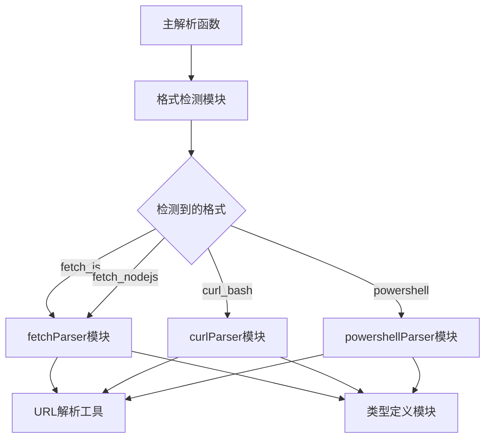
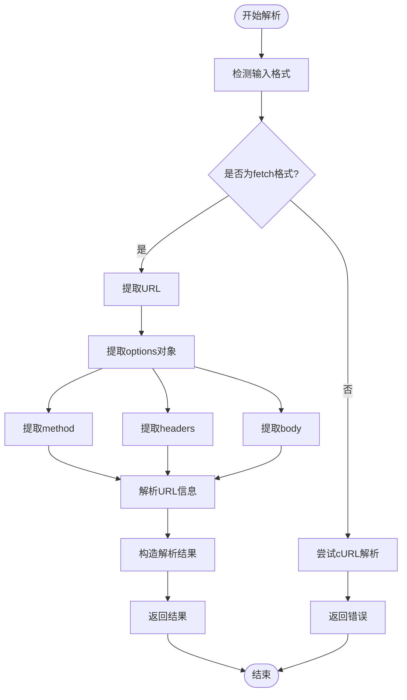
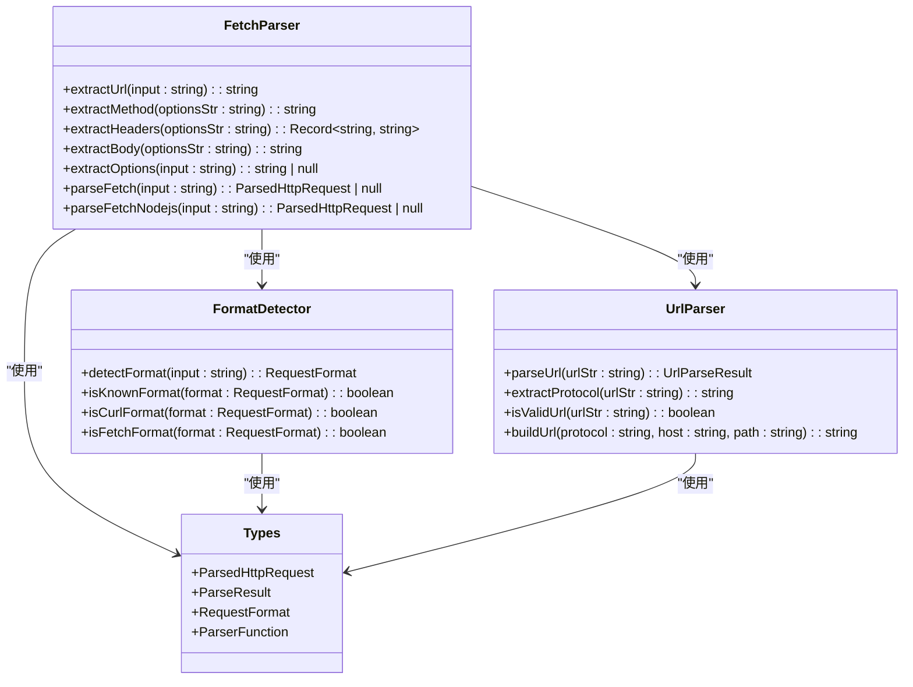
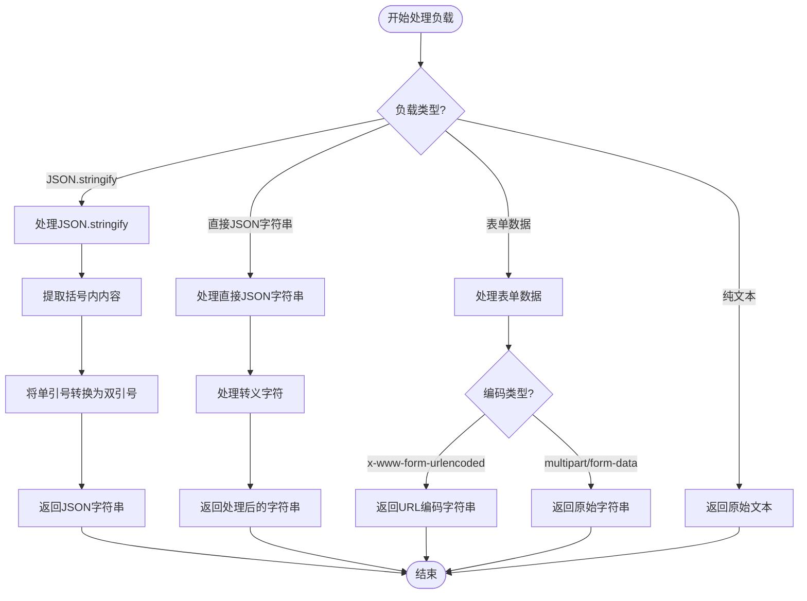
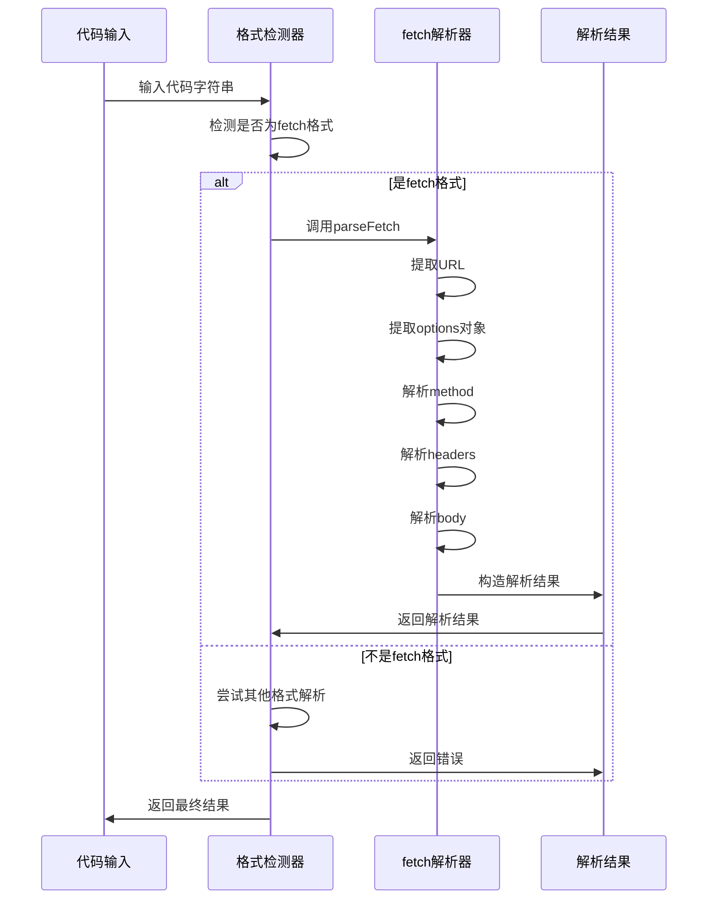

# fetch解析

<cite>
**本文档引用的文件**  
- [fetchParser.ts](file://src/frontEnd/src/utils/httpRequestParser/parsers/fetchParser.ts)
- [index.ts](file://src/frontEnd/src/utils/httpRequestParser/index.ts)
- [types.ts](file://src/frontEnd/src/utils/httpRequestParser/types.ts)
- [urlParser.ts](file://src/frontEnd/src/utils/httpRequestParser/urlParser.ts)
- [formatDetector.ts](file://src/frontEnd/src/utils/httpRequestParser/formatDetector.ts)
</cite>

## 目录
1. [介绍](#介绍)
2. [核心组件](#核心组件)
3. [fetch解析实现原理](#fetch解析实现原理)
4. [配置项解析详解](#配置项解析详解)
5. [负载类型处理](#负载类型处理)
6. [异步函数调用处理](#异步函数调用处理)
7. [解析示例](#解析示例)
8. [常见解析问题及解决方案](#常见解析问题及解决方案)

## 介绍
本项目中的fetch API请求解析功能是HTTP请求解析器的重要组成部分，主要用于解析JavaScript中fetch函数调用的各种格式。该功能支持解析浏览器fetch API和Node.js fetch格式，能够正确处理包含转义引号、嵌套JSON对象和多行格式的fetch调用。解析器通过一系列正则表达式和字符串处理技术，从fetch调用中提取URL、请求方法、头部对象、请求体等关键信息，并将其转换为标准的HTTP请求格式。

**fetch解析功能的主要特点包括**：
- 支持多种fetch调用格式（浏览器和Node.js）
- 正确处理JavaScript字符串中的转义引号
- 支持嵌套的JSON对象解析
- 处理多行格式的fetch调用
- 自动检测输入格式并选择合适的解析器

该功能在项目中被广泛应用于从Chrome DevTools复制的请求转换为标准HTTP报文，为安全测试和API调试提供了便利。

## 核心组件

fetch API请求解析功能由多个核心组件构成，这些组件协同工作以实现完整的解析功能。主要组件包括fetchParser模块、格式检测模块、URL解析工具和类型定义模块。

fetchParser模块是解析功能的核心，负责具体的fetch调用解析。格式检测模块用于自动识别输入文本的请求格式类型。URL解析工具提供URL解析相关的辅助函数。类型定义模块则定义了所有解析器共用的接口和类型。

这些组件通过模块化设计实现了高内聚低耦合，使得代码易于维护和扩展。每个组件都有明确的职责，通过清晰的接口进行通信，确保了解析功能的稳定性和可靠性。

**核心组件关系**


**组件来源**
- [fetchParser.ts](file://src/frontEnd/src/utils/httpRequestParser/parsers/fetchParser.ts#L1-L342)
- [formatDetector.ts](file://src/frontEnd/src/utils/httpRequestParser/formatDetector.ts#L1-L133)
- [urlParser.ts](file://src/frontEnd/src/utils/httpRequestParser/urlParser.ts#L1-L95)
- [types.ts](file://src/frontEnd/src/utils/httpRequestParser/types.ts#L1-L72)

## fetch解析实现原理

fetch解析功能的实现基于一系列精心设计的算法和正则表达式，能够准确地从fetch调用中提取各种配置项。解析过程遵循特定的步骤和逻辑，确保了高准确率和鲁棒性。

解析器首先通过`detectFormat`函数检测输入文本的格式类型。对于fetch调用，主要通过正则表达式`/^fetch\s*\(/i`来识别。一旦确定为fetch格式，解析器会根据上下文判断是浏览器fetch还是Node.js fetch，这通过检查是否存在`require('node-fetch')`或`import`语句来实现。

核心解析过程由`parseFetch`函数完成，该函数通过调用多个辅助函数来提取fetch调用的各个部分。首先使用`extractUrl`函数提取URL，然后使用`extractOptions`函数获取options对象，最后从options对象中分别提取method、headers和body。

解析器特别处理了JavaScript字符串中的转义引号，通过`matchJsString`函数正确解析包含`\"`的字符串。对于嵌套的JSON对象，解析器使用`findMatchingBrace`函数来定位匹配的大括号，确保能够正确解析复杂的对象结构。

整个解析过程被包裹在try-catch块中，以捕获和处理可能的解析错误，确保解析器的稳定性。



**解析原理来源**
- [fetchParser.ts](file://src/frontEnd/src/utils/httpRequestParser/parsers/fetchParser.ts#L293-L342)
- [formatDetector.ts](file://src/frontEnd/src/utils/httpRequestParser/formatDetector.ts#L83-L111)
- [index.ts](file://src/frontEnd/src/utils/httpRequestParser/index.ts#L103-L167)

## 配置项解析详解

fetch解析器能够准确地从fetch调用中提取各种配置项，包括URL、请求方法、头部对象、请求体、认证模式等。每个配置项都有专门的解析函数来处理其特定的格式和规则。

### URL解析
URL解析由`extractUrl`函数完成，使用正则表达式`/fetch\s*\(\s*(['"])((?:(?!\1)[^\\]|\\.)*)\1/i`来匹配fetch调用中的URL。该正则表达式支持双引号和单引号，并能正确处理引号内的转义字符。匹配结果中的第二个捕获组即为URL值。

### 请求方法解析
请求方法解析由`extractMethod`函数完成，使用正则表达式`/['"]?method['"]?\s*:\s*['"](\w+)['"]/i`来匹配method配置。该函数支持带引号和不带引号的method定义，并将结果转换为大写形式。如果未指定method，则默认返回'GET'。

### 头部对象解析
头部对象解析由`extractHeaders`函数完成，这是一个相对复杂的过程。函数首先定位headers对象的起始位置，然后使用`findMatchingBrace`函数找到匹配的结束大括号。在确定了headers对象的范围后，函数逐个解析key-value对，支持带引号和不带引号的key，并能正确处理转义引号。

### 请求体解析
请求体解析由`extractBody`函数完成，能够处理多种情况。函数首先检查是否存在`JSON.stringify`调用，如果存在则提取其参数并转换为JSON字符串。否则，尝试匹配字符串值。对于包含转义引号的请求体，函数能够正确解析并还原原始内容。

### 认证模式解析
虽然fetch API本身没有直接的认证模式配置，但解析器能够从headers中识别常见的认证头，如`Authorization`。这些信息可以用于后续的认证处理。



**配置项解析来源**
- [fetchParser.ts](file://src/frontEnd/src/utils/httpRequestParser/parsers/fetchParser.ts#L18-L273)
- [types.ts](file://src/frontEnd/src/utils/httpRequestParser/types.ts#L10-L25)

## 负载类型处理

fetch解析器能够处理多种负载类型，包括JSON格式请求体、表单数据、文本内容等。对于不同类型的负载，解析器采用不同的处理策略，确保能够正确提取和解析请求体内容。

### JSON格式请求体处理
对于JSON格式的请求体，解析器能够识别两种常见模式：直接字符串和`JSON.stringify`调用。当遇到`JSON.stringify`时，解析器会提取其参数，将单引号转换为双引号，并返回处理后的JSON字符串。对于直接的JSON字符串，解析器会正确处理其中的转义字符，确保JSON结构的完整性。

### 表单数据处理
虽然fetch API通常使用`FormData`对象发送表单数据，但解析器能够从请求体中识别和提取表单数据。对于`application/x-www-form-urlencoded`格式，解析器会保留原始的键值对字符串。对于`multipart/form-data`格式，由于其复杂性，解析器会将其作为原始字符串处理。

### 文本内容处理
对于纯文本内容，解析器直接提取请求体字符串，不做特殊处理。这种处理方式适用于发送纯文本、XML或其他文本格式的数据。

### 其他负载类型
解析器还能够处理二进制数据和文件上传等复杂情况。虽然这些情况在fetch调用中较少见，但解析器的设计考虑了这些可能性，确保了对各种负载类型的兼容性。



**负载类型处理来源**
- [fetchParser.ts](file://src/frontEnd/src/utils/httpRequestParser/parsers/fetchParser.ts#L208-L247)
- [types.ts](file://src/frontEnd/src/utils/httpRequestParser/types.ts#L22-L23)

## 异步函数调用处理

fetch解析器能够正确处理异步函数调用中的fetch请求，这是现代JavaScript应用中的常见模式。解析器不依赖于函数的执行上下文，而是专注于解析fetch调用本身的语法结构。

在异步函数中，fetch调用通常与`await`关键字一起使用，如`await fetch(url, options)`。解析器会忽略`await`关键字，直接解析其后的fetch调用。这是因为`await`只是影响函数的执行方式，不影响fetch调用的语法结构。

对于链式调用，如`fetch(url).then(response => response.json())`，解析器只关注fetch调用本身，忽略后续的`.then`链。这是因为解析器的目标是从fetch调用中提取HTTP请求信息，而不是执行或模拟整个调用链。

解析器还能够处理在箭头函数、async函数、普通函数等各种函数类型中的fetch调用。由于解析器基于正则表达式和字符串分析，它不关心fetch调用所在的函数类型，只关注fetch调用本身的语法模式。

这种设计使得解析器具有很高的灵活性和适应性，能够在各种复杂的代码结构中准确识别和解析fetch调用。



**异步函数调用处理来源**
- [fetchParser.ts](file://src/frontEnd/src/utils/httpRequestParser/parsers/fetchParser.ts#L293-L342)
- [index.ts](file://src/frontEnd/src/utils/httpRequestParser/index.ts#L130-L132)

## 解析示例

本节提供各种fetch调用模式的解析示例，展示解析器如何处理不同类型的fetch调用。

### 基本GET请求
```javascript
fetch('https://api.example.com/users')
```
解析结果：
- URL: https://api.example.com/users
- 方法: GET
- Headers: {}
- Body: ""

### POST请求带JSON数据
```javascript
fetch('https://api.example.com/users', {
  method: 'POST',
  headers: {
    'Content-Type': 'application/json',
  },
  body: JSON.stringify({
    name: 'John',
    age: 30
  })
})
```
解析结果：
- URL: https://api.example.com/users
- 方法: POST
- Headers: {"Content-Type": "application/json"}
- Body: {"name": "John", "age": 30}

### 带自定义头部的请求
```javascript
fetch('https://api.example.com/data', {
  headers: {
    'Authorization': 'Bearer token123',
    'X-Custom-Header': 'custom-value'
  }
})
```
解析结果：
- URL: https://api.example.com/data
- 方法: GET
- Headers: {"Authorization": "Bearer token123", "X-Custom-Header": "custom-value"}
- Body: ""

### 多行格式的fetch调用
```javascript
fetch('https://api.example.com/submit', {
  method: 'POST',
  headers: {
    'Content-Type': 'application/json',
    'sec-ch-ua': '"Chromium";v="138"'
  },
  body: '{"message": "Hello World"}'
})
```
解析结果：
- URL: https://api.example.com/submit
- 方法: POST
- Headers: {"Content-Type": "application/json", "sec-ch-ua": "\"Chromium\";v=\"138\""}
- Body: {"message": "Hello World"}

这些示例展示了解析器处理各种常见fetch调用模式的能力，包括基本请求、带数据的请求、带自定义头部的请求以及多行格式的请求。

**解析示例来源**
- [fetchParser.ts](file://src/frontEnd/src/utils/httpRequestParser/parsers/fetchParser.ts#L284-L291)
- [index.ts](file://src/frontEnd/src/utils/httpRequestParser/index.ts#L100-L101)

## 常见解析问题及解决方案

在使用fetch解析功能时，可能会遇到一些常见问题。本节列出这些问题并提供相应的解决方案。

### 问题1：无法识别的fetch调用格式
**现象**：解析器无法识别某些特殊的fetch调用格式，返回"无法识别的请求格式"错误。
**原因**：输入的fetch调用格式与解析器预期的模式不匹配。
**解决方案**：确保fetch调用遵循标准的JavaScript语法，URL使用引号包围，options对象使用正确的JSON格式。

### 问题2：转义引号处理错误
**现象**：包含转义引号的字符串（如`\"`）被错误解析。
**原因**：正则表达式未能正确处理复杂的转义序列。
**解决方案**：使用`matchJsString`函数专门处理JavaScript字符串，该函数能够正确解析各种转义字符。

### 问题3：嵌套对象解析失败
**现象**：包含嵌套JSON对象的fetch调用解析失败。
**原因**：简单的正则表达式无法正确匹配嵌套的大括号。
**解决方案**：使用`findMatchingBrace`函数，该函数通过计数器方式准确找到匹配的结束大括号，能够处理任意深度的嵌套。

### 问题4：多行格式解析错误
**现象**：跨多行的fetch调用解析错误。
**原因**：换行符和缩进影响了正则表达式的匹配。
**解决方案**：在解析前对输入进行预处理，去除不必要的空白字符，但保留语义相关的空白。

### 问题5：JSON.stringify解析失败
**现象**：包含`JSON.stringify`的请求体无法正确解析。
**原因**：未能正确识别和提取`JSON.stringify`的参数。
**解决方案**：专门检查`JSON.stringify`模式，使用括号匹配算法提取其参数，并进行适当的格式转换。

通过理解这些常见问题及其解决方案，用户可以更好地使用fetch解析功能，并在遇到问题时快速定位和解决。

**常见问题及解决方案来源**
- [fetchParser.ts](file://src/frontEnd/src/utils/httpRequestParser/parsers/fetchParser.ts#L325-L327)
- [index.ts](file://src/frontEnd/src/utils/httpRequestParser/index.ts#L144-L146)
- [formatDetector.ts](file://src/frontEnd/src/utils/httpRequestParser/formatDetector.ts#L109-L110)