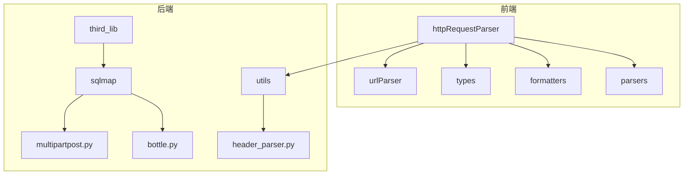
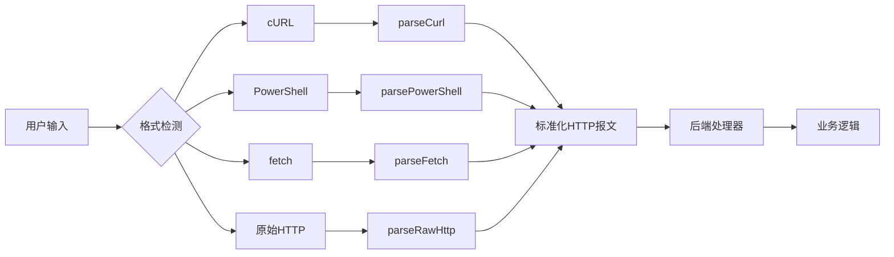
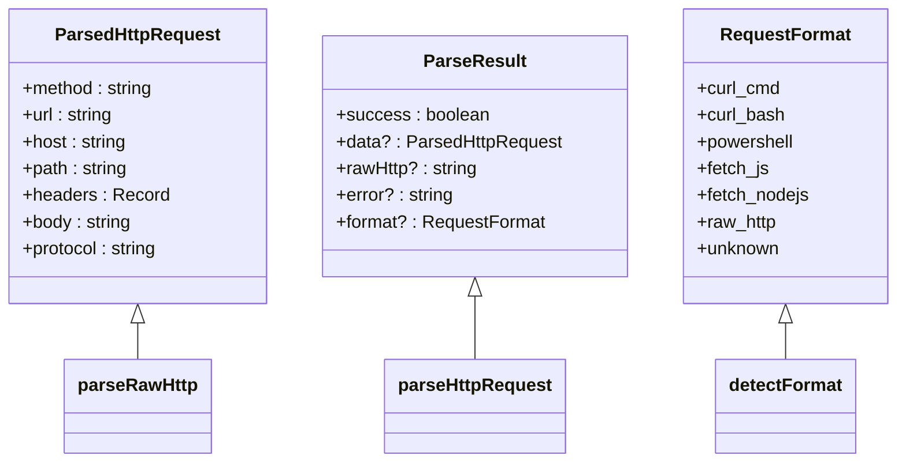
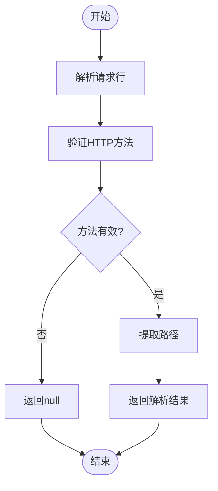
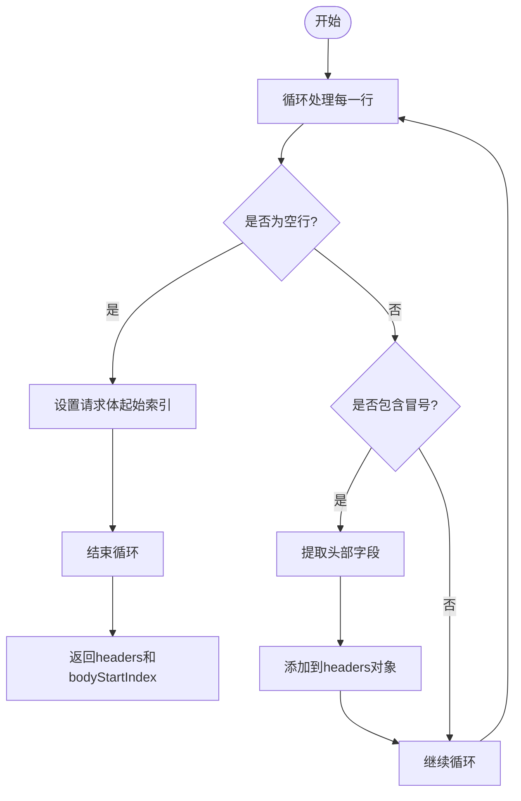
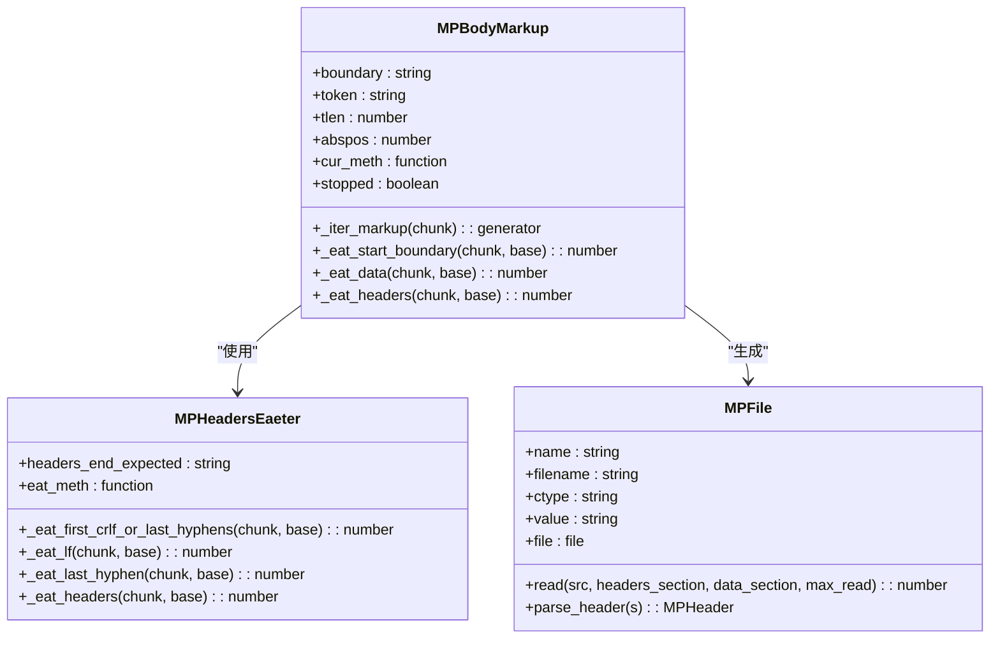
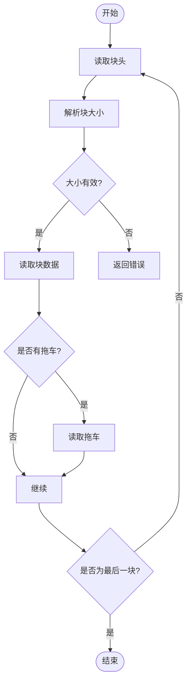
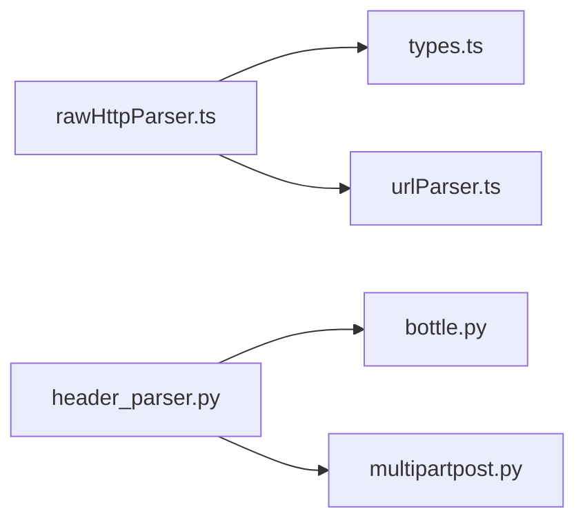

# 原始HTTP解析

<cite>
**本文档引用的文件**  
- [rawHttpParser.ts](file://src/frontEnd/src/utils/httpRequestParser/parsers/rawHttpParser.ts)
- [httpFormatter.ts](file://src/frontEnd/src/utils/httpRequestParser/formatters/httpFormatter.ts)
- [types.ts](file://src/frontEnd/src/utils/httpRequestParser/types.ts)
- [index.ts](file://src/frontEnd/src/utils/httpRequestParser/index.ts)
- [header_parser.py](file://src/backEnd/utils/header_parser.py)
- [bottle.py](file://src/backEnd/third_lib/sqlmap/thirdparty/bottle/bottle.py)
- [multipartpost.py](file://src/backEnd/third_lib/sqlmap/thirdparty/multipart/multipartpost.py)
</cite>

## 目录
1. [简介](#简介)
2. [项目结构](#项目结构)
3. [核心组件](#核心组件)
4. [架构概述](#架构概述)
5. [详细组件分析](#详细组件分析)
6. [依赖分析](#依赖分析)
7. [性能考虑](#性能考虑)
8. [故障排除指南](#故障排除指南)
9. [结论](#结论)

## 简介
本文档详细介绍了`rawHttpParser`的实现原理，重点阐述了如何解析标准HTTP请求报文。文档涵盖了HTTP请求行、请求头字段和请求体内容的解析机制，以及对分块传输编码、压缩编码、多部分表单数据等复杂HTTP特性的处理方式。同时，文档还解释了解析器如何正确处理换行符（CRLF）、空行分隔、头部字段的连续行等HTTP协议细节，并提供了各种复杂HTTP请求的解析示例。

## 项目结构
该项目是一个Web UI前端与后端服务相结合的系统，前端使用TypeScript实现HTTP报文解析功能，后端使用Python处理HTTP请求。前端的HTTP解析器位于`src/frontEnd/src/utils/httpRequestParser`目录下，而后端的HTTP处理逻辑则分布在`src/backEnd`目录中。

**图示来源**  
- [rawHttpParser.ts](file://src/frontEnd/src/utils/httpRequestParser/parsers/rawHttpParser.ts)
- [header_parser.py](file://src/backEnd/utils/header_parser.py)

**本节来源**  
- [rawHttpParser.ts](file://src/frontEnd/src/utils/httpRequestParser/parsers/rawHttpParser.ts)
- [header_parser.py](file://src/backEnd/utils/header_parser.py)

## 核心组件
`rawHttpParser`是前端HTTP解析器的核心组件，负责解析原始HTTP报文。它支持解析标准HTTP/1.1请求报文格式，包括请求行、请求头和请求体。解析器能够处理各种HTTP方法，如GET、POST、PUT、DELETE等，并能正确解析Host头、Content-Type头等常见头部字段。

**本节来源**  
- [rawHttpParser.ts](file://src/frontEnd/src/utils/httpRequestParser/parsers/rawHttpParser.ts)
- [types.ts](file://src/frontEnd/src/utils/httpRequestParser/types.ts)

## 架构概述
整个HTTP解析系统的架构分为前端解析器和后端处理器两部分。前端解析器负责将用户输入的多种格式（如cURL、PowerShell、fetch等）转换为标准的HTTP报文格式，而后端处理器则负责处理这些HTTP请求并执行相应的业务逻辑。

**图示来源**  
- [index.ts](file://src/frontEnd/src/utils/httpRequestParser/index.ts)
- [rawHttpParser.ts](file://src/frontEnd/src/utils/httpRequestParser/parsers/rawHttpParser.ts)

## 详细组件分析

### rawHttpParser分析
`rawHttpParser`是前端HTTP解析器的核心模块，负责解析原始HTTP报文。它通过正则表达式和字符串操作来解析HTTP请求的各个部分。

#### 类图

**图示来源**  
- [types.ts](file://src/frontEnd/src/utils/httpRequestParser/types.ts)
- [rawHttpParser.ts](file://src/frontEnd/src/utils/httpRequestParser/parsers/rawHttpParser.ts)

#### 请求行解析流程

**图示来源**  
- [rawHttpParser.ts](file://src/frontEnd/src/utils/httpRequestParser/parsers/rawHttpParser.ts#L28-L44)

#### 请求头解析流程

**图示来源**  
- [rawHttpParser.ts](file://src/frontEnd/src/utils/httpRequestParser/parsers/rawHttpParser.ts#L50-L78)

**本节来源**  
- [rawHttpParser.ts](file://src/frontEnd/src/utils/httpRequestParser/parsers/rawHttpParser.ts)
- [types.ts](file://src/frontEnd/src/utils/httpRequestParser/types.ts)

### 后端HTTP处理分析
后端使用Python的bottle框架处理HTTP请求，其中包含了对多部分表单数据、分块传输编码等复杂HTTP特性的处理。

#### 多部分表单数据处理

**图示来源**  
- [bottle.py](file://src/backEnd/third_lib/sqlmap/thirdparty/bottle/bottle.py#L1244-L1502)

#### 分块传输编码处理

**图示来源**  
- [bottle.py](file://src/backEnd/third_lib/sqlmap/thirdparty/bottle/bottle.py#L1693-L1719)

**本节来源**  
- [bottle.py](file://src/backEnd/third_lib/sqlmap/thirdparty/bottle/bottle.py)
- [multipartpost.py](file://src/backEnd/third_lib/sqlmap/thirdparty/multipart/multipartpost.py)

## 依赖分析
`rawHttpParser`模块依赖于`types.ts`中定义的类型，以及`urlParser.ts`中的URL解析工具。后端的HTTP处理依赖于bottle框架和multipart库。

**图示来源**  
- [rawHttpParser.ts](file://src/frontEnd/src/utils/httpRequestParser/parsers/rawHttpParser.ts)
- [header_parser.py](file://src/backEnd/utils/header_parser.py)

**本节来源**  
- [rawHttpParser.ts](file://src/frontEnd/src/utils/httpRequestParser/parsers/rawHttpParser.ts)
- [header_parser.py](file://src/backEnd/utils/header_parser.py)

## 性能考虑
`rawHttpParser`在解析HTTP报文时采用了高效的字符串操作和正则表达式匹配，避免了不必要的内存分配。后端的HTTP处理也考虑了性能优化，如使用生成器处理大文件上传，避免一次性加载整个请求体到内存中。

## 故障排除指南
当`rawHttpParser`无法正确解析HTTP报文时，可以检查以下几点：
1. 确保HTTP请求行格式正确，如`GET /path HTTP/1.1`
2. 检查请求头是否使用正确的冒号分隔，如`Content-Type: application/json`
3. 确保请求头和请求体之间有空行分隔
4. 对于多部分表单数据，检查边界字符串是否正确

**本节来源**  
- [rawHttpParser.ts](file://src/frontEnd/src/utils/httpRequestParser/parsers/rawHttpParser.ts)
- [bottle.py](file://src/backEnd/third_lib/sqlmap/thirdparty/bottle/bottle.py)

## 结论
`rawHttpParser`是一个功能完整的HTTP报文解析器，能够正确解析各种格式的HTTP请求。它与后端的HTTP处理系统协同工作，为整个Web UI提供了可靠的HTTP请求处理能力。通过深入理解其工作原理，开发者可以更好地利用这一工具，提高开发效率和系统稳定性。