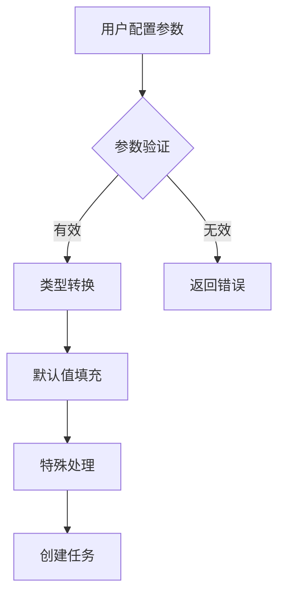

# 任务创建与配置

<cite>
**本文档引用的文件**   
- [TaskRequest.py](file://src/backEnd/model/requestModel/TaskRequest.py)
- [webTaskController.py](file://src/backEnd/api/commonApi/webTaskController.py)
- [Task.py](file://src/backEnd/model/Task.py)
- [taskService.py](file://src/backEnd/service/taskService.py)
- [index.ts](file://src/frontEnd/src/utils/httpRequestParser/index.ts)
- [formatDetector.ts](file://src/frontEnd/src/utils/httpRequestParser/formatDetector.ts)
- [AddTask/index.vue](file://src/frontEnd/src/views/AddTask/index.vue)
- [scanConfigParser.ts](file://src/frontEnd/src/utils/scanConfigParser.ts)
- [GuidedParamEditor.vue](file://src/frontEnd/src/components/GuidedParamEditor.vue)
- [httpFormatter.ts](file://src/frontEnd/src/utils/httpRequestParser/formatters/httpFormatter.ts)
- [curlParser.ts](file://src/frontEnd/src/utils/httpRequestParser/parsers/curlParser.ts)
- [rawHttpParser.ts](file://src/frontEnd/src/utils/httpRequestParser/parsers/rawHttpParser.ts)
- [scanPreset.ts](file://src/frontEnd/src/types/scanPreset.ts)
- [task.ts](file://src/frontEnd/src/types/task.ts)
</cite>

## 目录
1. [任务创建流程概述](#任务创建流程概述)
2. [HTTP请求导入与解析](#http请求导入与解析)
3. [TaskRequest数据模型](#taskrequest数据模型)
4. [前端HTTP请求解析器](#前端http请求解析器)
5. [参数映射与默认值设置](#参数映射与默认值设置)
6. [引导式参数编辑器](#引导式参数编辑器)
7. [常见配置错误解决方案](#常见配置错误解决方案)

## 任务创建流程概述

任务创建与配置功能是sqlmapWebUI的核心功能之一，它允许用户通过多种格式导入HTTP请求并配置扫描参数。整个流程从用户在前端界面输入HTTP请求开始，经过解析、转换、参数配置，最终创建任务并提交给后端处理。

该流程涉及前端和后端多个组件的协同工作。前端负责请求的解析和用户界面的交互，后端负责任务的创建、管理和执行。整个流程的设计旨在提供一个用户友好的界面，同时保持与sqlmap工具的强大功能的兼容性。

**Section sources**
- [AddTask/index.vue](file://src/frontEnd/src/views/AddTask/index.vue#L1-L800)
- [webTaskController.py](file://src/backEnd/api/commonApi/webTaskController.py#L1-L91)

## HTTP请求导入与解析

sqlmapWebUI支持从多种格式导入HTTP请求，包括cURL、PowerShell、fetch和原始HTTP报文。这些格式都是开发人员在日常工作中常用的工具，因此支持这些格式可以大大提高用户的使用便利性。

### 支持的请求格式

系统支持以下四种主要格式的HTTP请求导入：

1. **cURL格式**：包括bash和cmd两种变体，是Linux和Windows系统中最常用的命令行工具。
2. **PowerShell格式**：Windows系统中的强大脚本语言，常用于自动化任务。
3. **fetch格式**：现代JavaScript中的网络请求API，广泛用于前端开发。
4. **原始HTTP报文**：标准的HTTP协议格式，可以直接从网络抓包工具中复制。

### 请求解析流程

当用户在前端界面粘贴HTTP请求时，系统会自动检测请求的格式并进行解析。解析过程分为以下几个步骤：

1. **格式检测**：系统首先分析输入文本的特征，确定其所属的格式类型。
2. **语法解析**：根据检测到的格式，调用相应的解析器进行语法分析。
3. **数据提取**：从解析结果中提取出URL、方法、头部、主体等关键信息。
4. **格式转换**：将提取的信息转换为统一的内部表示形式，便于后续处理。

**Diagram sources**
- [index.ts](file://src/frontEnd/src/utils/httpRequestParser/index.ts#L103-L167)
- [formatDetector.ts](file://src/frontEnd/src/utils/httpRequestParser/formatDetector.ts#L83-L110)

**Section sources**
- [index.ts](file://src/frontEnd/src/utils/httpRequestParser/index.ts#L1-L168)
- [formatDetector.ts](file://src/frontEnd/src/utils/httpRequestParser/formatDetector.ts#L1-L133)

## TaskRequest数据模型

TaskRequest是后端用于接收任务创建请求的数据模型，它定义了任务创建所需的所有参数及其验证规则。该模型使用Pydantic库实现，提供了强大的数据验证和序列化功能。

### 数据模型结构

TaskRequest模型包含以下主要字段：

- **scanUrl**：扫描目标的完整URL，是任务创建的必要参数。
- **host**：目标主机名，用于构建HTTP请求。
- **headers**：请求头部列表，每个头部以"Name: Value"的格式表示。
- **body**：请求主体内容，用于POST等需要数据的请求。
- **options**：扫描参数配置，包含sqlmap支持的各种扫描选项。

### 验证规则

模型对每个字段都定义了严格的验证规则，确保输入数据的正确性和安全性：

- **scanUrl**：必须是一个有效的URL字符串。
- **host**：必须是非空字符串，长度在合理范围内。
- **headers**：必须是一个字符串列表，每个字符串必须包含冒号分隔的头部名称和值。
- **options**：必须是一个非空的字典，包含有效的扫描参数。

**Diagram sources**
- [TaskRequest.py](file://src/backEnd/model/requestModel/TaskRequest.py#L31-L37)

**Section sources**
- [TaskRequest.py](file://src/backEnd/model/requestModel/TaskRequest.py#L1-L57)

## 前端HTTP请求解析器

前端HTTP请求解析器是整个任务创建流程的关键组件，它负责将用户输入的各种格式的HTTP请求转换为统一的内部表示形式。解析器采用模块化设计，由多个子模块协同工作。

### 核心组件

解析器主要由以下几个核心组件构成：

1. **格式检测器**：负责自动识别输入文本的格式类型。
2. **解析器**：针对每种格式提供专门的解析逻辑。
3. **格式化器**：将解析结果转换为各种输出格式。
4. **URL工具**：提供URL解析和构建功能。

### 解析器工作机制

解析器的工作机制可以概括为以下几个步骤：

1. **输入验证**：首先检查输入是否为空或无效。
2. **格式检测**：使用正则表达式和模式匹配技术检测输入格式。
3. **选择解析器**：根据检测结果选择相应的解析器。
4. **执行解析**：调用解析器进行语法分析和数据提取。
5. **结果返回**：返回解析结果，包括成功标志、解析数据和原始HTTP报文。

**Diagram sources**
- [index.ts](file://src/frontEnd/src/utils/httpRequestParser/index.ts#L103-L167)
- [formatDetector.ts](file://src/frontEnd/src/utils/httpRequestParser/formatDetector.ts#L83-L110)
- [httpFormatter.ts](file://src/frontEnd/src/utils/httpRequestParser/formatters/httpFormatter.ts#L29-L54)

**Section sources**
- [index.ts](file://src/frontEnd/src/utils/httpRequestParser/index.ts#L1-L168)
- [formatDetector.ts](file://src/frontEnd/src/utils/httpRequestParser/formatDetector.ts#L1-L133)
- [httpFormatter.ts](file://src/frontEnd/src/utils/httpRequestParser/formatters/httpFormatter.ts#L1-L128)

## 参数映射与默认值设置

在任务创建过程中，参数映射和默认值设置是确保任务正确执行的重要环节。系统需要将用户配置的参数正确映射到sqlmap的选项，并为未指定的参数提供合理的默认值。

### 参数映射机制

参数映射机制主要通过以下方式实现：

1. **选项验证**：检查用户提供的选项是否在sqlmap支持的范围内。
2. **类型转换**：将前端传递的参数值转换为sqlmap期望的类型。
3. **默认值填充**：为未指定的参数设置合理的默认值。
4. **特殊处理**：对一些特殊参数进行额外的处理，如批量模式、禁用颜色等。

### 默认值设置

系统为所有扫描参数都设置了合理的默认值，这些默认值基于最佳实践和安全考虑：

- **batch模式**：强制启用，避免交互式提示。
- **禁用颜色**：禁用终端颜色输出，便于日志记录。
- **ETA**：禁用剩余时间估算，减少不必要的计算。
- **检测级别**：默认为1，平衡扫描速度和深度。
- **风险级别**：默认为1，避免高风险操作。

**Diagram sources**
- [Task.py](file://src/backEnd/model/Task.py#L75-L95)
- [taskService.py](file://src/backEnd/service/taskService.py#L58-L87)

**Section sources**
- [Task.py](file://src/backEnd/model/Task.py#L1-L333)
- [taskService.py](file://src/backEnd/service/taskService.py#L1-L535)

## 引导式参数编辑器

引导式参数编辑器是sqlmapWebUI提供的一个高级功能，它通过图形化界面帮助用户配置复杂的扫描参数。编辑器将复杂的命令行参数组织成易于理解的分类，降低了使用门槛。

### 编辑器功能

引导式参数编辑器提供以下主要功能：

1. **参数分类**：将所有参数按功能分为检测、注入、技术、请求、枚举和通用等类别。
2. **实时预览**：在用户配置参数的同时，实时显示对应的命令行参数字符串。
3. **搜索过滤**：支持通过关键词搜索和过滤参数，快速找到所需选项。
4. **预设管理**：允许用户保存和加载常用的参数配置。

### 使用方法

使用引导式参数编辑器的步骤如下：

1. 打开参数编辑器对话框。
2. 在左侧选择参数类别。
3. 在参数列表中勾选需要的选项。
4. 根据需要调整参数值。
5. 查看右侧的实时预览。
6. 保存配置或直接提交任务。

**Diagram sources**
- [GuidedParamEditor.vue](file://src/frontEnd/src/components/GuidedParamEditor.vue#L1-L546)
- [GuidedParamEditorDialog.vue](file://src/frontEnd/src/components/GuidedParamEditorDialog.vue#L1-L149)

**Section sources**
- [GuidedParamEditor.vue](file://src/frontEnd/src/components/GuidedParamEditor.vue#L1-L546)
- [GuidedParamEditorDialog.vue](file://src/frontEnd/src/components/GuidedParamEditorDialog.vue#L1-L149)

## 常见配置错误解决方案

在使用任务创建与配置功能时，用户可能会遇到一些常见的配置错误。了解这些错误的原因和解决方案可以帮助用户更高效地使用系统。

### 常见错误类型

1. **格式识别错误**：系统无法正确识别输入的HTTP请求格式。
2. **参数值错误**：提供的参数值不在有效范围内或格式不正确。
3. **必填参数缺失**：缺少必要的参数，如scanUrl或options。
4. **网络连接问题**：无法连接到目标服务器或代理配置错误。

### 解决方案

针对上述常见错误，可以采取以下解决方案：

- **格式识别错误**：确保输入的请求格式正确，必要时手动选择格式。
- **参数值错误**：检查参数值是否在有效范围内，参考文档中的说明。
- **必填参数缺失**：确保所有必填参数都已正确填写。
- **网络连接问题**：检查网络连接和代理配置，确保可以访问目标服务器。

**Section sources**
- [webTaskController.py](file://src/backEnd/api/commonApi/webTaskController.py#L47-L54)
- [taskService.py](file://src/backEnd/service/taskService.py#L23-L43)
- [AddTask/index.vue](file://src/frontEnd/src/views/AddTask/index.vue#L616-L629)