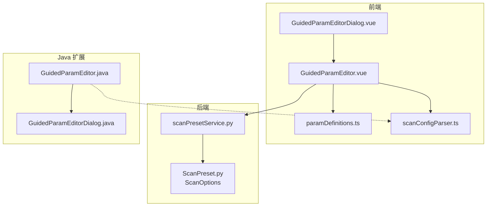
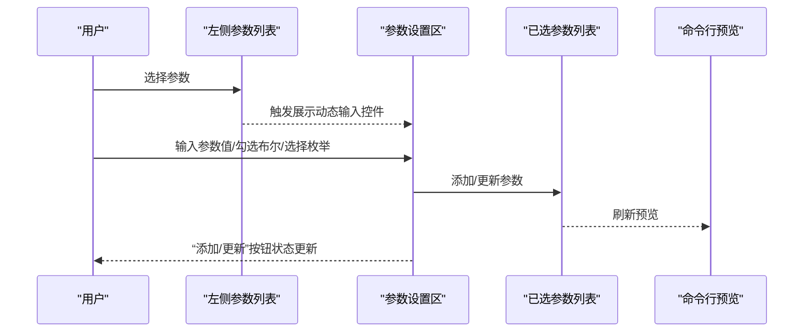
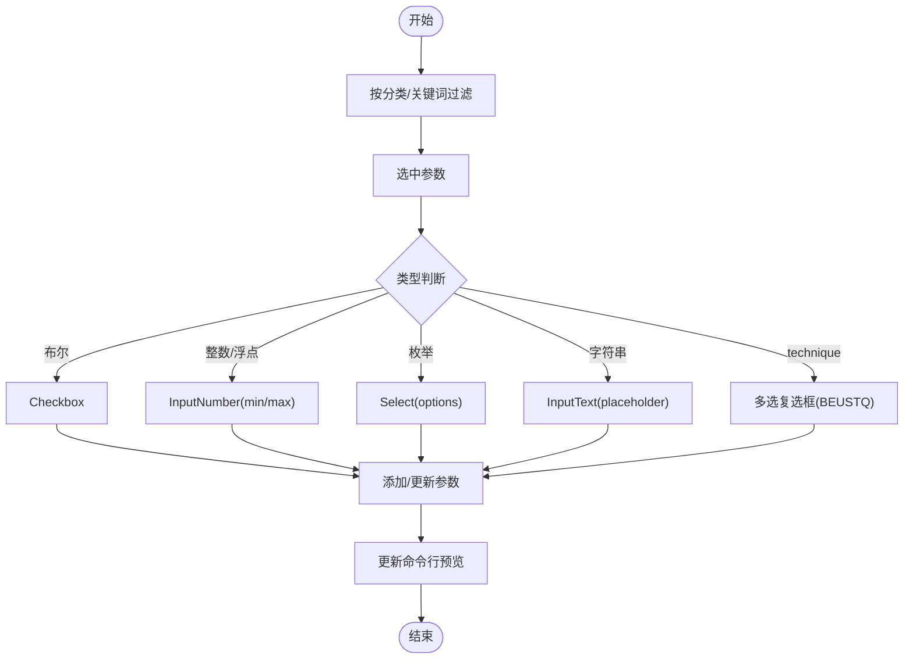
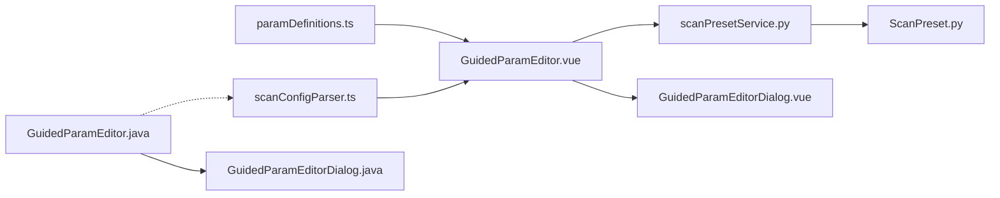

# 引导式参数编辑器

<cite>
**本文引用的文件**
- [GuidedParamEditor.vue](file://src/frontEnd/src/components/GuidedParamEditor.vue)
- [GuidedParamEditorDialog.vue](file://src/frontEnd/src/components/GuidedParamEditorDialog.vue)
- [paramDefinitions.ts](file://src/frontEnd/src/utils/paramDefinitions.ts)
- [scanConfigParser.ts](file://src/frontEnd/src/utils/scanConfigParser.ts)
- [GuidedParamEditor.java](file://src/burpEx/montoya-api/src/main/java/com/sqlmapwebui/burp/panels/GuidedParamEditor.java)
- [GuidedParamEditorDialog.java](file://src/burpEx/montoya-api/src/main/java/com/sqlmapwebui/burp/panels/GuidedParamEditorDialog.java)
- [ScanPreset.py](file://src/backEnd/model/ScanPreset.py)
- [scanPresetService.py](file://src/backEnd/service/scanPresetService.py)
- [README.md](file://README.md)
- [USAGE_GUIDE.md](file://doc/USAGE_GUIDE.md)
</cite>

## 目录
1. [简介](#简介)
2. [项目结构](#项目结构)
3. [核心组件](#核心组件)
4. [架构总览](#架构总览)
5. [详细组件分析](#详细组件分析)
6. [依赖关系分析](#依赖关系分析)
7. [性能考虑](#性能考虑)
8. [故障排查指南](#故障排查指南)
9. [结论](#结论)
10. [附录](#附录)

## 简介
引导式参数编辑器是一个可视化界面，帮助用户通过分类、搜索、动态输入控件与命令行预览，构建符合 sqlmap 语义的扫描命令参数。编辑器同时提供前端 Vue 组件与 Java Swing 组件两套实现，分别用于 Web 前端与 Burp Suite 扩展插件。编辑器的核心价值在于：
- 参数定义集中管理，便于维护与扩展
- 智能搜索与分类筛选，快速定位参数
- 动态输入控件适配布尔/数值/字符串/枚举/多选等类型
- 实时命令行预览，支持 HTML 高亮
- 与后端扫描配置预设系统无缝衔接，支持“默认配置/常用配置/历史配置”的复用

## 项目结构
引导式参数编辑器涉及三层：
- 前端 Vue 实现：负责 Web 界面交互与参数预览
- 后端扫描配置模型与服务：负责配置的持久化与复用
- Java Swing 实现：负责 Burp Suite 插件中的参数配置对话框

图表来源
- [GuidedParamEditor.vue](file://src/frontEnd/src/components/GuidedParamEditor.vue#L1-L120)
- [GuidedParamEditorDialog.vue](file://src/frontEnd/src/components/GuidedParamEditorDialog.vue#L1-L60)
- [paramDefinitions.ts](file://src/frontEnd/src/utils/paramDefinitions.ts#L1-L60)
- [scanConfigParser.ts](file://src/frontEnd/src/utils/scanConfigParser.ts#L1-L60)
- [ScanPreset.py](file://src/backEnd/model/ScanPreset.py#L1-L60)
- [scanPresetService.py](file://src/backEnd/service/scanPresetService.py#L1-L60)
- [GuidedParamEditor.java](file://src/burpEx/montoya-api/src/main/java/com/sqlmapwebui/burp/panels/GuidedParamEditor.java#L1-L60)
- [GuidedParamEditorDialog.java](file://src/burpEx/montoya-api/src/main/java/com/sqlmapwebui/burp/panels/GuidedParamEditorDialog.java#L1-L60)

章节来源
- [README.md](file://README.md#L34-L40)
- [USAGE_GUIDE.md](file://doc/USAGE_GUIDE.md#L210-L218)

## 核心组件
- 参数定义与分类
  - 前端参数定义文件集中维护参数键名、显示名、命令行名、描述、分类、类型、默认值、取值范围与枚举选项
  - Java 端通过扫描解析器获取参数元数据，保证前后端参数语义一致
- 可视化编辑器
  - 左侧：分类筛选、搜索（支持正则/大小写/反转）、参数列表
  - 中部：参数设置区（动态输入控件、布尔/数值/字符串/枚举/多选）
  - 右侧：已选参数列表（双击编辑、移除、清空）
  - 底部：命令行参数预览（HTML 高亮）
- 对话框封装
  - 前端对话框：包含“配置名称/描述”输入与编辑器主体，支持保存为常用配置
  - Java 对话框：封装编辑器组件为模态对话框，支持新增/编辑模式

章节来源
- [paramDefinitions.ts](file://src/frontEnd/src/utils/paramDefinitions.ts#L1-L132)
- [GuidedParamEditor.vue](file://src/frontEnd/src/components/GuidedParamEditor.vue#L1-L120)
- [GuidedParamEditorDialog.vue](file://src/frontEnd/src/components/GuidedParamEditorDialog.vue#L1-L60)
- [GuidedParamEditor.java](file://src/burpEx/montoya-api/src/main/java/com/sqlmapwebui/burp/panels/GuidedParamEditor.java#L1-L120)
- [GuidedParamEditorDialog.java](file://src/burpEx/montoya-api/src/main/java/com/sqlmapwebui/burp/panels/GuidedParamEditorDialog.java#L1-L60)

## 架构总览
编辑器的控制流与数据流如下：
- 用户在左侧筛选/搜索参数，选中后右侧动态生成输入控件
- 用户输入参数值，点击“添加/更新”，编辑器内部维护已选参数映射
- 编辑器实时生成命令行预览（前端 HTML 高亮；Java 生成 HTML 字符串）
- 前端编辑器通过 change 事件向外发出参数字符串，供上层组件保存为常用配置
- Java 编辑器通过 getCommandLine 生成参数字符串，供插件调用

图表来源
- [GuidedParamEditor.vue](file://src/frontEnd/src/components/GuidedParamEditor.vue#L246-L351)
- [GuidedParamEditor.java](file://src/burpEx/montoya-api/src/main/java/com/sqlmapwebui/burp/panels/GuidedParamEditor.java#L380-L592)

## 详细组件分析

### 前端组件：GuidedParamEditor.vue
- 布局与交互
  - 左侧：分类选择、搜索框、正则/大小写/反转选项、参数列表（支持双击快速添加）
  - 中部：参数设置区（动态输入控件、布尔/数值/字符串/枚举/多选）
  - 右侧：已选参数列表（双击编辑、移除、清空）
  - 底部：命令行预览（HTML 高亮，布尔/参数名/参数值不同颜色）
- 参数类型与输入控件
  - 布尔：Checkbox
  - 整数/浮点：InputNumber（带 min/max、步进）
  - 枚举：Select（从参数定义 options 生成）
  - 字符串：InputText（带 placeholder 描述）
  - 特殊：technique 使用多选复选框，值拼接为字符串
- 搜索与过滤
  - 支持正则、大小写敏感、反转过滤
  - 过滤基于参数名与描述的组合
- 命令行预览
  - 布尔参数仅输出参数名
  - 非布尔参数输出 “--key=value” 或 “--key="value"”
  - HTML 高亮区分 flag、param、value
- 事件与暴露方法
  - change 事件：对外输出参数字符串
  - getCommandLine：生成命令行字符串
  - loadFromParamString：从参数字符串加载（使用 scanConfigParser）

图表来源
- [GuidedParamEditor.vue](file://src/frontEnd/src/components/GuidedParamEditor.vue#L173-L351)

章节来源
- [GuidedParamEditor.vue](file://src/frontEnd/src/components/GuidedParamEditor.vue#L1-L476)
- [paramDefinitions.ts](file://src/frontEnd/src/utils/paramDefinitions.ts#L1-L132)
- [scanConfigParser.ts](file://src/frontEnd/src/utils/scanConfigParser.ts#L216-L321)

### 前端组件：GuidedParamEditorDialog.vue
- 功能
  - 封装编辑器为对话框，包含“配置名称/描述”输入
  - 保存时收集 name/description/paramString 并通过 confirm 事件返回
  - 暴露 getCommandLine/getFormData 供外部调用
- 适用场景
  - 新建常用配置
  - 编辑已有配置（传入 initialParams）

章节来源
- [GuidedParamEditorDialog.vue](file://src/frontEnd/src/components/GuidedParamEditorDialog.vue#L1-L134)

### Java 组件：GuidedParamEditor.java
- UI 组件
  - 搜索面板：分类下拉、搜索框、正则/大小写/反转复选框
  - 参数列表：JList + 自定义渲染器
  - 参数输入面板：动态输入控件 + 添加/移除按钮
  - 已选参数面板：JList + 双击编辑
  - 命令行预览：JEditorPane（HTML）
- 参数类型与输入控件
  - 布尔：JCheckBox
  - 数值：JSpinner（min/max）
  - 枚举：JComboBox（DBMS/OS/Method）
  - 字符串：JTextField
  - 特殊：technique 多选面板（B/E/U/S/T/Q）
- 命令行生成
  - 通过参数元数据映射 CLI 名称（驼峰转短横线，部分特殊映射）
  - 布尔参数仅输出参数名；字符串值包含空格时加引号
  - 生成 HTML 高亮字符串用于预览
- 事件与回调
  - onChange 回调：参数变更时触发
  - loadFromParamString：从参数字符串加载（基于扫描解析器）

章节来源
- [GuidedParamEditor.java](file://src/burpEx/montoya-api/src/main/java/com/sqlmapwebui/burp/panels/GuidedParamEditor.java#L1-L200)
- [GuidedParamEditor.java](file://src/burpEx/montoya-api/src/main/java/com/sqlmapwebui/burp/panels/GuidedParamEditor.java#L561-L800)

### Java 组件：GuidedParamEditorDialog.java
- 功能
  - 将 GuidedParamEditor 组件封装为模态对话框
  - 顶部固定“配置名称/描述”输入框（始终可编辑）
  - 点击“保存”校验名称，收集编辑器命令行字符串与配置信息
- 适用场景
  - Burp 插件中新建/编辑扫描参数配置

章节来源
- [GuidedParamEditorDialog.java](file://src/burpEx/montoya-api/src/main/java/com/sqlmapwebui/burp/panels/GuidedParamEditorDialog.java#L1-L158)
- [GuidedParamEditorDialog.java](file://src/burpEx/montoya-api/src/main/java/com/sqlmapwebui/burp/panels/GuidedParamEditorDialog.java#L158-L354)

### 参数定义文件（paramDefinitions.ts）
- 结构
  - ParamDefinition：key/name/cliName/description/category/type/defaultValue/min/max/options
  - ParamCategory：key/label
  - PARAM_DEFINITIONS：参数列表
  - 辅助函数：getParamDefinition/getParamByCliName
- 分类组织
  - detection/injection/techniques/request/optimization/enumeration/general
- 维护要点
  - 新增参数时同步更新 PARAM_DEFINITIONS 与 PARAM_CATEGORIES
  - 对于布尔参数，注意默认值与“false 时移除”的行为差异（前端与 Java 实现略有不同）

章节来源
- [paramDefinitions.ts](file://src/frontEnd/src/utils/paramDefinitions.ts#L1-L132)

### 参数解析器（scanConfigParser.ts）
- 作用
  - 将命令行参数字符串解析为 ScanOptions
  - 将 ScanOptions 转回命令行参数字符串
  - 提供参数元数据（名称、长选项、短选项、类型、默认值、取值范围、有效值）
- 关键能力
  - mri 解析（支持别名：短选项、camelCase）
  - 范围与有效性校验（数字 min/max、字符串有效值列表）
  - 未识别参数告警
  - toParameterString 支持包含默认值与否
- 与编辑器的关系
  - 前端编辑器在初始化时可从参数字符串加载（loadFromParamString）
  - 前端编辑器对外输出参数字符串（getCommandLine）

章节来源
- [scanConfigParser.ts](file://src/frontEnd/src/utils/scanConfigParser.ts#L1-L170)
- [scanConfigParser.ts](file://src/frontEnd/src/utils/scanConfigParser.ts#L216-L377)

### 后端扫描配置模型与服务
- ScanOptions：扫描选项模型，字段与 sqlmap 的 optiondict.py 保持一致
- ScanPreset：包含 id/name/description/preset_type/options/parameter_string/is_active 等
- scanPresetService：提供默认配置、常用配置、历史配置的 CRUD 与合并逻辑
- 与编辑器的关系
  - 前端编辑器输出的 paramString 可保存为常用配置
  - 后端服务提供“默认配置/常用配置/历史配置”的读取与应用

章节来源
- [ScanPreset.py](file://src/backEnd/model/ScanPreset.py#L1-L120)
- [scanPresetService.py](file://src/backEnd/service/scanPresetService.py#L1-L120)

## 依赖关系分析
- 前端编辑器依赖参数定义与解析器
  - 参数定义：paramDefinitions.ts
  - 参数解析：scanConfigParser.ts
- 前端对话框依赖编辑器组件
- 后端服务依赖模型
- Java 编辑器依赖扫描解析器（与前端保持一致的参数元数据）

图表来源
- [paramDefinitions.ts](file://src/frontEnd/src/utils/paramDefinitions.ts#L1-L60)
- [scanConfigParser.ts](file://src/frontEnd/src/utils/scanConfigParser.ts#L1-L60)
- [GuidedParamEditor.vue](file://src/frontEnd/src/components/GuidedParamEditor.vue#L1-L120)
- [GuidedParamEditorDialog.vue](file://src/frontEnd/src/components/GuidedParamEditorDialog.vue#L1-L60)
- [ScanPreset.py](file://src/backEnd/model/ScanPreset.py#L1-L60)
- [scanPresetService.py](file://src/backEnd/service/scanPresetService.py#L1-L60)
- [GuidedParamEditor.java](file://src/burpEx/montoya-api/src/main/java/com/sqlmapwebui/burp/panels/GuidedParamEditor.java#L1-L60)
- [GuidedParamEditorDialog.java](file://src/burpEx/montoya-api/src/main/java/com/sqlmapwebui/burp/panels/GuidedParamEditorDialog.java#L1-L60)

## 性能考虑
- 前端
  - 过滤与预览均为纯前端计算，复杂度与参数数量线性相关
  - 动态输入控件按类型生成，避免不必要的 DOM 更新
  - 命令行预览使用 HTML 字符串拼接，建议在大量参数时减少频繁重算
- Java
  - JList 渲染器与 DocumentListener 事件触发较为频繁，建议在高频输入场景下节流
  - HTML 预览通过 JEditorPane 渲染，注意大字符串时的 UI 卡顿

[本节为通用指导，不直接分析具体文件]

## 故障排查指南
- 参数未出现在预览
  - 检查参数类型：布尔参数为 false 时会被移除
  - 检查空值：字符串/数值为空不会出现在预览
- 技术选择未生效
  - technique 为多选，需确保各字母均被勾选
- 搜索无结果
  - 检查正则表达式是否有效
  - 检查大小写敏感与反转选项
- 命令行字符串不符合预期
  - 检查参数是否包含空格（需加引号）
  - 检查 CLI 名称映射（部分参数有短横线/别名）
- 与后端配置不一致
  - 确认参数定义与解析器元数据一致
  - 确认后端 ScanOptions 字段与 sqlmap 保持一致

章节来源
- [GuidedParamEditor.vue](file://src/frontEnd/src/components/GuidedParamEditor.vue#L331-L351)
- [GuidedParamEditor.java](file://src/burpEx/montoya-api/src/main/java/com/sqlmapwebui/burp/panels/GuidedParamEditor.java#L676-L768)
- [scanConfigParser.ts](file://src/frontEnd/src/utils/scanConfigParser.ts#L216-L321)

## 结论
引导式参数编辑器通过参数定义集中管理、动态输入控件与命令行预览，显著降低了用户记忆命令行参数的成本。前端与 Java 两端实现保持一致的参数语义，既满足 Web 界面使用，又能在 Burp 插件中复用。结合后端扫描配置预设系统，用户可以快速建立“默认配置/常用配置/历史配置”的参数库，提升扫描效率与一致性。

[本节为总结性内容，不直接分析具体文件]

## 附录

### 使用引导式编辑器配置典型扫描场景（步骤指南）
- 布尔盲注（快速）
  1) 选择“Techniques 技术”分类，勾选“布尔盲注”
  2) 选择“Detection 检测”分类，设置 level/risk
  3) 选择“General 通用”分类，启用 batch
  4) 预览命令行，确认包含布尔盲注技术
  5) 保存为常用配置（名称如“快速布尔盲注”）
- 时间盲注（深度）
  1) 选择“Techniques 技术”分类，勾选“时间盲注”
  2) 在“Request 请求”分类设置 time-sec、delay、timeout
  3) 在“Optimization 优化”分类设置 threads
  4) 预览命令行，确认包含时间盲注与并发
  5) 保存为常用配置（名称如“深度时间盲注”）
- 数据导出（枚举）
  1) 选择“Enumeration 枚举”分类，勾选“导出数据/导出所有数据”
  2) 在“Enumeration 枚举”分类设置 db/tbl/col
  3) 预览命令行，确认包含导出相关参数
  4) 保存为常用配置（名称如“数据导出”）

章节来源
- [USAGE_GUIDE.md](file://doc/USAGE_GUIDE.md#L210-L218)
- [paramDefinitions.ts](file://src/frontEnd/src/utils/paramDefinitions.ts#L49-L121)

### 与直接输入参数模式的优劣对比
- 优势
  - 可视化：参数分类与动态控件降低记忆成本
  - 实时预览：即时看到命令行参数，减少拼写错误
  - 一致性：统一的参数定义与解析，避免歧义
  - 复用：与后端预设系统联动，便于团队共享
- 劣势
  - 灵活性：某些高级参数可能不在可视化控件中
  - 学习曲线：首次使用需要熟悉参数分类与含义
  - 性能：大量参数时预览与过滤可能较慢

章节来源
- [README.md](file://README.md#L34-L40)
- [USAGE_GUIDE.md](file://doc/USAGE_GUIDE.md#L210-L218)