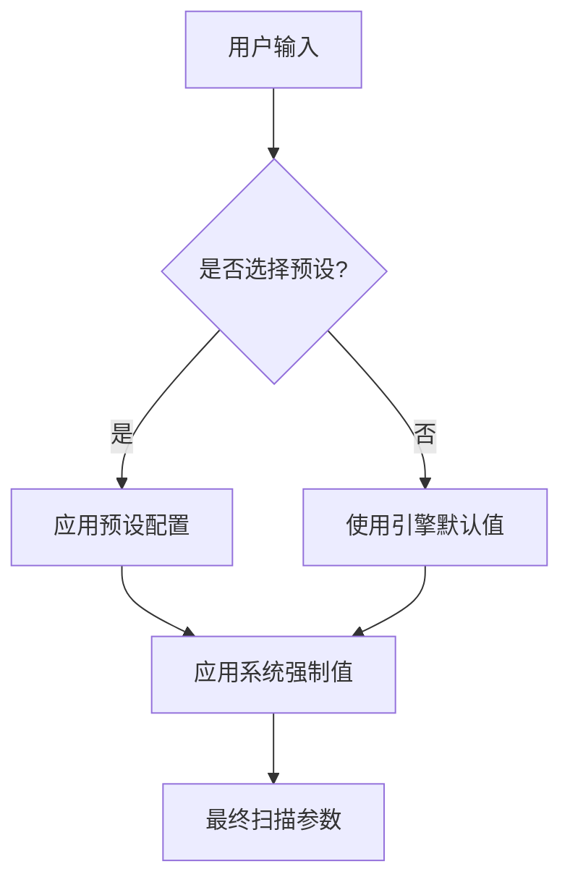

# 扫描参数配置

<cite>
**本文档引用的文件**   
- [TaskRequest.py](file://src/backEnd/model/requestModel/TaskRequest.py)
- [webTaskController.py](file://src/backEnd/api/commonApi/webTaskController.py)
- [taskService.py](file://src/backEnd/service/taskService.py)
- [Task.py](file://src/backEnd/model/Task.py)
- [paramDefinitions.ts](file://src/frontEnd/src/utils/paramDefinitions.ts)
- [AddTask.vue](file://src/frontEnd/src/views/AddTask/index.vue)
- [ScanPreset.py](file://src/backEnd/model/ScanPreset.py)
- [scanPreset.ts](file://src/frontEnd/src/stores/scanPreset.ts)
- [optiondict.py](file://src/backEnd/third_lib/sqlmap/lib/core/optiondict.py)
</cite>

## 目录
1. [简介](#简介)
2. [核心数据模型](#核心数据模型)
3. [参数分组与映射](#参数分组与映射)
4. [默认值与继承机制](#默认值与继承机制)
5. [前端表单验证](#前端表单验证)
6. [典型配置示例](#典型配置示例)
7. [潜在风险说明](#潜在风险说明)

## 简介
sqlmapWebUI提供了一个全面的扫描参数配置系统，允许用户通过Web界面配置sqlmap引擎的所有扫描选项。系统通过`TaskRequest`模型接收扫描任务请求，其中`options`字段包含了所有可配置的扫描参数。这些参数被组织成多个逻辑分组，如检测、注入、技术、请求、优化、枚举和通用选项，便于用户理解和配置。前端通过`GuidedParamEditor`组件提供引导式参数编辑，支持命令行参数字符串的导入和导出，确保与BurpSuite插件的兼容性。

## 核心数据模型

`TaskRequest`模型定义了添加扫描任务所需的请求结构。核心字段包括`scanUrl`（扫描地址）、`host`（目标主机）、`headers`（请求头列表）、`body`（请求体）和`options`（扫描参数配置）。`options`是一个字典类型，包含了所有传递给sqlmap引擎的配置选项。后端服务在接收到请求后，会验证`options`的有效性，并将其与任务的其他信息一起存储在任务池中，然后启动sqlmap引擎进行扫描。

**Section sources**
- [TaskRequest.py](file://src/backEnd/model/requestModel/TaskRequest.py#L31-L37)
- [webTaskController.py](file://src/backEnd/api/commonApi/webTaskController.py#L19-L80)
- [taskService.py](file://src/backEnd/service/taskService.py#L58-L87)

## 参数分组与映射

扫描参数被分为七个主要逻辑分组，每个分组对应sqlmap引擎的一类功能。这些分组在前端UI中以折叠面板的形式呈现，用户可以按需展开和配置。

### 检测选项
检测选项控制sqlmap如何识别SQL注入漏洞。`level`（检测级别）从1到5，级别越高，测试的参数和payload越多。`risk`（风险级别）从1到3，级别越高，使用的payload越危险。`string`、`notString`、`regexp`和`code`用于指定页面响应的判断条件，当响应包含/不包含特定字符串、匹配正则表达式或返回特定状态码时，sqlmap会认为注入成功。`smart`启用智能启发式检测，`textOnly`仅基于文本内容比较，`titles`仅基于标题比较。

### 注入选项
注入选项定义了注入的目标和方式。`testParameter`指定要测试的参数，`skip`跳过指定参数，`skipStatic`跳过静态参数。`dbms`和`os`分别指定目标数据库类型和操作系统，用于针对性的注入。`prefix`和`suffix`用于构造注入payload的前后缀。`tamper`指定一个或多个tamper脚本，用于绕过WAF/IPS。

### 技术选项
技术选项指定sqlmap使用的注入技术。`technique`是一个字符串，包含一个或多个字母，每个字母代表一种技术：B（布尔盲注）、E（报错注入）、U（联合查询）、S（堆叠查询）、T（时间盲注）、Q（内联查询）。`timeSec`设置时间盲注的延迟秒数，用于调整检测的灵敏度。

### 请求选项
请求选项控制sqlmap如何发送HTTP请求。`timeout`设置请求超时时间，`retries`设置重试次数，`delay`设置请求间的延迟。`randomAgent`使用随机User-Agent，`proxy`设置HTTP代理，`tor`使用Tor网络。`threads`设置并发线程数，影响扫描速度。

### 优化选项
优化选项用于提高扫描效率。`optimize`启用所有优化选项，`keepAlive`保持连接，`nullConnection`使用空连接。`threads`也属于此分组，影响并发性能。

### 枚举选项
枚举选项用于在发现注入后获取数据库信息。`getBanner`获取DBMS Banner，`getCurrentUser`获取当前用户，`getCurrentDb`获取当前数据库，`isDba`检测是否为DBA。`getUsers`、`getDbs`、`getTables`、`getColumns`分别用于枚举用户、数据库、表和列。`dumpTable`和`dumpAll`用于导出数据。

### 通用选项
通用选项控制sqlmap的整体行为。`batch`启用批处理模式，不与用户交互。`forms`解析并测试表单。`crawlDepth`设置爬取深度。`flushSession`刷新会话文件，`freshQueries`忽略会话缓存。`verbose`设置详细级别，从0（静默）到6（HTTP响应体）。

```mermaid
graph TD
A[检测选项] --> A1[level]
A --> A2[risk]
A --> A3[string]
A --> A4[notString]
A --> A5[regexp]
A --> A6[code]
A --> A7[smart]
A --> A8[textOnly]
A --> A9[titles]
B[注入选项] --> B1[testParameter]
B --> B2[skip]
B --> B3[skipStatic]
B --> B4[paramExclude]
B --> B5[dbms]
B --> B6[os]
B --> B7[prefix]
B --> B8[suffix]
B --> B9[tamper]
C[技术选项] --> C1[technique]
C --> C2[timeSec]
D[请求选项] --> D1[timeout]
D --> D2[retries]
D --> D3[delay]
D --> D4[randomAgent]
D --> D5[proxy]
D --> D6[tor]
D --> D7[threads]
E[优化选项] --> E1[optimize]
E --> E2[keepAlive]
E --> E3[nullConnection]
E --> E4[threads]
F[枚举选项] --> F1[getBanner]
F --> F2[getCurrentUser]
F --> F3[getCurrentDb]
F --> F4[isDba]
F --> F5[getUsers]
F --> F6[getDbs]
F --> F7[getTables]
F --> F8[getColumns]
F --> F9[dumpTable]
F --> F10[dumpAll]
F --> F11[db]
F --> F12[tbl]
F --> F13[col]
G[通用选项] --> G1[batch]
G --> G2[forms]
G --> G3[crawlDepth]
G --> G4[flushSession]
G --> G5[freshQueries]
G --> G6[verbose]
```



**Diagram sources **
- [paramDefinitions.ts](file://src/frontEnd/src/utils/paramDefinitions.ts#L49-L120)
- [ScanPreset.py](file://src/backEnd/model/ScanPreset.py#L24-L90)

## 默认值与继承机制

系统实现了多层默认值和继承机制，确保用户配置的灵活性和一致性。

### 引擎默认值
当一个`Task`对象被创建时，`initialize_options`方法会遍历`optDict`（来自sqlmap的`optiondict.py`），为每个参数设置其默认值。这些默认值由`_defaults`字典提供。例如，`level`的默认值是1，`risk`的默认值是1，`threads`的默认值是1。此外，系统会强制设置一些特定的默认值，如`batch=True`、`disableColoring=True`和`eta=False`，以确保API调用的非交互性和一致性。

### 系统强制值
系统会强制覆盖一些参数，以确保安全和稳定。`batch`选项始终被设置为`True`，以避免在Web界面中出现交互式提示。`api`、`taskid`和`database`选项由系统自动设置，用于标识API调用、任务ID和会话数据库路径。

### 预设继承
用户可以通过“配置预设”功能保存和加载常用的参数组合。系统预定义了“默认配置”、“快速扫描”、“深度扫描”和“安全扫描”等预设。当用户选择一个预设时，其配置会覆盖当前的参数设置。用户也可以将当前配置保存为新的预设，或将其添加到历史记录中，方便后续复用。



**Diagram sources **
- [Task.py](file://src/backEnd/model/Task.py#L75-L95)
- [ScanPreset.py](file://src/backEnd/model/ScanPreset.py#L172-L230)
- [scanPreset.ts](file://src/frontEnd/src/stores/scanPreset.ts#L121-L126)

## 前端表单验证

前端通过`validator.ts`和`paramDefinitions.ts`中的定义实现表单验证。每个参数都有明确的数据类型和验证规则。例如，`level`和`risk`是整数，范围分别为1-5和1-3；`threads`是1-10的整数；`verbose`是0-6的整数。`delay`和`timeout`是浮点数和整数，有最小值限制。`dbms`和`os`是选择框，有预定义的选项列表。

当用户在“引导式参数编辑器”中输入参数时，系统会实时验证输入值。对于数值类型，输入框会限制输入范围。对于字符串类型，没有长度限制，但会进行基本的非空检查。当用户提交任务时，前端会调用`getEffectiveOptions`方法，只提交那些与默认值不同的参数，以减少网络传输量。如果用户未解析HTTP报文，提交按钮将被禁用，并显示“请先输入并解析HTTP报文”的提示。

**Section sources**
- [paramDefinitions.ts](file://src/frontEnd/src/utils/paramDefinitions.ts#L12-L16)
- [AddTask.vue](file://src/frontEnd/src/views/AddTask/index.vue#L545-L548)
- [AddTask.vue](file://src/frontEnd/src/views/AddTask/index.vue#L689-L703)

## 典型配置示例

### 快速扫描
适用于初步探测，速度快，风险低。
```json
{
  "level": 1,
  "risk": 1,
  "technique": "B",
  "batch": true
}
```

### 深度扫描
适用于全面审计，检测深入，耗时较长。
```json
{
  "level": 5,
  "risk": 3,
  "technique": "BEUSTQ",
  "threads": 3,
  "batch": true
}
```

### 安全扫描
适用于生产环境，风险最低，避免对目标造成影响。
```json
{
  "level": 3,
  "risk": 1,
  "technique": "BEU",
  "delay": 1,
  "batch": true
}
```

### 枚举扫描
在发现注入点后，用于获取数据库详细信息。
```json
{
  "getBanner": true,
  "getCurrentUser": true,
  "getCurrentDb": true,
  "isDba": true,
  "getDbs": true,
  "getTables": true,
  "getColumns": true,
  "dumpAll": true,
  "batch": true
}
```

## 潜在风险说明
- **高风险级别 (`risk=3`)**: 使用可能导致数据库崩溃或服务器宕机的payload，仅在测试环境中使用。
- **堆叠查询 (`technique=S`)**: 可能执行任意SQL语句，包括`DROP TABLE`等破坏性操作，需谨慎使用。
- **操作系统命令执行 (`osCmd`, `osShell`)**: 可直接控制目标服务器，属于高危操作，必须获得明确授权。
- **高并发线程 (`threads>5`)**: 可能对目标服务器造成DoS攻击，影响正常服务。
- **爬取深度 (`crawlDepth>2`)**: 可能访问大量页面，产生大量请求，需注意网络流量和扫描时间。