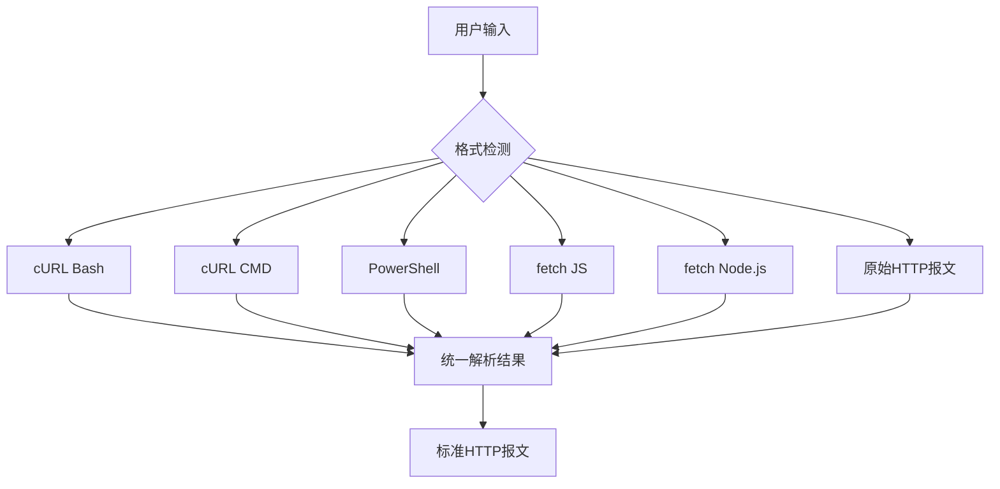
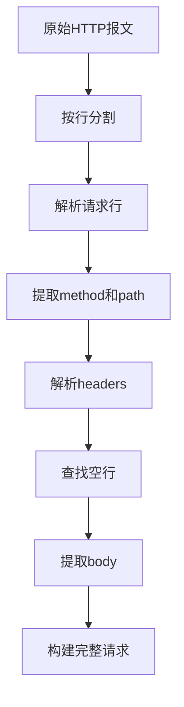
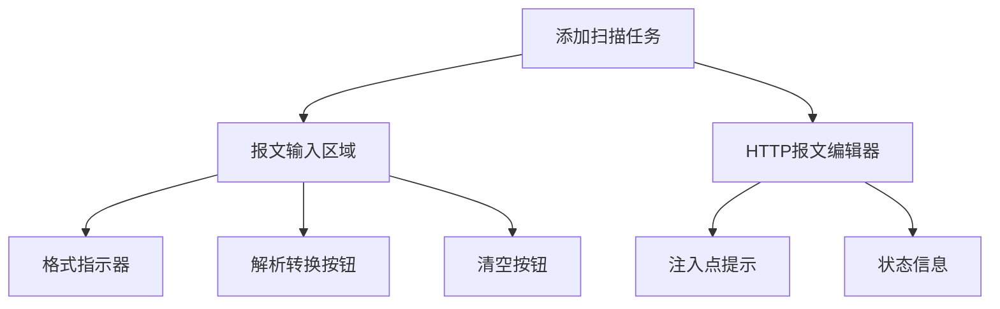
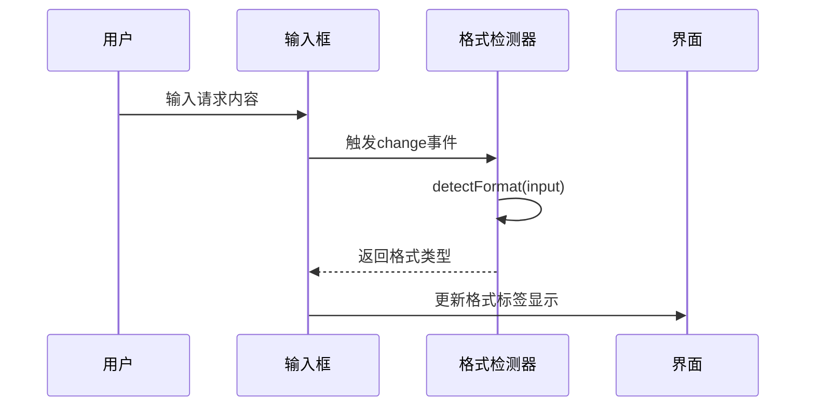

# 请求解析与导入

<cite>
**本文档引用的文件**  
- [index.ts](file://src/frontEnd/src/utils/httpRequestParser/index.ts)
- [formatDetector.ts](file://src/frontEnd/src/utils/httpRequestParser/formatDetector.ts)
- [types.ts](file://src/frontEnd/src/utils/httpRequestParser/types.ts)
- [curlParser.ts](file://src/frontEnd/src/utils/httpRequestParser/parsers/curlParser.ts)
- [fetchParser.ts](file://src/frontEnd/src/utils/httpRequestParser/parsers/fetchParser.ts)
- [powershellParser.ts](file://src/frontEnd/src/utils/httpRequestParser/parsers/powershellParser.ts)
- [rawHttpParser.ts](file://src/frontEnd/src/utils/httpRequestParser/parsers/rawHttpParser.ts)
- [httpFormatter.ts](file://src/frontEnd/src/utils/httpRequestParser/formatters/httpFormatter.ts)
- [urlParser.ts](file://src/frontEnd/src/utils/httpRequestParser/urlParser.ts)
- [AddTask/index.vue](file://src/frontEnd/src/views/AddTask/index.vue)
- [HttpCodeEditor.vue](file://src/frontEnd/src/components/HttpCodeEditor.vue)
- [TaskRequest.py](file://src/backEnd/model/requestModel/TaskRequest.py)
</cite>

## 目录
1. [功能概述](#功能概述)
2. [支持的请求格式](#支持的请求格式)
3. [格式自动检测机制](#格式自动检测机制)
4. [解析器实现机制](#解析器实现机制)
5. [前端交互设计](#前端交互设计)
6. [解析结果可视化](#解析结果可视化)
7. [最佳实践与故障排除](#最佳实践与故障排除)

## 功能概述

sqlmapWebUI 提供了强大的请求解析与导入功能，允许用户从浏览器开发者工具中复制各种格式的HTTP请求，并将其转换为标准HTTP报文用于安全扫描。该功能支持多种常见的请求格式，包括cURL、PowerShell、fetch API调用和原始HTTP报文。

系统通过前端JavaScript实现完整的解析逻辑，无需依赖后端处理，提供即时的格式检测和转换反馈。解析后的请求可以进一步编辑，并标记SQL注入点（使用`*`符号），然后提交给sqlmap进行漏洞检测。

**Section sources**
- [AddTask/index.vue](file://src/frontEnd/src/views/AddTask/index.vue#L1-L200)

## 支持的请求格式

sqlmapWebUI支持以下五种主要的HTTP请求格式：

### cURL格式
- **cURL (Bash)**：Linux/Mac系统下的命令行格式
- **cURL (Windows CMD)**：Windows命令行格式，使用`^`作为续行符

### PowerShell格式
- **PowerShell**：使用`Invoke-WebRequest`或`Invoke-RestMethod`命令

### fetch格式
- **fetch (JavaScript)**：浏览器环境中的fetch API调用
- **fetch (Node.js)**：Node.js环境中的fetch调用

### 原始HTTP报文
- **原始HTTP报文**：标准的HTTP/1.1请求格式

这些格式通过统一的解析接口处理，最终都转换为相同的内部数据结构。



**Diagram sources**
- [types.ts](file://src/frontEnd/src/utils/httpRequestParser/types.ts#L46-L53)
- [formatDetector.ts](file://src/frontEnd/src/utils/httpRequestParser/formatDetector.ts#L23-L68)

## 格式自动检测机制

系统采用基于正则表达式的优先级匹配算法来自动检测输入请求的格式类型。

### 检测流程
1. 首先检测是否为原始HTTP报文格式
2. 然后检测cURL命令
3. 接着检测PowerShell命令
4. 最后检测fetch调用

### 检测规则
```mermaid
graph TD
Start[开始检测] --> RawHttp{是否匹配<br/>HTTP请求行格式?}
RawHttp --> |是| ReturnRaw[返回 raw_http]
RawHttp --> |否| Curl{是否以 curl 开头?}
Curl --> |是| CurlDiscriminator[区分cmd/bash]
CurlDiscriminator --> |包含^| ReturnCurlCmd[返回 curl_cmd]
CurlDiscriminator --> |不包含^| ReturnCurlBash[返回 curl_bash]
Curl --> |否| PowerShell{是否匹配<br/>Invoke-WebRequest?}
PowerShell --> |是| ReturnPowerShell[返回 powershell]
PowerShell --> |否| Fetch{是否以 fetch( 开头?}
Fetch --> |是| FetchDiscriminator[区分js/nodejs]
FetchDiscriminator --> |包含node-fetch| ReturnFetchNodejs[返回 fetch_nodejs]
FetchDiscriminator --> |不包含| ReturnFetchJs[返回 fetch_js]
Fetch --> |否| ReturnUnknown[返回 unknown]
```

**Section sources**
- [formatDetector.ts](file://src/frontEnd/src/utils/httpRequestParser/formatDetector.ts#L23-L111)

## 解析器实现机制

### 统一数据结构

所有解析器都返回相同的`ParsedHttpRequest`接口，确保格式一致性：

```typescript
interface ParsedHttpRequest {
  method: string
  url: string
  host: string
  path: string
  headers: Record<string, string>
  body: string
  protocol: string
}
```

**Section sources**
- [types.ts](file://src/frontEnd/src/utils/httpRequestParser/types.ts#L10-L25)

### cURL解析器

#### Bash格式解析
- 处理`\` + 换行的续行符
- 使用`@scrape-do/curl-parser`库进行基础解析
- 特殊处理引号转义（`\"` → `"`）

#### Windows CMD格式解析
- 处理`^` + 换行的续行符
- 处理`^"`表示双引号
- 处理`^\^"`表示嵌套引号
- 处理`^X`表示特殊字符转义

```mermaid
graph TD
A[原始cURL命令] --> B{Windows CMD?}
B --> |是| C[替换 ^\\n 为空格]
B --> |否| D[替换 \\n 为空格]
C --> E[替换 ^\" 为 "]
D --> F[使用curl-parser库解析]
E --> F
F --> G[重新提取body内容]
G --> H[恢复嵌套引号]
H --> I[返回解析结果]
```

**Section sources**
- [curlParser.ts](file://src/frontEnd/src/utils/httpRequestParser/parsers/curlParser.ts#L1-L180)

### PowerShell解析器

PowerShell解析器需要处理反引号（`）作为转义字符的特殊情况：

- ``"` → `"`
- ``n` → 换行符
- ``r` → 回车符
- ``` → 反引号本身
- `` + 换行 → 续行符

解析步骤：
1. 处理续行符（反引号+换行）
2. 提取URL（支持`-Uri`参数和直接URL）
3. 提取HTTP方法（`-Method`参数）
4. 提取Content-Type（`-ContentType`参数）
5. 解析Headers哈希表（`@{}`语法）
6. 提取Body内容（支持普通字符串和Here-String）

**Section sources**
- [powershellParser.ts](file://src/frontEnd/src/utils/httpRequestParser/parsers/powershellParser.ts#L1-L210)

### fetch解析器

fetch解析器需要正确处理JavaScript字符串中的转义字符：

#### 字符串解析
- 支持单引号和双引号字符串
- 正确处理`\"`转义引号
- 支持多行字符串

#### 对象解析
- 查找匹配的大括号位置
- 跳过字符串内的括号
- 正确处理转义字符

#### 提取流程
1. 提取URL（第一个参数）
2. 提取options对象（第二个参数）
3. 从options中提取method
4. 解析headers对象
5. 提取body内容（支持直接字符串和JSON.stringify）

**Section sources**
- [fetchParser.ts](file://src/frontEnd/src/utils/httpRequestParser/parsers/fetchParser.ts#L1-L343)

### 原始HTTP报文解析器

原始HTTP报文解析遵循标准HTTP/1.1协议：

#### 请求行解析
- 格式：`METHOD PATH HTTP/VERSION`
- 验证HTTP方法有效性
- 支持所有标准HTTP方法

#### 头部解析
- 按行处理直到空行
- 解析`Name: Value`格式
- 支持换行续行（未在代码中实现）

#### Body提取
- 空行后的内容为body
- 保持原始换行符



**Section sources**
- [rawHttpParser.ts](file://src/frontEnd/src/utils/httpRequestParser/parsers/rawHttpParser.ts#L1-L170)

## 前端交互设计

### 输入区域设计

请求输入区域采用双面板设计：



**Section sources**
- [AddTask/index.vue](file://src/frontEnd/src/views/AddTask/index.vue#L8-L77)

### 格式自动识别

系统在用户输入时实时检测格式：

- 输入框内容变化时触发格式检测
- 在输入区域标题显示格式类型标签
- 不同格式使用不同颜色标识



**Section sources**
- [AddTask/index.vue](file://src/frontEnd/src/views/AddTask/index.vue#L604-L615)

### 代码编辑器功能

使用自定义的`HttpCodeEditor`组件提供专业编辑体验：

- 语法高亮（HTTP关键字）
- 搜索功能（支持正则表达式）
- 行号显示
- 只读模式切换

**Section sources**
- [HttpCodeEditor.vue](file://src/frontEnd/src/components/HttpCodeEditor.vue#L1-L169)

## 解析结果可视化

### 转换后显示

解析成功后，系统将请求转换为标准HTTP报文格式显示：

```
POST /api/users HTTP/1.1
Host: example.com
Content-Type: application/json
Authorization: Bearer token123

{"name":"test","email":"test@example.com"}
```

### 状态信息展示

在编辑器下方显示请求的关键信息：

- 请求方法和主机名
- 请求路径
- 自动标记注入点

### 错误反馈

解析失败时提供明确的错误提示：

- 输入为空
- 格式无法识别
- 解析过程出错

```mermaid
graph TD
A[点击解析转换] --> B{输入是否为空?}
B --> |是| C[显示"输入内容为空"]
B --> |否| D[调用parseHttpRequest]
D --> E{解析是否成功?}
E --> |是| F[显示成功提示]
E --> |否| G[显示失败原因]
F --> H[更新HTTP报文显示]
G --> I[显示错误toast]
```

**Section sources**
- [AddTask/index.vue](file://src/frontEnd/src/views/AddTask/index.vue#L608-L625)

## 最佳实践与故障排除

### 正确示例

#### cURL格式
```bash
curl 'https://api.example.com/users?id=1' \
  -H 'Content-Type: application/json' \
  -H 'Authorization: Bearer token123' \
  -d '{"name":"test"}'
```

#### PowerShell格式
```powershell
Invoke-WebRequest -Uri "https://api.example.com/users" `
  -Method "POST" `
  -Headers @{"Content-Type"="application/json"; "Authorization"="Bearer token123"} `
  -Body "{`"name`":`"test`"}"
```

#### fetch格式
```javascript
fetch("https://api.example.com/users", {
  "headers": {
    "content-type": "application/json",
    "authorization": "Bearer token123"
  },
  "body": "{\"name\":\"test\"}",
  "method": "POST"
})
```

#### 原始HTTP报文
```
POST /api/users?id=1 HTTP/1.1
Host: api.example.com
Content-Type: application/json
Authorization: Bearer token123

{"name":"test"}
```

### 常见错误模式

#### cURL常见问题
- **引号不匹配**：确保所有引号正确闭合
- **续行符错误**：Bash使用`\`，CMD使用`^`
- **JSON转义**：在CMD中使用`^\^"`表示JSON中的引号

#### PowerShell常见问题
- **反引号转义**：JSON中的引号需要使用`\"`
- **Here-String格式**：使用`@"... "@`多行字符串
- **哈希表语法**：Headers使用`@{"key"="value"}`格式

#### fetch常见问题
- **引号转义**：JSON字符串中的引号使用`\"`
- **JSON.stringify**：正确处理`JSON.stringify(obj)`调用
- **对象语法**：确保options对象语法正确

### 故障排除指南

#### 无法识别格式
1. 检查输入是否为空
2. 确认格式是否在支持列表中
3. 尝试简化请求内容
4. 手动转换为原始HTTP报文

#### 解析结果不正确
1. 检查特殊字符转义
2. 验证续行符使用正确
3. 确认引号使用一致
4. 检查JSON格式有效性

#### Body内容丢失
1. 确保data参数使用正确引号
2. 检查JSON字符串转义
3. 验证请求方法与body匹配
4. 尝试使用原始HTTP报文格式

**Section sources**
- [AddTask/index.vue](file://src/frontEnd/src/views/AddTask/index.vue#L585-L595)
- [index.ts](file://src/frontEnd/src/utils/httpRequestParser/index.ts#L103-L149)