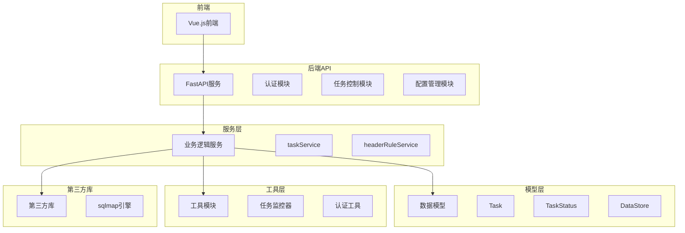
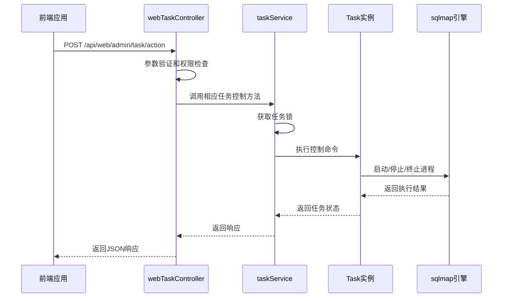
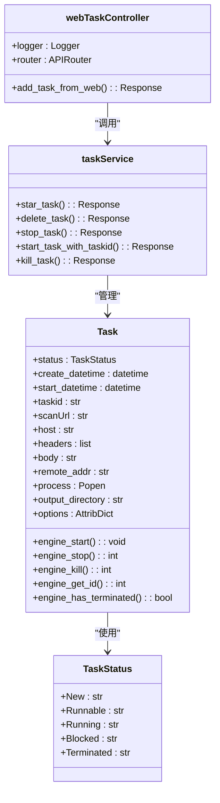
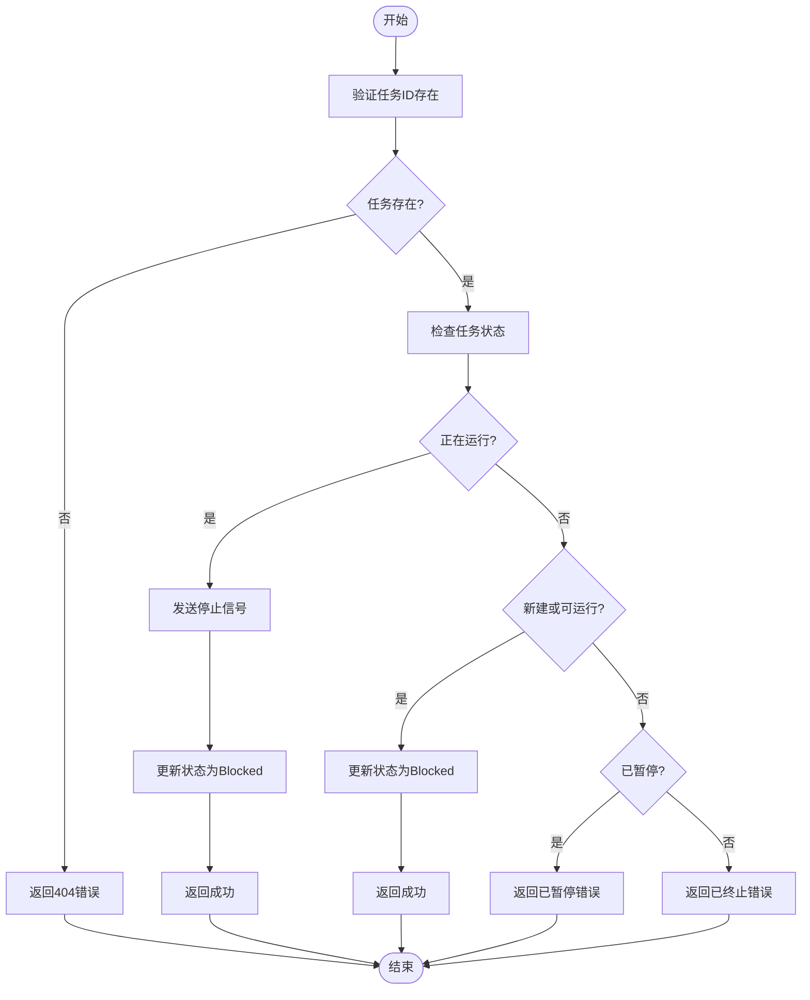
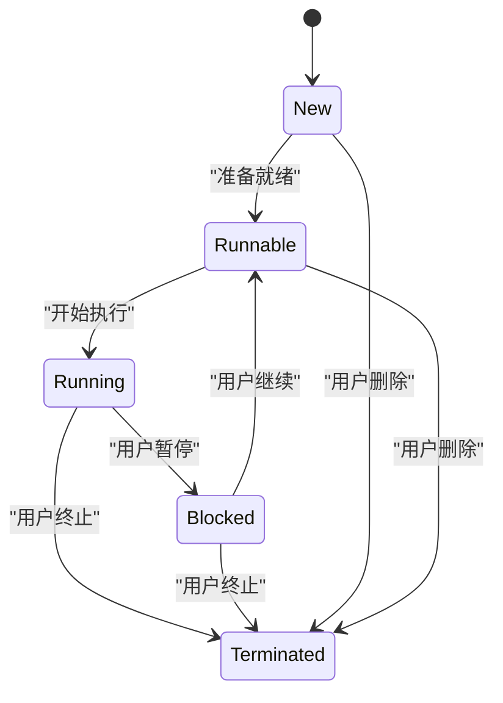

# 任务控制操作

<cite>
**本文档引用的文件**
- [webTaskController.py](file://src/backEnd/api/commonApi/webTaskController.py)
- [taskService.py](file://src/backEnd/service/taskService.py)
- [Task.py](file://src/backEnd/model/Task.py)
- [TaskStatus.py](file://src/backEnd/model/TaskStatus.py)
- [task_monitor.py](file://src/backEnd/utils/task_monitor.py)
- [app.py](file://src/backEnd/app.py)
</cite>

## 目录
1. [简介](#简介)
2. [项目结构](#项目结构)
3. [核心组件](#核心组件)
4. [架构概述](#架构概述)
5. [详细组件分析](#详细组件分析)
6. [依赖分析](#依赖分析)
7. [性能考虑](#性能考虑)
8. [故障排除指南](#故障排除指南)
9. [结论](#结论)

## 简介
本文档全面介绍了SQLMap Web UI系统中任务控制操作的实现机制，包括启动、暂停、继续、停止和删除扫描任务的功能。文档详细描述了webTaskController中对应API端点的请求处理流程，包括参数验证、权限检查和命令分发。同时说明了taskService如何与底层sqlmap引擎交互执行控制命令，以及执行过程中的资源管理和异常处理策略。提供了各控制操作的HTTP请求示例、响应码说明和常见错误的解决方案。

## 项目结构
项目采用分层架构设计，主要分为前端、后端和第三方库三个部分。后端使用FastAPI框架构建RESTful API服务，通过模块化方式组织代码。



**图表来源**
- [app.py](file://src/backEnd/app.py#L1-L80)
- [webTaskController.py](file://src/backEnd/api/commonApi/webTaskController.py#L1-L91)

## 核心组件
系统的核心组件包括任务控制器(webTaskController)、任务服务(taskService)和任务模型(Task)。这些组件协同工作，实现了完整的任务生命周期管理功能，包括任务的创建、启动、暂停、继续、停止和删除等操作。

**章节来源**
- [webTaskController.py](file://src/backEnd/api/commonApi/webTaskController.py#L1-L91)
- [taskService.py](file://src/backEnd/service/taskService.py#L1-L535)

## 架构概述
系统采用典型的分层架构，从前端到后端依次为：API控制器层、业务服务层、数据模型层和底层引擎层。API控制器接收HTTP请求并进行初步验证，业务服务层处理核心业务逻辑，数据模型层管理任务状态和数据，底层引擎层与sqlmap工具进行交互。



**图表来源**
- [webTaskController.py](file://src/backEnd/api/commonApi/webTaskController.py#L1-L91)
- [taskService.py](file://src/backEnd/service/taskService.py#L1-L535)

## 详细组件分析

### 任务控制API分析
webTaskController模块提供了任务控制的API端点，负责处理来自前端的HTTP请求。控制器实现了参数验证、权限检查和错误处理等关键功能。



**图表来源**
- [webTaskController.py](file://src/backEnd/api/commonApi/webTaskController.py#L1-L91)
- [taskService.py](file://src/backEnd/service/taskService.py#L1-L535)
- [Task.py](file://src/backEnd/model/Task.py#L1-L333)
- [TaskStatus.py](file://src/backEnd/model/TaskStatus.py#L1-L9)

### 任务服务实现分析
taskService模块是任务控制的核心业务逻辑层，负责处理各种任务控制命令。服务通过DataStore.tasks_lock确保线程安全，对任务进行原子性操作。

#### 任务控制流程


**图表来源**
- [taskService.py](file://src/backEnd/service/taskService.py#L181-L215)

### 任务状态管理分析
系统定义了完整的任务状态机，确保任务在不同状态间的转换符合预期。状态管理是任务控制操作的基础。



**图表来源**
- [TaskStatus.py](file://src/backEnd/model/TaskStatus.py#L1-L9)
- [Task.py](file://src/backEnd/model/Task.py#L50-L66)
- [taskService.py](file://src/backEnd/service/taskService.py#L181-L215)

## 依赖分析
系统各组件之间的依赖关系清晰，遵循了良好的分层架构原则。API控制器依赖于服务层，服务层依赖于模型层，形成了单向依赖链。

```mermaid
graph TD
webTaskController --> taskService
taskService --> Task
taskService --> TaskStatus
taskService --> DataStore
Task --> TaskStatus
Task --> Database
Task --> headerRuleService
Task --> header_processor
task_monitor --> taskService
task_monitor --> DataStore
class webTaskController,taskService,Task,TaskStatus,DataStore,Database,headerRuleService,header_processor,task_monitor class;
```

**图表来源**
- [webTaskController.py](file://src/backEnd/api/commonApi/webTaskController.py#L1-L91)
- [taskService.py](file://src/backEnd/service/taskService.py#L1-L535)
- [Task.py](file://src/backEnd/model/Task.py#L1-L333)
- [task_monitor.py](file://src/backEnd/utils/task_monitor.py#L1-L94)

## 性能考虑
系统在设计时考虑了性能和资源管理，通过任务监控器动态调整最大并发任务数，避免系统资源耗尽。

### 资源管理策略
- **动态任务限制**：根据CPU核心数和当前CPU使用率动态计算最大任务数
- **线程安全**：使用DataStore.tasks_lock确保对任务集合的并发访问安全
- **进程管理**：通过Popen接口精确控制sqlmap引擎进程的生命周期
- **文件管理**：为每个扫描任务创建独立的HTTP请求文件，避免文件冲突

**章节来源**
- [task_monitor.py](file://src/backEnd/utils/task_monitor.py#L1-L94)
- [taskService.py](file://src/backEnd/service/taskService.py#L70-L71)
- [Task.py](file://src/backEnd/model/Task.py#L258-L297)

## 故障排除指南
本节提供常见任务控制操作问题的解决方案。

### 常见错误及解决方案
| 错误代码 | 错误信息 | 可能原因 | 解决方案 |
|---------|--------|--------|--------|
| 400 | Non-existing task ID | 任务ID不存在 | 检查任务ID是否正确，确认任务是否已被删除 |
| 404 | Task not found | 任务未找到 | 确认任务ID格式正确（16位十六进制字符串） |
| 500 | Failed to start scan | 扫描启动失败 | 检查系统资源是否充足，查看日志获取详细错误信息 |
| 200 | task had blocked | 任务已暂停 | 需要先继续任务才能执行其他操作 |

### HTTP请求示例
**暂停任务请求**
```http
POST /api/web/admin/task/stop HTTP/1.1
Content-Type: application/json
Authorization: Bearer <token>

{
    "taskid": "a1b2c3d4e5f6g7h8"
}
```

**继续任务请求**
```http
POST /api/web/admin/task/start HTTP/1.1
Content-Type: application/json
Authorization: Bearer <token>

{
    "taskid": "a1b2c3d4e5f6g7h8"
}
```

**删除任务请求**
```http
POST /api/web/admin/task/delete HTTP/1.1
Content-Type: application/json
Authorization: Bearer <token>

{
    "taskid": "a1b2c3d4e5f6g7h8"
}
```

**响应码说明**
- **200**: 操作成功
- **400**: 请求参数错误
- **404**: 资源未找到
- **500**: 服务器内部错误

**章节来源**
- [taskService.py](file://src/backEnd/service/taskService.py#L181-L215)
- [webTaskController.py](file://src/backEnd/api/commonApi/webTaskController.py#L1-L91)

## 结论
本文档详细介绍了SQLMap Web UI系统中任务控制操作的实现机制。系统通过清晰的分层架构和良好的设计模式，实现了可靠的任务生命周期管理功能。API控制器负责请求处理和验证，服务层处理核心业务逻辑，模型层管理任务状态和数据。系统还考虑了性能和资源管理，通过动态任务限制和线程安全机制确保系统的稳定运行。这些设计使得系统能够高效、可靠地管理sqlmap扫描任务，为用户提供良好的使用体验。