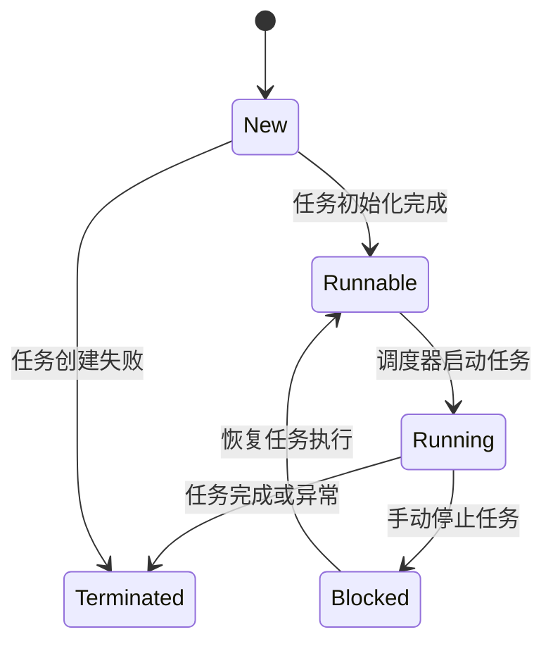
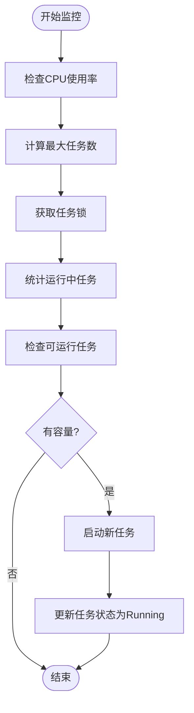
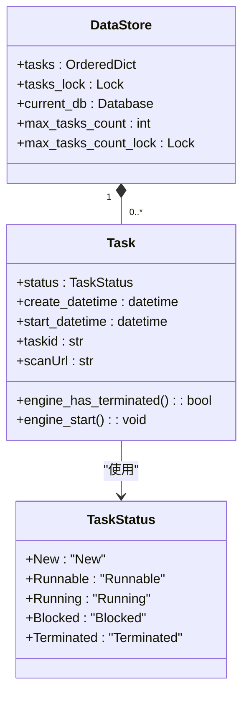
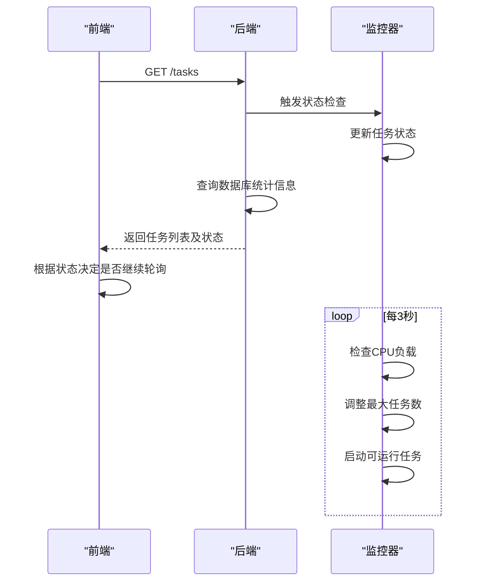

# 任务状态监控机制

<cite>
**本文档引用的文件**   
- [TaskStatus.py](file://src/backEnd/model/TaskStatus.py)
- [task_monitor.py](file://src/backEnd/utils/task_monitor.py)
- [webTaskController.py](file://src/backEnd/api/commonApi/webTaskController.py)
- [Task.py](file://src/backEnd/model/Task.py)
- [taskService.py](file://src/backEnd/service/taskService.py)
- [DataStore.py](file://src/backEnd/model/DataStore.py)
- [task.ts](file://src/frontEnd/src/api/task.ts)
- [TaskList.vue](file://src/frontEnd/src/views/TaskList/index.vue)
</cite>

## 目录
1. [引言](#引言)
2. [任务状态机实现](#任务状态机实现)
3. [任务监控机制](#任务监控机制)
4. [状态持久化与异常恢复](#状态持久化与异常恢复)
5. [前端状态同步](#前端状态同步)
6. [状态不一致诊断与修复](#状态不一致诊断与修复)
7. [结论](#结论)

## 引言
本项目实现了一套完整的任务状态监控机制，用于管理SQLMap扫描任务的生命周期。系统通过定义清晰的状态机模型，结合定时检查和事件驱动的方式，确保任务状态的准确性和一致性。后端使用Python实现任务调度和状态管理，前端通过轮询API获取最新状态，形成闭环监控体系。

**Section sources**
- [TaskStatus.py](file://src/backEnd/model/TaskStatus.py#L1-L9)
- [task_monitor.py](file://src/backEnd/utils/task_monitor.py#L1-L93)

## 任务状态机实现
系统定义了五个核心任务状态，构成完整的状态机模型：

- **New**：任务创建状态，任务已创建但尚未准备执行
- **Runnable**：可运行状态，任务已准备好，等待调度器执行
- **Running**：运行状态，任务正在执行中
- **Blocked**：阻塞状态，任务被手动暂停或停止
- **Terminated**：终止状态，任务已结束（正常完成或异常终止）

状态转换由后端服务精确控制，确保状态变更的原子性和一致性。

**Diagram sources **
- [TaskStatus.py](file://src/backEnd/model/TaskStatus.py#L4-L9)

**Section sources**
- [TaskStatus.py](file://src/backEnd/model/TaskStatus.py#L4-L9)
- [Task.py](file://src/backEnd/model/Task.py#L51-L52)

## 任务监控机制
任务监控器（task_monitor）是系统的核心组件，负责定期检查和更新任务状态。监控器通过以下机制工作：

1. **定时检查**：使用APScheduler框架，每3秒执行一次监控任务
2. **动态任务限制**：根据CPU核心数和当前负载动态调整最大并发任务数
3. **状态同步**：检查SQLMap引擎实际状态，同步到内存中的任务状态

监控器首先统计当前运行中的任务数量，然后从待运行队列中选择任务启动，确保不超过系统承载能力。

**Diagram sources **
- [task_monitor.py](file://src/backEnd/utils/task_monitor.py#L36-L93)
- [main.py](file://src/backEnd/main.py#L155-L157)

**Section sources**
- [task_monitor.py](file://src/backEnd/utils/task_monitor.py#L11-L93)
- [main.py](file://src/backEnd/main.py#L155-L157)

## 状态持久化与异常恢复
系统通过多层机制确保状态的持久化和异常恢复能力：

1. **内存存储**：使用DataStore全局对象存储所有任务，通过线程锁保证并发安全
2. **数据库持久化**：使用SQLite数据库持久化任务日志和扫描结果
3. **异常处理**：在任务创建和执行过程中捕获异常，确保状态正确更新

当系统重启时，内存中的任务状态会丢失，但通过数据库中的日志信息可以重建任务状态。监控器在启动时会检查所有任务的实际执行状态，进行状态同步。

**Diagram sources **
- [DataStore.py](file://src/backEnd/model/DataStore.py#L12-L38)
- [Task.py](file://src/backEnd/model/Task.py#L49-L333)

**Section sources**
- [DataStore.py](file://src/backEnd/model/DataStore.py#L12-L38)
- [Task.py](file://src/backEnd/model/Task.py#L331-L333)
- [Database.py](file://src/backEnd/model/Database.py#L72-L77)

## 前端状态同步
前端通过轮询机制获取最新的任务状态，实现与后端的实时同步：

1. **轮询策略**：当存在运行中的任务时，前端启动定时轮询；当所有任务都处于非运行状态时，停止轮询
2. **状态映射**：前端定义了与后端对应的状态枚举，并实现状态字符串到枚举值的映射
3. **页面可见性优化**：当页面处于隐藏状态时，暂停轮询以节省资源

前端通过GET /tasks接口获取任务列表，后端服务在返回前会动态计算每个任务的当前状态。

**Diagram sources **
- [webTaskController.py](file://src/backEnd/api/commonApi/webTaskController.py#L19-L90)
- [task.ts](file://src/frontEnd/src/api/task.ts#L125-L137)
- [TaskList.vue](file://src/frontEnd/src/views/TaskList/index.vue#L359-L369)

**Section sources**
- [webTaskController.py](file://src/backEnd/api/commonApi/webTaskController.py#L19-L90)
- [task.ts](file://src/frontEnd/src/api/task.ts#L125-L137)
- [TaskList.vue](file://src/frontEnd/src/views/TaskList/index.vue#L281-L396)

## 状态不一致诊断与修复
在实际运行中可能出现任务状态不一致的情况，系统提供了诊断和修复方案：

### 常见不一致场景
1. **僵尸进程**：SQLMap进程已终止，但任务状态仍为Running
2. **状态卡顿**：任务长时间处于Runnable状态无法启动
3. **数据不一致**：内存状态与数据库记录不匹配

### 诊断方法
1. **日志分析**：检查系统日志中的错误信息和状态变更记录
2. **进程检查**：使用psutil检查SQLMap相关进程是否存在
3. **数据库验证**：查询数据库中的任务日志和错误记录

### 修复方案
1. **重启监控器**：重新触发状态同步机制
2. **手动终止**：通过kill_task接口强制终止异常任务
3. **清理资源**：使用flush_task接口清理所有任务

系统通过定期监控和状态检查，最大限度地减少了状态不一致的发生概率。

**Section sources**
- [taskService.py](file://src/backEnd/service/taskService.py#L181-L194)
- [task_monitor.py](file://src/backEnd/utils/task_monitor.py#L69-L73)
- [StdDbOut.py](file://src/backEnd/model/StdDbOut.py#L37-L53)

## 结论
本任务状态监控机制通过定义清晰的状态机模型，结合定时检查和事件驱动的方式，实现了对SQLMap扫描任务的全生命周期管理。系统具备良好的状态持久化能力和异常恢复机制，前端通过智能轮询策略实现了与后端的高效同步。该机制确保了任务状态的准确性和一致性，为用户提供可靠的扫描任务管理体验。