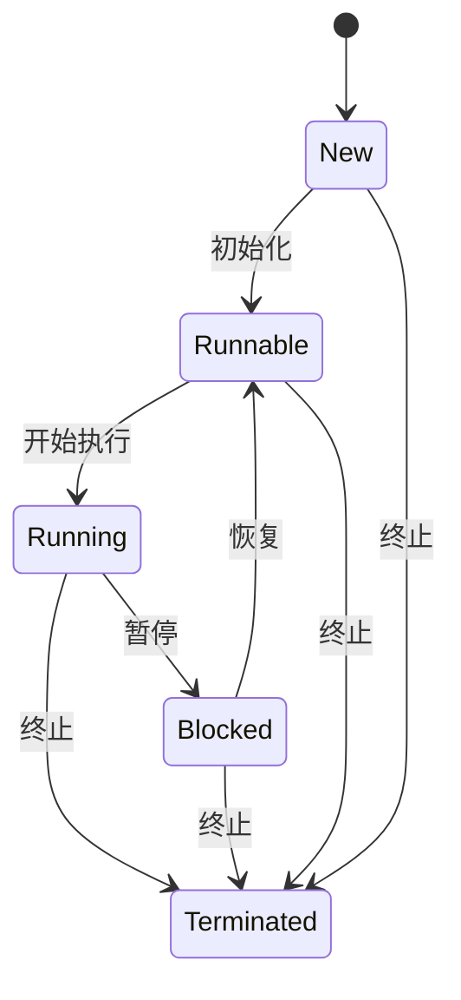
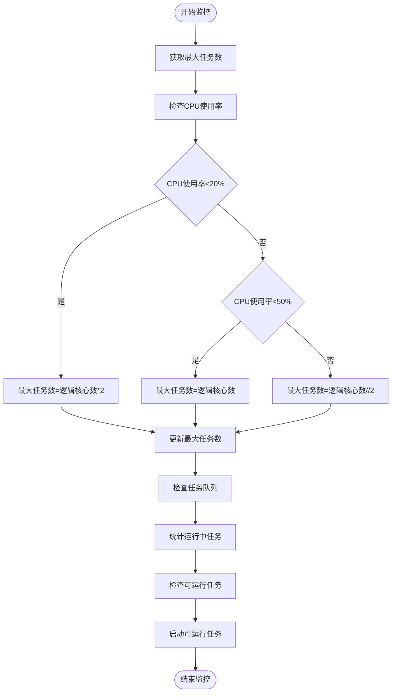
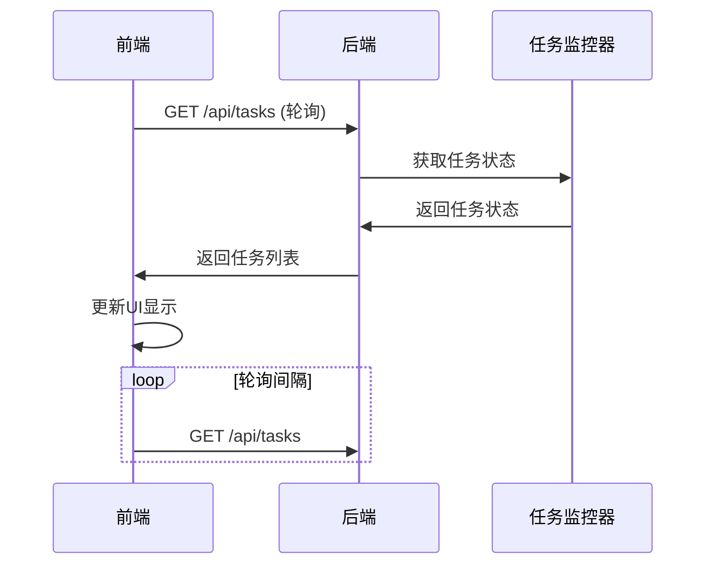
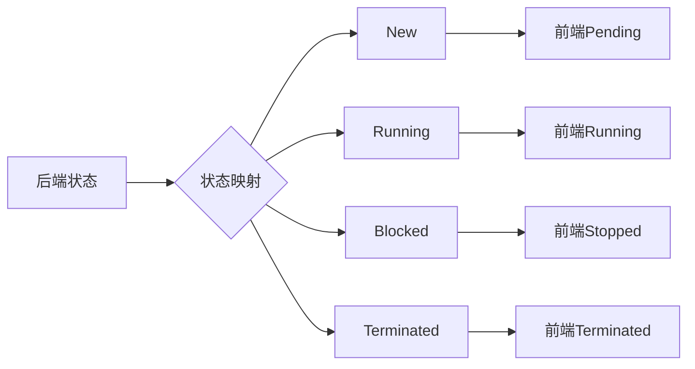

# 任务监控与控制

<cite>
**本文档引用的文件**   
- [TaskStatus.py](file://src/backEnd/model/TaskStatus.py)
- [task_monitor.py](file://src/backEnd/utils/task_monitor.py)
- [taskService.py](file://src/backEnd/service/taskService.py)
- [webTaskController.py](file://src/backEnd/api/commonApi/webTaskController.py)
- [Task.py](file://src/backEnd/model/Task.py)
- [DataStore.py](file://src/backEnd/model/DataStore.py)
- [header_processor.py](file://src/backEnd/utils/header_processor.py)
- [headerRuleService.py](file://src/backEnd/service/headerRuleService.py)
- [task.ts](file://src/frontEnd/src/api/task.ts)
- [task.ts](file://src/frontEnd/src/types/task.ts)
- [task.vue](file://src/frontEnd/src/views/TaskList/index.vue)
- [task.ts](file://src/frontEnd/src/stores/task.ts)
</cite>

## 目录
1. [引言](#引言)
2. [任务状态机实现](#任务状态机实现)
3. [任务监控机制](#任务监控机制)
4. [任务控制操作](#任务控制操作)
5. [前端监控实现](#前端监控实现)
6. [高并发性能优化](#高并发性能优化)
7. [常见问题解决方案](#常见问题解决方案)
8. [结论](#结论)

## 引言

sqlmapWebUI 是一个基于 Web 的 SQL 注入检测工具，提供了对扫描任务的全面监控与控制功能。本系统通过后端服务与前端界面的协同工作，实现了对任务状态的实时监控、任务生命周期的管理以及对任务的启动、暂停、停止和删除等控制操作。系统采用任务状态机来管理任务的不同状态，并通过任务监控器动态调整任务执行策略。前端通过轮询机制获取任务进度，并展示实时日志和扫描状态。本系统还提供了完善的异常处理和资源清理策略，确保在高并发场景下的稳定运行。

## 任务状态机实现

### 任务状态定义

sqlmapWebUI 系统中的任务状态由 `TaskStatus` 枚举类定义，包含五种状态：New（新建）、Runnable（可运行）、Running（运行中）、Blocked（已阻塞）和 Terminated（已终止）。这些状态构成了任务的完整生命周期，从任务创建到最终结束的各个阶段。

**状态来源**
- [TaskStatus.py](file://src/backEnd/model/TaskStatus.py#L4-L9)

### 状态转换条件

任务状态的转换由特定的条件触发。当任务被创建时，其状态为 New；当任务初始化完成后，状态变为 Runnable；当任务开始执行时，状态变为 Running；当任务被暂停时，状态变为 Blocked；当任务被终止或完成时，状态变为 Terminated。状态转换过程中，系统会进行相应的资源分配和释放操作。

**状态转换来源**
- [Task.py](file://src/backEnd/model/Task.py#L51-L53)
- [taskService.py](file://src/backEnd/service/taskService.py#L80)
- [task_monitor.py](file://src/backEnd/utils/task_monitor.py#L84)

## 任务监控机制

### 任务监控器

任务监控器是系统的核心组件，负责监控所有任务的状态并根据系统资源动态调整任务执行策略。监控器通过 `monitor` 函数实现，该函数定期检查任务队列，根据 CPU 使用率和逻辑核心数计算最大任务数，并决定哪些任务可以开始执行。

**监控器来源**
- [task_monitor.py](file://src/backEnd/utils/task_monitor.py#L36-L93)

### 动态任务数调整

系统根据当前计算机的逻辑核心数和 CPU 占用率动态调整最大任务数。当 CPU 使用率低于 20% 时，允许更多任务执行；当 CPU 使用率在 20%-50% 之间时，使用逻辑核心数作为最大任务数；当 CPU 使用率高于 50% 时，减少任务数以避免系统过载。这种动态调整策略确保了系统资源的高效利用和稳定性。

**动态调整来源**
- [task_monitor.py](file://src/backEnd/utils/task_monitor.py#L26-L31)

## 任务控制操作

### 启动任务

启动任务操作通过 `star_task` 方法实现。该方法首先验证任务参数，然后创建任务实例并将其状态设置为 Runnable。任务启动时，系统会应用请求头规则，并创建 HTTP 原始报文临时文件。当任务监控器检测到有可用资源时，会将任务状态从 Runnable 转换为 Running，并启动 SQLMap 引擎执行扫描。

**启动任务来源**
- [taskService.py](file://src/backEnd/service/taskService.py#L58-L83)
- [Task.py](file://src/backEnd/model/Task.py#L258-L278)

### 暂停任务

暂停任务操作通过 `stop_task` 方法实现。当任务处于 Running 状态时，调用 `engine_stop` 方法停止 SQLMap 引擎的执行，并将任务状态设置为 Blocked。对于处于 New 或 Runnable 状态的任务，直接将其状态设置为 Blocked。暂停操作允许用户在需要时暂时停止任务执行，以便释放系统资源或进行其他操作。

**暂停任务来源**
- [taskService.py](file://src/backEnd/service/taskService.py#L196-L215)
- [Task.py](file://src/backEnd/model/Task.py#L298-L303)

### 停止任务

停止任务操作通过 `kill_task` 方法实现。该方法首先检查任务是否存在，如果任务正在运行，则调用 `engine_kill` 方法强制终止 SQLMap 引擎的执行。然后将任务状态设置为 Terminated，并从任务队列中移除该任务。停止操作会彻底终止任务的执行，并清理相关资源。

**停止任务来源**
- [taskService.py](file://src/backEnd/service/taskService.py#L181-L194)
- [Task.py](file://src/backEnd/model/Task.py#L308-L316)

### 删除任务

删除任务操作通过 `delete_task` 方法实现。该方法首先检查任务是否存在，如果任务正在运行，则先调用 `engine_kill` 方法终止任务执行。然后从任务队列中移除该任务，并清理相关资源。删除操作会彻底移除任务的所有数据，包括临时文件和数据库记录。

**删除任务来源**
- [taskService.py](file://src/backEnd/service/taskService.py#L89-L100)

## 前端监控实现

### 轮询机制

前端通过轮询机制获取任务进度。系统使用 `useSmartPolling` 钩子实现智能轮询，根据任务状态和系统配置动态调整轮询间隔。当有运行中的任务时，系统会启动轮询；当所有任务都处于非运行状态时，系统会停止轮询以节省资源。轮询机制确保了前端界面能够实时显示任务的最新状态。

**轮询机制来源**
- [task.ts](file://src/frontEnd/src/stores/task.ts#L29-L41)
- [task.vue](file://src/frontEnd/src/views/TaskList/index.vue#L327-L337)

### 实时日志展示

系统通过 `get_task_log_by_taskid` 方法获取任务的实时日志。前端定期调用该接口，获取指定任务的日志信息，并在界面中实时展示。日志信息包括时间戳、日志级别和消息内容，帮助用户了解任务的执行过程和发现潜在问题。

**实时日志来源**
- [taskService.py](file://src/backEnd/service/taskService.py#L396-L417)
- [task.ts](file://src/frontEnd/src/api/task.ts)

### 状态映射

前端定义了任务状态的枚举类型 `TaskStatus`，并将后端返回的状态字符串映射到前端枚举值。这种映射机制确保了前后端状态的一致性，即使后端状态名称发生变化，前端也能正确显示任务状态。

**状态映射来源**
- [task.ts](file://src/frontEnd/src/api/task.ts#L68-L101)
- [task.ts](file://src/frontEnd/src/types/task.ts)

## 高并发性能优化

### 资源限制

系统通过动态调整最大任务数来限制并发任务的数量，避免因过多任务同时运行而导致系统资源耗尽。任务监控器根据 CPU 使用率和逻辑核心数计算最大任务数，确保系统在高负载情况下仍能稳定运行。

**资源限制来源**
- [task_monitor.py](file://src/backEnd/utils/task_monitor.py#L11-L33)

### 锁机制

系统使用线程锁来保护共享资源的访问。`DataStore` 类中的 `tasks_lock` 和 `max_tasks_count_lock` 确保了对任务队列和最大任务数的并发访问是线程安全的。这种锁机制防止了多线程环境下的数据竞争和不一致问题。

**锁机制来源**
- [DataStore.py](file://src/backEnd/model/DataStore.py#L17-L18)
- [task_monitor.py](file://src/backEnd/utils/task_monitor.py#L44-L55)

### 异步处理

系统采用异步处理机制来提高性能。`taskService` 中的方法使用 `async` 关键字定义，允许在等待 I/O 操作时释放 CPU 资源，从而提高系统的吞吐量和响应速度。异步处理特别适用于数据库查询和网络请求等耗时操作。

**异步处理来源**
- [taskService.py](file://src/backEnd/service/taskService.py#L58-L65)

## 常见问题解决方案

### 任务卡死

当任务长时间处于 Running 状态而无进展时，可能是由于目标服务器响应缓慢或网络问题导致。解决方案包括：检查网络连接、调整 SQLMap 扫描参数、增加超时时间或终止并重新启动任务。

**任务卡死来源**
- [Task.py](file://src/backEnd/model/Task.py#L331-L333)
- [taskService.py](file://src/backEnd/service/taskService.py#L188-L189)

### 资源耗尽

在高并发场景下，系统可能因资源耗尽而变得不稳定。解决方案包括：降低最大任务数、优化 SQLMap 扫描参数、增加系统资源或使用分布式部署。

**资源耗尽来源**
- [task_monitor.py](file://src/backEnd/utils/task_monitor.py#L26-L31)
- [DataStore.py](file://src/backEnd/model/DataStore.py#L22)

### 状态不一致

前后端状态不一致可能是由于轮询间隔过长或网络延迟导致。解决方案包括：缩短轮询间隔、优化网络连接或在前端实现状态缓存机制。

**状态不一致来源**
- [task.ts](file://src/frontEnd/src/stores/task.ts#L88-L92)
- [task.vue](file://src/frontEnd/src/views/TaskList/index.vue#L327-L337)

## 结论

sqlmapWebUI 的任务监控与控制功能通过任务状态机、任务监控器和前端轮询机制的协同工作，实现了对扫描任务的全面管理。系统采用动态任务数调整、线程锁和异步处理等技术，确保了在高并发场景下的稳定性和性能。通过合理的异常处理和资源清理策略，系统能够有效应对各种运行时问题。未来可以考虑引入 WebSocket 替代轮询机制，进一步提高实时性和降低网络开销。