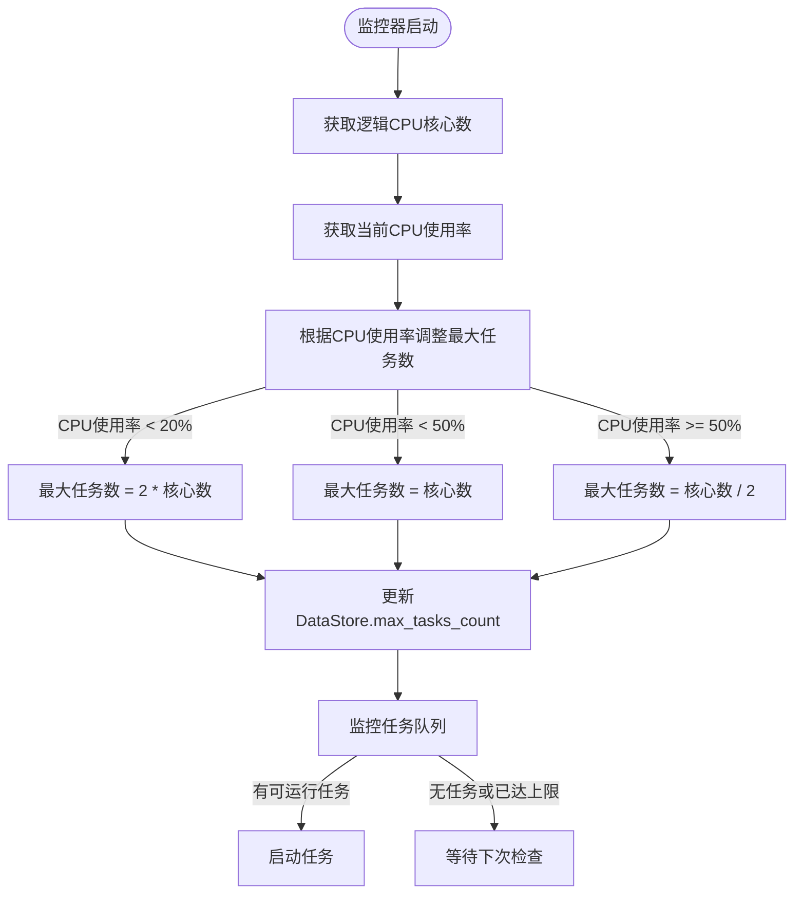
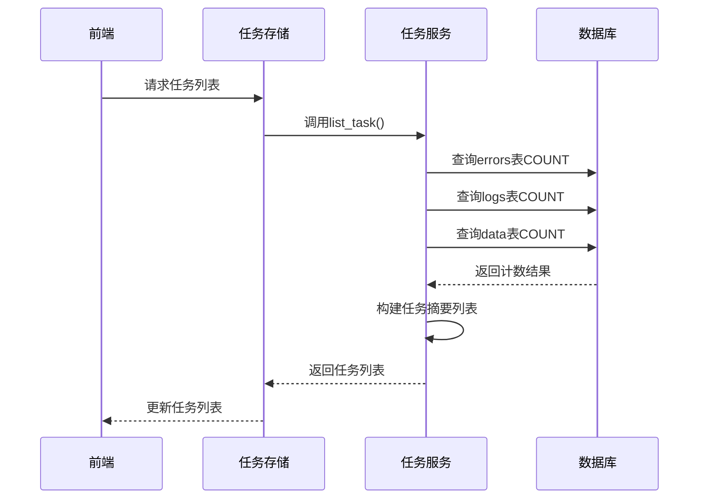

# 性能与优化

<cite>
**本文档引用的文件**  
- [task_monitor.py](file://src/backEnd/utils/task_monitor.py)
- [useSmartPolling.ts](file://src/frontEnd/src/utils/useSmartPolling.ts)
- [taskService.py](file://src/backEnd/service/taskService.py)
- [Task.py](file://src/backEnd/model/Task.py)
- [DataStore.py](file://src/backEnd/model/DataStore.py)
- [Database.py](file://src/backEnd/model/Database.py)
- [TaskStatus.py](file://src/backEnd/model/TaskStatus.py)
- [webTaskController.py](file://src/backEnd/api/commonApi/webTaskController.py)
- [TaskList.vue](file://src/frontEnd/src/views/TaskList/index.vue)
- [task.ts](file://src/frontEnd/src/api/task.ts)
- [taskStore.ts](file://src/frontEnd/src/stores/task.ts)
- [task.ts](file://src/frontEnd/src/types/task.ts)
</cite>

## 目录
1. [引言](#引言)
2. [智能轮询策略](#智能轮询策略)
3. [任务监控与资源优化](#任务监控与资源优化)
4. [批量任务状态查询与数据库优化](#批量任务状态查询与数据库优化)
5. [监控延迟与系统负载的权衡](#监控延迟与系统负载的权衡)
6. [大规模部署与横向扩展](#大规模部署与横向扩展)
7. [监控告警配置](#监控告警配置)
8. [结论](#结论)

## 引言

本系统是一个基于SQLMap的Web安全扫描平台，支持高并发任务监控与管理。系统采用前后端分离架构，前端使用Vue 3和Pinia进行状态管理，后端基于FastAPI构建RESTful API服务。核心功能包括任务创建、状态监控、结果查询和批量操作。在高并发场景下，系统面临性能挑战，特别是在任务状态轮询、资源调度和数据库查询方面。本文档详细阐述系统的性能优化策略，包括前端智能轮询机制、后端任务监控器的动态资源分配、批量查询接口设计以及数据库索引优化，旨在提升系统在大规模部署下的稳定性和响应效率。

## 智能轮询策略

### useSmartPolling 智能轮询机制

`useSmartPolling` 是前端实现的智能轮询Hook，它通过多种策略动态调整轮询频率，以平衡用户体验和系统负载。该机制根据页面可见性、网络状态和后端健康状况，自动调整轮询间隔，避免在非必要情况下对服务器造成压力。

```mermaid
flowchart TD
Start([开始轮询]) --> CheckVisibility["检查页面可见性"]
CheckVisibility --> |页面可见| CheckOnline["检查网络状态"]
CheckVisibility --> |页面隐藏| SetBackground["设置后台轮询间隔"]
CheckOnline --> |在线| CheckBackend["检查后端健康"]
CheckOnline --> |离线| StopPolling["停止轮询"]
CheckBackend --> |健康| SetNormal["设置正常轮询间隔"]
CheckBackend --> |不健康||pauseOnUnhealthy| StopPolling
CheckBackend --> |不健康|!pauseOnUnhealthy| SetNormal
SetNormal --> ExecutePoll["执行轮询请求"]
SetBackground --> ExecutePoll
ExecutePoll --> Wait["等待间隔时间"]
Wait --> CheckVisibility
StopPolling --> Wait
```

**图示来源**
- [useSmartPolling.ts](file://src/frontEnd/src/utils/useSmartPolling.ts#L21-L210)

### 轮询策略详解

`useSmartPolling` 提供了灵活的配置选项，允许开发者根据具体场景定制轮询行为。其核心策略包括：

- **动态间隔调整**：根据页面是否处于可见状态，自动切换轮询间隔。当页面在前台时，使用较短的间隔（默认5秒）以保证实时性；当页面被隐藏时，切换到较长的间隔（默认30秒）以节省资源。
- **网络状态感知**：监听浏览器的`online`和`offline`事件，当网络断开时自动暂停轮询，避免无效请求。
- **后端健康检查**：集成后端健康状态，当后端服务不健康时，可根据配置暂停轮询，防止在服务恢复前产生大量错误请求。
- **立即执行选项**：支持在启动轮询时立即执行一次回调，确保页面加载后能第一时间获取最新数据。

该策略通过`getCurrentInterval`函数计算当前应使用的轮询间隔，优先级为：页面可见性 > 网络状态 > 后端健康状态。这种多维度的判断机制确保了轮询行为的智能化和高效性。

**代码来源**
- [useSmartPolling.ts](file://src/frontEnd/src/utils/useSmartPolling.ts#L48-L54)
- [useSmartPolling.ts](file://src/frontEnd/src/utils/useSmartPolling.ts#L59-L71)

## 任务监控与资源优化

### task_monitor 服务端资源消耗优化

`task_monitor` 模块是后端任务调度的核心组件，负责监控和管理所有扫描任务的生命周期。它通过动态调整最大并发任务数来优化资源消耗，确保系统在高负载下仍能稳定运行。



**图示来源**
- [task_monitor.py](file://src/backEnd/utils/task_monitor.py#L11-L94)

### 动态任务调度算法

`get_max_tasks_count` 函数实现了基于CPU使用率的动态任务调度算法。该算法通过`psutil.cpu_percent(interval=1)`获取过去1秒的平均CPU使用率，并据此决定最大并发任务数：

- **低负载（CPU < 20%）**：允许最多2倍于逻辑核心数的任务并发执行，充分利用空闲资源。
- **中等负载（CPU < 50%）**：允许与逻辑核心数相等的任务并发执行，保持系统稳定。
- **高负载（CPU >= 50%）**：将最大任务数减半，防止系统过载。

此算法确保了系统资源的合理分配，避免了因任务过多导致的CPU争用和响应延迟。同时，`monitor`函数通过`DataStore.tasks_lock`锁保护任务队列，确保在多线程环境下的数据一致性。

**代码来源**
- [task_monitor.py](file://src/backEnd/utils/task_monitor.py#L11-L33)
- [task_monitor.py](file://src/backEnd/utils/task_monitor.py#L36-L94)

## 批量任务状态查询与数据库优化

### 批量任务状态查询接口设计

系统提供了高效的批量任务状态查询接口，通过`taskService.list_task`方法实现。该接口一次性返回所有任务的摘要信息，包括任务ID、状态、错误数、日志数等，避免了前端对每个任务进行单独查询的开销。



**图示来源**
- [taskService.py](file://src/backEnd/service/taskService.py#L102-L176)
- [taskStore.ts](file://src/frontEnd/src/stores/task.ts#L29-L41)

### 数据库索引优化建议

`Database` 模块在初始化时创建了多个索引，以优化查询性能。针对任务状态查询场景，建议的索引优化策略包括：

- **任务ID索引**：在`errors`、`logs`、`data`表上创建`taskid`字段的索引，加速基于任务ID的聚合查询。
- **状态索引**：在`persistent_header_rules`表上创建`is_active`和`priority`字段的索引，优化活跃规则的查询效率。
- **复合索引**：对于频繁的组合查询（如按状态和时间范围过滤），建议创建复合索引以进一步提升性能。

此外，`Database.execute`方法实现了重试机制，当遇到"locked"错误时自动重试，提高了在高并发写入场景下的稳定性。

**代码来源**
- [Database.py](file://src/backEnd/model/Database.py#L95-L99)
- [Database.py](file://src/backEnd/model/Database.py#L35-L49)

## 监控延迟与系统负载的权衡

### 权衡策略分析

在高并发任务监控场景下，监控延迟与系统负载之间存在天然的矛盾。频繁的轮询可以降低延迟，但会增加系统负载；而降低轮询频率可以减轻负载，但会增加延迟。本系统通过以下策略实现二者之间的平衡：

- **前端智能轮询**：`useSmartPolling`根据页面可见性动态调整轮询间隔，在用户关注时提供低延迟，在用户离开时减少负载。
- **后端批量查询**：`list_task`接口一次性返回所有任务状态，减少了数据库查询次数，相比逐个查询任务状态，显著降低了I/O开销。
- **资源动态分配**：`task_monitor`根据CPU使用率动态调整最大任务数，确保系统在高负载时不会崩溃，同时在低负载时充分利用资源。

这种分层优化策略使得系统能够在不同负载条件下自动调整行为，实现了延迟与负载的最佳平衡。

**代码来源**
- [useSmartPolling.ts](file://src/frontEnd/src/utils/useSmartPolling.ts#L48-L54)
- [taskService.py](file://src/backEnd/service/taskService.py#L102-L176)
- [task_monitor.py](file://src/backEnd/utils/task_monitor.py#L11-L33)

## 大规模部署与横向扩展

### 横向扩展方案

为支持大规模部署，系统设计了可横向扩展的架构。核心组件的扩展方案包括：

- **无状态前端**：前端应用完全无状态，可通过负载均衡器部署多个实例，轻松实现水平扩展。
- **共享后端存储**：后端使用SQLite数据库存储任务状态，可通过网络文件系统（NFS）或分布式数据库（如PostgreSQL）实现多实例共享，避免单点故障。
- **任务队列分离**：可将任务队列从内存（`DataStore.tasks`）迁移到Redis等分布式缓存，实现任务的跨实例调度和持久化。

通过这些方案，系统可以轻松扩展到支持数千个并发任务，满足大规模安全扫描的需求。

**代码来源**
- [DataStore.py](file://src/backEnd/model/DataStore.py#L18)
- [Database.py](file://src/backEnd/model/Database.py#L10)

## 监控告警配置

### 告警机制实现

系统内置了基本的监控告警机制，主要通过日志记录和状态检查实现。关键告警点包括：

- **任务启动失败**：在`taskService.star_task`中，若任务启动失败，会记录错误日志并返回HTTP 500状态码。
- **数据库连接异常**：在`taskService.list_task`中，若数据库未初始化，会返回500错误并记录日志。
- **后端健康检查**：前端通过`authStore.backendHealthy`定期检查后端健康状态，并在不健康时暂停轮询。

建议的告警配置包括：
- **日志监控**：使用ELK或Prometheus等工具收集和分析日志，设置关键错误的告警规则。
- **健康检查**：配置外部监控系统定期调用健康检查接口，确保服务可用性。
- **资源监控**：监控CPU、内存和磁盘使用率，当超过阈值时发出告警。

**代码来源**
- [webTaskController.py](file://src/backEnd/api/commonApi/webTaskController.py#L88-L90)
- [taskService.py](file://src/backEnd/service/taskService.py#L109-L112)

## 结论

本文档详细阐述了SQLMapWebUI系统的性能与优化策略。通过前端`useSmartPolling`的智能轮询机制，系统能够根据用户行为和网络状况动态调整轮询频率，有效降低了不必要的服务器请求。后端`task_monitor`通过监控CPU使用率动态调整最大并发任务数，实现了资源的最优分配。批量任务状态查询接口和数据库索引优化显著提升了查询性能。在大规模部署场景下，系统可通过无状态前端、共享存储和任务队列分离实现横向扩展。综合这些优化措施，系统能够在高并发任务监控下保持良好的性能和稳定性，为用户提供高效、可靠的安全扫描服务。