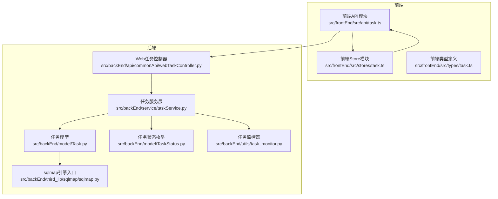
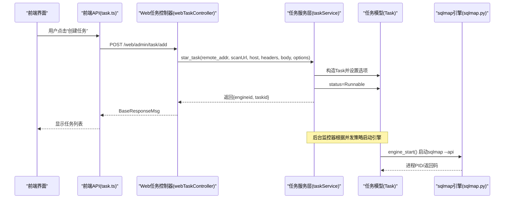
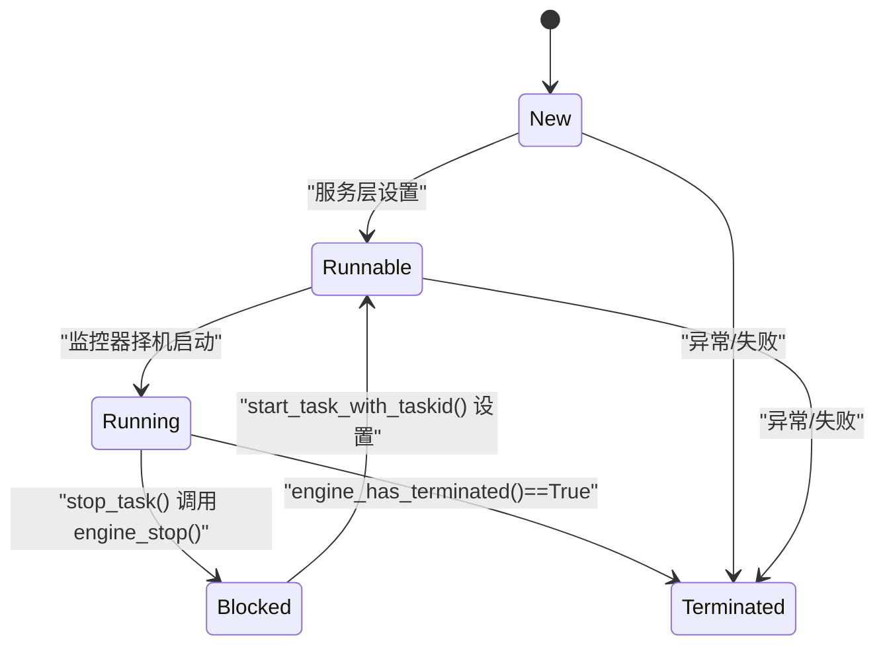
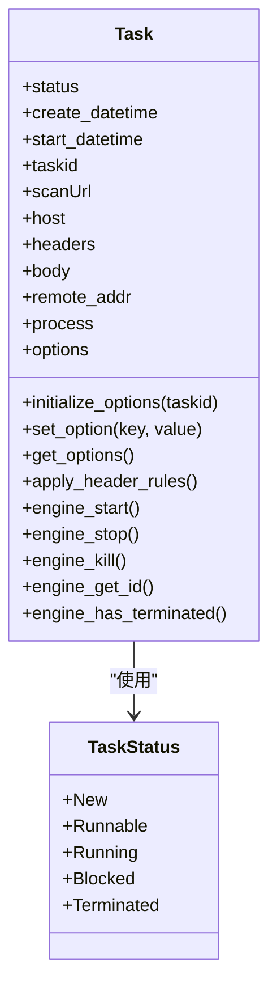
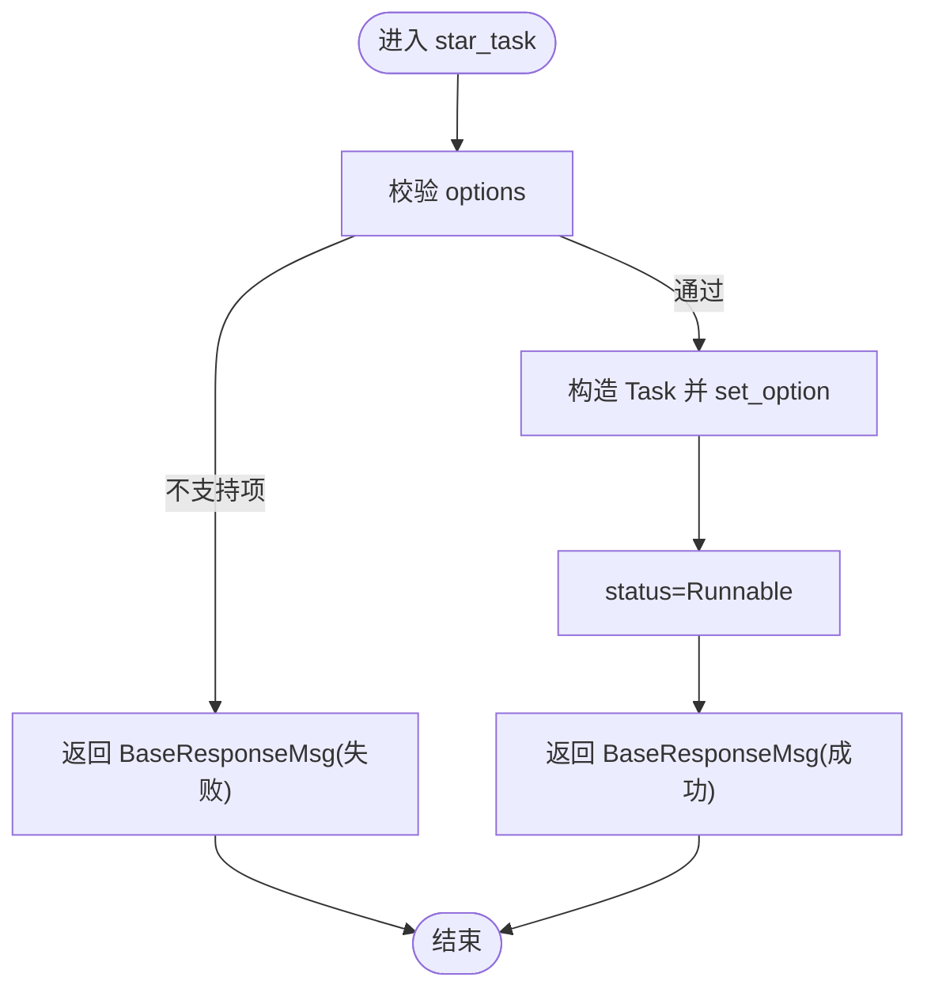
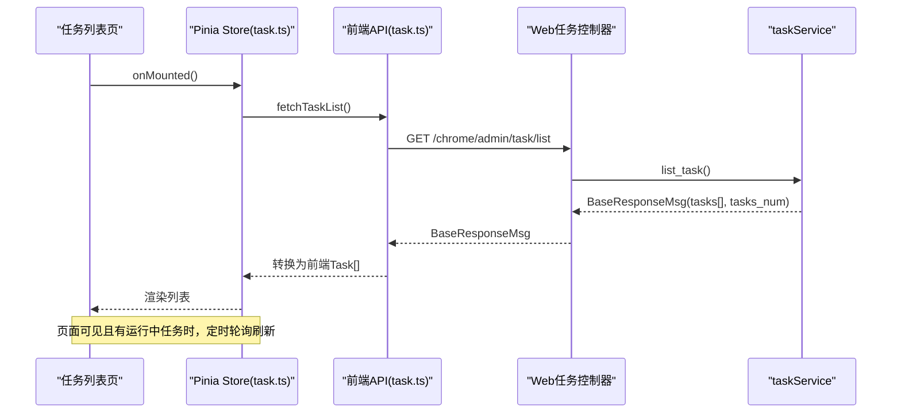
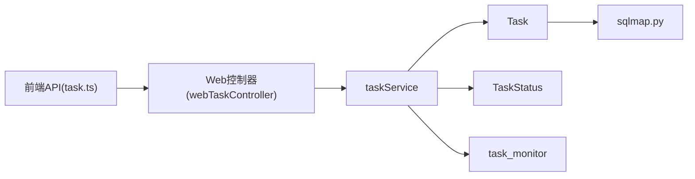

# 任务管理

<cite>
**本文引用的文件**
- [Task.py](file://src/backEnd/model/Task.py)
- [TaskStatus.py](file://src/backEnd/model/TaskStatus.py)
- [taskService.py](file://src/backEnd/service/taskService.py)
- [webTaskController.py](file://src/backEnd/api/commonApi/webTaskController.py)
- [task.ts（后端控制器）](file://src/backEnd/api/commonApi/webTaskController.py)
- [task.ts（前端API）](file://src/frontEnd/src/api/task.ts)
- [task.ts（前端Pinia Store）](file://src/frontEnd/src/stores/task.ts)
- [task.ts（前端类型定义）](file://src/frontEnd/src/types/task.ts)
- [task_monitor.py](file://src/backEnd/utils/task_monitor.py)
- [TaskRequest.py](file://src/backEnd/model/requestModel/TaskRequest.py)
- [BaseResponseMsg.py](file://src/backEnd/model/BaseResponseMsg.py)
- [sqlmap.py](file://src/backEnd/third_lib/sqlmap/sqlmap.py)
</cite>

## 目录
1. [简介](#简介)
2. [项目结构](#项目结构)
3. [核心组件](#核心组件)
4. [架构总览](#架构总览)
5. [详细组件分析](#详细组件分析)
6. [依赖关系分析](#依赖关系分析)
7. [性能考量](#性能考量)
8. [故障排查指南](#故障排查指南)
9. [结论](#结论)
10. [附录](#附录)

## 简介
本文件系统性阐述 sqlmapWebUI 中“任务管理”的设计与实现，覆盖任务的创建、监控、停止与删除；任务状态机（TaskStatus）的设计与转换；Task 模型的数据结构与持久化；taskService 服务层的业务逻辑；以及前后端通过 API 的交互方式。同时提供从用户界面创建任务到后端调用 sqlmap 引擎执行扫描的完整流程说明，并给出错误处理、日志记录与性能监控的最佳实践及常见问题解决方案。

## 项目结构
- 后端（Python/FastAPI）位于 src/backEnd，包含 API 控制器、模型、服务层、工具与第三方集成（sqlmap）。
- 前端（Vue3/Pinia）位于 src/frontEnd，包含 API 调用、状态管理与视图组件。

图表来源
- [webTaskController.py](file://src/backEnd/api/commonApi/webTaskController.py#L1-L91)
- [taskService.py](file://src/backEnd/service/taskService.py#L1-L535)
- [Task.py](file://src/backEnd/model/Task.py#L1-L333)
- [TaskStatus.py](file://src/backEnd/model/TaskStatus.py#L1-L9)
- [task_monitor.py](file://src/backEnd/utils/task_monitor.py#L1-L94)
- [sqlmap.py](file://src/backEnd/third_lib/sqlmap/sqlmap.py#L138-L637)

章节来源
- [webTaskController.py](file://src/backEnd/api/commonApi/webTaskController.py#L1-L91)
- [taskService.py](file://src/backEnd/service/taskService.py#L1-L535)
- [Task.py](file://src/backEnd/model/Task.py#L1-L333)
- [TaskStatus.py](file://src/backEnd/model/TaskStatus.py#L1-L9)
- [task_monitor.py](file://src/backEnd/utils/task_monitor.py#L1-L94)
- [sqlmap.py](file://src/backEnd/third_lib/sqlmap/sqlmap.py#L138-L637)

## 核心组件
- 任务状态机（TaskStatus）：定义 New、Runnable、Running、Blocked、Terminated 五种状态，用于描述任务生命周期。
- 任务模型（Task）：封装任务的元数据、请求报文、引擎进程、选项配置与引擎启停控制。
- 任务服务层（TaskService）：负责任务的创建、列表、停止、删除、查询、日志与载荷等业务逻辑。
- Web 任务控制器（webTaskController）：对外暴露 /web/admin/task/* 接口，接收前端请求并委派给服务层。
- 前端 API/Store/类型：负责与后端交互、轮询刷新、状态映射与展示。

章节来源
- [TaskStatus.py](file://src/backEnd/model/TaskStatus.py#L1-L9)
- [Task.py](file://src/backEnd/model/Task.py#L1-L333)
- [taskService.py](file://src/backEnd/service/taskService.py#L1-L535)
- [webTaskController.py](file://src/backEnd/api/commonApi/webTaskController.py#L1-L91)
- [task.ts（前端API）](file://src/frontEnd/src/api/task.ts#L1-L800)
- [task.ts（前端Pinia Store）](file://src/frontEnd/src/stores/task.ts#L1-L390)
- [task.ts（前端类型定义）](file://src/frontEnd/src/types/task.ts#L1-L122)

## 架构总览
从前端到后端再到 sqlmap 引擎的调用链路如下：

图表来源
- [webTaskController.py](file://src/backEnd/api/commonApi/webTaskController.py#L1-L91)
- [taskService.py](file://src/backEnd/service/taskService.py#L1-L535)
- [Task.py](file://src/backEnd/model/Task.py#L1-L333)
- [sqlmap.py](file://src/backEnd/third_lib/sqlmap/sqlmap.py#L138-L637)

## 详细组件分析

### 任务状态机（TaskStatus）
- 定义：New、Runnable、Running、Blocked、Terminated。
- 设计要点：
  - New/Runnable/Blocked 为“待执行/可执行/阻塞”阶段，通常由前端显示为“等待/运行中/阻塞”。
  - Running/Terminated 为“运行中/已终止”，由引擎进程退出码判定。
- 状态转换逻辑（服务层）：
  - 创建任务：设置为 Runnable，随后由监控器择机启动引擎。
  - 停止任务：若处于 Running，调用 engine_stop() 并将状态置为 Blocked；若处于 New/Runnable，同样置为 Blocked。
  - 删除任务：若 Running，先 engine_kill()，再删除任务。
  - 列表/搜索时，非 New/Runnable/Blocked 的任务根据 engine_has_terminated() 判定为 Running 或 Terminated。

图表来源
- [TaskStatus.py](file://src/backEnd/model/TaskStatus.py#L1-L9)
- [taskService.py](file://src/backEnd/service/taskService.py#L1-L535)

章节来源
- [TaskStatus.py](file://src/backEnd/model/TaskStatus.py#L1-L9)
- [taskService.py](file://src/backEnd/service/taskService.py#L1-L535)

### Task 模型的数据结构与持久化
- 关键字段与职责：
  - status：任务状态（TaskStatus）
  - create_datetime/start_datetime：创建/开始执行时间
  - taskid/scanUrl/host/headers/body/remote_addr：任务元数据
  - process：sqlmap 子进程句柄
  - options/_original_options：扫描选项（基于 sqlmap 的 optDict/_defaults）
  - _header_rules_applied/_request_file_path：请求头规则应用与请求文件路径
- 选项初始化与持久化：
  - initialize_options() 从 sqlmap 的 optDict/_defaults 构建默认选项，并设置 api、taskid、database 等关键项。
  - set_option()/get_options() 提供动态修改与读取。
  - engine_start() 会将 headers 写入临时请求文件，并通过 -c 传入 sqlmap 的 --api 模式。
- 请求头规则与请求文件：
  - apply_header_rules() 动态导入 HeaderRuleService/HeaderProcessor/DataStore，按持久化规则与会话头处理 headers，并更新 options.headers。
  - _create_request_file() 生成 request_YYYYMMDD_HHMMSS_XXXXXX.txt，供 -r 使用。
- 引擎启停与进程管理：
  - engine_start()/engine_stop()/engine_kill()/engine_get_id()/engine_has_terminated() 提供进程生命周期管理。
  - engine_stop() 通过 terminate() + wait()，engine_kill() 通过 kill() + wait()。

图表来源
- [Task.py](file://src/backEnd/model/Task.py#L1-L333)
- [TaskStatus.py](file://src/backEnd/model/TaskStatus.py#L1-L9)

章节来源
- [Task.py](file://src/backEnd/model/Task.py#L1-L333)

### taskService 服务层业务逻辑
- 任务创建（star_task）：
  - 校验 options（排除不支持的 RESTAPI_UNSUPPORTED_OPTIONS），生成 taskid，构造 Task 并逐项 set_option，最后将 status 设为 Runnable。
- 任务列表（list_task）：
  - 通过 DataStore.current_db 查询 errors/logs/data 表统计，按 Task.status 与 engine_has_terminated() 统一映射为前端状态。
- 停止任务（stop_task）：
  - 若 Running，调用 engine_stop() 并置为 Blocked；若 New/Runnable，直接置为 Blocked；若 Blocked/已终止，返回相应提示。
- 删除任务（delete_task）：
  - 若 Running，先 engine_kill()，再删除任务。
- 启动已阻塞任务（start_task_with_taskid）：
  - 将 Blocked 置为 Runnable，等待监控器择机启动。
- 刷新/清空（flush_task）：
  - 遍历任务池，对 Running 调用 engine_kill() 并删除。
- 查询与详情：
  - find_task_by_*、get_task_scan_options、get_task_http_request_info、get_task_errors_by_taskId、get_payload_detail_by_task_id、find_task_log_by_taskid 等。

图表来源
- [taskService.py](file://src/backEnd/service/taskService.py#L1-L535)

章节来源
- [taskService.py](file://src/backEnd/service/taskService.py#L1-L535)

### Web 任务控制器（API 层）
- /web/admin/task/add：
  - 从请求体解析 TaskAddRequest，校验 options 必填，记录来源 IP 与目标 URL，调用 taskService.star_task 并返回 BaseResponseMsg。
- 统一响应格式：
  - BaseResponseMsg(data, msg, success, code)，保证前后端一致的响应结构。

章节来源
- [webTaskController.py](file://src/backEnd/api/commonApi/webTaskController.py#L1-L91)
- [BaseResponseMsg.py](file://src/backEnd/model/BaseResponseMsg.py#L1-L21)
- [TaskRequest.py](file://src/backEnd/model/requestModel/TaskRequest.py#L1-L57)

### 前端交互与轮询
- 前端 API（task.ts）：
  - getTaskList/addTask/deleteTask/stopTask/findTaskByUrl/getTaskLogs/getScanOptions/getHttpRequestInfo/getPayloadDetail/flushTasks 等。
  - mapBackendStatus 将后端状态字符串映射为前端 TaskStatus 枚举。
- 前端 Store（task.ts）：
  - 使用 Pinia 管理任务列表、当前任务、过滤与排序、批量操作与统计。
  - 自动轮询 fetchTaskList，根据页面可见性与网络状态智能启停轮询。
- 类型定义（task.ts）：
  - 定义 Task、TaskStatus、TaskOptions、TaskDetail、LogEntry、ErrorEntry 等接口。

图表来源
- [task.ts（前端API）](file://src/frontEnd/src/api/task.ts#L1-L800)
- [task.ts（前端Pinia Store）](file://src/frontEnd/src/stores/task.ts#L1-L390)
- [webTaskController.py](file://src/backEnd/api/commonApi/webTaskController.py#L1-L91)
- [taskService.py](file://src/backEnd/service/taskService.py#L1-L535)

章节来源
- [task.ts（前端API）](file://src/frontEnd/src/api/task.ts#L1-L800)
- [task.ts（前端Pinia Store）](file://src/frontEnd/src/stores/task.ts#L1-L390)
- [task.ts（前端类型定义）](file://src/frontEnd/src/types/task.ts#L1-L122)

### 从 UI 创建任务到引擎执行的完整流程
- 用户在前端界面填写扫描参数并提交。
- 前端 API 调用 /web/admin/task/add，携带 scanUrl/host/headers/body/options。
- Web 控制器解析请求并调用 taskService.star_task。
- 服务层创建 Task，设置 options，status=Runnable。
- 监控器（task_monitor.py）择机启动引擎：engine_start() 生成请求文件并启动 sqlmap --api。
- 前端通过轮询 /chrome/admin/task/list 获取最新状态，实时展示任务进度与结果。

章节来源
- [webTaskController.py](file://src/backEnd/api/commonApi/webTaskController.py#L1-L91)
- [taskService.py](file://src/backEnd/service/taskService.py#L1-L535)
- [Task.py](file://src/backEnd/model/Task.py#L1-L333)
- [task_monitor.py](file://src/backEnd/utils/task_monitor.py#L1-L94)
- [sqlmap.py](file://src/backEnd/third_lib/sqlmap/sqlmap.py#L138-L637)

## 依赖关系分析
- 组件耦合：
  - Task 依赖 TaskStatus、Database、sqlmap 引擎。
  - taskService 依赖 Task、TaskStatus、DataStore、BaseResponseMsg、sqlmap 支持的选项集。
  - webTaskController 依赖 taskService、BaseResponseMsg、TaskAddRequest。
  - 前端 API/Store 依赖后端统一响应 BaseResponseMsg 与 Task 类型。
- 外部依赖：
  - psutil 用于 CPU 使用率检测，影响并发上限。
  - sqlmap --api 作为 IPC 数据库与日志输出通道。

图表来源
- [task.ts（前端API）](file://src/frontEnd/src/api/task.ts#L1-L800)
- [webTaskController.py](file://src/backEnd/api/commonApi/webTaskController.py#L1-L91)
- [taskService.py](file://src/backEnd/service/taskService.py#L1-L535)
- [Task.py](file://src/backEnd/model/Task.py#L1-L333)
- [TaskStatus.py](file://src/backEnd/model/TaskStatus.py#L1-L9)
- [task_monitor.py](file://src/backEnd/utils/task_monitor.py#L1-L94)
- [sqlmap.py](file://src/backEnd/third_lib/sqlmap/sqlmap.py#L138-L637)

章节来源
- [task.ts（前端API）](file://src/frontEnd/src/api/task.ts#L1-L800)
- [webTaskController.py](file://src/backEnd/api/commonApi/webTaskController.py#L1-L91)
- [taskService.py](file://src/backEnd/service/taskService.py#L1-L535)
- [Task.py](file://src/backEnd/model/Task.py#L1-L333)
- [TaskStatus.py](file://src/backEnd/model/TaskStatus.py#L1-L9)
- [task_monitor.py](file://src/backEnd/utils/task_monitor.py#L1-L94)
- [sqlmap.py](file://src/backEnd/third_lib/sqlmap/sqlmap.py#L138-L637)

## 性能考量
- 并发控制：
  - 监控器根据 CPU 核心数与 CPU 使用率动态计算最大并发任务数，避免过度竞争导致系统抖动。
  - 仅在 Running 数量低于阈值时，从 Runnable 列表中择机启动任务，启动后设置 start_datetime 并 engine_start()。
- I/O 与 IPC：
  - 通过 -r 指定请求文件，避免命令行参数过长；通过 --api 将 stdout/stderr 重定向至 IPC 数据库，便于后端高效读取。
- 前端轮询优化：
  - 页面隐藏或离线时降低轮询频率或暂停轮询；仅当存在运行中任务时才开启轮询，减少不必要的请求。
- 日志与错误：
  - 统一 BaseResponseMsg 结构，便于前端统一处理；后端按任务维度统计 errors/logs/data，辅助定位问题。

章节来源
- [task_monitor.py](file://src/backEnd/utils/task_monitor.py#L1-L94)
- [Task.py](file://src/backEnd/model/Task.py#L1-L333)
- [task.ts（前端Pinia Store）](file://src/frontEnd/src/stores/task.ts#L1-L390)

## 故障排查指南
- 创建任务失败：
  - 检查 options 是否为空或包含不支持的键；查看 BaseResponseMsg 的 code/msg。
  - 确认 /web/admin/task/add 接口是否正确传递 scanUrl/host/headers/body/options。
- 任务无法启动：
  - 查看监控器是否达到最大并发限制；确认 Runnable 任务是否被延迟启动。
  - 检查 Task.engine_start() 是否成功创建请求文件与启动进程。
- 任务卡住或长时间无响应：
  - 使用 stop_task() 触发 engine_stop()，将状态置为 Blocked；必要时 delete_task() 并 engine_kill()。
- 日志与错误：
  - 通过 getTaskLogs/get_task_errors_by_taskId 获取日志与错误明细，结合 injected/injectionType 等信息判断注入结果。
- 前端状态不一致：
  - 检查 mapBackendStatus 的状态映射是否覆盖后端返回值；确认轮询间隔与页面可见性事件处理。

章节来源
- [taskService.py](file://src/backEnd/service/taskService.py#L1-L535)
- [Task.py](file://src/backEnd/model/Task.py#L1-L333)
- [task.ts（前端API）](file://src/frontEnd/src/api/task.ts#L1-L800)
- [task.ts（前端Pinia Store）](file://src/frontEnd/src/stores/task.ts#L1-L390)

## 结论
sqlmapWebUI 的任务管理围绕 TaskStatus、Task 模型与 taskService 服务层展开，通过 Web 控制器与前端 API 实现全链路闭环。后端采用进程级并发控制与 IPC 日志收集，前端实现智能轮询与状态映射，整体具备良好的可观测性与可扩展性。建议在生产环境中结合监控指标（CPU/内存/并发数/错误率）持续优化并发策略与前端轮询策略。

## 附录
- 常用接口速览（后端）：
  - POST /web/admin/task/add：创建任务
  - GET /chrome/admin/task/list：获取任务列表
  - PUT /chrome/admin/task/stop：停止任务
  - DELETE /chrome/admin/task/delete：删除任务
  - PATCH /chrome/admin/task/flush：清空任务池
  - GET /chrome/admin/task/logs/getLogsByTaskId：获取任务日志
  - GET /chrome/admin/task/getTaskScanOptionsByTaskId：获取扫描选项
  - GET /chrome/admin/task/getTaskHttpRequestInfoByTaskId：获取HTTP请求信息
  - GET /chrome/admin/task/getPayloadDetailByTaskId：获取载荷详情
- 常见问题清单：
  - options 缺失或包含不支持键：创建失败，需修正参数。
  - 并发过高导致任务排队：适当降低并发或提升机器资源。
  - 页面不可见导致轮询暂停：切换回页面后自动恢复轮询。
  - 引擎异常退出：查看 Terminated 与错误日志，必要时清理任务并重试。