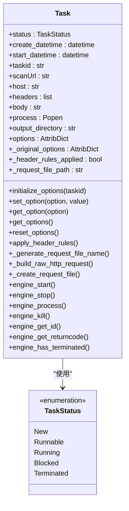
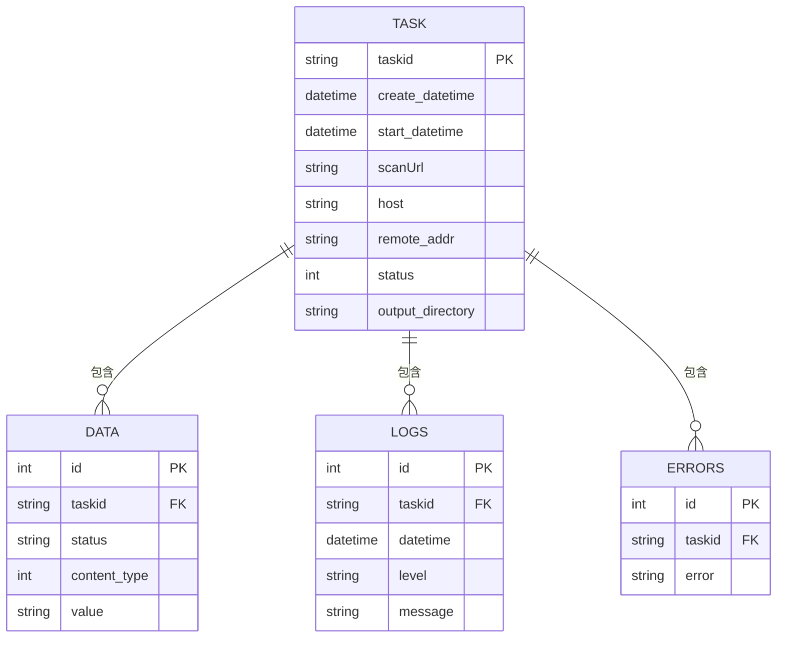
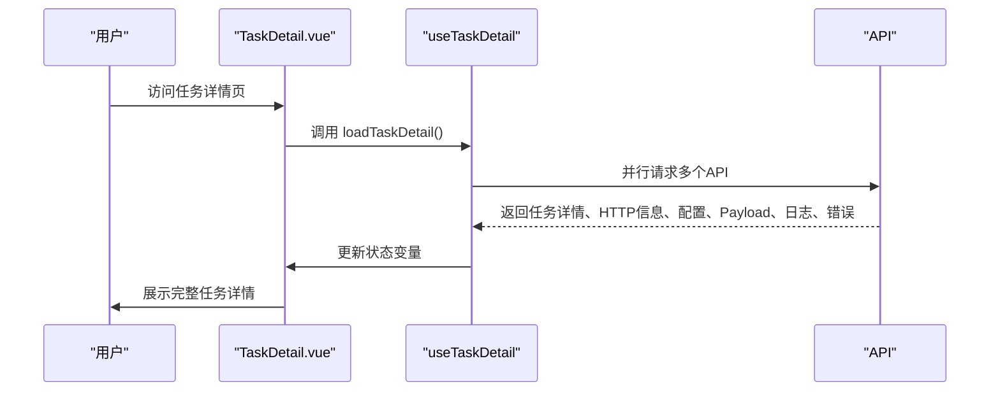
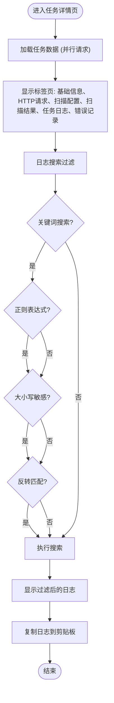
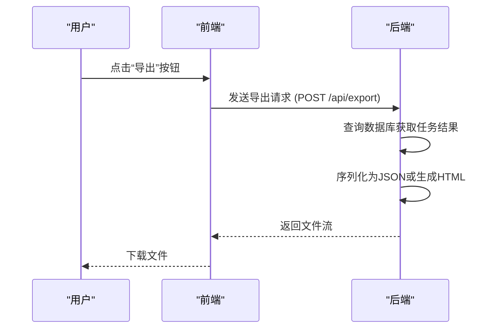
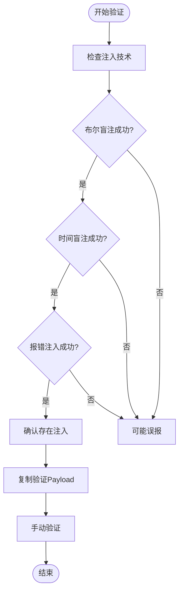

# 任务结果分析

<cite>
**本文档引用文件**   
- [Task.py](file://src/backEnd/model/Task.py)
- [taskService.py](file://src/backEnd/service/taskService.py)
- [DataStore.py](file://src/backEnd/model/DataStore.py)
- [TaskResults.vue](file://src/frontEnd/src/views/TaskDetail/components/TaskResults.vue)
- [useTaskDetail.ts](file://src/frontEnd/src/views/TaskDetail/composables/useTaskDetail.ts)
- [task.ts](file://src/frontEnd/src/types/task.ts)
</cite>

## 目录
1. [引言](#引言)
2. [任务结果数据结构设计](#任务结果数据结构设计)
3. [前端结果解析与可视化](#前端结果解析与可视化)
4. [结果导出功能实现](#结果导出功能实现)
5. [结果准确性验证与误报处理](#结果准确性验证与误报处理)
6. [结果分析最佳实践与案例研究](#结果分析最佳实践与案例研究)

## 引言
sqlmapWebUI 是一个现代化的 SQL 注入测试平台，为安全研究人员提供直观、高效的扫描结果分析功能。本系统集成了任务管理、扫描配置、HTTP 请求解析、批量操作和请求头规则管理等核心功能，支持 Burp Suite 插件集成和内置 VulnShop 漏洞靶场。平台通过前端 Vue 3 和后端 FastAPI 构建，实现了任务结果的全面展示、深度解析和灵活导出，帮助用户快速识别和验证 SQL 注入漏洞。

## 任务结果数据结构设计

任务结果数据结构设计是 sqlmapWebUI 的核心，它决定了如何存储、查询和展示扫描结果。系统通过 `Task` 类和 `DataStore` 类来管理任务和数据，确保结果的完整性和一致性。

### 任务状态与基础信息
任务状态由 `TaskStatus` 枚举定义，包括 `New`、`Runnable`、`Running`、`Blocked`、`Terminated` 等。每个任务实例包含创建时间、开始时间、任务ID、扫描URL、主机、请求头、请求体等基础信息。这些信息在任务初始化时设置，并在任务执行过程中动态更新。

**Diagram sources**
- [Task.py](file://src/backEnd/model/Task.py#L49-L333)

### 扫描结果与漏洞详情
扫描结果存储在 SQLite 数据库中，通过 `DataStore.current_db` 进行访问。结果分为多个表，包括 `data`、`logs`、`errors` 等。`data` 表存储具体的注入点信息，如注入类型、Payload、Vector、响应码等；`logs` 表记录任务执行过程中的日志；`errors` 表记录扫描过程中遇到的错误。

**Diagram sources**
- [taskService.py](file://src/backEnd/service/taskService.py#L133-L159)
- [DataStore.py](file://src/backEnd/model/DataStore.py#L1-L38)

## 前端结果解析与可视化

前端通过 Vue 3 和 PrimeVue 组件库实现任务结果的解析和可视化，提供交互式的浏览体验。

### 结果展示组件
`TaskResults.vue` 组件负责展示扫描结果，包括目标信息、注入点列表、其他扫描数据等。组件通过 `useTaskDetail` 组合式函数加载任务详情、HTTP 请求信息、扫描配置、Payload 详情、日志和错误记录。

**Diagram sources**
- [TaskResults.vue](file://src/frontEnd/src/views/TaskDetail/components/TaskResults.vue#L1-L800)
- [useTaskDetail.ts](file://src/frontEnd/src/views/TaskDetail/composables/useTaskDetail.ts#L1-L805)

### 交互式浏览体验
前端提供丰富的交互功能，如标签页切换、搜索过滤、高级搜索、复制内容等。用户可以通过点击标签页查看不同类别的信息，使用搜索框过滤日志和错误记录，通过高级搜索设置正则表达式、大小写敏感、反转匹配等选项。

**Diagram sources**
- [useTaskDetail.ts](file://src/frontEnd/src/views/TaskDetail/composables/useTaskDetail.ts#L1-L805)

## 结果导出功能实现

结果导出功能允许用户将扫描结果导出为 JSON 或 HTML 格式，便于分享和存档。

### 导出机制
系统通过 API 提供导出功能，用户可以在任务详情页点击“导出”按钮，选择导出格式。后端服务将任务结果序列化为 JSON 或生成 HTML 报告，并通过 HTTP 响应返回给前端。

**Diagram sources**
- [taskService.py](file://src/backEnd/service/taskService.py#L419-L443)

### 使用方法
用户在任务详情页的“扫描结果”标签页中，可以找到“导出”按钮。点击后选择导出格式（JSON 或 HTML），系统将自动下载文件。导出的 JSON 文件包含完整的任务信息、HTTP 请求、扫描配置、Payload 详情、日志和错误记录。

**Section sources**
- [TaskResults.vue](file://src/frontEnd/src/views/TaskDetail/components/TaskResults.vue#L1-L800)

## 结果准确性验证与误报处理

结果准确性验证和误报处理是确保扫描结果可靠性的关键环节。

### 准确性验证方法
系统通过多种方式验证结果的准确性：
1. **多技术验证**：对每个注入点使用多种注入技术（如布尔盲注、时间盲注、报错注入等）进行验证。
2. **Payload 复制**：提供“复制验证Payload”和“复制完整验证URL”功能，用户可以手动验证。
3. **日志分析**：通过分析任务日志，确认扫描过程中的关键步骤和响应。

**Diagram sources**
- [TaskResults.vue](file://src/frontEnd/src/views/TaskDetail/components/TaskResults.vue#L1-L800)

### 误报处理策略
系统采用以下策略处理误报：
1. **多轮扫描**：对可疑结果进行多轮扫描，确认其稳定性。
2. **WAF 检测**：检测目标是否部署了 WAF，避免因 WAF 干扰导致的误报。
3. **用户反馈**：提供用户反馈机制，收集误报案例，持续优化扫描算法。

**Section sources**
- [TaskResults.vue](file://src/frontEnd/src/views/TaskDetail/components/TaskResults.vue#L1-L800)

## 结果分析最佳实践与案例研究

### 最佳实践
1. **全面扫描**：使用多种扫描配置，覆盖不同类型的注入。
2. **结果交叉验证**：结合多种技术的结果，提高准确性。
3. **日志审查**：仔细审查任务日志，了解扫描过程。
4. **手动验证**：对关键结果进行手动验证，确保可靠性。

### 案例研究
**案例：VulnShop 靶场测试**
- **目标**：测试 VulnShop 靶场中的 SQL 注入漏洞。
- **方法**：使用 sqlmapWebUI 创建扫描任务，配置 Level 5 和 Risk 3。
- **结果**：成功发现 8 种 SQL 注入漏洞，包括基于错误的注入、联合查询注入、布尔盲注、时间盲注等。
- **验证**：通过“复制验证Payload”功能，手动验证了所有注入点。
- **结论**：sqlmapWebUI 能够高效、准确地发现和验证 SQL 注入漏洞。

**Section sources**
- [README.md](file://README.md#L76-L94)