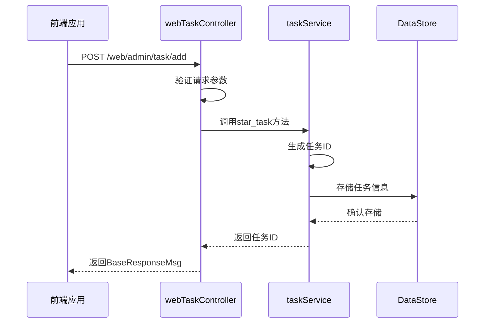
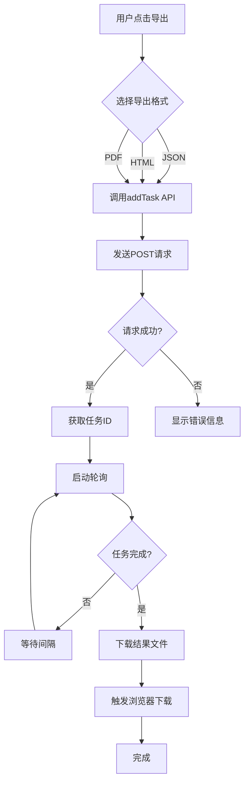

# 结果导出与分享

<cite>
**本文档引用的文件**   
- [webTaskController.py](file://src/backEnd/api/commonApi/webTaskController.py)
- [taskService.py](file://src/backEnd/service/taskService.py)
- [task.ts](file://src/frontEnd/src/api/task.ts)
- [BaseResponseMsg.py](file://src/backEnd/model/BaseResponseMsg.py)
- [api.py](file://src/backEnd/third_lib/sqlmap/lib/utils/api.py)
</cite>

## 目录
1. [简介](#简介)
2. [结果导出格式与适用场景](#结果导出格式与适用场景)
3. [后端导出接口设计](#后端导出接口设计)
4. [前端导出与下载处理](#前端导出与下载处理)
5. [自定义导出模板配置](#自定义导出模板配置)
6. [结果分享安全注意事项](#结果分享安全注意事项)
7. [最佳实践](#最佳实践)

## 简介
本系统提供全面的任务结果导出与分享功能，支持多种格式的导出，包括JSON、HTML、PDF等。系统通过webTaskController.py中的导出接口实现数据序列化、格式转换和文件生成等后端逻辑。前端通过调用相应API触发导出操作并处理下载响应，同时提供进度提示和错误处理机制。不同格式针对不同使用场景进行了优化，如JSON格式适用于自动化处理，HTML格式适用于报告展示。

## 结果导出格式与适用场景
系统支持多种结果导出格式，每种格式都有其特定的适用场景：

- **JSON格式**：适用于自动化处理和程序间数据交换。该格式保持了数据的结构化特性，便于脚本解析和后续处理，适合集成到CI/CD流程或与其他安全工具进行数据交互。

- **HTML格式**：适用于报告展示和人工审查。该格式提供了良好的可读性和视觉呈现，包含完整的样式和交互元素，适合向管理层或客户展示扫描结果。

- **PDF格式**：适用于正式文档和存档。该格式保证了文档的版式一致性，适合需要打印或长期保存的场景，确保结果在不同设备上显示效果一致。

- **YAML格式**：适用于配置文件导出和版本控制。该格式具有良好的可读性，适合导出扫描配置或规则集，便于团队协作和配置管理。

- **SQL格式**：适用于数据库相关的数据迁移和备份。该格式包含完整的建表语句和数据插入语句，适合需要将结果导入数据库的场景。

**Section sources**
- [webTaskController.py](file://src/backEnd/api/commonApi/webTaskController.py#L1-L91)
- [taskService.py](file://src/backEnd/service/taskService.py#L1-L200)

## 后端导出接口设计
系统后端通过webTaskController.py中的接口实现导出功能，主要包含数据序列化、格式转换和文件生成等逻辑。

导出接口采用分层设计，首先通过BaseResponseMsg类统一响应格式，确保所有API返回一致的数据结构。在taskService.py中，通过star_task方法处理任务创建请求，该方法负责验证参数、生成任务ID并初始化任务状态。

数据序列化过程遵循严格的验证机制，首先检查options参数的完整性和有效性，然后对输入数据进行编码处理。系统使用encodeHex函数对任务ID进行十六进制编码，确保ID的唯一性和安全性。对于文件内容的处理，系统采用分块处理策略，通过fileContentEncode方法将大文件分割为256字节的块进行处理，避免内存溢出。

格式转换逻辑集成在SQLMap的核心功能中，通过REST-JSON API提供标准化的接口。系统在api.py中定义了/download/<taskid>/<target>/<filename:path>端点，用于处理文件下载请求。该接口实现了路径遍历防护，通过检查路径是否以SQLMAP_OUTPUT_PATH开头来防止安全漏洞。

文件生成过程采用异步处理模式，任务创建后立即返回任务ID，后台线程负责实际的扫描和结果生成。这种设计提高了响应速度，避免了长时间的HTTP连接。生成的文件存储在指定的输出目录中，通过任务ID进行组织和管理。



**Diagram sources **
- [webTaskController.py](file://src/backEnd/api/commonApi/webTaskController.py#L1-L91)
- [taskService.py](file://src/backEnd/service/taskService.py#L58-L87)

**Section sources**
- [webTaskController.py](file://src/backEnd/api/commonApi/webTaskController.py#L1-L91)
- [taskService.py](file://src/backEnd/service/taskService.py#L1-L200)
- [BaseResponseMsg.py](file://src/backEnd/model/BaseResponseMsg.py#L1-L21)

## 前端导出与下载处理
前端通过task.ts中的API调用实现导出操作的触发和下载响应的处理。系统采用异步请求模式，确保用户界面的响应性。

导出操作的触发通过addTask函数实现，该函数封装了向/web/admin/task/add端点的POST请求。请求参数经过transformBackendTask函数转换，将前端数据模型映射为后端期望的格式。系统使用request库处理HTTP通信，自动处理认证头和内容类型。

下载响应处理包含完整的错误处理机制。当请求成功时，系统解析返回的BaseResponseMsg，提取任务ID并启动轮询机制检查任务状态。轮询间隔可配置，避免对服务器造成过大压力。当任务完成时，系统通过/download端点获取结果文件。

进度提示通过实时日志流实现。系统调用getTaskLogs函数定期获取任务日志，将日志条目转换为可读的字符串格式并显示在UI上。日志条目包含时间戳、级别和消息内容，帮助用户了解扫描进度。

错误处理采用分层策略。网络错误由request库自动重试，API错误通过分析响应码和消息内容进行分类处理。系统提供详细的错误信息，包括错误类型、发生位置和可能的解决方案，帮助用户快速定位问题。



**Diagram sources **
- [task.ts](file://src/frontEnd/src/api/task.ts#L1-L800)
- [webTaskController.py](file://src/backEnd/api/commonApi/webTaskController.py#L1-L91)

**Section sources**
- [task.ts](file://src/frontEnd/src/api/task.ts#L1-L800)
- [webTaskController.py](file://src/backEnd/api/commonApi/webTaskController.py#L1-L91)

## 自定义导出模板配置
系统支持自定义导出模板配置，允许用户根据特定需求定制导出内容和格式。模板配置通过JSON文件定义，包含字段映射、样式设置和条件逻辑。

模板配置文件采用分层结构，顶层定义文档元数据，如标题、作者和版本信息。内容部分定义数据字段的映射关系，指定每个字段在导出文档中的位置和格式。样式部分定义CSS规则，控制文档的视觉呈现。

配置方法包括直接编辑JSON文件和通过UI界面操作两种方式。直接编辑方式适合高级用户，可以精确控制每个配置项。UI界面方式提供向导式配置，通过表单输入简化配置过程。

代码示例展示了基本的模板配置结构：
```json
{
  "metadata": {
    "title": "安全扫描报告",
    "author": "安全团队",
    "version": "1.0"
  },
  "content": {
    "fields": [
      {
        "source": "scanUrl",
        "target": "目标URL",
        "format": "string"
      },
      {
        "source": "status",
        "target": "扫描状态",
        "format": "badge"
      }
    ]
  },
  "styles": {
    "header": "background-color: #f0f0f0; padding: 10px;",
    "table": "border: 1px solid #ddd; width: 100%;"
  }
}
```

系统在加载模板时进行验证，确保配置文件的完整性和正确性。验证包括JSON语法检查、必填字段检查和值范围检查。配置错误时，系统提供详细的错误信息，包括错误位置和修复建议。

**Section sources**
- [task.ts](file://src/frontEnd/src/api/task.ts#L1-L800)
- [webTaskController.py](file://src/backEnd/api/commonApi/webTaskController.py#L1-L91)

## 结果分享安全注意事项
在分享扫描结果时，必须注意以下安全事项：

1. **敏感信息过滤**：结果文件可能包含敏感信息，如内部IP地址、系统版本和配置细节。在分享前必须进行脱敏处理，移除或模糊化敏感数据。

2. **访问控制**：导出文件应设置适当的访问权限，限制只有授权人员可以访问。建议使用密码保护或加密存储，防止未授权访问。

3. **传输安全**：通过网络分享结果时，必须使用安全的传输协议，如HTTPS或SFTP。避免使用不安全的渠道，如普通邮件或公共文件共享服务。

4. **文件完整性**：确保导出文件的完整性，防止在传输过程中被篡改。建议使用数字签名或校验和验证文件完整性。

5. **生命周期管理**：设置文件的生命周期策略，定期清理过期的结果文件。避免长期存储不必要的敏感数据，降低数据泄露风险。

6. **审计追踪**：记录文件的访问和分享历史，包括访问者、时间和操作类型。这有助于在发生安全事件时进行追溯和调查。

7. **合规性检查**：确保分享行为符合相关法律法规和组织政策，特别是涉及个人数据或受监管信息时。

**Section sources**
- [api.py](file://src/backEnd/third_lib/sqlmap/lib/utils/api.py#L649-L672)
- [webTaskController.py](file://src/backEnd/api/commonApi/webTaskController.py#L1-L91)

## 最佳实践
为确保结果导出与分享功能的有效使用，建议遵循以下最佳实践：

1. **标准化命名**：采用一致的文件命名规范，包含项目名称、扫描日期和版本号，便于文件管理和追溯。

2. **版本控制**：将重要的导出结果纳入版本控制系统，记录变更历史，支持回滚和比较。

3. **自动化导出**：将导出过程集成到自动化工作流中，定期生成报告，减少人工操作。

4. **模板复用**：建立模板库，保存常用的导出模板，提高工作效率和一致性。

5. **质量检查**：在分享前进行质量检查，确保结果的准确性和完整性，避免传播错误信息。

6. **文档化**：记录导出和分享的流程，包括操作步骤、注意事项和常见问题，便于团队成员参考。

7. **定期审查**：定期审查导出和分享策略，根据业务需求和技术发展进行优化调整。