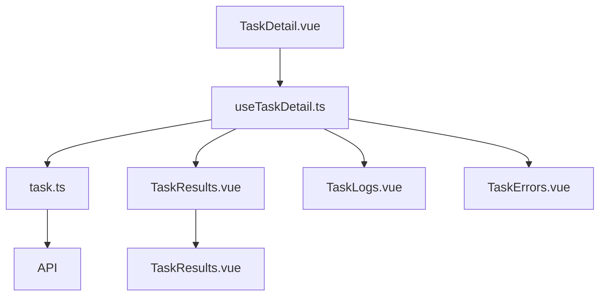
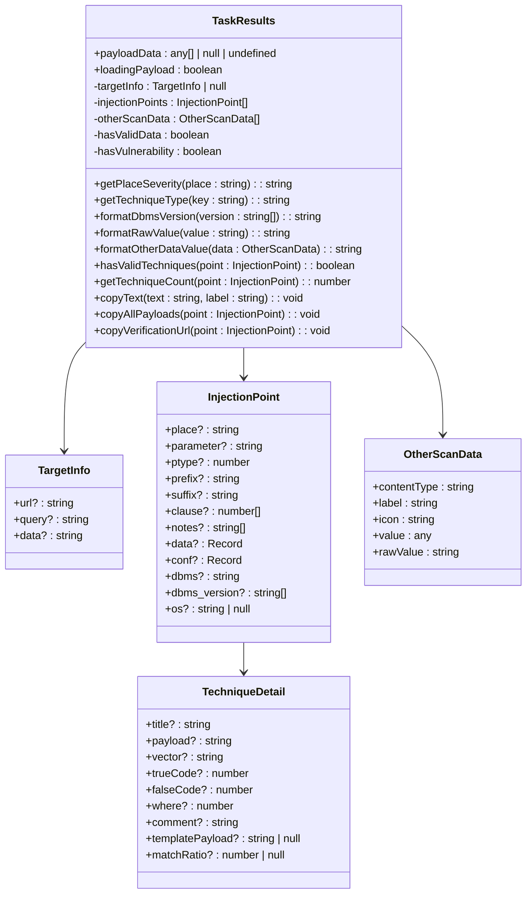
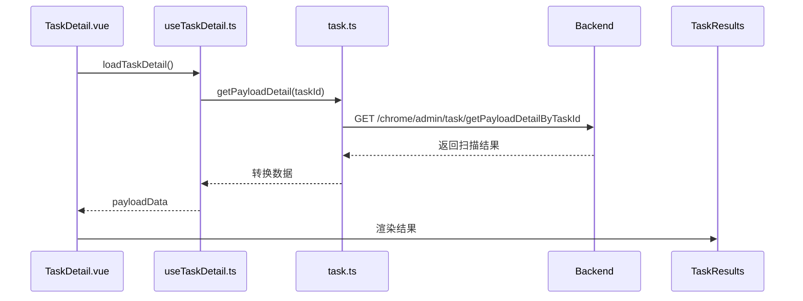
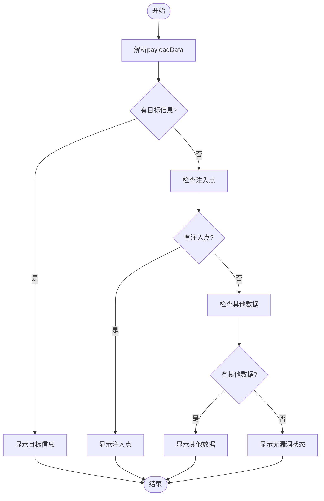
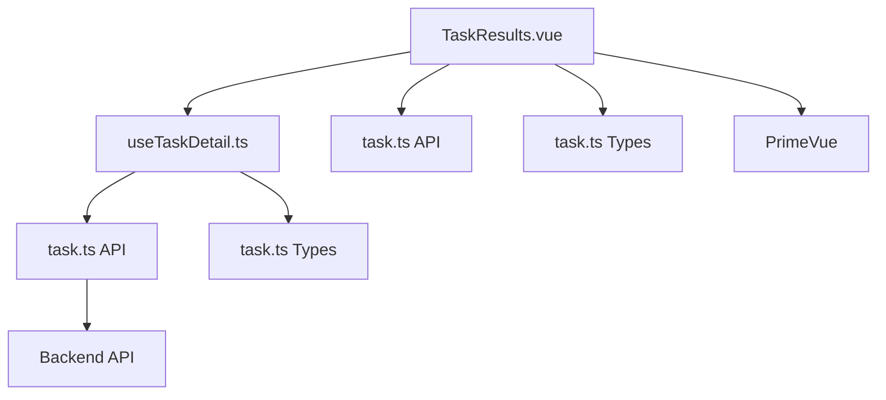

# 结果展示与可视化

<cite>
**Referenced Files in This Document**   
- [TaskResults.vue](file://src/frontEnd/src/views/TaskDetail/components/TaskResults.vue)
- [useTaskDetail.ts](file://src/frontEnd/src/views/TaskDetail/composables/useTaskDetail.ts)
- [task.ts](file://src/frontEnd/src/api/task.ts)
- [task.ts](file://src/frontEnd/src/types/task.ts)
- [TaskDetail/index.vue](file://src/frontEnd/src/views/TaskDetail/index.vue)
</cite>

## 目录
1. [介绍](#介绍)
2. [核心组件分析](#核心组件分析)
3. [架构概览](#架构概览)
4. [详细组件分析](#详细组件分析)
5. [依赖分析](#依赖分析)
6. [性能考虑](#性能考虑)
7. [故障排除指南](#故障排除指南)
8. [结论](#结论)

## 介绍
本文档详细介绍了SQLMap Web UI项目中任务结果展示与可视化的实现机制。重点分析了`TaskResults.vue`组件如何将SQLMap扫描结果以结构化、交互式的方式呈现给用户。文档涵盖了漏洞分类展示、风险等级标识、攻击向量可视化等UI设计，以及结果数据的前端处理流程，如分页、筛选、排序功能的实现。同时，文档还描述了不同漏洞类型（如布尔盲注、时间盲注、联合查询注入）的特异性展示方式，并提供了界面交互的最佳实践。

## 核心组件分析

`TaskResults.vue`组件是任务结果展示的核心，负责解析和渲染SQLMap扫描结果。该组件通过`payloadData`属性接收原始扫描数据，并将其转换为结构化的UI展示。组件主要分为三个部分：目标信息、注入点列表和其他扫描数据。目标信息部分显示扫描的URL、查询参数和POST数据。注入点列表部分展示检测到的注入点，包括注入位置、参数名、数据库类型等信息。其他扫描数据部分则展示数据库指纹、横幅、当前用户等信息。

**Section sources**
- [TaskResults.vue](file://src/frontEnd/src/views/TaskDetail/components/TaskResults.vue#L1-L1095)

## 架构概览

任务结果展示的架构基于Vue 3的响应式系统，通过组合式函数（composables）管理数据流。`useTaskDetail`组合式函数负责从API获取任务详情，并将数据传递给各个子组件。`TaskResults.vue`组件通过计算属性（computed properties）对原始数据进行解析和转换，确保数据的完整性和一致性。整个架构遵循单一数据源原则，确保数据的一致性和可维护性。

**Diagram sources **
- [TaskDetail/index.vue](file://src/frontEnd/src/views/TaskDetail/index.vue#L1-L301)
- [useTaskDetail.ts](file://src/frontEnd/src/views/TaskDetail/composables/useTaskDetail.ts#L1-L805)
- [task.ts](file://src/frontEnd/src/api/task.ts#L1-L1060)
- [TaskResults.vue](file://src/frontEnd/src/views/TaskDetail/components/TaskResults.vue#L1-L1095)

## 详细组件分析

### TaskResults.vue 组件分析
`TaskResults.vue`组件实现了任务结果的结构化展示。组件通过`payloadData`属性接收原始扫描数据，并使用计算属性对数据进行解析。`targetInfo`计算属性解析目标信息，`injectionPoints`计算属性解析注入点信息，`otherScanData`计算属性解析其他扫描数据。组件还提供了复制功能，允许用户复制Payload、验证URL等信息。

#### 对于对象导向的组件：

**Diagram sources **
- [TaskResults.vue](file://src/frontEnd/src/views/TaskDetail/components/TaskResults.vue#L206-L805)

#### 对于API/服务组件：

**Diagram sources **
- [TaskDetail/index.vue](file://src/frontEnd/src/views/TaskDetail/index.vue#L238-L293)
- [useTaskDetail.ts](file://src/frontEnd/src/views/TaskDetail/composables/useTaskDetail.ts#L430-L438)
- [task.ts](file://src/frontEnd/src/api/task.ts#L609-L630)

#### 对于复杂逻辑组件：

**Diagram sources **
- [TaskResults.vue](file://src/frontEnd/src/views/TaskDetail/components/TaskResults.vue#L6-L203)

**Section sources**
- [TaskResults.vue](file://src/frontEnd/src/views/TaskDetail/components/TaskResults.vue#L1-L1095)

## 依赖分析

任务结果展示组件依赖于多个外部模块和内部组件。主要依赖包括`useTaskDetail`组合式函数、`task.ts` API模块和`task.ts`类型定义。`useTaskDetail`负责数据获取和管理，`task.ts` API模块提供与后端的通信接口，`task.ts`类型定义确保数据类型的一致性。此外，组件还依赖于PrimeVue UI库，用于实现按钮、标签、数据表等UI元素。

**Diagram sources **
- [TaskResults.vue](file://src/frontEnd/src/views/TaskDetail/components/TaskResults.vue#L207-L208)
- [useTaskDetail.ts](file://src/frontEnd/src/views/TaskDetail/composables/useTaskDetail.ts#L9-L11)
- [task.ts](file://src/frontEnd/src/api/task.ts#L4-L5)
- [task.ts](file://src/frontEnd/src/types/task.ts#L1-L122)

**Section sources**
- [TaskResults.vue](file://src/frontEnd/src/views/TaskDetail/components/TaskResults.vue#L1-L1095)
- [useTaskDetail.ts](file://src/frontEnd/src/views/TaskDetail/composables/useTaskDetail.ts#L1-L805)
- [task.ts](file://src/frontEnd/src/api/task.ts#L1-L1060)
- [task.ts](file://src/frontEnd/src/types/task.ts#L1-L122)

## 性能考虑

任务结果展示组件在性能方面进行了多项优化。首先，组件使用计算属性对数据进行缓存，避免重复计算。其次，组件通过`v-if`指令实现条件渲染，确保只有在数据可用时才渲染相关UI元素。此外，组件还使用了`v-for`指令的`key`属性，提高列表渲染的性能。最后，组件通过`loading`状态管理，提供良好的用户体验。

## 故障排除指南

在使用任务结果展示组件时，可能会遇到以下问题：
1. **数据未显示**：检查`payloadData`是否正确传递，确保数据格式符合预期。
2. **UI元素未渲染**：检查计算属性的返回值，确保数据完整性。
3. **复制功能失效**：检查浏览器的剪贴板权限，确保`navigator.clipboard`可用。
4. **样式问题**：检查CSS类名是否正确应用，确保样式文件已正确导入。

**Section sources**
- [TaskResults.vue](file://src/frontEnd/src/views/TaskDetail/components/TaskResults.vue#L550-L563)
- [TaskResults.vue](file://src/frontEnd/src/views/TaskDetail/components/TaskResults.vue#L624-L1095)

## 结论

`TaskResults.vue`组件通过Vue 3的响应式系统和组合式函数，实现了任务结果的高效、结构化展示。组件设计遵循单一数据源原则，确保数据的一致性和可维护性。通过计算属性和条件渲染，组件提供了良好的性能和用户体验。未来可以进一步优化数据解析逻辑，支持更多类型的扫描结果展示。