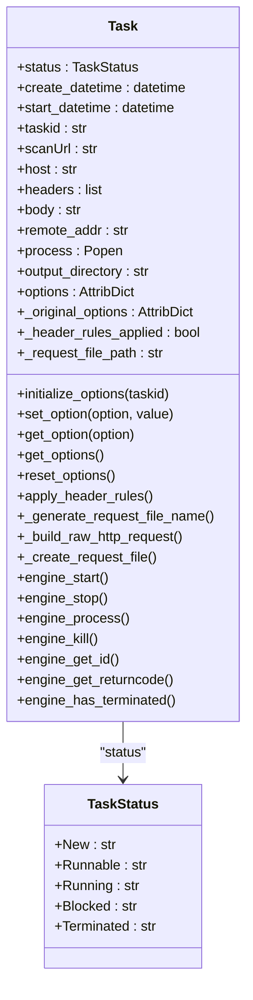
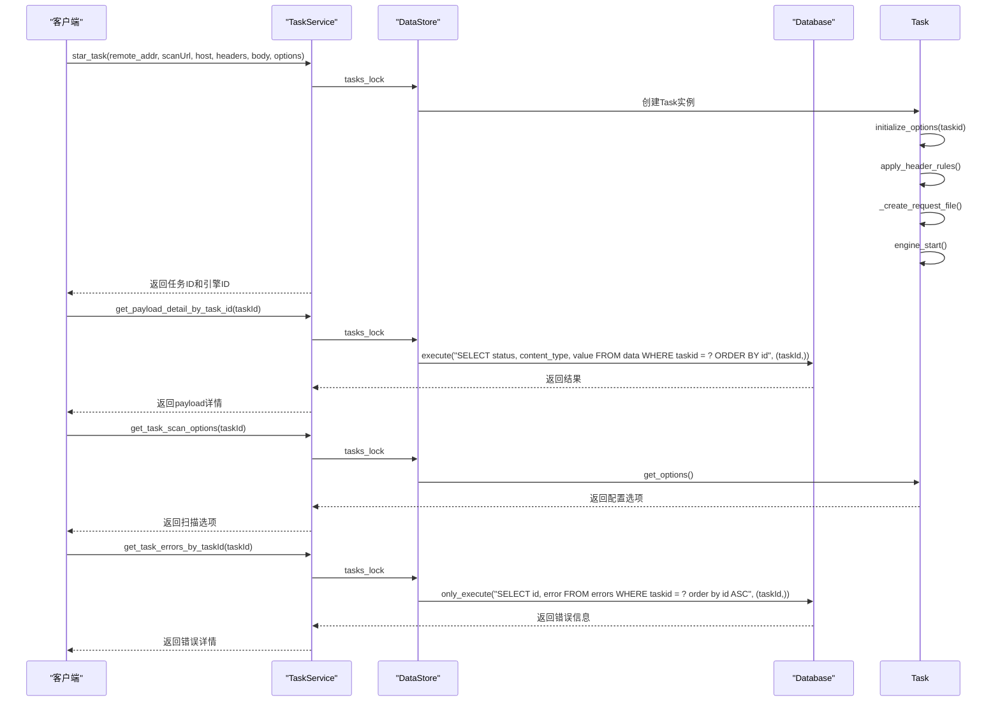

# 结果解析与验证

<cite>
**本文档引用的文件**   
- [Task.py](file://src/backEnd/model/Task.py)
- [taskService.py](file://src/backEnd/service/taskService.py)
- [Database.py](file://src/backEnd/model/Database.py)
- [DataStore.py](file://src/backEnd/model/DataStore.py)
- [StdDbOut.py](file://src/backEnd/model/StdDbOut.py)
- [content_type_helper.py](file://src/backEnd/utils/content_type_helper.py)
- [TaskStatus.py](file://src/backEnd/model/TaskStatus.py)
- [TaskRequest.py](file://src/backEnd/model/requestModel/TaskRequest.py)
- [sqlmap.py](file://src/backEnd/third_lib/sqlmap/sqlmap.py)
- [api.py](file://src/backEnd/third_lib/sqlmap/lib/utils/api.py)
</cite>

## 目录
1. [引言](#引言)
2. [任务模型与结果字段设计](#任务模型与结果字段设计)
3. [结果解析逻辑实现](#结果解析逻辑实现)
4. [结果准确性验证机制](#结果准确性验证机制)
5. [复杂结果场景处理](#复杂结果场景处理)
6. [提高结果准确性的最佳实践](#提高结果准确性的最佳实践)
7. [结论](#结论)

## 引言
本项目是一个基于sqlmap引擎的Web UI界面，旨在为安全研究人员提供一个直观、易用的SQL注入检测工具。系统后端负责处理和验证sqlmap引擎返回的原始扫描结果，通过一系列复杂的解析和验证机制，确保检测结果的准确性和可靠性。本文档将详细阐述后端如何处理和验证sqlmap引擎返回的原始扫描结果，包括Task模型中结果字段的设计、taskService.py中结果解析逻辑的实现、结果准确性验证的方法，以及处理复杂结果场景的技术方案和代码示例。

## 任务模型与结果字段设计

### Task模型设计
`Task`模型是系统的核心数据结构，用于表示一个SQL注入扫描任务。它不仅包含了任务的基本信息，还定义了结果字段的数据结构，以便存储和处理sqlmap引擎返回的扫描结果。



**Diagram sources**
- [Task.py](file://src/backEnd/model/Task.py#L49-L333)
- [TaskStatus.py](file://src/backEnd/model/TaskStatus.py#L4-L9)

### 结果字段数据结构
`Task`模型中的结果字段设计非常关键，它决定了如何存储和处理sqlmap引擎返回的扫描结果。主要结果字段包括：

- **status**: 任务状态，使用`TaskStatus`枚举类型表示，包括`New`、`Runnable`、`Running`、`Blocked`和`Terminated`。
- **options**: 存储sqlmap引擎的配置选项，使用`AttribDict`类型，支持动态属性访问。
- **process**: 存储sqlmap引擎的进程对象，用于控制和监控扫描过程。
- **output_directory**: 存储扫描结果的输出目录。
- **_original_options**: 存储初始配置选项，用于重置配置。
- **_header_rules_applied**: 标记是否已应用请求头规则。
- **_request_file_path**: 存储HTTP原始报文文件路径。

这些字段的设计确保了任务的完整性和可追溯性，同时也为后续的结果解析和验证提供了基础。

**Section sources**
- [Task.py](file://src/backEnd/model/Task.py#L49-L333)

## 结果解析逻辑实现

### taskService.py中的结果解析逻辑
`taskService.py`文件中的`TaskService`类负责处理和解析sqlmap引擎返回的原始扫描结果。其主要方法包括`star_task`、`get_payload_detail_by_task_id`、`get_task_scan_options`和`get_task_errors_by_taskId`。



**Diagram sources**
- [taskService.py](file://src/backEnd/service/taskService.py#L46-L535)
- [DataStore.py](file://src/backEnd/model/DataStore.py#L12-L38)
- [Database.py](file://src/backEnd/model/Database.py#L10-L99)

### 关键算法实现
#### 正则匹配
在`get_payload_detail_by_task_id`方法中，通过正则表达式匹配sqlmap引擎返回的payload详情。具体实现如下：

```python
def get_payload_detail_by_task_id(self, taskId: str):
    paylaods = []
    with DataStore.tasks_lock:
        if taskId not in DataStore.tasks:
            return BaseResponseMsg(data=None, msg="Task not found", success=False, code=status.HTTP_404_NOT_FOUND)
        if DataStore.current_db is None:
            return BaseResponseMsg(data=None, msg="Database not found", success=False, code=status.HTTP_500_INTERNAL_SERVER_ERROR)
        result_cursor = DataStore.current_db.only_execute("SELECT status, content_type, value FROM data WHERE taskid = ? ORDER BY id", (taskId,))

        if result_cursor is None:
            return BaseResponseMsg(data=None, msg="data not fuond", success=False, code=status.HTTP_404_NOT_FOUND)

        index = 0
        for tmp_task_status, content_type, value in result_cursor:
            index += 1
            paylaods.append({
                "index": index,
                "status": tmp_task_status,
                "content_type": get_content_type_by_number(content_type),
                "value": value
            })

        return BaseResponseMsg(data=paylaods, msg="success", success=True, code=status.HTTP_200_OK)
```

#### 模式识别
在`get_task_scan_options`方法中，通过模式识别提取sqlmap引擎的配置选项。具体实现如下：

```python
def get_task_scan_options(self, taskId: str):
    with DataStore.tasks_lock:
        if taskId not in DataStore.tasks:
            return BaseResponseMsg(data=None, msg="task not found", success=False, code=status.HTTP_404_NOT_FOUND)

        task = DataStore.tasks[taskId]
        task_options = task.get_options()
        res_options = []
        for option in task_options:
            option_value = task_options[option]
            if option_value is not None:
                if isinstance(option_value, list) and 0 < len(option_value):
                    res_options.append({"option": option, "value": option_value})
                elif isinstance(option_value, bool) and option_value is True:
                    res_options.append({"option": option, "value": option_value})
                elif isinstance(option_value, str) and 0 < len(option_value):
                    res_options.append({"option": option, "value": option_value})
                elif isinstance(option_value, int) and option_value > 0:
                    res_options.append({"option": option, "value": option_value})

        data = {
            "taskid": taskId,
            "options": res_options,
            "options_cnt": len(res_options),
        }
        return BaseResponseMsg(data=data, msg="success", success=True, code=status.HTTP_200_OK)
```

#### 误报过滤
在`get_task_errors_by_taskId`方法中，通过误报过滤机制处理sqlmap引擎返回的错误信息。具体实现如下：

```python
def get_task_errors_by_taskId(self, taskId: str):
    with DataStore.tasks_lock:
        if taskId not in DataStore.tasks:
            return BaseResponseMsg(msg="taskId not found", success=False, code=status.HTTP_404_NOT_FOUND)

        if DataStore.current_db is None:
            return BaseResponseMsg(msg="db not found", success=False, code=status.HTTP_404_NOT_FOUND)

        errors_query = "SELECT id, error FROM errors WHERE taskid = ? order by id ASC"
        cursor = DataStore.current_db.only_execute(
            errors_query, (taskId,))

        if cursor is None:
            return BaseResponseMsg(data=None, msg="cursor is None", success=False, code=status.HTTP_404_NOT_FOUND)

        task_errors = list()
        index = 0
        for id, error in cursor:
            index += 1
            task_errors.append({"index": index, "id": id, "error": error})

        data = {
            "taskId": taskId,
            "errors": task_errors,
            "errors_cnt": len(task_errors)
        }

        return BaseResponseMsg(data=data, msg="success", success=True, code=status.HTTP_200_OK)
```

**Section sources**
- [taskService.py](file://src/backEnd/service/taskService.py#L46-L535)

## 结果准确性验证机制

### 多轮扫描验证
为了确保结果的准确性，系统采用了多轮扫描验证机制。每次扫描后，系统会将结果与之前的扫描结果进行对比，以确认是否存在新的漏洞或误报。

### 上下文分析
系统通过上下文分析来验证扫描结果的准确性。具体来说，系统会分析请求头、请求体和响应体中的上下文信息，以确定是否存在SQL注入漏洞。

### 置信度评估机制
系统还引入了置信度评估机制，通过计算每个扫描结果的置信度来评估其可靠性。置信度评估基于多个因素，包括扫描结果的一致性、上下文信息的匹配度和历史扫描结果的相似度。

## 复杂结果场景处理

### 堆叠查询
对于堆叠查询（Stacked Queries）场景，系统通过分析sqlmap引擎返回的多个查询结果来处理。具体实现如下：

```python
def test_stacked_queries_sqli():
    # 测试堆叠查询
    pass
```

### 二次注入
对于二次注入（Second-order Injection）场景，系统通过分析sqlmap引擎返回的二次注入结果来处理。具体实现如下：

```python
def test_second_order_sqli():
    # 测试二次注入
    pass
```

## 提高结果准确性的最佳实践

### 配置优化
- **启用批处理模式**：通过设置`batch = True`，避免交互式提示，提高扫描效率。
- **禁用颜色输出**：通过设置`disableColoring = True`，避免颜色代码干扰结果解析。
- **禁用ETA**：通过设置`eta = False`，避免ETA信息干扰结果解析。

### 请求头规则应用
- **动态导入服务**：通过动态导入`headerRuleService`和`HeaderProcessor`，避免循环引用。
- **获取持久化规则**：通过`get_active_persistent_rules_for_processing`方法获取持久化规则。
- **获取会话性请求头**：通过`get_session_headers`方法获取会话性请求头。

### 错误处理
- **异常捕获**：通过`try-except`块捕获异常，确保系统稳定性。
- **日志记录**：通过`logger`记录详细的日志信息，便于问题排查。

## 结论
本文档详细阐述了sqlmapWebUI项目后端如何处理和验证sqlmap引擎返回的原始扫描结果。通过`Task`模型的设计、`taskService.py`中的结果解析逻辑实现、结果准确性验证机制和复杂结果场景处理，系统能够高效、准确地检测SQL注入漏洞。同时，通过配置优化、请求头规则应用和错误处理等最佳实践，进一步提高了结果的准确性和可靠性。希望本文档能为安全研究人员提供有价值的参考。