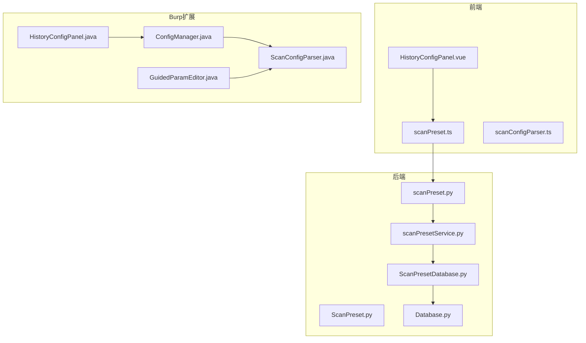
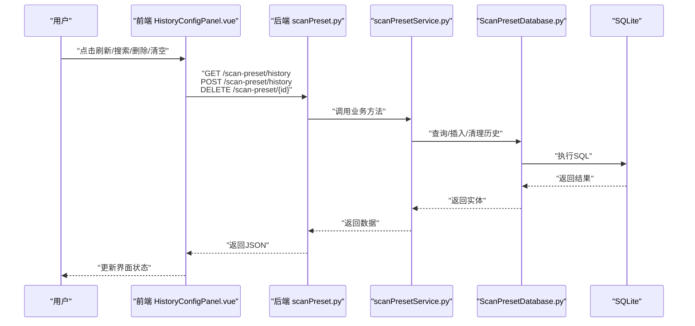
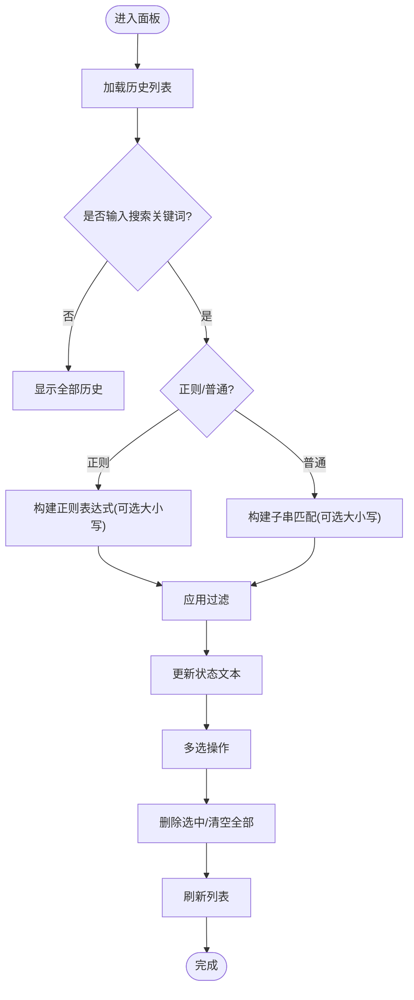
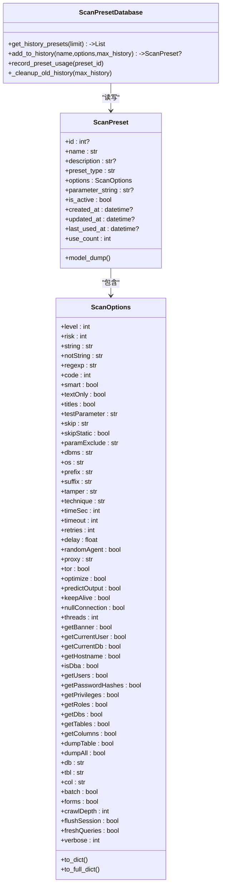
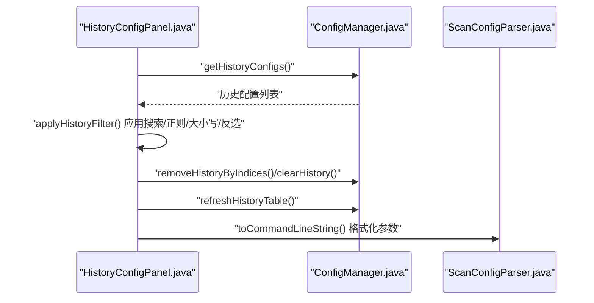
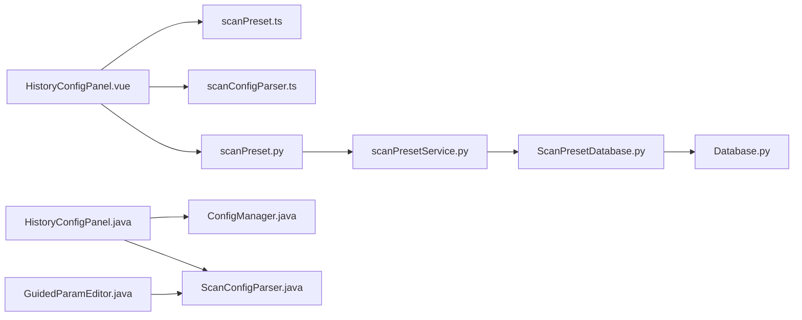

# 历史配置管理

<cite>
**本文引用的文件**
- [HistoryConfigPanel.java（蒙诺亚API版）](file://src/burpEx/montoya-api/src/main/java/com/sqlmapwebui/burp/panels/HistoryConfigPanel.java)
- [HistoryConfigPanel.java（Legacy API版）](file://src/burpEx/legacy-api/src/main/java/com/sqlmapwebui/burp/panels/HistoryConfigPanel.java)
- [ConfigManager.java（蒙诺亚API版）](file://src/burpEx/montoya-api/src/main/java/com/sqlmapwebui/burp/ConfigManager.java)
- [ConfigManager.java（Legacy API版）](file://src/burpEx/legacy-api/src/main/java/com/sqlmapwebui/burp/ConfigManager.java)
- [ScanConfigParser.java（蒙诺亚API版）](file://src/burpEx/montoya-api/src/main/java/com/sqlmapwebui/burp/ScanConfigParser.java)
- [ScanConfigParser.java（Legacy API版）](file://src/burpEx/legacy-api/src/main/java/com/sqlmapwebui/burp/ScanConfigParser.java)
- [GuidedParamEditor.java（蒙诺亚API版）](file://src/burpEx/montoya-api/src/main/java/com/sqlmapwebui/burp/panels/GuidedParamEditor.java)
- [GuidedParamEditor.java（Legacy API版）](file://src/burpEx/legacy-api/src/main/java/com/sqlmapwebui/burp/panels/GuidedParamEditor.java)
- [HistoryConfigPanel.vue（前端Vue组件）](file://src/frontEnd/src/views/Config/components/HistoryConfigPanel.vue)
- [scanConfigParser.ts（前端参数解析工具）](file://src/frontEnd/src/utils/scanConfigParser.ts)
- [scanPreset.ts（前端状态管理）](file://src/frontEnd/src/stores/scanPreset.ts)
- [scanPreset.py（后端模型）](file://src/backEnd/model/ScanPreset.py)
- [ScanPresetDatabase.py（后端数据库访问）](file://src/backEnd/model/ScanPresetDatabase.py)
- [scanPresetService.py（后端服务层）](file://src/backEnd/service/scanPresetService.py)
- [scanPreset.py（后端API路由）](file://src/backEnd/api/commonApi/scanPreset.py)
- [Database.py（SQLite基础封装）](file://src/backEnd/model/Database.py)
</cite>

## 目录
1. [简介](#简介)
2. [项目结构](#项目结构)
3. [核心组件](#核心组件)
4. [架构总览](#架构总览)
5. [详细组件分析](#详细组件分析)
6. [依赖关系分析](#依赖关系分析)
7. [性能考量](#性能考量)
8. [故障排查指南](#故障排查指南)
9. [结论](#结论)
10. [附录](#附录)

## 简介
本文件面向“历史配置管理”功能，系统性阐述如下内容：
- 如何自动记录和存储每次扫描任务的完整配置参数
- HistoryConfigPanel 组件的实现原理（历史记录展示、搜索过滤、多选删除、快速复用）
- 历史配置的存储策略、生命周期管理与数据清理规则
- 用户如何从历史记录中选择并应用先前成功的扫描配置
- 最佳实践：敏感信息保护、存储空间优化、审计追踪

## 项目结构
历史配置管理横跨前后端与Burp扩展三部分：
- 前端：Vue组件负责展示与交互；参数解析工具负责命令行参数字符串与选项对象互转
- 后端：模型与数据库层负责历史配置的持久化、清理与查询；服务层负责业务逻辑；API层提供REST接口
- Burp扩展：Java面板负责历史记录的本地展示、过滤、删除与日志输出；与后端通过API同步

图表来源
- [HistoryConfigPanel.vue（前端Vue组件）](file://src/frontEnd/src/views/Config/components/HistoryConfigPanel.vue#L1-L367)
- [scanPreset.ts（前端状态管理）](file://src/frontEnd/src/stores/scanPreset.ts#L1-L44)
- [scanConfigParser.ts（前端参数解析工具）](file://src/frontEnd/src/utils/scanConfigParser.ts#L1-L420)
- [scanPreset.py（后端API路由）](file://src/backEnd/api/commonApi/scanPreset.py#L1-L325)
- [scanPresetService.py（后端服务层）](file://src/backEnd/service/scanPresetService.py#L1-L182)
- [ScanPreset.py（后端模型）](file://src/backEnd/model/ScanPreset.py#L1-L231)
- [ScanPresetDatabase.py（后端数据库访问）](file://src/backEnd/model/ScanPresetDatabase.py#L259-L458)
- [Database.py（SQLite基础封装）](file://src/backEnd/model/Database.py#L1-L99)
- [HistoryConfigPanel.java（蒙诺亚API版）](file://src/burpEx/montoya-api/src/main/java/com/sqlmapwebui/burp/panels/HistoryConfigPanel.java#L1-L320)
- [ConfigManager.java（蒙诺亚API版）](file://src/burpEx/montoya-api/src/main/java/com/sqlmapwebui/burp/ConfigManager.java#L269-L312)
- [ScanConfigParser.java（蒙诺亚API版）](file://src/burpEx/montoya-api/src/main/java/com/sqlmapwebui/burp/ScanConfigParser.java#L221-L264)
- [GuidedParamEditor.java（蒙诺亚API版）](file://src/burpEx/montoya-api/src/main/java/com/sqlmapwebui/burp/panels/GuidedParamEditor.java#L837-L871)

章节来源
- [HistoryConfigPanel.java（蒙诺亚API版）](file://src/burpEx/montoya-api/src/main/java/com/sqlmapwebui/burp/panels/HistoryConfigPanel.java#L1-L320)
- [HistoryConfigPanel.java（Legacy API版）](file://src/burpEx/legacy-api/src/main/java/com/sqlmapwebui/burp/panels/HistoryConfigPanel.java#L1-L320)
- [HistoryConfigPanel.vue（前端Vue组件）](file://src/frontEnd/src/views/Config/components/HistoryConfigPanel.vue#L1-L367)

## 核心组件
- 前端历史配置面板（HistoryConfigPanel.vue）
  - 展示历史记录（序号、命令行参数、时间），支持搜索过滤（普通/正则、大小写敏感、反选）、多选删除、清空全部、刷新
  - 通过 Pinia 状态管理维护历史列表与选中项，调用后端API进行增删查
- 后端历史配置模型与数据库
  - ScanPreset 模型定义历史配置字段（含 options、parameter_string、last_used_at、use_count 等）
  - ScanPresetDatabase 提供历史查询、新增、清理等操作
  - scanPresetService 提供业务逻辑（合并应用、记录使用、限制历史数量）
  - scanPreset.py API 提供历史列表、添加历史、应用预设等接口
- Burp 扩展历史配置面板（HistoryConfigPanel.java）
  - 与 ConfigManager 协作，读取历史配置、应用过滤、删除与清空，并输出日志
  - 与 GuidedParamEditor 配合，支持从参数字符串解析与预览命令行参数

章节来源
- [HistoryConfigPanel.vue（前端Vue组件）](file://src/frontEnd/src/views/Config/components/HistoryConfigPanel.vue#L1-L367)
- [scanPreset.py（后端模型）](file://src/backEnd/model/ScanPreset.py#L1-L231)
- [ScanPresetDatabase.py（后端数据库访问）](file://src/backEnd/model/ScanPresetDatabase.py#L259-L458)
- [scanPresetService.py（后端服务层）](file://src/backEnd/service/scanPresetService.py#L1-L182)
- [scanPreset.py（后端API路由）](file://src/backEnd/api/commonApi/scanPreset.py#L1-L325)
- [HistoryConfigPanel.java（蒙诺亚API版）](file://src/burpEx/montoya-api/src/main/java/com/sqlmapwebui/burp/panels/HistoryConfigPanel.java#L1-L320)
- [ConfigManager.java（蒙诺亚API版）](file://src/burpEx/montoya-api/src/main/java/com/sqlmapwebui/burp/ConfigManager.java#L269-L312)

## 架构总览
历史配置管理采用“前端-后端-扩展”三层协作：
- 前端：负责用户交互与参数字符串格式化
- 后端：负责数据持久化、历史清理与应用合并
- 扩展：负责本地历史展示与日志输出

图表来源
- [scanPreset.py（后端API路由）](file://src/backEnd/api/commonApi/scanPreset.py#L143-L163)
- [scanPreset.py（后端API路由）](file://src/backEnd/api/commonApi/scanPreset.py#L270-L298)
- [scanPreset.py（后端API路由）](file://src/backEnd/api/commonApi/scanPreset.py#L244-L268)
- [scanPresetService.py（后端服务层）](file://src/backEnd/service/scanPresetService.py#L55-L66)
- [ScanPresetDatabase.py（后端数据库访问）](file://src/backEnd/model/ScanPresetDatabase.py#L274-L408)

## 详细组件分析

### 前端历史配置面板（HistoryConfigPanel.vue）
- 展示与交互
  - 表格列：序号、命令行参数、日期时间
  - 搜索过滤：支持普通字符串与正则表达式、大小写敏感、反选
  - 多选操作：全选、取消全选、反选、删除选中、清空全部、刷新
- 数据来源与格式化
  - 通过 Pinia 状态管理维护 history 列表
  - parameter_string 缺失时，使用工具函数将 options 转换为命令行参数字符串
  - 时间格式化统一为“年-月-日 时:分:秒”
- 与后端交互
  - 刷新：调用后端接口获取历史列表
  - 删除/清空：逐条删除或批量删除历史记录
  - 状态提示：显示可见/总数/选中数量

图表来源
- [HistoryConfigPanel.vue（前端Vue组件）](file://src/frontEnd/src/views/Config/components/HistoryConfigPanel.vue#L1-L367)
- [scanConfigParser.ts（前端参数解析工具）](file://src/frontEnd/src/utils/scanConfigParser.ts#L323-L377)

章节来源
- [HistoryConfigPanel.vue（前端Vue组件）](file://src/frontEnd/src/views/Config/components/HistoryConfigPanel.vue#L1-L367)
- [scanConfigParser.ts（前端参数解析工具）](file://src/frontEnd/src/utils/scanConfigParser.ts#L1-L420)
- [scanPreset.ts（前端状态管理）](file://src/frontEnd/src/stores/scanPreset.ts#L1-L44)

### 后端历史配置模型与数据库
- 模型设计
  - ScanPreset：包含 id、name、description、preset_type、options、parameter_string、is_active、created_at、updated_at、last_used_at、use_count
  - ScanOptions：与 sqlmap 的 optiondict 对齐，涵盖 Detection、Injection、Techniques、Request、Optimization、Enumeration、General 等类别
- 历史记录存储与清理
  - 新增历史：若同名历史存在则更新其 options，否则新建；同时记录使用时间与使用计数
  - 查询历史：按 last_used_at 降序返回，限制数量
  - 清理旧历史：仅保留最近 N 条（默认 20），删除其余
- 应用合并
  - 将历史配置应用到基础选项，返回合并后的选项字典，并记录使用

图表来源
- [ScanPreset.py（后端模型）](file://src/backEnd/model/ScanPreset.py#L1-L231)
- [ScanPresetDatabase.py（后端数据库访问）](file://src/backEnd/model/ScanPresetDatabase.py#L274-L408)

章节来源
- [ScanPreset.py（后端模型）](file://src/backEnd/model/ScanPreset.py#L1-L231)
- [ScanPresetDatabase.py（后端数据库访问）](file://src/backEnd/model/ScanPresetDatabase.py#L274-L408)
- [scanPresetService.py（后端服务层）](file://src/backEnd/service/scanPresetService.py#L134-L178)

### Burp 扩展历史配置面板（HistoryConfigPanel.java）
- 功能特性
  - 搜索过滤：支持正则/普通、大小写敏感、反选；回车快捷键触发
  - 多选删除：支持全选、取消全选、反选；删除时按模型索引倒序删除避免索引错乱
  - 清空全部：清空历史记录并保存
  - 刷新：从 ConfigManager 读取历史配置并渲染表格
- 与后端协同
  - 通过 ConfigManager 与后端 API 同步历史；删除/清空后刷新并输出日志

图表来源
- [HistoryConfigPanel.java（蒙诺亚API版）](file://src/burpEx/montoya-api/src/main/java/com/sqlmapwebui/burp/panels/HistoryConfigPanel.java#L173-L222)
- [HistoryConfigPanel.java（蒙诺亚API版）](file://src/burpEx/montoya-api/src/main/java/com/sqlmapwebui/burp/panels/HistoryConfigPanel.java#L254-L319)
- [ConfigManager.java（蒙诺亚API版）](file://src/burpEx/montoya-api/src/main/java/com/sqlmapwebui/burp/ConfigManager.java#L282-L312)
- [ScanConfigParser.java（蒙诺亚API版）](file://src/burpEx/montoya-api/src/main/java/com/sqlmapwebui/burp/ScanConfigParser.java#L221-L264)

章节来源
- [HistoryConfigPanel.java（蒙诺亚API版）](file://src/burpEx/montoya-api/src/main/java/com/sqlmapwebui/burp/panels/HistoryConfigPanel.java#L1-L320)
- [HistoryConfigPanel.java（Legacy API版）](file://src/burpEx/legacy-api/src/main/java/com/sqlmapwebui/burp/panels/HistoryConfigPanel.java#L1-L320)
- [ConfigManager.java（蒙诺亚API版）](file://src/burpEx/montoya-api/src/main/java/com/sqlmapwebui/burp/ConfigManager.java#L269-L312)
- [ConfigManager.java（Legacy API版）](file://src/burpEx/legacy-api/src/main/java/com/sqlmapwebui/burp/ConfigManager.java#L261-L305)

### 历史配置的自动记录与存储策略
- 自动记录
  - 当用户成功应用某次扫描配置后，系统将其 options 与名称打包，调用后端接口添加到历史记录
  - 若同名历史已存在，则更新其 options，避免重复创建
- 存储策略
  - 以 SQL 表 scan_presets 存储，类型为 HISTORY
  - 字段包含 options（JSON）、parameter_string（可选）、last_used_at、use_count 等
- 生命周期与清理
  - 每次新增历史时，记录使用时间并尝试清理超出上限的历史（默认保留最近 20 条）
  - 查询历史时按 last_used_at 降序返回，限制数量
- 快速复用
  - 前端与后端均提供“应用预设配置到基础选项”的能力，返回合并后的选项字典

章节来源
- [scanPreset.py（后端API路由）](file://src/backEnd/api/commonApi/scanPreset.py#L270-L298)
- [ScanPresetDatabase.py（后端数据库访问）](file://src/backEnd/model/ScanPresetDatabase.py#L377-L408)
- [ScanPresetDatabase.py（后端数据库访问）](file://src/backEnd/model/ScanPresetDatabase.py#L409-L458)
- [scanPresetService.py（后端服务层）](file://src/backEnd/service/scanPresetService.py#L156-L178)

### 用户如何从历史记录中选择并应用先前成功的扫描配置
- 前端流程
  - 在历史面板中选择一条或多条记录，点击“删除选中/清空全部/刷新”，或直接在“配置”页面选择历史项
  - 调用后端接口将所选历史配置应用到当前基础选项，返回合并后的选项字典
- 扩展流程
  - 在 Burp 插件中选择历史记录，复制命令行参数字符串，粘贴到 GuidedParamEditor 中进行参数编辑与预览

章节来源
- [scanPreset.py（后端API路由）](file://src/backEnd/api/commonApi/scanPreset.py#L300-L325)
- [GuidedParamEditor.java（蒙诺亚API版）](file://src/burpEx/montoya-api/src/main/java/com/sqlmapwebui/burp/panels/GuidedParamEditor.java#L837-L871)
- [GuidedParamEditor.java（Legacy API版）](file://src/burpEx/legacy-api/src/main/java/com/sqlmapwebui/burp/panels/GuidedParamEditor.java#L837-L871)

## 依赖关系分析
- 前端依赖
  - HistoryConfigPanel.vue 依赖 scanPreset.ts 状态管理与 scanConfigParser.ts 参数解析
  - 通过 API 路由与后端交互
- 后端依赖
  - scanPresetService 依赖 ScanPresetDatabase
  - ScanPresetDatabase 依赖 SQLite（Database.py）
- 扩展依赖
  - HistoryConfigPanel.java 依赖 ConfigManager 与 ScanConfigParser
  - GuidedParamEditor.java 依赖 ScanConfigParser

图表来源
- [HistoryConfigPanel.vue（前端Vue组件）](file://src/frontEnd/src/views/Config/components/HistoryConfigPanel.vue#L1-L367)
- [scanPreset.ts（前端状态管理）](file://src/frontEnd/src/stores/scanPreset.ts#L1-L44)
- [scanConfigParser.ts（前端参数解析工具）](file://src/frontEnd/src/utils/scanConfigParser.ts#L1-L420)
- [scanPreset.py（后端API路由）](file://src/backEnd/api/commonApi/scanPreset.py#L1-L325)
- [scanPresetService.py（后端服务层）](file://src/backEnd/service/scanPresetService.py#L1-L182)
- [ScanPresetDatabase.py（后端数据库访问）](file://src/backEnd/model/ScanPresetDatabase.py#L259-L458)
- [Database.py（SQLite基础封装）](file://src/backEnd/model/Database.py#L1-L99)
- [HistoryConfigPanel.java（蒙诺亚API版）](file://src/burpEx/montoya-api/src/main/java/com/sqlmapwebui/burp/panels/HistoryConfigPanel.java#L1-L320)
- [ConfigManager.java（蒙诺亚API版）](file://src/burpEx/montoya-api/src/main/java/com/sqlmapwebui/burp/ConfigManager.java#L269-L312)
- [ScanConfigParser.java（蒙诺亚API版）](file://src/burpEx/montoya-api/src/main/java/com/sqlmapwebui/burp/ScanConfigParser.java#L221-L264)
- [GuidedParamEditor.java（蒙诺亚API版）](file://src/burpEx/montoya-api/src/main/java/com/sqlmapwebui/burp/panels/GuidedParamEditor.java#L837-L871)

## 性能考量
- 历史数量限制
  - 默认仅保留最近 20 条历史，减少查询与存储开销
- 数据库查询优化
  - 按 last_used_at 降序查询并限制数量，避免全表扫描
- 前端渲染优化
  - 使用虚拟滚动与固定列宽，提升大数据量下的表格渲染性能
- 并发与锁
  - SQLite 访问使用锁与重试机制，避免 OperationalError 导致的失败

章节来源
- [ScanPresetDatabase.py（后端数据库访问）](file://src/backEnd/model/ScanPresetDatabase.py#L274-L296)
- [ScanPresetDatabase.py（后端数据库访问）](file://src/backEnd/model/ScanPresetDatabase.py#L409-L458)
- [Database.py（SQLite基础封装）](file://src/backEnd/model/Database.py#L1-L99)

## 故障排查指南
- 前端搜索报错（正则无效）
  - 现象：输入正则表达式后提示语法错误
  - 排查：确认正则表达式合法；切换大小写敏感选项；尝试普通匹配
  - 参考路径：[HistoryConfigPanel.vue（前端Vue组件）](file://src/frontEnd/src/views/Config/components/HistoryConfigPanel.vue#L120-L140)
- 历史记录为空
  - 现象：刷新后无历史记录
  - 排查：确认后端接口返回正常；检查数据库中 scan_presets 表是否存在 HISTORY 类型记录
  - 参考路径：[scanPreset.py（后端API路由）](file://src/backEnd/api/commonApi/scanPreset.py#L143-L163)
- 删除失败或未生效
  - 现象：删除后仍可见或提示失败
  - 排查：确认 preset_id 有效且非默认配置；检查后端日志；确认 SQLite 删除语句执行成功
  - 参考路径：[scanPreset.py（后端API路由）](file://src/backEnd/api/commonApi/scanPreset.py#L244-L268)
- 扩展面板无法刷新
  - 现象：点击刷新无反应
  - 排查：确认 ConfigManager 历史列表可用；检查网络与后端接口连通性
  - 参考路径：[HistoryConfigPanel.java（蒙诺亚API版）](file://src/burpEx/montoya-api/src/main/java/com/sqlmapwebui/burp/panels/HistoryConfigPanel.java#L254-L276)

章节来源
- [HistoryConfigPanel.vue（前端Vue组件）](file://src/frontEnd/src/views/Config/components/HistoryConfigPanel.vue#L120-L140)
- [scanPreset.py（后端API路由）](file://src/backEnd/api/commonApi/scanPreset.py#L143-L163)
- [scanPreset.py（后端API路由）](file://src/backEnd/api/commonApi/scanPreset.py#L244-L268)
- [HistoryConfigPanel.java（蒙诺亚API版）](file://src/burpEx/montoya-api/src/main/java/com/sqlmapwebui/burp/panels/HistoryConfigPanel.java#L254-L276)

## 结论
历史配置管理通过“前端-后端-扩展”协同，实现了对扫描配置的自动记录、高效检索、灵活应用与有序清理。前端提供直观的搜索与多选操作，后端保证数据一致性与性能，扩展提供本地化体验。建议在生产环境中结合“敏感信息保护”“存储空间优化”“审计追踪”等最佳实践，持续完善历史配置管理能力。

## 附录

### 最佳实践
- 敏感信息保护
  - 历史记录中避免存储明文敏感参数（如认证凭据、密钥等）；必要时在存储前进行脱敏或加密
  - 对外暴露的 API 应限制敏感字段返回
- 存储空间优化
  - 控制历史数量上限（默认 20 条），定期清理长期未使用的记录
  - 对 parameter_string 与 options 采用压缩存储（如适用），降低磁盘占用
- 审计追踪
  - 记录历史配置的创建、更新、删除、应用事件与操作人
  - 为关键操作提供不可篡改的日志与备份

[本节为通用指导，无需特定文件引用]