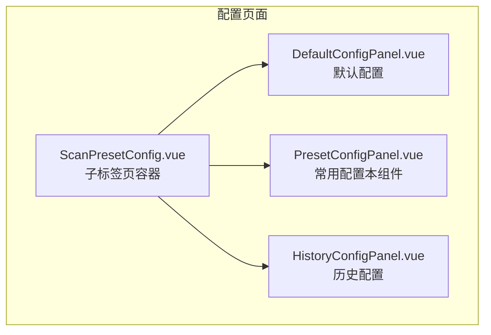
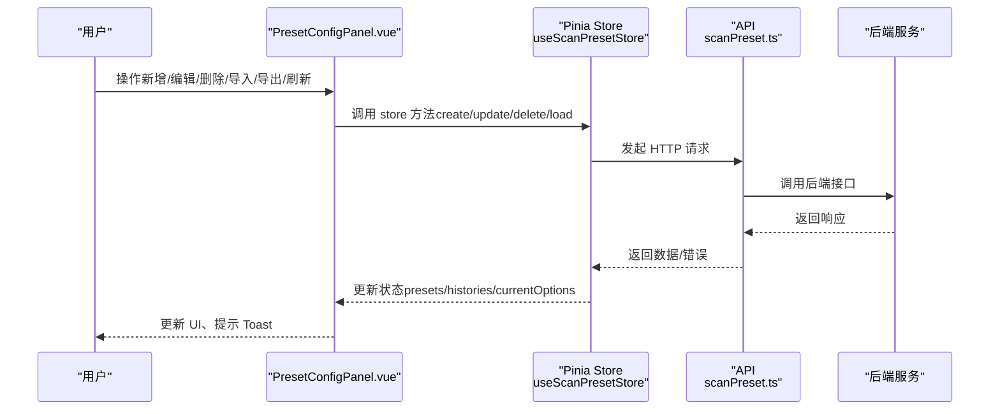
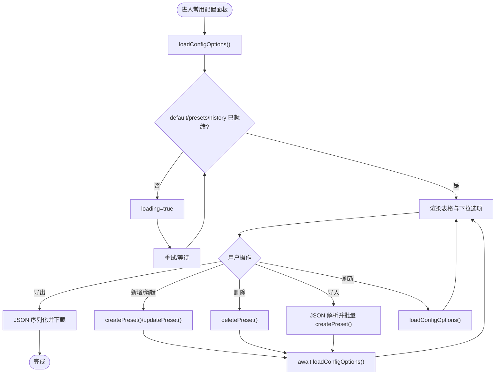
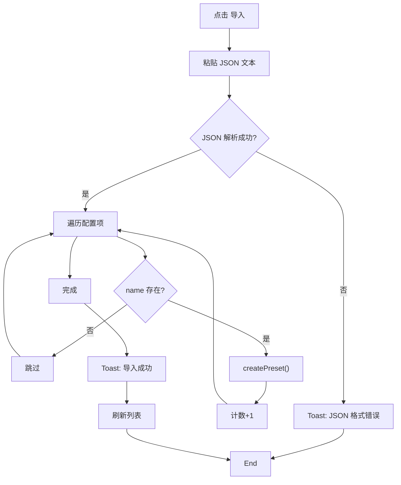
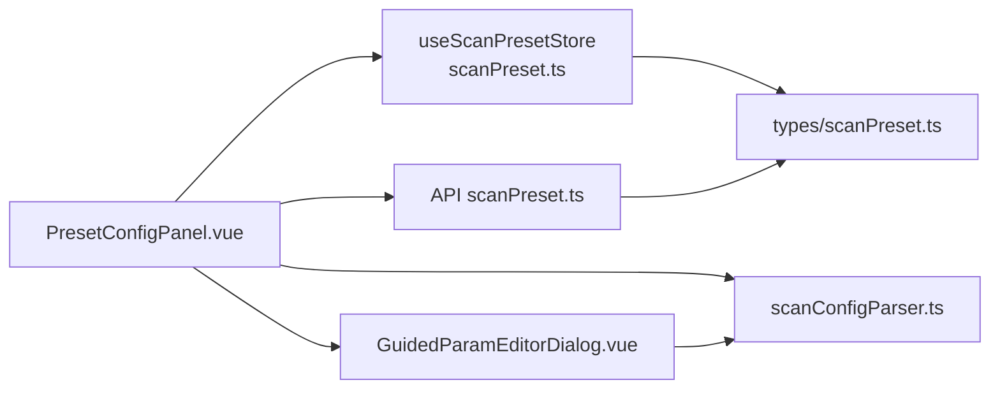

# 前端组件实现

<cite>
**本文引用的文件**
- [PresetConfigPanel.vue](file://src/frontEnd/src/views/Config/components/PresetConfigPanel.vue)
- [scanPreset.ts](file://src/frontEnd/src/stores/scanPreset.ts)
- [scanPreset.ts（API）](file://src/frontEnd/src/api/scanPreset.ts)
- [scanPreset.ts（类型定义）](file://src/frontEnd/src/types/scanPreset.ts)
- [scanConfigParser.ts](file://src/frontEnd/src/utils/scanConfigParser.ts)
- [ScanPresetConfig.vue](file://src/frontEnd/src/views/Config/components/ScanPresetConfig.vue)
- [DefaultConfigPanel.vue](file://src/frontEnd/src/views/Config/components/DefaultConfigPanel.vue)
- [HistoryConfigPanel.vue](file://src/frontEnd/src/views/Config/components/HistoryConfigPanel.vue)
- [GuidedParamEditorDialog.vue](file://src/frontEnd/src/components/GuidedParamEditorDialog.vue)
</cite>

## 目录
1. [简介](#简介)
2. [项目结构](#项目结构)
3. [核心组件](#核心组件)
4. [架构总览](#架构总览)
5. [详细组件分析](#详细组件分析)
6. [依赖关系分析](#依赖关系分析)
7. [性能考量](#性能考量)
8. [故障排查指南](#故障排查指南)
9. [结论](#结论)
10. [附录](#附录)

## 简介
本文件面向“PresetConfigPanel”前端组件，提供完整的技术文档，涵盖UI布局、交互流程、状态管理、Pinia Store的数据同步与缓存策略、API调用与错误处理、批量导入导出实现细节、可访问性与响应式适配，以及与默认配置、历史配置面板的集成方式。文档旨在帮助开发者快速理解并维护该组件。

## 项目结构
PresetConfigPanel位于配置页面的“扫描配置”子标签中，作为常用配置的管理入口，配合默认配置与历史配置面板共同构成完整的扫描配置体系。

图表来源
- [ScanPresetConfig.vue](file://src/frontEnd/src/views/Config/components/ScanPresetConfig.vue#L1-L61)
- [DefaultConfigPanel.vue](file://src/frontEnd/src/views/Config/components/DefaultConfigPanel.vue#L1-L127)
- [PresetConfigPanel.vue](file://src/frontEnd/src/views/Config/components/PresetConfigPanel.vue#L1-L129)
- [HistoryConfigPanel.vue](file://src/frontEnd/src/views/Config/components/HistoryConfigPanel.vue#L1-L81)

章节来源
- [ScanPresetConfig.vue](file://src/frontEnd/src/views/Config/components/ScanPresetConfig.vue#L1-L61)

## 核心组件
- 组件名称：常用配置面板（PresetConfigPanel）
- 所属模块：配置页面的扫描配置子标签
- 主要职责：
  - 展示常用配置列表
  - 支持新增、编辑、删除、批量删除
  - 支持导入、导出常用配置
  - 提供搜索过滤与状态栏
  - 与引导式参数编辑器联动
  - 与 Pinia Store 同步状态并调用后端 API

章节来源
- [PresetConfigPanel.vue](file://src/frontEnd/src/views/Config/components/PresetConfigPanel.vue#L1-L129)

## 架构总览
组件采用“视图层 + Pinia Store + API 层”的三层架构：
- 视图层：负责UI渲染、用户交互、本地状态与筛选
- Pinia Store：集中管理常用配置、默认配置、历史配置、当前选项等状态，并封装 CRUD 与应用逻辑
- API 层：封装 HTTP 请求，统一错误处理与返回格式

图表来源
- [PresetConfigPanel.vue](file://src/frontEnd/src/views/Config/components/PresetConfigPanel.vue#L264-L486)
- [scanPreset.ts](file://src/frontEnd/src/stores/scanPreset.ts#L1-L296)
- [scanPreset.ts（API）](file://src/frontEnd/src/api/scanPreset.ts#L1-L145)

## 详细组件分析

### UI 布局与交互
- 工具栏
  - 搜索过滤区：关键字、正则、大小写、反选、清除
  - 操作按钮：新增、引导式添加、编辑、引导式编辑、删除选中、刷新、导入、导出
- 列表表格
  - 字段：序号、名称、描述、命令行参数、创建时间、最后修改时间
  - 支持多选、双击进入编辑、滚动可视区域
- 状态栏：显示总数/可见数
- 对话框
  - 新增/编辑对话框：名称、描述、命令行参数
  - 导入对话框：粘贴 JSON
  - 引导式参数编辑器对话框：名称、描述、参数可视化编辑

章节来源
- [PresetConfigPanel.vue](file://src/frontEnd/src/views/Config/components/PresetConfigPanel.vue#L1-L129)
- [PresetConfigPanel.vue](file://src/frontEnd/src/views/Config/components/PresetConfigPanel.vue#L131-L486)

### 状态管理与 Pinia Store
- Store 关键状态
  - loading：加载状态
  - defaultPreset：默认配置
  - presetConfigs：常用配置列表
  - historyConfigs：历史配置列表
  - allPresets：全部预设（含激活/非激活）
  - currentOptions：当前扫描选项（用于任务提交时的非默认值提取）
  - selectedPresetId：当前选中的预设 ID
- 计算属性
  - presetOptions：将 default、presets、history 合并为下拉选项（含分隔符）
- 操作方法
  - loadConfigOptions：加载默认/常用/历史配置
  - loadAllPresets：加载全部预设
  - selectPreset：应用某个预设到 currentOptions
  - updateOptions/resetOptions：更新/重置 currentOptions
  - updateDefaultPreset：更新默认配置
  - createPreset/updatePreset/deletePreset/saveCurrentAsPreset/addToHistory：常用配置 CRUD 与历史记录
  - getEffectiveOptions：生成提交任务所需的非默认值集合（保证 batch=true）

图表来源
- [scanPreset.ts](file://src/frontEnd/src/stores/scanPreset.ts#L83-L295)
- [PresetConfigPanel.vue](file://src/frontEnd/src/views/Config/components/PresetConfigPanel.vue#L264-L486)

章节来源
- [scanPreset.ts](file://src/frontEnd/src/stores/scanPreset.ts#L1-L296)

### API 调用与错误处理
- API 方法
  - getAllPresets/includeInactive
  - getConfigOptions
  - getDefaultPreset
  - updateDefaultPreset
  - getPresetConfigs/getHistoryConfigs
  - getPresetById
  - createPreset/updatePreset/deletePreset
  - addToHistory
  - applyPreset
- 错误处理
  - 组件内统一使用 Toast 提示（成功/失败/警告）
  - 刷新失败时显示错误提示并恢复 loading
  - 导入失败时提示 JSON 格式问题
  - 删除前二次确认，避免误操作

章节来源
- [scanPreset.ts（API）](file://src/frontEnd/src/api/scanPreset.ts#L1-L145)
- [PresetConfigPanel.vue](file://src/frontEnd/src/views/Config/components/PresetConfigPanel.vue#L264-L486)

### 批量导入与导出
- 导入
  - 支持粘贴单条或多条 JSON（数组或对象）
  - 校验：仅当 name 存在时才创建
  - 成功后 Toast 提示导入数量并刷新列表
- 导出
  - 仅导出当前筛选结果
  - 字段：name、description、parameter_string（若为空则由 options 生成）
  - 文件名包含时间戳，类型为 application/json

图表来源
- [PresetConfigPanel.vue](file://src/frontEnd/src/views/Config/components/PresetConfigPanel.vue#L427-L481)
- [scanPreset.ts（API）](file://src/frontEnd/src/api/scanPreset.ts#L100-L134)

章节来源
- [PresetConfigPanel.vue](file://src/frontEnd/src/views/Config/components/PresetConfigPanel.vue#L427-L481)

### 与默认配置、历史配置的集成
- 默认配置
  - DefaultConfigPanel 通过 store.updateDefaultPreset 保存默认扫描选项
  - PresetConfigPanel 在 resetOptions 时可回退到默认配置
- 历史配置
  - HistoryConfigPanel 独立管理历史记录的 CRUD
  - PresetConfigPanel 通过 addToHistory 将当前 options 保存为历史记录
- 三者共享同一 store，形成“默认/常用/历史”三位一体的配置生态

章节来源
- [DefaultConfigPanel.vue](file://src/frontEnd/src/views/Config/components/DefaultConfigPanel.vue#L243-L277)
- [HistoryConfigPanel.vue](file://src/frontEnd/src/views/Config/components/HistoryConfigPanel.vue#L199-L261)
- [scanPreset.ts](file://src/frontEnd/src/stores/scanPreset.ts#L131-L242)

### 参数解析与双向转换
- 参数解析器
  - 将命令行参数字符串解析为 ScanOptions
  - 将 ScanOptions 转换为命令行参数字符串
  - 支持默认值、范围校验、无效值警告、未知参数提示
- 与组件的结合
  - 新增/编辑对话框支持直接输入参数字符串
  - 引导式编辑器通过 GuidedParamEditorDialog 生成参数字符串
  - 列表展示优先显示 parameter_string，其次由 options 生成

章节来源
- [scanConfigParser.ts](file://src/frontEnd/src/utils/scanConfigParser.ts#L1-L420)
- [PresetConfigPanel.vue](file://src/frontEnd/src/views/Config/components/PresetConfigPanel.vue#L318-L405)
- [GuidedParamEditorDialog.vue](file://src/frontEnd/src/components/GuidedParamEditorDialog.vue#L1-L190)

### 可访问性与响应式布局
- 可访问性
  - 使用语义化标签（DataTable/Column/Dialog/Button/Checkbox/InputText）
  - 提供 Toast 与键盘可操作性（按钮、复选框、输入框）
  - 状态栏文本明确显示数量与筛选状态
- 响应式适配
  - 表格支持横向滚动与固定高度
  - 工具栏与按钮组支持换行
  - 对话框宽度固定，适合不同屏幕尺寸

章节来源
- [PresetConfigPanel.vue](file://src/frontEnd/src/views/Config/components/PresetConfigPanel.vue#L131-L486)

## 依赖关系分析

图表来源
- [PresetConfigPanel.vue](file://src/frontEnd/src/views/Config/components/PresetConfigPanel.vue#L131-L146)
- [scanPreset.ts](file://src/frontEnd/src/stores/scanPreset.ts#L1-L296)
- [scanPreset.ts（API）](file://src/frontEnd/src/api/scanPreset.ts#L1-L145)
- [scanConfigParser.ts](file://src/frontEnd/src/utils/scanConfigParser.ts#L1-L420)
- [GuidedParamEditorDialog.vue](file://src/frontEnd/src/components/GuidedParamEditorDialog.vue#L1-L190)
- [scanPreset.ts（类型定义）](file://src/frontEnd/src/types/scanPreset.ts#L1-L199)

章节来源
- [PresetConfigPanel.vue](file://src/frontEnd/src/views/Config/components/PresetConfigPanel.vue#L131-L146)
- [scanPreset.ts](file://src/frontEnd/src/stores/scanPreset.ts#L1-L296)
- [scanPreset.ts（API）](file://src/frontEnd/src/api/scanPreset.ts#L1-L145)
- [scanConfigParser.ts](file://src/frontEnd/src/utils/scanConfigParser.ts#L1-L420)
- [GuidedParamEditorDialog.vue](file://src/frontEnd/src/components/GuidedParamEditorDialog.vue#L1-L190)
- [scanPreset.ts（类型定义）](file://src/frontEnd/src/types/scanPreset.ts#L1-L199)

## 性能考量
- 列表渲染
  - 使用虚拟滚动（scrollable + scrollHeight）控制渲染范围
  - 过滤在客户端进行，建议限制数据规模或引入服务端分页
- 状态同步
  - 通过 store.loadConfigOptions() 同步常用/默认/历史配置，减少重复请求
  - 导入/删除后统一刷新，避免多次网络请求
- 参数解析
  - parseParameterString/toParameterString 为纯函数，复杂度与参数数量线性相关
  - 建议在批量导入时合并请求或节流触发刷新

[本节为通用指导，无需列出具体文件来源]

## 故障排查指南
- 刷新失败
  - 现象：点击刷新或导入/删除后列表未更新
  - 排查：检查网络请求是否成功；确认 Toast 是否显示错误
  - 处理：重试刷新；检查后端接口可用性
- 导入失败
  - 现象：提示 JSON 格式错误
  - 排查：确认粘贴内容为合法 JSON；检查 name 字段是否存在
  - 处理：修正 JSON 或逐条导入
- 删除确认
  - 现象：删除后未提示或误删
  - 排查：确认二次确认对话框是否被阻止
  - 处理：允许弹窗或手动确认
- 参数解析告警
  - 现象：参数值越界或无效
  - 排查：查看解析器返回的警告列表
  - 处理：调整参数值至有效范围

章节来源
- [PresetConfigPanel.vue](file://src/frontEnd/src/views/Config/components/PresetConfigPanel.vue#L264-L486)
- [scanConfigParser.ts](file://src/frontEnd/src/utils/scanConfigParser.ts#L218-L321)

## 结论
PresetConfigPanel 通过清晰的 UI 布局、完善的交互流程与 Pinia Store 的集中状态管理，实现了常用配置的高效管理。配合引导式参数编辑器与参数解析器，既满足新手快速上手，又兼顾专家的精细控制。与默认配置、历史配置面板的协同，构建了完整的扫描配置生态。建议后续引入服务端分页与缓存策略以进一步提升性能与用户体验。

[本节为总结性内容，无需列出具体文件来源]

## 附录

### 组件类图（代码级）

```mermaid
classDiagram
class PresetConfigPanel {
+状态 : loading, presets, selectedRows, searchKeyword, useRegex, caseSensitive, invertFilter, showDialog, showImport, showGuidedEditor
+计算 : filteredPresets, statusText, selectedRow
+方法 : applyFilter(), clearSearch(), refreshTable(), showAddDialog(), showEditDialog(), onRowDoubleClick(), saveConfig(), deleteSelected(), showImportDialog(), doImport(), showExportDialog()
}
class ScanPresetStore {
+状态 : loading, defaultPreset, presetConfigs, historyConfigs, allPresets, currentOptions, selectedPresetId
+计算 : presetOptions
+方法 : loadConfigOptions(), loadAllPresets(), selectPreset(), updateOptions(), resetOptions(), updateDefaultPreset(), createPreset(), updatePreset(), deletePreset(), saveCurrentAsPreset(), addToHistory(), getEffectiveOptions()
}
class ScanPresetAPI {
+方法 : getAllPresets(), getConfigOptions(), getDefaultPreset(), updateDefaultPreset(), getPresetConfigs(), getHistoryConfigs(), getPresetById(), createPreset(), updatePreset(), deletePreset(), addToHistory(), applyPreset()
}
class ScanConfigParser {
+方法 : parseParameterString(), toParameterString(), parseOrDefault(), getParamMetaList(), getParamMeta()
}
PresetConfigPanel --> ScanPresetStore : "使用"
PresetConfigPanel --> ScanPresetAPI : "调用"
PresetConfigPanel --> ScanConfigParser : "解析/生成参数"
```

图表来源
- [PresetConfigPanel.vue](file://src/frontEnd/src/views/Config/components/PresetConfigPanel.vue#L131-L486)
- [scanPreset.ts](file://src/frontEnd/src/stores/scanPreset.ts#L1-L296)
- [scanPreset.ts（API）](file://src/frontEnd/src/api/scanPreset.ts#L1-L145)
- [scanConfigParser.ts](file://src/frontEnd/src/utils/scanConfigParser.ts#L1-L420)