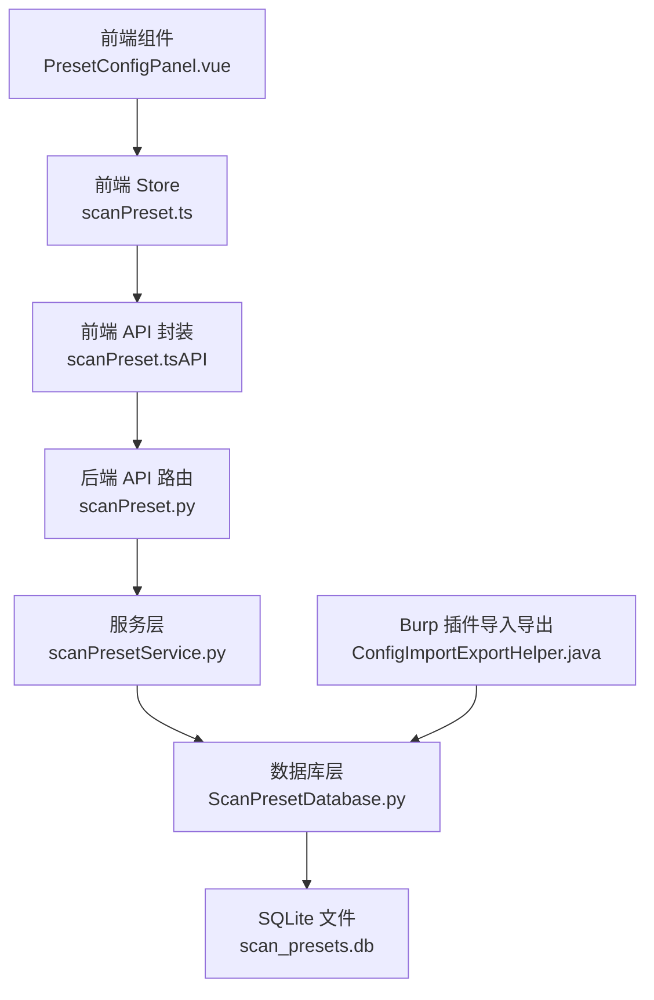
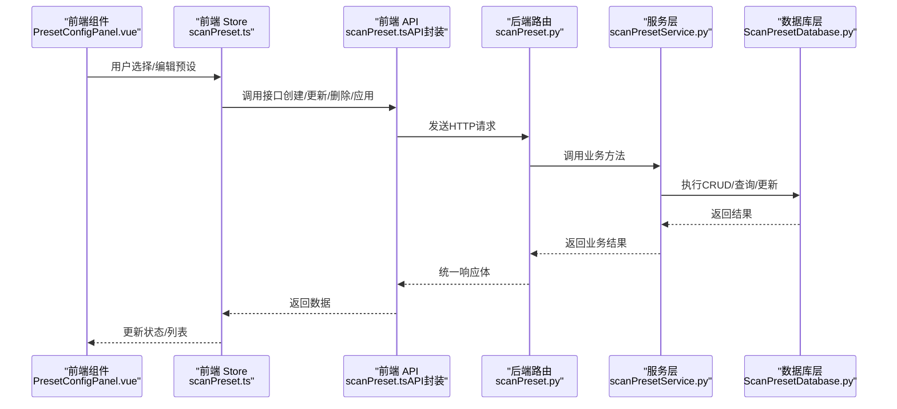
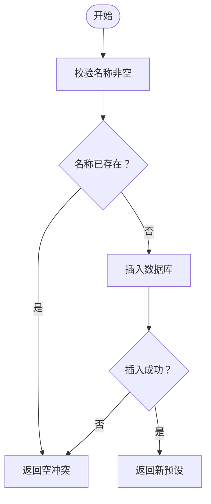
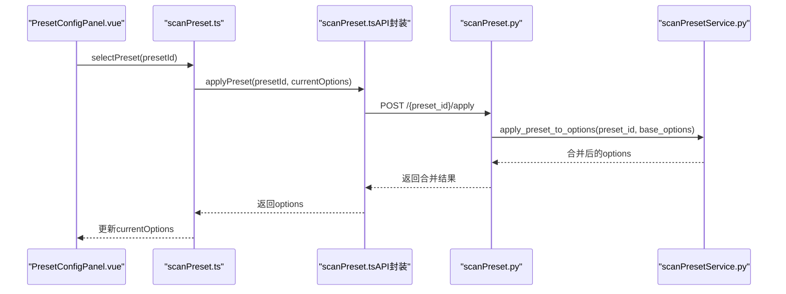
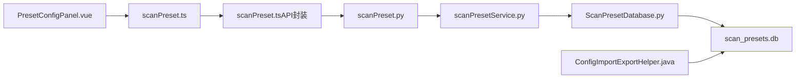

# 常用配置管理

<cite>
**本文引用的文件**
- [ScanPreset.py](file://src/backEnd/model/ScanPreset.py)
- [scanPresetService.py](file://src/backEnd/service/scanPresetService.py)
- [ScanPresetDatabase.py](file://src/backEnd/model/ScanPresetDatabase.py)
- [scanPreset.py](file://src/backEnd/api/commonApi/scanPreset.py)
- [scanPreset.ts](file://src/frontEnd/src/stores/scanPreset.ts)
- [scanPreset.ts（类型定义）](file://src/frontEnd/src/types/scanPreset.ts)
- [scanPreset.ts（API封装）](file://src/frontEnd/src/api/scanPreset.ts)
- [PresetConfigPanel.vue](file://src/frontEnd/src/views/Config/components/PresetConfigPanel.vue)
- [ConfigImportExportHelper.java（Burp插件）](file://src/burpEx/montoya-api/src/main/java/com/sqlmapwebui/burp/panels/ConfigImportExportHelper.java)
- [ConfigImportExportHelper.java（Legacy Burp插件）](file://src/burpEx/legacy-api/src/main/java/com/sqlmapwebui/burp/panels/ConfigImportExportHelper.java)
</cite>

## 目录
1. [简介](#简介)
2. [项目结构](#项目结构)
3. [核心组件](#核心组件)
4. [架构总览](#架构总览)
5. [详细组件分析](#详细组件分析)
6. [依赖关系分析](#依赖关系分析)
7. [性能考量](#性能考量)
8. [故障排查指南](#故障排查指南)
9. [结论](#结论)
10. [附录](#附录)

## 简介
本文件围绕“常用配置管理（ScanPreset）”进行系统化文档化，覆盖数据模型设计、序列化与持久化、服务层CRUD与冲突处理、前端交互与状态管理、配置模板复用与版本策略、以及批量导入导出能力，并给出命名规范、分类管理建议与团队协作最佳实践。

## 项目结构
- 后端模型层：定义扫描配置预设的数据模型、选项集合与默认预设工厂方法。
- 后端服务层：提供CRUD、冲突校验、默认配置更新、历史记录维护与应用合并等业务逻辑。
- 后端数据库层：以SQLite文件作为持久化介质，提供表初始化、迁移、查询与更新。
- 后端API层：FastAPI路由封装，提供REST接口，返回统一响应体。
- 前端状态层：Pinia Store集中管理默认配置、常用配置、历史配置与当前选项。
- 前端组件层：PresetConfigPanel负责搜索、筛选、引导式参数编辑、批量导入导出等交互。
- 插件层（Burp）：提供YAML/SQL格式的导入导出能力，便于跨平台复用配置。

图表来源
- [scanPreset.ts](file://src/frontEnd/src/stores/scanPreset.ts#L1-L296)
- [scanPreset.ts（API封装）](file://src/frontEnd/src/api/scanPreset.ts#L1-L145)
- [scanPreset.py](file://src/backEnd/api/commonApi/scanPreset.py#L1-L325)
- [scanPresetService.py](file://src/backEnd/service/scanPresetService.py#L1-L182)
- [ScanPresetDatabase.py](file://src/backEnd/model/ScanPresetDatabase.py#L1-L514)
- [PresetConfigPanel.vue](file://src/frontEnd/src/views/Config/components/PresetConfigPanel.vue#L1-L343)
- [ConfigImportExportHelper.java（Montoya）](file://src/burpEx/montoya-api/src/main/java/com/sqlmapwebui/burp/panels/ConfigImportExportHelper.java#L66-L163)

章节来源
- [scanPreset.py](file://src/backEnd/api/commonApi/scanPreset.py#L1-L325)
- [scanPresetService.py](file://src/backEnd/service/scanPresetService.py#L1-L182)
- [ScanPresetDatabase.py](file://src/backEnd/model/ScanPresetDatabase.py#L1-L514)
- [scanPreset.ts](file://src/frontEnd/src/stores/scanPreset.ts#L1-L296)
- [scanPreset.ts（API封装）](file://src/frontEnd/src/api/scanPreset.ts#L1-L145)
- [PresetConfigPanel.vue](file://src/frontEnd/src/views/Config/components/PresetConfigPanel.vue#L1-L343)
- [ConfigImportExportHelper.java（Montoya）](file://src/burpEx/montoya-api/src/main/java/com/sqlmapwebui/burp/panels/ConfigImportExportHelper.java#L66-L163)

## 核心组件
- 数据模型层
  - 预设类型枚举：default/preset/history
  - ScanOptions：与sqlmap选项保持一致的扫描参数集合，支持to_dict（仅非默认值）与to_full_dict
  - ScanPreset：包含id、name、description、preset_type、options、parameter_string、is_active、时间戳与使用统计
  - ScanPresetCreate/Update/ListResponse：请求与响应模型
  - 预定义默认配置工厂：快速扫描、深度扫描、安全扫描
- 服务层
  - 单例服务类，封装CRUD、冲突校验、默认配置更新、历史记录维护、应用合并、使用计数
- 数据库层
  - SQLite表scan_presets，列含name唯一约束、options JSON、parameter_string、时间戳与使用统计
  - 初始化默认预设、迁移添加列、索引优化、历史清理
- 前端
  - Pinia Store：默认/常用/历史配置、当前选项、下拉选项生成、加载与操作
  - 组件：搜索过滤、引导式参数编辑、批量导入导出、保存为新预设、添加到历史

章节来源
- [ScanPreset.py](file://src/backEnd/model/ScanPreset.py#L1-L231)
- [scanPresetService.py](file://src/backEnd/service/scanPresetService.py#L1-L182)
- [ScanPresetDatabase.py](file://src/backEnd/model/ScanPresetDatabase.py#L1-L514)
- [scanPreset.ts（类型定义）](file://src/frontEnd/src/types/scanPreset.ts#L1-L199)
- [scanPreset.ts](file://src/frontEnd/src/stores/scanPreset.ts#L1-L296)
- [PresetConfigPanel.vue](file://src/frontEnd/src/views/Config/components/PresetConfigPanel.vue#L1-L343)

## 架构总览
后端采用典型的三层架构：API路由 -> 服务层 -> 数据库层；前端通过API封装调用后端接口，Store集中管理状态与计算属性，组件负责交互与批量操作。

图表来源
- [PresetConfigPanel.vue](file://src/frontEnd/src/views/Config/components/PresetConfigPanel.vue#L1-L343)
- [scanPreset.ts](file://src/frontEnd/src/stores/scanPreset.ts#L1-L296)
- [scanPreset.ts（API封装）](file://src/frontEnd/src/api/scanPreset.ts#L1-L145)
- [scanPreset.py](file://src/backEnd/api/commonApi/scanPreset.py#L1-L325)
- [scanPresetService.py](file://src/backEnd/service/scanPresetService.py#L1-L182)
- [ScanPresetDatabase.py](file://src/backEnd/model/ScanPresetDatabase.py#L1-L514)

## 详细组件分析

### 数据模型与序列化
- 预设类型与选项
  - 预设类型：default/preset/history
  - ScanOptions字段覆盖检测、注入、技术、请求、优化、枚举与通用选项，均带有Pydantic校验与默认值
  - to_dict：仅返回与默认值不同的字段，减少冗余
  - to_full_dict：返回完整字典
- 预设实体
  - 包含时间戳与使用统计字段，model_dump重写以ISO字符串输出日期
  - 预定义默认配置：快速扫描、深度扫描、安全扫描
- 序列化与持久化
  - options以JSON字符串存入数据库
  - parameter_string用于与Burp兼容的命令行参数串
  - 前端Store在提交任务时按默认值过滤，确保仅提交差异

章节来源
- [ScanPreset.py](file://src/backEnd/model/ScanPreset.py#L1-L231)
- [scanPreset.ts（类型定义）](file://src/frontEnd/src/types/scanPreset.ts#L1-L199)
- [scanPreset.ts](file://src/frontEnd/src/stores/scanPreset.ts#L244-L262)

### 服务层：CRUD、冲突处理与应用合并
- 查询
  - 获取所有/按类型/默认/历史/按ID
  - 组合返回ScanPresetListResponse，包含默认配置
- 创建
  - 名称非空校验
  - 名称唯一性校验
  - 成功后返回新预设
- 更新
  - 存在性校验
  - 默认配置名称不可变更
  - 修改名称时需保证唯一
- 删除
  - 默认配置不可删除
- 默认配置更新
  - 仅允许更新选项，不改变类型与名称
- 历史记录
  - add_to_history：同名历史记录则更新，否则新建
  - 记录使用并清理超出上限的历史
- 应用合并
  - apply_preset_to_options：将预设选项与基础选项合并，记录使用

图表来源
- [scanPresetService.py](file://src/backEnd/service/scanPresetService.py#L67-L81)
- [ScanPresetDatabase.py](file://src/backEnd/model/ScanPresetDatabase.py#L156-L182)

章节来源
- [scanPresetService.py](file://src/backEnd/service/scanPresetService.py#L1-L182)
- [ScanPresetDatabase.py](file://src/backEnd/model/ScanPresetDatabase.py#L1-L514)

### 数据库层：表结构、迁移与历史清理
- 表结构
  - 主键自增id
  - name唯一约束
  - preset_type默认preset
  - options以JSON存储
  - parameter_string用于命令行参数
  - is_active、时间戳、use_count
- 初始化与迁移
  - 初始化默认预设（默认/快速/深度/安全）
  - 迁移添加parameter_string列
  - 建立索引优化查询
- 历史清理
  - 保留最近使用的若干条历史记录

章节来源
- [ScanPresetDatabase.py](file://src/backEnd/model/ScanPresetDatabase.py#L55-L127)
- [ScanPresetDatabase.py](file://src/backEnd/model/ScanPresetDatabase.py#L274-L432)

### 前端：交互流程与状态管理
- Store职责
  - 下拉选项生成：默认/常用/历史三段式
  - 加载配置选项与所有预设
  - 选择预设并应用：合并当前选项与预设选项
  - 更新默认配置：联动当前选项
  - 创建/更新/删除预设：完成后刷新列表
  - 保存当前为新预设、添加到历史
  - 有效选项提取：过滤默认值，确保batch=true
- 组件职责
  - 搜索与过滤：关键字、正则、大小写、反选
  - 引导式参数编辑：从parameter_string解析为options，或从options生成parameter_string
  - 批量导入导出：结合插件实现YAML/SQL导入导出

图表来源
- [PresetConfigPanel.vue](file://src/frontEnd/src/views/Config/components/PresetConfigPanel.vue#L1-L343)
- [scanPreset.ts](file://src/frontEnd/src/stores/scanPreset.ts#L121-L129)
- [scanPreset.ts（API封装）](file://src/frontEnd/src/api/scanPreset.ts#L136-L145)
- [scanPreset.py](file://src/backEnd/api/commonApi/scanPreset.py#L300-L325)
- [scanPresetService.py](file://src/backEnd/service/scanPresetService.py#L156-L178)

章节来源
- [scanPreset.ts](file://src/frontEnd/src/stores/scanPreset.ts#L1-L296)
- [scanPreset.ts（API封装）](file://src/frontEnd/src/api/scanPreset.ts#L1-L145)
- [PresetConfigPanel.vue](file://src/frontEnd/src/views/Config/components/PresetConfigPanel.vue#L1-L343)

### 配置模板复用、版本管理与批量导入导出
- 模板复用
  - 通过预设名称与parameter_string实现跨平台复用
  - 前端支持从parameter_string解析为options，或从options生成parameter_string
- 版本管理
  - 历史记录自动维护，最多保留固定数量
  - 使用计数与最后使用时间用于排序与清理
- 批量导入导出
  - Burp插件支持YAML/SQL格式导出与导入
  - 前端组件提供批量配置选项与作用域配置（与头规则管理相关）

章节来源
- [ScanPresetDatabase.py](file://src/backEnd/model/ScanPresetDatabase.py#L377-L432)
- [PresetConfigPanel.vue](file://src/frontEnd/src/views/Config/components/PresetConfigPanel.vue#L187-L284)
- [ConfigImportExportHelper.java（Montoya）](file://src/burpEx/montoya-api/src/main/java/com/sqlmapwebui/burp/panels/ConfigImportExportHelper.java#L66-L163)
- [ConfigImportExportHelper.java（Legacy）](file://src/burpEx/legacy-api/src/main/java/com/sqlmapwebui/burp/panels/ConfigImportExportHelper.java#L66-L163)

## 依赖关系分析
- 后端模块耦合
  - API路由依赖服务层
  - 服务层依赖数据库层
  - 数据库层依赖SQLite文件
- 前端模块耦合
  - 组件依赖Store
  - Store依赖API封装
  - API封装依赖后端路由
- 外部集成
  - Burp插件通过YAML/SQL与后端数据库交互

图表来源
- [PresetConfigPanel.vue](file://src/frontEnd/src/views/Config/components/PresetConfigPanel.vue#L1-L343)
- [scanPreset.ts](file://src/frontEnd/src/stores/scanPreset.ts#L1-L296)
- [scanPreset.ts（API封装）](file://src/frontEnd/src/api/scanPreset.ts#L1-L145)
- [scanPreset.py](file://src/backEnd/api/commonApi/scanPreset.py#L1-L325)
- [scanPresetService.py](file://src/backEnd/service/scanPresetService.py#L1-L182)
- [ScanPresetDatabase.py](file://src/backEnd/model/ScanPresetDatabase.py#L1-L514)
- [ConfigImportExportHelper.java（Montoya）](file://src/burpEx/montoya-api/src/main/java/com/sqlmapwebui/burp/panels/ConfigImportExportHelper.java#L66-L163)

章节来源
- [scanPreset.py](file://src/backEnd/api/commonApi/scanPreset.py#L1-L325)
- [scanPresetService.py](file://src/backEnd/service/scanPresetService.py#L1-L182)
- [ScanPresetDatabase.py](file://src/backEnd/model/ScanPresetDatabase.py#L1-L514)
- [scanPreset.ts](file://src/frontEnd/src/stores/scanPreset.ts#L1-L296)
- [scanPreset.ts（API封装）](file://src/frontEnd/src/api/scanPreset.ts#L1-L145)
- [PresetConfigPanel.vue](file://src/frontEnd/src/views/Config/components/PresetConfigPanel.vue#L1-L343)
- [ConfigImportExportHelper.java（Montoya）](file://src/burpEx/montoya-api/src/main/java/com/sqlmapwebui/burp/panels/ConfigImportExportHelper.java#L66-L163)

## 性能考量
- 数据库层面
  - 建立索引：按类型、激活状态、名称，提升查询效率
  - 历史清理：限制历史数量，避免表膨胀
- 服务层层面
  - 合并策略：仅合并差异字段，减少IO与序列化开销
  - 使用计数与最后使用时间：用于排序与展示，避免全表扫描
- 前端层面
  - 下拉选项一次性加载，减少重复请求
  - 有效选项过滤：仅提交必要字段，降低网络传输

[本节为通用指导，无需列出具体文件来源]

## 故障排查指南
- 常见问题
  - 创建失败：名称为空或重复
  - 更新失败：目标不存在或名称冲突
  - 删除失败：尝试删除默认配置
  - 应用失败：预设不存在或服务异常
- 日志与错误码
  - 后端路由捕获异常并返回HTTP 500
  - 业务层记录警告日志，便于定位冲突与非法操作
- 建议排查步骤
  - 检查数据库表结构与索引
  - 核对预设名称唯一性
  - 确认默认配置不可被删除
  - 查看历史记录是否被清理

章节来源
- [scanPreset.py](file://src/backEnd/api/commonApi/scanPreset.py#L191-L268)
- [scanPresetService.py](file://src/backEnd/service/scanPresetService.py#L67-L119)
- [ScanPresetDatabase.py](file://src/backEnd/model/ScanPresetDatabase.py#L350-L408)

## 结论
该系统以清晰的数据模型与严格的业务校验为基础，结合前后端协同的状态管理与交互组件，实现了扫描配置的高效管理与复用。通过历史记录与默认配置机制，兼顾了易用性与可追溯性；通过Burp插件的导入导出能力，进一步提升了跨平台协作效率。

[本节为总结性内容，无需列出具体文件来源]

## 附录

### 配置命名规范与分类建议
- 命名规范
  - 使用描述性名称，体现目标环境与风险等级（如“生产-安全扫描”、“测试-深度扫描”）
  - 避免特殊字符，保持与parameter_string兼容
- 分类建议
  - default：系统默认，仅允许更新选项
  - preset：常用配置，按业务场景分组（开发/测试/生产）
  - history：按时间排序，定期清理

[本节为通用指导，无需列出具体文件来源]

### 团队协作最佳实践
- 冲突预防
  - 在创建/更新前先查询名称唯一性
  - 使用默认配置作为基线，再叠加差异化选项
- 版本与回溯
  - 通过历史记录回溯最近使用配置
  - 重要变更前先保存为新预设
- 跨平台复用
  - 使用parameter_string与Burp插件导出/导入
  - 统一命名与描述，便于识别与检索

[本节为通用指导，无需列出具体文件来源]