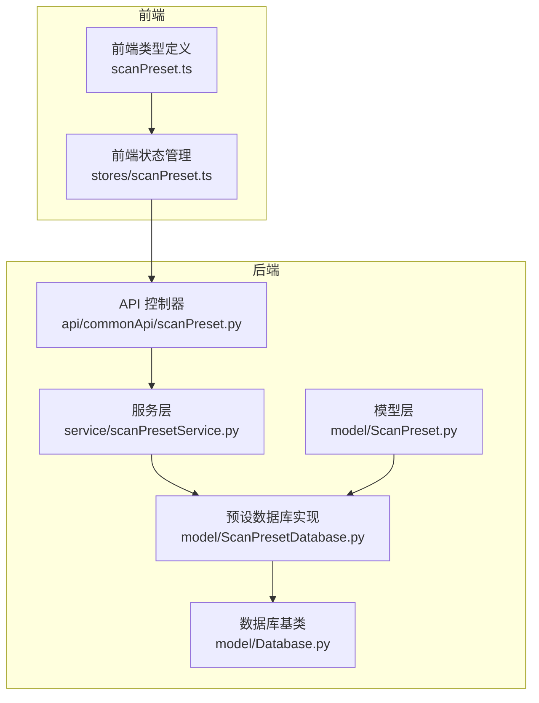
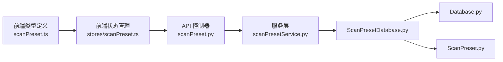
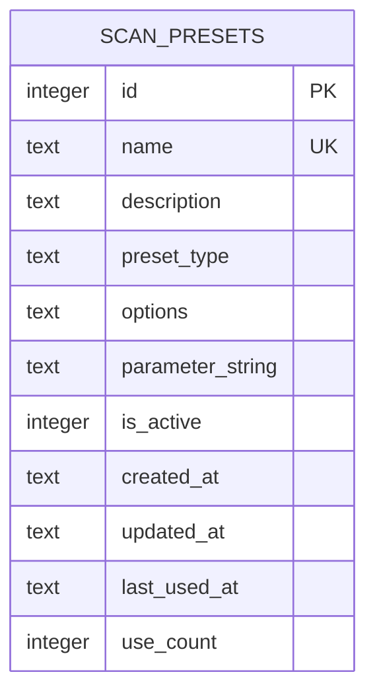
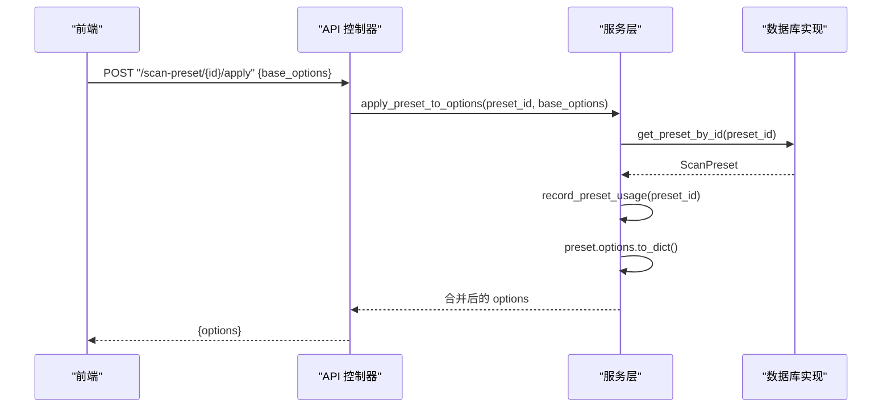
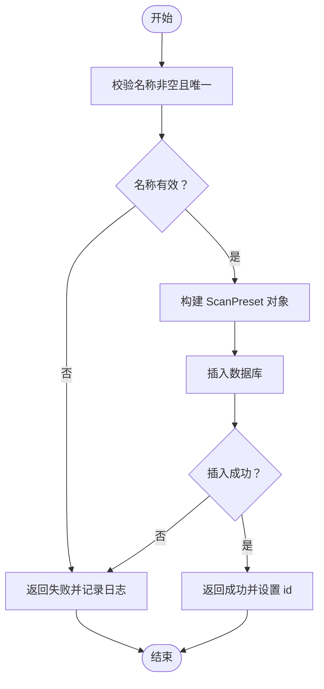

# 数据模型设计

<cite>
**本文引用的文件**
- [ScanPreset.py](file://src/backEnd/model/ScanPreset.py)
- [ScanPresetDatabase.py](file://src/backEnd/model/ScanPresetDatabase.py)
- [Database.py](file://src/backEnd/model/Database.py)
- [scanPreset.py](file://src/backEnd/api/commonApi/scanPreset.py)
- [scanPresetService.py](file://src/backEnd/service/scanPresetService.py)
- [scanPreset.ts](file://src/frontEnd/src/types/scanPreset.ts)
- [scanPreset.ts（Pinia Store）](file://src/frontEnd/src/stores/scanPreset.ts)
</cite>

## 目录
1. [简介](#简介)
2. [项目结构](#项目结构)
3. [核心组件](#核心组件)
4. [架构总览](#架构总览)
5. [详细组件分析](#详细组件分析)
6. [依赖分析](#依赖分析)
7. [性能考虑](#性能考虑)
8. [故障排查指南](#故障排查指南)
9. [结论](#结论)
10. [附录](#附录)

## 简介
本文件围绕 ScanPreset 数据模型及其持久化实现进行系统化文档化，重点覆盖以下方面：
- ScanPreset 类的属性定义、数据类型与业务含义
- ScanPresetDatabase 如何通过 SQLite 实现配置的持久化存储与检索
- 配置序列化与反序列化的机制（JSON 格式转换规则与数据完整性保障）
- 数据库表结构设计（主键、索引、约束）
- 数据验证规则与异常处理策略
- 多用户环境下的一致性保障机制

## 项目结构
该功能涉及后端模型层、服务层、API 层与前端类型/状态管理，整体采用分层架构：
- 模型层：定义数据模型与序列化规则
- 服务层：封装业务逻辑与跨表操作
- 数据库层：继承通用 SQLite 基类，提供线程安全与并发控制
- API 层：暴露 REST 接口，统一响应格式
- 前端：类型定义与 Pinia 状态管理，负责 UI 交互与默认值合并

图表来源
- [scanPreset.py](file://src/backEnd/api/commonApi/scanPreset.py#L1-L325)
- [scanPresetService.py](file://src/backEnd/service/scanPresetService.py#L1-L182)
- [ScanPreset.py](file://src/backEnd/model/ScanPreset.py#L1-L231)
- [ScanPresetDatabase.py](file://src/backEnd/model/ScanPresetDatabase.py#L1-L514)
- [Database.py](file://src/backEnd/model/Database.py#L1-L99)
- [scanPreset.ts](file://src/frontEnd/src/types/scanPreset.ts#L1-L199)
- [scanPreset.ts（Pinia Store）](file://src/frontEnd/src/stores/scanPreset.ts#L1-L296)

章节来源
- [scanPreset.py](file://src/backEnd/api/commonApi/scanPreset.py#L1-L325)
- [scanPresetService.py](file://src/backEnd/service/scanPresetService.py#L1-L182)
- [ScanPreset.py](file://src/backEnd/model/ScanPreset.py#L1-L231)
- [ScanPresetDatabase.py](file://src/backEnd/model/ScanPresetDatabase.py#L1-L514)
- [Database.py](file://src/backEnd/model/Database.py#L1-L99)
- [scanPreset.ts](file://src/frontEnd/src/types/scanPreset.ts#L1-L199)
- [scanPreset.ts（Pinia Store）](file://src/frontEnd/src/stores/scanPreset.ts#L1-L296)

## 核心组件
- ScanPreset：后端 Pydantic 模型，定义预设的结构、默认值、校验规则与 JSON 序列化行为
- ScanOptions：嵌套模型，承载扫描参数集合，按功能域分组，含范围校验
- ScanPresetDatabase：SQLite 持久化实现，负责建表、迁移、CRUD、历史记录与使用计数
- ScanPresetService：业务服务，封装名称唯一性、默认配置保护、合并策略等
- API 控制器：FastAPI 路由，统一响应体与错误处理
- 前端类型与状态：TS 类型定义与 Pinia Store，负责默认值合并与 UI 交互

章节来源
- [ScanPreset.py](file://src/backEnd/model/ScanPreset.py#L1-L231)
- [ScanPresetDatabase.py](file://src/backEnd/model/ScanPresetDatabase.py#L1-L514)
- [scanPresetService.py](file://src/backEnd/service/scanPresetService.py#L1-L182)
- [scanPreset.py](file://src/backEnd/api/commonApi/scanPreset.py#L1-L325)
- [scanPreset.ts](file://src/frontEnd/src/types/scanPreset.ts#L1-L199)
- [scanPreset.ts（Pinia Store）](file://src/frontEnd/src/stores/scanPreset.ts#L1-L296)

## 架构总览
后端采用“模型-服务-数据库-API”的分层设计，前端通过类型与状态管理与后端交互。默认配置、常用配置与历史配置三类预设通过枚举区分，并在数据库中以列值标识。

```mermaid
classDiagram
class ScanOptions {
+level : int
+risk : int
+string : Optional[str]
+notString : Optional[str]
+regexp : Optional[str]
+code : Optional[int]
+smart : bool
+textOnly : bool
+titles : bool
+testParameter : Optional[str]
+skip : Optional[str]
+skipStatic : bool
+paramExclude : Optional[str]
+dbms : Optional[str]
+os : Optional[str]
+prefix : Optional[str]
+suffix : Optional[str]
+tamper : Optional[str]
+technique : str
+timeSec : int
+timeout : int
+retries : int
+delay : float
+randomAgent : bool
+proxy : Optional[str]
+tor : bool
+optimize : bool
+predictOutput : bool
+keepAlive : bool
+nullConnection : bool
+threads : int
+getBanner : bool
+getCurrentUser : bool
+getCurrentDb : bool
+getHostname : bool
+isDba : bool
+getUsers : bool
+getPasswordHashes : bool
+getPrivileges : bool
+getRoles : bool
+getDbs : bool
+getTables : bool
+getColumns : bool
+dumpTable : bool
+dumpAll : bool
+db : Optional[str]
+tbl : Optional[str]
+col : Optional[str]
+batch : bool
+forms : bool
+crawlDepth : int
+flushSession : bool
+freshQueries : bool
+verbose : int
+to_dict() Dict
+to_full_dict() Dict
}
class ScanPreset {
+id : Optional[int]
+name : str
+description : Optional[str]
+preset_type : PresetType
+options : ScanOptions
+parameter_string : Optional[str]
+is_active : bool
+created_at : Optional[datetime]
+updated_at : Optional[datetime]
+last_used_at : Optional[datetime]
+use_count : int
+model_dump() Dict
}
class ScanPresetDatabase {
+init()
+create_preset(data)
+get_preset_by_id(id)
+get_preset_by_name(name)
+get_all_presets(include_inactive)
+get_presets_by_type(type, include_inactive)
+get_default_preset()
+get_history_presets(limit)
+update_preset(id, data)
+delete_preset(id)
+record_preset_usage(id)
+add_to_history(name, options, max_history)
}
class ScanPresetService {
+get_all_presets(include_inactive)
+get_preset_configs()
+get_history_configs(limit)
+get_default_preset()
+get_preset_by_id(id)
+create_preset(data)
+update_preset(id, data)
+delete_preset(id)
+update_default_preset(options)
+record_preset_usage(id)
+add_to_history(name, options)
+get_all_config_options()
+apply_preset_to_options(preset_id, base_options)
}
ScanPreset --> ScanOptions : "包含"
ScanPresetDatabase --> ScanPreset : "读写"
ScanPresetService --> ScanPresetDatabase : "委托"
ScanPresetService --> ScanPreset : "业务组合"
```

图表来源
- [ScanPreset.py](file://src/backEnd/model/ScanPreset.py#L1-L231)
- [ScanPresetDatabase.py](file://src/backEnd/model/ScanPresetDatabase.py#L1-L514)
- [scanPresetService.py](file://src/backEnd/service/scanPresetService.py#L1-L182)

## 详细组件分析

### ScanPreset 类与 ScanOptions 模型
- 属性与数据类型
  - id：整数，可空，作为主键
  - name：字符串，必填，长度限制
  - description：字符串，可空
  - preset_type：枚举，取值 default/preset/history
  - options：ScanOptions 对象，包含大量扫描参数
  - parameter_string：字符串，可空，用于与 BurpSuite 兼容的命令行参数串
  - is_active：布尔，是否启用
  - created_at/updated_at/last_used_at：日期时间，可空
  - use_count：整数，使用计数
- JSON 序列化
  - model_config 中启用 use_enum_values，并自定义 datetime 编码为 ISO 字符串
  - model_dump 覆盖实现，确保 datetime 字段被正确序列化
- ScanOptions 分组与校验
  - 按 Detection/Injection/Techniques/Request/Optimization/Enumeration/General 分组
  - 大量字段带有范围校验（如 level/risk/threads/timeout 等）
  - 提供 to_dict 与 to_full_dict，前者仅输出非默认值，后者输出完整字典

章节来源
- [ScanPreset.py](file://src/backEnd/model/ScanPreset.py#L1-L231)

### ScanPresetDatabase：SQLite 持久化实现
- 单例与初始化
  - 使用 __new__ 实现单例，init() 负责建表、索引与默认预设初始化
  - 默认数据库路径位于项目目录下的 scan_presets.db
- 表结构与约束
  - 主键：id（自增）
  - 唯一约束：name（UNIQUE）
  - 默认值：preset_type 默认 "preset"，options 默认 "{}"，is_active 默认 1，use_count 默认 0
  - 新增列迁移：parameter_string 列通过迁移函数动态添加
- 索引
  - idx_scan_presets_type/preset_type
  - idx_scan_presets_active/is_active
  - idx_scan_presets_name/name
- CRUD 与业务方法
  - create_preset：校验 options 后插入，返回自增 id
  - get_preset_by_id/name/type：按条件查询，行转对象
  - update_preset：按需拼接更新字段，支持选项、名称、启用状态与参数串
  - delete_preset：禁止删除默认配置
  - record_preset_usage：使用计数+1，last_used_at 更新
  - add_to_history：若同名历史存在则更新，否则新建；随后清理超出上限的历史记录
  - _row_to_preset：从数据库行安全还原 ScanPreset，包含类型与时间字段的容错处理
- 并发与一致性
  - 继承自 Database，内部使用线程锁与重试机制，避免数据库锁定导致的失败
  - SELECT/UPDATE/DELETE 均受锁保护，保证同一时刻只有一个线程访问

章节来源
- [ScanPresetDatabase.py](file://src/backEnd/model/ScanPresetDatabase.py#L1-L514)
- [Database.py](file://src/backEnd/model/Database.py#L1-L99)

### API 与服务层
- API 控制器
  - 提供列表、默认配置、常用配置、历史配置、按 ID 查询、创建、更新、删除、添加到历史、应用预设等接口
  - 统一响应体 BaseResponseMsg，错误时抛出 HTTP 异常
- 服务层
  - 名称唯一性校验、默认配置保护（不可删除、名称不可变更）
  - 合并策略：apply_preset_to_options 将预设选项与基础选项合并，记录使用
  - 历史记录上限：默认保留最近使用的若干条历史

章节来源
- [scanPreset.py](file://src/backEnd/api/commonApi/scanPreset.py#L1-L325)
- [scanPresetService.py](file://src/backEnd/service/scanPresetService.py#L1-L182)

### 前端集成
- 类型定义
  - PresetType、ScanOptions、ScanPreset、ScanPresetCreate、ScanPresetUpdate、ScanPresetListResponse
  - 默认选项 DEFAULT_SCAN_OPTIONS，DBMS/技术/等级/风险等下拉选项
- 状态管理
  - 加载配置选项、加载所有预设、选择预设并应用、更新当前选项、重置为默认、更新默认配置、创建/更新/删除预设、保存当前为新预设、添加到历史
  - getEffectiveOptions：过滤掉默认值，生成提交任务的有效选项

章节来源
- [scanPreset.ts](file://src/frontEnd/src/types/scanPreset.ts#L1-L199)
- [scanPreset.ts（Pinia Store）](file://src/frontEnd/src/stores/scanPreset.ts#L1-L296)

## 依赖分析
- 模块耦合
  - API 控制器依赖服务层
  - 服务层依赖数据库实现
  - 数据库实现依赖模型层（序列化/反序列化）
  - 前端类型与状态管理独立于后端，通过 API 交互
- 外部依赖
  - SQLite（内置）
  - Pydantic（数据模型与校验）
  - FastAPI（API 框架）

图表来源
- [scanPreset.py](file://src/backEnd/api/commonApi/scanPreset.py#L1-L325)
- [scanPresetService.py](file://src/backEnd/service/scanPresetService.py#L1-L182)
- [ScanPresetDatabase.py](file://src/backEnd/model/ScanPresetDatabase.py#L1-L514)
- [Database.py](file://src/backEnd/model/Database.py#L1-L99)
- [ScanPreset.py](file://src/backEnd/model/ScanPreset.py#L1-L231)
- [scanPreset.ts](file://src/frontEnd/src/types/scanPreset.ts#L1-L199)
- [scanPreset.ts（Pinia Store）](file://src/frontEnd/src/stores/scanPreset.ts#L1-L296)

## 性能考虑
- 索引设计
  - 为 preset_type、is_active、name 建立索引，提升查询效率
- 序列化策略
  - 选项仅序列化非默认值，减少存储体积与网络传输
- 并发控制
  - 数据库层使用线程锁与重试，避免锁竞争导致的失败
- 历史记录清理
  - 限制历史数量，定期清理旧记录，避免表膨胀

章节来源
- [ScanPresetDatabase.py](file://src/backEnd/model/ScanPresetDatabase.py#L1-L514)
- [Database.py](file://src/backEnd/model/Database.py#L1-L99)

## 故障排查指南
- 常见问题
  - 创建失败：名称重复或输入为空
  - 更新失败：目标不存在、默认配置名称被保护、新名称冲突
  - 删除失败：尝试删除默认配置
  - 应用失败：预设不存在或数据库异常
- 日志与异常
  - 数据库层捕获异常并记录日志，API 层统一抛出 HTTP 异常
  - 服务层对关键流程进行前置校验，减少无效调用
- 建议
  - 在前端进行基础校验（如名称非空），降低后端压力
  - 使用 getEffectiveOptions 过滤默认值，避免不必要的参数传递

章节来源
- [scanPreset.py](file://src/backEnd/api/commonApi/scanPreset.py#L1-L325)
- [scanPresetService.py](file://src/backEnd/service/scanPresetService.py#L1-L182)
- [ScanPresetDatabase.py](file://src/backEnd/model/ScanPresetDatabase.py#L1-L514)

## 结论
ScanPreset 数据模型通过 Pydantic 提供强类型与校验能力，结合 SQLite 的轻量持久化与线程安全机制，实现了灵活、可扩展的扫描配置管理。前后端通过清晰的类型与 API 边界协作，既保证了数据一致性，也提升了用户体验。建议在生产环境中持续关注历史记录规模与索引维护，以保持长期稳定运行。

## 附录

### 数据库表结构设计图

图表来源
- [ScanPresetDatabase.py](file://src/backEnd/model/ScanPresetDatabase.py#L56-L71)

### 预设类型与用途
- default：系统默认配置，不可删除，可更新选项
- preset：常用配置，用户可自由创建、编辑、删除
- history：历史配置，按使用时间排序，超过上限自动清理

章节来源
- [ScanPreset.py](file://src/backEnd/model/ScanPreset.py#L1-L231)
- [ScanPresetDatabase.py](file://src/backEnd/model/ScanPresetDatabase.py#L1-L514)

### 预设应用与合并流程

图表来源
- [scanPreset.py](file://src/backEnd/api/commonApi/scanPreset.py#L300-L325)
- [scanPresetService.py](file://src/backEnd/service/scanPresetService.py#L156-L178)
- [ScanPresetDatabase.py](file://src/backEnd/model/ScanPresetDatabase.py#L183-L216)

### 数据验证与异常处理流程

图表来源
- [scanPresetService.py](file://src/backEnd/service/scanPresetService.py#L67-L81)
- [ScanPresetDatabase.py](file://src/backEnd/model/ScanPresetDatabase.py#L156-L181)