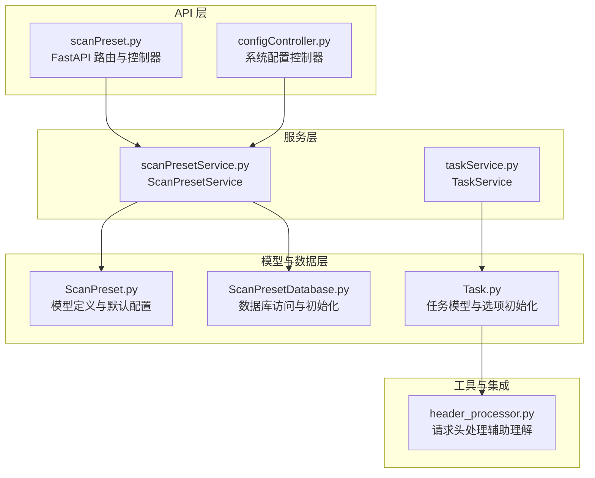
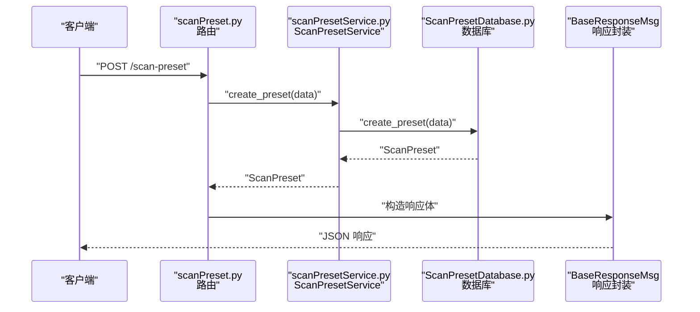
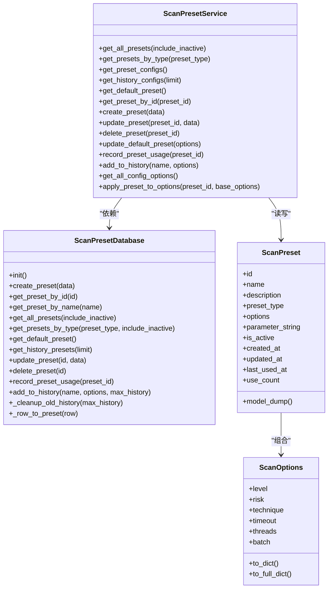
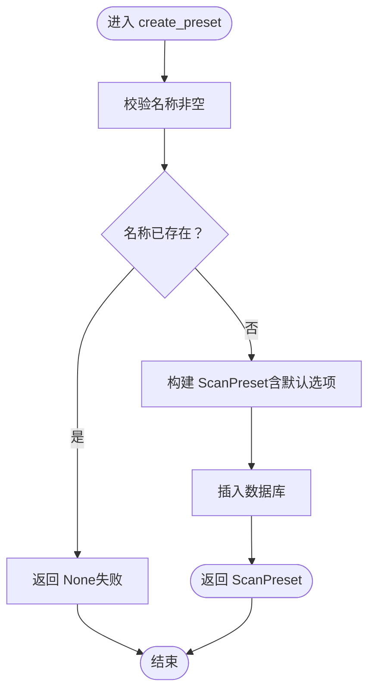
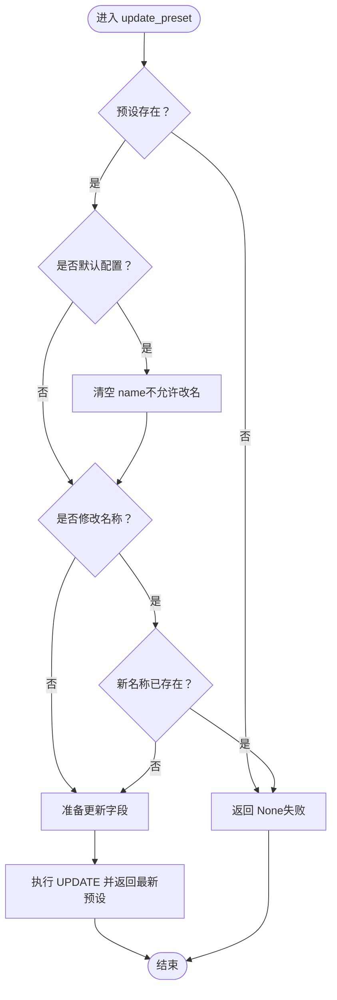
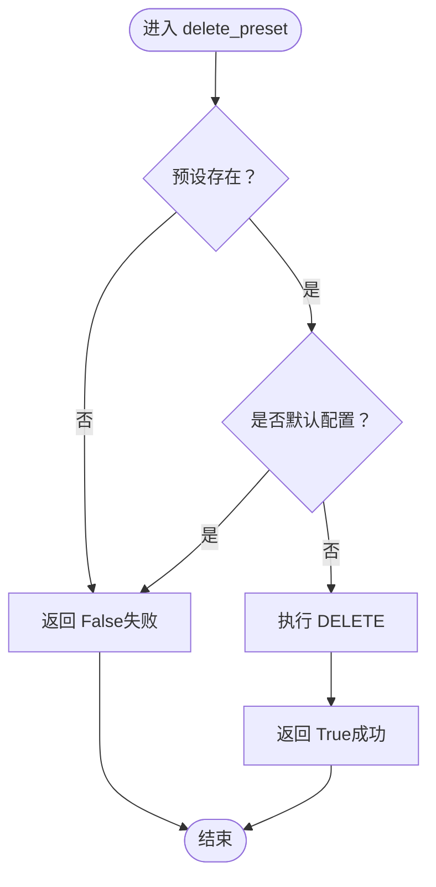
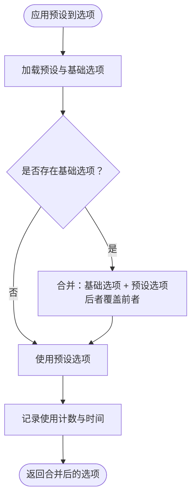
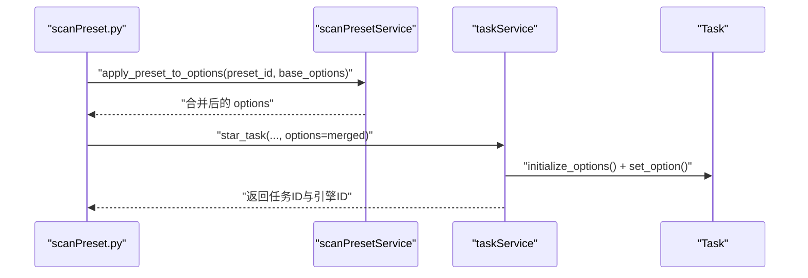
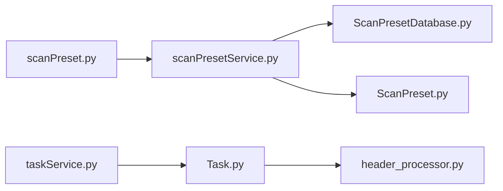

# 服务层实现

<cite>
**本文引用的文件**
- [scanPreset.py](file://src/backEnd/api/commonApi/scanPreset.py)
- [scanPresetService.py](file://src/backEnd/service/scanPresetService.py)
- [ScanPreset.py](file://src/backEnd/model/ScanPreset.py)
- [ScanPresetDatabase.py](file://src/backEnd/model/ScanPresetDatabase.py)
- [taskService.py](file://src/backEnd/service/taskService.py)
- [Task.py](file://src/backEnd/model/Task.py)
- [configController.py](file://src/backEnd/api/commonApi/configController.py)
- [header_processor.py](file://src/backEnd/utils/header_processor.py)
</cite>

## 目录
1. [简介](#简介)
2. [项目结构](#项目结构)
3. [核心组件](#核心组件)
4. [架构总览](#架构总览)
5. [详细组件分析](#详细组件分析)
6. [依赖关系分析](#依赖关系分析)
7. [性能考量](#性能考量)
8. [故障排查指南](#故障排查指南)
9. [结论](#结论)

## 简介
本文件聚焦于后端服务层中的“扫描配置预设”模块，系统性梳理其CRUD实现、默认值处理、版本控制策略、删除依赖检查、与API控制器的交互、HTTP请求/响应转换、配置冲突检测与解决、批量操作事务管理、与其他模块（尤其是任务服务）的集成方式、配置复用时的参数继承与覆盖规则，以及性能优化（缓存与查询优化）。文档以代码为依据，通过图示与分层讲解帮助读者快速理解与落地。

## 项目结构
后端采用“API 控制器 → 服务层 → 数据模型/数据库”的分层设计。扫描配置预设模块位于 service 层，数据持久化由 model 层的数据库类负责；API 控制器负责接收请求、转换响应，并调用服务层进行业务处理。

图表来源
- [scanPreset.py](file://src/backEnd/api/commonApi/scanPreset.py#L1-L325)
- [scanPresetService.py](file://src/backEnd/service/scanPresetService.py#L1-L182)
- [ScanPreset.py](file://src/backEnd/model/ScanPreset.py#L1-L231)
- [ScanPresetDatabase.py](file://src/backEnd/model/ScanPresetDatabase.py#L1-L514)
- [taskService.py](file://src/backEnd/service/taskService.py#L1-L535)
- [Task.py](file://src/backEnd/model/Task.py#L1-L333)
- [header_processor.py](file://src/backEnd/utils/header_processor.py#L1-L292)

章节来源
- [scanPreset.py](file://src/backEnd/api/commonApi/scanPreset.py#L1-L325)
- [scanPresetService.py](file://src/backEnd/service/scanPresetService.py#L1-L182)
- [ScanPreset.py](file://src/backEnd/model/ScanPreset.py#L1-L231)
- [ScanPresetDatabase.py](file://src/backEnd/model/ScanPresetDatabase.py#L1-L514)
- [taskService.py](file://src/backEnd/service/taskService.py#L1-L535)
- [Task.py](file://src/backEnd/model/Task.py#L1-L333)
- [header_processor.py](file://src/backEnd/utils/header_processor.py#L1-L292)

## 核心组件
- API 控制器：提供预设配置的 CRUD、默认配置读写、历史记录、应用预设到选项等接口，统一返回标准化响应体。
- 服务层：封装业务逻辑，负责校验、冲突检测、默认值处理、版本控制策略、删除依赖检查、历史记录维护、预设应用与使用计数。
- 数据模型：定义预设类型、选项模型、默认预设、创建/更新请求模型、列表响应模型。
- 数据库层：负责表初始化、索引、默认预设初始化、增删改查、历史记录清理、使用计数与时间戳维护。
- 任务服务：与扫描任务生命周期集成，接收服务层提供的选项合并结果，驱动 sqlmap 引擎执行。

章节来源
- [scanPreset.py](file://src/backEnd/api/commonApi/scanPreset.py#L1-L325)
- [scanPresetService.py](file://src/backEnd/service/scanPresetService.py#L1-L182)
- [ScanPreset.py](file://src/backEnd/model/ScanPreset.py#L1-L231)
- [ScanPresetDatabase.py](file://src/backEnd/model/ScanPresetDatabase.py#L1-L514)
- [taskService.py](file://src/backEnd/service/taskService.py#L1-L535)

## 架构总览
服务层通过依赖注入的方式获取数据库实例，API 控制器调用服务层方法，服务层再委托数据库层完成持久化操作。服务层还负责将模型转换为 API 响应所需的数据结构。

图表来源
- [scanPreset.py](file://src/backEnd/api/commonApi/scanPreset.py#L191-L215)
- [scanPresetService.py](file://src/backEnd/service/scanPresetService.py#L67-L81)
- [ScanPresetDatabase.py](file://src/backEnd/model/ScanPresetDatabase.py#L156-L181)

## 详细组件分析

### 服务层类图

图表来源
- [scanPresetService.py](file://src/backEnd/service/scanPresetService.py#L1-L182)
- [ScanPresetDatabase.py](file://src/backEnd/model/ScanPresetDatabase.py#L1-L514)
- [ScanPreset.py](file://src/backEnd/model/ScanPreset.py#L1-L231)

章节来源
- [scanPresetService.py](file://src/backEnd/service/scanPresetService.py#L1-L182)
- [ScanPresetDatabase.py](file://src/backEnd/model/ScanPresetDatabase.py#L1-L514)
- [ScanPreset.py](file://src/backEnd/model/ScanPreset.py#L1-L231)

### CRUD 流程与关键逻辑

#### 创建配置（默认值处理）
- 输入校验：名称必填且非空。
- 唯一性检查：按名称去重。
- 默认值处理：若未提供选项，使用默认选项模型；选项序列化为 JSON 存储。
- 返回：创建成功返回预设对象，否则返回空表示失败。

图表来源
- [scanPresetService.py](file://src/backEnd/service/scanPresetService.py#L67-L81)
- [ScanPresetDatabase.py](file://src/backEnd/model/ScanPresetDatabase.py#L156-L181)
- [ScanPreset.py](file://src/backEnd/model/ScanPreset.py#L107-L137)

章节来源
- [scanPresetService.py](file://src/backEnd/service/scanPresetService.py#L67-L81)
- [ScanPresetDatabase.py](file://src/backEnd/model/ScanPresetDatabase.py#L156-L181)
- [ScanPreset.py](file://src/backEnd/model/ScanPreset.py#L107-L137)

#### 更新配置（版本控制与名称冲突）
- 存在性检查：目标预设必须存在。
- 默认配置保护：禁止修改默认配置的名称；仅允许修改选项。
- 名称冲突检测：若修改名称，需保证新名称唯一。
- 选项更新：对传入的选项进行模型重建，序列化后写入。
- 返回：更新成功返回预设对象，否则返回空表示失败。

图表来源
- [scanPresetService.py](file://src/backEnd/service/scanPresetService.py#L82-L105)
- [ScanPresetDatabase.py](file://src/backEnd/model/ScanPresetDatabase.py#L297-L349)

章节来源
- [scanPresetService.py](file://src/backEnd/service/scanPresetService.py#L82-L105)
- [ScanPresetDatabase.py](file://src/backEnd/model/ScanPresetDatabase.py#L297-L349)

#### 删除配置（依赖检查）
- 存在性检查：目标预设必须存在。
- 默认配置保护：禁止删除默认配置。
- 删除执行：删除对应记录。
- 返回：删除成功返回 True，否则返回 False。

图表来源
- [scanPresetService.py](file://src/backEnd/service/scanPresetService.py#L106-L119)
- [ScanPresetDatabase.py](file://src/backEnd/model/ScanPresetDatabase.py#L350-L365)

章节来源
- [scanPresetService.py](file://src/backEnd/service/scanPresetService.py#L106-L119)
- [ScanPresetDatabase.py](file://src/backEnd/model/ScanPresetDatabase.py#L350-L365)

#### 默认配置更新（选项级）
- 获取默认配置。
- 以选项字典形式更新默认配置的选项字段。
- 返回更新后的默认配置。

章节来源
- [scanPresetService.py](file://src/backEnd/service/scanPresetService.py#L121-L129)
- [ScanPresetDatabase.py](file://src/backEnd/model/ScanPresetDatabase.py#L297-L349)

#### 历史记录与使用计数
- 历史记录：若同名历史记录已存在则更新，否则新建；同时记录使用计数与最后使用时间。
- 历史清理：超过上限后清理最旧的历史记录，保留最近使用的若干条。
- 使用计数：每次应用预设或添加到历史都会递增 use_count 并更新 last_used_at。

章节来源
- [scanPresetService.py](file://src/backEnd/service/scanPresetService.py#L130-L137)
- [ScanPresetDatabase.py](file://src/backEnd/model/ScanPresetDatabase.py#L377-L408)
- [ScanPresetDatabase.py](file://src/backEnd/model/ScanPresetDatabase.py#L409-L432)

### API 控制器与 HTTP 请求/响应转换
- 路由定义：提供列表、默认配置、常用配置、历史配置、单个预设、创建、更新、删除、应用预设、添加到历史等接口。
- 请求解析：使用 Pydantic 模型解析请求体，如 ScanPresetCreate、ScanPresetUpdate、请求体中的 base_options。
- 响应封装：统一使用 BaseResponseMsg 包裹数据，包含 success、code、msg、data 字段。
- 错误处理：捕获异常并返回 500；对业务失败场景返回相应状态码与消息。

章节来源
- [scanPreset.py](file://src/backEnd/api/commonApi/scanPreset.py#L23-L325)
- [ScanPreset.py](file://src/backEnd/model/ScanPreset.py#L139-L168)

### 配置冲突检测与解决策略
- 名称冲突：创建/更新时均进行名称唯一性检查，避免重复。
- 默认配置保护：更新时禁止修改默认配置的名称，确保系统稳定性。
- 选项合并：应用预设到选项时，先记录使用，再将预设选项与基础选项进行字典合并；基础选项优先级更高（后者覆盖前者），从而实现“预设作为默认值，用户选项作为覆盖”。

图表来源
- [scanPresetService.py](file://src/backEnd/service/scanPresetService.py#L156-L178)
- [ScanPreset.py](file://src/backEnd/model/ScanPreset.py#L92-L105)

章节来源
- [scanPresetService.py](file://src/backEnd/service/scanPresetService.py#L156-L178)
- [ScanPreset.py](file://src/backEnd/model/ScanPreset.py#L92-L105)

### 批量操作与事务管理
- 当前实现：服务层通过数据库层逐条执行 SQL，未显式开启事务块；删除历史记录时涉及多步查询与删除，但未见显式事务包裹。
- 建议：对于涉及多步写操作的场景（如批量清理历史记录、批量更新），可在数据库层引入上下文事务，确保原子性与一致性。

章节来源
- [ScanPresetDatabase.py](file://src/backEnd/model/ScanPresetDatabase.py#L409-L432)

### 服务层与其他模块的集成

#### 与任务服务的集成
- 任务启动前：服务层将应用预设后的选项合并到任务的选项集中，随后任务服务启动 sqlmap 引擎。
- 任务选项初始化：任务模型在初始化时会根据 sqlmap 的默认配置填充选项，并强制 batch、禁用颜色与 ETA 等参数，确保 API 场景下的稳定性。

图表来源
- [scanPreset.py](file://src/backEnd/api/commonApi/scanPreset.py#L300-L325)
- [scanPresetService.py](file://src/backEnd/service/scanPresetService.py#L156-L178)
- [taskService.py](file://src/backEnd/service/taskService.py#L58-L88)
- [Task.py](file://src/backEnd/model/Task.py#L75-L96)

章节来源
- [scanPreset.py](file://src/backEnd/api/commonApi/scanPreset.py#L300-L325)
- [scanPresetService.py](file://src/backEnd/service/scanPresetService.py#L156-L178)
- [taskService.py](file://src/backEnd/service/taskService.py#L58-L88)
- [Task.py](file://src/backEnd/model/Task.py#L75-L96)

#### 配置复用与参数继承/覆盖规则
- 继承：预设选项作为默认值集合。
- 覆盖：用户提供的基础选项优先级更高，最终以字典合并的结果为准。
- 适用范围：该规则适用于“应用预设到选项”的场景；对于“更新预设”和“创建预设”，仍遵循名称唯一性与默认配置保护等约束。

章节来源
- [scanPresetService.py](file://src/backEnd/service/scanPresetService.py#L156-L178)
- [ScanPreset.py](file://src/backEnd/model/ScanPreset.py#L92-L105)

### 与系统配置控制器的关系
- 系统配置控制器提供临时目录等系统级配置的读写接口，与扫描配置预设无直接耦合，但共同服务于整体系统的运行环境。

章节来源
- [configController.py](file://src/backEnd/api/commonApi/configController.py#L1-L173)

## 依赖关系分析
- 服务层依赖数据库层：通过全局工厂函数获取数据库实例，避免循环依赖。
- API 控制器依赖服务层：所有业务逻辑由服务层承担，控制器仅做参数解析与响应封装。
- 任务服务依赖任务模型：任务模型负责选项初始化与引擎启动，与服务层的选项合并结果配合工作。

图表来源
- [scanPreset.py](file://src/backEnd/api/commonApi/scanPreset.py#L1-L325)
- [scanPresetService.py](file://src/backEnd/service/scanPresetService.py#L1-L182)
- [ScanPresetDatabase.py](file://src/backEnd/model/ScanPresetDatabase.py#L1-L514)
- [ScanPreset.py](file://src/backEnd/model/ScanPreset.py#L1-L231)
- [taskService.py](file://src/backEnd/service/taskService.py#L1-L535)
- [Task.py](file://src/backEnd/model/Task.py#L1-L333)
- [header_processor.py](file://src/backEnd/utils/header_processor.py#L1-L292)

章节来源
- [scanPreset.py](file://src/backEnd/api/commonApi/scanPreset.py#L1-L325)
- [scanPresetService.py](file://src/backEnd/service/scanPresetService.py#L1-L182)
- [ScanPresetDatabase.py](file://src/backEnd/model/ScanPresetDatabase.py#L1-L514)
- [ScanPreset.py](file://src/backEnd/model/ScanPreset.py#L1-L231)
- [taskService.py](file://src/backEnd/service/taskService.py#L1-L535)
- [Task.py](file://src/backEnd/model/Task.py#L1-L333)
- [header_processor.py](file://src/backEnd/utils/header_processor.py#L1-L292)

## 性能考量
- 查询优化
  - 数据库层建立索引：按类型、启用状态、名称建立索引，提升查询效率。
  - 列顺序固定：查询列顺序固定，便于 ORM/映射一致性。
- 序列化与反序列化
  - 选项模型提供 to_dict 与 to_full_dict，仅序列化非默认值，减少存储与传输体积。
- 缓存策略
  - 当前未实现服务层缓存；可在高频读取场景（如获取默认配置、常用配置列表）引入内存缓存，并结合失效策略（如定时刷新、变更触发失效）。
- 历史记录清理
  - 自动清理超出上限的历史记录，避免表膨胀与查询开销增加。

章节来源
- [ScanPresetDatabase.py](file://src/backEnd/model/ScanPresetDatabase.py#L21-L80)
- [ScanPresetDatabase.py](file://src/backEnd/model/ScanPresetDatabase.py#L409-L432)
- [ScanPreset.py](file://src/backEnd/model/ScanPreset.py#L92-L105)

## 故障排查指南
- 创建失败：检查名称是否为空或已存在；确认请求体中的选项是否符合模型定义。
- 更新失败：确认目标预设是否存在；若尝试修改默认配置的名称，会被自动忽略。
- 删除失败：默认配置不可删除；确认目标预设存在。
- 应用预设失败：确认预设ID有效；检查基础选项合并逻辑是否符合预期。
- 历史记录异常：确认历史上限配置与清理逻辑是否按预期执行。

章节来源
- [scanPreset.py](file://src/backEnd/api/commonApi/scanPreset.py#L191-L215)
- [scanPresetService.py](file://src/backEnd/service/scanPresetService.py#L67-L119)
- [ScanPresetDatabase.py](file://src/backEnd/model/ScanPresetDatabase.py#L350-L408)

## 结论
scanPresetService 通过清晰的职责划分与严格的业务约束，实现了扫描配置预设的稳定 CRUD 与应用合并能力。默认配置保护、名称唯一性、历史记录清理与使用计数等机制保障了系统的可用性与可追溯性。建议在未来引入事务管理与服务层缓存，进一步提升批量操作的一致性与查询性能。