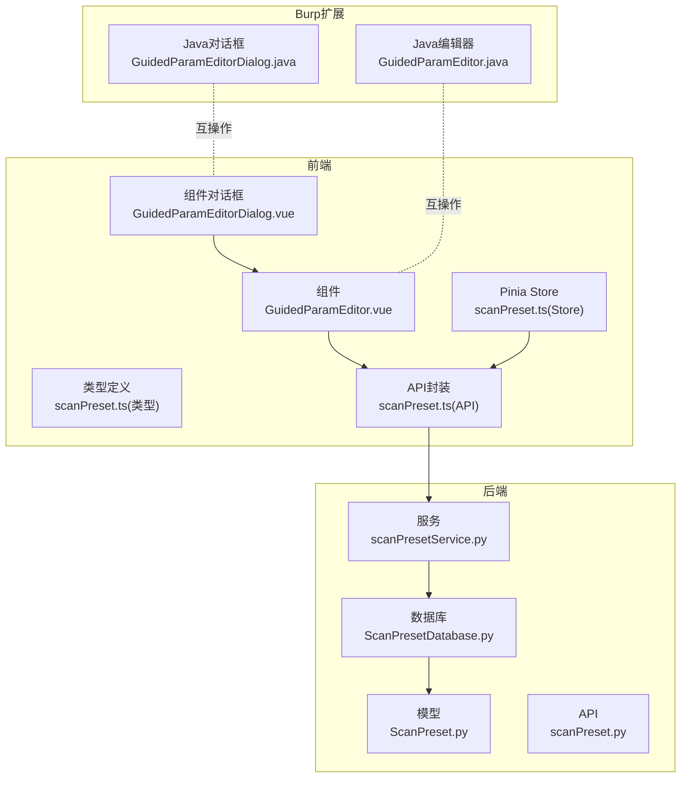
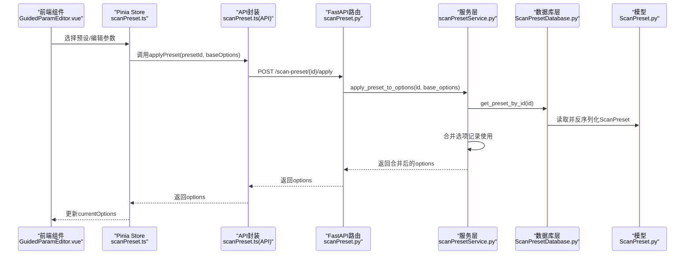
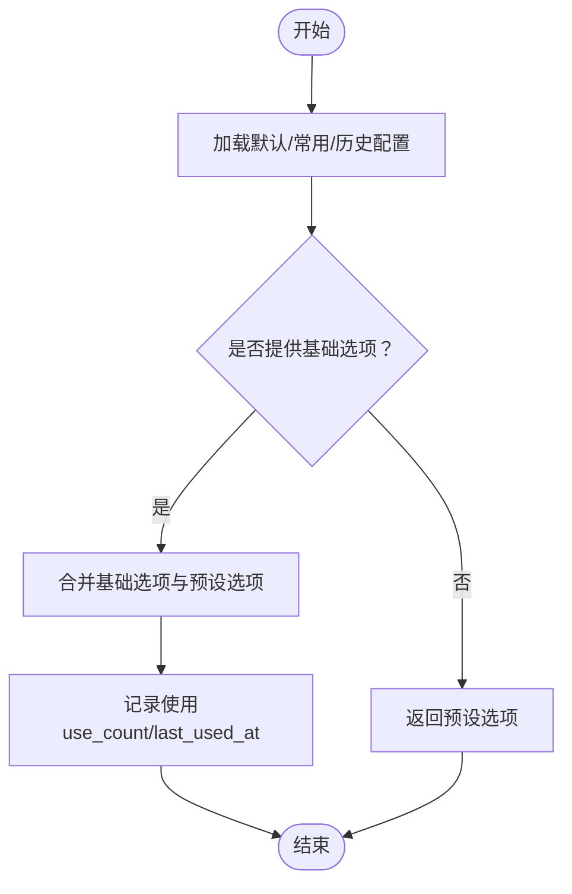
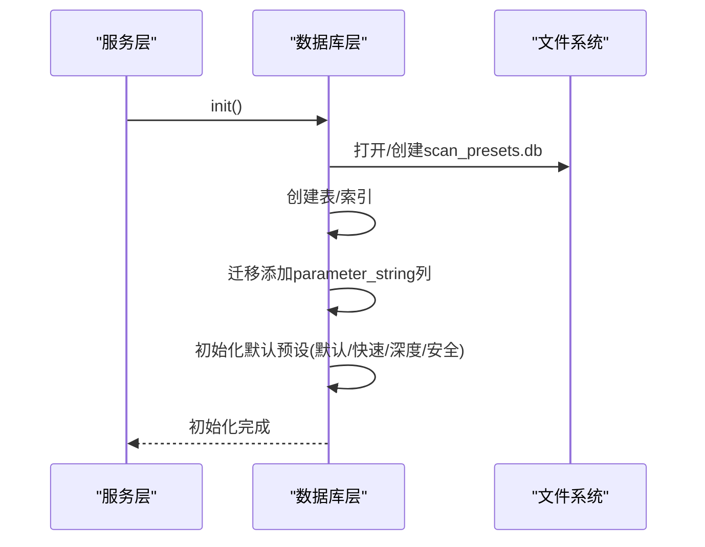
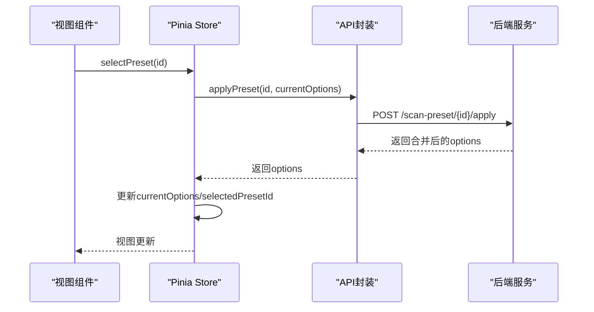
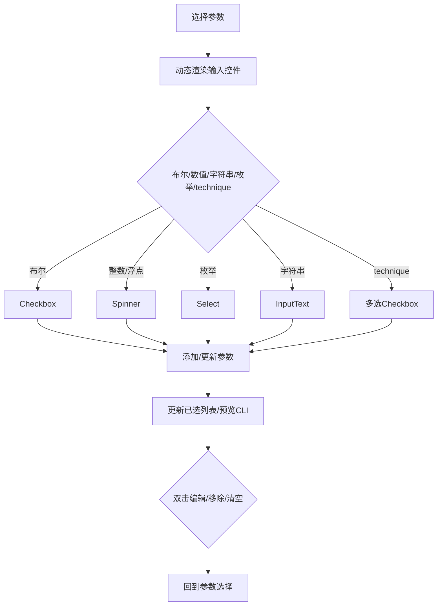
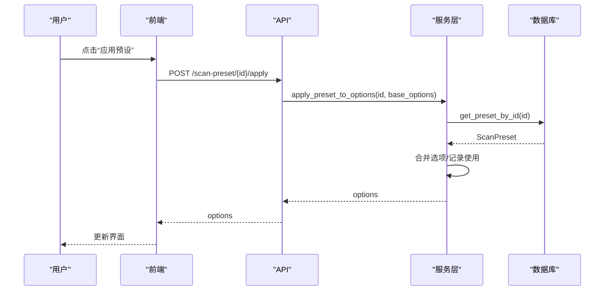

# 扫描配置管理

<cite>
**本文引用的文件**
- [ScanPreset.py](file://src/backEnd/model/ScanPreset.py)
- [scanPresetService.py](file://src/backEnd/service/scanPresetService.py)
- [ScanPresetDatabase.py](file://src/backEnd/model/ScanPresetDatabase.py)
- [scanPreset.py](file://src/backEnd/api/commonApi/scanPreset.py)
- [scanPreset.ts](file://src/frontEnd/src/stores/scanPreset.ts)
- [scanPreset.ts（类型定义）](file://src/frontEnd/src/types/scanPreset.ts)
- [scanPreset.ts（API封装）](file://src/frontEnd/src/api/scanPreset.ts)
- [GuidedParamEditor.vue](file://src/frontEnd/src/components/GuidedParamEditor.vue)
- [GuidedParamEditorDialog.vue](file://src/frontEnd/src/components/GuidedParamEditorDialog.vue)
- [GuidedParamEditor.java](file://src/burpEx/montoya-api/src/main/java/com/sqlmapwebui/burp/panels/GuidedParamEditor.java)
- [GuidedParamEditorDialog.java](file://src/burpEx/montoya-api/src/main/java/com/sqlmapwebui/burp/panels/GuidedParamEditorDialog.java)
</cite>

## 目录
1. [简介](#简介)
2. [项目结构](#项目结构)
3. [核心组件](#核心组件)
4. [架构总览](#架构总览)
5. [详细组件分析](#详细组件分析)
6. [依赖关系分析](#依赖关系分析)
7. [性能考虑](#性能考虑)
8. [故障排查指南](#故障排查指南)
9. [结论](#结论)
10. [附录](#附录)

## 简介
本文件围绕“扫描配置管理”功能进行全面技术文档化，覆盖默认配置、常用配置（ScanPreset）与历史配置的CRUD操作；深入解析ScanPreset数据模型与序列化方式；说明scanPresetService服务层的保存、加载与验证逻辑；描述前端配置管理界面的组件结构与用户交互流程，重点阐述引导式参数编辑器（GuidedParamEditor）的实现原理；解释配置模板的复用机制与版本管理策略，并给出安全扫描参数选择与性能优化的最佳实践建议。

## 项目结构
扫描配置管理涉及后端模型与服务、数据库持久化、API接口以及前后端交互组件：
- 后端
  - 模型：ScanPreset数据模型与枚举、默认/常用/历史预设工厂方法
  - 服务：scanPresetService封装CRUD与应用合并逻辑
  - 数据库：ScanPresetDatabase负责SQLite持久化、迁移与默认预设初始化
  - API：FastAPI路由提供REST接口
- 前端
  - Pinia Store：集中管理默认/常用/历史配置与当前扫描选项
  - 类型定义：统一前后端扫描选项与预设结构
  - API封装：对后端接口的轻量封装
  - 组件：引导式参数编辑器及其对话框，支持Burp兼容参数字符串导入导出
- Burp扩展
  - Java版引导式参数编辑器与对话框，支持命令行参数预览与参数字符串互转



图表来源
- [scanPreset.py](file://src/backEnd/api/commonApi/scanPreset.py#L1-L325)
- [scanPresetService.py](file://src/backEnd/service/scanPresetService.py#L1-L182)
- [ScanPresetDatabase.py](file://src/backEnd/model/ScanPresetDatabase.py#L1-L514)
- [ScanPreset.py](file://src/backEnd/model/ScanPreset.py#L1-L231)
- [scanPreset.ts（API封装）](file://src/frontEnd/src/api/scanPreset.ts#L1-L145)
- [scanPreset.ts（类型定义）](file://src/frontEnd/src/types/scanPreset.ts#L1-L199)
- [scanPreset.ts](file://src/frontEnd/src/stores/scanPreset.ts#L1-L296)
- [GuidedParamEditor.vue](file://src/frontEnd/src/components/GuidedParamEditor.vue#L1-L706)
- [GuidedParamEditorDialog.vue](file://src/frontEnd/src/components/GuidedParamEditorDialog.vue#L1-L190)
- [GuidedParamEditor.java](file://src/burpEx/montoya-api/src/main/java/com/sqlmapwebui/burp/panels/GuidedParamEditor.java#L1-L800)
- [GuidedParamEditorDialog.java](file://src/burpEx/montoya-api/src/main/java/com/sqlmapwebui/burp/panels/GuidedParamEditorDialog.java#L1-L354)

章节来源
- [scanPreset.py](file://src/backEnd/api/commonApi/scanPreset.py#L1-L325)
- [scanPresetService.py](file://src/backEnd/service/scanPresetService.py#L1-L182)
- [ScanPresetDatabase.py](file://src/backEnd/model/ScanPresetDatabase.py#L1-L514)
- [ScanPreset.py](file://src/backEnd/model/ScanPreset.py#L1-L231)
- [scanPreset.ts（API封装）](file://src/frontEnd/src/api/scanPreset.ts#L1-L145)
- [scanPreset.ts（类型定义）](file://src/frontEnd/src/types/scanPreset.ts#L1-L199)
- [scanPreset.ts](file://src/frontEnd/src/stores/scanPreset.ts#L1-L296)
- [GuidedParamEditor.vue](file://src/frontEnd/src/components/GuidedParamEditor.vue#L1-L706)
- [GuidedParamEditorDialog.vue](file://src/frontEnd/src/components/GuidedParamEditorDialog.vue#L1-L190)
- [GuidedParamEditor.java](file://src/burpEx/montoya-api/src/main/java/com/sqlmapwebui/burp/panels/GuidedParamEditor.java#L1-L800)
- [GuidedParamEditorDialog.java](file://src/burpEx/montoya-api/src/main/java/com/sqlmapwebui/burp/panels/GuidedParamEditorDialog.java#L1-L354)

## 核心组件
- 数据模型与序列化
  - ScanOptions：扫描选项字段集合，按类别划分（检测、注入、技术、请求、优化、枚举、通用），提供to_dict与to_full_dict以支持“仅差异”与“完整”两种序列化策略
  - ScanPreset：预设实体，包含名称、描述、类型、选项、参数字符串、启用状态、时间戳与使用计数
  - 预设工厂：默认配置、快速扫描、深度扫描、安全扫描四类预设
- 服务层
  - ScanPresetService：封装CRUD、默认配置更新、历史记录维护、预设应用合并、使用统计
- 数据库层
  - ScanPresetDatabase：SQLite持久化、表迁移、默认预设初始化、查询与更新、历史记录清理
- 前端Store与API
  - Pinia Store：聚合默认/常用/历史配置，维护当前扫描选项，提供保存为预设、添加到历史、应用预设等操作
  - API封装：对后端接口的轻量封装，便于组件调用
- 引导式参数编辑器
  - Vue组件：参数搜索、分类筛选、动态输入控件、已选参数列表、命令行预览
  - 对话框：封装名称/描述输入与参数编辑，支持确认/取消
  - Java组件：与Burp集成，支持参数字符串导入导出与CLI预览

章节来源
- [ScanPreset.py](file://src/backEnd/model/ScanPreset.py#L1-L231)
- [scanPresetService.py](file://src/backEnd/service/scanPresetService.py#L1-L182)
- [ScanPresetDatabase.py](file://src/backEnd/model/ScanPresetDatabase.py#L1-L514)
- [scanPreset.ts](file://src/frontEnd/src/stores/scanPreset.ts#L1-L296)
- [scanPreset.ts（API封装）](file://src/frontEnd/src/api/scanPreset.ts#L1-L145)
- [GuidedParamEditor.vue](file://src/frontEnd/src/components/GuidedParamEditor.vue#L1-L706)
- [GuidedParamEditorDialog.vue](file://src/frontEnd/src/components/GuidedParamEditorDialog.vue#L1-L190)
- [GuidedParamEditor.java](file://src/burpEx/montoya-api/src/main/java/com/sqlmapwebui/burp/panels/GuidedParamEditor.java#L1-L800)
- [GuidedParamEditorDialog.java](file://src/burpEx/montoya-api/src/main/java/com/sqlmapwebui/burp/panels/GuidedParamEditorDialog.java#L1-L354)

## 架构总览
后端采用“模型-服务-数据库-API”的分层设计，前端通过Store与API封装对接后端，组件负责用户交互与参数字符串生成。Burp扩展提供与Web UI一致的参数编辑体验，二者通过参数字符串互通。



图表来源
- [GuidedParamEditor.vue](file://src/frontEnd/src/components/GuidedParamEditor.vue#L1-L706)
- [scanPreset.ts](file://src/frontEnd/src/stores/scanPreset.ts#L1-L296)
- [scanPreset.ts（API封装）](file://src/frontEnd/src/api/scanPreset.ts#L1-L145)
- [scanPreset.py](file://src/backEnd/api/commonApi/scanPreset.py#L270-L325)
- [scanPresetService.py](file://src/backEnd/service/scanPresetService.py#L156-L178)
- [ScanPresetDatabase.py](file://src/backEnd/model/ScanPresetDatabase.py#L183-L216)
- [ScanPreset.py](file://src/backEnd/model/ScanPreset.py#L107-L137)

## 详细组件分析

### 数据模型与序列化（ScanPreset）
- 预设类型
  - DEFAULT：系统默认配置，不可删除，仅允许更新选项
  - PRESET：常用配置，可增删改查
  - HISTORY：历史配置，按最近使用排序，超过阈值自动清理
- ScanOptions
  - 字段按类别组织，提供to_dict与to_full_dict
  - to_dict仅保留非默认值，便于最小化存储与传输
  - to_full_dict保留全部字段，便于完整回显
- 预设工厂
  - 默认配置：空选项或最小化选项
  - 快速扫描：低级别/低风险/基础技术
  - 深度扫描：高级别/高风险/全技术
  - 安全扫描：低风险/带延迟/谨慎技术
- 日期序列化
  - 自定义model_dump将datetime字段转为ISO字符串，保证前后端一致性

```mermaid
classDiagram
class PresetType {
<<enum>>
"default"
"preset"
"history"
}
class ScanOptions {
+level : int
+risk : int
+string : str
+notString : str
+regexp : str
+code : int
+smart : bool
+textOnly : bool
+titles : bool
+testParameter : str
+skip : str
+skipStatic : bool
+paramExclude : str
+dbms : str
+os : str
+prefix : str
+suffix : str
+tamper : str
+technique : str
+timeSec : int
+timeout : int
+retries : int
+delay : float
+randomAgent : bool
+proxy : str
+tor : bool
+optimize : bool
+predictOutput : bool
+keepAlive : bool
+nullConnection : bool
+threads : int
+getBanner : bool
+getCurrentUser : bool
+getCurrentDb : bool
+getHostname : bool
+isDba : bool
+getUsers : bool
+getPasswordHashes : bool
+getPrivileges : bool
+getRoles : bool
+getDbs : bool
+getTables : bool
+getColumns : bool
+dumpTable : bool
+dumpAll : bool
+db : str
+tbl : str
+col : str
+batch : bool
+forms : bool
+crawlDepth : int
+flushSession : bool
+freshQueries : bool
+verbose : int
+to_dict()
+to_full_dict()
}
class ScanPreset {
+id : int
+name : str
+description : str
+preset_type : PresetType
+options : ScanOptions
+parameter_string : str
+is_active : bool
+created_at : datetime
+updated_at : datetime
+last_used_at : datetime
+use_count : int
+model_dump()
}
class ScanPresetCreate {
+name : str
+description : str
+preset_type : PresetType
+options : dict
+parameter_string : str
}
class ScanPresetUpdate {
+name : str
+description : str
+options : dict
+parameter_string : str
+is_active : bool
}
class ScanPresetListResponse {
+presets : list
+total : int
+default_preset : ScanPreset
}
ScanPreset --> ScanOptions : "包含"
ScanPresetCreate --> ScanOptions : "创建时校验"
ScanPresetUpdate --> ScanOptions : "更新时校验"
```

图表来源
- [ScanPreset.py](file://src/backEnd/model/ScanPreset.py#L1-L231)

章节来源
- [ScanPreset.py](file://src/backEnd/model/ScanPreset.py#L1-L231)

### 服务层（scanPresetService）
- 关键职责
  - CRUD：创建、查询、更新、删除预设；查询默认/常用/历史；查询所有预设
  - 默认配置更新：仅允许更新选项，禁止修改名称
  - 历史记录：添加到历史、记录使用、清理旧历史
  - 预设应用：将预设选项与基础选项合并，返回最终选项
  - 配置聚合：提供“默认/常用/历史”三类配置的聚合视图
- 业务约束
  - 不允许删除默认配置
  - 更新时若修改名称需保证唯一性
  - 记录每次使用，维护use_count与last_used_at



图表来源
- [scanPresetService.py](file://src/backEnd/service/scanPresetService.py#L36-L178)
- [ScanPresetDatabase.py](file://src/backEnd/model/ScanPresetDatabase.py#L366-L376)

章节来源
- [scanPresetService.py](file://src/backEnd/service/scanPresetService.py#L1-L182)
- [ScanPresetDatabase.py](file://src/backEnd/model/ScanPresetDatabase.py#L1-L514)

### 数据库层（ScanPresetDatabase）
- 表结构与迁移
  - 表：scan_presets，含id/name/description/preset_type/options/parameter_string/is_active/时间戳/use_count
  - 迁移：自动添加parameter_string列
- 初始化
  - 若无默认配置，自动创建默认/快速/深度/安全四类预设
- 查询与更新
  - 支持按类型、激活状态、使用次数排序查询
  - 更新时仅更新变更字段，时间戳自动更新
- 历史记录
  - 添加到历史时若同名存在则更新，否则新建
  - 清理超出上限的历史记录，保留最近使用的若干条



图表来源
- [ScanPresetDatabase.py](file://src/backEnd/model/ScanPresetDatabase.py#L54-L127)

章节来源
- [ScanPresetDatabase.py](file://src/backEnd/model/ScanPresetDatabase.py#L1-L514)

### 前端Store与API（scanPreset.ts）
- Store职责
  - 聚合默认/常用/历史配置，生成下拉菜单选项
  - 维护currentOptions，提供选择预设、更新选项、重置为默认、保存为新预设、添加到历史等功能
  - 提供getEffectiveOptions：仅返回与默认值不同的有效选项，确保提交任务时的最小化payload
- API封装
  - 对应后端接口：获取列表、获取默认、更新默认、获取常用、获取历史、按ID获取、创建、更新、删除、添加历史、应用预设



图表来源
- [scanPreset.ts](file://src/frontEnd/src/stores/scanPreset.ts#L1-L296)
- [scanPreset.ts（API封装）](file://src/frontEnd/src/api/scanPreset.ts#L1-L145)
- [scanPreset.py](file://src/backEnd/api/commonApi/scanPreset.py#L270-L325)

章节来源
- [scanPreset.ts](file://src/frontEnd/src/stores/scanPreset.ts#L1-L296)
- [scanPreset.ts（API封装）](file://src/frontEnd/src/api/scanPreset.ts#L1-L145)
- [scanPreset.ts（类型定义）](file://src/frontEnd/src/types/scanPreset.ts#L1-L199)

### 引导式参数编辑器（GuidedParamEditor）
- 功能特性
  - 参数搜索：支持正则、大小写、反转过滤
  - 分类展示：Detection/Injection/Techniques/Request/Optimization/Enumeration/General
  - 动态输入控件：布尔、整数、浮点、下拉、文本；technique特殊多选
  - 已选参数列表：双击编辑、移除、清空
  - 命令行预览：HTML高亮，区分参数名/值/标志位
  - 参数字符串导入导出：支持从CLI字符串解析并回填，或生成CLI字符串
- 交互流程
  - 选择参数 -> 动态渲染输入控件 -> 添加/更新 -> 预览CLI -> 双击编辑 -> 清空
- 与后端协作
  - 前端Store通过API调用后端“应用预设”接口，将预设选项与当前选项合并，得到最终提交任务的options



图表来源
- [GuidedParamEditor.vue](file://src/frontEnd/src/components/GuidedParamEditor.vue#L1-L706)
- [GuidedParamEditorDialog.vue](file://src/frontEnd/src/components/GuidedParamEditorDialog.vue#L1-L190)
- [GuidedParamEditor.java](file://src/burpEx/montoya-api/src/main/java/com/sqlmapwebui/burp/panels/GuidedParamEditor.java#L1-L800)
- [GuidedParamEditorDialog.java](file://src/burpEx/montoya-api/src/main/java/com/sqlmapwebui/burp/panels/GuidedParamEditorDialog.java#L1-L354)

章节来源
- [GuidedParamEditor.vue](file://src/frontEnd/src/components/GuidedParamEditor.vue#L1-L706)
- [GuidedParamEditorDialog.vue](file://src/frontEnd/src/components/GuidedParamEditorDialog.vue#L1-L190)
- [GuidedParamEditor.java](file://src/burpEx/montoya-api/src/main/java/com/sqlmapwebui/burp/panels/GuidedParamEditor.java#L1-L800)
- [GuidedParamEditorDialog.java](file://src/burpEx/montoya-api/src/main/java/com/sqlmapwebui/burp/panels/GuidedParamEditorDialog.java#L1-L354)

### 预设CRUD与应用流程
- CRUD
  - 创建：校验名称唯一性，创建预设并返回
  - 查询：按ID/名称/类型/激活状态查询；支持获取默认/常用/历史
  - 更新：默认配置仅允许更新选项；若修改名称需唯一；其他预设可全量更新
  - 删除：禁止删除默认配置；其他预设可删除
- 应用
  - 选择预设后，调用“应用预设”接口，将预设选项与当前基础选项合并，返回最终选项
  - Store更新currentOptions并记录使用



图表来源
- [scanPreset.py](file://src/backEnd/api/commonApi/scanPreset.py#L270-L325)
- [scanPresetService.py](file://src/backEnd/service/scanPresetService.py#L156-L178)
- [ScanPresetDatabase.py](file://src/backEnd/model/ScanPresetDatabase.py#L183-L216)

章节来源
- [scanPreset.py](file://src/backEnd/api/commonApi/scanPreset.py#L1-L325)
- [scanPresetService.py](file://src/backEnd/service/scanPresetService.py#L1-L182)
- [ScanPresetDatabase.py](file://src/backEnd/model/ScanPresetDatabase.py#L1-L514)

## 依赖关系分析
- 后端
  - API依赖服务层；服务层依赖数据库层；数据库层依赖模型层
- 前端
  - 组件依赖Store；Store依赖API封装；API封装依赖后端接口
- Burp扩展
  - 与前端编辑器共享参数元数据与CLI映射，实现跨平台参数字符串互通


图表来源
- [scanPreset.py](file://src/backEnd/api/commonApi/scanPreset.py#L1-L325)
- [scanPresetService.py](file://src/backEnd/service/scanPresetService.py#L1-L182)
- [ScanPresetDatabase.py](file://src/backEnd/model/ScanPresetDatabase.py#L1-L514)
- [ScanPreset.py](file://src/backEnd/model/ScanPreset.py#L1-L231)
- [GuidedParamEditor.java](file://src/burpEx/montoya-api/src/main/java/com/sqlmapwebui/burp/panels/GuidedParamEditor.java#L1-L800)

章节来源
- [scanPreset.py](file://src/backEnd/api/commonApi/scanPreset.py#L1-L325)
- [scanPresetService.py](file://src/backEnd/service/scanPresetService.py#L1-L182)
- [ScanPresetDatabase.py](file://src/backEnd/model/ScanPresetDatabase.py#L1-L514)
- [ScanPreset.py](file://src/backEnd/model/ScanPreset.py#L1-L231)
- [GuidedParamEditor.java](file://src/burpEx/montoya-api/src/main/java/com/sqlmapwebui/burp/panels/GuidedParamEditor.java#L1-L800)

## 性能考虑
- 存储与序列化
  - 使用to_dict仅存储差异，减少JSON体积与网络传输
  - 日期字段统一ISO格式，避免时区与解析问题
- 查询与索引
  - 表建立索引：按类型、激活状态、名称排序，提升查询效率
- 历史记录清理
  - 限制历史记录数量，定期清理旧记录，控制表规模
- 并发与事务
  - 数据库操作使用事务封装，异常时回滚，保证一致性
- 前端渲染
  - 使用computed缓存过滤结果与命令行预览HTML，减少重复计算

[本节为通用指导，无需列出具体文件来源]

## 故障排查指南
- 默认配置无法删除
  - 现象：删除默认配置返回失败
  - 原因：服务层禁止删除默认配置
  - 处理：仅可更新默认配置的选项
- 名称冲突
  - 现象：创建/更新预设返回失败，提示名称已存在
  - 原因：同名预设已存在
  - 处理：更换唯一名称或删除同名预设
- 预设不存在
  - 现象：按ID查询返回不存在
  - 原因：ID错误或已被删除
  - 处理：检查ID或重新创建
- 历史记录过多
  - 现象：历史列表增长过快
  - 原因：未清理旧历史
  - 处理：确认清理逻辑生效或手动触发清理
- 命令行预览异常
  - 现象：CLI预览不正确或为空
  - 原因：参数字符串解析失败或未选择参数
  - 处理：检查参数字符串格式或重新选择参数

章节来源
- [scanPresetService.py](file://src/backEnd/service/scanPresetService.py#L82-L119)
- [ScanPresetDatabase.py](file://src/backEnd/model/ScanPresetDatabase.py#L350-L408)
- [GuidedParamEditor.vue](file://src/frontEnd/src/components/GuidedParamEditor.vue#L410-L476)

## 结论
扫描配置管理通过清晰的数据模型、稳健的服务层与数据库层、以及直观的前端组件与Burp扩展，实现了默认/常用/历史三类配置的全生命周期管理。其核心优势在于：
- 最小化存储与传输（仅差异序列化）
- 严格的业务约束（默认配置保护、名称唯一性）
- 强大的复用能力（预设应用合并、历史记录复用）
- 跨平台互通（CLI参数字符串）

建议在实际使用中结合业务场景选择合适的预设模板，并通过“应用预设+当前选项”的方式灵活定制扫描参数，同时关注性能与安全平衡。

[本节为总结性内容，无需列出具体文件来源]

## 附录
- 最佳实践建议
  - 安全扫描参数
    - 风险级别：优先选择较低风险级别，配合延迟参数降低探测强度
    - 技术选择：从基础技术开始，逐步扩展到更复杂技术
    - 线程数：从较小值起步，观察目标系统负载再逐步提升
  - 性能优化
    - 使用to_dict仅传递差异，减少网络与存储开销
    - 合理设置超时与重试，避免长时间阻塞
    - 控制并发线程数，避免对目标系统造成过大压力
  - 版本管理
    - 历史配置自动清理，保留最近使用记录
    - 默认配置仅更新选项，不修改名称，确保向后兼容
    - 预设命名规范：清晰标识用途与风险级别，便于团队协作

[本节为通用指导，无需列出具体文件来源]