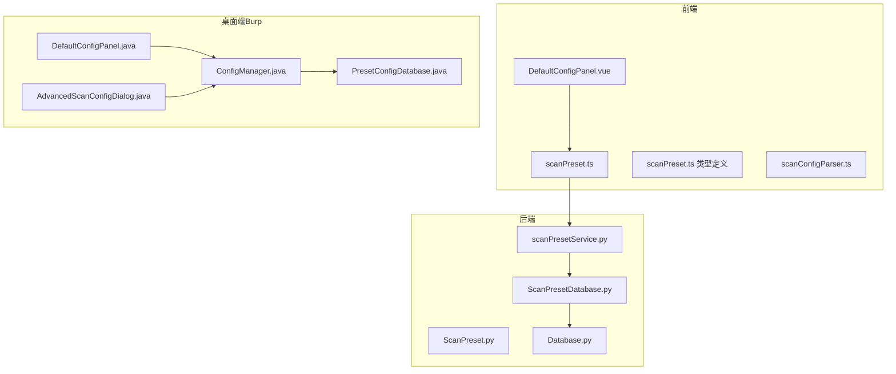
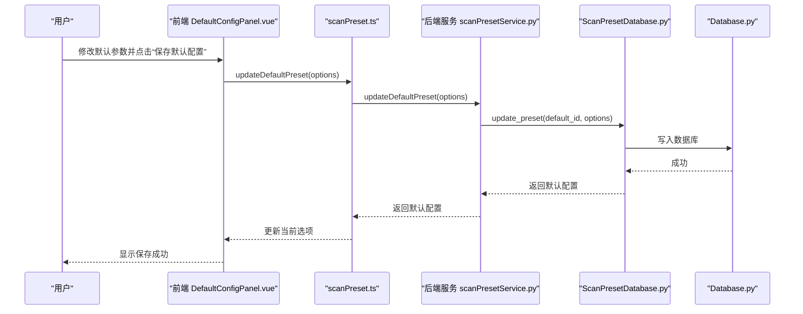
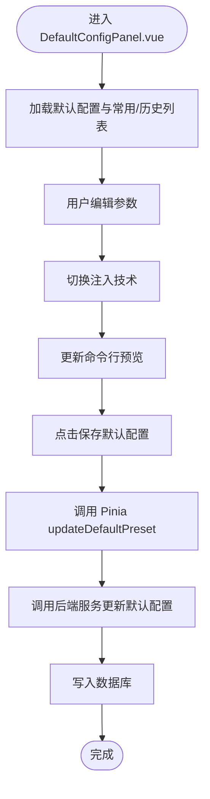
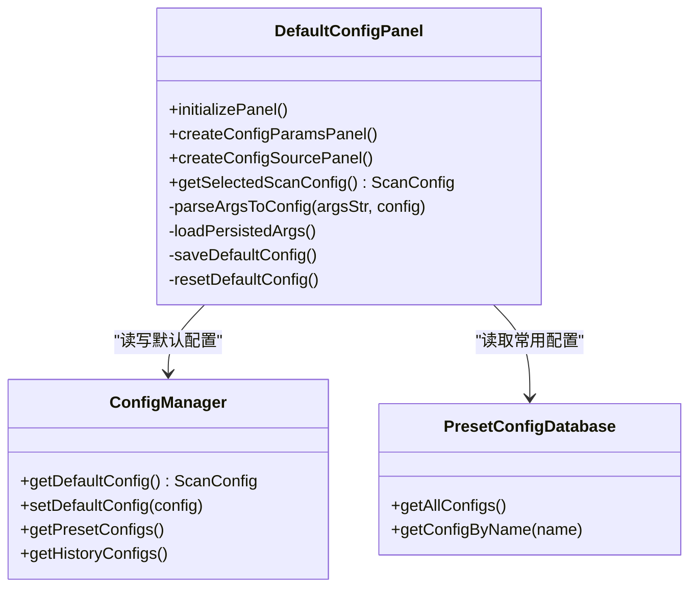
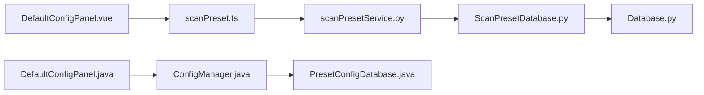

# 默认配置管理

<cite>
**本文引用的文件**
- [DefaultConfigPanel.java（蒙托亚API版）](file://src/burpEx/montoya-api/src/main/java/com/sqlmapwebui/burp/panels/DefaultConfigPanel.java)
- [DefaultConfigPanel.java（Legacy API版）](file://src/burpEx/legacy-api/src/main/java/com/sqlmapwebui/burp/panels/DefaultConfigPanel.java)
- [AdvancedScanConfigDialog.java（蒙托亚API版）](file://src/burpEx/montoya-api/src/main/java/com/sqlmapwebui/burp/dialogs/AdvancedScanConfigDialog.java)
- [ConfigManager.java（蒙托亚API版）](file://src/burpEx/montoya-api/src/main/java/com/sqlmapwebui/burp/ConfigManager.java)
- [PresetConfigDatabase.java（蒙托亚API版）](file://src/burpEx/montoya-api/src/main/java/com/sqlmapwebui/burp/PresetConfigDatabase.java)
- [DefaultConfigPanel.vue（前端Vue组件）](file://src/frontEnd/src/views/Config/components/DefaultConfigPanel.vue)
- [scanPreset.ts（前端Pinia状态）](file://src/frontEnd/src/stores/scanPreset.ts)
- [scanPreset.ts（类型定义）](file://src/frontEnd/src/types/scanPreset.ts)
- [scanConfigParser.ts（参数解析）](file://src/frontEnd/src/utils/scanConfigParser.ts)
- [scanPresetService.py（后端服务）](file://src/backEnd/service/scanPresetService.py)
- [ScanPreset.py（模型定义）](file://src/backEnd/model/ScanPreset.py)
- [ScanPresetDatabase.py（后端数据库）](file://src/backEnd/model/ScanPresetDatabase.py)
- [Database.py（SQLite基类）](file://src/backEnd/model/Database.py)
</cite>

## 目录
1. [简介](#简介)
2. [项目结构](#项目结构)
3. [核心组件](#核心组件)
4. [架构总览](#架构总览)
5. [详细组件分析](#详细组件分析)
6. [依赖关系分析](#依赖关系分析)
7. [性能考量](#性能考量)
8. [故障排查指南](#故障排查指南)
9. [结论](#结论)
10. [附录](#附录)

## 简介
本文件围绕“默认配置管理”主题，系统性阐述 DefaultConfigPanel 组件在桌面端（Burp扩展）与前端（Vue）两套实现中的职责、数据流、持久化策略与加载时机，并明确默认配置与其他配置类型（常用配置、历史配置）的优先级关系。同时，文档覆盖前端表单验证与用户输入处理流程，以及与 sqlmap 核心参数的映射关系，最后给出最佳实践建议与常见问题规避方法。

## 项目结构
默认配置管理涉及三层：
- 前端（Vue）：负责用户交互、参数校验、命令行参数预览与提交。
- 后端（Python）：负责默认配置的持久化、常用/历史配置的管理与合并。
- 桌面端（Java）：负责与 Burp 的集成、默认配置的持久化与加载。

图表来源
- [DefaultConfigPanel.vue（前端Vue组件）](file://src/frontEnd/src/views/Config/components/DefaultConfigPanel.vue#L1-L277)
- [scanPreset.ts（前端Pinia状态）](file://src/frontEnd/src/stores/scanPreset.ts#L1-L296)
- [scanPreset.ts（类型定义）](file://src/frontEnd/src/types/scanPreset.ts#L1-L199)
- [scanConfigParser.ts（参数解析）](file://src/frontEnd/src/utils/scanConfigParser.ts#L217-L267)
- [scanPresetService.py（后端服务）](file://src/backEnd/service/scanPresetService.py#L1-L182)
- [ScanPreset.py（模型定义）](file://src/backEnd/model/ScanPreset.py#L1-L231)
- [ScanPresetDatabase.py（后端数据库）](file://src/backEnd/model/ScanPresetDatabase.py#L1-L514)
- [Database.py（SQLite基类）](file://src/backEnd/model/Database.py#L1-L99)
- [DefaultConfigPanel.java（蒙托亚API版）](file://src/burpEx/montoya-api/src/main/java/com/sqlmapwebui/burp/panels/DefaultConfigPanel.java#L1-L800)
- [AdvancedScanConfigDialog.java（蒙托亚API版）](file://src/burpEx/montoya-api/src/main/java/com/sqlmapwebui/burp/dialogs/AdvancedScanConfigDialog.java#L207-L753)
- [ConfigManager.java（蒙托亚API版）](file://src/burpEx/montoya-api/src/main/java/com/sqlmapwebui/burp/ConfigManager.java#L231-L352)
- [PresetConfigDatabase.java（蒙托亚API版）](file://src/burpEx/montoya-api/src/main/java/com/sqlmapwebui/burp/PresetConfigDatabase.java#L76-L183)

章节来源
- [DefaultConfigPanel.vue（前端Vue组件）](file://src/frontEnd/src/views/Config/components/DefaultConfigPanel.vue#L1-L277)
- [DefaultConfigPanel.java（蒙托亚API版）](file://src/burpEx/montoya-api/src/main/java/com/sqlmapwebui/burp/panels/DefaultConfigPanel.java#L1-L800)

## 核心组件
- 前端 DefaultConfigPanel.vue：提供扫描参数输入、注入技术多选、命令行参数预览、默认配置保存与恢复、常用/历史配置来源选择。
- 前端 Pinia 状态 scanPreset.ts：统一管理默认配置、常用配置、历史配置与当前选项，提供“有效选项”计算与持久化接口。
- 后端 scanPresetService.py：封装默认配置更新、常用/历史配置读写、合并策略与使用统计。
- 后端模型与数据库：ScanPreset.py 定义默认/常用/历史三类配置；ScanPresetDatabase.py 提供SQLite持久化与迁移；Database.py 提供SQLite连接与并发控制。
- 桌面端 DefaultConfigPanel.java：负责桌面端的默认配置面板、参数持久化（Properties 文件）、命令行参数预览与来源选择。
- 桌面端 AdvancedScanConfigDialog.java：在“高级扫描配置”对话框中支持“使用默认配置”快捷切换。
- 桌面端 ConfigManager.java：维护默认配置、常用配置、历史配置集合，并提供持久化写入。
- 桌面端 PresetConfigDatabase.java：管理常用配置的SQLite存储。

章节来源
- [DefaultConfigPanel.vue（前端Vue组件）](file://src/frontEnd/src/views/Config/components/DefaultConfigPanel.vue#L1-L277)
- [scanPreset.ts（前端Pinia状态）](file://src/frontEnd/src/stores/scanPreset.ts#L1-L296)
- [scanPresetService.py（后端服务）](file://src/backEnd/service/scanPresetService.py#L1-L182)
- [ScanPreset.py（模型定义）](file://src/backEnd/model/ScanPreset.py#L1-L231)
- [ScanPresetDatabase.py（后端数据库）](file://src/backEnd/model/ScanPresetDatabase.py#L1-L514)
- [Database.py（SQLite基类）](file://src/backEnd/model/Database.py#L1-L99)
- [DefaultConfigPanel.java（蒙托亚API版）](file://src/burpEx/montoya-api/src/main/java/com/sqlmapwebui/burp/panels/DefaultConfigPanel.java#L1-L800)
- [AdvancedScanConfigDialog.java（蒙托亚API版）](file://src/burpEx/montoya-api/src/main/java/com/sqlmapwebui/burp/dialogs/AdvancedScanConfigDialog.java#L207-L753)
- [ConfigManager.java（蒙托亚API版）](file://src/burpEx/montoya-api/src/main/java/com/sqlmapwebui/burp/ConfigManager.java#L231-L352)
- [PresetConfigDatabase.java（蒙托亚API版）](file://src/burpEx/montoya-api/src/main/java/com/sqlmapwebui/burp/PresetConfigDatabase.java#L76-L183)

## 架构总览
默认配置管理的关键流程：
- 用户在前端或桌面端修改默认扫描参数，点击“保存默认配置”，触发持久化。
- 前端通过 Pinia 状态与后端服务交互，后端将默认配置写入 SQLite 数据库。
- 在任务执行时，系统按“默认配置 > 常用配置 > 历史配置”的优先级合并参数，最终形成实际扫描参数。
- 命令行参数预览用于直观展示即将生效的参数组合。

图表来源
- [DefaultConfigPanel.vue（前端Vue组件）](file://src/frontEnd/src/views/Config/components/DefaultConfigPanel.vue#L250-L266)
- [scanPreset.ts（前端Pinia状态）](file://src/frontEnd/src/stores/scanPreset.ts#L152-L167)
- [scanPresetService.py（后端服务）](file://src/backEnd/service/scanPresetService.py#L121-L129)
- [ScanPresetDatabase.py（后端数据库）](file://src/backEnd/model/ScanPresetDatabase.py#L297-L349)
- [Database.py（SQLite基类）](file://src/backEnd/model/Database.py#L35-L71)

## 详细组件分析

### 前端 DefaultConfigPanel.vue
- 功能要点
  - 扫描参数输入：level、risk、dbms、technique、proxy、forceSSL、batch。
  - 注入技术多选：B/E/U/S/T/Q，支持顺序与去重。
  - 命令行参数预览：实时渲染参数字符串，突出参数名、参数值与标志位。
  - 配置来源选择：默认配置、常用配置、最近历史配置三者择一。
  - 参数持久化开关：控制是否将命令行参数字符串保存到本地配置文件（桌面端）。
  - 保存与重置：保存默认配置并弹窗提示；重置为默认值。
- 数据绑定与事件
  - 使用 v-model 绑定选项，@input/@change 触发 updatePreview。
  - computed 生成命令行预览 HTML，emit('update:options') 向父组件同步。
- 生命周期
  - onMounted 加载配置列表与默认配置，若存在则合并到当前选项。

图表来源
- [DefaultConfigPanel.vue（前端Vue组件）](file://src/frontEnd/src/views/Config/components/DefaultConfigPanel.vue#L1-L277)
- [scanPreset.ts（前端Pinia状态）](file://src/frontEnd/src/stores/scanPreset.ts#L152-L167)
- [scanPresetService.py（后端服务）](file://src/backEnd/service/scanPresetService.py#L121-L129)

章节来源
- [DefaultConfigPanel.vue（前端Vue组件）](file://src/frontEnd/src/views/Config/components/DefaultConfigPanel.vue#L1-L277)
- [scanPreset.ts（前端Pinia状态）](file://src/frontEnd/src/stores/scanPreset.ts#L1-L296)

### 前端 Pinia 状态 scanPreset.ts
- 状态管理
  - defaultPreset、presetConfigs、historyConfigs、currentOptions、selectedPresetId。
  - presetOptions 计算属性：整合默认、常用、历史三类配置，生成下拉菜单选项。
- 关键操作
  - updateDefaultPreset：更新默认配置并回填 currentOptions。
  - getEffectiveOptions：剔除默认值，生成提交任务所需的“有效选项”，并保证 batch=true。
  - loadConfigOptions：从后端获取默认/常用/历史配置。
- 与后端交互
  - 通过 scanPreset API 调用后端服务，实现 CRUD 与合并。

章节来源
- [scanPreset.ts（前端Pinia状态）](file://src/frontEnd/src/stores/scanPreset.ts#L1-L296)

### 后端服务 scanPresetService.py
- 默认配置更新
  - update_default_preset：定位默认预设并更新其 options。
- 配置合并
  - apply_preset_to_options：将指定预设的选项与基础选项合并，记录使用次数。
- 常用/历史配置
  - get_preset_configs、get_history_configs、add_to_history 等。
- 权限与约束
  - 不允许修改默认预设的名称；删除默认预设会被拒绝。

章节来源
- [scanPresetService.py（后端服务）](file://src/backEnd/service/scanPresetService.py#L1-L182)

### 后端模型与数据库
- ScanPreset.py
  - 定义 PresetType（default/preset/history），ScanOptions 字段与 sqlmap 保持一致。
  - 提供 to_dict/to_full_dict，便于序列化与差异比较。
- ScanPresetDatabase.py
  - 初始化表结构与索引，迁移添加 parameter_string 列。
  - 提供 get_default_preset、get_presets_by_type、add_to_history、record_preset_usage 等。
  - _row_to_preset 安全解析数据库行，处理时间字段与 use_count 的类型兼容。
- Database.py
  - SQLite 基类，提供连接、并发锁、执行与只读查询方法，自动重试“locked”。

章节来源
- [ScanPreset.py（模型定义）](file://src/backEnd/model/ScanPreset.py#L1-L231)
- [ScanPresetDatabase.py（后端数据库）](file://src/backEnd/model/ScanPresetDatabase.py#L1-L514)
- [Database.py（SQLite基类）](file://src/backEnd/model/Database.py#L1-L99)

### 桌面端 DefaultConfigPanel.java
- 功能要点
  - 扫描参数输入与注入技术多选；命令行参数预览；参数持久化（Properties 文件）。
  - 配置来源选择：默认配置、常用配置、最近历史配置三者择一。
  - 保存默认配置：写入 ConfigManager，默认持久化到本地配置文件。
- 参数持久化
  - loadPersistedArgs：从 Properties 文件读取持久化开关与命令行参数字符串。
  - savePersistedArgs：保存持久化开关与命令行参数字符串。
- 与常用/历史配置交互
  - getSelectedScanConfig：根据来源选择返回对应 ScanConfig；当使用常用/历史时，解析参数字符串到 ScanConfig。

图表来源
- [DefaultConfigPanel.java（蒙托亚API版）](file://src/burpEx/montoya-api/src/main/java/com/sqlmapwebui/burp/panels/DefaultConfigPanel.java#L1-L800)
- [ConfigManager.java（蒙托亚API版）](file://src/burpEx/montoya-api/src/main/java/com/sqlmapwebui/burp/ConfigManager.java#L231-L352)
- [PresetConfigDatabase.java（蒙托亚API版）](file://src/burpEx/montoya-api/src/main/java/com/sqlmapwebui/burp/PresetConfigDatabase.java#L76-L183)

章节来源
- [DefaultConfigPanel.java（蒙托亚API版）](file://src/burpEx/montoya-api/src/main/java/com/sqlmapwebui/burp/panels/DefaultConfigPanel.java#L1-L800)
- [DefaultConfigPanel.java（Legacy API版）](file://src/burpEx/legacy-api/src/main/java/com/sqlmapwebui/burp/panels/DefaultConfigPanel.java#L1-L800)

### 桌面端 AdvancedScanConfigDialog.java
- 功能要点
  - 支持“使用默认配置”复选框，一键切换到默认配置并预览。
  - 常用配置列表来自 PresetConfigDatabase，支持选择并预览。
  - 根据当前 Tab 返回对应配置：默认配置、引导式编辑器生成的配置、注入点标记 Tab 使用默认配置。

章节来源
- [AdvancedScanConfigDialog.java（蒙托亚API版）](file://src/burpEx/montoya-api/src/main/java/com/sqlmapwebui/burp/dialogs/AdvancedScanConfigDialog.java#L207-L753)

### 前端参数解析 scanConfigParser.ts
- 功能要点
  - 将命令行参数字符串解析为 ScanOptions，支持长参数名、驼峰命名与默认值跳过。
  - 逐项验证类型与默认值，收集解析成功的参数名，记录错误与警告。
- 与默认配置的关系
  - 前端在保存默认配置时，会将当前选项转换为命令行参数字符串，供桌面端持久化与预览使用。

章节来源
- [scanConfigParser.ts（参数解析）](file://src/frontEnd/src/utils/scanConfigParser.ts#L217-L267)

## 依赖关系分析
- 前端到后端
  - DefaultConfigPanel.vue 通过 Pinia 状态与后端服务交互，后端服务再访问数据库层。
- 后端到数据库
  - ScanPresetService 依赖 ScanPresetDatabase，后者继承自 Database，使用 SQLite。
- 桌面端到后端
  - DefaultConfigPanel 依赖 ConfigManager 与 PresetConfigDatabase，ConfigManager 内部持久化默认配置。

图表来源
- [DefaultConfigPanel.vue（前端Vue组件）](file://src/frontEnd/src/views/Config/components/DefaultConfigPanel.vue#L1-L277)
- [scanPreset.ts（前端Pinia状态）](file://src/frontEnd/src/stores/scanPreset.ts#L1-L296)
- [scanPresetService.py（后端服务）](file://src/backEnd/service/scanPresetService.py#L1-L182)
- [ScanPresetDatabase.py（后端数据库）](file://src/backEnd/model/ScanPresetDatabase.py#L1-L514)
- [Database.py（SQLite基类）](file://src/backEnd/model/Database.py#L1-L99)
- [DefaultConfigPanel.java（蒙托亚API版）](file://src/burpEx/montoya-api/src/main/java/com/sqlmapwebui/burp/panels/DefaultConfigPanel.java#L1-L800)
- [ConfigManager.java（蒙托亚API版）](file://src/burpEx/montoya-api/src/main/java/com/sqlmapwebui/burp/ConfigManager.java#L231-L352)
- [PresetConfigDatabase.java（蒙托亚API版）](file://src/burpEx/montoya-api/src/main/java/com/sqlmapwebui/burp/PresetConfigDatabase.java#L76-L183)

## 性能考量
- SQLite 并发
  - Database.py 使用线程锁与重试机制，避免“locked”异常导致的阻塞。
- 查询优化
  - ScanPresetDatabase.py 创建索引（preset_type、is_active、name），提升常用/历史查询效率。
- 参数解析
  - 前端 scanConfigParser.ts 使用 mri 解析，复杂度与参数数量线性相关，建议控制参数字符串长度。
- 预览渲染
  - 前端命令行预览采用 computed 与轻量 DOM 操作，避免频繁重排。

章节来源
- [Database.py（SQLite基类）](file://src/backEnd/model/Database.py#L1-L99)
- [ScanPresetDatabase.py（后端数据库）](file://src/backEnd/model/ScanPresetDatabase.py#L1-L514)
- [scanConfigParser.ts（参数解析）](file://src/frontEnd/src/utils/scanConfigParser.ts#L217-L267)

## 故障排查指南
- 无法保存默认配置
  - 检查后端日志与数据库连接状态；确认 SQLite 文件可写。
  - 前端 Toast 提示保存失败时，查看网络请求与后端异常栈。
- 命令行参数预览为空
  - 确认当前选项与默认值差异；默认值会被忽略，仅显示非默认值。
- 常用/历史配置不可用
  - 检查 PresetConfigDatabase 或 ScanPresetDatabase 中是否存在数据；桌面端需确保 PresetConfigDatabase 初始化完成。
- 参数解析错误
  - 检查命令行参数字符串格式；scanConfigParser.ts 会对无效值产生错误与警告。
- 桌面端持久化失败
  - 检查 Properties 文件路径与权限；确认 loadPersistedArgs 与 savePersistedArgs 流程未抛出异常。

章节来源
- [scanPresetService.py（后端服务）](file://src/backEnd/service/scanPresetService.py#L1-L182)
- [ScanPresetDatabase.py（后端数据库）](file://src/backEnd/model/ScanPresetDatabase.py#L1-L514)
- [DefaultConfigPanel.java（蒙托亚API版）](file://src/burpEx/montoya-api/src/main/java/com/sqlmapwebui/burp/panels/DefaultConfigPanel.java#L772-L800)
- [scanConfigParser.ts（参数解析）](file://src/frontEnd/src/utils/scanConfigParser.ts#L217-L267)

## 结论
默认配置管理通过“前端参数输入与预览 + 后端持久化与合并 + 桌面端持久化与来源选择”的协同，实现了灵活、可追溯且可复用的扫描参数体系。默认配置作为“基线”，与常用配置、历史配置共同构成参数优先级链路，既满足快速复用，又保障了灵活性与安全性。

## 附录

### 默认配置与其他配置类型的优先级关系
- 任务执行时的参数合并顺序（从低优先级到高优先级）：
  1) 默认配置（基线）
  2) 常用配置（用户自定义模板）
  3) 历史配置（最近一次扫描参数）
- 最终生效参数为上述三者的“增量合并”，即历史配置覆盖常用配置，常用配置覆盖默认配置。

章节来源
- [scanPresetService.py（后端服务）](file://src/backEnd/service/scanPresetService.py#L156-L178)
- [DefaultConfigPanel.java（蒙托亚API版）](file://src/burpEx/montoya-api/src/main/java/com/sqlmapwebui/burp/panels/DefaultConfigPanel.java#L510-L534)

### 前端表单验证与用户输入处理
- 输入验证
  - 数值范围：level(1-5)、risk(1-3)、threads(1-10)、delay/timeSec 等。
  - 技术选择：B/E/U/S/T/Q 多选，支持顺序与去重。
  - 代理与DBMS：字符串输入，支持空值。
- 处理流程
  - v-model 实时绑定；@input/@change 触发 updatePreview。
  - getEffectiveOptions 剔除默认值，保证 batch=true，生成提交参数。
- 与 sqlmap 核心参数映射
  - level/risk/dbms/technique/proxy/forceSSL/batch 等字段与 sqlmap 命令行参数一一对应。
  - 前端将当前选项转换为命令行参数字符串，供桌面端持久化与预览。

章节来源
- [DefaultConfigPanel.vue（前端Vue组件）](file://src/frontEnd/src/views/Config/components/DefaultConfigPanel.vue#L1-L277)
- [scanPreset.ts（前端Pinia状态）](file://src/frontEnd/src/stores/scanPreset.ts#L244-L263)
- [scanPreset.ts（类型定义）](file://src/frontEnd/src/types/scanPreset.ts#L1-L199)
- [scanConfigParser.ts（参数解析）](file://src/frontEnd/src/utils/scanConfigParser.ts#L217-L267)

### 默认配置最佳实践
- 安全扫描参数
  - level/risk 建议从 1/1 开始，逐步提升；优先选择低风险技术组合（如 BEU）。
  - 启用 delay 与 keepAlive，降低对目标的影响。
- 性能优化配置
  - threads 控制并发，建议从 1 开始，逐步提升至 3-5。
  - 使用 predictOutput 与 optimize（若后端支持）提升效率。
- 常见错误规避
  - 避免在默认配置中设置过高的 level/risk，导致误报与性能问题。
  - 不要将敏感参数（如 --dbms、--technique）硬编码在默认配置中，优先通过常用配置模板管理。
  - 定期清理历史配置，避免冗余参数干扰。

章节来源
- [ScanPreset.py（模型定义）](file://src/backEnd/model/ScanPreset.py#L1-L231)
- [scanPreset.ts（类型定义）](file://src/frontEnd/src/types/scanPreset.ts#L1-L199)