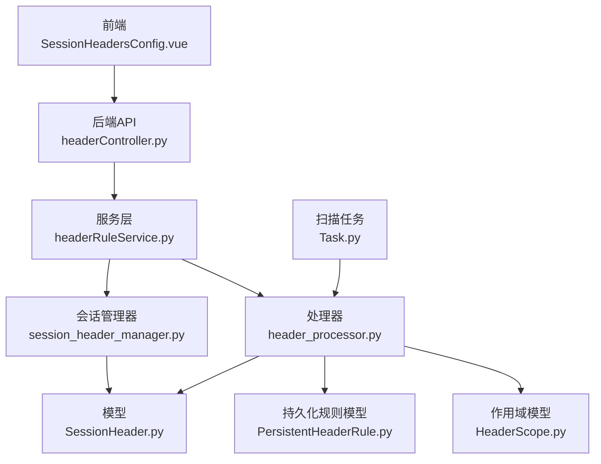
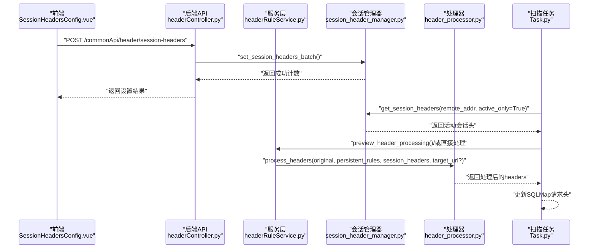
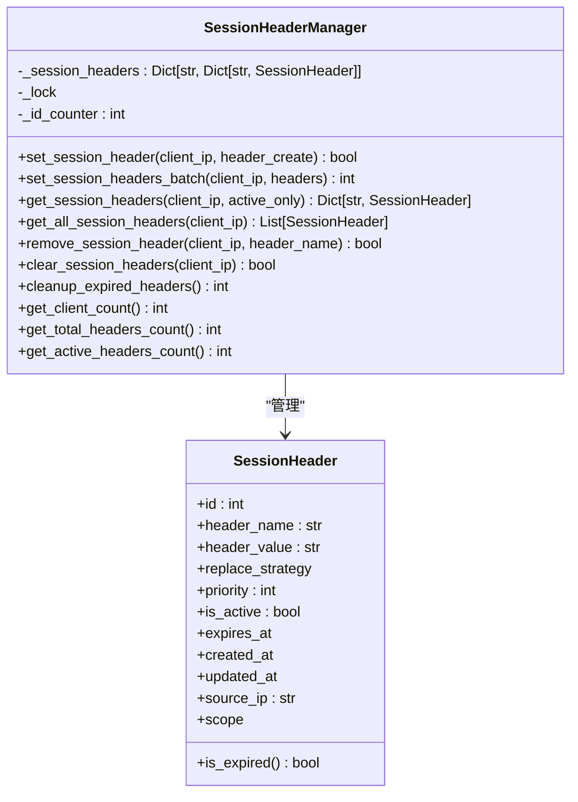
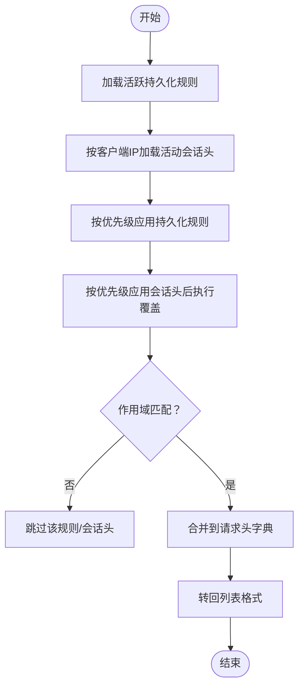
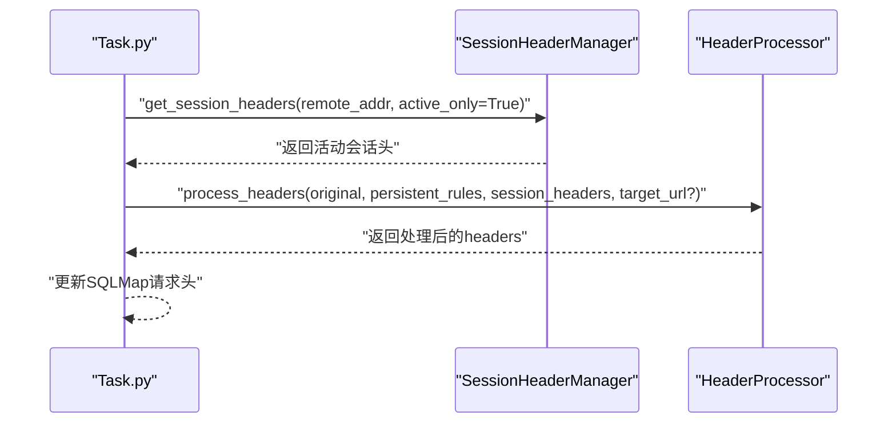
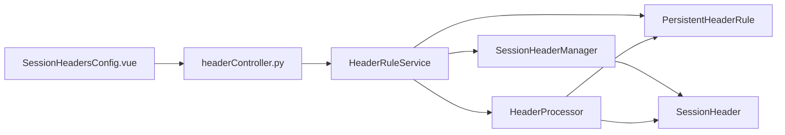

# 会话级规则管理

<cite>
**本文引用的文件**
- [SessionHeader.py](file://src/backEnd/model/SessionHeader.py)
- [headerRuleService.py](file://src/backEnd/service/headerRuleService.py)
- [session_header_manager.py](file://src/backEnd/utils/session_header_manager.py)
- [headerController.py](file://src/backEnd/api/commonApi/headerController.py)
- [headerRule.ts](file://src/frontEnd/src/api/headerRule.ts)
- [SessionHeadersConfig.vue](file://src/frontEnd/src/views/Config/components/SessionHeadersConfig.vue)
- [header_processor.py](file://src/backEnd/utils/header_processor.py)
- [PersistentHeaderRule.py](file://src/backEnd/model/PersistentHeaderRule.py)
- [HeaderScope.py](file://src/backEnd/model/HeaderScope.py)
- [Task.py](file://src/backEnd/model/Task.py)
- [HEADER_CONFIG_COMPLETE_SUMMARY.md](file://doc/HEADER_CONFIG_COMPLETE_SUMMARY.md)
- [HEADER_CONFIG_UI_IMPLEMENTATION.md](file://doc/HEADER_CONFIG_UI_IMPLEMENTATION.md)
- [SCOPE_FEATURE_SUMMARY.md](file://src/backEnd/doc/SCOPE_FEATURE_SUMMARY.md)
</cite>

## 目录
1. [引言](#引言)
2. [项目结构](#项目结构)
3. [核心组件](#核心组件)
4. [架构总览](#架构总览)
5. [详细组件分析](#详细组件分析)
6. [依赖关系分析](#依赖关系分析)
7. [性能考量](#性能考量)
8. [故障排查指南](#故障排查指南)
9. [结论](#结论)
10. [附录](#附录)

## 引言
本文件围绕“会话级规则管理”展开，系统阐述 SessionHeader 模型的设计原理、生命周期管理、与持久化规则的关系与优先级，以及前端 SessionHeadersConfig.vue 的实现方式。文档还解释了会话级规则在扫描任务执行时如何被注入到 HTTP 请求中，并给出典型使用场景、安全注意事项与最佳实践。

## 项目结构
后端采用 FastAPI + Python，前端采用 Vue3 + TypeScript；会话级规则由后端内存管理器维护，前端通过 API 控制台进行动态配置。

图表来源
- [headerController.py](file://src/backEnd/api/commonApi/headerController.py#L1-L120)
- [headerRuleService.py](file://src/backEnd/service/headerRuleService.py#L1-L120)
- [session_header_manager.py](file://src/backEnd/utils/session_header_manager.py#L1-L120)
- [SessionHeader.py](file://src/backEnd/model/SessionHeader.py#L1-L97)
- [header_processor.py](file://src/backEnd/utils/header_processor.py#L1-L120)
- [PersistentHeaderRule.py](file://src/backEnd/model/PersistentHeaderRule.py#L1-L104)
- [HeaderScope.py](file://src/backEnd/model/HeaderScope.py#L1-L187)
- [Task.py](file://src/backEnd/model/Task.py#L134-L157)

章节来源
- [headerController.py](file://src/backEnd/api/commonApi/headerController.py#L1-L120)
- [headerRuleService.py](file://src/backEnd/service/headerRuleService.py#L1-L120)
- [session_header_manager.py](file://src/backEnd/utils/session_header_manager.py#L1-L120)
- [SessionHeader.py](file://src/backEnd/model/SessionHeader.py#L1-L97)
- [header_processor.py](file://src/backEnd/utils/header_processor.py#L1-L120)
- [PersistentHeaderRule.py](file://src/backEnd/model/PersistentHeaderRule.py#L1-L104)
- [HeaderScope.py](file://src/backEnd/model/HeaderScope.py#L1-L187)
- [Task.py](file://src/backEnd/model/Task.py#L134-L157)

## 核心组件
- SessionHeader 模型：定义会话级请求头的字段、替换策略、优先级、有效期、来源 IP、作用域等。
- SessionHeaderManager：内存级管理器，负责会话头的创建、更新、查询、删除、过期清理，同时持久化到数据库。
- HeaderRuleService：服务层，封装持久化规则与会话头的业务逻辑，提供预览、批量解析与创建等能力。
- HeaderProcessor：请求头处理器，负责将原始请求头转换为字典、应用持久化规则与会话头、按优先级与作用域匹配进行合并。
- 前端 SessionHeadersConfig.vue：提供会话头的增删改查、批量操作、导入导出、预览等功能。
- API 层 headerController.py：暴露 /commonApi/header 下的会话头管理端点。
- 扫描任务 Task.py：在执行扫描前，从会话管理器读取当前客户端的活动会话头，并调用 HeaderProcessor 合并处理。

章节来源
- [SessionHeader.py](file://src/backEnd/model/SessionHeader.py#L1-L97)
- [session_header_manager.py](file://src/backEnd/utils/session_header_manager.py#L1-L120)
- [headerRuleService.py](file://src/backEnd/service/headerRuleService.py#L584-L623)
- [header_processor.py](file://src/backEnd/utils/header_processor.py#L1-L120)
- [SessionHeadersConfig.vue](file://src/frontEnd/src/views/Config/components/SessionHeadersConfig.vue#L1-L200)
- [headerController.py](file://src/backEnd/api/commonApi/headerController.py#L135-L210)
- [Task.py](file://src/backEnd/model/Task.py#L134-L157)

## 架构总览
会话级规则与持久化规则共同构成请求头处理体系。持久化规则持久存储、全局生效或按作用域生效；会话级规则仅在当前会话内存中存在，具备 TTL 与自动清理机制。两者在扫描任务执行时被合并处理，最终注入到 SQLMap 的请求中。

图表来源
- [headerController.py](file://src/backEnd/api/commonApi/headerController.py#L135-L210)
- [session_header_manager.py](file://src/backEnd/utils/session_header_manager.py#L141-L214)
- [headerRuleService.py](file://src/backEnd/service/headerRuleService.py#L584-L623)
- [header_processor.py](file://src/backEnd/utils/header_processor.py#L213-L258)
- [Task.py](file://src/backEnd/model/Task.py#L134-L157)

## 详细组件分析

### SessionHeader 模型与替换策略
- 字段设计：包含 header_name、header_value、replace_strategy、priority、is_active、expires_at、created_at、updated_at、source_ip、scope 等。
- 替换策略：REPLACE、APPEND、PREPEND、CONDITIONAL、UPSERT。处理器在应用时遵循策略语义。
- 作用域：可选，支持协议、主机、IP、端口、路径等多维匹配。
- 过期判断：提供 is_expired() 方法，便于在处理阶段剔除过期项。

章节来源
- [SessionHeader.py](file://src/backEnd/model/SessionHeader.py#L1-L97)
- [HeaderScope.py](file://src/backEnd/model/HeaderScope.py#L1-L187)

### 会话管理器 SessionHeaderManager
- 生命周期管理：
  - 创建/更新：set_session_header() 会计算 expires_at，复用已有 ID，必要时持久化到数据库。
  - 查询：get_session_headers() 支持 active_only 过滤过期项；get_all_session_headers() 返回全部。
  - 删除：remove_session_header() 与 clear_session_headers() 同步数据库。
  - 清理：cleanup_expired_headers() 同时清理内存与数据库。
- 并发与一致性：使用锁保护共享状态，保证多线程安全。
- 统计：提供客户端数量、总数、活跃数等统计方法。

图表来源
- [session_header_manager.py](file://src/backEnd/utils/session_header_manager.py#L1-L313)
- [SessionHeader.py](file://src/backEnd/model/SessionHeader.py#L1-L97)

章节来源
- [session_header_manager.py](file://src/backEnd/utils/session_header_manager.py#L1-L313)

### 会话规则生命周期与自动清理
- 创建：前端调用 setSessionHeaders()，后端通过 API 层 headerController.py 接收，再委托 SessionHeaderManager 批量设置。
- 临时性：基于 expires_at 与 is_expired() 判断，过期即不再参与处理。
- 自动清理：cleanup_expired_headers() 在内存与数据库层面同步清理，避免资源泄漏。
- 作用域：若配置了 scope，仅在匹配目标 URL 时生效。

章节来源
- [headerController.py](file://src/backEnd/api/commonApi/headerController.py#L135-L210)
- [headerRule.ts](file://src/frontEnd/src/api/headerRule.ts#L198-L260)
- [session_header_manager.py](file://src/backEnd/utils/session_header_manager.py#L241-L291)

### 前端 SessionHeadersConfig.vue 组件
- 功能概览：搜索过滤、状态与优先级筛选、单条/批量添加、文本/JSON/文件导入、刷新、清除全部、批量启停、预览等。
- 数据流：通过 headerRule.ts 的 API 封装与后端交互，实时更新本地状态并反馈 Toast 提示。
- 与后端对接：使用 /commonApi/header 下的会话头端点，包括 GET/POST/PUT/DELETE。

章节来源
- [SessionHeadersConfig.vue](file://src/frontEnd/src/views/Config/components/SessionHeadersConfig.vue#L1-L200)
- [headerRule.ts](file://src/frontEnd/src/api/headerRule.ts#L198-L349)
- [HEADER_CONFIG_COMPLETE_SUMMARY.md](file://doc/HEADER_CONFIG_COMPLETE_SUMMARY.md#L1-L125)
- [HEADER_CONFIG_UI_IMPLEMENTATION.md](file://doc/HEADER_CONFIG_UI_IMPLEMENTATION.md#L124-L137)

### 与持久化规则的区别与优先级
- 持久化规则：存储于数据库，可全局或按作用域生效，优先级高者先执行。
- 会话级规则：仅内存存储，按优先级低者先执行（后执行覆盖），TTL 到期自动失效。
- 合并顺序：先应用持久化规则，再应用会话级规则；作用域均支持 target_url 匹配。

图表来源
- [header_processor.py](file://src/backEnd/utils/header_processor.py#L90-L211)
- [headerRuleService.py](file://src/backEnd/service/headerRuleService.py#L584-L623)

章节来源
- [header_processor.py](file://src/backEnd/utils/header_processor.py#L90-L211)
- [PersistentHeaderRule.py](file://src/backEnd/model/PersistentHeaderRule.py#L1-L104)
- [HeaderScope.py](file://src/backEnd/model/HeaderScope.py#L1-L187)

### 扫描任务执行时的注入流程
- 任务启动：Task.py 从 DataStore 获取 SessionHeaderManager，按 remote_addr 获取活动会话头。
- 处理：调用 HeaderProcessor.process_headers()，将原始 headers、持久化规则与会话头合并。
- 注入：将处理后的 headers 写入 SQLMap 配置，随后发起扫描。

图表来源
- [Task.py](file://src/backEnd/model/Task.py#L134-L157)
- [header_processor.py](file://src/backEnd/utils/header_processor.py#L213-L258)

章节来源
- [Task.py](file://src/backEnd/model/Task.py#L134-L157)
- [header_processor.py](file://src/backEnd/utils/header_processor.py#L213-L258)

### 实际使用场景与最佳实践
- 临时绕过 WAF：在当前会话添加特定 User-Agent 或 Cookie，设置较短 TTL，扫描结束后自动失效。
- 测试头部影响：为某次扫描临时添加 Authorization 或自定义头，完成后清理，避免污染全局规则。
- 作用域隔离：通过 HeaderScope 限定仅对特定域名/路径生效，降低误用风险。
- 最佳实践：
  - 严格控制 TTL，避免长期有效会话头造成安全风险。
  - 使用作用域最小化原则，仅在必要 URL 上生效。
  - 定期清理过期会话头，保持内存与数据库整洁。
  - 使用预览功能评估规则合并效果后再执行扫描。

章节来源
- [headerRuleService.py](file://src/backEnd/service/headerRuleService.py#L584-L623)
- [headerRule.ts](file://src/frontEnd/src/api/headerRule.ts#L351-L420)
- [SCOPE_FEATURE_SUMMARY.md](file://src/backEnd/doc/SCOPE_FEATURE_SUMMARY.md#L1-L103)

## 依赖关系分析
- SessionHeaderManager 依赖 SessionHeader 模型与 HeaderScope。
- HeaderRuleService 依赖 HeaderProcessor、SessionHeaderManager、PersistentHeaderRule。
- HeaderProcessor 依赖 PersistentHeaderRule、SessionHeader、HeaderScope。
- API 层 headerController.py 依赖 HeaderRuleService 与 SessionHeaderManager。
- 前端 SessionHeadersConfig.vue 依赖 headerRule.ts 与后端 API。

图表来源
- [session_header_manager.py](file://src/backEnd/utils/session_header_manager.py#L1-L120)
- [SessionHeader.py](file://src/backEnd/model/SessionHeader.py#L1-L97)
- [headerRuleService.py](file://src/backEnd/service/headerRuleService.py#L1-L120)
- [header_processor.py](file://src/backEnd/utils/header_processor.py#L1-L120)
- [PersistentHeaderRule.py](file://src/backEnd/model/PersistentHeaderRule.py#L1-L104)
- [headerController.py](file://src/backEnd/api/commonApi/headerController.py#L1-L120)
- [SessionHeadersConfig.vue](file://src/frontEnd/src/views/Config/components/SessionHeadersConfig.vue#L1-L200)

章节来源
- [session_header_manager.py](file://src/backEnd/utils/session_header_manager.py#L1-L120)
- [headerRuleService.py](file://src/backEnd/service/headerRuleService.py#L1-L120)
- [header_processor.py](file://src/backEnd/utils/header_processor.py#L1-L120)
- [headerController.py](file://src/backEnd/api/commonApi/headerController.py#L1-L120)
- [SessionHeadersConfig.vue](file://src/frontEnd/src/views/Config/components/SessionHeadersConfig.vue#L1-L200)

## 性能考量
- 内存与数据库双写：会话头在内存与数据库中同步，减少重复 IO，但需注意一致性与清理成本。
- 过期清理：定期清理过期项，避免内存膨胀与查询开销上升。
- 作用域匹配：URL 解析与正则缓存策略有助于提升匹配性能（见作用域扩展文档）。
- 并发安全：使用锁保护共享状态，避免竞态条件。

章节来源
- [session_header_manager.py](file://src/backEnd/utils/session_header_manager.py#L241-L291)
- [SCOPE_FEATURE_SUMMARY.md](file://src/backEnd/doc/SCOPE_FEATURE_SUMMARY.md#L1-L103)

## 故障排查指南
- 会话头未生效：
  - 检查是否过期（is_expired()）。
  - 检查作用域是否匹配目标 URL。
  - 确认优先级与合并顺序。
- 预览不一致：
  - 使用 previewHeaderProcessing() 对比原始与处理后结果。
- 清理无效：
  - 确认 cleanup_expired_headers() 是否执行，数据库是否同步清理。
- 前端操作失败：
  - 查看 headerRule.ts 的返回消息与状态码，结合后端日志定位问题。

章节来源
- [headerRule.ts](file://src/frontEnd/src/api/headerRule.ts#L351-L420)
- [headerRuleService.py](file://src/backEnd/service/headerRuleService.py#L584-L623)
- [session_header_manager.py](file://src/backEnd/utils/session_header_manager.py#L241-L291)

## 结论
会话级规则通过内存管理器实现了临时性与会话绑定的特性，配合作用域与优先级机制，在扫描任务执行前将请求头安全、可控地注入到 SQLMap 中。与持久化规则相比，会话规则更灵活、更易清理，适合临时测试与短期绕过场景。建议在使用中严格控制 TTL、最小化作用域、定期清理过期项，并通过预览功能验证效果。

## 附录
- 会话头 API 概览（来自文档）：
  - getSessionHeaders()
  - setSessionHeaders()
  - clearSessionHeaders()

章节来源
- [HEADER_CONFIG_UI_IMPLEMENTATION.md](file://doc/HEADER_CONFIG_UI_IMPLEMENTATION.md#L124-L137)