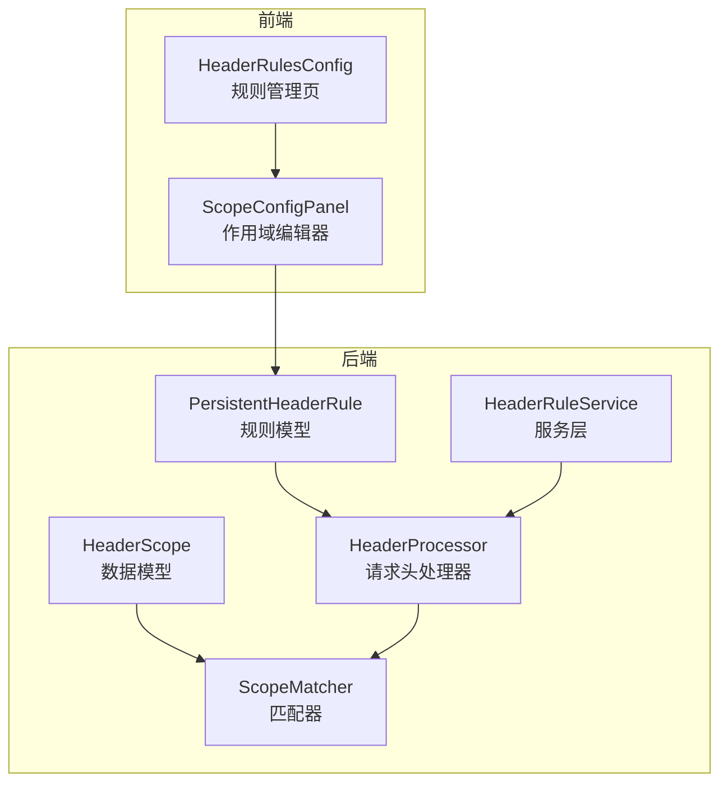
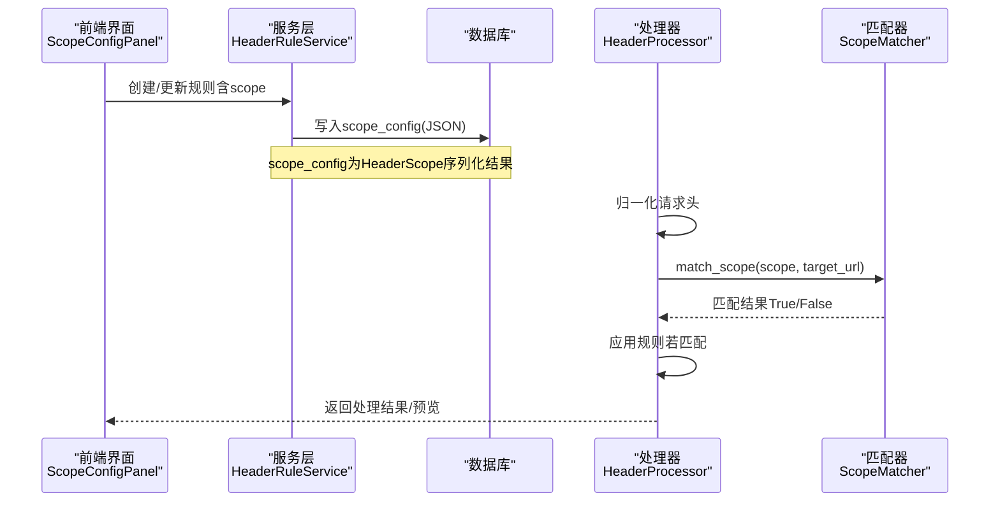
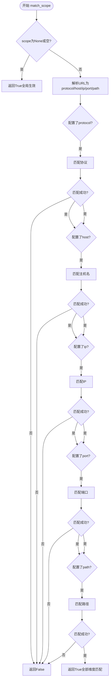
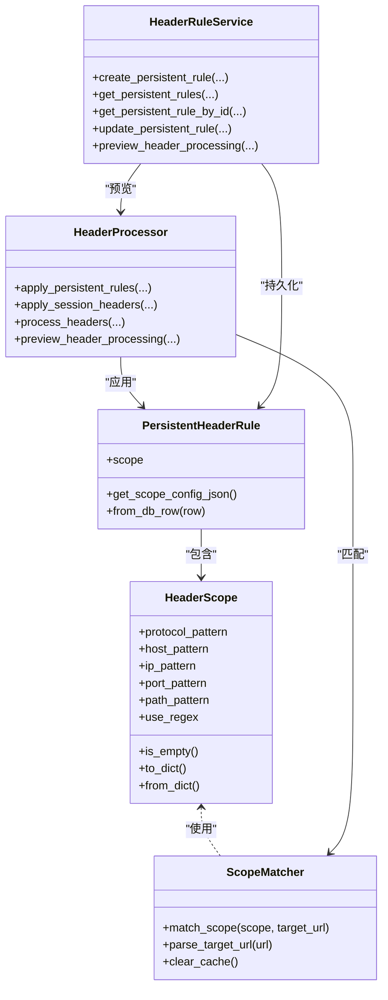

# 作用域配置

<cite>
**本文引用的文件**
- [src/backEnd/model/HeaderScope.py](file://src/backEnd/model/HeaderScope.py)
- [src/backEnd/utils/scope_matcher.py](file://src/backEnd/utils/scope_matcher.py)
- [src/backEnd/utils/header_processor.py](file://src/backEnd/utils/header_processor.py)
- [src/backEnd/model/PersistentHeaderRule.py](file://src/backEnd/model/PersistentHeaderRule.py)
- [src/backEnd/service/headerRuleService.py](file://src/backEnd/service/headerRuleService.py)
- [src/frontEnd/src/views/Config/components/ScopeConfigPanel.vue](file://src/frontEnd/src/views/Config/components/ScopeConfigPanel.vue)
- [src/frontEnd/src/views/Config/components/HeaderRulesConfig.vue](file://src/frontEnd/src/views/Config/components/HeaderRulesConfig.vue)
- [src/backEnd/tests/test_scope_matcher.py](file://src/backEnd/tests/test_scope_matcher.py)
- [doc/SCOPE_FEATURE_COMPLETION.md](file://doc/SCOPE_FEATURE_COMPLETION.md)
- [src/backEnd/doc/SCOPE_FEATURE_SUMMARY.md](file://src/backEnd/doc/SCOPE_FEATURE_SUMMARY.md)
</cite>

## 目录
1. [简介](#简介)
2. [项目结构](#项目结构)
3. [核心组件](#核心组件)
4. [架构总览](#架构总览)
5. [详细组件分析](#详细组件分析)
6. [依赖关系分析](#依赖关系分析)
7. [性能考量](#性能考量)
8. [故障排查指南](#故障排查指南)
9. [结论](#结论)
10. [附录](#附录)

## 简介
本文件围绕“作用域配置”进行系统化说明，重点解析 HeaderScope 数据模型的结构与匹配算法，阐述作用域规则的定义方式（支持的关键字匹配与正则表达式、通配符、多值模式、组合逻辑），并说明 scope_matcher 工具模块如何高效匹配请求与作用域规则，以及匹配结果如何影响规则的应用。同时介绍前端可视化作用域编辑器的能力与使用方式，并提供典型使用场景与性能优化建议。

## 项目结构
作用域配置涉及后端数据模型、匹配器、处理器、服务层与前端编辑器等多个模块：
- 后端数据模型：HeaderScope 定义作用域字段与校验；PersistentHeaderRule 引入 scope 字段。
- 匹配器：ScopeMatcher 提供协议、主机名、IP、端口、路径的匹配逻辑与缓存优化。
- 处理器：HeaderProcessor 在应用持久化规则与会话头时结合 target_url 进行作用域匹配。
- 服务层：HeaderRuleService 支持 CRUD 作用域配置，并在预览与获取接口中传递 target_url。
- 前端：ScopeConfigPanel 与 HeaderRulesConfig 提供可视化作用域编辑与预设模板。

图表来源
- [src/backEnd/model/HeaderScope.py](file://src/backEnd/model/HeaderScope.py#L1-L187)
- [src/backEnd/utils/scope_matcher.py](file://src/backEnd/utils/scope_matcher.py#L1-L346)
- [src/backEnd/utils/header_processor.py](file://src/backEnd/utils/header_processor.py#L1-L292)
- [src/backEnd/model/PersistentHeaderRule.py](file://src/backEnd/model/PersistentHeaderRule.py#L1-L104)
- [src/backEnd/service/headerRuleService.py](file://src/backEnd/service/headerRuleService.py#L1-L976)
- [src/frontEnd/src/views/Config/components/ScopeConfigPanel.vue](file://src/frontEnd/src/views/Config/components/ScopeConfigPanel.vue#L1-L904)
- [src/frontEnd/src/views/Config/components/HeaderRulesConfig.vue](file://src/frontEnd/src/views/Config/components/HeaderRulesConfig.vue#L1-L2195)

章节来源
- [src/backEnd/model/HeaderScope.py](file://src/backEnd/model/HeaderScope.py#L1-L187)
- [src/backEnd/utils/scope_matcher.py](file://src/backEnd/utils/scope_matcher.py#L1-L346)
- [src/backEnd/utils/header_processor.py](file://src/backEnd/utils/header_processor.py#L1-L292)
- [src/backEnd/model/PersistentHeaderRule.py](file://src/backEnd/model/PersistentHeaderRule.py#L1-L104)
- [src/backEnd/service/headerRuleService.py](file://src/backEnd/service/headerRuleService.py#L1-L976)
- [src/frontEnd/src/views/Config/components/ScopeConfigPanel.vue](file://src/frontEnd/src/views/Config/components/ScopeConfigPanel.vue#L1-L904)
- [src/frontEnd/src/views/Config/components/HeaderRulesConfig.vue](file://src/frontEnd/src/views/Config/components/HeaderRulesConfig.vue#L1-L2195)

## 核心组件
- HeaderScope：定义作用域字段（协议、主机名、IP、端口、路径）与 use_regex 开关，提供空作用域判定与序列化/反序列化。
- ScopeMatcher：实现多维度匹配与缓存优化，支持关键字与正则两种模式。
- HeaderProcessor：在应用持久化规则与会话头时，基于 target_url 与作用域进行匹配。
- PersistentHeaderRule：规则模型引入 scope 字段，支持序列化/反序列化。
- HeaderRuleService：支持 CRUD 作用域配置，并在预览接口中传递 target_url。
- ScopeConfigPanel：前端可视化作用域编辑器，支持模板、帮助与正则开关。

章节来源
- [src/backEnd/model/HeaderScope.py](file://src/backEnd/model/HeaderScope.py#L1-L187)
- [src/backEnd/utils/scope_matcher.py](file://src/backEnd/utils/scope_matcher.py#L1-L346)
- [src/backEnd/utils/header_processor.py](file://src/backEnd/utils/header_processor.py#L1-L292)
- [src/backEnd/model/PersistentHeaderRule.py](file://src/backEnd/model/PersistentHeaderRule.py#L1-L104)
- [src/backEnd/service/headerRuleService.py](file://src/backEnd/service/headerRuleService.py#L1-L976)
- [src/frontEnd/src/views/Config/components/ScopeConfigPanel.vue](file://src/frontEnd/src/views/Config/components/ScopeConfigPanel.vue#L1-L904)

## 架构总览
作用域配置贯穿“规则定义—持久化—匹配—应用”的完整链路。前端通过 ScopeConfigPanel 编辑 HeaderScope，后端在 HeaderRuleService 中持久化 scope_config，并在 HeaderProcessor 的处理流程中结合 target_url 进行匹配，最终决定是否应用规则。

图表来源
- [src/backEnd/service/headerRuleService.py](file://src/backEnd/service/headerRuleService.py#L1-L976)
- [src/backEnd/utils/header_processor.py](file://src/backEnd/utils/header_processor.py#L1-L292)
- [src/backEnd/utils/scope_matcher.py](file://src/backEnd/utils/scope_matcher.py#L1-L346)
- [src/frontEnd/src/views/Config/components/ScopeConfigPanel.vue](file://src/frontEnd/src/views/Config/components/ScopeConfigPanel.vue#L1-L904)

## 详细组件分析

### HeaderScope 数据模型
- 字段与含义
  - protocol_pattern：协议匹配，支持 http/https 或逗号分隔的多值；为空时表示不限制协议。
  - host_pattern：主机名匹配，支持通配符“*”，如“*.example.com”。
  - ip_pattern：IP 匹配，支持通配符“*”，如“192.168.*”。
  - port_pattern：端口匹配，支持逗号分隔的多值；为空时表示不限制端口。
  - path_pattern：路径匹配，支持通配符“*”，如“/api/*”。
  - use_regex：是否使用正则表达式匹配。
- 匹配逻辑
  - scope 为 None 或空对象时，表示全局生效。
  - 非空字段采用 AND 逻辑：所有配置的维度均需匹配。
  - 协议默认不限制（空协议模式等同不限制）。
- 校验与约束
  - 协议值仅允许 http/https，除非检测到正则表达式字符。
  - 端口值若包含正则字符则跳过数值范围校验；否则要求在 1-65535。
  - 模式字符串长度限制（路径最长，其他较短）。
- 序列化/反序列化
  - to_dict：仅输出非 None 字段。
  - from_dict：从字典构建对象，支持 None。

章节来源
- [src/backEnd/model/HeaderScope.py](file://src/backEnd/model/HeaderScope.py#L1-L187)

### ScopeMatcher 匹配器
- 匹配入口
  - match_scope(scope, target_url)：空 scope 或空对象直接返回 True（全局生效）。
  - 解析 URL 为 protocol/host/ip/port/path，并进行各维度匹配。
- 匹配维度
  - 协议：默认端口 80（http）、443（https）。
  - 主机名：支持通配符与正则。
  - IP：尝试 DNS 解析为主机名解析为 IP，失败则为空字符串。
  - 端口：字符串比较，支持多值。
  - 路径：支持通配符与正则。
- 匹配模式
  - use_regex=false：关键字匹配，支持“*”通配符与逗号分隔的多值（OR）。
  - use_regex=true：正则表达式匹配，支持完整正则语法。
- 缓存与性能
  - URL 解析缓存（最多 50 条），命中则直接返回。
  - 正则表达式编译缓存（最多 100 条），命中则复用 Pattern。
  - 早期退出：任一维度不匹配立即返回 False。
- 辅助方法
  - clear_cache：清空正则与 URL 缓存。
  - parse_target_url：解析 scheme/host/port/path 并解析 IP。
  - _match_dimension/_match_keyword/_match_regex：具体匹配实现。

图表来源
- [src/backEnd/utils/scope_matcher.py](file://src/backEnd/utils/scope_matcher.py#L1-L346)

章节来源
- [src/backEnd/utils/scope_matcher.py](file://src/backEnd/utils/scope_matcher.py#L1-L346)

### HeaderProcessor 应用流程
- 规则应用
  - 按优先级降序处理规则；仅对启用的规则生效。
  - 若规则配置了 scope 且提供了 target_url，则先用 ScopeMatcher 判断是否匹配；不匹配则跳过。
  - 检查请求头名称合法性；应用替换策略（替换、追加、前置、条件替换、UPSERT）。
  - 总是写入目标请求头（满足用户“总是添加”的需求）。
- 会话头应用
  - 过滤过期会话头；按优先级升序处理（优先级高的后执行，便于覆盖）。
  - 同样支持作用域匹配与名称校验。
- 预览与错误兜底
  - preview_header_processing 返回原始与处理后的请求头列表及应用规则描述。
  - 处理异常时返回原始请求头并附带错误信息。

章节来源
- [src/backEnd/utils/header_processor.py](file://src/backEnd/utils/header_processor.py#L1-L292)

### PersistentHeaderRule 与服务层
- PersistentHeaderRule
  - 引入 scope 字段；提供 get_scope_config_json 与 from_db_row 的序列化/反序列化。
- HeaderRuleService
  - CRUD 支持 scope 字段：创建/更新时序列化 scope；查询时反序列化 scope。
  - 预览接口接收 target_url 并传递给 HeaderProcessor.preview_header_processing。
  - 数据库层通过 scope_config 字段存储 JSON。

章节来源
- [src/backEnd/model/PersistentHeaderRule.py](file://src/backEnd/model/PersistentHeaderRule.py#L1-L104)
- [src/backEnd/service/headerRuleService.py](file://src/backEnd/service/headerRuleService.py#L1-L976)

### 前端作用域编辑器
- ScopeConfigPanel
  - 支持协议、主机名、路径、端口、IP 等字段输入；use_regex 开关切换匹配模式。
  - 提供“预设模板”与“匹配示例”，帮助用户快速配置。
  - 与 HeaderRulesConfig 的表单联动，将 scopeData 作为规则的一部分提交。
- HeaderRulesConfig
  - 规则列表页展示“作用域”列（有作用域/全局）。
  - 创建/编辑对话框中嵌入 ScopeConfigPanel，支持模板选择与帮助提示。

章节来源
- [src/frontEnd/src/views/Config/components/ScopeConfigPanel.vue](file://src/frontEnd/src/views/Config/components/ScopeConfigPanel.vue#L1-L904)
- [src/frontEnd/src/views/Config/components/HeaderRulesConfig.vue](file://src/frontEnd/src/views/Config/components/HeaderRulesConfig.vue#L1-L2195)

## 依赖关系分析
- HeaderScope 与 ScopeMatcher
  - ScopeMatcher 直接依赖 HeaderScope 的字段与 use_regex。
- HeaderProcessor 依赖
  - HeaderProcessor 依赖 ScopeMatcher 进行作用域匹配；依赖 PersistentHeaderRule 的 scope 字段。
- HeaderRuleService
  - 依赖 PersistentHeaderRule 的序列化/反序列化；依赖 HeaderProcessor 的预览能力。
- 前端
  - ScopeConfigPanel 依赖 HeaderScope 类型；HeaderRulesConfig 依赖 ScopeConfigPanel 与 API。

图表来源
- [src/backEnd/model/HeaderScope.py](file://src/backEnd/model/HeaderScope.py#L1-L187)
- [src/backEnd/utils/scope_matcher.py](file://src/backEnd/utils/scope_matcher.py#L1-L346)
- [src/backEnd/utils/header_processor.py](file://src/backEnd/utils/header_processor.py#L1-L292)
- [src/backEnd/model/PersistentHeaderRule.py](file://src/backEnd/model/PersistentHeaderRule.py#L1-L104)
- [src/backEnd/service/headerRuleService.py](file://src/backEnd/service/headerRuleService.py#L1-L976)

章节来源
- [src/backEnd/model/HeaderScope.py](file://src/backEnd/model/HeaderScope.py#L1-L187)
- [src/backEnd/utils/scope_matcher.py](file://src/backEnd/utils/scope_matcher.py#L1-L346)
- [src/backEnd/utils/header_processor.py](file://src/backEnd/utils/header_processor.py#L1-L292)
- [src/backEnd/model/PersistentHeaderRule.py](file://src/backEnd/model/PersistentHeaderRule.py#L1-L104)
- [src/backEnd/service/headerRuleService.py](file://src/backEnd/service/headerRuleService.py#L1-L976)

## 性能考量
- 缓存策略
  - URL 解析缓存上限 50 条，命中即返回，避免重复解析。
  - 正则编译缓存上限 100 条，命中即复用 Pattern，减少编译开销。
- 匹配策略
  - 早期退出：任一维度不匹配立即返回，降低整体耗时。
  - use_regex=false 时使用关键字匹配与通配符转换，性能优于正则。
- 建议
  - 优先使用关键字匹配与通配符，仅在复杂场景启用正则。
  - 控制作用域维度数量，避免过多 AND 条件导致频繁匹配。
  - 定期清理缓存（clear_cache）以释放内存，或在长时间运行场景中周期性触发。

章节来源
- [src/backEnd/utils/scope_matcher.py](file://src/backEnd/utils/scope_matcher.py#L1-L346)
- [src/backEnd/doc/SCOPE_FEATURE_SUMMARY.md](file://src/backEnd/doc/SCOPE_FEATURE_SUMMARY.md#L1-L219)

## 故障排查指南
- 常见问题
  - 规则未生效：检查 scope 是否配置正确；确认 target_url 是否传入；核对 use_regex 开关与模式。
  - 正则报错：检查正则语法；确认是否包含非法字符；必要时关闭 use_regex 改用关键字匹配。
  - 端口不匹配：注意默认端口（http=80，https=443）；若 URL 未显式指定端口，可能与预期不符。
  - IP 解析失败：主机名无法解析为 IP 时，IP 匹配将失败；可改用主机名匹配或关闭 IP 维度。
- 单元测试参考
  - 覆盖空 scope 全局匹配、多值匹配、通配符匹配、正则匹配、默认端口处理、URL 边界情况等。
- 日志定位
  - HeaderProcessor 与 ScopeMatcher 在匹配失败时会输出调试日志，便于定位具体维度。

章节来源
- [src/backEnd/tests/test_scope_matcher.py](file://src/backEnd/tests/test_scope_matcher.py#L1-L286)
- [src/backEnd/utils/scope_matcher.py](file://src/backEnd/utils/scope_matcher.py#L1-L346)
- [src/backEnd/utils/header_processor.py](file://src/backEnd/utils/header_processor.py#L1-L292)

## 结论
作用域配置通过 HeaderScope 与 ScopeMatcher 实现灵活而高效的多维度匹配，配合 HeaderProcessor 的应用流程与 HeaderRuleService 的持久化能力，形成从定义到应用的闭环。前端 ScopeConfigPanel 提供直观的可视化编辑体验，支持模板与帮助信息，降低配置门槛。在保证 100% 向后兼容的前提下，通过缓存与早期退出等优化手段，兼顾易用性与性能。

## 附录

### 作用域规则定义与匹配语法
- 关键字匹配（默认）
  - 通配符“*”支持任意字符序列；“/api/*”匹配以“/api/”开头的路径。
  - 多值使用逗号分隔（OR 逻辑），如“http,https”、“80,443,8080”。
- 正则表达式匹配（use_regex=true）
  - 支持完整正则语法；适合复杂路径或主机名匹配场景。
- 组合逻辑（AND）
  - 配置的所有维度均需匹配；任一不匹配即不应用规则。
- 默认行为
  - scope 为 None 或空对象时，规则全局生效。

章节来源
- [src/backEnd/model/HeaderScope.py](file://src/backEnd/model/HeaderScope.py#L1-L187)
- [src/backEnd/utils/scope_matcher.py](file://src/backEnd/utils/scope_matcher.py#L1-L346)

### 典型使用场景
- 限定扫描范围到特定 API 端点
  - 配置 protocol=https、host=api.example.com、port=443、path=/v1/*
- 排除静态资源
  - 配置 path=^.*\.(css|js|png|jpg|ico)$，并使用正则匹配静态文件扩展名
- 仅在 HTTPS 环境添加安全头
  - 配置 protocol=https
- 内网 IP 段专用请求头
  - 配置 ip=192.168.*

章节来源
- [src/backEnd/doc/SCOPE_FEATURE_SUMMARY.md](file://src/backEnd/doc/SCOPE_FEATURE_SUMMARY.md#L1-L219)

### 前端可视化编辑器要点
- ScopeConfigPanel
  - 支持协议、主机名、路径、端口、IP 等字段；use_regex 开关；模板与示例。
- HeaderRulesConfig
  - 规则列表展示“作用域”列；创建/编辑对话框内嵌作用域面板。

章节来源
- [src/frontEnd/src/views/Config/components/ScopeConfigPanel.vue](file://src/frontEnd/src/views/Config/components/ScopeConfigPanel.vue#L1-L904)
- [src/frontEnd/src/views/Config/components/HeaderRulesConfig.vue](file://src/frontEnd/src/views/Config/components/HeaderRulesConfig.vue#L1-L2195)

### 实际代码示例（路径引用）
- 创建带作用域的规则（后端）
  - [创建持久化规则](file://src/backEnd/service/headerRuleService.py#L1-L176)
  - [序列化 scope 字段](file://src/backEnd/service/headerRuleService.py#L115-L137)
- 应用规则时的匹配（后端）
  - [HeaderProcessor 应用持久化规则](file://src/backEnd/utils/header_processor.py#L90-L151)
  - [HeaderProcessor 应用会话头](file://src/backEnd/utils/header_processor.py#L153-L211)
- 前端编辑与提交
  - [ScopeConfigPanel 作用域面板](file://src/frontEnd/src/views/Config/components/ScopeConfigPanel.vue#L1-L904)
  - [HeaderRulesConfig 创建/编辑对话框](file://src/frontEnd/src/views/Config/components/HeaderRulesConfig.vue#L570-L800)