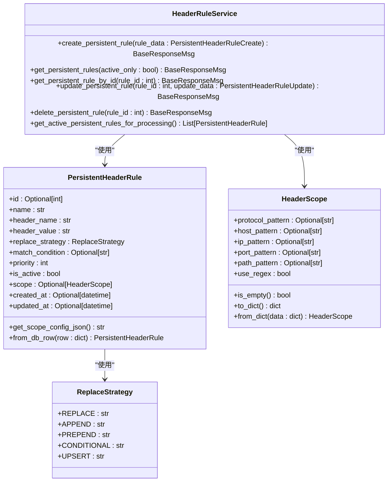
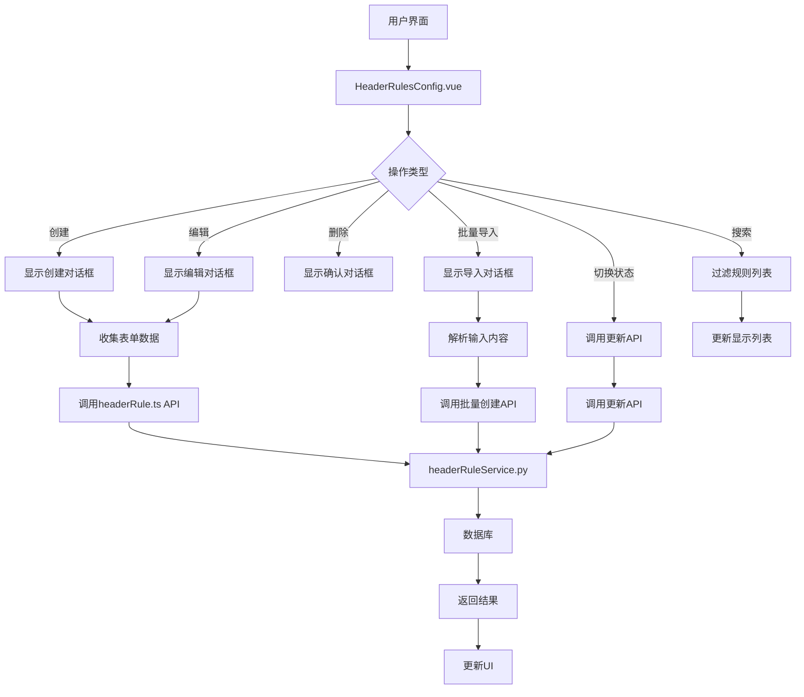
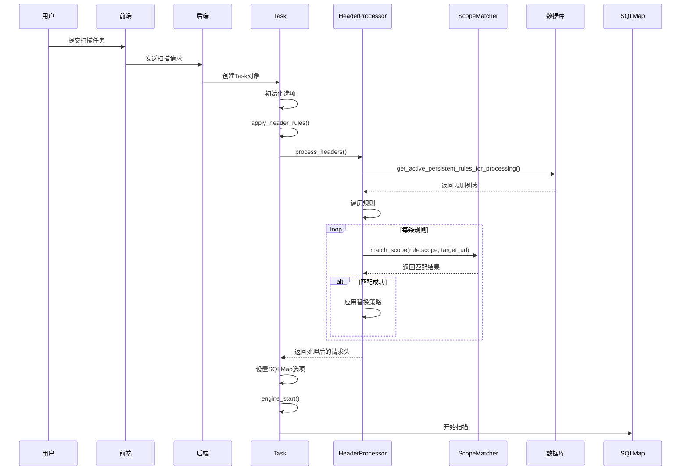

# 持久化规则管理

<cite>
**本文档引用文件**  
- [PersistentHeaderRule.py](file://src/backEnd/model/PersistentHeaderRule.py)
- [headerRuleService.py](file://src/backEnd/service/headerRuleService.py)
- [HeaderRulesConfig.vue](file://src/frontEnd/src/views/Config/components/HeaderRulesConfig.vue)
- [headerRule.ts](file://src/frontEnd/src/api/headerRule.ts)
- [header_processor.py](file://src/backEnd/utils/header_processor.py)
- [scope_matcher.py](file://src/backEnd/utils/scope_matcher.py)
- [Task.py](file://src/backEnd/model/Task.py)
- [HeaderScope.py](file://src/backEnd/model/HeaderScope.py)
- [headerController.py](file://src/backEnd/api/commonApi/headerController.py)
</cite>

## 目录
1. [引言](#引言)
2. [数据模型设计](#数据模型设计)
3. [服务层处理逻辑](#服务层处理逻辑)
4. [前端可视化界面](#前端可视化界面)
5. [规则匹配引擎与生命周期](#规则匹配引擎与生命周期)
6. [API调用示例与配置范例](#api调用示例与配置范例)
7. [性能优化建议](#性能优化建议)

## 引言
本文档详细阐述了SQLMapWebUI系统中持久化规则管理的完整实现。该功能允许用户创建、管理和应用持久化的HTTP请求头规则，以满足安全测试中的各种需求。系统通过`PersistentHeaderRule`数据模型定义规则，利用`headerRuleService`服务层处理增删改查操作，并通过`HeaderRulesConfig.vue`前端组件提供直观的可视化管理界面。规则匹配引擎根据URL模式和HTTP方法应用相应规则，并在扫描任务的生命周期中生效。本文档将深入解析这些组件的设计与实现，为用户提供全面的技术参考。

## 数据模型设计

`PersistentHeaderRule`数据模型是持久化规则管理的核心，定义了规则的所有属性和行为。该模型基于Pydantic构建，确保了数据的类型安全和验证。

模型包含以下关键字段：
- **id**: 规则的唯一标识符
- **name**: 规则名称，用于标识和管理
- **header_name**: 要设置的HTTP请求头名称
- **header_value**: 请求头的值
- **replace_strategy**: 替换策略，定义了如何处理已存在的同名请求头
- **priority**: 优先级，决定规则的执行顺序（0-100）
- **is_active**: 启用状态，控制规则是否生效
- **scope**: 作用域配置，定义规则的应用范围
- **created_at** 和 **updated_at**: 时间戳，记录规则的创建和更新时间

其中，`ReplaceStrategy`是一个枚举类型，提供了五种替换策略：
- `REPLACE`: 完全替换现有值
- `APPEND`: 将新值追加到现有值后面
- `PREPEND`: 将新值前置到现有值前面
- `CONDITIONAL`: 条件性替换
- `UPSERT`: 如果请求头已存在则替换，如果不存在则新增

`scope`字段是`HeaderScope`对象，支持多维度的作用域匹配，包括协议、主机名、IP、端口和路径。`HeaderScope`模型还支持关键字匹配和正则表达式匹配两种模式，提供了极大的灵活性。

**Section sources**
- [PersistentHeaderRule.py](file://src/backEnd/model/PersistentHeaderRule.py#L1-L104)
- [HeaderScope.py](file://src/backEnd/model/HeaderScope.py#L1-L187)

## 服务层处理逻辑

`headerRuleService`服务层负责处理持久化规则的增删改查（CRUD）操作，以及规则的优先级排序、冲突检测和持久化存储机制。

### 增删改查操作
服务层提供了以下核心方法：
- `create_persistent_rule`: 创建新的持久化规则。在创建前会进行数据验证，检查规则名称是否已存在，并将`scope`对象序列化为JSON字符串存储到数据库。
- `get_persistent_rules`: 获取规则列表。支持按启用状态过滤，并按优先级降序和创建时间降序排序。
- `get_persistent_rule_by_id`: 根据ID获取单个规则。
- `update_persistent_rule`: 更新现有规则。会检查规则是否存在，并确保新名称不与其他规则冲突。
- `delete_persistent_rule`: 删除指定ID的规则。

所有数据库操作都通过`DataStore.header_db`连接执行，确保了数据的一致性和可靠性。

### 冲突检测与优先级排序
在创建和更新规则时，服务层会进行冲突检测，确保规则名称的唯一性。对于优先级排序，系统在查询规则列表时，会按`priority`字段降序排列，确保高优先级的规则先被处理。

### 持久化存储机制
规则数据存储在SQLite数据库的`persistent_header_rules`表中。`scope`配置被序列化为JSON字符串，存储在`scope_config`列中。当从数据库读取规则时，服务层会调用`PersistentHeaderRule.from_db_row`方法，将`scope_config`反序列化回`HeaderScope`对象。



**Diagram sources**
- [PersistentHeaderRule.py](file://src/backEnd/model/PersistentHeaderRule.py#L1-L104)
- [HeaderScope.py](file://src/backEnd/model/HeaderScope.py#L1-L187)
- [headerRuleService.py](file://src/backEnd/service/headerRuleService.py#L1-L976)

**Section sources**
- [headerRuleService.py](file://src/backEnd/service/headerRuleService.py#L1-L976)

## 前端可视化界面

`HeaderRulesConfig.vue`组件为用户提供了一个直观的可视化界面，用于管理持久化规则。该组件集成在配置页面的“Header规则管理”标签页中。

### 功能特性
- **规则列表展示**: 使用数据表格展示所有规则，支持分页、排序和过滤。
- **创建与编辑**: 提供对话框用于创建和编辑规则，包含所有必要的字段。
- **批量操作**: 支持批量导入和导出规则，支持JSON格式。
- **搜索与过滤**: 用户可以通过搜索框和过滤器快速定位规则。
- **状态管理**: 支持启用/禁用规则的快捷操作。

### 批量导入导出
用户可以通过文本、JSON或文件上传的方式批量导入规则。系统会解析输入内容，创建相应的规则。导出功能允许用户将规则集保存为JSON文件，便于备份和迁移。



**Diagram sources**
- [HeaderRulesConfig.vue](file://src/frontEnd/src/views/Config/components/HeaderRulesConfig.vue#L1-L2195)
- [headerRule.ts](file://src/frontEnd/src/api/headerRule.ts#L1-L421)

**Section sources**
- [HeaderRulesConfig.vue](file://src/frontEnd/src/views/Config/components/HeaderRulesConfig.vue#L1-L2195)

## 规则匹配引擎与生命周期

规则匹配引擎是系统的核心，负责在扫描任务执行前应用相应的请求头规则。该引擎由`header_processor.py`和`scope_matcher.py`模块实现。

### 规则匹配逻辑
规则匹配引擎的工作流程如下：
1. **获取规则**: 从数据库获取所有启用的持久化规则和会话性请求头。
2. **作用域匹配**: 对于每条规则，使用`ScopeMatcher`判断其`scope`是否与目标URL匹配。
3. **应用规则**: 如果规则匹配，则根据其`replace_strategy`应用到请求头中。
4. **优先级排序**: 规则按优先级降序处理，确保高优先级规则优先应用。

`ScopeMatcher`支持多维度匹配，包括协议、主机名、IP、端口和路径。匹配逻辑为AND逻辑，即所有非空字段必须同时匹配。系统支持关键字匹配（支持通配符`*`和逗号分隔）和正则表达式匹配。

### 扫描任务中的生命周期
规则在扫描任务的生命周期中生效。当用户提交一个扫描任务时，系统会创建一个`Task`对象。在`Task`的初始化过程中，`apply_header_rules`方法会被调用，应用所有匹配的持久化规则和会话性请求头。处理后的请求头会被设置到SQLMap的配置中，然后任务才开始执行。



**Diagram sources**
- [header_processor.py](file://src/backEnd/utils/header_processor.py#L1-L292)
- [scope_matcher.py](file://src/backEnd/utils/scope_matcher.py#L1-L346)
- [Task.py](file://src/backEnd/model/Task.py#L1-L333)

**Section sources**
- [header_processor.py](file://src/backEnd/utils/header_processor.py#L1-L292)
- [scope_matcher.py](file://src/backEnd/utils/scope_matcher.py#L1-L346)
- [Task.py](file://src/backEnd/model/Task.py#L1-L333)

## API调用示例与配置范例

### 规则创建API调用方式
以下是一个使用Python `requests`库调用创建持久化规则API的示例：

```python
import requests

url = "http://localhost:8000/commonApi/header/persistent-header-rules"
headers = {"Content-Type": "application/json"}
data = {
    "name": "安全扫描头",
    "header_name": "X-Scanner",
    "header_value": "SQLMapWebUI/1.0",
    "replace_strategy": "REPLACE",
    "priority": 80,
    "is_active": True,
    "scope": {
        "protocol_pattern": "https",
        "host_pattern": "*.example.com",
        "path_pattern": "/api/*"
    }
}

response = requests.post(url, json=data, headers=headers)
print(response.json())
```

### 常见安全头配置范例
以下是几个常见的安全头配置范例：

1. **X-Forwarded-For伪装**:
   ```json
   {
     "name": "伪装X-Forwarded-For",
     "header_name": "X-Forwarded-For",
     "header_value": "192.168.1.100",
     "replace_strategy": "REPLACE",
     "priority": 60,
     "is_active": true
   }
   ```

2. **User-Agent伪装**:
   ```json
   {
     "name": "浏览器User-Agent",
     "header_name": "User-Agent",
     "header_value": "Mozilla/5.0 (Windows NT 10.0; Win64; x64) AppleWebKit/537.36",
     "replace_strategy": "REPLACE",
     "priority": 70,
     "is_active": true
   }
   ```

3. **API认证头**:
   ```json
   {
     "name": "API认证",
     "header_name": "Authorization",
     "header_value": "Bearer eyJhbGciOiJIUzI1NiIsInR5cCI6IkpXVCJ9...",
     "replace_strategy": "REPLACE",
     "priority": 90,
     "is_active": true,
     "scope": {
       "host_pattern": "api.example.com",
       "path_pattern": "/v1/*"
     }
   }
   ```

**Section sources**
- [headerController.py](file://src/backEnd/api/commonApi/headerController.py#L1-L100)
- [headerRule.ts](file://src/frontEnd/src/api/headerRule.ts#L1-L421)

## 性能优化建议

为了减少规则匹配的开销，提高系统性能，建议采取以下措施：

1. **合理设置优先级**: 将最常用的规则设置为高优先级，可以减少匹配引擎需要检查的规则数量。
2. **精确作用域配置**: 尽量使用精确的作用域配置，避免使用过于宽泛的通配符，以减少不必要的匹配计算。
3. **避免过多规则**: 定期清理不再使用的规则，保持规则集的精简。
4. **利用缓存**: 系统已经实现了URL解析缓存和正则表达式编译缓存，确保这些缓存机制正常工作。
5. **批量操作**: 在需要创建大量规则时，使用批量导入功能，而不是逐个创建，以减少API调用次数。

通过遵循这些优化建议，可以确保规则匹配引擎在高负载下仍能保持高效运行。

**Section sources**
- [scope_matcher.py](file://src/backEnd/utils/scope_matcher.py#L1-L346)
- [header_processor.py](file://src/backEnd/utils/header_processor.py#L1-L292)