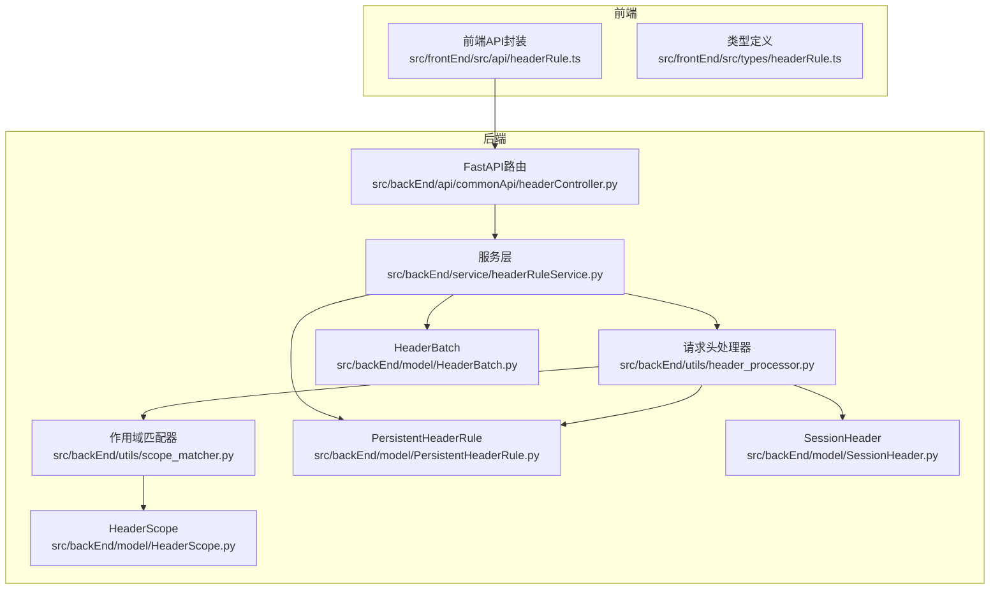
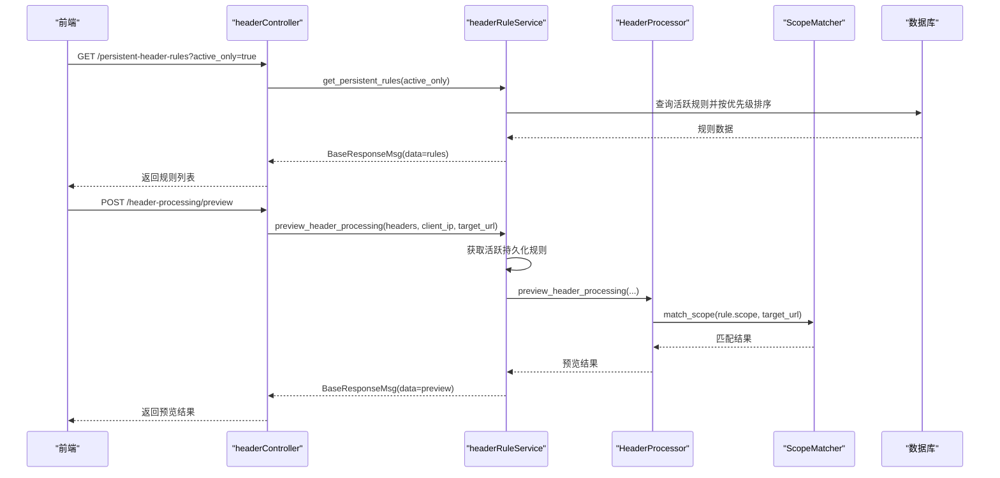
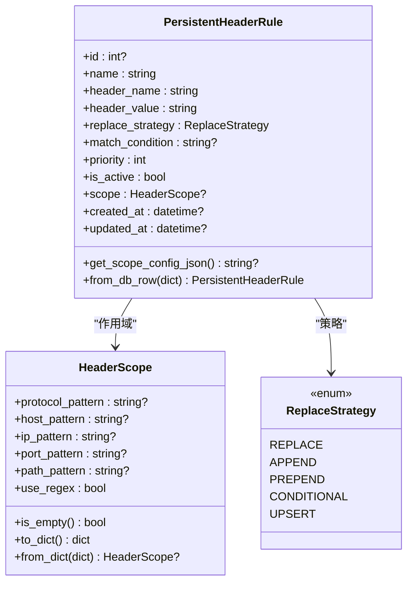
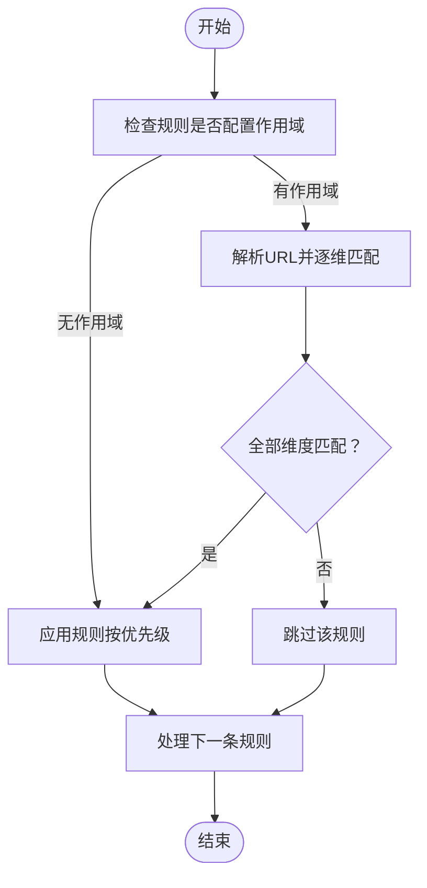
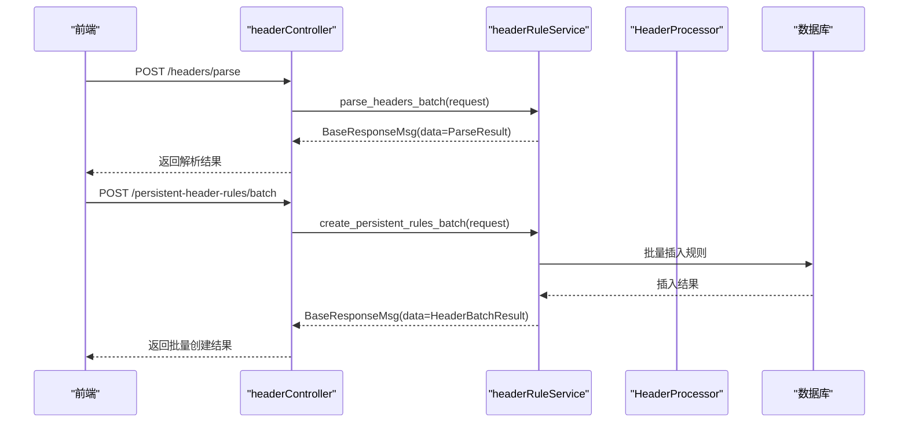
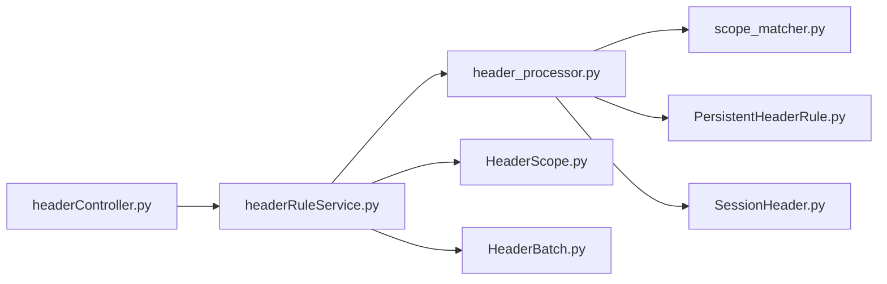

# 请求头规则管理

<cite>
**本文引用的文件**
- [src/backEnd/model/HeaderScope.py](file://src/backEnd/model/HeaderScope.py)
- [src/backEnd/model/PersistentHeaderRule.py](file://src/backEnd/model/PersistentHeaderRule.py)
- [src/backEnd/model/SessionHeader.py](file://src/backEnd/model/SessionHeader.py)
- [src/backEnd/model/HeaderBatch.py](file://src/backEnd/model/HeaderBatch.py)
- [src/backEnd/service/headerRuleService.py](file://src/backEnd/service/headerRuleService.py)
- [src/backEnd/utils/scope_matcher.py](file://src/backEnd/utils/scope_matcher.py)
- [src/backEnd/utils/header_processor.py](file://src/backEnd/utils/header_processor.py)
- [src/backEnd/api/commonApi/headerController.py](file://src/backEnd/api/commonApi/headerController.py)
- [src/frontEnd/src/types/headerRule.ts](file://src/frontEnd/src/types/headerRule.ts)
- [src/frontEnd/src/api/headerRule.ts](file://src/frontEnd/src/api/headerRule.ts)
- [doc/HEADER_CONFIG_UI_IMPLEMENTATION.md](file://doc/HEADER_CONFIG_UI_IMPLEMENTATION.md)
- [doc/HEADER_CONFIG_USER_GUIDE.md](file://doc/HEADER_CONFIG_USER_GUIDE.md)
</cite>

## 目录
1. [简介](#简介)
2. [项目结构](#项目结构)
3. [核心组件](#核心组件)
4. [架构总览](#架构总览)
5. [详细组件分析](#详细组件分析)
6. [依赖关系分析](#依赖关系分析)
7. [性能考量](#性能考量)
8. [故障排查指南](#故障排查指南)
9. [结论](#结论)
10. [附录](#附录)

## 简介
本文件围绕“请求头规则管理”功能，系统性梳理持久化规则与会话级规则的管理机制，深入解析 HeaderScope 与 PersistentHeaderRule 数据模型的设计、作用域匹配规则与优先级处理、headerRuleService 服务层的增删改查与匹配逻辑，以及前端界面如何支持批量导入导出与作用域可视化编辑。同时说明规则在扫描过程中的应用时机与影响范围，并给出规则编写最佳实践与反爬虫策略应对方法。

## 项目结构
后端采用分层架构：
- API 层：提供 REST 接口，封装业务调用与响应格式。
- 服务层：实现业务逻辑，包括规则 CRUD、批量导入、预览与统计。
- 工具层：作用域匹配与请求头处理。
- 模型层：数据模型与数据库交互辅助。

前端采用 Vue + TypeScript，通过统一 API 封装对接后端。

图示来源
- [src/backEnd/api/commonApi/headerController.py](file://src/backEnd/api/commonApi/headerController.py#L1-L120)
- [src/backEnd/service/headerRuleService.py](file://src/backEnd/service/headerRuleService.py#L1-L120)
- [src/backEnd/utils/scope_matcher.py](file://src/backEnd/utils/scope_matcher.py#L1-L120)
- [src/backEnd/utils/header_processor.py](file://src/backEnd/utils/header_processor.py#L1-L120)
- [src/backEnd/model/HeaderScope.py](file://src/backEnd/model/HeaderScope.py#L1-L80)
- [src/backEnd/model/PersistentHeaderRule.py](file://src/backEnd/model/PersistentHeaderRule.py#L1-L60)
- [src/backEnd/model/SessionHeader.py](file://src/backEnd/model/SessionHeader.py#L1-L60)
- [src/backEnd/model/HeaderBatch.py](file://src/backEnd/model/HeaderBatch.py#L1-L60)
- [src/frontEnd/src/api/headerRule.ts](file://src/frontEnd/src/api/headerRule.ts#L1-L120)
- [src/frontEnd/src/types/headerRule.ts](file://src/frontEnd/src/types/headerRule.ts#L1-L60)

章节来源
- [src/backEnd/api/commonApi/headerController.py](file://src/backEnd/api/commonApi/headerController.py#L1-L120)
- [src/backEnd/service/headerRuleService.py](file://src/backEnd/service/headerRuleService.py#L1-L120)
- [src/frontEnd/src/api/headerRule.ts](file://src/frontEnd/src/api/headerRule.ts#L1-L120)

## 核心组件
- HeaderScope：定义作用域匹配的多维模式（协议、主机名、IP、端口、路径），支持关键字与正则两种匹配模式，空配置表示全局生效。
- PersistentHeaderRule：持久化请求头规则模型，包含名称、请求头名称与值、替换策略、匹配条件、优先级、启用状态、作用域配置等；支持从数据库行反序列化 scope_config。
- SessionHeader：会话级请求头模型，内存存储，具备优先级、TTL、过期时间与作用域配置。
- HeaderBatch：批量导入导出相关的请求/响应模型，支持解析格式提示与批量创建配置。
- headerRuleService：服务层，提供持久化规则的增删改查、批量导入、预览、统计等能力；内部按优先级排序规则并应用作用域匹配。
- scope_matcher：作用域匹配器，解析 URL 并进行协议/主机/IP/端口/路径的匹配，支持正则与关键字模式。
- header_processor：请求头处理器，将原始请求头转换为字典，应用持久化规则与会话头，支持替换策略与匹配条件，最终转换回 SQLMap 所需格式。

章节来源
- [src/backEnd/model/HeaderScope.py](file://src/backEnd/model/HeaderScope.py#L1-L187)
- [src/backEnd/model/PersistentHeaderRule.py](file://src/backEnd/model/PersistentHeaderRule.py#L1-L104)
- [src/backEnd/model/SessionHeader.py](file://src/backEnd/model/SessionHeader.py#L1-L97)
- [src/backEnd/model/HeaderBatch.py](file://src/backEnd/model/HeaderBatch.py#L1-L86)
- [src/backEnd/service/headerRuleService.py](file://src/backEnd/service/headerRuleService.py#L1-L200)
- [src/backEnd/utils/scope_matcher.py](file://src/backEnd/utils/scope_matcher.py#L1-L180)
- [src/backEnd/utils/header_processor.py](file://src/backEnd/utils/header_processor.py#L1-L160)

## 架构总览
后端通过 FastAPI 路由暴露请求头管理接口，服务层协调数据库与工具层完成规则生命周期管理与请求头处理。前端通过 API 封装与类型定义与后端交互，支持规则列表、创建/更新/删除、预览与统计，以及会话头的批量设置与清理。

图示来源
- [src/backEnd/api/commonApi/headerController.py](file://src/backEnd/api/commonApi/headerController.py#L350-L420)
- [src/backEnd/service/headerRuleService.py](file://src/backEnd/service/headerRuleService.py#L584-L623)
- [src/backEnd/utils/header_processor.py](file://src/backEnd/utils/header_processor.py#L259-L292)
- [src/backEnd/utils/scope_matcher.py](file://src/backEnd/utils/scope_matcher.py#L35-L141)

## 详细组件分析

### 数据模型：HeaderScope 与 PersistentHeaderRule
- HeaderScope
  - 字段：协议、主机名、IP、端口、路径、use_regex。
  - 全局生效：scope 为空或全部字段为空时视为全局。
  - 匹配逻辑：非空字段均需匹配（AND），支持关键字与正则两种模式。
  - 校验：协议仅允许 http/https；端口支持逗号分隔与通配符；模式长度限制。
- PersistentHeaderRule
  - 字段：name、header_name、header_value、replace_strategy、match_condition、priority、is_active、scope、created_at、updated_at。
  - scope_config 存储：序列化为 JSON 字符串；from_db_row 反序列化失败时降级为 None（全局生效）。
  - 替换策略：REPLACE、APPEND、PREPEND、CONDITIONAL、UPSERT。
  - 优先级：0-100，数值越大优先级越高。

图示来源
- [src/backEnd/model/HeaderScope.py](file://src/backEnd/model/HeaderScope.py#L1-L187)
- [src/backEnd/model/PersistentHeaderRule.py](file://src/backEnd/model/PersistentHeaderRule.py#L1-L104)

章节来源
- [src/backEnd/model/HeaderScope.py](file://src/backEnd/model/HeaderScope.py#L1-L187)
- [src/backEnd/model/PersistentHeaderRule.py](file://src/backEnd/model/PersistentHeaderRule.py#L1-L104)

### 作用域匹配与优先级处理
- 作用域匹配
  - ScopeMatcher.match_scope：当 scope 为 None 或 is_empty() 时返回 True（全局生效）；否则解析 URL 并逐维匹配。
  - 匹配模式：use_regex 为真时使用正则；否则使用关键字匹配（支持通配符与逗号分隔 OR）。
  - 缓存：正则与 URL 解析结果有限缓存，提升性能。
- 规则优先级
  - header_processor.apply_persistent_rules：按 priority 降序排序，依次应用；每条规则总是写入目标字典（UPSERT 行为）。
  - 会话头：按 priority 升序排序，后执行的会覆盖先前的同名头，体现“高优先级覆盖低优先级”的语义。

图示来源
- [src/backEnd/utils/scope_matcher.py](file://src/backEnd/utils/scope_matcher.py#L35-L141)
- [src/backEnd/utils/header_processor.py](file://src/backEnd/utils/header_processor.py#L90-L151)

章节来源
- [src/backEnd/utils/scope_matcher.py](file://src/backEnd/utils/scope_matcher.py#L1-L200)
- [src/backEnd/utils/header_processor.py](file://src/backEnd/utils/header_processor.py#L1-L200)

### 服务层：headerRuleService 的规则管理与匹配
- 数据访问与校验
  - _check_db_connection：数据库可用性检查。
  - _validate_rule_data：规则名称、请求头名称与值的基本校验。
- 增删改查
  - create/update/delete_persistent_rule：名称唯一性、字段合法性、scope 序列化/反序列化。
  - get_persistent_rules/get_persistent_rule_by_id：支持 active_only 过滤与优先级排序。
- 批量导入
  - parse_headers_batch：解析原始文本为规则项（支持多种格式提示）。
  - create_persistent_rules_batch：批量创建持久化规则，自动去重与命名冲突处理。
- 预览与统计
  - preview_header_processing：结合持久化规则与会话头，预览处理结果。
  - get_header_management_stats：统计持久化规则与会话头数量。

图示来源
- [src/backEnd/api/commonApi/headerController.py](file://src/backEnd/api/commonApi/headerController.py#L428-L479)
- [src/backEnd/service/headerRuleService.py](file://src/backEnd/service/headerRuleService.py#L629-L800)

章节来源
- [src/backEnd/service/headerRuleService.py](file://src/backEnd/service/headerRuleService.py#L1-L200)
- [src/backEnd/service/headerRuleService.py](file://src/backEnd/service/headerRuleService.py#L629-L800)

### 前端界面：批量导入导出与作用域可视化
- Tab 布局：系统配置、Header规则管理、会话Header管理。
- 规则管理：列表展示、创建/编辑/删除、启用/禁用、作用域配置（可折叠）、优先级排序、分页。
- 会话Header：批量添加（解析多行 Header-Name: Value）、设置优先级与 TTL、查看过期时间、一键清除。
- 预览与统计：预览请求头处理结果、查看规则与会话头统计。
- 类型与 API：前端类型定义与 API 封装与后端模型一一对应，支持 Mock 数据便于联调。

章节来源
- [doc/HEADER_CONFIG_UI_IMPLEMENTATION.md](file://doc/HEADER_CONFIG_UI_IMPLEMENTATION.md#L1-L200)
- [doc/HEADER_CONFIG_USER_GUIDE.md](file://doc/HEADER_CONFIG_USER_GUIDE.md#L1-L120)
- [src/frontEnd/src/types/headerRule.ts](file://src/frontEnd/src/types/headerRule.ts#L1-L106)
- [src/frontEnd/src/api/headerRule.ts](file://src/frontEnd/src/api/headerRule.ts#L1-L200)

## 依赖关系分析
- 模块耦合
  - headerRuleService 依赖 DataStore、Database、BaseResponseMsg、HeaderBatch、PersistentHeaderRule、SessionHeader、HeaderParser、HeaderProcessor。
  - header_processor 依赖 PersistentHeaderRule、SessionHeader、ScopeMatcher。
  - scope_matcher 依赖 HeaderScope。
- 外部依赖
  - FastAPI 路由与响应封装。
  - Python 标准库 logging、re、socket、urllib.parse。
- 潜在循环依赖
  - 模块间通过明确的导入顺序避免循环；服务层与工具层解耦良好。

图示来源
- [src/backEnd/api/commonApi/headerController.py](file://src/backEnd/api/commonApi/headerController.py#L1-L120)
- [src/backEnd/service/headerRuleService.py](file://src/backEnd/service/headerRuleService.py#L1-L120)
- [src/backEnd/utils/header_processor.py](file://src/backEnd/utils/header_processor.py#L1-L120)
- [src/backEnd/utils/scope_matcher.py](file://src/backEnd/utils/scope_matcher.py#L1-L120)
- [src/backEnd/model/HeaderScope.py](file://src/backEnd/model/HeaderScope.py#L1-L80)
- [src/backEnd/model/PersistentHeaderRule.py](file://src/backEnd/model/PersistentHeaderRule.py#L1-L60)
- [src/backEnd/model/SessionHeader.py](file://src/backEnd/model/SessionHeader.py#L1-L60)
- [src/backEnd/model/HeaderBatch.py](file://src/backEnd/model/HeaderBatch.py#L1-L60)

章节来源
- [src/backEnd/service/headerRuleService.py](file://src/backEnd/service/headerRuleService.py#L1-L120)
- [src/backEnd/utils/header_processor.py](file://src/backEnd/utils/header_processor.py#L1-L120)

## 性能考量
- 作用域匹配缓存
  - 正则表达式与 URL 解析结果有限缓存，避免重复编译与解析。
- 规则排序与应用
  - 按优先级降序处理，减少不必要的匹配与覆盖。
- 批量导入
  - parse_headers_batch 与 create_persistent_rules_batch 采用批量插入，降低网络往返与事务开销。
- 日志与错误处理
  - 细粒度日志记录，便于定位性能瓶颈与异常。

章节来源
- [src/backEnd/utils/scope_matcher.py](file://src/backEnd/utils/scope_matcher.py#L1-L120)
- [src/backEnd/service/headerRuleService.py](file://src/backEnd/service/headerRuleService.py#L629-L800)

## 故障排查指南
- 规则创建失败
  - 检查必填字段与名称唯一性；确认数据库连接可用。
- 规则不生效
  - 检查 is_active 状态；核对作用域配置与目标 URL；确认优先级是否被更高优先级覆盖。
- 会话头不可见
  - 检查 TTL 是否过期；确认浏览器会话与后端服务状态。
- 预览结果异常
  - 确认 target_url 是否传入；核对作用域匹配与替换策略。

章节来源
- [src/backEnd/api/commonApi/headerController.py](file://src/backEnd/api/commonApi/headerController.py#L385-L422)
- [src/backEnd/service/headerRuleService.py](file://src/backEnd/service/headerRuleService.py#L584-L623)
- [doc/HEADER_CONFIG_USER_GUIDE.md](file://doc/HEADER_CONFIG_USER_GUIDE.md#L250-L345)

## 结论
本功能以清晰的数据模型与严谨的服务层逻辑为基础，结合高效的匹配与处理工具，实现了持久化规则与会话头的灵活管理。前端通过直观的 UI 与批量能力提升了用户体验。整体架构具备良好的扩展性与可维护性，能够满足多样化扫描场景下的请求头定制需求。

## 附录

### 规则在扫描过程中的应用时机与影响范围
- 应用时机
  - 预览阶段：在发起扫描前，通过预览接口评估规则与会话头对请求头的影响。
  - 扫描阶段：在构造 SQLMap 请求头时，按优先级与作用域应用持久化规则与会话头。
- 影响范围
  - 全局规则：对所有扫描任务生效。
  - 作用域规则：仅对匹配的协议、主机、IP、端口、路径生效。
  - 会话头：仅在当前会话内有效，受 TTL 控制。

章节来源
- [src/backEnd/utils/header_processor.py](file://src/backEnd/utils/header_processor.py#L213-L292)
- [src/backEnd/service/headerRuleService.py](file://src/backEnd/service/headerRuleService.py#L584-L623)

### 规则编写最佳实践
- 命名规范：使用描述性名称，便于识别与维护。
- 优先级设置：关键认证/授权头使用高优先级（80-100），重要业务头使用中等优先级（50-79），一般头使用低优先级（0-49）。
- 作用域使用：全局规则用于通用场景；特定环境/API 使用作用域规则，避免误伤其他 URL。
- 会话头使用：临时测试场景使用会话头；长期稳定配置使用持久化规则。
- 匹配条件：合理使用 match_condition 与 replace_strategy，确保规则按预期生效。

章节来源
- [doc/HEADER_CONFIG_USER_GUIDE.md](file://doc/HEADER_CONFIG_USER_GUIDE.md#L207-L250)

### 常见安全头与反爬虫策略建议
- 安全头
  - Content-Security-Policy：限制资源加载来源。
  - X-Frame-Options：防止点击劫持。
  - X-Content-Type-Options：阻止 MIME 类型嗅探。
  - Referrer-Policy：控制引用来源信息。
  - Strict-Transport-Security：强制 HTTPS。
- 反爬虫策略应对
  - User-Agent：统一或随机化 UA，避免固定模式。
  - 请求头伪装：使用多样的 Accept、Accept-Language、Accept-Encoding。
  - 速率控制：通过会话头与扫描配置控制请求频率。
  - Cookie 与会话：使用会话头管理登录态，避免泄露。

章节来源
- [src/backEnd/model/SessionHeader.py](file://src/backEnd/model/SessionHeader.py#L1-L97)
- [src/frontEnd/src/types/headerRule.ts](file://src/frontEnd/src/types/headerRule.ts#L1-L106)