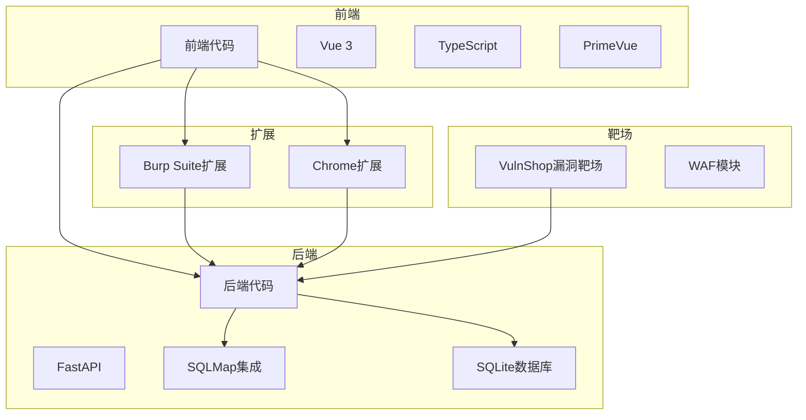
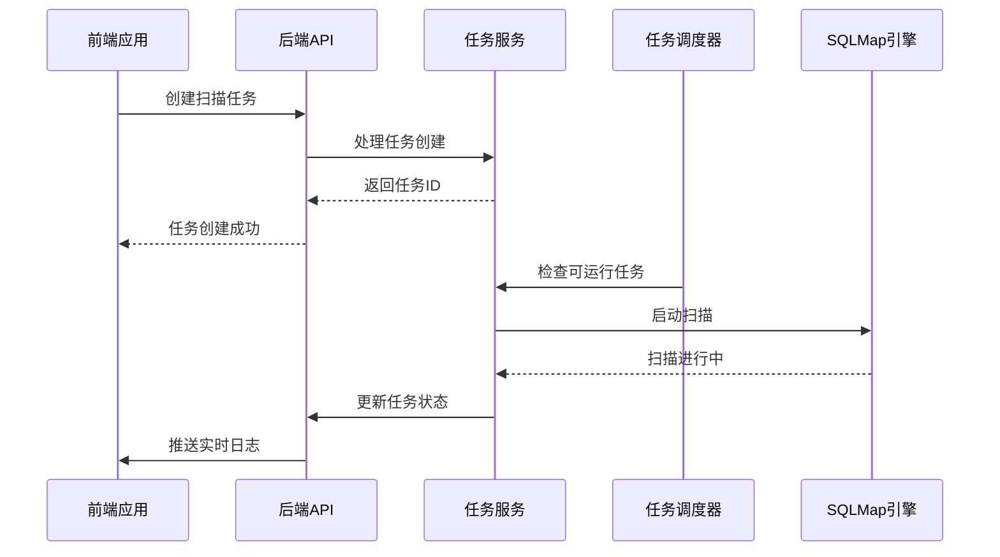
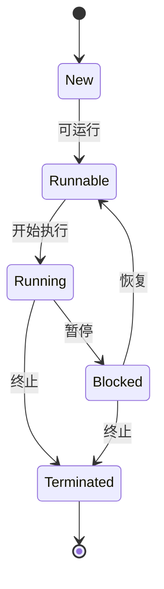
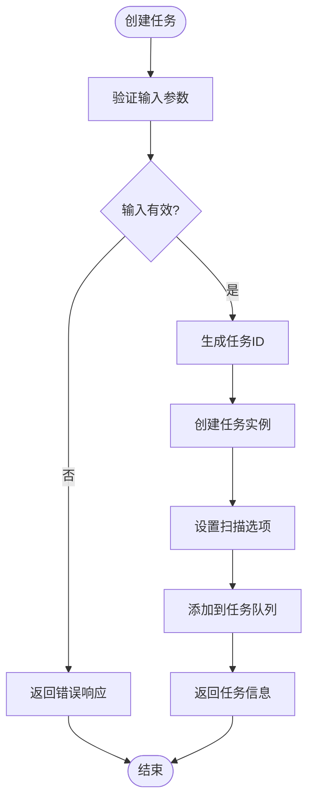
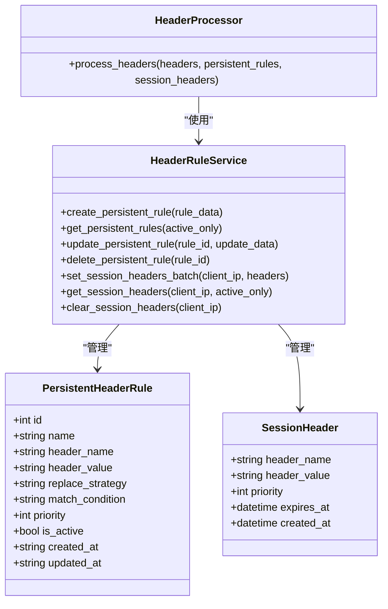
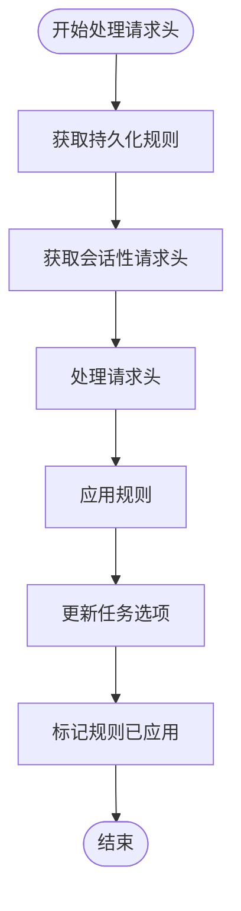
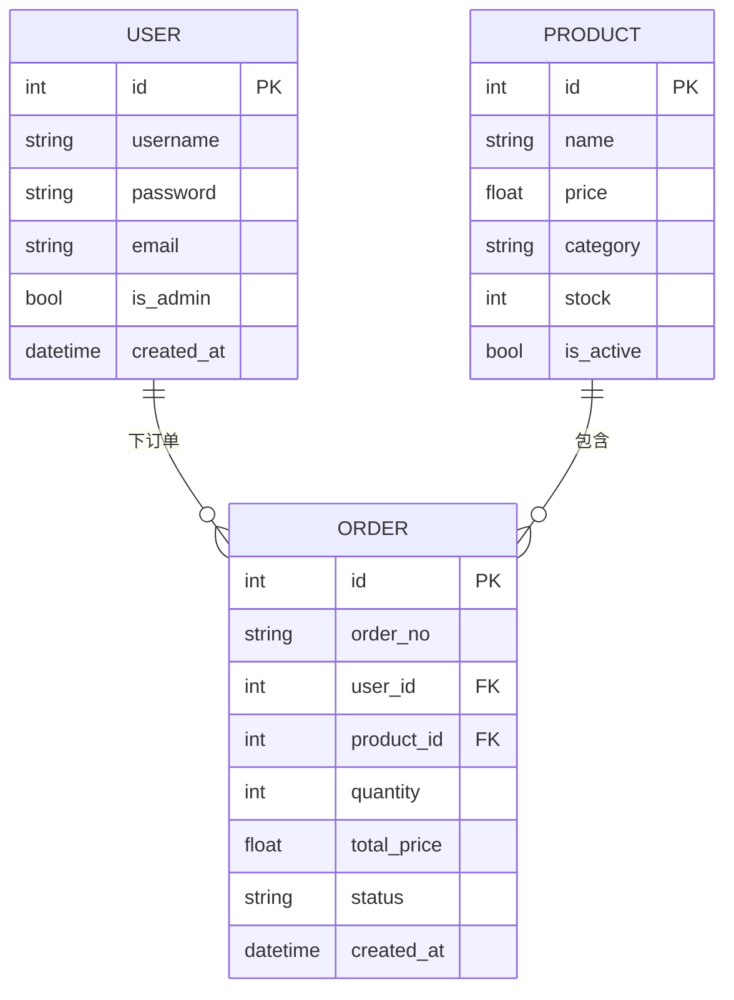
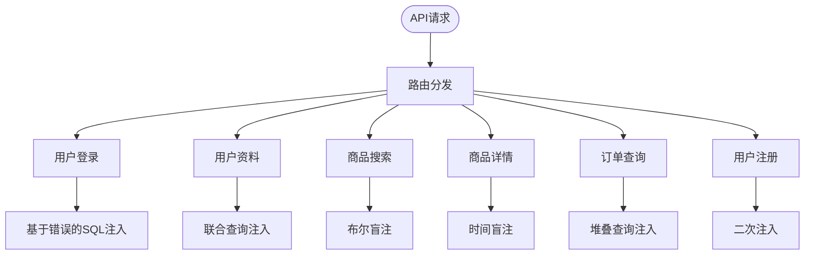
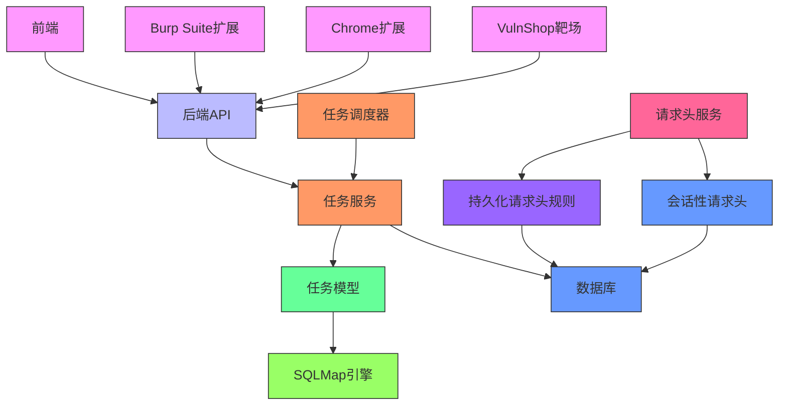

# 漏洞测试实验室

<cite>
**本文档引用文件**   
- [README.md](file://README.md)
- [app.py](file://src/backEnd/app.py)
- [main.py](file://src/backEnd/main.py)
- [config.py](file://src/backEnd/config.py)
- [DataStore.py](file://src/backEnd/model/DataStore.py)
- [Task.py](file://src/backEnd/model/Task.py)
- [taskService.py](file://src/backEnd/service/taskService.py)
- [task_monitor.py](file://src/backEnd/utils/task_monitor.py)
- [headerController.py](file://src/backEnd/api/commonApi/headerController.py)
- [Database.py](file://src/backEnd/model/Database.py)
- [server.py](file://src/vulnTestServer/server.py)
- [SqlmapWebUIExtension.java](file://src/burpEx/montoya-api/src/main/java/com/sqlmapwebui/burp/SqlmapWebUIExtension.java)
</cite>

## 目录
1. [简介](#简介)
2. [项目结构](#项目结构)
3. [核心组件](#核心组件)
4. [架构概览](#架构概览)
5. [详细组件分析](#详细组件分析)
6. [依赖分析](#依赖分析)
7. [性能考虑](#性能考虑)
8. [故障排除指南](#故障排除指南)
9. [结论](#结论)

## 简介
漏洞测试实验室是一个现代化的SQLMap Web界面，为安全研究人员提供便捷的SQL注入测试平台。该项目集成了SQLMap工具，提供了任务管理、实时日志查看、扫描结果展示等功能，并内置了VulnShop漏洞靶场，开箱即用。系统支持通过Chrome扩展和Burp Suite插件从浏览器直接发送请求到扫描平台，极大地提高了安全测试的效率。

## 项目结构
该项目采用前后端分离的架构设计，主要分为后端、前端、Burp Suite扩展和漏洞靶场四个部分。后端使用FastAPI框架，前端使用Vue 3框架，Burp Suite扩展使用Java开发，漏洞靶场使用Python开发。

**图表来源**
- [README.md](file://README.md#L127-L161)

**本节来源**
- [README.md](file://README.md#L127-L161)

## 核心组件
系统的核心组件包括任务管理、请求头规则管理、扫描引擎集成和漏洞靶场。任务管理组件负责创建、监控和停止SQL注入扫描任务；请求头规则管理组件支持持久化和会话性请求头规则的配置；扫描引擎集成组件将SQLMap工具集成到Web平台中；漏洞靶场提供了多种SQL注入漏洞类型供测试。

**本节来源**
- [README.md](file://README.md#L17-L52)
- [app.py](file://src/backEnd/app.py#L17-L74)
- [main.py](file://src/backEnd/main.py#L117-L163)

## 架构概览
系统采用分层架构设计，从前端到后端再到扫描引擎，形成了清晰的调用链路。前端通过API与后端交互，后端通过任务调度器管理扫描任务，并与SQLMap引擎通信。

**图表来源**
- [app.py](file://src/backEnd/app.py#L17-L74)
- [main.py](file://src/backEnd/main.py#L117-L163)
- [taskService.py](file://src/backEnd/service/taskService.py#L58-L88)
- [task_monitor.py](file://src/backEnd/utils/task_monitor.py#L36-L94)

## 详细组件分析

### 任务管理组件分析
任务管理组件是系统的核心，负责处理所有与扫描任务相关的操作，包括任务创建、启动、停止、删除和状态监控。

#### 任务状态管理

**图表来源**
- [Task.py](file://src/backEnd/model/Task.py#L22-L25)
- [taskService.py](file://src/backEnd/service/taskService.py#L80-L83)

#### 任务服务流程

**图表来源**
- [taskService.py](file://src/backEnd/service/taskService.py#L58-L88)

**本节来源**
- [Task.py](file://src/backEnd/model/Task.py)
- [taskService.py](file://src/backEnd/service/taskService.py)
- [task_monitor.py](file://src/backEnd/utils/task_monitor.py)

### 请求头管理组件分析
请求头管理组件支持持久化和会话性两种请求头规则，允许用户灵活配置自定义请求头规则，并支持作用域匹配。

#### 请求头规则类型

**图表来源**
- [headerController.py](file://src/backEnd/api/commonApi/headerController.py#L13-L15)
- [PersistentHeaderRule.py](file://src/backEnd/model/PersistentHeaderRule.py)
- [SessionHeader.py](file://src/backEnd/model/SessionHeader.py)

#### 请求头处理流程

**图表来源**
- [Task.py](file://src/backEnd/model/Task.py#L79-L135)
- [headerController.py](file://src/backEnd/api/commonApi/headerController.py)

**本节来源**
- [headerController.py](file://src/backEnd/api/commonApi/headerController.py)
- [PersistentHeaderRule.py](file://src/backEnd/model/PersistentHeaderRule.py)
- [SessionHeader.py](file://src/backEnd/model/SessionHeader.py)

### 漏洞靶场组件分析
VulnShop漏洞靶场是一个模拟电商平台，包含了多种SQL注入漏洞类型，用于安全测试和教育目的。

#### 靶场漏洞类型

**图表来源**
- [server.py](file://src/vulnTestServer/server.py#L240-L561)

#### 靶场API接口

**图表来源**
- [server.py](file://src/vulnTestServer/server.py#L240-L561)

**本节来源**
- [server.py](file://src/vulnTestServer/server.py)

## 依赖分析
系统依赖关系清晰，各组件之间耦合度适中，便于维护和扩展。

**图表来源**
- [app.py](file://src/backEnd/app.py)
- [main.py](file://src/backEnd/main.py)
- [taskService.py](file://src/backEnd/service/taskService.py)
- [headerController.py](file://src/backEnd/api/commonApi/headerController.py)

**本节来源**
- [app.py](file://src/backEnd/app.py)
- [main.py](file://src/backEnd/main.py)
- [taskService.py](file://src/backEnd/service/taskService.py)

## 性能考虑
系统在性能方面进行了多项优化，包括任务调度、数据库连接和资源管理。

1. **动态任务调度**：任务调度器根据CPU使用率动态调整最大任务数，确保系统资源的合理利用。
2. **数据库连接池**：使用SQLite数据库并实现连接锁定机制，防止并发访问冲突。
3. **内存管理**：通过DataStore类集中管理全局数据，避免内存泄漏。
4. **异步处理**：后端使用FastAPI框架，支持异步处理，提高并发性能。

**本节来源**
- [task_monitor.py](file://src/backEnd/utils/task_monitor.py#L11-L33)
- [Database.py](file://src/backEnd/model/Database.py#L18-L31)
- [DataStore.py](file://src/backEnd/model/DataStore.py)

## 故障排除指南
当系统出现问题时，可以按照以下步骤进行排查：

1. **检查服务状态**：访问`/api/health`端点检查后端服务健康状态。
2. **查看日志文件**：检查后端日志文件，查找错误信息。
3. **验证数据库连接**：确保数据库文件可访问且没有被锁定。
4. **检查任务队列**：查看任务队列状态，确认任务是否被正确添加和执行。
5. **测试API接口**：使用工具测试关键API接口，确认功能正常。

**本节来源**
- [app.py](file://src/backEnd/app.py#L55-L74)
- [taskService.py](file://src/backEnd/service/taskService.py)
- [Database.py](file://src/backEnd/model/Database.py)

## 结论
漏洞测试实验室是一个功能完善的SQL注入测试平台，集成了任务管理、请求头规则、扫描引擎和漏洞靶场等多个组件。系统架构清晰，组件职责明确，便于维护和扩展。通过前后端分离的设计，提供了良好的用户体验和高效的开发模式。内置的VulnShop漏洞靶场为安全测试提供了真实的环境，有助于提高安全研究人员的技能水平。