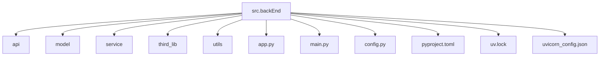
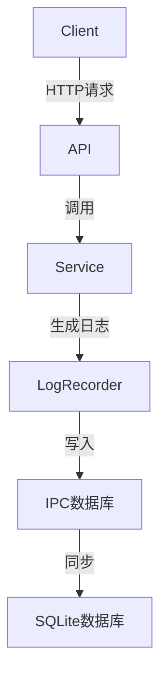
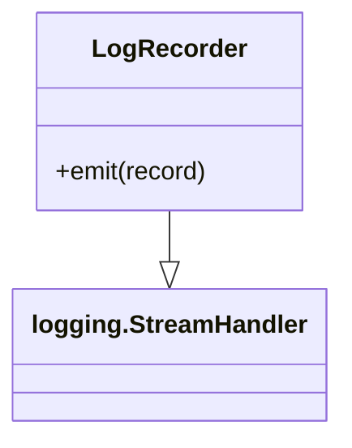
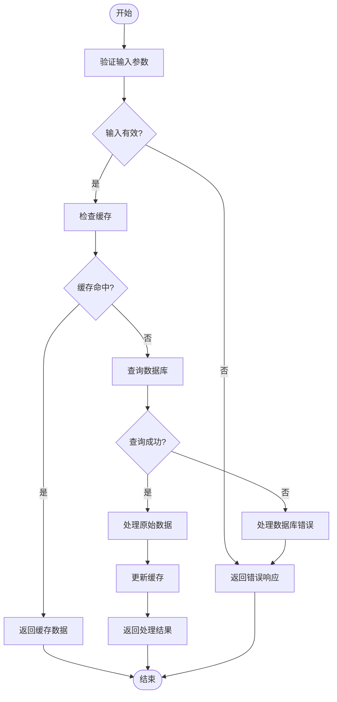
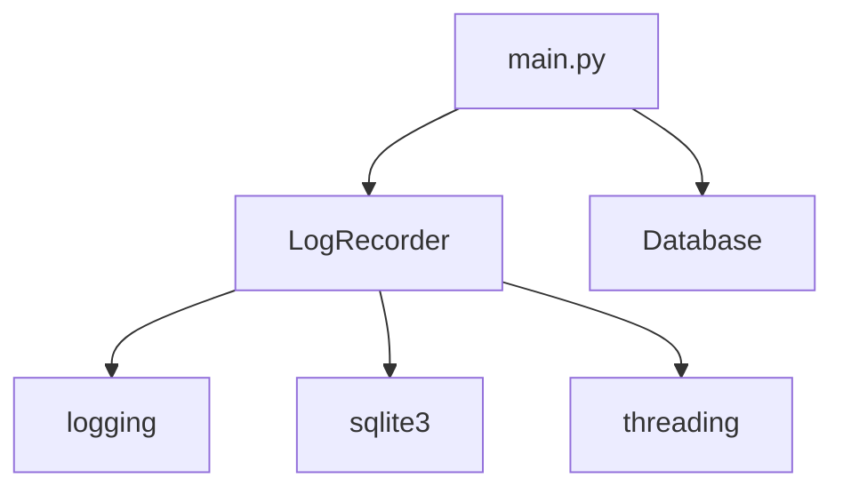

# 日志管理

<cite>
**本文档引用的文件**
- [LogRecorder.py](file://src/backEnd/model/LogRecorder.py)
- [main.py](file://src/backEnd/main.py)
- [Database.py](file://src/backEnd/model/Database.py)
- [DataStore.py](file://src/backEnd/model/DataStore.py)
- [api.py](file://src/backEnd/third_lib/sqlmap/lib/utils/api.py)
- [data.py](file://src/backEnd/third_lib/sqlmap/lib/core/data.py)
</cite>

## 目录
1. [简介](#简介)
2. [项目结构](#项目结构)
3. [核心组件](#核心组件)
4. [架构概述](#架构概述)
5. [详细组件分析](#详细组件分析)
6. [依赖分析](#依赖分析)
7. [性能考虑](#性能考虑)
8. [故障排除指南](#故障排除指南)
9. [结论](#结论)

## 简介
本文档详细解析了`LogRecorder.py`中日志记录器的设计与实现，包括其单例模式的应用、日志级别（DEBUG, INFO, WARNING, ERROR）的控制机制、以及日志格式化策略。说明了日志消息的生成流程，从任务事件触发到最终写入日志文件的完整路径。描述了`main.py`中日志系统的初始化配置，包括日志输出目标（文件、控制台）、日志文件的命名规则和存储路径。提供了日志轮转（rotation）的具体配置，如按大小或时间分割、保留的归档文件数量。阐述了如何通过日志进行问题排查，包括关键操作的审计追踪和错误堆栈的分析方法。给出了日志性能优化建议，如异步写入和批量处理，并说明了在高负载场景下的日志管理最佳实践。

## 项目结构
本项目采用分层架构设计，主要分为后端（backEnd）和第三方库（third_lib）两大部分。后端部分包含了API接口、模型定义、服务逻辑等核心组件，而第三方库则集成了sqlmap等外部工具。项目结构清晰，便于维护和扩展。

**图表来源**
- [main.py](file://src/backEnd/main.py)

**章节来源**
- [main.py](file://src/backEnd/main.py)

## 核心组件
`LogRecorder.py`是本项目中负责日志记录的核心组件。它继承自`logging.StreamHandler`，实现了自定义的日志处理逻辑。通过重写`emit`方法，将日志信息写入到IPC数据库中，实现了异步I/O通信。`main.py`中通过`setRestAPILog`函数初始化日志系统，设置日志级别为DEBUG，并配置日志格式化器。

**章节来源**
- [LogRecorder.py](file://src/backEnd/model/LogRecorder.py)
- [main.py](file://src/backEnd/main.py)

## 架构概述
整个日志管理系统基于Python的`logging`模块构建，通过自定义`LogRecorder`类实现了日志的异步写入。日志信息首先被记录到内存中的IPC数据库，然后由后台进程定期同步到磁盘上的SQLite数据库。这种设计既保证了日志记录的高效性，又确保了数据的持久化。

**图表来源**
- [LogRecorder.py](file://src/backEnd/model/LogRecorder.py)
- [Database.py](file://src/backEnd/model/Database.py)

**章节来源**
- [LogRecorder.py](file://src/backEnd/model/LogRecorder.py)
- [Database.py](file://src/backEnd/model/Database.py)

## 详细组件分析
### LogRecorder分析
`LogRecorder`类是日志记录的核心实现。它通过继承`logging.StreamHandler`，利用Python内置的日志框架，实现了灵活的日志处理机制。`emit`方法是日志记录的关键，它接收一个`record`对象，从中提取日志级别、时间戳、消息内容等信息，并将其插入到IPC数据库中。

#### 类图

**图表来源**
- [LogRecorder.py](file://src/backEnd/model/LogRecorder.py)

#### 日志生成流程

**图表来源**
- [LogRecorder.py](file://src/backEnd/model/LogRecorder.py)

**章节来源**
- [LogRecorder.py](file://src/backEnd/model/LogRecorder.py)

### main.py中的日志系统初始化
`main.py`文件中，通过`setRestAPILog`函数初始化日志系统。该函数首先创建一个`Database`实例，连接到IPC数据库，然后移除默认的日志处理器，添加自定义的`LogRecorder`处理器。此外，还设置了日志级别为DEBUG，并配置了日志格式化器，以便于日后的日志分析。

**章节来源**
- [main.py](file://src/backEnd/main.py)

## 依赖分析
日志管理系统依赖于多个组件，包括`logging`模块、`sqlite3`数据库、`threading`多线程支持等。这些组件共同协作，确保了日志记录的高效性和可靠性。特别是`sqlite3`数据库，作为日志的持久化存储，起到了至关重要的作用。

**图表来源**
- [LogRecorder.py](file://src/backEnd/model/LogRecorder.py)
- [main.py](file://src/backEnd/main.py)
- [Database.py](file://src/backEnd/model/Database.py)

**章节来源**
- [LogRecorder.py](file://src/backEnd/model/LogRecorder.py)
- [main.py](file://src/backEnd/main.py)
- [Database.py](file://src/backEnd/model/Database.py)

## 性能考虑
为了提高日志记录的性能，系统采用了异步写入和批量处理的策略。日志信息首先被写入内存中的IPC数据库，避免了频繁的磁盘I/O操作。后台进程定期将内存中的日志同步到磁盘上的SQLite数据库，减少了对主程序的影响。此外，通过设置合理的日志级别，可以有效减少不必要的日志输出，进一步提升系统性能。

## 故障排除指南
当遇到日志相关的问题时，可以通过以下步骤进行排查：
1. 检查日志级别设置是否正确，确保关键信息被记录。
2. 查看IPC数据库和SQLite数据库的状态，确认日志是否正常写入。
3. 检查`LogRecorder`类的`emit`方法是否有异常抛出。
4. 审查`main.py`中的日志初始化代码，确保所有配置项都已正确设置。

**章节来源**
- [LogRecorder.py](file://src/backEnd/model/LogRecorder.py)
- [main.py](file://src/backEnd/main.py)

## 结论
通过对`LogRecorder.py`和`main.py`的深入分析，我们了解了日志管理系统的整体架构和实现细节。该系统通过异步写入和批量处理的方式，有效地提高了日志记录的性能，同时保证了数据的完整性和可靠性。在实际应用中，可以根据具体需求调整日志级别和存储策略，以达到最佳的性能和可维护性。