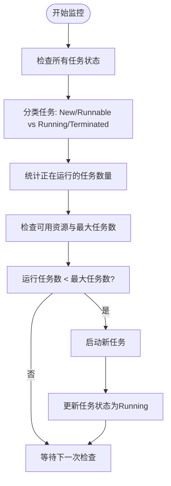
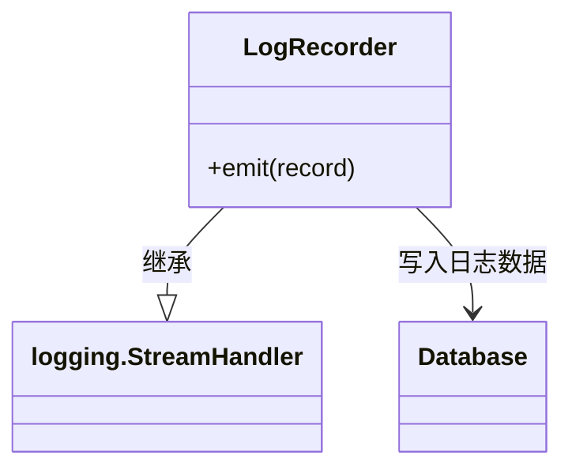
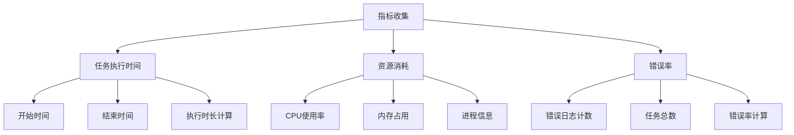

# 监控与日志

<cite>
**本文档引用的文件**  
- [LogRecorder.py](file://src/backEnd/model/LogRecorder.py)
- [task_monitor.py](file://src/backEnd/utils/task_monitor.py)
- [config.py](file://src/backEnd/config.py)
- [Database.py](file://src/backEnd/model/Database.py)
</cite>

## 目录
1. [简介](#简介)
2. [任务监控器工作原理](#任务监控器工作原理)
3. [日志记录策略](#日志记录策略)
4. [系统关键指标收集](#系统关键指标收集)
5. [日志轮转与存储](#日志轮转与存储)
6. [Prometheus与Grafana集成](#prometheus与grafana集成)
7. [异常告警机制](#异常告警机制)
8. [性能瓶颈分析指南](#性能瓶颈分析指南)
9. [系统健康检查清单](#系统健康检查清单)

## 简介
本文档详细说明了SQLMap WebUI系统的监控与日志机制。系统通过任务监控器实现对扫描任务的动态调度与状态管理，同时采用数据库持久化方式记录运行日志。文档涵盖了监控频率、状态检查逻辑、自动恢复机制、日志级别管理、关键指标收集、日志轮转策略以及告警通知机制等核心运维内容。

## 任务监控器工作原理

任务监控器负责管理所有扫描任务的生命周期，包括任务调度、状态检查和资源分配。监控器通过定期检查任务状态来决定是否启动新的可运行任务。

**监控频率**由系统自动调度机制决定，监控器在任务调度循环中持续运行。**状态检查逻辑**基于任务的当前状态（New、Runnable、Running、Terminated）进行判断，只有处于New或Runnable状态的任务才会被考虑执行。

**自动恢复机制**体现在任务状态的动态调整上：当任务引擎终止时，系统会自动将其状态更新为Terminated，从而允许监控器在资源允许的情况下重新调度相关任务。

**Section sources**
- [task_monitor.py](file://src/backEnd/utils/task_monitor.py#L20-L93)

## 日志记录策略

### LogRecorder类日志策略
`LogRecorder`类继承自`logging.StreamHandler`，实现了将日志记录写入IPC数据库的自定义处理程序。所有日志消息都会被持久化存储到数据库中，以便于异步I/O通信和后续分析。

日志记录包含以下关键信息：
- 任务ID (taskid)
- 时间戳 (采用"%X"格式)
- 日志级别 (levelname)
- 日志消息内容 (msg)

**日志级别管理**遵循Python标准库logging模块的级别体系，包括DEBUG、INFO、WARNING、ERROR和CRITICAL等标准级别。系统通过logger对象的不同方法调用来实现不同级别的日志记录。

**Section sources**
- [LogRecorder.py](file://src/backEnd/model/LogRecorder.py#L6-L16)

## 系统关键指标收集

系统通过多种方式收集关键性能指标，为监控和分析提供数据支持。

### 指标收集方式
1. **任务执行时间**：通过记录任务的开始时间和结束时间来计算执行时长
2. **资源消耗**：利用psutil库获取CPU使用率、内存占用等系统资源信息
3. **错误率**：统计数据库errors表中的错误记录数量与总任务数的比例

动态任务数调整基于当前CPU使用率：
- CPU使用率 < 20%：最大任务数 = 逻辑核心数 × 2
- CPU使用率 < 50%：最大任务数 = 逻辑核心数
- CPU使用率 ≥ 50%：最大任务数 = 逻辑核心数 // 2（最小为1）

**Section sources**
- [task_monitor.py](file://src/backEnd/utils/task_monitor.py#L6-L25)
- [Database.py](file://src/backEnd/model/Database.py#L77)

## 日志轮转与存储

### 存储位置
所有日志数据存储在SQLite数据库的`logs`表中，通过IPC机制与主进程通信。数据库连接由`conf.databaseCursor`管理，确保线程安全的访问。

### 轮转策略
系统采用基于数据库表的轮转策略，而非传统的文件轮转。当需要清理旧日志时，可通过SQL语句删除指定时间范围前的日志记录。

### 归档方案
建议的归档方案包括：
1. 定期将数据库中的日志导出为CSV或JSON格式文件
2. 按日期或任务ID对日志进行分区存储
3. 使用外部存储系统（如S3、NAS）保存历史归档日志
4. 建立日志保留策略，自动清理超过保留期限的日志数据

**Section sources**
- [LogRecorder.py](file://src/backEnd/model/LogRecorder.py#L10-L16)
- [Database.py](file://src/backEnd/model/Database.py)

## Prometheus与Grafana集成

### Prometheus指标暴露配置
虽然当前系统未直接集成Prometheus，但可通过以下方式实现指标暴露：

1. **创建指标导出端点**：在Web API中添加专门的/metrics端点
2. **转换数据库指标**：将数据库中的日志和任务数据转换为Prometheus指标格式
3. **暴露关键指标**：
   - sqlmap_tasks_running{taskid} 数量
   - sqlmap_tasks_total 指标
   - sqlmap_cpu_usage_percent 指标
   - sqlmap_memory_usage_bytes 指标
   - sqlmap_errors_total 指标

### Grafana监控面板建议
建议创建以下Grafana监控面板：

1. **任务概览面板**
   - 正在运行的任务数
   - 今日完成任务数
   - 任务成功率/失败率

2. **系统资源面板**
   - CPU使用率趋势图
   - 内存使用情况
   - 进程数量

3. **错误分析面板**
   - 按类型分类的错误统计
   - 错误发生时间分布
   - 高频错误详情

4. **性能分析面板**
   - 任务执行时间分布
   - 平均执行时长趋势
   - 资源消耗与任务数关系

**Section sources**
- [task_monitor.py](file://src/backEnd/utils/task_monitor.py)
- [LogRecorder.py](file://src/backEnd/model/LogRecorder.py)

## 异常告警机制

### 告警触发条件
系统可通过以下条件触发告警：
- 连续多个任务失败
- CPU使用率持续高于阈值（如80%）超过5分钟
- 内存使用率超过安全阈值
- 数据库连接失败
- 关键服务进程异常退出

### 通知策略
建议的告警通知策略包括：
1. **分级通知机制**：
   - 一级告警（严重）：短信+电话+邮件通知
   - 二级告警（重要）：企业微信/钉钉+邮件通知
   - 三级告警（警告）：邮件通知

2. **通知内容应包含**：
   - 告警级别和类型
   - 发生时间
   - 相关任务ID（如有）
   - 错误详情摘要
   - 可能的原因分析
   - 建议的处理措施

3. **静默期设置**：对于已知维护时段或已知问题，可设置告警静默期避免重复通知

**Section sources**
- [task_monitor.py](file://src/backEnd/utils/task_monitor.py)
- [LogRecorder.py](file://src/backEnd/model/LogRecorder.py)

## 性能瓶颈分析指南

### 常见性能瓶颈
1. **CPU瓶颈**：当CPU使用率持续接近100%时，可能导致任务调度延迟
2. **I/O瓶颈**：频繁的数据库读写操作可能成为性能限制因素
3. **内存瓶颈**：大量并发任务可能导致内存不足
4. **网络瓶颈**：目标系统响应慢会影响整体扫描效率

### 分析方法
1. **监控任务队列长度**：观察可运行任务积压情况
2. **分析任务执行时间分布**：识别异常长的任务
3. **检查系统资源使用趋势**：关联资源使用与任务执行情况
4. **审查错误日志模式**：识别重复出现的错误类型

### 优化建议
1. **调整最大任务数**：根据实际硬件配置和工作负载动态调整
2. **优化数据库访问**：考虑对频繁查询的表添加索引
3. **实施任务优先级**：为重要任务分配更高优先级
4. **定期清理历史数据**：避免数据库过大影响性能

**Section sources**
- [task_monitor.py](file://src/backEnd/utils/task_monitor.py)
- [config.py](file://src/backEnd/config.py)

## 系统健康检查清单

### 日常检查项
- [ ] 数据库连接是否正常
- [ ] 任务监控器是否正常运行
- [ ] 系统资源使用是否在正常范围内
- [ ] 日志记录是否正常
- [ ] 无异常堆积的任务

### 周期性检查项
- [ ] 数据库文件大小是否超出预期
- [ ] 磁盘空间是否充足
- [ ] 备份是否成功完成
- [ ] 安全补丁是否及时更新
- [ ] 系统性能是否有下降趋势

### 故障排查步骤
1. 检查`logs`表中最近的错误记录
2. 验证数据库连接状态
3. 检查任务监控器的运行状态
4. 查看系统资源使用情况
5. 确认配置参数是否正确
6. 重启相关服务（如必要）

**Section sources**
- [task_monitor.py](file://src/backEnd/utils/task_monitor.py)
- [LogRecorder.py](file://src/backEnd/model/LogRecorder.py)
- [Database.py](file://src/backEnd/model/Database.py)