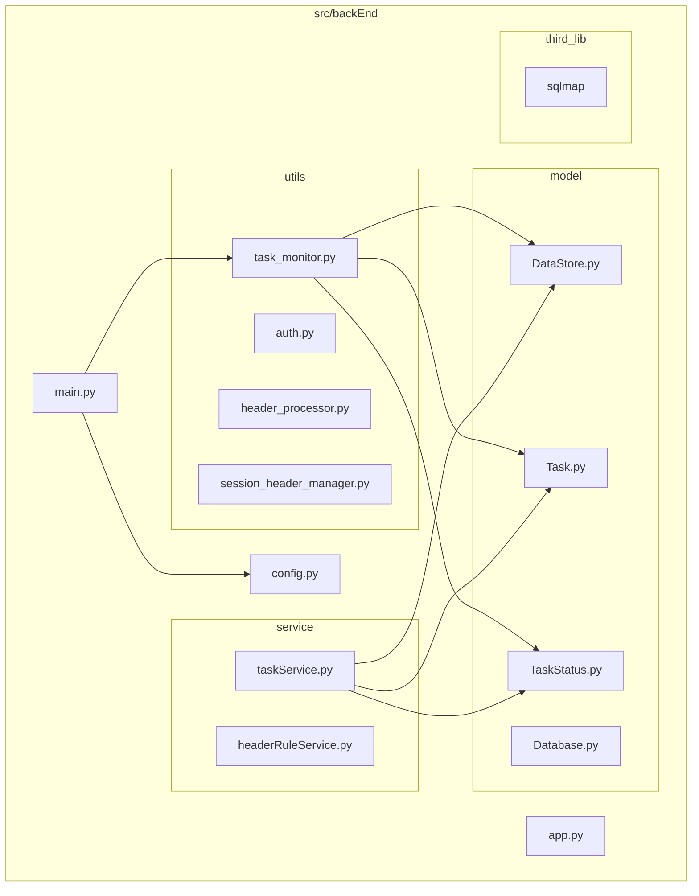
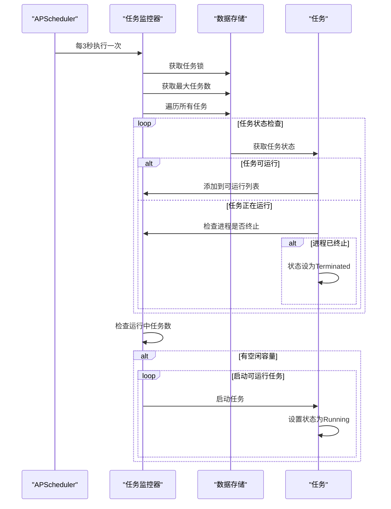
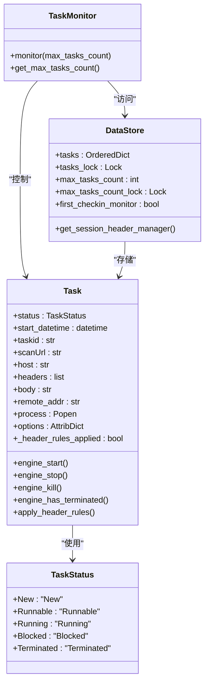
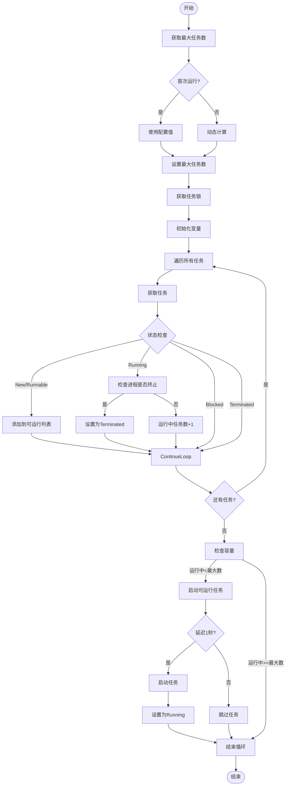
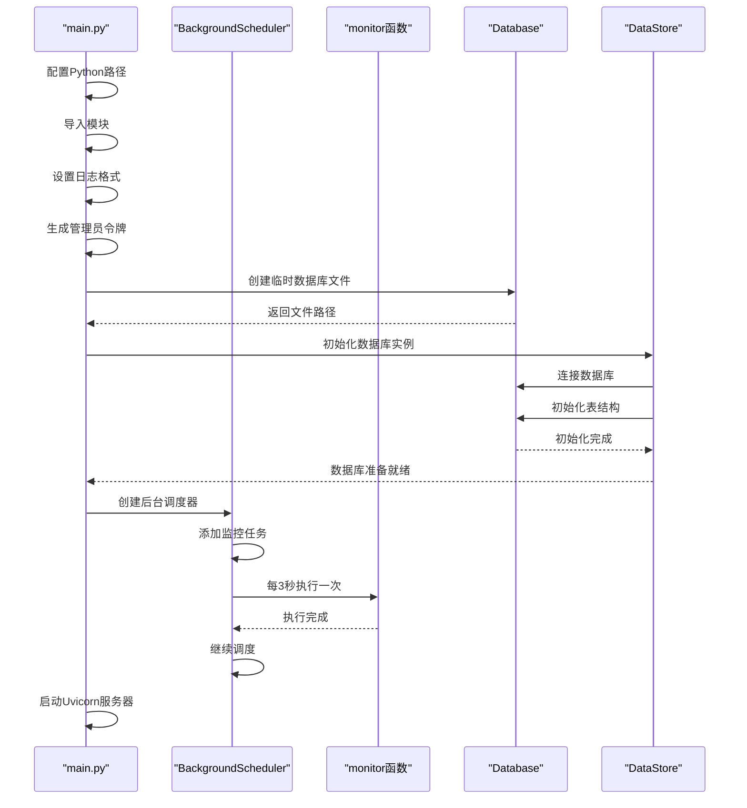
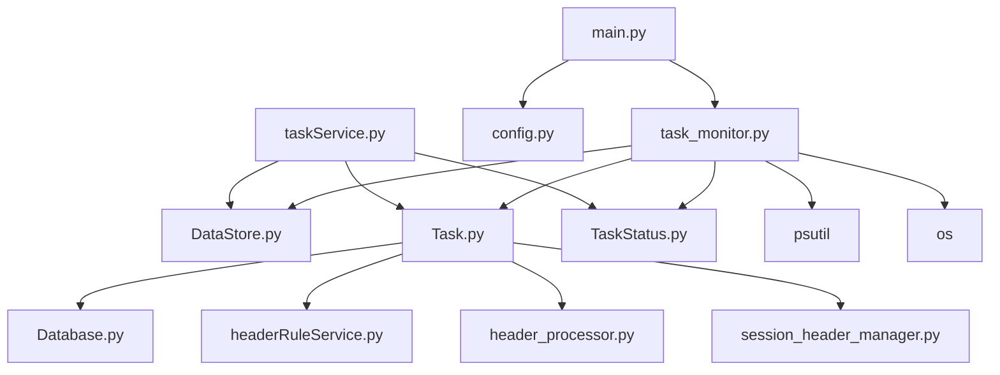

# 系统监控

<cite>
**本文档引用的文件**
- [task_monitor.py](file://src/backEnd/utils/task_monitor.py)
- [main.py](file://src/backEnd/main.py)
- [config.py](file://src/backEnd/config.py)
- [DataStore.py](file://src/backEnd/model/DataStore.py)
- [Task.py](file://src/backEnd/model/Task.py)
- [TaskStatus.py](file://src/backEnd/model/TaskStatus.py)
- [taskService.py](file://src/backEnd/service/taskService.py)
</cite>

## 目录
1. [简介](#简介)
2. [项目结构](#项目结构)
3. [核心组件](#核心组件)
4. [架构概述](#架构概述)
5. [详细组件分析](#详细组件分析)
6. [依赖分析](#依赖分析)
7. [性能考虑](#性能考虑)
8. [故障排除指南](#故障排除指南)
9. [结论](#结论)

## 简介
本文档详细解析了SQLMapWebUI项目中的系统监控机制。重点分析了任务监控器的实现原理，包括监控循环的调度、任务状态轮询逻辑以及自动处理策略。文档还说明了监控服务的初始化流程、关键性能指标的采集方法、系统的可配置性以及为运维人员提供的实用诊断指南。

## 项目结构
项目采用分层架构，主要模块包括API接口、模型定义、服务逻辑和工具函数。监控相关的核心文件位于`utils`目录下的`task_monitor.py`，监控服务的初始化在`main.py`中完成。

**图表来源**
- [task_monitor.py](file://src/backEnd/utils/task_monitor.py)
- [main.py](file://src/backEnd/main.py)
- [DataStore.py](file://src/backEnd/model/DataStore.py)

**章节来源**
- [task_monitor.py](file://src/backEnd/utils/task_monitor.py)
- [main.py](file://src/backEnd/main.py)

## 核心组件
系统监控的核心组件包括任务监控器、任务状态管理器和任务服务。任务监控器负责定期检查任务状态并启动可运行的任务，任务状态管理器定义了任务的生命周期，任务服务提供了对任务的增删改查操作。

**章节来源**
- [task_monitor.py](file://src/backEnd/utils/task_monitor.py)
- [Task.py](file://src/backEnd/model/Task.py)
- [TaskStatus.py](file://src/backEnd/model/TaskStatus.py)

## 架构概述
系统采用基于APScheduler的定时任务监控架构，通过后台调度器定期执行监控函数。监控函数检查任务队列中的任务状态，根据系统负载动态调整最大并发任务数，并启动符合条件的任务。

**图表来源**
- [task_monitor.py](file://src/backEnd/utils/task_monitor.py)
- [main.py](file://src/backEnd/main.py)

## 详细组件分析

### 任务监控器分析
任务监控器是系统监控的核心，负责任务的调度和状态管理。

#### 任务监控类图

**图表来源**
- [task_monitor.py](file://src/backEnd/utils/task_monitor.py)
- [DataStore.py](file://src/backEnd/model/DataStore.py)
- [Task.py](file://src/backEnd/model/Task.py)
- [TaskStatus.py](file://src/backEnd/model/TaskStatus.py)

#### 监控流程图

**图表来源**
- [task_monitor.py](file://src/backEnd/utils/task_monitor.py)

**章节来源**
- [task_monitor.py](file://src/backEnd/utils/task_monitor.py)

### 监控服务初始化分析
监控服务的初始化过程包括配置Python路径、设置日志、初始化数据库和启动调度器。

#### 初始化序列图

**图表来源**
- [main.py](file://src/backEnd/main.py)

**章节来源**
- [main.py](file://src/backEnd/main.py)

## 依赖分析
系统各组件之间存在明确的依赖关系，形成了清晰的调用链。

**图表来源**
- [main.py](file://src/backEnd/main.py)
- [task_monitor.py](file://src/backEnd/utils/task_monitor.py)
- [taskService.py](file://src/backEnd/service/taskService.py)

**章节来源**
- [main.py](file://src/backEnd/main.py)
- [task_monitor.py](file://src/backEnd/utils/task_monitor.py)
- [taskService.py](file://src/backEnd/service/taskService.py)

## 性能考虑
系统在设计时充分考虑了性能因素，通过多种机制确保高效运行。

### 性能指标采集
系统采集以下关键性能指标：
- **任务执行时间**：通过`start_datetime`字段记录任务开始时间
- **CPU占用率**：使用`psutil.cpu_percent()`获取系统CPU使用率
- **内存使用**：通过`psutil`库监控内存消耗
- **任务并发数**：通过`max_tasks_count`控制最大并发任务数

### 动态负载调整
系统根据当前CPU使用率动态调整最大任务数：
- CPU使用率<20%：最大任务数=逻辑核心数×2
- CPU使用率<50%：最大任务数=逻辑核心数
- CPU使用率≥50%：最大任务数=逻辑核心数//2（至少为1）

### 性能优化策略
1. **线程安全**：使用`threading.Lock`保护共享数据
2. **延迟启动**：新任务延迟1秒启动，避免瞬间高负载
3. **资源监控**：实时监控系统资源，动态调整任务调度
4. **连接池**：使用有序字典存储任务，提高查找效率

**章节来源**
- [task_monitor.py](file://src/backEnd/utils/task_monitor.py)
- [DataStore.py](file://src/backEnd/model/DataStore.py)

## 故障排除指南
为运维人员提供以下故障排除和性能诊断指南：

### 监控数据解读
- **任务状态**：New→Runnable→Running→Terminated是正常生命周期
- **CPU使用率**：持续高于80%可能需要增加服务器资源
- **内存消耗**：异常增长可能表明存在内存泄漏
- **任务队列**：长时间积压可能表明并发数设置过低

### 异常模式识别
1. **任务卡死**：任务状态长时间为Running但无进展
   - 检查：`engine_has_terminated()`返回False但无输出
   - 解决：手动终止任务或重启服务

2. **资源耗尽**：CPU或内存持续高占用
   - 检查：`psutil`监控数据
   - 解决：降低`max_tasks_count`或优化任务配置

3. **数据库连接问题**：任务无法写入日志
   - 检查：`DataStore.current_db`是否为None
   - 解决：检查数据库文件权限和磁盘空间

### 容量规划建议
1. **初始配置**：根据服务器CPU核心数设置初始并发数
2. **压力测试**：逐步增加并发任务，观察系统响应
3. **监控告警**：设置CPU、内存使用率阈值告警
4. **弹性扩展**：根据业务需求动态调整最大任务数

5. **性能基准**：建立正常运行时的性能基线，便于异常检测

**章节来源**
- [task_monitor.py](file://src/backEnd/utils/task_monitor.py)
- [taskService.py](file://src/backEnd/service/taskService.py)
- [DataStore.py](file://src/backEnd/model/DataStore.py)

## 结论
本文档详细解析了SQLMapWebUI系统的监控机制。系统通过APScheduler实现定时监控，采用动态负载调整策略优化资源利用，提供了完整的任务生命周期管理。监控服务初始化流程清晰，性能指标采集全面，为系统稳定运行提供了有力保障。运维人员可根据本文档提供的指南进行性能调优和故障排除，确保系统高效稳定运行。