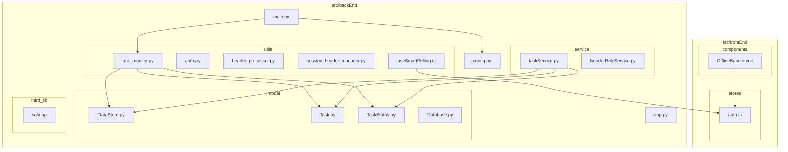
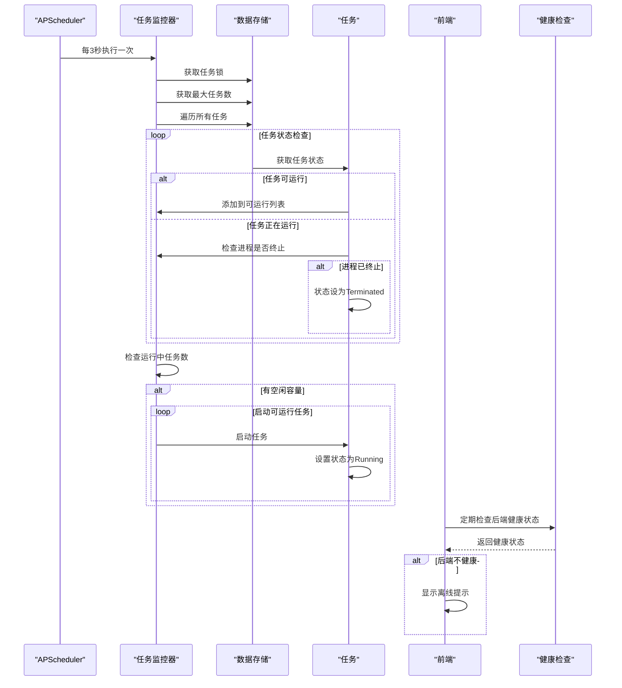
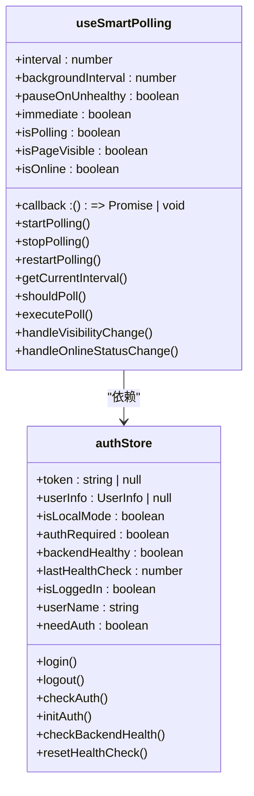
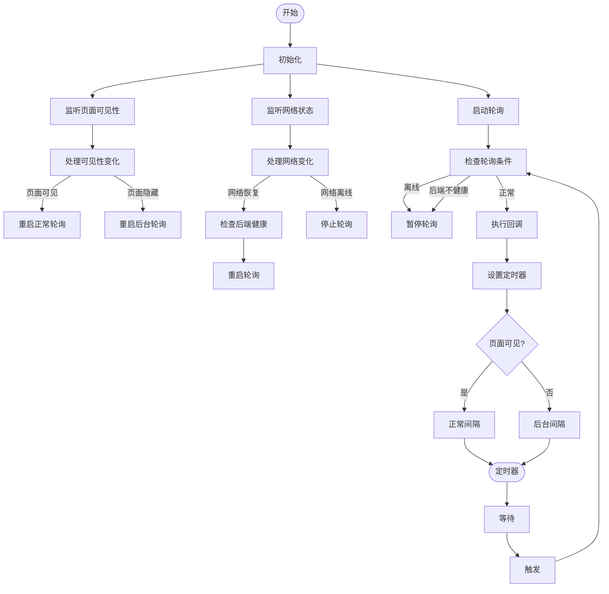
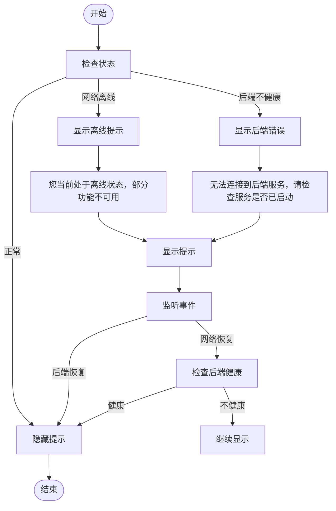
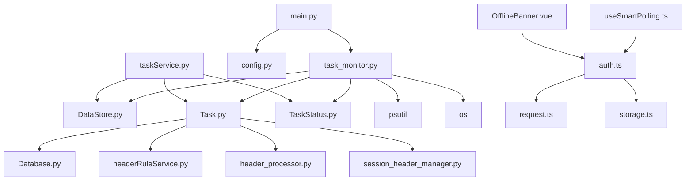

# 系统监控

<cite>
**本文档引用的文件**
- [task_monitor.py](file://src/backEnd/utils/task_monitor.py)
- [main.py](file://src/backEnd/main.py)
- [config.py](file://src/backEnd/config.py)
- [DataStore.py](file://src/backEnd/model/DataStore.py)
- [Task.py](file://src/backEnd/model/Task.py)
- [TaskStatus.py](file://src/backEnd/model/TaskStatus.py)
- [taskService.py](file://src/backEnd/service/taskService.py)
- [useSmartPolling.ts](file://src/frontEnd/src/utils/useSmartPolling.ts) - *新增于最近提交*
- [OfflineBanner.vue](file://src/frontEnd/src/components/OfflineBanner.vue) - *新增于最近提交*
- [auth.ts](file://src/frontEnd/src/stores/auth.ts) - *新增健康检查功能*
</cite>

## 更新摘要
**已更新内容**
- 在“架构概述”部分增加了前端智能轮询机制的说明
- 新增“前端监控机制”章节，详细说明健康检查和离线提示功能
- 更新“故障排除指南”，增加前端监控相关的诊断建议
- 在“依赖分析”中增加了前端组件的依赖关系

**新增内容**
- 新增“前端监控机制”章节，包含智能轮询和离线提示功能的详细说明
- 新增前端健康检查流程图
- 新增前端监控组件类图

**文档来源更新**
- 增加了前端相关文件的引用，包括useSmartPolling.ts、OfflineBanner.vue和auth.ts
- 更新了受影响的章节来源信息

## 目录
1. [简介](#简介)
2. [项目结构](#项目结构)
3. [核心组件](#核心组件)
4. [架构概述](#架构概述)
5. [详细组件分析](#详细组件分析)
6. [前端监控机制](#前端监控机制)
7. [依赖分析](#依赖分析)
8. [性能考虑](#性能考虑)
9. [故障排除指南](#故障排除指南)
10. [结论](#结论)

## 简介
本文档详细解析了SQLMapWebUI项目中的系统监控机制。重点分析了任务监控器的实现原理，包括监控循环的调度、任务状态轮询逻辑以及自动处理策略。文档还说明了监控服务的初始化流程、关键性能指标的采集方法、系统的可配置性以及为运维人员提供的实用诊断指南。本次更新特别增加了前端监控机制的详细说明，包括智能轮询策略和离线提示功能。

## 项目结构
项目采用分层架构，主要模块包括API接口、模型定义、服务逻辑和工具函数。监控相关的核心文件位于`utils`目录下的`task_monitor.py`，监控服务的初始化在`main.py`中完成。前端监控功能实现在`src/frontEnd/src/utils`和`src/frontEnd/src/components`目录下。

**图表来源**
- [task_monitor.py](file://src/backEnd/utils/task_monitor.py)
- [main.py](file://src/backEnd/main.py)
- [DataStore.py](file://src/backEnd/model/DataStore.py)
- [useSmartPolling.ts](file://src/frontEnd/src/utils/useSmartPolling.ts)
- [OfflineBanner.vue](file://src/frontEnd/src/components/OfflineBanner.vue)
- [auth.ts](file://src/frontEnd/src/stores/auth.ts)

**章节来源**
- [task_monitor.py](file://src/backEnd/utils/task_monitor.py)
- [main.py](file://src/backEnd/main.py)
- [useSmartPolling.ts](file://src/frontEnd/src/utils/useSmartPolling.ts)
- [OfflineBanner.vue](file://src/frontEnd/src/components/OfflineBanner.vue)

## 核心组件
系统监控的核心组件包括任务监控器、任务状态管理器、任务服务以及新增的前端监控组件。任务监控器负责定期检查任务状态并启动可运行的任务，任务状态管理器定义了任务的生命周期，任务服务提供了对任务的增删改查操作。前端新增了智能轮询和离线提示组件，增强了用户体验。

**章节来源**
- [task_monitor.py](file://src/backEnd/utils/task_monitor.py)
- [Task.py](file://src/backEnd/model/Task.py)
- [TaskStatus.py](file://src/backEnd/model/TaskStatus.py)
- [useSmartPolling.ts](file://src/frontEnd/src/utils/useSmartPolling.ts)
- [OfflineBanner.vue](file://src/frontEnd/src/components/OfflineBanner.vue)

## 架构概述
系统采用基于APScheduler的定时任务监控架构，通过后台调度器定期执行监控函数。监控函数检查任务队列中的任务状态，根据系统负载动态调整最大并发任务数，并启动符合条件的任务。前端新增了智能轮询机制，通过健康检查端点监控后端服务状态，并在服务不可用时向用户展示离线提示。

**图表来源**
- [task_monitor.py](file://src/backEnd/utils/task_monitor.py)
- [main.py](file://src/backEnd/main.py)
- [useSmartPolling.ts](file://src/frontEnd/src/utils/useSmartPolling.ts)
- [auth.ts](file://src/frontEnd/src/stores/auth.ts)

## 详细组件分析

### 任务监控器分析
任务监控器是系统监控的核心，负责任务的调度和状态管理。

#### 任务监控类图

**图表来源**
- [task_monitor.py](file://src/backEnd/utils/task_monitor.py)
- [DataStore.py](file://src/backEnd/model/DataStore.py)
- [Task.py](file://src/backEnd/model/Task.py)
- [TaskStatus.py](file://src/backEnd/model/TaskStatus.py)

#### 监控流程图

**图表来源**
- [task_monitor.py](file://src/backEnd/utils/task_monitor.py)

**章节来源**
- [task_monitor.py](file://src/backEnd/utils/task_monitor.py)

### 监控服务初始化分析
监控服务的初始化过程包括配置Python路径、设置日志、初始化数据库和启动调度器。

#### 初始化序列图

**图表来源**
- [main.py](file://src/backEnd/main.py)

**章节来源**
- [main.py](file://src/backEnd/main.py)

## 前端监控机制
前端新增了智能轮询和离线提示功能，增强了系统的主动监控能力和用户体验。

### 智能轮询策略
前端实现了智能轮询Hook，支持页面可见性监听、网络状态监听和健康检查。

#### 智能轮询类图

**图表来源**
- [useSmartPolling.ts](file://src/frontEnd/src/utils/useSmartPolling.ts)
- [auth.ts](file://src/frontEnd/src/stores/auth.ts)

#### 智能轮询流程图

**图表来源**
- [useSmartPolling.ts](file://src/frontEnd/src/utils/useSmartPolling.ts)

**章节来源**
- [useSmartPolling.ts](file://src/frontEnd/src/utils/useSmartPolling.ts)

### 离线提示功能
当健康检查失败或网络离线时，系统会向用户展示离线提示。

#### 离线提示流程图

**图表来源**
- [OfflineBanner.vue](file://src/frontEnd/src/components/OfflineBanner.vue)
- [auth.ts](file://src/frontEnd/src/stores/auth.ts)

**章节来源**
- [OfflineBanner.vue](file://src/frontEnd/src/components/OfflineBanner.vue)

## 依赖分析
系统各组件之间存在明确的依赖关系，形成了清晰的调用链。

**图表来源**
- [main.py](file://src/backEnd/main.py)
- [task_monitor.py](file://src/backEnd/utils/task_monitor.py)
- [taskService.py](file://src/backEnd/service/taskService.py)
- [useSmartPolling.ts](file://src/frontEnd/src/utils/useSmartPolling.ts)
- [OfflineBanner.vue](file://src/frontEnd/src/components/OfflineBanner.vue)
- [auth.ts](file://src/frontEnd/src/stores/auth.ts)

**章节来源**
- [main.py](file://src/backEnd/main.py)
- [task_monitor.py](file://src/backEnd/utils/task_monitor.py)
- [taskService.py](file://src/backEnd/service/taskService.py)
- [useSmartPolling.ts](file://src/frontEnd/src/utils/useSmartPolling.ts)
- [OfflineBanner.vue](file://src/frontEnd/src/components/OfflineBanner.vue)

## 性能考虑
系统在设计时充分考虑了性能因素，通过多种机制确保高效运行。

### 性能指标采集
系统采集以下关键性能指标：
- **任务执行时间**：通过`start_datetime`字段记录任务开始时间
- **CPU占用率**：使用`psutil.cpu_percent()`获取系统CPU使用率
- **内存使用**：通过`psutil`库监控内存消耗
- **任务并发数**：通过`max_tasks_count`控制最大并发任务数

### 动态负载调整
系统根据当前CPU使用率动态调整最大任务数：
- CPU使用率<20%：最大任务数=逻辑核心数×2
- CPU使用率<50%：最大任务数=逻辑核心数
- CPU使用率≥50%：最大任务数=逻辑核心数//2（至少为1）

### 性能优化策略
1. **线程安全**：使用`threading.Lock`保护共享数据
2. **延迟启动**：新任务延迟1秒启动，避免瞬间高负载
3. **资源监控**：实时监控系统资源，动态调整任务调度
4. **连接池**：使用有序字典存储任务，提高查找效率
5. **智能轮询**：根据页面可见性和网络状态调整轮询频率，减少不必要的请求

**章节来源**
- [task_monitor.py](file://src/backEnd/utils/task_monitor.py)
- [DataStore.py](file://src/backEnd/model/DataStore.py)
- [useSmartPolling.ts](file://src/frontEnd/src/utils/useSmartPolling.ts)

## 故障排除指南
为运维人员提供以下故障排除和性能诊断指南：

### 监控数据解读
- **任务状态**：New→Runnable→Running→Terminated是正常生命周期
- **CPU使用率**：持续高于80%可能需要增加服务器资源
- **内存消耗**：异常增长可能表明存在内存泄漏
- **任务队列**：长时间积压可能表明并发数设置过低
- **前端健康检查**：频繁的健康检查失败可能表明后端服务不稳定

### 异常模式识别
1. **任务卡死**：任务状态长时间为Running但无进展
   - 检查：`engine_has_terminated()`返回False但无输出
   - 解决：手动终止任务或重启服务

2. **资源耗尽**：CPU或内存持续高占用
   - 检查：`psutil`监控数据
   - 解决：降低`max_tasks_count`或优化任务配置

3. **数据库连接问题**：任务无法写入日志
   - 检查：`DataStore.current_db`是否为None
   - 解决：检查数据库文件权限和磁盘空间

4. **前端离线提示**：用户频繁看到离线提示
   - 检查：后端健康检查接口响应时间和成功率
   - 解决：优化后端服务性能或调整健康检查超时设置

### 容量规划建议
1. **初始配置**：根据服务器CPU核心数设置初始并发数
2. **压力测试**：逐步增加并发任务，观察系统响应
3. **监控告警**：设置CPU、内存使用率阈值告警
4. **弹性扩展**：根据业务需求动态调整最大任务数
5. **性能基准**：建立正常运行时的性能基线，便于异常检测
6. **健康检查优化**：合理设置健康检查间隔，避免对后端造成过大压力

**章节来源**
- [task_monitor.py](file://src/backEnd/utils/task_monitor.py)
- [taskService.py](file://src/backEnd/service/taskService.py)
- [DataStore.py](file://src/backEnd/model/DataStore.py)
- [useSmartPolling.ts](file://src/frontEnd/src/utils/useSmartPolling.ts)
- [OfflineBanner.vue](file://src/frontEnd/src/components/OfflineBanner.vue)

## 结论
本文档详细解析了SQLMapWebUI系统的监控机制。系统通过APScheduler实现定时监控，采用动态负载调整策略优化资源利用，提供了完整的任务生命周期管理。监控服务初始化流程清晰，性能指标采集全面，为系统稳定运行提供了有力保障。新增的前端智能轮询和离线提示功能，显著提升了用户体验和系统的可观测性。运维人员可根据本文档提供的指南进行性能调优和故障排除，确保系统高效稳定运行。