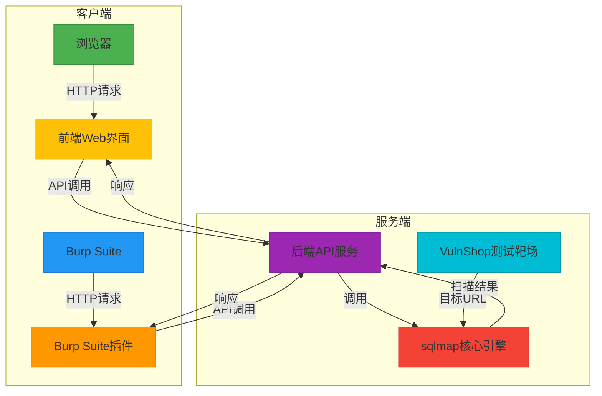
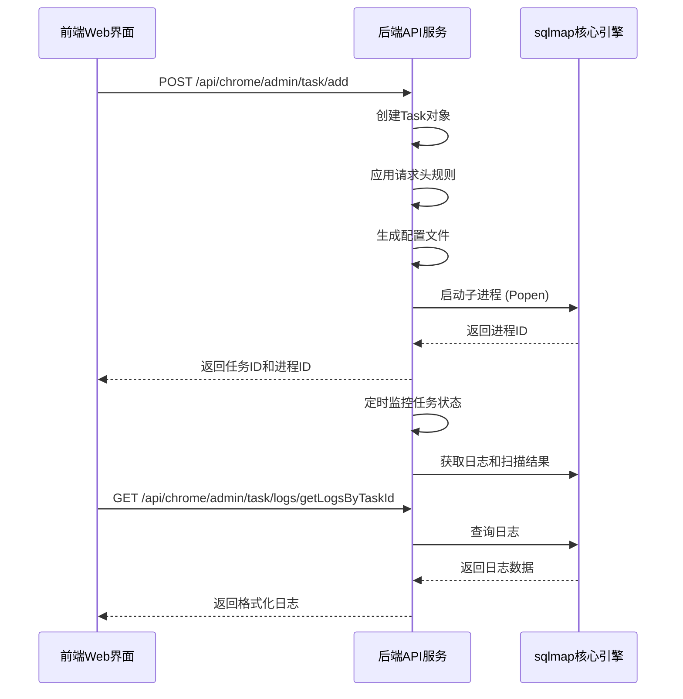
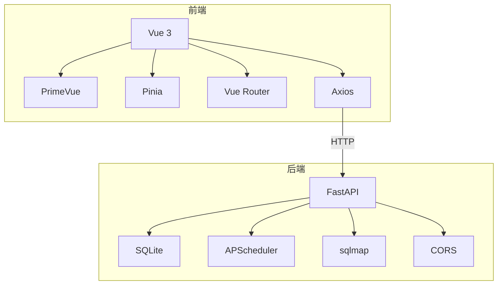

# 系统概述

<cite>
**本文档引用的文件**  
- [README.md](file://README.md)
- [src/backEnd/README.md](file://src/backEnd/README.md)
- [src/burpEx/README.md](file://src/burpEx/README.md)
- [src/frontEnd/README.md](file://src/frontEnd/README.md)
- [src/vulnTestServer/README.md](file://src/vulnTestServer/README.md)
- [src/backEnd/app.py](file://src/backEnd/app.py)
- [src/backEnd/main.py](file://src/backEnd/main.py)
- [src/backEnd/model/Task.py](file://src/backEnd/model/Task.py)
- [src/backEnd/service/taskService.py](file://src/backEnd/service/taskService.py)
- [src/backEnd/utils/header_processor.py](file://src/backEnd/utils/header_processor.py)
- [src/frontEnd/src/main.ts](file://src/frontEnd/src/main.ts)
- [src/frontEnd/src/router/index.ts](file://src/frontEnd/src/router/index.ts)
- [src/frontEnd/src/stores/task.ts](file://src/frontEnd/src/stores/task.ts)
- [src/frontEnd/src/api/task.ts](file://src/frontEnd/src/api/task.ts)
- [src/frontEnd/src/views/Home/index.vue](file://src/frontEnd/src/views/Home/index.vue)
</cite>

## 目录
1. [简介](#简介)
2. [核心目标](#核心目标)
3. [整体架构](#整体架构)
4. [主要功能](#主要功能)
5. [与sqlmap核心引擎的集成](#与sqlmap核心引擎的集成)
6. [前后端分离架构](#前后端分离架构)
7. [Burp Suite插件集成](#burp-suite插件集成)
8. [VulnShop测试靶场](#vulnshop测试靶场)
9. [系统工作流程示例](#系统工作流程示例)
10. [设计理念与安全考虑](#设计理念与安全考虑)

## 简介

sqlmapWebUI是一个现代化的SQL注入自动化检测Web UI平台，旨在为安全研究人员提供一个便捷、直观的SQL注入测试环境。该项目基于前后端分离架构，前端采用Vue 3 + TypeScript + PrimeVue构建，后端采用FastAPI框架，集成了强大的sqlmap核心引擎。

项目内置了VulnShop漏洞靶场，开箱即用，方便用户进行学习和测试。同时，提供了与Burp Suite的深度集成，支持通过右键菜单直接将请求发送到Web UI进行扫描，极大地提升了渗透测试的工作效率。

本系统概述文档将详细介绍sqlmapWebUI的核心目标、整体架构、主要功能以及关键组件之间的关系，为初学者提供概念性介绍，同时为经验丰富的开发者提供技术细节。

## 核心目标

sqlmapWebUI项目的核心目标是创建一个用户友好、功能全面的SQL注入自动化检测平台，主要体现在以下几个方面：

1.  **降低使用门槛**：通过图形化界面（GUI）和引导式参数编辑器，使用户无需记忆复杂的sqlmap命令行参数，即可轻松配置和执行扫描任务。
2.  **提升工作效率**：提供任务管理、批量操作、实时日志监控等功能，让安全研究人员能够高效地管理多个扫描任务。
3.  **增强功能集成**：深度集成Burp Suite，实现从代理工具到自动化扫描的无缝衔接，优化渗透测试工作流。
4.  **提供学习环境**：内置VulnShop测试靶场，包含多种类型的SQL注入漏洞，为安全学习和培训提供实践平台。
5.  **保证系统安全**：设计了双模式认证机制，并在文档中明确强调了安全声明和使用限制，确保工具仅用于授权的安全测试。

## 整体架构

sqlmapWebUI采用典型的前后端分离架构，由三个主要组件构成：**前端Web界面**、**后端API服务**和**sqlmap核心引擎**。此外，还包括**Burp Suite插件**和**VulnShop测试靶场**作为重要的扩展和配套组件。

**架构说明**：
- **前端Web界面**：运行在浏览器中，负责用户交互和界面展示。
- **Burp Suite插件**：作为Burp Suite的扩展，负责将选中的HTTP请求转发给后端服务。
- **后端API服务**：基于FastAPI构建，是整个系统的核心，负责接收来自前端和插件的请求，管理任务状态，并与sqlmap引擎进行交互。
- **sqlmap核心引擎**：作为git submodule集成在项目中，负责执行实际的SQL注入检测。
- **VulnShop测试靶场**：一个独立的Flask应用，为用户提供一个安全的、可控制的测试环境。

**Diagram sources**
- [README.md](file://README.md#L1-L321)
- [src/backEnd/README.md](file://src/backEnd/README.md#L1-L292)
- [src/burpEx/README.md](file://src/burpEx/README.md#L1-L229)

## 主要功能

sqlmapWebUI提供了丰富且实用的功能，涵盖了SQL注入测试的各个方面。

### 任务管理
系统提供了完整的任务生命周期管理功能，包括：
- **创建任务**：支持通过输入目标URL或导入完整的HTTP请求来创建扫描任务。
- **监控任务**：提供实时日志输出，让用户可以直观地看到扫描的进度和发现。
- **停止/删除任务**：支持对单个或多个任务进行停止或删除操作。
- **任务列表增强**：支持多维度过滤（URL/报文关键字、状态、日期范围）、多字段排序和智能轮询。

### 扫描配置管理
为了简化sqlmap的复杂参数，系统提供了强大的配置管理功能：
- **默认配置**：设置全局的默认扫描参数。
- **常用配置**：保存常用的配置组合，支持CRUD操作，方便快速调用。
- **历史配置**：自动记录历史扫描使用的配置，便于复用。
- **引导式编辑器**：通过可视化界面配置Level、Risk、DBMS、Technique等参数，无需记忆命令行。

### HTTP请求解析
系统支持多种格式的HTTP请求输入，包括：
- cURL (Bash/CMD)
- PowerShell Invoke-WebRequest
- JavaScript fetch
- 原始HTTP报文
系统具备智能格式检测能力，并提供带有行号显示和语法高亮的代码编辑器，方便用户查看和编辑请求。

### 请求头规则管理
这是一个非常强大的功能，允许用户创建持久化或临时的请求头规则：
- **持久化规则**：长期有效的规则，存储在SQLite数据库中。
- **会话级规则**：临时规则，支持TTL自动过期，存储在内存中。
- **作用域配置**：规则可以配置作用域，支持协议、主机名、端口、路径匹配，以及通配符和正则表达式。
- **批量导入**：支持从文本中批量导入请求头。

### 扩展集成
系统与Burp Suite实现了深度集成：
- **右键菜单**：在Burp Suite中选中请求，右键即可选择“Send to SQLMap WebUI”。
- **配置选择**：发送时可选择使用默认配置、常用配置或自定义参数。
- **活动日志**：记录所有发送操作，便于审计。

**Section sources**
- [README.md](file://README.md#L1-L321)
- [src/backEnd/README.md](file://src/backEnd/README.md#L1-L292)
- [src/frontEnd/README.md](file://src/frontEnd/README.md#L1-L221)

## 与sqlmap核心引擎的集成

sqlmapWebUI的核心功能依赖于与sqlmap核心引擎的紧密集成。这种集成是通过后端服务作为中间层来实现的。

**集成流程说明**：
1.  **任务创建**：当用户在前端创建任务时，前端会通过API将目标URL、HTTP请求和扫描参数发送到后端。
2.  **任务初始化**：后端的`TaskService`接收到请求后，会创建一个`Task`对象，并初始化其状态和配置。
3.  **应用规则**：在启动sqlmap之前，`Task`对象会调用`HeaderProcessor`来应用持久化和会话级的请求头规则。
4.  **启动引擎**：后端通过`Popen`子进程的方式启动sqlmap，并传递一个临时生成的配置文件（`.conf`）和`--api`参数，使其以API模式运行。
5.  **状态监控**：后端通过一个后台调度器（`BackgroundScheduler`）定期调用`taskMonitor`来检查所有任务的状态，并将结果存储在内存和SQLite数据库中。
6.  **结果获取**：前端通过API查询任务日志和扫描结果时，后端会从其管理的数据库中读取数据并返回给前端。

**Diagram sources**
- [src/backEnd/main.py](file://src/backEnd/main.py#L1-L168)
- [src/backEnd/model/Task.py](file://src/backEnd/model/Task.py#L1-L333)
- [src/backEnd/service/taskService.py](file://src/backEnd/service/taskService.py#L1-L535)

## 前后端分离架构

sqlmapWebUI采用了现代化的前后端分离架构，前端和后端各自独立开发、部署和运行。

### 前端架构
前端基于Vue 3生态系统构建，主要技术栈包括：
- **Vue 3**：渐进式JavaScript框架，使用Composition API。
- **TypeScript**：为代码提供类型安全。
- **PrimeVue**：企业级UI组件库，提供丰富的UI组件。
- **Pinia**：Vue的状态管理库，用于管理任务、配置等全局状态。
- **Vite**：下一代前端构建工具，提供快速的开发服务器和高效的生产构建。

前端通过`axios`库与后端API进行通信，使用`vue-router`实现页面路由。状态管理通过Pinia实现，例如`taskStore`负责管理所有任务相关的状态和操作。

### 后端架构
后端基于FastAPI构建，主要技术栈包括：
- **FastAPI**：高性能的Python Web框架，支持异步编程。
- **Uvicorn**：ASGI服务器，用于运行FastAPI应用。
- **SQLite**：轻量级数据库，用于持久化存储请求头规则和扫描配置。
- **APScheduler**：用于后台任务调度，如定时监控任务状态。

后端的API路由清晰地划分了不同的功能模块，如`chromeExApi`、`burpSuiteExApi`和`commonApi`。业务逻辑封装在`service`层，数据模型定义在`model`层。

**Diagram sources**
- [src/frontEnd/README.md](file://src/frontEnd/README.md#L1-L221)
- [src/backEnd/README.md](file://src/backEnd/README.md#L1-L292)
- [src/backEnd/app.py](file://src/backEnd/app.py#L1-L80)

## Burp Suite插件集成

Burp Suite插件是sqlmapWebUI的一个重要扩展，它实现了与流行渗透测试代理工具的无缝集成。

### 插件功能
- **版本支持**：提供两个版本的插件，分别支持Burp Suite的Montoya API（推荐，Java 17+）和Legacy API（Java 11+）。
- **右键菜单**：在Burp Suite的Proxy、Repeater、Target等模块中，选中HTTP请求后，右键菜单会增加“Send to SQLMap WebUI”选项。
- **配置管理**：插件内置了配置管理界面，用户可以设置后端服务器地址，并管理默认配置和常用配置。
- **活动日志**：记录所有发送到后端的操作，包括请求和响应状态。

### 集成流程
1.  **安装插件**：用户将编译好的JAR文件加载到Burp Suite中。
2.  **配置连接**：在插件的“服务器配置”标签页中，设置后端API的URL（如`http://localhost:8775`）。
3.  **发送请求**：在Burp Suite中选中一个HTTP请求，右键选择“Send to SQLMap WebUI”。
4.  **后端处理**：插件通过HTTP POST请求将请求数据发送到后端的`/burp/admin/scan`端点。
5.  **任务创建**：后端接收到请求后，将其转换为一个扫描任务并启动。
6.  **结果查看**：用户需要切换到Web前端界面来查看任务的详细日志和扫描结果。

**Section sources**
- [src/burpEx/README.md](file://src/burpEx/README.md#L1-L229)
- [src/backEnd/README.md](file://src/backEnd/README.md#L1-L292)

## VulnShop测试靶场

VulnShop是sqlmapWebUI项目内置的一个专门用于SQL注入测试和学习的漏洞靶场。

### 核心特性
- **多种注入类型**：支持8种常见的SQL注入漏洞，包括Error-based、Union-based、Boolean-blind、Time-based、Stacked Queries和2nd Order等。
- **WAF防护**：提供Easy、Medium、Hard三种难度级别，模拟不同强度的WAF防护，用于测试绕过技术。
- **现代化UI**：拥有一个完整的电商购物流程界面，支持亮色/暗色主题切换，提升用户体验。
- **一键重置**：可以随时重置数据库，恢复到初始状态。

### 技术栈
- **后端**：Python 3 + Flask
- **数据库**：SQLite3
- **前端**：纯HTML + CSS + JavaScript

VulnShop仅绑定在`127.0.0.1`上，禁止暴露到公网，确保了其作为本地测试环境的安全性。

**Section sources**
- [src/vulnTestServer/README.md](file://src/vulnTestServer/README.md#L1-L254)
- [README.md](file://README.md#L1-L321)

## 系统工作流程示例

以下是一个从Burp Suite发送请求到Web UI进行扫描的完整工作流程示例：

1.  **启动服务**：首先启动后端API服务（`uv run python main.py`）、前端开发服务器（`pnpm run dev`）和VulnShop靶场（`python server.py`）。
2.  **配置Burp插件**：在Burp Suite中加载插件JAR文件，并在插件的“服务器配置”中设置后端URL为`http://localhost:8775`。
3.  **捕获请求**：在浏览器中访问VulnShop靶场（`http://127.0.0.1:9527`），并登录。在Burp Suite的Proxy模块中，可以捕获到登录请求。
4.  **发送请求**：在Burp Suite中右键点击该登录请求，选择“Send to SQLMap WebUI”。
5.  **任务创建**：插件会将请求数据发送到后端的`/burp/admin/scan`端点。后端创建一个新的扫描任务，并返回任务ID。
6.  **监控扫描**：用户打开Web前端界面（`http://localhost:5173`），在任务列表中可以看到新创建的任务。点击任务可以查看实时日志。
7.  **查看结果**：扫描完成后，可以在任务详情页的“扫描结果”Tab中查看到具体的注入点和Payload信息。

这个流程展示了sqlmapWebUI如何将Burp Suite的交互式测试与sqlmap的自动化检测能力结合起来，形成一个高效的工作流。

**Section sources**
- [README.md](file://README.md#L1-L321)
- [src/burpEx/README.md](file://src/burpEx/README.md#L1-L229)

## 设计理念与安全考虑

### 设计理念
- **用户友好**：通过图形化界面和引导式操作，降低安全工具的使用门槛。
- **模块化设计**：前后端分离，功能模块清晰，便于维护和扩展。
- **开箱即用**：内置VulnShop靶场，用户无需额外配置即可开始测试。
- **高性能**：使用FastAPI和Vite等现代技术栈，保证系统的响应速度。

### 安全考虑
- **安全声明**：项目文档中明确强调，本工具仅供授权安全测试使用，禁止用于非法用途。
- **本地绑定**：VulnShop靶场仅绑定在`127.0.0.1`，防止意外暴露到公网。
- **认证机制**：前端实现了双模式认证，本地访问自动跳过，远程访问需要Token认证。
- **输入验证**：后端对所有API输入进行验证，防止恶意请求。

**Section sources**
- [README.md](file://README.md#L1-L321)
- [src/frontEnd/README.md](file://src/frontEnd/README.md#L1-L221)
- [src/backEnd/README.md](file://src/backEnd/README.md#L1-L292)