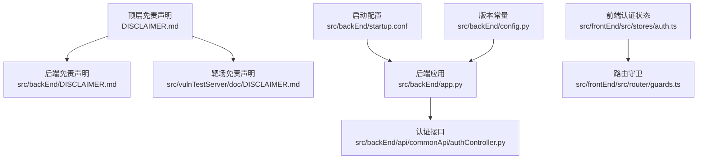
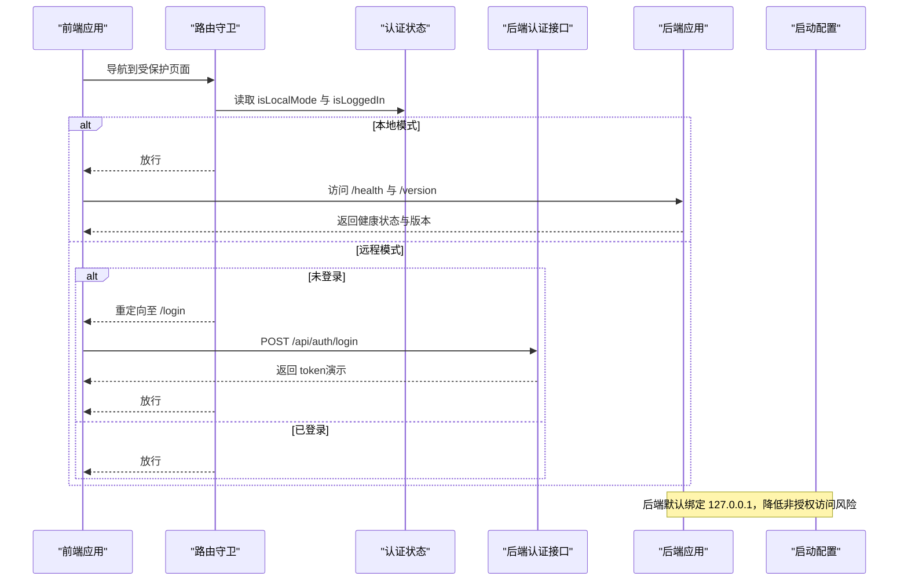
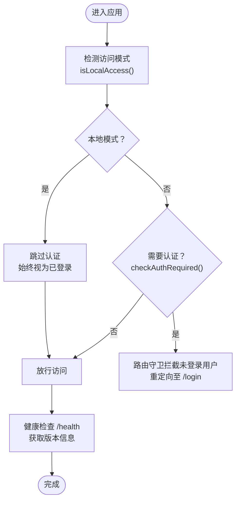
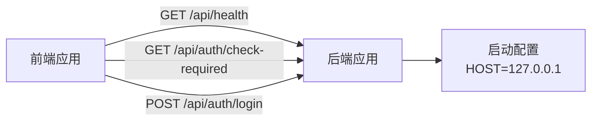

# 免责声明

<cite>
**本文引用的文件**
- [DISCLAIMER.md](file://DISCLAIMER.md)
- [src/backEnd/DISCLAIMER.md](file://src/backEnd/DISCLAIMER.md)
- [src/vulnTestServer/doc/DISCLAIMER.md](file://src/vulnTestServer/doc/DISCLAIMER.md)
- [README.md](file://README.md)
- [src/backEnd/app.py](file://src/backEnd/app.py)
- [src/backEnd/config.py](file://src/backEnd/config.py)
- [src/backEnd/api/commonApi/authController.py](file://src/backEnd/api/commonApi/authController.py)
- [src/frontEnd/src/stores/auth.ts](file://src/frontEnd/src/stores/auth.ts)
- [src/frontEnd/src/router/guards.ts](file://src/frontEnd/src/router/guards.ts)
- [src/backEnd/startup.conf](file://src/backEnd/startup.conf)
</cite>

## 目录
1. [简介](#简介)
2. [项目结构](#项目结构)
3. [核心组件](#核心组件)
4. [架构总览](#架构总览)
5. [详细组件分析](#详细组件分析)
6. [依赖关系分析](#依赖关系分析)
7. [性能考虑](#性能考虑)
8. [故障排查指南](#故障排查指南)
9. [结论](#结论)
10. [附录](#附录)

## 简介
本文件围绕“免责声明”主题，系统梳理 SQLMap Web UI 项目在前后端、扩展插件及测试靶场三个层面的免责声明内容与落地机制。重点解释：
- 三大免责声明文档的差异与边界
- 本地/远程访问模式下的认证与安全边界
- 启动配置与服务绑定如何强化免责声明的执行
- 前后端如何通过路由守卫与健康检查体现免责声明的约束

## 项目结构
本项目包含三处免责声明文档与若干与免责声明强相关的实现文件：
- 顶层免责声明：面向整体产品使用与法律合规
- 后端免责声明：面向后端服务使用与法律合规
- 靶场免责声明：面向 VulnShop 测试环境的使用限制与责任声明
- 关键实现文件：后端应用、认证接口、前端认证状态与路由守卫、启动配置等

图表来源
- [DISCLAIMER.md](file://DISCLAIMER.md#L1-L102)
- [src/backEnd/DISCLAIMER.md](file://src/backEnd/DISCLAIMER.md#L1-L90)
- [src/vulnTestServer/doc/DISCLAIMER.md](file://src/vulnTestServer/doc/DISCLAIMER.md#L1-L164)
- [src/backEnd/app.py](file://src/backEnd/app.py#L1-L103)
- [src/backEnd/api/commonApi/authController.py](file://src/backEnd/api/commonApi/authController.py#L1-L150)
- [src/frontEnd/src/stores/auth.ts](file://src/frontEnd/src/stores/auth.ts#L1-L175)
- [src/frontEnd/src/router/guards.ts](file://src/frontEnd/src/router/guards.ts#L1-L47)
- [src/backEnd/startup.conf](file://src/backEnd/startup.conf#L1-L93)
- [src/backEnd/config.py](file://src/backEnd/config.py#L1-L8)

章节来源
- [README.md](file://README.md#L261-L269)

## 核心组件
- 顶层免责声明：明确授权使用、合法用途、禁止滥用、风险承担与免责条款，并列出法律合规要求。
- 后端免责声明：强调后端服务的授权使用、合法用途、禁止滥用、风险承担与免责条款，并列出法律合规要求。
- 靶场免责声明：明确项目性质、使用限制（本地/授权/教育/隔离）、禁止行为、责任声明、法律合规、知识产权与同意条款。
- 认证与访问模式：后端提供“是否需要认证”的检查接口；前端根据本地/远程模式决定是否显示登录与路由守卫。
- 启动配置与服务绑定：后端默认绑定本地回环地址，降低非授权访问风险；启动配置支持离线/内网模式，减少外部依赖带来的未知风险。

章节来源
- [DISCLAIMER.md](file://DISCLAIMER.md#L1-L102)
- [src/backEnd/DISCLAIMER.md](file://src/backEnd/DISCLAIMER.md#L1-L90)
- [src/vulnTestServer/doc/DISCLAIMER.md](file://src/vulnTestServer/doc/DISCLAIMER.md#L1-L164)
- [src/backEnd/api/commonApi/authController.py](file://src/backEnd/api/commonApi/authController.py#L114-L149)
- [src/frontEnd/src/stores/auth.ts](file://src/frontEnd/src/stores/auth.ts#L1-L175)
- [src/frontEnd/src/router/guards.ts](file://src/frontEnd/src/router/guards.ts#L1-L47)
- [src/backEnd/startup.conf](file://src/backEnd/startup.conf#L55-L67)

## 架构总览
免责声明在系统中的落地路径如下：
- 前端：通过路由守卫与认证状态判断访问模式，本地模式下绕过登录与认证，远程模式下严格校验登录状态。
- 后端：提供健康检查与版本信息接口，绑定本地回环地址；认证接口在本地模式下不强制认证。
- 靶场：通过免责声明与启动限制（仅本地回环）约束使用范围。

图表来源
- [src/frontEnd/src/router/guards.ts](file://src/frontEnd/src/router/guards.ts#L1-L47)
- [src/frontEnd/src/stores/auth.ts](file://src/frontEnd/src/stores/auth.ts#L1-L175)
- [src/backEnd/api/commonApi/authController.py](file://src/backEnd/api/commonApi/authController.py#L40-L78)
- [src/backEnd/app.py](file://src/backEnd/app.py#L63-L82)
- [src/backEnd/startup.conf](file://src/backEnd/startup.conf#L55-L67)

## 详细组件分析

### 1) 顶层免责声明与后端免责声明
- 二者均强调“授权使用、合法用途、禁止滥用、风险承担与免责条款”，并列出法律合规要求。
- 后端免责声明更聚焦后端服务的使用边界，与后端启动配置（仅本地回环）形成互补。

章节来源
- [DISCLAIMER.md](file://DISCLAIMER.md#L1-L102)
- [src/backEnd/DISCLAIMER.md](file://src/backEnd/DISCLAIMER.md#L1-L90)

### 2) 靶场免责声明与使用限制
- 明确项目性质为“故意设计包含安全漏洞的测试环境”，仅限本地测试、授权使用、教育目的与隔离环境。
- 禁止行为涵盖未经授权访问、破坏/篡改/窃取数据、对真实网站或服务进行攻击测试、暴露到公网、商业用途、向未成年人传播攻击技术等。
- 责任声明与法律合规要求清晰，强调使用者自担风险与无保证。

章节来源
- [src/vulnTestServer/doc/DISCLAIMER.md](file://src/vulnTestServer/doc/DISCLAIMER.md#L1-L164)

### 3) 认证与访问模式（后端）
- 认证接口提供“是否需要认证”的检查，当前实现为本地单机模式，默认返回不需要认证。
- 登录接口在本地模式下不强制真实认证，便于本地开发与演示。
- 健康检查接口返回服务状态、版本与时长，供前端监控。

章节来源
- [src/backEnd/api/commonApi/authController.py](file://src/backEnd/api/commonApi/authController.py#L114-L149)
- [src/backEnd/api/commonApi/authController.py](file://src/backEnd/api/commonApi/authController.py#L40-L78)
- [src/backEnd/app.py](file://src/backEnd/app.py#L63-L82)

### 4) 前端认证状态与路由守卫
- 前端根据本地访问判断决定是否需要认证；本地模式下始终视为已登录，远程模式下检查 token。
- 路由守卫在远程模式下拦截未登录访问，重定向至登录页；本地模式下直接放行。
- 前端初始化时执行一次健康检查，持续监控后端健康状态。

章节来源
- [src/frontEnd/src/stores/auth.ts](file://src/frontEnd/src/stores/auth.ts#L1-L175)
- [src/frontEnd/src/router/guards.ts](file://src/frontEnd/src/router/guards.ts#L1-L47)

### 5) 启动配置与服务绑定
- 后端默认绑定地址为 127.0.0.1，端口 8775，有效降低非授权访问风险。
- 启动配置支持在线/内网/离线三种网络模式，便于在受限环境下部署。
- 版本常量在后端应用中被健康检查接口使用，便于前端识别后端版本。

章节来源
- [src/backEnd/startup.conf](file://src/backEnd/startup.conf#L55-L67)
- [src/backEnd/config.py](file://src/backEnd/config.py#L1-L8)
- [src/backEnd/app.py](file://src/backEnd/app.py#L51-L82)

### 6) 本地/远程模式的免责声明落地流程

图表来源
- [src/frontEnd/src/stores/auth.ts](file://src/frontEnd/src/stores/auth.ts#L1-L175)
- [src/frontEnd/src/router/guards.ts](file://src/frontEnd/src/router/guards.ts#L1-L47)
- [src/backEnd/app.py](file://src/backEnd/app.py#L63-L82)

## 依赖关系分析
- 前端依赖后端提供的健康检查与认证检查接口，以确定访问模式与登录状态。
- 后端应用通过 CORS 配置与静态文件挂载，服务于前端 SPA；默认绑定本地回环地址。
- 启动配置影响后端服务的网络模式与绑定地址，从而影响免责声明的执行效果。

图表来源
- [src/backEnd/app.py](file://src/backEnd/app.py#L34-L41)
- [src/backEnd/app.py](file://src/backEnd/app.py#L63-L82)
- [src/backEnd/api/commonApi/authController.py](file://src/backEnd/api/commonApi/authController.py#L114-L149)
- [src/backEnd/startup.conf](file://src/backEnd/startup.conf#L55-L67)

章节来源
- [src/backEnd/app.py](file://src/backEnd/app.py#L34-L41)
- [src/backEnd/startup.conf](file://src/backEnd/startup.conf#L55-L67)

## 性能考虑
- 健康检查采用定时轮询与缓存策略，避免频繁调用后端接口造成不必要的负载。
- 本地模式下前端无需登录与认证，减少不必要的网络往返。
- 启动配置支持离线/内网模式，有助于在受限网络环境下稳定运行，降低外部依赖带来的不确定性。

章节来源
- [src/frontEnd/src/stores/auth.ts](file://src/frontEnd/src/stores/auth.ts#L108-L145)
- [src/backEnd/startup.conf](file://src/backEnd/startup.conf#L1-L93)

## 故障排查指南
- 无法访问后端服务
  - 检查后端是否绑定到 127.0.0.1，确认前端访问地址与端口一致。
  - 参考：[src/backEnd/startup.conf](file://src/backEnd/startup.conf#L55-L67)
- 健康检查失败
  - 前端健康检查失败会标记后端不健康，建议检查后端进程与网络连通性。
  - 参考：[src/frontEnd/src/stores/auth.ts](file://src/frontEnd/src/stores/auth.ts#L108-L145)
- 登录后仍被重定向到登录页
  - 确认访问模式是否为远程模式，且前端已正确持久化 token。
  - 参考：[src/frontEnd/src/router/guards.ts](file://src/frontEnd/src/router/guards.ts#L1-L47)
- 靶场不可用
  - 确认 VulnShop 仅在 127.0.0.1 上运行，且未暴露到公网。
  - 参考：[src/vulnTestServer/doc/DISCLAIMER.md](file://src/vulnTestServer/doc/DISCLAIMER.md#L1-L164)

章节来源
- [src/backEnd/startup.conf](file://src/backEnd/startup.conf#L55-L67)
- [src/frontEnd/src/stores/auth.ts](file://src/frontEnd/src/stores/auth.ts#L108-L145)
- [src/frontEnd/src/router/guards.ts](file://src/frontEnd/src/router/guards.ts#L1-L47)
- [src/vulnTestServer/doc/DISCLAIMER.md](file://src/vulnTestServer/doc/DISCLAIMER.md#L1-L164)

## 结论
- 三层免责声明文档共同构成完整的使用边界与法律合规框架。
- 本地/远程模式通过前端认证状态与路由守卫实现差异化访问控制，后端默认绑定本地回环进一步强化安全边界。
- 启动配置与健康检查机制为免责声明的有效执行提供了技术保障。

## 附录
- 顶层免责声明与后端免责声明的对比要点
  - 授权使用与合法用途：均强调授权与合法场景。
  - 禁止滥用：均明确禁止未经授权访问、破坏/篡改/窃取数据、网络攻击等。
  - 风险承担与免责：均强调“按原样提供”、“风险自担”、“开发者不承担责任”。
  - 法律合规：分别列出适用的法律法规与地区要求。
- 靶场免责声明的使用限制
  - 仅本地测试、授权使用、教育目的、隔离环境。
  - 禁止对真实网站或服务进行攻击测试、暴露到公网、商业用途、向未成年人传播攻击技术。

章节来源
- [DISCLAIMER.md](file://DISCLAIMER.md#L1-L102)
- [src/backEnd/DISCLAIMER.md](file://src/backEnd/DISCLAIMER.md#L1-L90)
- [src/vulnTestServer/doc/DISCLAIMER.md](file://src/vulnTestServer/doc/DISCLAIMER.md#L1-L164)