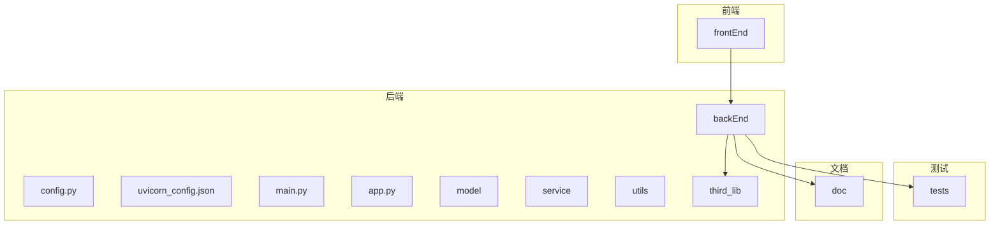
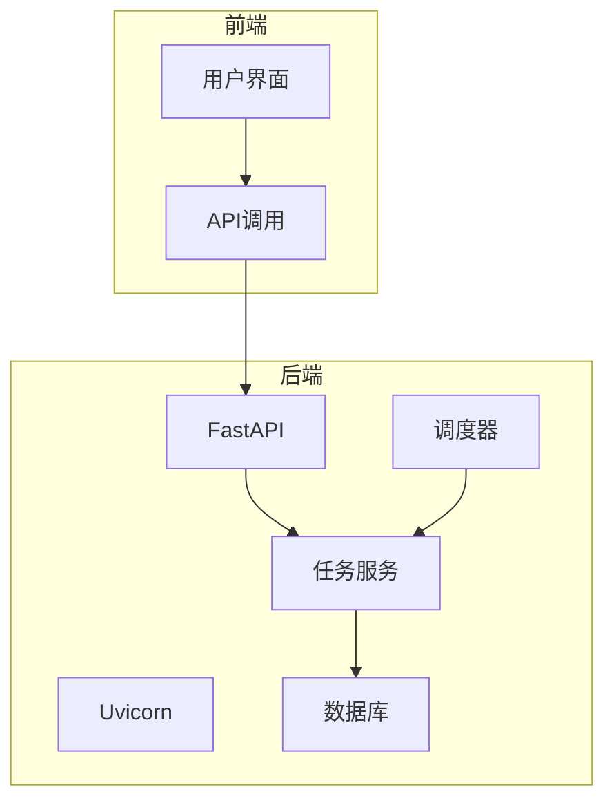
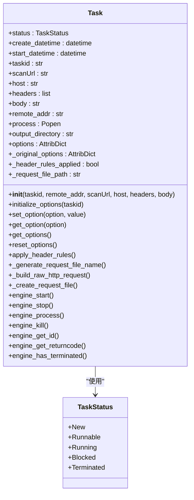
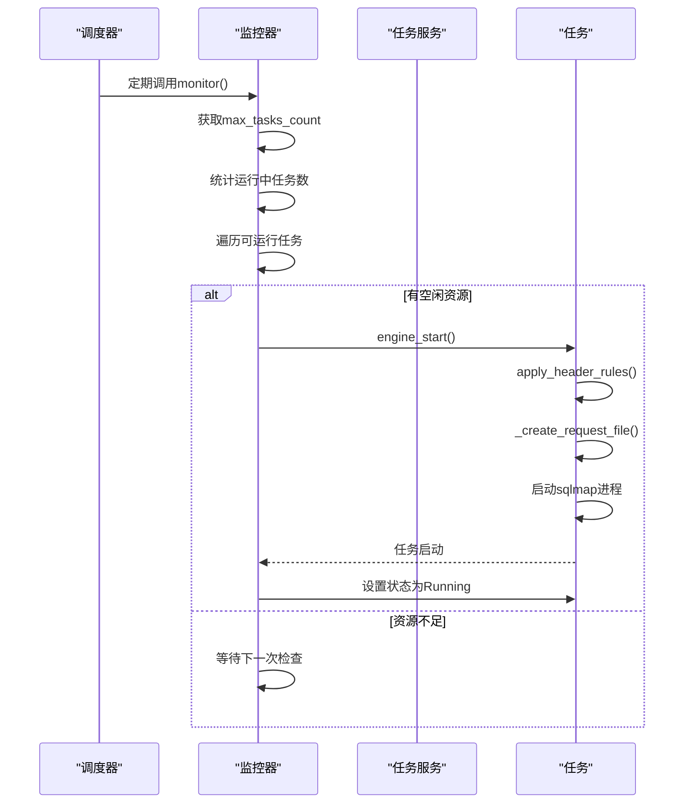
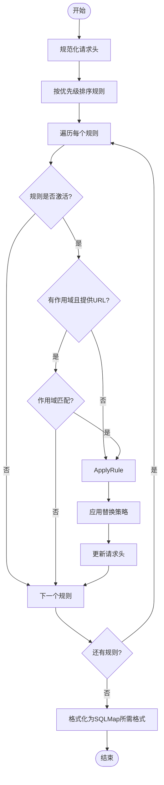
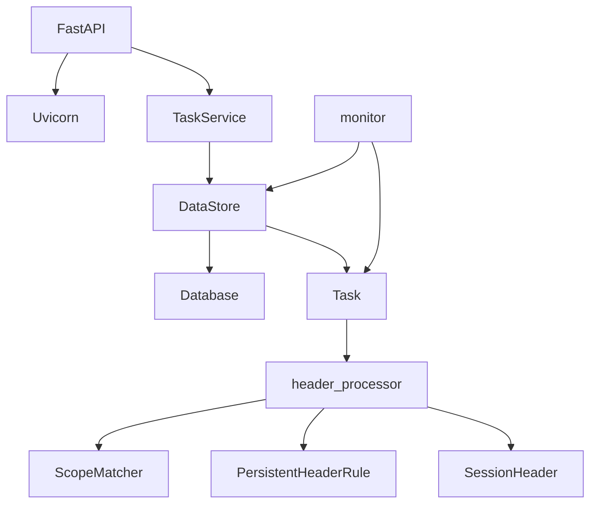

# 性能优化

<cite>
**本文档引用的文件**
- [config.py](file://src/backEnd/config.py)
- [uvicorn_config.json](file://src/backEnd/uvicorn_config.json)
- [main.py](file://src/backEnd/main.py)
- [app.py](file://src/backEnd/app.py)
- [Task.py](file://src/backEnd/model/Task.py)
- [taskService.py](file://src/backEnd/service/taskService.py)
- [task_monitor.py](file://src/backEnd/utils/task_monitor.py)
- [DataStore.py](file://src/backEnd/model/DataStore.py)
- [Database.py](file://src/backEnd/model/Database.py)
- [header_processor.py](file://src/backEnd/utils/header_processor.py)
</cite>

## 目录
1. [引言](#引言)
2. [项目结构](#项目结构)
3. [核心组件](#核心组件)
4. [架构概述](#架构概述)
5. [详细组件分析](#详细组件分析)
6. [依赖分析](#依赖分析)
7. [性能考虑](#性能考虑)
8. [故障排除指南](#故障排除指南)
9. [结论](#结论)

## 引言
sqlmapWebUI是一个基于Web的SQL注入测试工具，它为sqlmap提供了图形化界面和API接口。本性能优化文档深入探讨了系统的性能调优策略，分析了影响系统性能的关键因素，包括任务并发数、数据库连接池大小、内存使用等。文档详细说明了如何通过`config.py`和`uvicorn_config.json`调整服务参数以获得最佳性能，解释了任务调度机制和资源分配策略，特别是`Task.py`和`taskService.py`中的实现细节。此外，还提供了压力测试方法和性能基准数据，包含数据库优化建议，如索引优化和查询优化，并讨论了水平扩展方案，包括多节点部署和任务分发策略。

## 项目结构
sqlmapWebUI项目采用分层架构设计，主要分为前端、后端和第三方库三个部分。后端服务基于FastAPI框架构建，使用Uvicorn作为ASGI服务器。项目结构清晰，模块化程度高，便于维护和扩展。

**图表来源**
- [main.py](file://src/backEnd/main.py#L1-L168)
- [app.py](file://src/backEnd/app.py#L1-L80)

**章节来源**
- [main.py](file://src/backEnd/main.py#L1-L168)
- [app.py](file://src/backEnd/app.py#L1-L80)

## 核心组件
sqlmapWebUI的核心组件包括任务管理、请求头处理、数据库操作和API服务。任务管理组件负责创建、启动、停止和监控扫描任务。请求头处理组件应用持久化规则和会话性请求头到HTTP请求中。数据库操作组件使用SQLite存储任务日志、扫描结果和错误信息。API服务组件提供RESTful接口，供前端和外部系统调用。

**章节来源**
- [Task.py](file://src/backEnd/model/Task.py#L1-L333)
- [taskService.py](file://src/backEnd/service/taskService.py#L1-L535)
- [Database.py](file://src/backEnd/model/Database.py#L1-L99)

## 架构概述
sqlmapWebUI采用微服务架构，后端服务通过FastAPI提供RESTful API，前端通过Vue.js构建单页应用。系统通过Uvicorn服务器运行，支持异步处理。任务调度由APScheduler负责，定期检查任务状态并启动可运行的任务。数据库使用SQLite，通过自定义的Database类进行封装，提供线程安全的操作接口。

**图表来源**
- [main.py](file://src/backEnd/main.py#L108-L161)
- [app.py](file://src/backEnd/app.py#L20-L42)

**章节来源**
- [main.py](file://src/backEnd/main.py#L108-L161)
- [app.py](file://src/backEnd/app.py#L20-L42)

## 详细组件分析

### 任务管理组件分析
任务管理组件是sqlmapWebUI的核心，负责处理所有与扫描任务相关的操作。`Task`类封装了任务的所有属性和方法，包括任务状态、创建时间、开始时间、任务ID、扫描URL、主机、请求头、请求体、远程地址、进程、输出目录、选项等。`TaskService`类提供了任务的增删改查服务，通过`DataStore`全局对象管理所有任务。

#### 任务类图

**图表来源**
- [Task.py](file://src/backEnd/model/Task.py#L49-L333)

**章节来源**
- [Task.py](file://src/backEnd/model/Task.py#L49-L333)

### 任务调度机制
任务调度机制由`task_monitor.py`中的`monitor`函数实现。该函数定期检查所有任务的状态，根据`max_tasks_count`限制同时运行的任务数量。当有可运行的任务且当前运行的任务数小于最大任务数时，启动新的任务。`max_tasks_count`可以通过`DataStore`动态调整，支持静态配置和动态计算。

#### 任务调度序列图

**图表来源**
- [task_monitor.py](file://src/backEnd/utils/task_monitor.py#L36-L94)
- [Task.py](file://src/backEnd/model/Task.py#L258-L297)

**章节来源**
- [task_monitor.py](file://src/backEnd/utils/task_monitor.py#L36-L94)

### 请求头处理组件
请求头处理组件负责在扫描前应用持久化规则和会话性请求头到HTTP请求中。`header_processor.py`中的`HeaderProcessor`类提供了处理请求头的核心逻辑，包括规范化请求头、应用替换策略、作用域匹配等。`ScopeMatcher`类负责解析URL和匹配作用域规则。

#### 请求头处理流程图

**图表来源**
- [header_processor.py](file://src/backEnd/utils/header_processor.py#L12-L292)

**章节来源**
- [header_processor.py](file://src/backEnd/utils/header_processor.py#L12-L292)

## 依赖分析
sqlmapWebUI的依赖关系清晰，各组件之间耦合度低。后端服务依赖FastAPI、APScheduler、psutil等第三方库。任务管理组件依赖`DataStore`全局对象存储任务和数据库连接。数据库操作组件使用SQLite，通过自定义的`Database`类进行封装，提供线程安全的操作接口。请求头处理组件依赖`PersistentHeaderRule`和`SessionHeader`模型类。

**图表来源**
- [main.py](file://src/backEnd/main.py#L107-L161)
- [taskService.py](file://src/backEnd/service/taskService.py#L1-L535)

**章节来源**
- [main.py](file://src/backEnd/main.py#L107-L161)
- [taskService.py](file://src/backEnd/service/taskService.py#L1-L535)

## 性能考虑
sqlmapWebUI的性能优化主要集中在任务并发控制、数据库操作优化和内存管理三个方面。通过合理配置`max_tasks_count`，可以平衡系统资源利用率和任务吞吐量。数据库操作使用SQLite的事务和索引，提高查询效率。内存管理通过及时释放不再使用的任务对象，避免内存泄漏。

**章节来源**
- [config.py](file://src/backEnd/config.py#L3-L4)
- [DataStore.py](file://src/backEnd/model/DataStore.py#L22-L23)
- [Database.py](file://src/backEnd/model/Database.py#L96-L99)

## 故障排除指南
当遇到性能问题时，首先检查`max_tasks_count`配置是否合理，确保不超过系统资源限制。其次，检查数据库连接是否正常，确保SQLite文件可读写。最后，检查任务日志，定位具体问题。可以通过`health_check`端点监控服务健康状态。

**章节来源**
- [app.py](file://src/backEnd/app.py#L61-L79)
- [taskService.py](file://src/backEnd/service/taskService.py#L102-L179)

## 结论
sqlmapWebUI通过合理的架构设计和性能优化策略，实现了高效、稳定的SQL注入测试服务。通过动态调整任务并发数、优化数据库操作和合理管理内存，系统能够在保证性能的同时处理大量扫描任务。未来可以通过引入更高级的数据库、实现水平扩展等方式进一步提升系统性能。