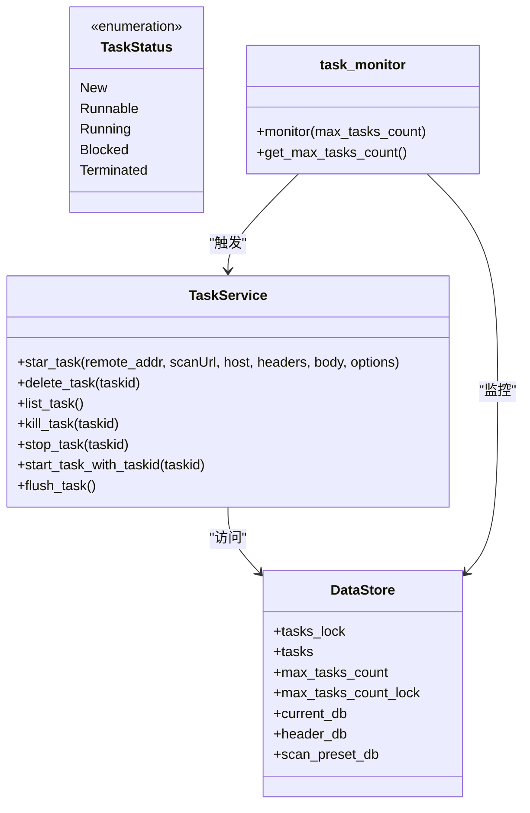
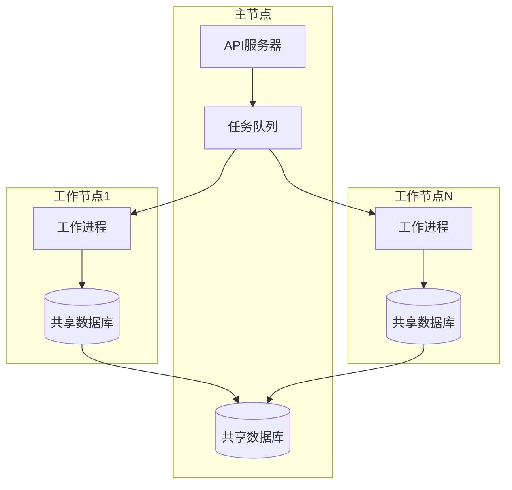
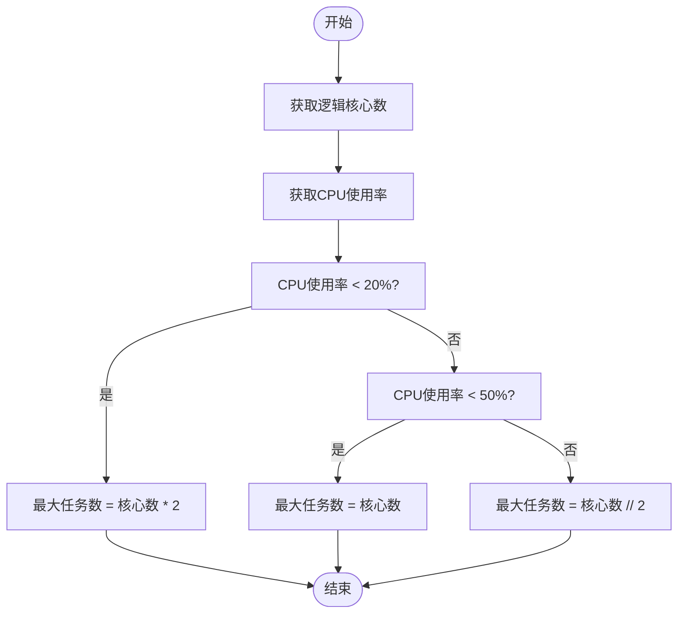
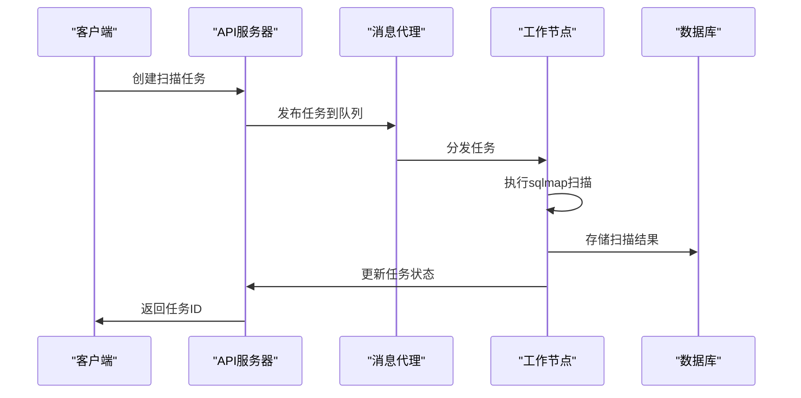

# 扩展策略

<cite>
**本文档引用的文件**
- [taskService.py](file://src/backEnd/service/taskService.py)
- [config.py](file://src/backEnd/config.py)
- [DataStore.py](file://src/backEnd/model/DataStore.py)
- [task_monitor.py](file://src/backEnd/utils/task_monitor.py)
- [main.py](file://src/backEnd/main.py)
- [app.py](file://src/backEnd/app.py)
</cite>

## 目录
1. [引言](#引言)
2. [任务调度机制分析](#任务调度机制分析)
3. [水平扩展方案](#水平扩展方案)
4. [垂直扩展方案](#垂直扩展方案)
5. [分布式任务队列集成](#分布式任务队列集成)
6. [负载均衡与任务分发](#负载均衡与任务分发)
7. [集群部署配置](#集群部署配置)
8. [容器化部署建议](#容器化部署建议)
9. [扩展方案比较](#扩展方案比较)
10. [实施步骤](#实施步骤)

## 引言
sqlmapWebUI是一个基于Python的Web界面工具，用于管理和执行sqlmap扫描任务。随着安全测试需求的增长，单节点部署的性能瓶颈逐渐显现。本文档旨在探讨sqlmapWebUI的扩展策略，包括水平和垂直扩展方案，通过分布式任务队列实现多节点部署，以及容器化部署的最佳实践。

**Section sources**
- [app.py](file://src/backEnd/app.py#L1-L80)
- [main.py](file://src/backEnd/main.py#L1-L168)

## 任务调度机制分析
sqlmapWebUI的任务调度机制基于内存中的任务队列和定时监控器。系统通过`taskService.py`中的`TaskService`类管理所有扫描任务的生命周期，包括创建、启动、停止和删除任务。

任务状态管理采用枚举模式，定义了五种状态：New（新建）、Runnable（可运行）、Running（运行中）、Blocked（阻塞）和Terminated（终止）。任务调度的核心逻辑在`task_monitor.py`文件中实现，通过`BackgroundScheduler`定期检查任务队列，根据系统资源和任务状态决定是否启动新的扫描任务。



**Diagram sources**
- [taskService.py](file://src/backEnd/service/taskService.py#L46-L534)
- [DataStore.py](file://src/backEnd/model/DataStore.py#L12-L38)
- [task_monitor.py](file://src/backEnd/utils/task_monitor.py#L36-L93)
- [TaskStatus.py](file://src/backEnd/model/TaskStatus.py#L4-L9)

**Section sources**
- [taskService.py](file://src/backEnd/service/taskService.py#L1-L535)
- [task_monitor.py](file://src/backEnd/utils/task_monitor.py#L1-L94)

## 水平扩展方案
水平扩展通过增加工作节点来提升系统的整体处理能力。对于sqlmapWebUI，水平扩展的关键是将单节点的内存任务队列替换为分布式任务队列，如Celery配合Redis或RabbitMQ作为消息代理。

在水平扩展架构中，主节点负责接收用户请求和任务创建，而工作节点负责执行实际的扫描任务。通过共享的数据库和分布式队列，多个节点可以协同工作，实现任务的均衡分配。这种架构的优势在于可以动态添加或移除工作节点，具有良好的可伸缩性和容错性。



**Diagram sources**
- [taskService.py](file://src/backEnd/service/taskService.py#L58-L87)
- [DataStore.py](file://src/backEnd/model/DataStore.py#L14-L16)

## 垂直扩展方案
垂直扩展通过提升单个节点的硬件资源来增强系统性能。在sqlmapWebUI中，垂直扩展主要体现在调整`config.py`中的配置项以充分利用系统资源。

系统通过`task_monitor.py`中的`get_max_tasks_count()`函数动态计算最大任务数，该函数基于CPU核心数和当前CPU使用率来决定可并行执行的任务数量。当CPU使用率低于20%时，允许的最大任务数为逻辑核心数的两倍；使用率在20%-50%之间时，等于逻辑核心数；使用率高于50%时，则为逻辑核心数的一半。



**Diagram sources**
- [task_monitor.py](file://src/backEnd/utils/task_monitor.py#L11-L33)
- [config.py](file://src/backEnd/config.py#L3-L4)

**Section sources**
- [config.py](file://src/backEnd/config.py#L1-L8)
- [task_monitor.py](file://src/backEnd/utils/task_monitor.py#L1-L94)

## 分布式任务队列集成
为了实现多节点部署，需要将现有的内存任务队列替换为分布式任务队列。Celery是一个理想的解决方案，它提供了强大的任务调度和分布式执行能力。

集成Celery的关键步骤包括：配置消息代理（如Redis）、定义任务函数、修改任务服务以使用Celery任务、配置结果后端以存储任务结果。通过Celery，可以将`star_task`方法转换为异步任务，由工作节点从队列中获取并执行。



**Diagram sources**
- [taskService.py](file://src/backEnd/service/taskService.py#L58-L87)
- [main.py](file://src/backEnd/main.py#L108-L159)

## 负载均衡与任务分发
负载均衡和任务分发策略对于确保扫描任务在多个工作节点间的均衡分配至关重要。系统可以采用多种策略来优化任务分发：

1. **轮询策略**：按顺序将任务分配给可用的工作节点
2. **最少连接策略**：将任务分配给当前负载最低的节点
3. **基于资源的策略**：根据节点的CPU、内存等资源使用情况分配任务
4. **亲和性策略**：将相同类型或来源的任务分配给同一节点

通过`DataStore`中的`max_tasks_count`配置项，可以控制每个节点的最大并发任务数，防止任何单个节点过载。同时，健康检查端点`/api/health`可用于监控各节点的状态，确保只有健康的节点接收新任务。

**Section sources**
- [DataStore.py](file://src/backEnd/model/DataStore.py#L22-L23)
- [app.py](file://src/backEnd/app.py#L61-L79)

## 集群部署配置
基于`config.py`中的配置项，可以通过以下方式调整服务以支持集群部署：

1. **共享存储配置**：确保所有节点访问相同的数据库文件或数据库实例
2. **任务队列配置**：设置统一的消息代理地址和队列名称
3. **节点标识配置**：为每个节点分配唯一的标识符，便于监控和管理
4. **资源限制配置**：通过`MAX_TASKS_COUNT`限制每个节点的并发任务数

在集群环境中，需要将SQLite数据库替换为支持并发访问的数据库系统，如PostgreSQL或MySQL，以避免文件锁问题。同时，应该配置外部缓存系统（如Redis）来存储会话数据和临时结果。

**Section sources**
- [config.py](file://src/backEnd/config.py#L3-L4)
- [DataStore.py](file://src/backEnd/model/DataStore.py#L14-L16)

## 容器化部署建议
容器化部署提供了更高的灵活性和可移植性。以下是针对Docker和Kubernetes的部署建议：

### Docker部署
```dockerfile
FROM python:3.13-slim

WORKDIR /app
COPY src/backEnd/requirements.txt .
RUN pip install --no-cache-dir -r requirements.txt

COPY src/backEnd/ .
COPY src/frontEnd/dist/ ./static/

EXPOSE 8775
CMD ["uvicorn", "main:app", "--host", "0.0.0.0", "--port", "8775"]
```

### Kubernetes部署
```yaml
apiVersion: apps/v1
kind: Deployment
metadata:
  name: sqlmapwebui
spec:
  replicas: 3
  selector:
    matchLabels:
      app: sqlmapwebui
  template:
    metadata:
      labels:
        app: sqlmapwebui
    spec:
      containers:
      - name: sqlmapwebui
        image: sqlmapwebui:latest
        ports:
        - containerPort: 8775
        resources:
          limits:
            cpu: "2"
            memory: "4Gi"
          requests:
            cpu: "1"
            memory: "2Gi"
        env:
        - name: SQLMAP_API_URL
          value: "http://localhost:8775"
```

### 资源限制与自动伸缩
在Kubernetes中，可以通过Horizontal Pod Autoscaler根据CPU使用率自动调整Pod数量：
```yaml
apiVersion: autoscaling/v2
kind: HorizontalPodAutoscaler
metadata:
  name: sqlmapwebui-hpa
spec:
  scaleTargetRef:
    apiVersion: apps/v1
    kind: Deployment
    name: sqlmapwebui
  minReplicas: 2
  maxReplicas: 10
  metrics:
  - type: Resource
    resource:
      name: cpu
      target:
        type: Utilization
        averageUtilization: 70
```

**Section sources**
- [main.py](file://src/backEnd/main.py#L161-L162)
- [.env.example](file://src/backEnd/.env.example#L1-L71)

## 扩展方案比较
以下表格比较了不同扩展方案的优缺点：

| 方案 | 优点 | 缺点 | 适用场景 |
|------|------|------|----------|
| **垂直扩展** | 实现简单，无需修改架构 | 受限于单机硬件上限，存在单点故障 | 小规模部署，资源充足的环境 |
| **水平扩展** | 可无限扩展，高可用性 | 架构复杂，需要分布式协调 | 大规模部署，高并发需求 |
| **容器化部署** | 环境一致性，易于管理 | 需要容器编排知识，网络复杂 | 云环境，CI/CD集成 |
| **混合扩展** | 结合垂直和水平扩展优势 | 管理复杂度最高 | 企业级部署，弹性需求 |

**Section sources**
- [config.py](file://src/backEnd/config.py#L3-L4)
- [task_monitor.py](file://src/backEnd/utils/task_monitor.py#L11-L33)

## 实施步骤
实施扩展策略的步骤如下：

1. **评估需求**：分析当前和未来的扫描任务负载
2. **选择方案**：根据需求选择合适的扩展方案
3. **环境准备**：搭建消息代理、共享数据库等基础设施
4. **代码改造**：集成Celery或其他分布式任务队列
5. **配置调整**：修改配置文件以支持集群部署
6. **容器化**：创建Docker镜像和Kubernetes部署文件
7. **测试验证**：在测试环境中验证扩展方案的有效性
8. **部署上线**：逐步将扩展方案部署到生产环境
9. **监控优化**：持续监控系统性能并进行优化

通过以上步骤，可以成功实现sqlmapWebUI的扩展，满足不断增长的安全测试需求。

**Section sources**
- [main.py](file://src/backEnd/main.py#L108-L159)
- [taskService.py](file://src/backEnd/service/taskService.py#L1-L535)