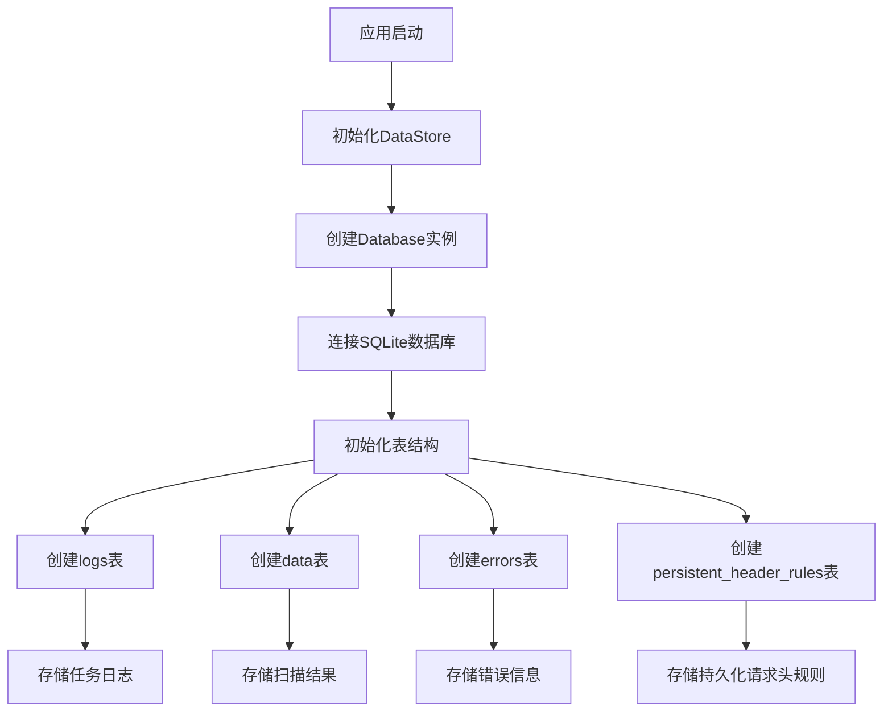
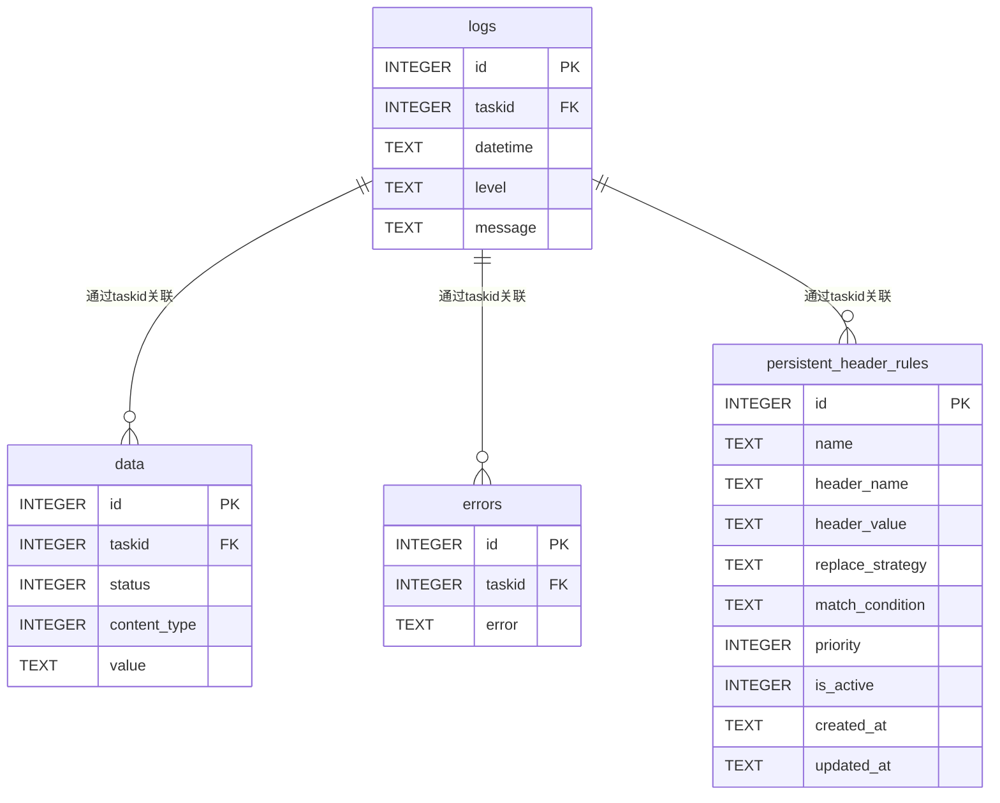

# 数据库优化

<cite>
**本文档引用的文件**   
- [Task.py](file://src/backEnd/model/Task.py)
- [Database.py](file://src/backEnd/model/Database.py)
- [taskService.py](file://src/backEnd/service/taskService.py)
- [DataStore.py](file://src/backEnd/model/DataStore.py)
- [main.py](file://src/backEnd/main.py)
</cite>

## 目录
1. [引言](#引言)
2. [数据库架构分析](#数据库架构分析)
3. [数据模型与表结构优化](#数据模型与表结构优化)
4. [索引优化策略](#索引优化策略)
5. [数据访问模式与查询优化](#数据访问模式与查询优化)
6. [SQLite性能调优](#sqlite性能调优)
7. [连接池与并发控制](#连接池与并发控制)
8. [数据库监控与慢查询分析](#数据库监控与慢查询分析)
9. [总结与建议](#总结与建议)

## 引言

sqlmapWebUI是一个基于Python的Web界面工具，用于管理和执行sqlmap扫描任务。该系统使用SQLite作为其主要的数据库存储引擎，用于存储任务信息、日志、扫描结果等关键数据。随着任务数量的增加和系统负载的提升，数据库性能可能成为系统瓶颈。本文档旨在深入分析sqlmapWebUI的数据库性能瓶颈，并提供全面的优化方案，包括表结构优化、索引创建、查询优化、SQLite性能调优、连接池配置以及监控策略，以确保系统在高负载下仍能保持高效稳定的运行。

## 数据库架构分析

sqlmapWebUI的数据库架构设计围绕任务管理为核心，通过多个表来存储不同类型的数据。系统在启动时初始化数据库连接，并创建必要的表结构。数据库连接通过全局的DataStore对象进行管理，确保在整个应用生命周期内只有一个数据库连接实例。



**图表来源**
- [Database.py](file://src/backEnd/model/Database.py#L72-L99)
- [main.py](file://src/backEnd/main.py#L140-L144)

**本节来源**
- [Database.py](file://src/backEnd/model/Database.py#L1-L99)
- [main.py](file://src/backEnd/main.py#L140-L144)

## 数据模型与表结构优化

sqlmapWebUI的数据库模型主要由以下几个核心表组成：`logs`、`data`、`errors`和`persistent_header_rules`。这些表的设计直接影响到系统的查询性能和存储效率。

### logs表
`logs`表用于存储每个任务的详细日志信息，包括时间戳、日志级别和消息内容。该表的结构设计合理，但可以进一步优化以提高查询效率。

### data表
`data`表存储扫描过程中发现的注入点和相关数据。该表的`status`和`content_type`字段是常用的查询条件，应考虑创建复合索引。

### errors表
`errors`表记录每个任务执行过程中遇到的错误信息。该表的`taskid`字段是外键，用于关联到具体的任务。

### persistent_header_rules表
`persistent_header_rules`表存储持久化的请求头规则，包括规则名称、头名称、头值、替换策略等。该表的`is_active`和`priority`字段是常用的查询条件，已创建了相应的索引。



**图表来源**
- [Database.py](file://src/backEnd/model/Database.py#L74-L99)

**本节来源**
- [Database.py](file://src/backEnd/model/Database.py#L74-L99)

## 索引优化策略

索引是提高数据库查询性能的关键。sqlmapWebUI已经在`persistent_header_rules`表上创建了`is_active`和`priority`字段的索引，但其他表的索引策略可以进一步优化。

### task_status索引
`data`表中的`status`字段是常用的查询条件，特别是在查询特定状态的任务时。建议在`status`字段上创建索引，以加速状态相关的查询。

```sql
CREATE INDEX IF NOT EXISTS idx_data_status ON data(status);
```

### created_time索引
`persistent_header_rules`表中的`created_at`字段记录了规则的创建时间，常用于按时间范围查询。建议在`created_at`字段上创建索引，以提高时间范围查询的性能。

```sql
CREATE INDEX IF NOT EXISTS idx_header_rules_created_at ON persistent_header_rules(created_at);
```

### 复合索引
对于经常同时查询多个字段的场景，可以考虑创建复合索引。例如，在`data`表上创建`status`和`content_type`的复合索引，可以显著提高多条件查询的性能。

```sql
CREATE INDEX IF NOT EXISTS idx_data_status_content_type ON data(status, content_type);
```

**本节来源**
- [Database.py](file://src/backEnd/model/Database.py#L97-L99)

## 数据访问模式与查询优化

sqlmapWebUI的数据访问模式主要集中在任务列表查询、日志查询和错误查询。这些查询的性能直接影响用户体验。

### 批量操作
在`taskService.py`中，`list_task`方法通过循环查询每个任务的日志、错误和数据计数，这会导致大量的数据库查询。建议将这些查询合并为批量查询，以减少数据库交互次数。

```python
# 优化前
for taskid in DataStore.tasks:
    errors_query = "SELECT COUNT(*) FROM errors WHERE taskid = ?"
    cursor = DataStore.current_db.only_execute(errors_query, (taskid,))

# 优化后
task_ids = tuple(DataStore.tasks.keys())
errors_query = "SELECT taskid, COUNT(*) FROM errors WHERE taskid IN ({}) GROUP BY taskid".format(','.join('?' * len(task_ids)))
cursor = DataStore.current_db.execute(errors_query, task_ids)
```

### 查询优化
避免使用`SELECT *`，只选择需要的字段。在`find_task_log_by_taskid`方法中，查询日志时指定了需要的字段，这是一个良好的实践。

```python
cursor = DataStore.current_db.execute("SELECT datetime, level, message FROM logs WHERE taskid = ? ORDER BY id ASC", (taskid,))
```

### 事务批量提交
在插入大量数据时，使用事务批量提交可以显著提高性能。将多个插入操作包装在一个事务中，可以减少磁盘I/O和日志写入的开销。

```python
DataStore.current_db.execute("BEGIN TRANSACTION")
for item in data_list:
    DataStore.current_db.execute("INSERT INTO data VALUES (?, ?, ?, ?, ?)", item)
DataStore.current_db.execute("COMMIT")
```

**本节来源**
- [taskService.py](file://src/backEnd/service/taskService.py#L102-L176)

## SQLite性能调优

SQLite是一个轻量级的嵌入式数据库，但在高并发场景下需要进行适当的性能调优。

### WAL模式启用
WAL（Write-Ahead Logging）模式可以显著提高SQLite的并发性能。启用WAL模式后，读操作和写操作可以同时进行，而不会相互阻塞。

```python
self.connection.execute('PRAGMA journal_mode=WAL')
```

### 缓存大小设置
增加SQLite的缓存大小可以减少磁盘I/O，提高查询性能。建议根据系统内存情况适当增加缓存大小。

```python
self.connection.execute('PRAGMA cache_size=10000')
```

### 事务批量提交策略
在执行大量插入或更新操作时，使用事务批量提交可以显著提高性能。将多个操作包装在一个事务中，可以减少日志写入和磁盘I/O的开销。

```python
self.connection.execute('BEGIN TRANSACTION')
# 执行多个插入或更新操作
self.connection.execute('COMMIT')
```

**本节来源**
- [Database.py](file://src/backEnd/model/Database.py#L19-L20)

## 连接池与并发控制

sqlmapWebUI使用单个数据库连接实例，这在高并发场景下可能成为性能瓶颈。建议引入连接池来管理数据库连接，以提高并发处理能力。

### 连接池配置
使用连接池可以避免频繁创建和销毁数据库连接的开销。可以使用`sqlite3`的`Connection`对象的`check_same_thread=False`参数来允许多线程访问。

```python
self.connection = sqlite3.connect(self.database, timeout=3, isolation_level=None, check_same_thread=False)
```

### 并发控制
在`Database`类中，使用`threading.Lock`来确保数据库操作的线程安全。这可以防止多个线程同时执行数据库操作导致的数据不一致。

```python
with self.lock:
    while True:
        try:
            if arguments:
                self.cursor.execute(statement, arguments)
            else:
                self.cursor.execute(statement)
        except sqlite3.OperationalError as ex:
            if "locked" not in getSafeExString(ex):
                raise
            else:
                time.sleep(1)
        else:
            break
```

**本节来源**
- [Database.py](file://src/backEnd/model/Database.py#L22-L49)

## 数据库监控与慢查询分析

有效的数据库监控和慢查询分析是确保系统性能稳定的关键。

### 慢查询日志
启用SQLite的慢查询日志功能，可以记录执行时间超过指定阈值的查询。这有助于识别性能瓶颈。

```python
self.connection.execute('PRAGMA journal_mode=WAL')
self.connection.execute('PRAGMA cache_size=10000')
self.connection.execute('PRAGMA temp_store=MEMORY')
```

### 监控指标
监控关键的数据库性能指标，如查询响应时间、连接数、缓存命中率等。可以使用外部监控工具或自定义监控脚本来收集这些指标。

### 定期分析
定期使用`ANALYZE`命令来更新表的统计信息，帮助查询优化器生成更优的执行计划。

```python
self.connection.execute('ANALYZE')
```

**本节来源**
- [Database.py](file://src/backEnd/model/Database.py#L19-L20)

## 总结与建议

通过对sqlmapWebUI的数据库架构、数据模型、索引策略、查询模式和性能调优的深入分析，我们提出了以下优化建议：

1. **索引优化**：在`data`表的`status`字段和`persistent_header_rules`表的`created_at`字段上创建索引，以加速常用查询。
2. **查询优化**：将多个单个查询合并为批量查询，减少数据库交互次数。
3. **事务优化**：在执行大量插入或更新操作时，使用事务批量提交策略。
4. **SQLite调优**：启用WAL模式，增加缓存大小，使用内存临时存储。
5. **连接池**：引入连接池来管理数据库连接，提高并发处理能力。
6. **监控与分析**：启用慢查询日志，定期分析数据库性能，及时发现和解决性能瓶颈。

通过实施这些优化措施，可以显著提升sqlmapWebUI的数据库性能，确保系统在高负载下仍能保持高效稳定的运行。

**本节来源**
- [Database.py](file://src/backEnd/model/Database.py#L1-L99)
- [taskService.py](file://src/backEnd/service/taskService.py#L1-L535)
- [Task.py](file://src/backEnd/model/Task.py#L1-L333)