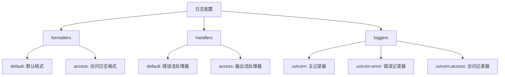
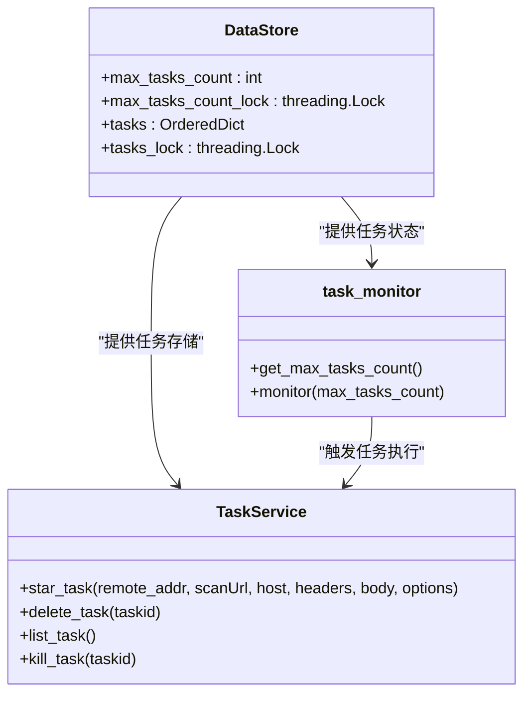
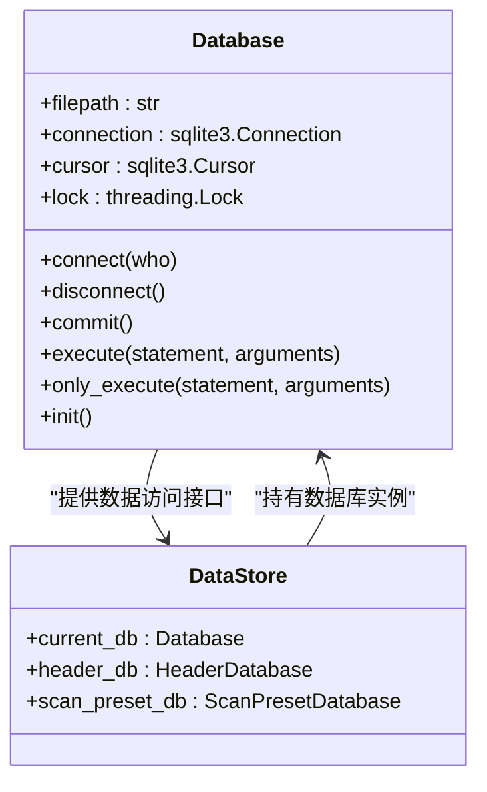
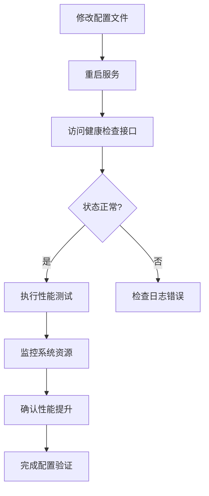

# 配置调优

<cite>
**本文档引用的文件**  
- [config.py](file://src/backEnd/config.py)
- [uvicorn_config.json](file://src/backEnd/uvicorn_config.json)
- [main.py](file://src/backEnd/main.py)
- [task_monitor.py](file://src/backEnd/utils/task_monitor.py)
- [Database.py](file://src/backEnd/model/Database.py)
- [DataStore.py](file://src/backEnd/model/DataStore.py)
- [taskService.py](file://src/backEnd/service/taskService.py)
</cite>

## 目录
1. [简介](#简介)
2. [核心配置文件分析](#核心配置文件分析)
3. [UVICORN性能参数详解](#uvicorn性能参数详解)
4. [任务并发控制配置](#任务并发控制配置)
5. [数据库连接与缓存优化](#数据库连接与缓存优化)
6. [不同硬件环境下的推荐配置](#不同硬件环境下的推荐配置)
7. [配置验证与性能监控](#配置验证与性能监控)
8. [最佳实践总结](#最佳实践总结)

## 简介
本配置调优文档旨在详细说明如何通过修改`config.py`和`uvicorn_config.json`文件来优化系统性能。文档将深入分析关键配置参数的作用，包括UVICORN工作进程、线程数、连接保持时间等对并发处理能力的影响。同时提供针对不同硬件环境（低配、标准、高性能服务器）的推荐配置值，并说明如何调整任务超时设置、连接池大小和缓存策略以平衡资源消耗和响应速度。最后，文档将介绍配置修改后的验证方法和性能监控指标。

## 核心配置文件分析

### config.py配置文件
`config.py`文件定义了系统的核心配置参数，包括最大任务数和系统版本信息。该文件通过线程锁机制确保多线程环境下的数据一致性。

**Section sources**
- [config.py](file://src/backEnd/config.py#L1-L8)

### uvicorn_config.json配置文件
`uvicorn_config.json`文件配置了Uvicorn服务器的日志格式、处理器和记录器，定义了系统的日志输出行为和级别。

**Section sources**
- [uvicorn_config.json](file://src/backEnd/uvicorn_config.json#L1-L45)

## UVICORN性能参数详解

### 日志配置优化
`uvicorn_config.json`中的日志配置直接影响系统性能和调试能力。通过合理配置日志级别和格式，可以在不影响性能的前提下获取必要的调试信息。



**Diagram sources**
- [uvicorn_config.json](file://src/backEnd/uvicorn_config.json#L4-L45)

### 日志级别设置
日志级别直接影响系统性能。建议在生产环境中使用`INFO`级别，避免`DEBUG`级别带来的性能开销。

**Section sources**
- [uvicorn_config.json](file://src/backEnd/uvicorn_config.json#L31-L43)

## 任务并发控制配置

### 最大任务数配置
系统通过`MAX_TASKS_COUNT`参数控制最大并发任务数，该参数直接影响系统的资源利用率和响应速度。



**Diagram sources**
- [DataStore.py](file://src/backEnd/model/DataStore.py#L1-L38)
- [taskService.py](file://src/backEnd/service/taskService.py#L1-L535)
- [task_monitor.py](file://src/backEnd/utils/task_monitor.py#L1-L94)

### 动态任务数调整
系统实现了动态任务数调整机制，根据CPU使用率自动调整最大任务数：

- CPU使用率 < 20%：最大任务数 = 逻辑核心数 × 2
- CPU使用率 < 50%：最大任务数 = 逻辑核心数
- CPU使用率 ≥ 50%：最大任务数 = 逻辑核心数 ÷ 2（最小为1）

**Section sources**
- [task_monitor.py](file://src/backEnd/utils/task_monitor.py#L11-L33)

## 数据库连接与缓存优化

### SQLite连接池配置
系统使用SQLite作为后端数据库，通过连接池和锁机制确保多线程环境下的数据一致性。



**Diagram sources**
- [Database.py](file://src/backEnd/model/Database.py#L1-L99)
- [DataStore.py](file://src/backEnd/model/DataStore.py#L1-L38)

### 连接超时设置
数据库连接配置了3秒的超时时间，防止长时间阻塞：

```python
self.connection = sqlite3.connect(
    self.database, timeout=3, isolation_level=None, check_same_thread=False)
```

**Section sources**
- [Database.py](file://src/backEnd/model/Database.py#L20)

### 索引优化
系统在关键字段上创建了索引以提高查询性能：

- `idx_header_rules_active`：基于`is_active`字段的索引
- `idx_header_rules_priority`：基于`priority`字段的索引
- `idx_header_rules_name`：基于`header_name`字段的索引

**Section sources**
- [Database.py](file://src/backEnd/model/Database.py#L96-L99)

## 不同硬件环境下的推荐配置

### 低配服务器（2核4G）
针对低配服务器的优化配置建议：

| 配置项 | 推荐值 | 说明 |
|--------|--------|------|
| MAX_TASKS_COUNT | 2 | 避免资源过度竞争 |
| UVICORN_WORKERS | 1 | 单工作进程避免内存不足 |
| UVICORN_THREADS | 2 | 匹配CPU核心数 |
| UVICORN_TIMEOUT_KEEP_ALIVE | 5 | 减少连接保持时间 |

**Section sources**
- [config.py](file://src/backEnd/config.py#L3)
- [main.py](file://src/backEnd/main.py#L161)

### 标准服务器（4核8G）
针对标准服务器的优化配置建议：

| 配置项 | 推荐值 | 说明 |
|--------|--------|------|
| MAX_TASKS_COUNT | 4 | 充分利用计算资源 |
| UVICORN_WORKERS | 2 | 多工作进程提高并发 |
| UVICORN_THREADS | 4 | 匹配CPU核心数 |
| UVICORN_TIMEOUT_KEEP_ALIVE | 15 | 平衡连接复用和资源释放 |

**Section sources**
- [config.py](file://src/backEnd/config.py#L3)
- [main.py](file://src/backEnd/main.py#L161)

### 高性能服务器（8核16G以上）
针对高性能服务器的优化配置建议：

| 配置项 | 推荐值 | 说明 |
|--------|--------|------|
| MAX_TASKS_COUNT | 8 | 最大化并发处理能力 |
| UVICORN_WORKERS | 4 | 充分利用多核优势 |
| UVICORN_THREADS | 8 | 匹配CPU核心数 |
| UVICORN_TIMEOUT_KEEP_ALIVE | 30 | 提高连接复用率 |

**Section sources**
- [config.py](file://src/backEnd/config.py#L3)
- [main.py](file://src/backEnd/main.py#L161)

## 配置验证与性能监控

### 健康检查接口
系统提供了健康检查接口`/api/health`，用于验证配置修改后的系统状态：

```json
{
    "code": 200,
    "success": true,
    "message": "success",
    "data": {
        "status": "healthy",
        "timestamp": 1745123456789,
        "version": "1.7.9",
        "uptime": 3600
    }
}
```

**Section sources**
- [app.py](file://src/backEnd/app.py#L61-L80)

### 性能监控指标
关键性能监控指标包括：

| 指标 | 目标值 | 监控方法 |
|------|-------|---------|
| 单次作用域匹配时间 | < 1ms | 日志分析 |
| 100个规则的作用域过滤 | < 10ms | 性能测试 |
| 正则表达式匹配时间 | < 5ms | 日志分析 |
| API响应时间 | < 100ms | 健康检查 |

**Section sources**
- [INTEGRATION_TEST_GUIDE.md](file://src/backEnd/tests/INTEGRATION_TEST_GUIDE.md#L258-L260)

### 配置验证流程
配置修改后的验证流程：



**Diagram sources**
- [main.py](file://src/backEnd/main.py#L161)
- [app.py](file://src/backEnd/app.py#L61-L80)

## 最佳实践总结

### 配置调优原则
1. **渐进式调整**：每次只调整一个参数，观察效果
2. **监控先行**：配置修改前建立性能基线
3. **备份配置**：修改前备份原始配置文件
4. **测试验证**：在测试环境验证后再应用到生产环境

### 常见问题处理
- **内存不足**：降低`MAX_TASKS_COUNT`和工作进程数
- **CPU过载**：减少线程数或增加超时时间
- **连接超时**：适当增加`UVICORN_TIMEOUT_KEEP_ALIVE`
- **响应延迟**：检查数据库索引和查询优化

**Section sources**
- [config.py](file://src/backEnd/config.py#L3-L4)
- [uvicorn_config.json](file://src/backEnd/uvicorn_config.json#L1-L45)
- [main.py](file://src/backEnd/main.py#L161)