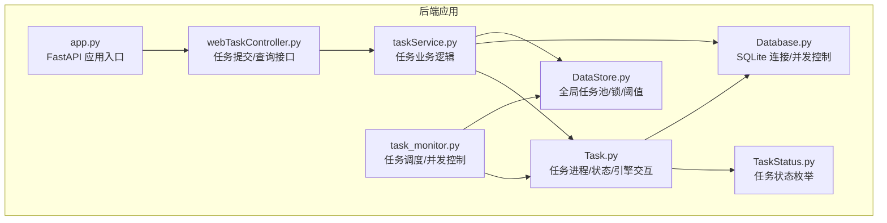
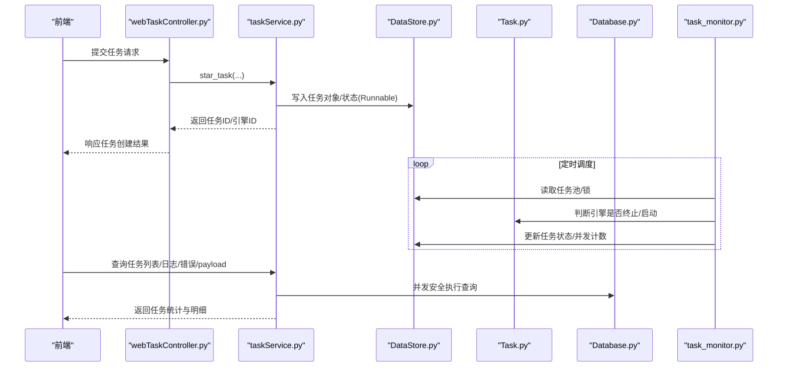
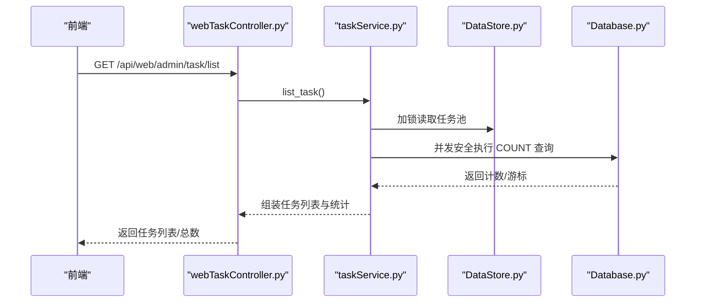
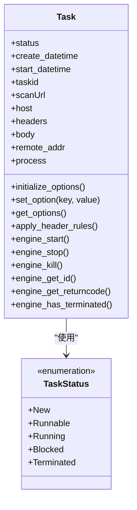
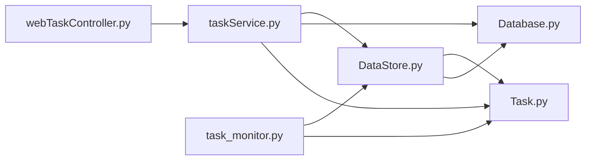

# 性能监控

<cite>
**本文引用的文件**
- [task_monitor.py](file://src/backEnd/utils/task_monitor.py)
- [webTaskController.py](file://src/backEnd/api/commonApi/webTaskController.py)
- [taskService.py](file://src/backEnd/service/taskService.py)
- [DataStore.py](file://src/backEnd/model/DataStore.py)
- [Database.py](file://src/backEnd/model/Database.py)
- [Task.py](file://src/backEnd/model/Task.py)
- [TaskStatus.py](file://src/backEnd/model/TaskStatus.py)
- [app.py](file://src/backEnd/app.py)
</cite>

## 目录
1. [简介](#简介)
2. [项目结构](#项目结构)
3. [核心组件](#核心组件)
4. [架构总览](#架构总览)
5. [详细组件分析](#详细组件分析)
6. [依赖关系分析](#依赖关系分析)
7. [性能考量](#性能考量)
8. [故障排查指南](#故障排查指南)
9. [结论](#结论)
10. [附录](#附录)

## 简介
本文件面向 sqlmapWebUI 的性能监控与可观测性，聚焦以下目标：
- 说明 task_monitor.py 如何实时采集任务执行状态、CPU 使用率，并据此动态调节并发任务上限；
- 解释 webTaskController.py 中任务状态查询接口的性能数据暴露机制；
- 提供 Prometheus 监控集成方案（自定义指标：任务队列长度、扫描速度、并发任务数等）；
- 描述 Grafana 仪表板配置方法，展示关键性能指标可视化；
- 给出性能瓶颈识别方法与优化建议（数据库连接池调优、任务调度策略改进等）。

## 项目结构
后端采用 FastAPI 应用入口，统一挂载多路由模块；任务生命周期由 Task 对象与 DataStore 全局存储协作完成；数据库访问通过 Database 封装 SQLite 连接与并发控制；监控与调度由 task_monitor.py 负责。



图表来源
- [app.py](file://src/backEnd/app.py#L1-L80)
- [webTaskController.py](file://src/backEnd/api/commonApi/webTaskController.py#L1-L91)
- [taskService.py](file://src/backEnd/service/taskService.py#L1-L535)
- [task_monitor.py](file://src/backEnd/utils/task_monitor.py#L1-L94)
- [DataStore.py](file://src/backEnd/model/DataStore.py#L1-L38)
- [Database.py](file://src/backEnd/model/Database.py#L1-L99)
- [Task.py](file://src/backEnd/model/Task.py#L1-L333)
- [TaskStatus.py](file://src/backEnd/model/TaskStatus.py#L1-L9)

章节来源
- [app.py](file://src/backEnd/app.py#L1-L80)

## 核心组件
- 任务调度与并发控制：task_monitor.py 基于 CPU 使用率动态计算最大并发任务数，并驱动 Runnable 任务进入 Running 状态，同时检测引擎进程终止状态更新任务状态。
- 任务状态查询与暴露：webTaskController.py 提供任务提交接口；taskService.py 提供任务列表、日志、错误、payload 等查询能力，这些数据可作为 Prometheus 指标的输入。
- 数据存储与并发：Database.py 使用线程锁与重试机制保障 SQLite 并发安全；DataStore.py 维护全局任务池、并发锁与最大并发阈值。
- 引擎交互：Task.py 启动/停止/杀死 sqlmap 子进程，查询引擎状态，记录任务开始时间，用于计算扫描速度等指标。

章节来源
- [task_monitor.py](file://src/backEnd/utils/task_monitor.py#L1-L94)
- [webTaskController.py](file://src/backEnd/api/commonApi/webTaskController.py#L1-L91)
- [taskService.py](file://src/backEnd/service/taskService.py#L1-L535)
- [DataStore.py](file://src/backEnd/model/DataStore.py#L1-L38)
- [Database.py](file://src/backEnd/model/Database.py#L1-L99)
- [Task.py](file://src/backEnd/model/Task.py#L1-L333)
- [TaskStatus.py](file://src/backEnd/model/TaskStatus.py#L1-L9)

## 架构总览
下面的序列图展示了“任务提交—调度—执行—状态查询”的关键流程，以及监控与指标采集的切入点。



图表来源
- [webTaskController.py](file://src/backEnd/api/commonApi/webTaskController.py#L1-L91)
- [taskService.py](file://src/backEnd/service/taskService.py#L1-L535)
- [DataStore.py](file://src/backEnd/model/DataStore.py#L1-L38)
- [Task.py](file://src/backEnd/model/Task.py#L1-L333)
- [Database.py](file://src/backEnd/model/Database.py#L1-L99)
- [task_monitor.py](file://src/backEnd/utils/task_monitor.py#L1-L94)

## 详细组件分析

### 任务调度与并发控制（task_monitor.py）
- CPU 使用率与并发上限
  - 通过系统 CPU 使用率动态调整最大并发任务数，CPU 使用率越低允许更高并发，反之降低并发，避免资源争抢导致整体吞吐下降。
- 任务状态与启动时机
  - 遍历任务池，对处于 New/Runnable 的任务进行启动；对 Running 任务检测引擎是否终止，若终止则更新为 Terminated。
  - 为避免过于频繁启动，对任务启动时间做最小间隔判断，确保任务稳定进入 Running 状态。
- 关键同步与阈值
  - 使用 DataStore.max_tasks_count_lock 保护并发上限更新；
  - 使用 DataStore.tasks_lock 保护任务池遍历与状态变更；
  - 首次调度时根据 CPU 使用率计算初始阈值，后续可通过外部参数覆盖。

```mermaid
flowchart TD
Start(["进入 monitor"]) --> ReadCores["读取逻辑CPU核心数"]
ReadCores --> GetCPU["获取最近1秒CPU使用率"]
GetCPU --> Decide{"CPU使用率阈值判断"}
Decide --> |低(<20%)| SetHigh["设置高并发阈值"]
Decide --> |中(20%-50%)| SetMid["设置中等并发阈值"]
Decide --> |高(>50%)| SetLow["设置低并发阈值"]
SetHigh --> UpdateMax["更新 DataStore.max_tasks_count"]
SetMid --> UpdateMax
SetLow --> UpdateMax
UpdateMax --> Iterate["遍历任务池"]
Iterate --> Filter{"筛选 Runnable/New/Blocked"}
Filter --> |Runnable| CountRun["统计 Running 数量"]
CountRun --> StartTask{"未达并发上限且满足启动条件?"}
StartTask --> |是| Launch["启动引擎/更新状态为 Running"]
StartTask --> |否| End(["结束本轮"])
Filter --> |New/Blocked| End
Launch --> End
```

图表来源
- [task_monitor.py](file://src/backEnd/utils/task_monitor.py#L1-L94)
- [DataStore.py](file://src/backEnd/model/DataStore.py#L1-L38)
- [Task.py](file://src/backEnd/model/Task.py#L1-L333)

章节来源
- [task_monitor.py](file://src/backEnd/utils/task_monitor.py#L1-L94)
- [DataStore.py](file://src/backEnd/model/DataStore.py#L1-L38)
- [Task.py](file://src/backEnd/model/Task.py#L1-L333)

### 任务状态查询接口（webTaskController.py 与 taskService.py）
- 任务提交接口
  - 接收 Web 端任务请求，校验参数，复用 taskService.star_task，记录来源 IP 与目标 URL，返回任务 ID 与引擎 ID。
- 任务查询接口
  - list_task：聚合每个任务的错误数、日志数、payload 数，计算状态（New/Runnable/Bloced/Terminated/Running），并返回任务列表与总数。
  - find_task_by_taskid/find_task_by_urlPath/find_task_by_header_keyword/find_task_by_bodyKeyWord：多维度检索任务，结合数据库计数查询辅助统计。
  - get_task_log_by_taskid/get_payload_detail_by_task_id/get_task_errors_by_taskId：按任务维度查询日志、payload、错误，支撑性能分析与问题定位。
- 数据一致性与并发
  - 所有查询均在 DataStore.tasks_lock 保护下进行，避免并发修改导致的数据不一致；
  - Database.execute/only_execute 使用线程锁与“locked”异常重试，保证 SQLite 并发安全。



图表来源
- [webTaskController.py](file://src/backEnd/api/commonApi/webTaskController.py#L1-L91)
- [taskService.py](file://src/backEnd/service/taskService.py#L1-L535)
- [DataStore.py](file://src/backEnd/model/DataStore.py#L1-L38)
- [Database.py](file://src/backEnd/model/Database.py#L1-L99)

章节来源
- [webTaskController.py](file://src/backEnd/api/commonApi/webTaskController.py#L1-L91)
- [taskService.py](file://src/backEnd/service/taskService.py#L1-L535)
- [DataStore.py](file://src/backEnd/model/DataStore.py#L1-L38)
- [Database.py](file://src/backEnd/model/Database.py#L1-L99)

### 数据模型与引擎交互（Task.py、TaskStatus.py）
- 任务状态
  - TaskStatus 枚举包含 New、Runnable、Running、Blocked、Terminated，贯穿任务生命周期。
- 引擎交互
  - engine_start：保存配置、写入请求文件、启动 sqlmap 子进程；
  - engine_stop/engine_kill：优雅/强制终止子进程；
  - engine_has_terminated：基于进程返回码判定终止；
  - 记录 create_datetime/start_datetime，用于计算扫描耗时与速度。
- 请求头与临时文件
  - 在启动前应用请求头规则，生成 HTTP 原始请求文件，确保扫描参数与网络环境一致。



图表来源
- [Task.py](file://src/backEnd/model/Task.py#L1-L333)
- [TaskStatus.py](file://src/backEnd/model/TaskStatus.py#L1-L9)

章节来源
- [Task.py](file://src/backEnd/model/Task.py#L1-L333)
- [TaskStatus.py](file://src/backEnd/model/TaskStatus.py#L1-L9)

### 数据存储与并发（Database.py、DataStore.py）
- Database
  - 使用线程锁保护执行；对 SQLite “locked” 错误进行重试；提供 execute/only_execute 两类接口，前者自动 fetchall（SELECT），后者返回游标（便于计数查询）。
- DataStore
  - 维护全局任务池、任务锁、并发上限及其锁；提供会话级请求头管理器单例。

章节来源
- [Database.py](file://src/backEnd/model/Database.py#L1-L99)
- [DataStore.py](file://src/backEnd/model/DataStore.py#L1-L38)

## 依赖关系分析
- 组件耦合
  - taskService 依赖 DataStore（任务池/锁/阈值）、Database（并发查询）、Task（引擎交互）；
  - task_monitor 依赖 DataStore（并发阈值/任务池）、Task（引擎状态）；
  - webTaskController 依赖 taskService 与 FastAPI 路由框架。
- 外部依赖
  - psutil 用于 CPU 使用率采集；
  - sqlite3 用于本地数据库存储；
  - 第三方 sqlmap 引擎通过子进程方式运行。



图表来源
- [webTaskController.py](file://src/backEnd/api/commonApi/webTaskController.py#L1-L91)
- [taskService.py](file://src/backEnd/service/taskService.py#L1-L535)
- [task_monitor.py](file://src/backEnd/utils/task_monitor.py#L1-L94)
- [DataStore.py](file://src/backEnd/model/DataStore.py#L1-L38)
- [Database.py](file://src/backEnd/model/Database.py#L1-L99)
- [Task.py](file://src/backEnd/model/Task.py#L1-L333)

## 性能考量

### 1) 任务队列长度与并发任务数
- 当前实现
  - 通过 CPU 使用率动态计算最大并发任务数，避免系统过载；
  - 任务池遍历与状态更新在锁内进行，保证一致性。
- 建议
  - 引入队列长度指标：当前排队任务数（Runnable/New）；
  - 引入并发任务数指标：当前 Running 任务数；
  - 可考虑引入“启动延迟”指标：从 Runnable 到 Running 的平均等待时间。

章节来源
- [task_monitor.py](file://src/backEnd/utils/task_monitor.py#L1-L94)
- [DataStore.py](file://src/backEnd/model/DataStore.py#L1-L38)

### 2) 扫描速度与吞吐
- 当前实现
  - 任务对象记录 create_datetime/start_datetime，可用于计算单任务耗时；
  - 任务列表接口聚合错误/日志/payload 计数，便于评估扫描进度与产出。
- 建议
  - 引入“每任务扫描耗时”、“每任务 payload 数”、“每任务错误数”等指标；
  - 引入“总体吞吐量”：单位时间内完成的任务数或 payload 数。

章节来源
- [Task.py](file://src/backEnd/model/Task.py#L1-L333)
- [taskService.py](file://src/backEnd/service/taskService.py#L1-L535)

### 3) 数据库连接池与并发
- 当前实现
  - Database 使用线程锁与“locked”重试，避免并发写入冲突；
  - 仅执行 SELECT 的计数查询通过 only_execute 返回游标，减少一次性 fetch。
- 建议
  - 评估 SQLite 是否适合高并发写入场景，必要时考虑：
    - 使用 WAL 模式提升并发；
    - 引入连接池（如 sqlite3 的 timeout 与 check_same_thread 参数合理配置）；
    - 对高频查询增加索引（已有若干索引，可进一步评估热点字段）。

章节来源
- [Database.py](file://src/backEnd/model/Database.py#L1-L99)

### 4) 任务调度策略改进
- 当前实现
  - 基于 CPU 使用率的简单阈值策略；
  - 启动任务前有最小间隔判断，避免频繁启动。
- 建议
  - 引入更精细的调度策略：如基于历史吞吐与错误率的自适应并发；
  - 引入优先级队列：高优先级任务先启动；
  - 引入背压机制：当数据库写入压力过大时降低并发。

章节来源
- [task_monitor.py](file://src/backEnd/utils/task_monitor.py#L1-L94)
- [Database.py](file://src/backEnd/model/Database.py#L1-L99)

## 故障排查指南
- 健康检查
  - 应用提供 /api/health 接口，返回健康状态、版本与运行时长，便于前端监控后端可用性。
- 任务状态异常
  - 若任务长时间停留在 New/Runnable，检查 task_monitor 是否正确更新并发阈值与启动条件；
  - 若任务被标记为 Terminated，检查 Task.engine_has_terminated 的判定逻辑与引擎进程退出码。
- 数据库写入阻塞
  - 若出现 SQLite locked 异常，确认 Database.execute/only_execute 的重试逻辑是否生效；评估并发写入峰值与 WAL 模式配置。

章节来源
- [app.py](file://src/backEnd/app.py#L1-L80)
- [Task.py](file://src/backEnd/model/Task.py#L1-L333)
- [Database.py](file://src/backEnd/model/Database.py#L1-L99)

## 结论
sqlmapWebUI 已具备基础的并发调度与任务状态管理能力，能够通过 CPU 使用率动态调节并发上限，并在任务池层面提供较为完整的状态与统计信息。为进一步完善性能监控体系，建议：
- 在现有接口基础上扩展 Prometheus 自定义指标（任务队列长度、并发任务数、扫描速度、吞吐量等）；
- 在 Grafana 中建立关键指标仪表板，结合健康检查与告警策略；
- 针对数据库写入压力与任务调度策略进行持续优化，提升系统整体稳定性与吞吐。

## 附录

### Prometheus 监控集成方案（建议）
- 指标设计
  - 任务队列长度：gauge 类型，当前 Runnable/New 任务数；
  - 并发任务数：gauge 类型，当前 Running 任务数；
  - 扫描速度：counter 类型，累计 payload 数/错误数；
  - CPU 使用率：gauge 类型，来自 psutil；
  - 数据库锁等待次数：counter 类型，统计 SQLite locked 重试次数；
  - 任务启动延迟：histogram 类型，从 Runnable 到 Running 的耗时分布。
- 暴露方式
  - 在 FastAPI 中新增 /metrics 端点，导出上述指标；
  - 在 task_monitor.py 中采集 CPU 使用率与并发阈值；
  - 在 taskService.py 的 list_task 等查询中统计计数与耗时；
  - 在 Database.execute/only_execute 中统计“locked”重试次数。
- 抓取配置
  - Prometheus 抓取 /metrics，设置合适的 scrape_interval 与超时；
  - Grafana 导入 Prometheus 数据源，创建仪表板。

[本节为通用实践建议，不直接分析具体文件，故不附“章节来源”]

### Grafana 仪表板配置方法（建议）
- 指标面板
  - CPU 使用率趋势；
  - 任务队列长度与并发任务数；
  - 扫描速度（payload 数/分钟）、错误数/分钟；
  - 数据库锁等待次数；
  - 任务启动延迟分布。
- 告警规则
  - 并发任务数超过阈值；
  - 任务启动延迟显著上升；
  - 数据库锁等待次数异常增长；
  - 健康检查失败。

[本节为通用实践建议，不直接分析具体文件，故不附“章节来源”]