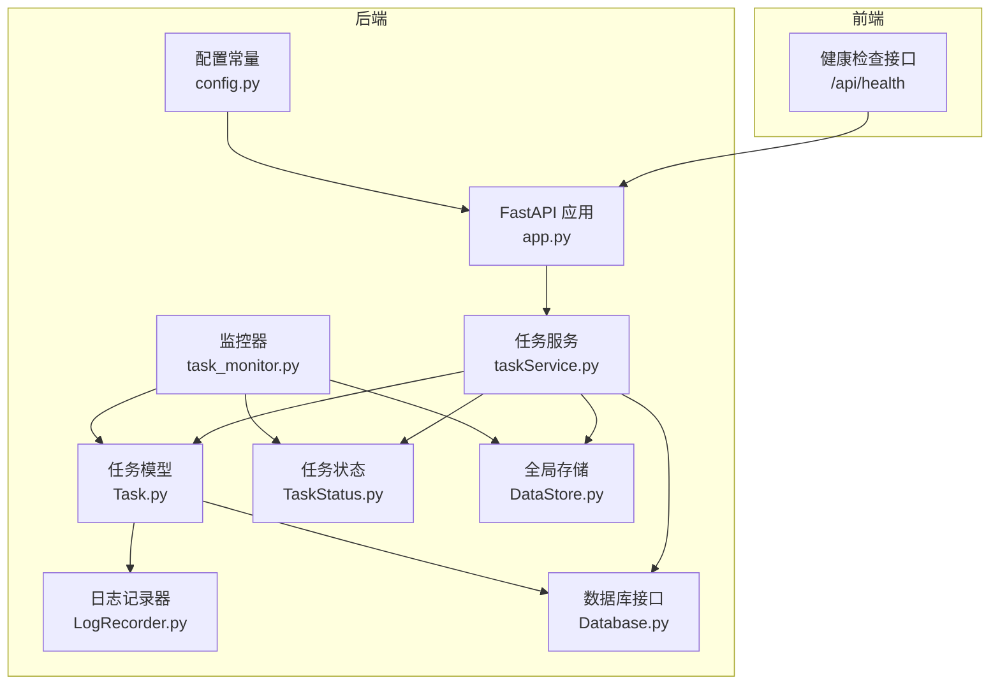
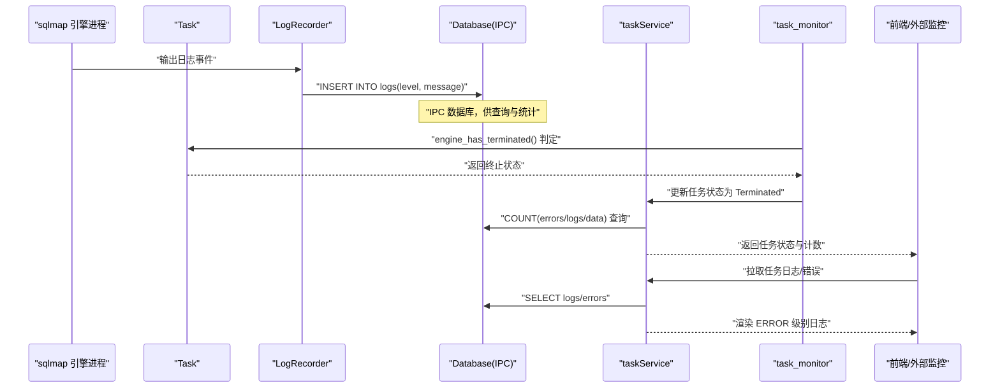
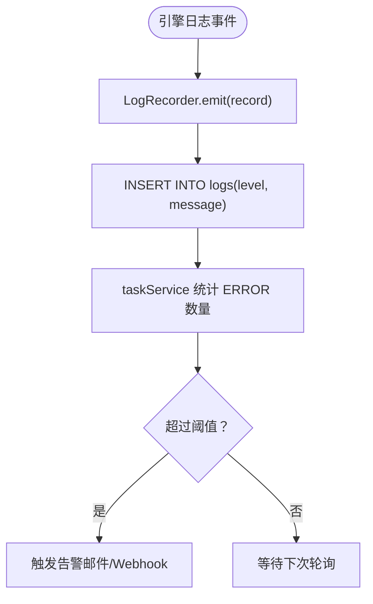
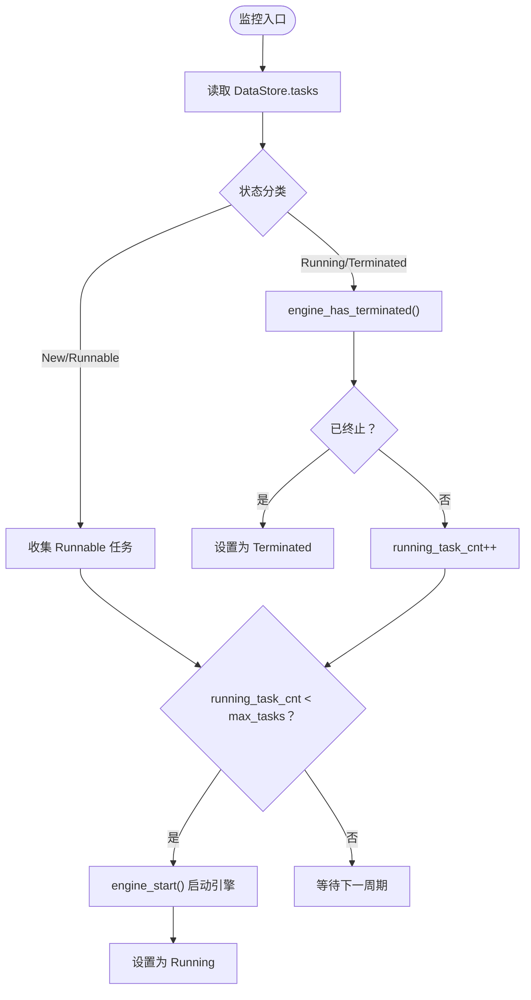
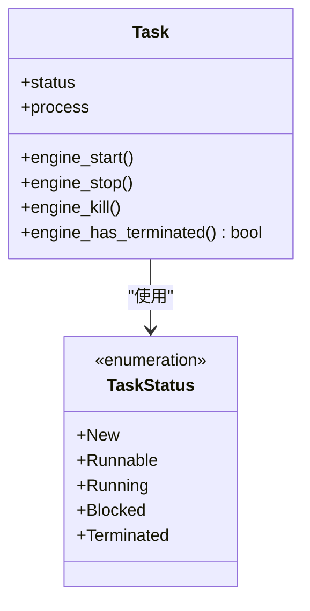
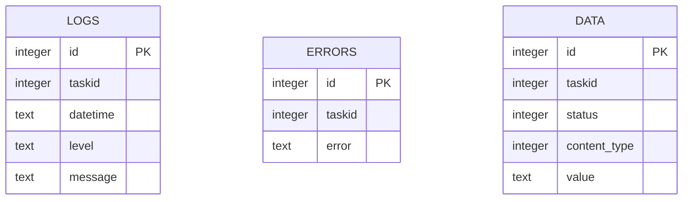
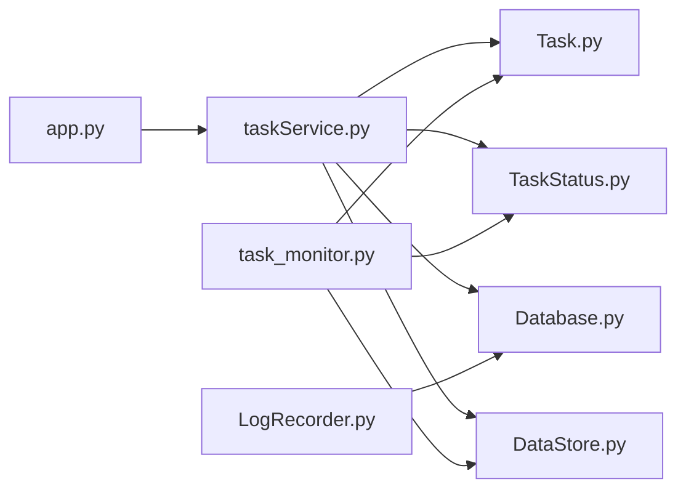

# 故障告警

<cite>
**本文引用的文件**
- [LogRecorder.py](file://src/backEnd/model/LogRecorder.py)
- [task_monitor.py](file://src/backEnd/utils/task_monitor.py)
- [Task.py](file://src/backEnd/model/Task.py)
- [TaskStatus.py](file://src/backEnd/model/TaskStatus.py)
- [taskService.py](file://src/backEnd/service/taskService.py)
- [Database.py](file://src/backEnd/model/Database.py)
- [DataStore.py](file://src/backEnd/model/DataStore.py)
- [app.py](file://src/backEnd/app.py)
- [config.py](file://src/backEnd/config.py)
</cite>

## 目录
1. [简介](#简介)
2. [项目结构](#项目结构)
3. [核心组件](#核心组件)
4. [架构总览](#架构总览)
5. [详细组件分析](#详细组件分析)
6. [依赖关系分析](#依赖关系分析)
7. [性能与稳定性考量](#性能与稳定性考量)
8. [故障模式与应对策略](#故障模式与应对策略)
9. [告警规则配置指南](#告警规则配置指南)
10. [集成主流告警系统最佳实践](#集成主流告警系统最佳实践)
11. [故障排查指南](#故障排查指南)
12. [结论](#结论)

## 简介
本文件面向 sqlmapWebUI 的运维与开发人员，系统阐述平台的异常检测与告警机制。重点覆盖以下方面：
- 基于 LogRecorder.py 的日志级别（尤其是 ERROR 级别）触发告警的路径与数据流
- task_monitor.py 对任务异常状态（如超时、崩溃）的检测逻辑
- 告警规则配置指南（阈值与通知渠道）
- 常见故障模式分析与应对策略（数据库连接失败、sqlmap 引擎异常退出等）
- 集成 Alertmanager 等主流告警系统的最佳实践

## 项目结构
后端采用 FastAPI 提供 REST 接口，任务调度与监控由 Python 层完成；日志与错误记录通过 SQLite IPC 数据库存储，前端负责展示与交互。

图表来源
- [app.py](file://src/backEnd/app.py#L1-L80)
- [taskService.py](file://src/backEnd/service/taskService.py#L1-L120)
- [Task.py](file://src/backEnd/model/Task.py#L258-L333)
- [TaskStatus.py](file://src/backEnd/model/TaskStatus.py#L1-L9)
- [task_monitor.py](file://src/backEnd/utils/task_monitor.py#L1-L94)
- [LogRecorder.py](file://src/backEnd/model/LogRecorder.py#L1-L18)
- [Database.py](file://src/backEnd/model/Database.py#L1-L99)
- [DataStore.py](file://src/backEnd/model/DataStore.py#L1-L38)
- [config.py](file://src/backEnd/config.py#L1-L8)

章节来源
- [app.py](file://src/backEnd/app.py#L1-L80)
- [taskService.py](file://src/backEnd/service/taskService.py#L1-L120)
- [Task.py](file://src/backEnd/model/Task.py#L258-L333)
- [task_monitor.py](file://src/backEnd/utils/task_monitor.py#L1-L94)
- [LogRecorder.py](file://src/backEnd/model/LogRecorder.py#L1-L18)
- [Database.py](file://src/backEnd/model/Database.py#L1-L99)
- [DataStore.py](file://src/backEnd/model/DataStore.py#L1-L38)
- [config.py](file://src/backEnd/config.py#L1-L8)

## 核心组件
- 日志记录器 LogRecorder：将 sqlmap 引擎产生的日志事件写入 IPC 数据库的 logs 表，便于后续查询与告警。
- 任务模型 Task：封装任务生命周期、引擎进程管理、请求文件生成与引擎启动。
- 任务状态 TaskStatus：统一的任务状态枚举，驱动监控器的状态判定。
- 任务服务 taskService：对外提供任务增删改查、状态转换、日志与错误查询等能力。
- 监控器 task_monitor：按 CPU 负载动态调整并发任务上限，检测引擎是否终止并更新状态。
- 数据库 Database：SQLite IPC 数据库封装，提供并发安全的执行与初始化。
- 全局存储 DataStore：维护任务集合、数据库连接、并发上限等全局状态。
- 健康检查接口：提供 /api/health 用于外部监控系统探测。

章节来源
- [LogRecorder.py](file://src/backEnd/model/LogRecorder.py#L1-L18)
- [Task.py](file://src/backEnd/model/Task.py#L258-L333)
- [TaskStatus.py](file://src/backEnd/model/TaskStatus.py#L1-L9)
- [taskService.py](file://src/backEnd/service/taskService.py#L1-L120)
- [task_monitor.py](file://src/backEnd/utils/task_monitor.py#L1-L94)
- [Database.py](file://src/backEnd/model/Database.py#L1-L99)
- [DataStore.py](file://src/backEnd/model/DataStore.py#L1-L38)
- [app.py](file://src/backEnd/app.py#L61-L80)

## 架构总览
下图展示了“日志采集—状态检测—查询统计—告警触发”的闭环流程。

图表来源
- [LogRecorder.py](file://src/backEnd/model/LogRecorder.py#L1-L18)
- [Task.py](file://src/backEnd/model/Task.py#L318-L333)
- [taskService.py](file://src/backEnd/service/taskService.py#L110-L176)
- [task_monitor.py](file://src/backEnd/utils/task_monitor.py#L60-L94)
- [Database.py](file://src/backEnd/model/Database.py#L72-L99)

## 详细组件分析

### 日志记录与 ERROR 触发告警
- LogRecorder 将日志事件写入 logs 表，字段包含 taskid、datetime、level、message。
- 前端与 taskService 可通过 COUNT(errors/logs/data) 与 SELECT logs/errors 实时统计 ERROR 数量，作为告警依据。
- 建议：在外部监控系统中，定期查询 logs 表中 ERROR 级别数量，结合阈值触发告警。

图表来源
- [LogRecorder.py](file://src/backEnd/model/LogRecorder.py#L1-L18)
- [taskService.py](file://src/backEnd/service/taskService.py#L110-L176)
- [Database.py](file://src/backEnd/model/Database.py#L72-L99)

章节来源
- [LogRecorder.py](file://src/backEnd/model/LogRecorder.py#L1-L18)
- [taskService.py](file://src/backEnd/service/taskService.py#L110-L176)
- [Database.py](file://src/backEnd/model/Database.py#L72-L99)

### 任务异常状态检测（超时/崩溃）
- task_monitor 通过 engine_has_terminated() 判断引擎是否退出，并将状态置为 Terminated。
- 当运行中的任务数低于并发上限时，从 Runnable 列表中择机启动引擎，带有限时保护（如启动时间窗口）。
- 建议：将“连续 N 个任务在短时间内终止”或“某任务 ERROR 数量激增”作为告警规则。

图表来源
- [task_monitor.py](file://src/backEnd/utils/task_monitor.py#L36-L94)
- [Task.py](file://src/backEnd/model/Task.py#L258-L333)
- [TaskStatus.py](file://src/backEnd/model/TaskStatus.py#L1-L9)

章节来源
- [task_monitor.py](file://src/backEnd/utils/task_monitor.py#L36-L94)
- [Task.py](file://src/backEnd/model/Task.py#L258-L333)
- [TaskStatus.py](file://src/backEnd/model/TaskStatus.py#L1-L9)

### 任务生命周期与引擎进程管理
- Task.engine_start() 负责生成请求文件、保存配置、启动 sqlmap 子进程。
- Task.engine_stop/engine_kill 用于停止/强制终止引擎进程。
- Task.engine_has_terminated 用于判断进程是否退出。

图表来源
- [Task.py](file://src/backEnd/model/Task.py#L258-L333)
- [TaskStatus.py](file://src/backEnd/model/TaskStatus.py#L1-L9)

章节来源
- [Task.py](file://src/backEnd/model/Task.py#L258-L333)
- [TaskStatus.py](file://src/backEnd/model/TaskStatus.py#L1-L9)

### 数据库与 IPC 存储
- Database 初始化 logs、data、errors 表及索引，支持并发安全执行。
- taskService 通过 COUNT 和 SELECT 对 logs/errors/data 进行统计与查询，作为告警输入。

图表来源
- [Database.py](file://src/backEnd/model/Database.py#L72-L99)
- [taskService.py](file://src/backEnd/service/taskService.py#L110-L176)

章节来源
- [Database.py](file://src/backEnd/model/Database.py#L72-L99)
- [taskService.py](file://src/backEnd/service/taskService.py#L110-L176)

## 依赖关系分析
- taskService 依赖 Task、TaskStatus、Database、DataStore。
- task_monitor 依赖 TaskStatus、Task、DataStore。
- LogRecorder 依赖第三方 sqlmap 的 conf/logger。
- app.py 提供健康检查接口，供外部监控系统探测。

图表来源
- [taskService.py](file://src/backEnd/service/taskService.py#L1-L120)
- [task_monitor.py](file://src/backEnd/utils/task_monitor.py#L1-L94)
- [LogRecorder.py](file://src/backEnd/model/LogRecorder.py#L1-L18)
- [app.py](file://src/backEnd/app.py#L1-L80)

章节来源
- [taskService.py](file://src/backEnd/service/taskService.py#L1-L120)
- [task_monitor.py](file://src/backEnd/utils/task_monitor.py#L1-L94)
- [LogRecorder.py](file://src/backEnd/model/LogRecorder.py#L1-L18)
- [app.py](file://src/backEnd/app.py#L1-L80)

## 性能与稳定性考量
- 并发上限动态调整：task_monitor 根据 CPU 使用率动态决定最大并发任务数，避免资源争用导致的抖动。
- 数据库锁竞争：Database.execute/only_execute 使用锁与重试机制，缓解 SQLite 锁定问题。
- 启动延迟保护：监控器对任务启动时间进行窗口限制，防止频繁启停。

章节来源
- [task_monitor.py](file://src/backEnd/utils/task_monitor.py#L11-L33)
- [Database.py](file://src/backEnd/model/Database.py#L35-L71)

## 故障模式与应对策略
- 数据库连接失败
  - 现象：taskService 在查询 logs/errors 时返回错误或 None。
  - 原因：IPC 数据库未初始化或连接异常。
  - 应对：在 taskService 中增加数据库连接检查与重试；对外暴露健康检查接口供监控系统探测。
  章节来源
  - [taskService.py](file://src/backEnd/service/taskService.py#L110-L126)
  - [app.py](file://src/backEnd/app.py#L61-L80)

- sqlmap 引擎异常退出
  - 现象：Task.engine_has_terminated() 返回 True，任务被标记为 Terminated。
  - 原因：引擎进程异常、参数错误、目标不可达等。
  - 应对：结合 logs/errors 统计 ERROR 数量，触发告警；必要时自动重试或降级参数。
  章节来源
  - [Task.py](file://src/backEnd/model/Task.py#L318-L333)
  - [task_monitor.py](file://src/backEnd/utils/task_monitor.py#L60-L94)

- 超时/卡死
  - 现象：任务长时间处于 Running 且无新日志/错误。
  - 原因：网络超时、目标响应慢、引擎卡住。
  - 应对：引入“无进展超时”阈值（如 X 分钟无新增日志），标记为异常并告警。
  章节来源
  - [taskService.py](file://src/backEnd/service/taskService.py#L110-L176)

- 并发过高导致抖动
  - 现象：CPU 使用率高时任务频繁终止或启动失败。
  - 应对：降低 max_tasks_count，观察系统恢复后再逐步提升。
  章节来源
  - [task_monitor.py](file://src/backEnd/utils/task_monitor.py#L11-L33)

## 告警规则配置指南
以下规则建议在外部监控系统（如 Prometheus + Alertmanager、Grafana、Zabbix 等）中实现，结合 sqlmapWebUI 的数据源（logs/errors 表）与健康检查接口。

- 基于 ERROR 数量的告警
  - 规则示例：统计最近 5 分钟内每个任务的 ERROR 数量，若超过阈值则触发告警。
  - 数据来源：taskService 查询 logs 表 COUNT(errors)。
  - 适用场景：数据库连接失败、解析异常、WAF 拦截等。

- 基于任务终止率的告警
  - 规则示例：近 10 分钟内连续终止的任务数占比超过阈值，触发告警。
  - 数据来源：task_monitor 对 engine_has_terminated() 的判定与状态更新。
  - 适用场景：引擎异常退出、参数错误、目标不稳定。

- 基于无进展超时的告警
  - 规则示例：任务在最近 3 分钟内无新增日志/错误，标记为异常并告警。
  - 数据来源：taskService 查询 logs 表 COUNT(logs) 并对比时间戳。
  - 适用场景：网络超时、目标卡死、引擎卡住。

- 基于健康检查的告警
  - 规则示例：/api/health 探测失败或响应时间过长。
  - 数据来源：app.py 健康检查接口。
  - 适用场景：服务不可用、进程崩溃。

- 通知渠道
  - 邮件：适合重要故障与确认通知。
  - Webhook：对接企业 IM（如钉钉、飞书、Slack）或工单系统。
  - 电话/短信：针对 P0/P1 级别故障。

章节来源
- [taskService.py](file://src/backEnd/service/taskService.py#L110-L176)
- [task_monitor.py](file://src/backEnd/utils/task_monitor.py#L60-L94)
- [app.py](file://src/backEnd/app.py#L61-L80)

## 集成主流告警系统最佳实践
- Prometheus + Alertmanager
  - 使用 HTTP API 抓取 /api/health 作为存活探针。
  - 自定义 Exporter 或脚本定期查询 logs/errors 表，暴露指标（如 error_count_per_task）。
  - 在 Alertmanager 中配置静默窗口、抑制规则，避免风暴传播。

- Grafana
  - 以 logs/errors 表为数据源，绘制 ERROR 数量趋势图。
  - 结合告警面板联动，快速定位任务与错误类型。

- Zabbix
  - 使用 HTTP Agent/Script 方式调用 /api/health。
  - 通过自定义脚本查询数据库指标，建立触发器。

- 企业 IM/Webhook
  - 在告警系统中配置 Webhook，将告警消息推送到企业 IM。
  - 建议包含任务 ID、错误摘要、时间戳、日志链接等上下文信息。

[本节为通用实践建议，不直接分析具体文件，故无章节来源]

## 故障排查指南
- 快速定位
  - 使用 /api/health 确认服务可用。
  - 通过 taskService 的日志与错误查询接口，查看最近 ERROR 与日志条目。
- 常见问题
  - 数据库未初始化：检查 Database.init 是否执行，logs/errors 表是否存在。
  - 引擎无法启动：检查 Task.engine_start 的请求文件与配置是否正确。
  - 并发过高：降低 max_tasks_count，观察系统恢复。
- 建议操作
  - 开启 DEBUG 日志，复现问题并抓取 logs/errors。
  - 使用 task_monitor 的并发策略，避免瞬时压力过大。

章节来源
- [app.py](file://src/backEnd/app.py#L61-L80)
- [taskService.py](file://src/backEnd/service/taskService.py#L110-L176)
- [Database.py](file://src/backEnd/model/Database.py#L72-L99)
- [task_monitor.py](file://src/backEnd/utils/task_monitor.py#L11-L33)

## 结论
sqlmapWebUI 的告警体系以“日志与错误统计 + 任务状态检测 + 健康检查”为核心，结合外部监控系统可实现多维度、可配置的故障告警。建议优先落地 ERROR 数量与任务终止率两类规则，并配合健康检查与无进展超时规则，形成闭环监控与快速处置能力。