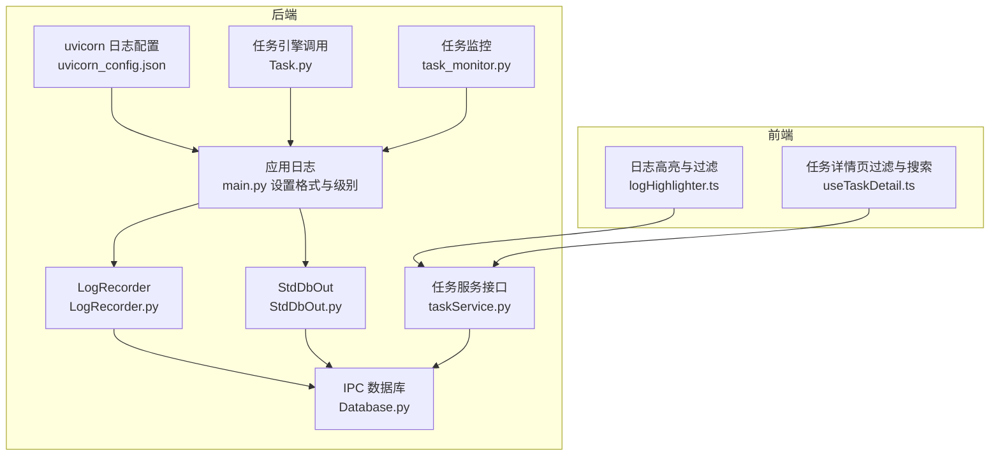
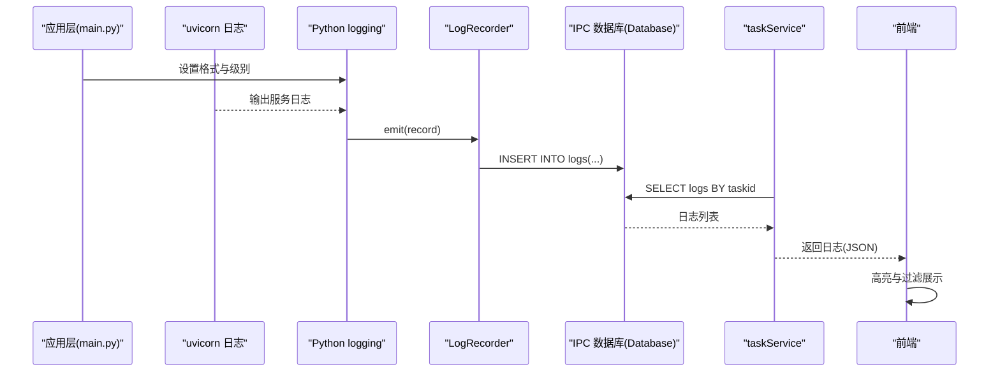
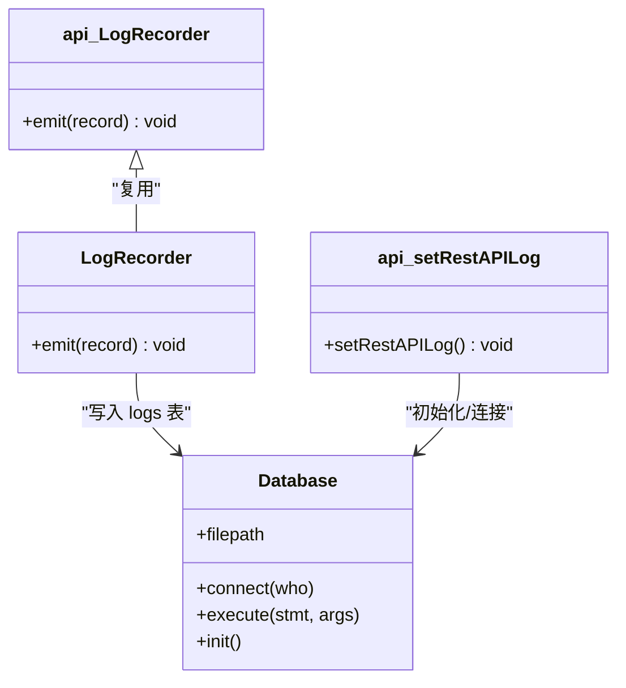
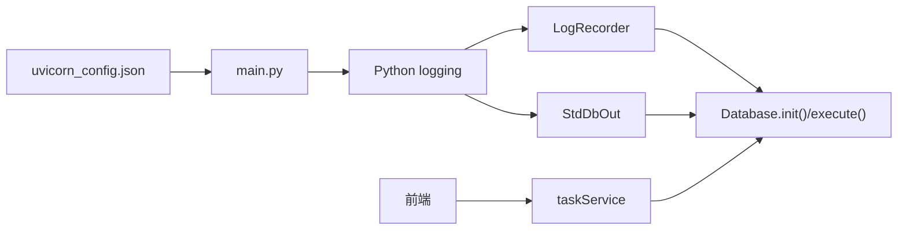

# 日志管理

<cite>
**本文引用的文件**
- [LogRecorder.py](file://src/backEnd/model/LogRecorder.py)
- [task_monitor.py](file://src/backEnd/utils/task_monitor.py)
- [Database.py](file://src/backEnd/model/Database.py)
- [taskService.py](file://src/backEnd/service/taskService.py)
- [Task.py](file://src/backEnd/model/Task.py)
- [main.py](file://src/backEnd/main.py)
- [uvicorn_config.json](file://src/backEnd/uvicorn_config.json)
- [logHighlighter.ts](file://src/frontEnd/src/utils/logHighlighter.ts)
- [useTaskDetail.ts](file://src/frontEnd/src/views/TaskDetail/composables/useTaskDetail.ts)
- [api.py](file://src/backEnd/third_lib/sqlmap/lib/utils/api.py)
- [sqlmap.py](file://src/backEnd/third_lib/sqlmap/sqlmap.py)
- [StdDbOut.py](file://src/backEnd/model/StdDbOut.py)
</cite>

## 目录
1. [简介](#简介)
2. [项目结构与日志相关模块](#项目结构与日志相关模块)
3. [核心组件](#核心组件)
4. [架构总览](#架构总览)
5. [详细组件分析](#详细组件分析)
6. [依赖关系分析](#依赖关系分析)
7. [性能与可靠性考量](#性能与可靠性考量)
8. [故障排查指南](#故障排查指南)
9. [结论](#结论)
10. [附录：日志格式与最佳实践](#附录日志格式与最佳实践)

## 简介
本文件面向 sqlmapWebUI 的日志管理，围绕 LogRecorder 的实现机制展开，系统说明：
- 日志级别（DEBUG、INFO、WARNING、ERROR、CRITICAL）的配置与使用场景
- 日志文件存储路径、轮转与归档机制
- 如何通过 task_monitor.py 捕获任务执行关键事件并写入日志
- 日志分析最佳实践（grep、awk 等工具）
- 日志格式规范与自定义日志处理器扩展方法

## 项目结构与日志相关模块
- 后端日志体系由三部分组成：
  - 基于 Python logging 的标准日志（uvicorn、应用层）
  - 基于 SQLMap 的日志注入（LogRecorder）
  - 基于 SQLMap 的标准输出/错误重定向（StdDbOut）写入 IPC 数据库
- 前端提供日志高亮与过滤能力，便于可视化分析

图表来源
- [uvicorn_config.json](file://src/backEnd/uvicorn_config.json#L1-L45)
- [main.py](file://src/backEnd/main.py#L103-L127)
- [LogRecorder.py](file://src/backEnd/model/LogRecorder.py#L1-L18)
- [StdDbOut.py](file://src/backEnd/model/StdDbOut.py#L1-L35)
- [Database.py](file://src/backEnd/model/Database.py#L72-L99)
- [Task.py](file://src/backEnd/model/Task.py#L258-L297)
- [task_monitor.py](file://src/backEnd/utils/task_monitor.py#L36-L94)
- [taskService.py](file://src/backEnd/service/taskService.py#L405-L417)
- [logHighlighter.ts](file://src/frontEnd/src/utils/logHighlighter.ts#L35-L265)
- [useTaskDetail.ts](file://src/frontEnd/src/views/TaskDetail/composables/useTaskDetail.ts#L208-L278)

章节来源
- [uvicorn_config.json](file://src/backEnd/uvicorn_config.json#L1-L45)
- [main.py](file://src/backEnd/main.py#L103-L127)
- [LogRecorder.py](file://src/backEnd/model/LogRecorder.py#L1-L18)
- [StdDbOut.py](file://src/backEnd/model/StdDbOut.py#L1-L35)
- [Database.py](file://src/backEnd/model/Database.py#L72-L99)
- [Task.py](file://src/backEnd/model/Task.py#L258-L297)
- [task_monitor.py](file://src/backEnd/utils/task_monitor.py#L36-L94)
- [taskService.py](file://src/backEnd/service/taskService.py#L405-L417)
- [logHighlighter.ts](file://src/frontEnd/src/utils/logHighlighter.ts#L35-L265)
- [useTaskDetail.ts](file://src/frontEnd/src/views/TaskDetail/composables/useTaskDetail.ts#L208-L278)

## 核心组件
- LogRecorder：自定义日志处理器，将 Python logging 的记录写入 IPC SQLite 数据库 logs 表
- StdDbOut：重定向标准输出/错误到 IPC 数据库 data 和 errors 表
- Database：IPC 数据库初始化与并发访问控制
- taskService：对外提供按任务拉取日志的接口
- uvicorn_config.json：统一的 uvicorn 日志格式与级别
- main.py：应用启动时设置日志格式与级别
- 前端日志高亮与过滤：logHighlighter.ts、useTaskDetail.ts

章节来源
- [LogRecorder.py](file://src/backEnd/model/LogRecorder.py#L1-L18)
- [StdDbOut.py](file://src/backEnd/model/StdDbOut.py#L1-L35)
- [Database.py](file://src/backEnd/model/Database.py#L72-L99)
- [taskService.py](file://src/backEnd/service/taskService.py#L405-L417)
- [uvicorn_config.json](file://src/backEnd/uvicorn_config.json#L1-L45)
- [main.py](file://src/backEnd/main.py#L103-L127)
- [logHighlighter.ts](file://src/frontEnd/src/utils/logHighlighter.ts#L35-L265)
- [useTaskDetail.ts](file://src/frontEnd/src/views/TaskDetail/composables/useTaskDetail.ts#L208-L278)

## 架构总览
后端通过 uvicorn_config.json 与 main.py 统一日志格式；LogRecorder 将 Python logging 的记录写入 IPC 数据库；StdDbOut 将 SQLMap 引擎的标准输出/错误写入 IPC 数据库；前端通过 taskService 接口拉取日志并进行高亮与过滤。

图表来源
- [main.py](file://src/backEnd/main.py#L103-L127)
- [uvicorn_config.json](file://src/backEnd/uvicorn_config.json#L1-L45)
- [LogRecorder.py](file://src/backEnd/model/LogRecorder.py#L1-L18)
- [Database.py](file://src/backEnd/model/Database.py#L72-L99)
- [taskService.py](file://src/backEnd/service/taskService.py#L405-L417)
- [logHighlighter.ts](file://src/frontEnd/src/utils/logHighlighter.ts#L35-L265)

## 详细组件分析

### LogRecorder 实现机制
- 角色：继承 logging.StreamHandler，拦截日志记录并写入 IPC 数据库 logs 表
- 关键点：
  - 使用 conf.taskid 识别任务上下文
  - 使用 time.strftime("%X") 记录时间（本地时间）
  - 使用 record.levelname 记录级别
  - 使用 record.msg 与 record.args 格式化消息
- 与 SQLMap 集成：setRestAPILog 中替换默认日志处理器为 LogRecorder，并建立 conf.databaseCursor

图表来源
- [LogRecorder.py](file://src/backEnd/model/LogRecorder.py#L1-L18)
- [Database.py](file://src/backEnd/model/Database.py#L72-L99)
- [api.py](file://src/backEnd/third_lib/sqlmap/lib/utils/api.py#L273-L293)

章节来源
- [LogRecorder.py](file://src/backEnd/model/LogRecorder.py#L1-L18)
- [api.py](file://src/backEnd/third_lib/sqlmap/lib/utils/api.py#L273-L293)

### StdDbOut 标准输出/错误重定向
- 角色：重定向 sys.stdout/sys.stderr 到 IPC 数据库 data/errors 表
- 关键点：
  - stdout：按 content_type 分段写入 data 表，支持进度拼接与完整覆盖
  - stderr：写入 errors 表
- 与 SQLMap 集成：setRestAPILog 中设置 StdDbOut 并替换标准流

章节来源
- [StdDbOut.py](file://src/backEnd/model/StdDbOut.py#L1-L35)
- [api.py](file://src/backEnd/third_lib/sqlmap/lib/utils/api.py#L222-L269)

### IPC 数据库设计与并发
- logs 表：记录 Python logging 的日志
- data 表：记录 SQLMap 引擎输出（按 content_type 分段）
- errors 表：记录 SQLMap 引擎错误
- Database 提供线程锁与重试机制，避免数据库锁定导致的 OperationalError

章节来源
- [Database.py](file://src/backEnd/model/Database.py#L72-L99)

### 任务监控与日志采集
- task_monitor.py：
  - 动态计算最大并发任务数，基于 CPU 使用率与逻辑核心数
  - 对任务状态进行判定与启动，期间大量使用 logger.debug/info/warning
  - 通过 DataStore.tasks 与 Task.engine_start/engine_stop 控制引擎生命周期
- Task.engine_start：
  - 应用请求头规则、生成 HTTP 请求文件、保存配置并启动 SQLMap 子进程
  - 期间记录调试与信息日志，便于追踪任务生命周期

章节来源
- [task_monitor.py](file://src/backEnd/utils/task_monitor.py#L36-L94)
- [Task.py](file://src/backEnd/model/Task.py#L258-L297)

### 日志接口与前端展示
- taskService.get_logs_by_task_id：
  - 从 logs 表按 taskid 查询日志，返回时间、级别、消息
- 前端：
  - logHighlighter.ts：对日志进行语法高亮与统计
  - useTaskDetail.ts：提供按级别、来源、正则/大小写敏感等过滤与搜索

章节来源
- [taskService.py](file://src/backEnd/service/taskService.py#L405-L417)
- [logHighlighter.ts](file://src/frontEnd/src/utils/logHighlighter.ts#L35-L265)
- [useTaskDetail.ts](file://src/frontEnd/src/views/TaskDetail/composables/useTaskDetail.ts#L208-L278)

## 依赖关系分析
- 日志格式与级别
  - uvicorn_config.json 定义默认与访问日志格式，统一字段顺序与颜色
  - main.py 在启动时设置 logging.Formatter，并将该格式应用到现有 handlers
- 日志处理器链路
  - Python logging：由 uvicorn 与应用层共同产生
  - LogRecorder：拦截 Python logging 并写入 IPC 数据库
  - StdDbOut：拦截 SQLMap 引擎输出/错误并写入 IPC 数据库
- 数据库依赖
  - Database 初始化 logs/data/errors 表，提供并发安全的 execute/only_execute
- 前端依赖
  - 通过 taskService 接口消费后端日志数据，前端负责展示与过滤

图表来源
- [uvicorn_config.json](file://src/backEnd/uvicorn_config.json#L1-L45)
- [main.py](file://src/backEnd/main.py#L103-L127)
- [LogRecorder.py](file://src/backEnd/model/LogRecorder.py#L1-L18)
- [StdDbOut.py](file://src/backEnd/model/StdDbOut.py#L1-L35)
- [Database.py](file://src/backEnd/model/Database.py#L72-L99)
- [taskService.py](file://src/backEnd/service/taskService.py#L405-L417)

## 性能与可靠性考量
- 数据库并发
  - Database.execute 使用线程锁与“locked”异常重试，降低并发写入冲突
- 日志写入路径
  - LogRecorder 与 StdDbOut 均写入 IPC SQLite，避免磁盘 IO 开销，适合 WebUI 场景
- 日志量控制
  - 建议仅在 DEBUG/INFO 级别保留必要日志，避免过多 INFO/DEBUG 导致 IPC 表膨胀
- 前端渲染
  - 前端高亮与过滤在浏览器侧进行，建议分页或增量加载，避免超大数据集导致卡顿

[本节为通用指导，不直接分析具体文件]

## 故障排查指南
- 日志无法拉取
  - 检查 taskService 是否正确查询 logs 表（按 taskid 排序）
  - 检查 Database 是否初始化成功（logs 表是否存在）
- 日志缺失
  - 确认 setRestAPILog 是否被调用（SQLMap API 模式）
  - 确认 LogRecorder 是否被添加到 logger
- 数据库锁定
  - 查看 Database.execute 是否抛出 OperationalError，确认重试逻辑是否生效
- 前端显示异常
  - 检查 logHighlighter.ts 与 useTaskDetail.ts 的过滤逻辑与正则表达式

章节来源
- [taskService.py](file://src/backEnd/service/taskService.py#L405-L417)
- [Database.py](file://src/backEnd/model/Database.py#L72-L99)
- [api.py](file://src/backEnd/third_lib/sqlmap/lib/utils/api.py#L273-L293)
- [logHighlighter.ts](file://src/frontEnd/src/utils/logHighlighter.ts#L35-L265)
- [useTaskDetail.ts](file://src/frontEnd/src/views/TaskDetail/composables/useTaskDetail.ts#L208-L278)

## 结论
sqlmapWebUI 的日志体系采用“Python logging + SQLMap 注入”的双通道设计：
- Python logging 通过 LogRecorder 写入 IPC 数据库，统一格式与级别
- SQLMap 引擎通过 StdDbOut 写入 data/errors 表，便于实时展示与错误收集
- 前端提供高亮与过滤能力，提升可读性与定位效率
- 通过 task_monitor.py 与 Task.engine_start 等关键节点记录任务生命周期事件，便于审计与排障

[本节为总结，不直接分析具体文件]

## 附录：日志格式与最佳实践

### 日志级别与使用场景
- DEBUG：调试细节、内部流程、参数校验
- INFO：关键流程节点、任务启动/停止、状态变更
- WARNING：潜在问题、非致命异常、配置警告
- ERROR：错误、异常、外部依赖失败
- CRITICAL：严重错误、系统性失败、需要人工干预

章节来源
- [main.py](file://src/backEnd/main.py#L125-L126)
- [Task.py](file://src/backEnd/model/Task.py#L68-L73)
- [Task.py](file://src/backEnd/model/Task.py#L159-L163)
- [Task.py](file://src/backEnd/model/Task.py#L168-L170)
- [Task.py](file://src/backEnd/model/Task.py#L258-L297)
- [task_monitor.py](file://src/backEnd/utils/task_monitor.py#L36-L94)

### 日志文件存储路径、轮转与归档
- 存储路径
  - IPC SQLite 数据库位于临时目录（由 main.py 生成），文件名为 mkstemp 生成的临时文件
  - 该路径在运行时动态生成，不固定
- 轮转与归档
  - 代码未实现传统文件轮转/归档；IPC 数据库通过表结构与查询接口承载日志生命周期
  - 建议在生产环境中：
    - 定期清理旧任务日志（按 taskid 或时间戳）
    - 对高频任务限制日志条数或按级别裁剪
    - 将重要日志导出到集中式日志系统（如 ELK/OTEL）

章节来源
- [main.py](file://src/backEnd/main.py#L135-L144)
- [Database.py](file://src/backEnd/model/Database.py#L72-L99)

### 通过 task_monitor.py 捕获关键事件
- 动态计算最大并发任务数，结合 CPU 使用率与逻辑核心数
- 对任务状态进行判定与启动，期间记录调试/信息/警告日志
- 适用于定位资源瓶颈与任务调度异常

章节来源
- [task_monitor.py](file://src/backEnd/utils/task_monitor.py#L36-L94)

### 日志格式说明
- Python logging 格式（uvicorn_config.json + main.py）
  - 字段顺序：时间戳、日志级别、模块名、文件名、行号、消息
  - 时间格式：YYYY-MM-DD HH:MM:SS
- SQLMap 日志格式（LogRecorder）
  - 字段：任务ID、时间（本地时间）、级别、消息
- SQLMap 输出/错误格式（StdDbOut）
  - 输出：按 content_type 分段写入 data 表
  - 错误：写入 errors 表

章节来源
- [uvicorn_config.json](file://src/backEnd/uvicorn_config.json#L1-L45)
- [main.py](file://src/backEnd/main.py#L103-L106)
- [LogRecorder.py](file://src/backEnd/model/LogRecorder.py#L1-L18)
- [StdDbOut.py](file://src/backEnd/model/StdDbOut.py#L1-L35)

### 自定义日志处理器扩展方法
- 扩展点
  - 继承 logging.Handler，实现 emit(record) 将日志写入自定义目标（如远程日志服务、队列）
  - 在 setRestAPILog 或应用启动阶段替换/添加处理器
- 注意事项
  - 保证线程安全与幂等性
  - 控制日志量，避免阻塞主流程
  - 与现有日志格式保持一致，便于前端解析

章节来源
- [LogRecorder.py](file://src/backEnd/model/LogRecorder.py#L1-L18)
- [api.py](file://src/backEnd/third_lib/sqlmap/lib/utils/api.py#L273-L293)

### 日志分析最佳实践（grep/awk 等）
- 快速定位错误
  - grep -i "error\|exception\|critical" 日志文件
  - awk '/ERROR|CRITICAL/ {print NR ": " $0}' 日志文件
- 按任务筛选
  - grep "任务ID" 日志文件
  - awk -F'[|]' '$3 ~ /任务ID/ {print}' 日志文件（若字段分隔符为“|”）
- 统计级别分布
  - awk '/\[INFO\]/ {info++} /DEBUG/ {debug++} /WARNING/ {warn++} /ERROR/ {err++} /CRITICAL/ {crit++} END {print "INFO:", info, "DEBUG:", debug, "WARN:", warn, "ERROR:", err, "CRIT:", crit}'
- 时间范围过滤
  - grep "YYYY-MM-DD HH:" 日志文件
  - awk '/YYYY-MM-DD HH:/,/^$/' 日志文件

[本节为通用指导，不直接分析具体文件]