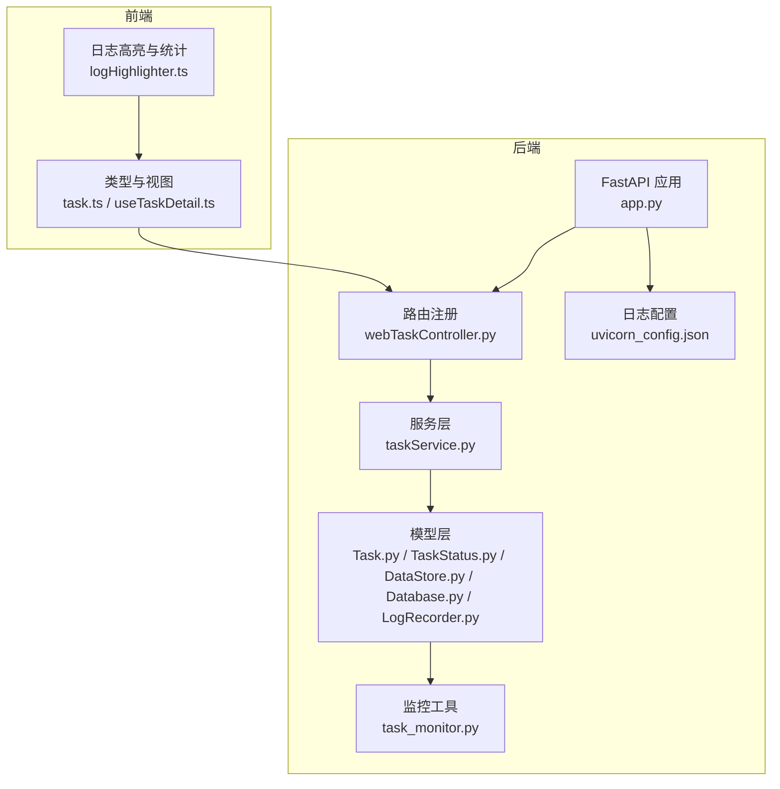
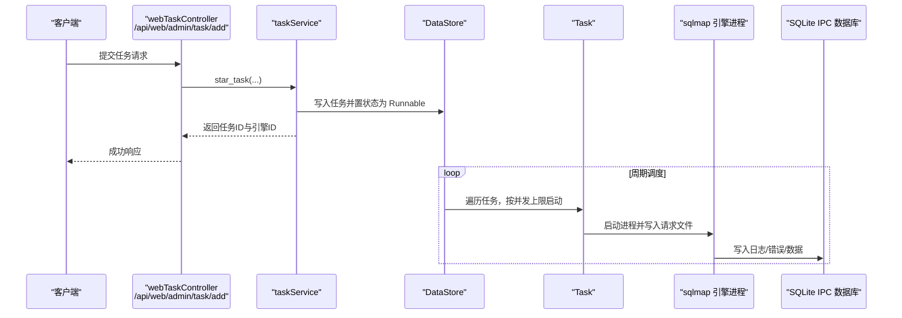
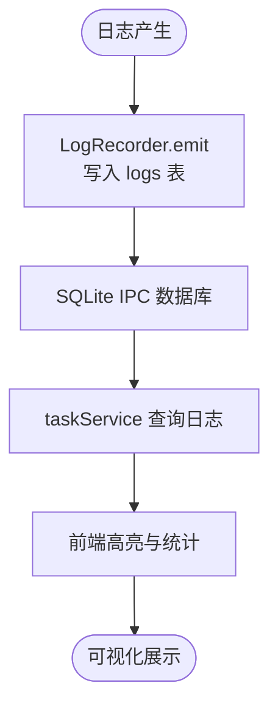
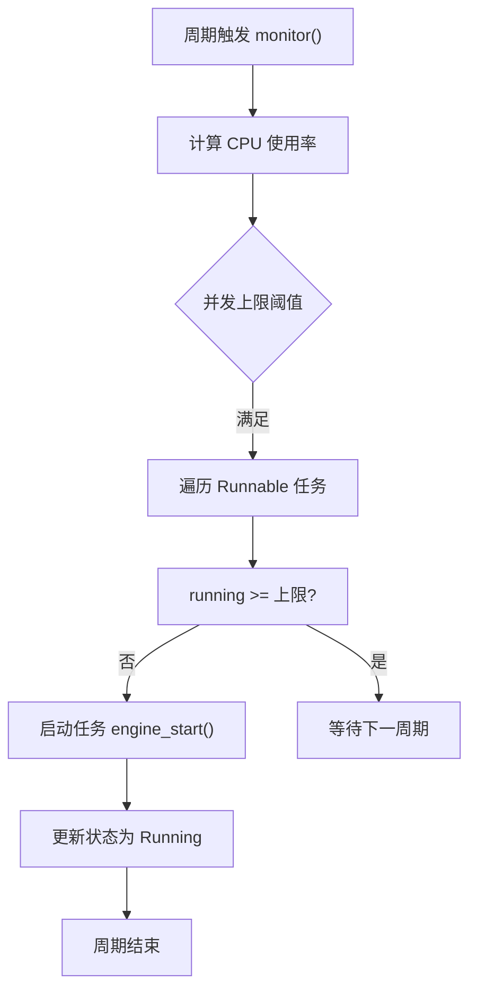
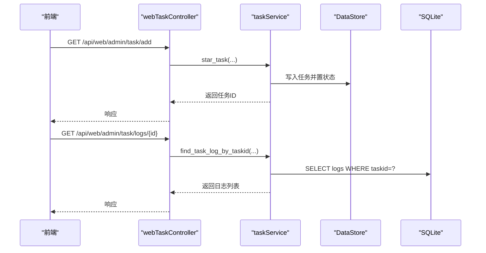
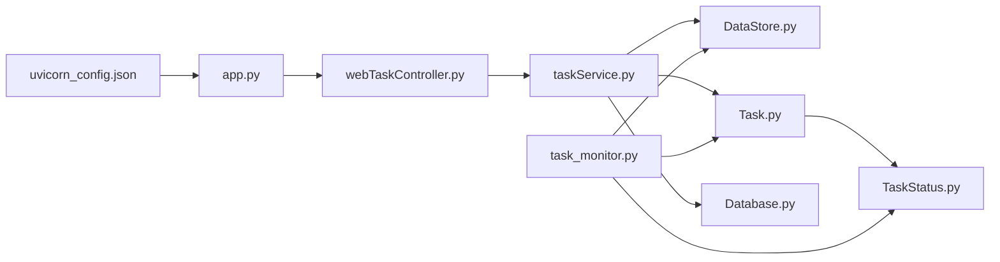

# 服务监控

<cite>
**本文档引用的文件**
- [app.py](file://src/backEnd/app.py)
- [config.py](file://src/backEnd/config.py)
- [uvicorn_config.json](file://src/backEnd/uvicorn_config.json)
- [LogRecorder.py](file://src/backEnd/model/LogRecorder.py)
- [Database.py](file://src/backEnd/model/Database.py)
- [DataStore.py](file://src/backEnd/model/DataStore.py)
- [Task.py](file://src/backEnd/model/Task.py)
- [TaskStatus.py](file://src/backEnd/model/TaskStatus.py)
- [task_monitor.py](file://src/backEnd/utils/task_monitor.py)
- [taskService.py](file://src/backEnd/service/taskService.py)
- [webTaskController.py](file://src/backEnd/api/commonApi/webTaskController.py)
- [task.ts](file://src/frontEnd/src/types/task.ts)
- [logHighlighter.ts](file://src/frontEnd/src/utils/logHighlighter.ts)
- [useTaskDetail.ts](file://src/frontEnd/src/views/TaskDetail/composables/useTaskDetail.ts)
</cite>

## 目录
1. [简介](#简介)
2. [项目结构](#项目结构)
3. [核心组件](#核心组件)
4. [架构总览](#架构总览)
5. [详细组件分析](#详细组件分析)
6. [依赖关系分析](#依赖关系分析)
7. [性能与资源监控](#性能与资源监控)
8. [故障排查指南](#故障排查指南)
9. [结论](#结论)
10. [附录](#附录)

## 简介
本文件面向运维与平台工程团队，系统化梳理 sqlmapWebUI 的监控体系与运维实践，覆盖以下主题：
- 日志记录机制：LogRecorder 的实现原理、日志级别与来源标记
- 任务监控系统：task_monitor 的动态并发控制与任务生命周期管理
- API 端点监控：webTaskController 的任务状态查询与健康检查
- Prometheus/Grafana 集成建议：指标暴露与告警规则设计
- 常见监控指标与异常响应流程

## 项目结构
后端采用 FastAPI + Uvicorn，日志通过标准库 logging 与自定义 LogRecorder 输出到 SQLite IPC 数据库；任务调度由 DataStore 维护，Task 对象封装引擎进程生命周期；前端提供日志高亮与统计能力。

图表来源
- [app.py](file://src/backEnd/app.py#L1-L80)
- [webTaskController.py](file://src/backEnd/api/commonApi/webTaskController.py#L1-L91)
- [taskService.py](file://src/backEnd/service/taskService.py#L1-L535)
- [Task.py](file://src/backEnd/model/Task.py#L1-L333)
- [TaskStatus.py](file://src/backEnd/model/TaskStatus.py#L1-L9)
- [DataStore.py](file://src/backEnd/model/DataStore.py#L1-L38)
- [Database.py](file://src/backEnd/model/Database.py#L1-L99)
- [LogRecorder.py](file://src/backEnd/model/LogRecorder.py#L1-L18)
- [task_monitor.py](file://src/backEnd/utils/task_monitor.py#L1-L94)
- [uvicorn_config.json](file://src/backEnd/uvicorn_config.json#L1-L45)
- [task.ts](file://src/frontEnd/src/types/task.ts#L40-L95)
- [logHighlighter.ts](file://src/frontEnd/src/utils/logHighlighter.ts#L124-L265)
- [useTaskDetail.ts](file://src/frontEnd/src/views/TaskDetail/composables/useTaskDetail.ts#L762-L804)

章节来源
- [app.py](file://src/backEnd/app.py#L1-L80)
- [uvicorn_config.json](file://src/backEnd/uvicorn_config.json#L1-L45)

## 核心组件
- 日志记录与存储
  - 自定义 LogRecorder 将日志事件写入 SQLite 表 logs，字段包含任务标识、时间、级别与消息。
  - 后端使用标准 logging，并通过 uvicorn 的默认/访问格式化器输出到 stderr/stdout。
- 任务生命周期与并发控制
  - Task 封装 sqlmap 引擎进程生命周期，TaskStatus 定义 New/Runnable/Running/Bloked/Terminated。
  - DataStore 维护全局任务字典与并发上限，task_monitor 动态计算最大并发并调度启动。
- API 端点与监控
  - webTaskController 提供任务提交与状态查询接口，app.py 提供健康检查与版本信息。
  - taskService 查询 logs/data/errors 表统计任务日志量、注入数据量与错误数，支撑前端展示。

章节来源
- [LogRecorder.py](file://src/backEnd/model/LogRecorder.py#L1-L18)
- [Database.py](file://src/backEnd/model/Database.py#L1-L99)
- [uvicorn_config.json](file://src/backEnd/uvicorn_config.json#L1-L45)
- [Task.py](file://src/backEnd/model/Task.py#L1-L333)
- [TaskStatus.py](file://src/backEnd/model/TaskStatus.py#L1-L9)
- [DataStore.py](file://src/backEnd/model/DataStore.py#L1-L38)
- [task_monitor.py](file://src/backEnd/utils/task_monitor.py#L1-L94)
- [webTaskController.py](file://src/backEnd/api/commonApi/webTaskController.py#L1-L91)
- [taskService.py](file://src/backEnd/service/taskService.py#L1-L535)
- [app.py](file://src/backEnd/app.py#L1-L80)

## 架构总览
后端服务通过 FastAPI 暴露 REST 接口，任务提交与状态查询由 webTaskController 路由处理；服务层 taskService 负责任务池管理与数据库统计；task_monitor 周期性调度任务启动；日志通过 LogRecorder 写入 SQLite，前端负责日志高亮与统计。

图表来源
- [webTaskController.py](file://src/backEnd/api/commonApi/webTaskController.py#L1-L91)
- [taskService.py](file://src/backEnd/service/taskService.py#L1-L535)
- [DataStore.py](file://src/backEnd/model/DataStore.py#L1-L38)
- [Task.py](file://src/backEnd/model/Task.py#L1-L333)
- [Database.py](file://src/backEnd/model/Database.py#L1-L99)

## 详细组件分析

### 日志记录机制与级别配置
- LogRecorder 实现
  - 继承 logging.StreamHandler，重写 emit 将日志写入 logs 表，字段包含 taskid、时间、级别与消息。
  - 通过 third_lib.sqlmap 的 conf.databaseCursor 插入记录，实现与 sqlmap 引擎的 IPC 数据库通信。
- 日志级别与来源标记
  - 后端使用标准 logging，uvicorn 默认格式化器输出，包含时间、级别、模块、文件与行号。
  - webTaskController 在任务提交前后记录 INFO/WARNING/DEBUG/ERROR 等级别日志，便于区分来源（如“[Web]”）。
- 日志查询与前端展示
  - taskService 提供按任务查询日志的接口，返回 datetime、level、message 列表。
  - 前端提供日志高亮与统计功能，支持按级别过滤与关键词检索。

图表来源
- [LogRecorder.py](file://src/backEnd/model/LogRecorder.py#L1-L18)
- [Database.py](file://src/backEnd/model/Database.py#L1-L99)
- [taskService.py](file://src/backEnd/service/taskService.py#L396-L418)
- [logHighlighter.ts](file://src/frontEnd/src/utils/logHighlighter.ts#L124-L265)

章节来源
- [LogRecorder.py](file://src/backEnd/model/LogRecorder.py#L1-L18)
- [uvicorn_config.json](file://src/backEnd/uvicorn_config.json#L1-L45)
- [webTaskController.py](file://src/backEnd/api/commonApi/webTaskController.py#L1-L91)
- [taskService.py](file://src/backEnd/service/taskService.py#L396-L418)
- [logHighlighter.ts](file://src/frontEnd/src/utils/logHighlighter.ts#L124-L265)

### 任务监控系统工作方式
- 动态并发上限
  - get_max_tasks_count 根据 CPU 使用率动态调整最大并发：低占用时允许更高并发，高占用时降低并发。
  - monitor 在 DataStore 上下文中读取/更新 max_tasks_count，并遍历任务队列，将 Runnable 任务启动为 Running。
- 任务状态管理
  - TaskStatus 定义任务状态枚举；Task 封装引擎进程生命周期，支持 start/stop/kill/has_terminated。
  - taskService 提供任务列表、删除、停止、启动等操作，并基于 engine_has_terminated 判断 Running/Terminated。
- 调度策略
  - 当 running 数小于上限时，优先启动 Runnable 任务；若任务有启动时间限制，延迟启动以平滑资源压力。

图表来源
- [task_monitor.py](file://src/backEnd/utils/task_monitor.py#L1-L94)
- [Task.py](file://src/backEnd/model/Task.py#L1-L333)
- [TaskStatus.py](file://src/backEnd/model/TaskStatus.py#L1-L9)
- [DataStore.py](file://src/backEnd/model/DataStore.py#L1-L38)

章节来源
- [task_monitor.py](file://src/backEnd/utils/task_monitor.py#L1-L94)
- [Task.py](file://src/backEnd/model/Task.py#L1-L333)
- [TaskStatus.py](file://src/backEnd/model/TaskStatus.py#L1-L9)
- [DataStore.py](file://src/backEnd/model/DataStore.py#L1-L38)

### API 端点监控方法
- 任务提交与状态查询
  - webTaskController 提供任务提交接口，记录来源与参数，复用 taskService 的业务逻辑。
  - taskService 提供按任务查询日志、错误、payload、HTTP 请求与扫描选项等接口，返回结构化数据。
- 健康检查与版本信息
  - app.py 提供 /api/health 与 /api/version，返回服务健康状态、运行时长与版本号，便于前端与外部监控系统拉取。

图表来源
- [webTaskController.py](file://src/backEnd/api/commonApi/webTaskController.py#L1-L91)
- [taskService.py](file://src/backEnd/service/taskService.py#L1-L535)
- [app.py](file://src/backEnd/app.py#L61-L80)

章节来源
- [webTaskController.py](file://src/backEnd/api/commonApi/webTaskController.py#L1-L91)
- [taskService.py](file://src/backEnd/service/taskService.py#L1-L535)
- [app.py](file://src/backEnd/app.py#L61-L80)

### 前端日志与任务统计
- 类型与统计
  - task.ts 定义日志条目与任务统计结构，前端据此渲染任务概览与详情。
- 日志高亮与过滤
  - logHighlighter.ts 提供日志高亮与统计，useTaskDetail.ts 提供按级别、来源与时间范围的过滤逻辑。

章节来源
- [task.ts](file://src/frontEnd/src/types/task.ts#L40-L95)
- [logHighlighter.ts](file://src/frontEnd/src/utils/logHighlighter.ts#L124-L265)
- [useTaskDetail.ts](file://src/frontEnd/src/views/TaskDetail/composables/useTaskDetail.ts#L762-L804)

## 依赖关系分析
- 组件耦合
  - webTaskController 依赖 taskService；taskService 依赖 DataStore、Task、Database；Task 依赖 TaskStatus 与第三方 sqlmap。
  - task_monitor 仅依赖 DataStore、TaskStatus、psutil，耦合度低，便于扩展。
- 外部依赖
  - Uvicorn 日志格式化器；sqlite3；psutil；第三方 sqlmap 引擎。

图表来源
- [webTaskController.py](file://src/backEnd/api/commonApi/webTaskController.py#L1-L91)
- [taskService.py](file://src/backEnd/service/taskService.py#L1-L535)
- [DataStore.py](file://src/backEnd/model/DataStore.py#L1-L38)
- [Task.py](file://src/backEnd/model/Task.py#L1-L333)
- [TaskStatus.py](file://src/backEnd/model/TaskStatus.py#L1-L9)
- [Database.py](file://src/backEnd/model/Database.py#L1-L99)
- [task_monitor.py](file://src/backEnd/utils/task_monitor.py#L1-L94)
- [app.py](file://src/backEnd/app.py#L1-L80)
- [uvicorn_config.json](file://src/backEnd/uvicorn_config.json#L1-L45)

## 性能与资源监控
- CPU 与并发
  - task_monitor 基于 psutil.cpu_percent(interval=1) 动态调整最大并发，避免高负载导致任务堆积。
- 内存与进程
  - Task 封装引擎进程生命周期，提供 stop/kill/get_id/get_returncode 等方法，便于资源回收与异常处理。
- 任务队列长度
  - DataStore.tasks 维护任务池，可通过 taskService 的 list_task 接口统计任务总数与状态分布。
- 日志与数据库
  - Database.init 创建 logs/data/errors 表与索引，taskService 通过 COUNT 查询统计日志/错误/数据量，支撑前端展示。

章节来源
- [task_monitor.py](file://src/backEnd/utils/task_monitor.py#L1-L94)
- [Task.py](file://src/backEnd/model/Task.py#L1-L333)
- [DataStore.py](file://src/backEnd/model/DataStore.py#L1-L38)
- [Database.py](file://src/backEnd/model/Database.py#L1-L99)
- [taskService.py](file://src/backEnd/service/taskService.py#L102-L177)

## 故障排查指南
- 常见问题定位
  - 任务无法启动：检查 task_monitor 是否达到并发上限、Task.engine_start 是否成功创建请求文件与配置文件。
  - 日志缺失：确认 LogRecorder 是否被安装到 sqlmap logger，Database 是否初始化并创建 logs 表。
  - 健康检查失败：查看 app.py 的 /api/health 返回的 uptime 与版本信息，核对 uvicorn 日志级别。
- 响应流程
  - webTaskController 在参数校验失败或异常时返回明确的 BaseResponseMsg，前端据此提示用户。
  - taskService 在数据库未初始化或查询异常时返回错误码与消息，便于前端与监控系统识别。

章节来源
- [webTaskController.py](file://src/backEnd/api/commonApi/webTaskController.py#L1-L91)
- [taskService.py](file://src/backEnd/service/taskService.py#L1-L535)
- [app.py](file://src/backEnd/app.py#L61-L80)
- [Database.py](file://src/backEnd/model/Database.py#L1-L99)

## 结论
sqlmapWebUI 的监控体系以“日志可观测 + 任务调度可观测 + API 健康可观测”为核心，结合 SQLite IPC 数据库存储与前端高亮统计，形成闭环。建议在此基础上引入 Prometheus/Grafana，通过自定义指标暴露与告警规则进一步提升自动化运维能力。

## 附录

### Prometheus/Grafana 监控集成方案（建议）
- 指标暴露
  - 使用 Python 客户端库（如 prometheus_client）在后端暴露以下指标：
    - 计数器：任务提交次数、任务启动次数、任务停止次数、任务删除次数
    - 计数器：日志级别计数（info/warning/error/critical）、错误计数
    - 布尔/标签：任务状态分布（New/Runnable/Running/Blocked/Terminated）
    - 布尔/标签：健康状态（/api/health）
    - 摘要/直方图：任务启动耗时、日志查询耗时
  - 指标命名参考：sqlmapwebui_task_count、sqlmapwebui_log_level_count、sqlmapwebui_health_status
- 告警规则示例
  - 任务启动失败率过高
  - 日志 ERROR/CRITICAL 比例异常升高
  - 健康检查失败或 uptime 异常下降
  - 并发上限长期处于最小值，表明 CPU 过载
- Grafana 面板建议
  - 任务状态分布饼图
  - 日志级别趋势图
  - 健康检查与版本信息卡片
  - CPU 使用率与并发上限对比图

[本节为概念性方案，不直接分析具体源码文件，故无“章节来源”与“图表来源”标注]